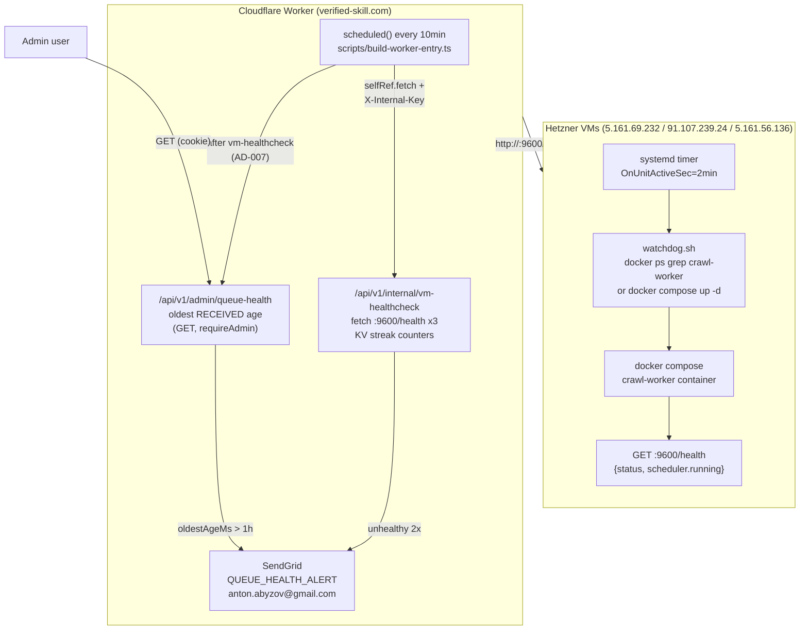

# Implementation Plan: Hetzner crawl-worker watchdog (defense in depth)

## Overview

Three independent recovery layers prevent silent multi-week outages of the verified-skill.com submission pipeline. The 2026-03-09 incident (half-finished `scanner-worker/deploy.sh` left containers stopped on all 3 Hetzner VMs for 6+ weeks) demonstrated that Docker `restart: unless-stopped` cannot recover from manual stops or aborted deploys, and that no existing alarm fires when the entire crawl tier is offline.

This increment adds three orthogonal layers, each catching a distinct failure mode, with no new infrastructure (reuses systemd, existing CF Cron `*/10 * * * *`, existing SendGrid). All work targets `repositories/anton-abyzov/vskill-platform/`.

## Architecture

### High-level diagram



### Layer responsibilities

| Layer | Catches | Cadence | Misses |
|-------|---------|---------|--------|
| L1 — VM-side systemd timer | Container stopped (manual/crash/half-deploy). Restart within 2min. | Every 2 min on each VM | Host offline, network partition, dead scheduler in running container |
| L2 — CF Cron VM-healthcheck | Host offline, systemd broken, container running but `/health` reports `scheduler.running=false`. | Every 10 min from CF | CF cron itself broken |
| L3 — Admin queue-health endpoint + auto-alert | Backstop — oldest RECEIVED age. Catches "VMs healthy but queue stuck" (DB issues, claim-loop bugs, Tier-2 failures). | On-demand (GET) + auto from cron after L2 | Nothing — final eyeball + auto-page |

## Existing infrastructure to reuse (do NOT rebuild)

- **Cron dispatch**: `scripts/build-worker-entry.ts:103-287` already has the `scheduled()` handler with multiple `ctx.waitUntil(runWithWorkerEnv(env, ...))` blocks. Add a **new** block alongside the reconciler-ensure block at lines 259-286 — never modify the existing blocks. Pattern (verified at line 272): `selfRef.fetch("https://verified-skill.com/api/v1/internal/<route>", { method: "POST", headers: { "X-Internal-Key": internalKey } })`.
- **Internal route auth**: `src/app/api/v1/internal/enqueue-submissions/route.ts:31-41` shows the canonical X-Internal-Key + `timingSafeEqualString(key, env.INTERNAL_BROADCAST_KEY)` check from `@/lib/crypto/timing-safe-equal`. Copy verbatim.
- **Admin route auth**: `src/lib/auth.ts` `requireAdmin()` + `isAuthError()`. Model new admin route after `src/app/api/v1/admin/submissions/state-counts/route.ts:19-66` — short, single-Prisma-query + KV cache pattern.
- **DB**: `getDb()` + `withDbTimeout()` from `src/lib/db.ts`. Submission model at `prisma/schema.prisma:150-209` already has `@@index([state])` and `@@index([createdAt])` — `findFirst({ where: { state: 'RECEIVED' }, orderBy: { createdAt: 'asc' } })` is single-row index hit, sub-millisecond on Neon.
- **Email**: `src/lib/email.ts` SendGrid (FROM `noreply@verified-skill.com`). Add new `EmailType` `QUEUE_HEALTH_ALERT` + matching template + render branch in the existing render switch.
- **Per-VM deploy**: `scanner-worker/deploy.sh:95-108` — iterates per-VM, scp's per-VM `.env`, runs `docker compose up -d` (line 99), then health-checks (lines 105-107). Insert watchdog install **after line 99** and **before line 105** so the install is verified by the post-deploy health probe in the same SSH session.
- **/health endpoint**: `crawl-worker/server.js:99-110` returns `{ status: "ok", activeCrawls, maxConcurrent, scheduler: { running, sourceCount } }`. **L2 must verify `body.status === "ok" && body.scheduler.running === true`** — not just HTTP 200 — so a running container with a stuck scheduler is also detected (AD-003).

## Architecture Decisions

### AD-001: Three-layer defense in depth (orthogonal failure modes)

**Decision:** Implement all three layers — VM-side systemd timer (L1), CF Cron healthcheck (L2), and admin queue-health endpoint with auto-alert from cron (L3). Do not collapse into one.

**Rationale:** Each layer catches what the others miss (see matrix above). L1 alone misses host-offline. L2 alone misses inter-tick crashes (a VM that dies at minute 1 stays dead until minute 10 — not acceptable for a 24/7 submission pipeline). L3 catches "VMs healthy but queue stuck" — failures that have nothing to do with the crawl tier but produce identical user-visible symptoms (stale RECEIVED). The 2026-03-09 incident specifically required L2-class detection: containers were stopped, hosts were up, no L1 was installed yet.

**Alternatives rejected:** "Just add L1" — leaves 6-week silent-failure mode for half-deploys that disable L1 itself. "Just L2" — 10min recovery latency vs L1's 2min; also can't recover from L2-side bugs. "Just L3" — doesn't recover, only alerts; we want self-healing.

### AD-002: Reuse SendGrid for alerting (no Slack/Discord)

**Decision:** Send all alerts via existing SendGrid (`src/lib/email.ts`) to `anton.abyzov@gmail.com`, using a new `QUEUE_HEALTH_ALERT` email type.

**Rationale:** The user already monitors this inbox (it receives all submission-lifecycle mail). Adding Slack/Discord introduces a new dependency, secret, and outage-correlation surface (a CF outage can take down our alerter). Email + the user's mail-app push notification is fast enough for a 2-min SLO. Zero new infra.

**Alternatives rejected:** Slack webhook (new secret, new failure mode), PagerDuty (cost + setup overhead for a single-engineer ops surface).

### AD-003: VM healthcheck verifies `scheduler.running === true`, not just HTTP 200

**Decision:** L2 parses the `/health` JSON body and treats the VM as unhealthy if `body.status !== "ok"` OR `body.scheduler.running !== true`, even when HTTP status is 200.

**Rationale:** `crawl-worker/server.js:99-110` returns 200 as long as the HTTP server is alive — but the actual work (the submission scheduler at `getSchedulerState()`) can die independently. A liveness probe that checks only HTTP would have missed exactly the kind of silent-stuck-scheduler bug we're hardening against. JSON-parse cost is negligible (<1KB body).

**Alternatives rejected:** HTTP-200-only (false negatives on stuck scheduler), separate `/ready` endpoint (over-engineered — single endpoint with structured body is industry standard).

### AD-004: KV throttle with TTL 6h, deduped per VM and per L3 condition independently

**Decision:** Per-VM alert throttle key `vm-health:<ip>:alerted` (TTL 6h). Per-L3-condition throttle key `queue-health:<condition>:alerted` (TTL 6h). Streak counter `vm-health:<ip>:fails` (TTL 1h, reset on success).

**Rationale:** TTL 6h prevents alert storms during prolonged outages while still re-paging if the issue persists past a sleep cycle. Per-VM independence means a single bad VM doesn't squelch alerts for the other two. L3 conditions (e.g., "queue stuck", "claim-loop") get their own throttles so a queue-stuck alert during a VM outage doesn't suppress a separate VM-down alert. Counter TTL 1h auto-clears stale counters when issues resolve without explicit clear-on-success path execution.

**Alternatives rejected:** No throttle (alert storms), per-condition global throttle (cross-suppression), Durable Object counter (over-engineered for a 3-element set).

### AD-005: Watchdog runs `docker compose up -d` (no `--force-recreate`)

**Decision:** L1 script invokes `cd /opt/scanner-worker && docker compose up -d crawl-worker` only when `docker ps --filter name=crawl-worker` returns empty.

**Rationale:** `docker compose up -d` is **idempotent and a no-op when the container is already running**, so guarding it with `docker ps` is belt-and-suspenders. Critically, we do **not** use `--force-recreate` — that would restart-bounce a container that's mid-startup (slow Puppeteer/Playwright cold start), causing watchdog-induced flapping. The current behavior is "restore missing containers, never restart healthy ones."

**Alternatives rejected:** `docker restart <container>` (fails if container is fully removed, e.g., after `docker compose down`), `--force-recreate` (introduces flap risk).

### AD-006: HETZNER_VM_IPS as wrangler env var (not secret)

**Decision:** Store the 3 VM IPs as a comma-separated `vars.HETZNER_VM_IPS` entry in `wrangler.jsonc`, not via `wrangler secret put`.

**Rationale:** Public infrastructure IPs are not secrets — they're already discoverable via DNS/port-scan. Putting them in `vars` makes them visible in code review, easy to update via PR (no secret-rotation overhead), and surfaces them in `wrangler tail` logs for debugging. Secrets are reserved for the X-Internal-Key (which IS sensitive).

**Alternatives rejected:** Hardcoded constant (forces redeploy to update), CF secret (rotation overhead, hidden in code review).

### AD-007: L3 admin endpoint also auto-alerts from cron

**Decision:** After the L2 `vm-healthcheck` block in the cron handler, add a follow-up check that calls the L3 logic (or hits `/api/v1/admin/queue-health` internally) and emits a separate `QUEUE_HEALTH_ALERT` if `oldestReceivedAgeMs > 1h` (`thresholdExceeded: true`, matches AC-US3-05).

**Rationale:** L3 was originally specified as a manual eyeball endpoint, but a manual eyeball requires the operator to remember to look — which is exactly the failure mode we're hardening against. Auto-paging from cron closes the loop: any failure mode that produces stale RECEIVED is alerted within 10min, regardless of which underlying layer (or external system, like a Tier-2 LLM bug or DB stall) caused it.

**Alternatives rejected:** Manual-only L3 (defeats the purpose of automation), separate cron schedule (adds complexity — same `*/10` cadence is fine since L3 query is cheap).

## File-by-file design

### Phase 1 — VM-side systemd watchdog (PRIMARY)

All paths relative to `repositories/anton-abyzov/vskill-platform/`.

**`crawl-worker/watchdog/crawl-worker-watchdog.sh`** (NEW, ~12 lines):
```bash
#!/usr/bin/env bash
set -euo pipefail
CONTAINER_NAME="crawl-worker"
COMPOSE_DIR="/opt/scanner-worker"
if ! docker ps --filter "name=${CONTAINER_NAME}" --format '{{.Names}}' | grep -q "^${CONTAINER_NAME}$"; then
  logger -t crawl-worker-watchdog "container missing — starting via docker compose"
  cd "${COMPOSE_DIR}" && docker compose up -d "${CONTAINER_NAME}"
else
  logger -t crawl-worker-watchdog "container running — no action"
fi
```

**`crawl-worker/watchdog/crawl-worker-watchdog.service`** (NEW, systemd one-shot):
```ini
[Unit]
Description=crawl-worker container watchdog
After=docker.service
Requires=docker.service

[Service]
Type=oneshot
ExecStart=/usr/local/bin/crawl-worker-watchdog.sh
```

**`crawl-worker/watchdog/crawl-worker-watchdog.timer`** (NEW):
```ini
[Unit]
Description=Run crawl-worker watchdog every 2 minutes

[Timer]
OnBootSec=30s
OnUnitActiveSec=2min
Unit=crawl-worker-watchdog.service

[Install]
WantedBy=timers.target
```

**`crawl-worker/watchdog/install-watchdog.sh`** (NEW, idempotent installer, ~20 lines):
```bash
#!/usr/bin/env bash
set -euo pipefail
SCRIPT_DIR="$(cd "$(dirname "${BASH_SOURCE[0]}")" && pwd)"
sudo install -m 0755 "${SCRIPT_DIR}/crawl-worker-watchdog.sh" /usr/local/bin/crawl-worker-watchdog.sh
sudo install -m 0644 "${SCRIPT_DIR}/crawl-worker-watchdog.service" /etc/systemd/system/crawl-worker-watchdog.service
sudo install -m 0644 "${SCRIPT_DIR}/crawl-worker-watchdog.timer" /etc/systemd/system/crawl-worker-watchdog.timer
sudo systemctl daemon-reload
sudo systemctl enable --now crawl-worker-watchdog.timer
sudo systemctl status crawl-worker-watchdog.timer --no-pager
```

**`crawl-worker/watchdog/__tests__/watchdog.test.sh`** (NEW, bash tests with mocked `docker` CLI):
- Test 1: `docker ps` returns container present → script exits 0, no compose call.
- Test 2: `docker ps` returns empty → script invokes `docker compose up -d crawl-worker` once.
- Test 3: `docker compose up -d` exits non-zero → script exits non-zero (set -e).

**`scanner-worker/deploy.sh`** (MODIFIED — insert after line 99, before line 105):
```bash
# Watchdog install (idempotent — safe on every deploy)
echo "Installing crawl-worker watchdog..."
ssh "${SSH_USER}@${WORKER_IP}" "mkdir -p ${REMOTE_CRAWL_DIR}/watchdog"
scp -r "${CRAWL_DIR}/watchdog/." "${SSH_USER}@${WORKER_IP}:${REMOTE_CRAWL_DIR}/watchdog/"
ssh "${SSH_USER}@${WORKER_IP}" "bash ${REMOTE_CRAWL_DIR}/watchdog/install-watchdog.sh"
```

### Phase 2 — Cloudflare Cron VM-healthcheck (BACKSTOP)

**`src/app/api/v1/internal/vm-healthcheck/route.ts`** (NEW):

**Request:** `POST` with header `X-Internal-Key: <env.INTERNAL_BROADCAST_KEY>`, no body.

**Response (200):**
```json
{
  "ok": true,
  "checked": 3,
  "results": [
    { "ip": "5.161.69.232", "healthy": true,  "schedulerRunning": true,  "streak": 0 },
    { "ip": "91.107.239.24", "healthy": true,  "schedulerRunning": true,  "streak": 0 },
    { "ip": "5.161.56.136",  "healthy": false, "schedulerRunning": false, "streak": 2, "alerted": true }
  ]
}
```

**Logic:**
1. Verify `X-Internal-Key` via `timingSafeEqualString(key, env.INTERNAL_BROADCAST_KEY)`. 401 on mismatch.
2. Parse `env.HETZNER_VM_IPS` (comma-separated).
3. For each IP, in parallel: `fetch("http://<ip>:9600/health", { signal: AbortSignal.timeout(5000) })`.
4. **Healthy iff** `res.ok && (await res.json()).status === "ok" && (await res.json()).scheduler?.running === true` (AD-003). Reuse the parsed body — single `await res.json()`.
5. On failure: increment KV `vm-health:<ip>:fails` (TTL 1h). On success: `KV.delete("vm-health:<ip>:fails")` AND `KV.delete("vm-health:<ip>:alerted")`.
6. If new failure count ≥ 2 AND no `vm-health:<ip>:alerted` flag exists: `sendQueueHealthAlert({ kind: "vm-down", ip, streak })` then `KV.put("vm-health:<ip>:alerted", "1", { expirationTtl: 21600 })` (6h, AD-004).

**KV namespace:** `SUBMISSIONS_KV` (existing binding, no new namespace needed).

**`src/app/api/v1/internal/vm-healthcheck/__tests__/route.test.ts`** (NEW, Vitest):
- Auth: missing/wrong `X-Internal-Key` → 401.
- 1 fail → counter=1, no alert, no alerted flag.
- 2 consecutive fails → counter=2, alert sent once, alerted flag set.
- 3rd fail with alerted flag set → no second alert (throttle).
- Success after 2 fails → both counter and alerted-flag deleted.
- HTTP 200 with `scheduler.running=false` → unhealthy (AD-003 regression test).
- `fetch` timeout (AbortSignal) → unhealthy.

**`scripts/build-worker-entry.ts`** (MODIFIED — add new `ctx.waitUntil` block alongside lines 259-286):

```typescript
// 8. VM healthcheck (0748): probe Hetzner crawl-worker /health.
//    Backstop for systemd watchdog — catches host-offline / dead-scheduler.
ctx.waitUntil(runWithWorkerEnv(env, async () => {
  const start = Date.now();
  const internalKey = env.INTERNAL_BROADCAST_KEY;
  const selfRef = env.WORKER_SELF_REFERENCE;
  if (!internalKey || !selfRef) {
    console.error("[cron] vm-healthcheck skipped: INTERNAL_BROADCAST_KEY or WORKER_SELF_REFERENCE missing");
    return;
  }
  try {
    const res = await selfRef.fetch(
      "https://verified-skill.com/api/v1/internal/vm-healthcheck",
      { method: "POST", headers: { "X-Internal-Key": internalKey } },
    );
    console.log("[cron] vm-healthcheck status=" + res.status + " in " + (Date.now() - start) + "ms");
  } catch (err) {
    console.error("[cron] vm-healthcheck error:", err);
  }
}));

// 9. Queue-health auto-alert (0748 AD-007): page if oldest RECEIVED > 1h.
//    Catches "VMs healthy but queue stuck" — orthogonal to vm-healthcheck.
ctx.waitUntil(runWithWorkerEnv(env, async () => {
  const start = Date.now();
  const internalKey = env.INTERNAL_BROADCAST_KEY;
  const selfRef = env.WORKER_SELF_REFERENCE;
  if (!internalKey || !selfRef) return;
  try {
    const res = await selfRef.fetch(
      "https://verified-skill.com/api/v1/internal/queue-health-check",
      { method: "POST", headers: { "X-Internal-Key": internalKey } },
    );
    console.log("[cron] queue-health-check status=" + res.status + " in " + (Date.now() - start) + "ms");
  } catch (err) {
    console.error("[cron] queue-health-check error:", err);
  }
}));
```

**`src/app/api/v1/internal/queue-health-check/route.ts`** (NEW — internal sibling of admin queue-health, for cron auto-alerting per AD-007):

POST, X-Internal-Key auth. Runs the same Prisma query as the admin endpoint, then:
- If `oldestAgeMs > 60 * 60 * 1000` AND no `queue-health:stuck:alerted` flag: send `sendQueueHealthAlert({ kind: "queue-stuck", oldestAgeMs, oldestId, receivedCount })` and set the throttle flag (TTL 6h).
- If healthy: clear the throttle flag.

This is a separate endpoint (not the admin one) because it must run with X-Internal-Key auth from cron, not admin cookie.

**`src/lib/email.ts`** (MODIFIED):

1. Add `'QUEUE_HEALTH_ALERT'` to the `EmailType` union.
2. Add a new template function `queueHealthAlertTemplate({ kind, ip?, streak?, oldestAgeMs?, oldestId?, receivedCount? })` returning subject + HTML body.
3. Add a new branch in the render switch.
4. Add a new exported helper `sendQueueHealthAlert(params)` that calls `sendEmail({ to: 'anton.abyzov@gmail.com', type: 'QUEUE_HEALTH_ALERT', data: params })`.

**Email content (kind="vm-down"):**
- Subject: `[ALERT] crawl-worker VM <ip> unhealthy (streak=<n>)`
- Body: VM IP, streak count, last-fail timestamp, link to `wrangler tail` and to `/api/v1/admin/queue-health`.

**Email content (kind="queue-stuck"):**
- Subject: `[ALERT] submission queue stuck — oldest RECEIVED <age> old`
- Body: oldest submission ID, age in human-readable, RECEIVED count, link to admin queue-health.

### Phase 3 — Admin queue-health endpoint (VISIBILITY)

**`src/app/api/v1/admin/queue-health/route.ts`** (NEW):

**Request:** `GET` (admin cookie).

**Response (200):**
```json
{
  "oldestReceivedAgeMs": 3600000,
  "oldestReceivedId": "sub_abc123",
  "oldestReceivedCreatedAt": "2026-04-26T01:00:00Z",
  "receivedCount": 162,
  "thresholdMs": 3600000,
  "thresholdExceeded": false,
  "cached": false
}
```

**Logic:**
1. `requireAdmin(request)` + `isAuthError()` short-circuit (verbatim from `state-counts/route.ts:19-21`).
2. Try KV cache key `dashboard:queue-health` (TTL 60s). On hit, return `{ ...parsed, cached: true }`.
3. On miss: `withDbTimeout(() => prisma.submission.findFirst({ where: { state: 'RECEIVED' }, orderBy: { createdAt: 'asc' }, select: { id: true, createdAt: true } }), 5_000)` + `prisma.submission.count({ where: { state: 'RECEIVED' } })`.
4. Compute `oldestReceivedAgeMs = Date.now() - oldest.createdAt.getTime()` (or 0 if no RECEIVED).
5. `thresholdMs = 60 * 60 * 1000` (1h, matches AC-US3-05 and AD-007).
6. Write to KV with `expirationTtl: 60`. Return.

**`src/app/api/v1/admin/queue-health/__tests__/route.test.ts`** (NEW):
- Empty queue → `oldestReceivedAgeMs: 0, receivedCount: 0, thresholdExceeded: false`.
- Old RECEIVED (3h) + 50 RECEIVED → `thresholdExceeded: true`.
- Cache hit → returns `cached: true`, no Prisma call.
- Cache miss → writes to KV.
- Non-admin → 401/403 (delegated to `requireAdmin`).

### Wrangler env

**`wrangler.jsonc`** (MODIFIED) — add to `vars`:
```jsonc
"HETZNER_VM_IPS": "5.161.69.232,91.107.239.24,5.161.56.136"
```

(Per AD-006 — env var, not secret.)

## KV key conventions

| Key | TTL | Purpose | Set by | Cleared by |
|-----|-----|---------|--------|------------|
| `vm-health:<ip>:fails` | 1h | Consecutive-failure streak counter for VM at `<ip>` | L2 on each failure | L2 on success; auto on TTL |
| `vm-health:<ip>:alerted` | 6h | Throttle flag — alert already sent for this streak | L2 after sending alert | L2 on success; auto on TTL |
| `queue-health:stuck:alerted` | 6h | Throttle flag — queue-stuck alert already sent | L3 cron after sending alert | L3 cron on healthy; auto on TTL |
| `dashboard:queue-health` | 60s | Cached admin queue-health response | L3 admin endpoint | Auto on TTL |

All keys live in the existing `SUBMISSIONS_KV` namespace. No new KV namespace required.

## Test strategy

Per `testMode: TDD` in metadata.json — write failing tests first for each phase.

1. **Phase 1 — bash unit tests** (`crawl-worker/watchdog/__tests__/watchdog.test.sh`): mock `docker` CLI via `PATH` shim; assert script behavior across the 3 cases above. Run via `bash` (no shellcheck dependency).
2. **Phase 2 — Vitest** (`src/app/api/v1/internal/vm-healthcheck/__tests__/route.test.ts`): mock `fetch` (vi.hoisted), mock `SUBMISSIONS_KV` with in-memory map, mock `sendQueueHealthAlert` via `vi.mock("@/lib/email")`. Run with `npx vitest run`.
3. **Phase 3 — Vitest** (`src/app/api/v1/admin/queue-health/__tests__/route.test.ts`): mock Prisma + KV + `requireAdmin`. Cover empty-queue, threshold-cross, cache-hit, cache-miss, auth.
4. **Live integration** (manual, post-deploy):
   - L1: `ssh root@5.161.56.136 'docker compose -f /opt/scanner-worker/docker-compose.yml stop crawl-worker'`. Wait 3 min. Confirm `docker ps` shows it back. Verify `journalctl -u crawl-worker-watchdog.service` shows the restart event.
   - L2: temporarily set `HETZNER_VM_IPS` to include `127.0.0.1:99999` (unreachable). Confirm alert email arrives after 2 cron ticks (~20 min). Restore.
   - L3: hit `GET /api/v1/admin/queue-health` (admin cookie) — confirm `oldestReceivedAgeMs` near 0 with healthy fleet.

## Implementation phases

### Phase 1: VM-side systemd watchdog
T-001..T-005 (script + service + timer + installer + bash tests + deploy.sh wiring).

### Phase 2: CF Cron VM-healthcheck
T-006..T-010 (route + tests + email template + cron block + wrangler env).

### Phase 3: Admin + cron queue-health auto-alert
T-011..T-014 (admin route + tests + internal queue-health-check route + cron block + email template extension).

(Detailed task breakdown lives in `tasks.md` — generated by sw-planner.)

## Out of scope (separate increments)

- **Redeploying VM crawl-worker code** — currently 6+ weeks stale. submission-scanner cooldown is 5s vs current code's 5min, which is hammering Neon. Tracked separately.
- **Tier-2 LLM `text.trim is not a function` bug** — pre-existing failure mode visible in logs; not caused by and not fixed by this watchdog.
- **Cleaning up legacy bare `node server.js` on VM-2 (port 9500)** — leftover from pre-Docker era; needs separate cleanup increment.
- **Migrating alerting to Slack/PagerDuty** — explicitly rejected by AD-002 for now; revisit if email proves too slow.

## Verification (end-to-end)

1. `npx vitest run` — all new Vitest suites pass (Phase 2 + Phase 3 routes).
2. `bash crawl-worker/watchdog/__tests__/watchdog.test.sh` — bash tests pass.
3. Deploy from local: `cd repositories/anton-abyzov/vskill-platform/scanner-worker && ./deploy.sh` — confirms watchdog installed on all 3 VMs (post-deploy `systemctl status` line in SSH output).
4. `ssh root@<vm> 'systemctl list-timers | grep crawl-worker-watchdog'` — confirms timer is active on all 3 VMs.
5. Stop crawl-worker on VM-3 manually, wait 3 min, confirm `docker ps` shows it back.
6. Deploy platform: `cd repositories/anton-abyzov/vskill-platform && npx wrangler deploy` — CF Cron picks up new vm-healthcheck and queue-health-check blocks.
7. Confirm `[cron] vm-healthcheck status=200` and `[cron] queue-health-check status=200` log lines via `wrangler tail` after the next 10-min tick.
8. Hit `GET /api/v1/admin/queue-health` (admin cookie) — sees `oldestReceivedAgeMs` near 0 with healthy fleet.
9. Manually delete a `vm-health:<ip>:alerted` KV key, kill a VM, wait 20 min — confirm alert email arrives.
