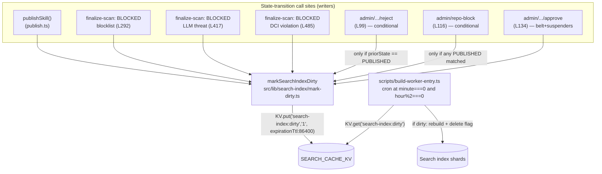

# Plan: Search-index dirty-flag coverage on all state transitions

## 1. Context & Problem

On 2026-04-26 a freshly-PUBLISHED skill (`skill-builder`, score 95, CERTIFIED) was missing from `vskill find` for ~50 minutes after publication. The Postgres row was correct; the canonical URL returned 200; only the KV-backed search index was stale. The problem decomposes into three distinct defects in the dirty-flag mechanism that gates the every-2h cron rebuild at `scripts/build-worker-entry.ts:194-220`:

1. **Missing TTL** — `src/lib/submission/publish.ts:671` calls `searchKv.put('search-index:dirty', '1')` without `{ expirationTtl: 86400 }`. The matching cron-handler write at `scripts/build-worker-entry.ts:165-167` does include the TTL. Inconsistent.
2. **Multiple state-transition paths bypass `publishSkill()` entirely** and never set the flag — three BLOCKED transitions in `finalize-scan/route.ts`, an admin reject, and a bulk repo-block path.
3. **Narrow but real race** in admin approve — `submissions/[id]/approve/route.ts:134→193` writes `state: PUBLISHED` to the DB *before* calling `publishSkill()`. If `publishSkill()` throws after the DB commit, the skill is PUBLISHED but the dirty flag never lands.

A skill should appear in (or disappear from) the search index within one cron-eligible tick (next `*/10` cron with `minute === 0 && hour % 2 === 0`). Today's gap means freshly-published skills can be invisible and freshly-blocked skills stay searchable for 2h+.

## 2. High-Level Architecture



The helper is the single producer; the cron handler at `scripts/build-worker-entry.ts:194-220` is the single consumer. All six PUBLISHED-transition paths (vendor, LLM-approved, T1-fallback, admin-approve, queue-recovery, admin-restore) eventually call `publishSkill()`, so fixing `publishSkill()` covers all six PUBLISHED paths in one shot. The other five sites cover BLOCKED, REJECTED, bulk-block, and the belt-and-suspenders write.

## 3. State-Transition Coverage Matrix

| # | Trigger | File | Line | Target state | Goes through `publishSkill()`? | Action |
|---|---|---|---|---|---|---|
| 1 | Vendor auto-publish | `finalize-scan/route.ts` | 308 -> 314 | PUBLISHED | Yes | Helper called inside `publishSkill()` |
| 2 | LLM-approved publish | `finalize-scan/route.ts` | 449 -> 456 | PUBLISHED | Yes | Helper called inside `publishSkill()` |
| 3 | T1 fallback publish | `finalize-scan/route.ts` | 505 -> 512 | PUBLISHED | Yes | Helper called inside `publishSkill()` |
| 4 | Admin approve -> publish | `admin/submissions/[id]/approve/route.ts` | 134 -> 193 | PUBLISHED | Yes | Helper called inside `publishSkill()` PLUS belt-and-suspenders at line 134 (after `updateMany`, before `publishSkill()`) |
| 5 | Queue consumer recovery | `submission/consumer.ts` | 51 -> 55 | PUBLISHED | Yes | Helper called inside `publishSkill()` |
| 6 | Admin restore from rejection | `admin/.../rejections/route.ts` | 293+ | PUBLISHED | Yes | Helper called inside `publishSkill()` |
| 7 | Blocklist match | `finalize-scan/route.ts` | 292 | BLOCKED | No | Direct helper call, **conditional**: only if `priorState in {PUBLISHED, AUTO_APPROVED}` |
| 8 | LLM-confirmed threat | `finalize-scan/route.ts` | 417 | BLOCKED | No | Direct helper call, conditional (same rule) |
| 9 | DCI violation | `finalize-scan/route.ts` | 485 | BLOCKED | No | Direct helper call, conditional (same rule) |
| 10 | Admin reject | `admin/submissions/[id]/reject/route.ts` | 99 | REJECTED | No | Direct helper call, conditional: only if `submission.state === "PUBLISHED"` (downgrade case) |
| 11 | Bulk repo-block | `admin/repo-block/route.ts` | 116 | BLOCKED (bulk) | No | One helper call if `updateMany` matched any row whose prior state was PUBLISHED |

## 4. Architectural Decisions (inline ADs)

### AD-001: Centralized helper `markSearchIndexDirty()`
**Decision.** Extract the env-resolve + KV-put logic from `publish.ts:657-674` into a new module `src/lib/search-index/mark-dirty.ts`. Every caller invokes the helper — never the inline pattern.
**Why.** Today the pattern lives in one place (publish.ts) but already has a TTL drift vs. the cron handler (`scripts/build-worker-entry.ts:165-167`). Adding five more inline copies guarantees more drift over time. Single source of truth eliminates an entire class of bug.
**Alternatives considered.** Inline the dirty-set at every call site (rejected — drift risk); attach to a Prisma middleware on `Submission.update` (rejected — can't access Cloudflare env from Prisma context, plus catches non-state-transition updates).

### AD-002: Conditional dirty-set on BLOCKED/REJECTED transitions
**Decision.** For the BLOCKED transitions in `finalize-scan` and the admin REJECT, only fire the helper when the prior state was `PUBLISHED` or `AUTO_APPROVED`. Skills moving from `RECEIVED -> BLOCKED` (caught at first scan, never appeared in the index) skip the helper.
**Why.** The dirty flag exists to trigger an index rebuild. Skills never published don't need a removal; firing the helper anyway burns a KV write per first-scan rejection, which is the highest-volume class of state transition. `priorState` is already in scope at all four call sites.
**Alternatives considered.** Always fire (rejected — wastes KV ops on the most common transition); diff the index post-rebuild to detect no-op rebuilds (rejected — complicates the consumer, doesn't recover the wasted write).

### AD-003: Belt-and-suspenders dirty-set at admin approve
**Decision.** In `admin/submissions/[id]/approve/route.ts`, call `markSearchIndexDirty()` immediately after the `updateMany` at line 134 (state commit), in addition to the call inside `publishSkill()` at line 193.
**Why.** Closes the narrow window where the DB write commits but `publishSkill()` throws before reaching its dirty-set call (KV outage, downstream queue error, taint-check failure path). The helper is idempotent — a redundant double-write is a single extra KV op, an order of magnitude cheaper than a missed rebuild.
**Alternatives considered.** Wrap state-commit + publishSkill in a transaction (rejected — KV writes aren't transactional with Postgres); move dirty-set to before state-commit (rejected — could trigger a rebuild for a publish that subsequently rolled back).

### AD-004: Architectural canary test (string-grep, no AST)
**Decision.** Add `src/lib/search-index/__tests__/state-transition-coverage.test.ts`. It greps the `src/` tree for occurrences of `state: 'PUBLISHED'`, `state: 'BLOCKED'`, `state: 'REJECTED'` (and the double-quoted variants) and asserts each match is followed within ~10 lines by either `markSearchIndexDirty()` or `publishSkill()`.
**Why.** Future contributors adding a new state-transition site will trip this test if they don't wire the helper. False positives (e.g., a string match inside a comment, type definition, or an unrelated context) are easier to fix at PR time than a silent index miss in production.
**Alternatives considered.** Full AST-based coverage analysis with ts-morph (rejected — heavy dependency, slow, and the false-positive cost is small); runtime instrumentation of Submission.update (rejected — too invasive for a defensive test).

### AD-005: 2-hour cron cadence stays — out of scope
**Decision.** Do NOT shorten the cron rebuild gate at `scripts/build-worker-entry.ts:194` (currently `minute === 0 && hour % 2 === 0`).
**Why.** The cadence was deliberately picked to bound KV operation cost. Shortening to every 10 minutes unconditional raises KV op spend ~12x. The dirty-flag fix in this increment removes the actual bug (skills missed entirely), so the latency cap of one cron tick (<=2h) is the contract. If sub-2h freshness becomes a product requirement, file a separate increment with explicit cost analysis.
**Alternatives considered.** Trigger an immediate rebuild from the helper (rejected — couples writers to a heavy operation, no batching); shorten cadence to 30 min (rejected — same cost concern, smaller magnitude).

### AD-006: TTL value 86400 (24h) is the existing cron-handler value
**Decision.** Bake `expirationTtl: 86400` into the helper. No caller specifies the TTL.
**Why.** That's the value already used at `scripts/build-worker-entry.ts:166`. Matching it removes the inconsistency that started this incident. 24h is comfortably longer than any plausible cron-rebuild interval, so the flag won't expire mid-window.
**Alternatives considered.** Shorter TTL like 4h (rejected — equal to two cron windows; if the cron itself is delayed, the flag could expire); no TTL (rejected — orphaned flags from edge cases would never clean up if the cron's delete fails).

## 5. File-by-File Design

### 5.1 New: `src/lib/search-index/mark-dirty.ts`

```ts
import { getCloudflareContext } from '@opennextjs/cloudflare';
import { getWorkerEnv } from '@/lib/runtime/worker-env';

type SearchKV = {
  put(key: string, value: string, options?: { expirationTtl?: number }): Promise<void>;
};

const DIRTY_KEY = 'search-index:dirty';
const DIRTY_TTL_SECONDS = 86400;

// Best-effort: marks the search index as dirty so the next 2h-aligned cron
// tick rebuilds it. Swallows env-resolution and KV-put failures.
export async function markSearchIndexDirty(): Promise<void> {
  try {
    let searchKv: SearchKV | null = null;
    const workerEnv = getWorkerEnv();
    if (workerEnv) {
      searchKv = (workerEnv as unknown as Record<string, unknown>).SEARCH_CACHE_KV as SearchKV | null;
    }
    if (!searchKv) {
      try {
        const ctx = await getCloudflareContext({ async: true });
        searchKv = (ctx.env as unknown as Record<string, unknown>).SEARCH_CACHE_KV as SearchKV | null;
      } catch {
        // No CF context (e.g., local non-worker test) — skip.
      }
    }
    if (searchKv) {
      await searchKv.put(DIRTY_KEY, '1', { expirationTtl: DIRTY_TTL_SECONDS });
    }
  } catch {
    // Best-effort — never let an index-marker failure break a state transition.
  }
}
```

Signature: `markSearchIndexDirty(): Promise<void>` — no args, no return value, never throws. Exact extraction of `publish.ts:657-674` plus the missing `{ expirationTtl: 86400 }` on the put call.

### 5.2 Modified: `src/lib/submission/publish.ts:657-674`

Replace the entire 18-line inline block with a single line:

```ts
await markSearchIndexDirty();
```

Add the import at the top: `import { markSearchIndexDirty } from '@/lib/search-index/mark-dirty';`

Net diff: **-17 lines, +2 lines (1 import, 1 call)**. The TTL is now correctly set as a side effect of the refactor.

### 5.3 Modified: `src/app/api/v1/internal/finalize-scan/route.ts`

Three BLOCKED transitions at lines 292, 417, 485. After each `updateState(id, 'BLOCKED', ...)`:

```ts
if (priorState === 'PUBLISHED' || priorState === 'AUTO_APPROVED') {
  await markSearchIndexDirty();
}
```

`priorState` is already in scope at all three sites (the explorer confirmed it's read before the state update). Add the import once at the top.

### 5.4 Modified: `src/app/api/v1/admin/submissions/[id]/reject/route.ts:~99`

Conditional on the submission's pre-update state:

```ts
if (submission.state === 'PUBLISHED') {
  await markSearchIndexDirty();
}
```

Skips RECEIVED -> REJECTED (skill never appeared in index).

### 5.5 Modified: `src/app/api/v1/admin/repo-block/route.ts:~116`

The route does an `updateMany` across all submissions for a repo. Filter the prior states:

```ts
const publishedCount = await prisma.submission.count({
  where: { repoId, state: 'PUBLISHED' },
});
// ... existing updateMany ...
if (publishedCount > 0) {
  await markSearchIndexDirty();
}
```

One helper call regardless of how many rows matched (single dirty flag, batch rebuild).

### 5.6 Modified: `src/app/api/v1/admin/submissions/[id]/approve/route.ts:~134`

Insert immediately after the `updateMany` that commits `state: PUBLISHED`, before the `publishSkill()` call at line 193:

```ts
// Belt-and-suspenders: set the dirty flag at the state-commit boundary so a
// downstream publishSkill() failure cannot leave a PUBLISHED row uninflected
// in the search index. Helper is idempotent.
await markSearchIndexDirty();
```

### 5.7 New: `src/lib/search-index/__tests__/mark-dirty.test.ts`

Four cases:
1. KV resolved via `getWorkerEnv()` -> `put` called with key, value, `{ expirationTtl: 86400 }`.
2. `getWorkerEnv()` returns null, `getCloudflareContext()` resolves -> put called.
3. Both unavailable -> no throw, no put.
4. `put` rejects -> helper does NOT throw (best-effort contract).

### 5.8 New: `src/lib/search-index/__tests__/state-transition-coverage.test.ts`

The architectural canary. Pseudocode:

```ts
import { readFileSync } from 'node:fs';
import { glob } from 'glob';

const SOURCE_GLOB = 'src/**/*.{ts,tsx}';
const STATE_TRANSITION_PATTERNS = [
  /state:\s*['"]PUBLISHED['"]/g,
  /state:\s*['"]BLOCKED['"]/g,
  /state:\s*['"]REJECTED['"]/g,
];
const COVERAGE_TOKENS = ['markSearchIndexDirty', 'publishSkill'];
const WINDOW_LINES = 10;

// For each match, slice +WINDOW_LINES below; assert it contains a coverage token.
// Allowlist: this test file itself, type-defs, migration files.
```

Keep it under ~80 LOC. False-positive resolution: add the file to a small allowlist with a comment explaining why.

### 5.9 Modified existing tests

- `src/lib/submission/__tests__/publish.test.ts` — add assertion that `markSearchIndexDirty` is invoked exactly once per successful publish. Mock the helper at the import boundary (`vi.mock('@/lib/search-index/mark-dirty')`).
- `src/app/api/v1/internal/finalize-scan/__tests__/route.test.ts` — three new assertions, one per BLOCKED path: helper invoked when `priorState === 'PUBLISHED'`, NOT invoked when `priorState === 'RECEIVED'`.
- `src/app/api/v1/admin/submissions/[id]/reject/__tests__/route.test.ts` — assert helper invoked only on PUBLISHED downgrade.
- `src/app/api/v1/admin/repo-block/__tests__/route.test.ts` — assert helper invoked exactly once when any PUBLISHED row matched, never when zero.
- `src/app/api/v1/admin/submissions/[id]/approve/__tests__/route.test.ts` — assert helper invoked even when `publishSkill()` is mocked to reject (belt-and-suspenders coverage).

Use the existing mock-KV pattern at `src/app/api/v1/admin/submissions/[id]/approve/__tests__/route.test.ts:180-186` as the template.

## 6. Verification (end-to-end)

1. Unit: `npx vitest run src/lib/search-index src/lib/submission src/app/api/v1/internal/finalize-scan src/app/api/v1/admin/submissions src/app/api/v1/admin/repo-block` — all pass.
2. Type check: `npx tsc --noEmit` — no errors.
3. Build worker: `cd repositories/anton-abyzov/vskill-platform && npm run build:worker`.
4. Deploy: `npx wrangler deploy`.
5. Manual smoke: `vskill submit anton-abyzov/<test-repo> --skill <test-name>`, wait for next 2h-aligned cron tick, confirm `wrangler tail` shows `[cron] search index rebuild completed`, confirm `vskill find <test-name>` returns the skill without manual rebuild.
6. Block path: admin-block the same skill, wait for next tick, confirm removal from `vskill find`.

## 7. Out of Scope

- **Tightening the 2h cron cadence** — see AD-005. Separate increment if product needs sub-2h freshness.
- **Re-architecting search index sharding** — current shard layout is fine; the bug was solely flag coverage.
- **0748 watchdog territory** — separate increment, just shipped, distinct concern.
- **Investigating *why* the 06:00 UTC 2026-04-26 cron rebuild missed Anton's skill** — could be transient KV consistency or Postgres read-replica lag. The structural fix here makes the dirty flag set redundantly enough that one transient miss doesn't matter. If misses recur post-fix, file a separate investigation increment.
- **Replacing the helper with a Prisma middleware** — see AD-001 alternatives. Reconsider if/when we move to a Workers-native ORM.

## 8. Effort Estimate

| Component | LOC | Hours |
|---|---|---|
| New helper + 4 unit tests | ~50 + ~80 | 0.75 |
| `publish.ts` refactor (-17/+2) | ~20 net | 0.25 |
| 3x finalize-scan + reject + repo-block + approve | ~30 | 0.75 |
| Architectural canary test | ~80 | 0.5 |
| Existing test additions (5 files) | ~80 | 1.0 |
| Build, deploy, manual verify | — | 0.75 |
| **Total** | **~340 LOC** | **~4 h** |

## 9. Risks

| Risk | Likelihood | Impact | Mitigation |
|---|---|---|---|
| Architectural canary produces false positives in unrelated files | Medium | Low | Small allowlist mechanism with inline comment; documented in test file |
| Helper extraction misses an edge case from the inline block | Low | Medium | The new module is a verbatim extraction; existing publish.test.ts cases continue to assert behavior |
| `priorState` not in scope at one of the three finalize-scan sites | Low | Low | Explorer confirmed scope at all three; verify during implementation, hoist if needed |
| Belt-and-suspenders write at admin approve causes excess KV ops | Very low | Very low | One extra KV put per admin approve (~tens/day); negligible vs. the bug it prevents |
