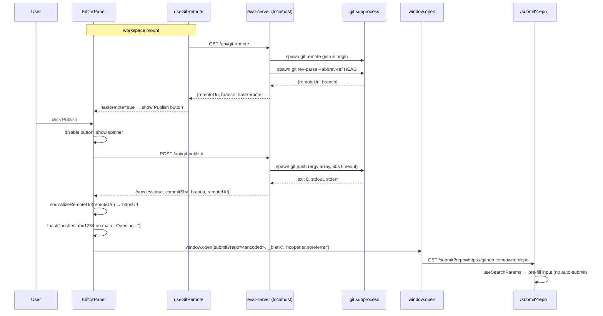

# Implementation Plan: Studio: Publish (push + open pre-filled submit page)

## 1. Overview

This increment wires a Publish button into the studio EditorPanel that (1) calls a new `POST /git-publish` eval-server route which spawns a real `git push` subprocess via `child_process.spawn` with an argv array, (2) normalizes the remote URL from SSH or HTTPS to canonical HTTPS, (3) opens `https://verified-skill.com/submit?repo=<encoded>` in a new tab, and (4) modifies the platform's `/submit` page to read the `?repo=` param via `useSearchParams` and pre-fill the URL input. No new npm dependencies are introduced. The feature follows the established eval-server route pattern (`makeXHandlers` + `registerXRoutes`) and reuses the existing `studio:toast` event bus for UI feedback.

---

## 2. Architecture Diagram



---

## 3. Component Design

### New files

| File | Project | Responsibility |
|---|---|---|
| `src/eval-server/git-routes.ts` | vskill | `makeGitHandlers(root)` + `registerGitRoutes(router, root)`. Two handlers: `getGitRemote` and `postGitPublish`. Exports pure `makeGitHandlers` for unit tests. |
| `src/eval-ui/src/hooks/useGitRemote.ts` | vskill | React hook. Calls `GET /api/git-remote` once on mount. Returns `{ remoteUrl, branch, hasRemote, loading, error }`. No polling. |
| `src/eval-ui/src/utils/normalizeRemoteUrl.ts` | vskill | Pure function: `normalizeRemoteUrl(raw: string): string`. Converts SSH or HTTPS remote URL to canonical `https://github.com/owner/repo`. No side effects. |

### Modified files

| File | Project | Change |
|---|---|---|
| `src/eval-server/eval-server.ts` | vskill | Import `registerGitRoutes` and call `registerGitRoutes(router, root)` alongside existing `registerAuthoringRoutes`. |
| `src/eval-ui/src/pages/workspace/EditorPanel.tsx` | vskill | Import `useGitRemote`. Add Publish button (conditional on `hasRemote`). Add `handlePublish` callback with `publishing` state. Fire `studio:toast` on success/error. |
| `src/eval-ui/src/api.ts` | vskill | Add `gitRemote()` → `GET /api/git-remote` and `gitPublish()` → `POST /api/git-publish`. Follow existing `apiFetch` wrapper pattern. |
| `src/app/submit/page.tsx` | vskill-platform | Add `useSearchParams()` mount effect: read `?repo=`, validate against `GITHUB_REPO_VALIDATION_RE`, pre-fill `repoUrl` state. Already `'use client'`. |

---

## 4. Data Flow

### GET /api/git-remote

**Request**: `GET /api/git-remote` (no body). Workspace path is the `root` passed at server boot (same pattern as all other route handlers: `registerGitRoutes(router, root)`).

**Success response (200)**:
```json
{
  "remoteUrl": "https://github.com/owner/repo.git",
  "branch": "main",
  "hasRemote": true
}
```

**No remote (200)**:
```json
{
  "remoteUrl": null,
  "branch": "main",
  "hasRemote": false
}
```

### POST /api/git-publish

**Request**: `POST /api/git-publish` (no body required — uses workspace root from server boot context).

**Success response (200)**:
```json
{
  "success": true,
  "commitSha": "abc1234def5678...",
  "branch": "main",
  "remoteUrl": "https://github.com/owner/repo.git",
  "stdout": "Everything up-to-date\n",
  "stderr": ""
}
```

**Error response (500)**:
```json
{
  "success": false,
  "stdout": "",
  "stderr": "error: failed to push some refs to ...\n"
}
```

**Timeout response (500)**:
```json
{
  "success": false,
  "stdout": "",
  "stderr": "timeout"
}
```

### URL normalization (client-side utility)

`normalizeRemoteUrl(raw)` maps:
- `git@github.com:owner/repo.git` → `https://github.com/owner/repo`
- `https://github.com/owner/repo.git` → `https://github.com/owner/repo`
- `https://github.com/owner/repo` → `https://github.com/owner/repo`

The normalized URL is passed to `encodeURIComponent` before appending to the `?repo=` param.

### Platform pre-fill (submit page, mount effect)

```
useSearchParams().get('repo')
  → validate against GITHUB_REPO_VALIDATION_RE
  → if valid: setRepoUrl(param)
  → if invalid or absent: no-op (input stays empty)
```

---

## 5. Error Handling

| Failure mode | HTTP | UI response |
|---|---|---|
| No git remote configured | 200 `hasRemote:false` | Publish button not rendered |
| `GET /git-remote` network error | — | Publish button not rendered (fail-silent) |
| `POST /git-publish` exits non-zero (rejected push, auth failure) | 500 | Error toast with first 200 chars of stderr; button re-enabled; no `window.open` |
| `POST /git-publish` timeout (>60s default, `GIT_PUBLISH_TIMEOUT_MS` override) | 500 `stderr:"timeout"` | Error toast "git push timed out"; button re-enabled |
| `POST /git-publish` network failure (fetch throws) | — | Error toast "Network error: …"; button re-enabled |
| Remote URL cannot be normalized (unrecognized format) | — | Error toast "Unrecognized remote URL format"; no `window.open` |
| `?repo=` param on platform fails `GITHUB_REPO_VALIDATION_RE` | — | Input left empty, no error UI (silent drop) |
| Concurrent Publish click | — | Button disabled while in-flight; second click ignored |

---

## 6. Security

- **Subprocess injection prevention**: Both `git remote get-url origin` and `git push` are spawned with `child_process.spawn(cmd, args, opts)` using an explicit argv array. Shell-string interpolation (`exec`, template literals into `shell: true`) is forbidden. The command is always the literal string `"git"` and args are a fixed array — no user input is interpolated.
- **Workspace path allowlist**: The `root` value passed to `registerGitRoutes(router, root)` is resolved at server boot from the workspace store (same source as all other routes). No per-request path override is accepted — the route has no path parameter. This eliminates path traversal at the API boundary.
- **`window.open` safety**: The third argument is always the literal `'noopener,noreferrer'`. The URL is always the hardcoded string `https://verified-skill.com/submit?repo=` plus `encodeURIComponent(normalizedUrl)`. User-controlled input never becomes part of the URL scheme, host, or path.
- **Platform param validation**: The `?repo=` query param is validated against `GITHUB_REPO_VALIDATION_RE` before being written to React state. Malformed values are dropped, never rendered into the DOM or sent to the API.

---

## 7. Testing Strategy

### Unit tests (Vitest)

| Test file | What it covers |
|---|---|
| `src/eval-server/__tests__/git-routes.test.ts` | `makeGitHandlers`: (1) `getGitRemote` returns `{remoteUrl, branch, hasRemote:true}` when git exits 0; (2) returns `{hasRemote:false}` when `git remote get-url` exits non-zero; (3) `postGitPublish` resolves with success shape on exit 0; (4) rejects with `success:false` on non-zero exit; (5) kills subprocess and returns `{stderr:"timeout"}` when timeout fires. Mock `child_process.spawn` via `vi.hoisted() + vi.mock()`. |
| `src/eval-ui/src/__tests__/normalizeRemoteUrl.test.ts` | SSH → HTTPS conversion; HTTPS with `.git` → strip; HTTPS without `.git` → passthrough; unrecognized format → throws or returns null. |
| `src/app/submit/__tests__/page.prefill.test.ts` | Platform submit page: valid `?repo=` pre-fills; absent param → empty; malformed param → empty; form not auto-submitted on mount. Use React Testing Library + `next/navigation` mock. |

### React hook test

| Test file | What it covers |
|---|---|
| `src/eval-ui/src/__tests__/useGitRemote.test.ts` | Hook calls `GET /api/git-remote` on mount; stores result; `hasRemote:false` when fetch fails. |

### E2E (Playwright)

| Scenario | Implementation |
|---|---|
| Happy path: Publish → new tab with `?repo=` | Start studio against a fixture workspace with a mocked `git remote get-url` and `git push` that exit 0. Click Publish. Assert `page.waitForEvent('popup')` receives URL matching `https://verified-skill.com/submit?repo=`. |
| Error path: `git push` rejected | Mocked push exits 1. Assert error toast appears and no popup is opened. |

---

## 8. Out of Scope (deferred to 0742)

- Dirty-state status pill in DetailHeader
- AI-generated commit messages
- Repo creation via `gh` CLI
- No-remote attach flow (connecting a new remote from the UI)
- SSE streaming of `git push` output to the UI
- Auto-submit on the platform side (pre-fill only, never submit)
- Push progress display

---

## 9. Risks

- **Git credential prompt**: If the remote requires interactive auth (no credential helper configured, SSH passphrase protected), `git push` will hang until the subprocess timeout fires. This is a known limitation of the MVP — the error toast will show "git push timed out". Credential helper setup is a user responsibility and is out of scope.
- **eval-server `root` vs active project divergence**: The server's `root` is resolved once at boot from the workspace store. If the user switches the active project mid-session, `/git-publish` still runs against the boot-time root. This matches the existing behavior of all other eval-server routes and is acceptable for MVP.
- **Next.js App Router `useSearchParams` Suspense boundary**: `useSearchParams()` requires the component to be wrapped in a `<Suspense>` boundary in Next.js 15. The submit page is already a Client Component; verify a `<Suspense>` wrapper exists in the layout or add a local one to avoid the "missing Suspense boundary" build warning.
