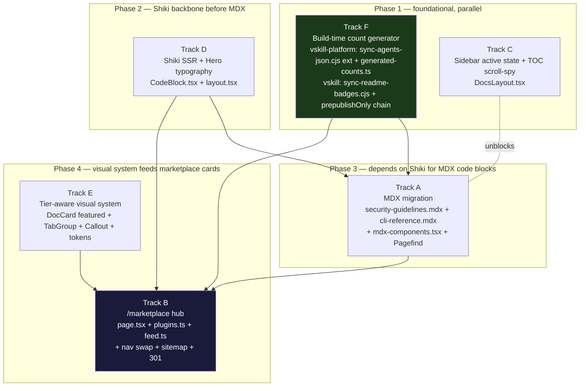

# Plan — vskill docs overhaul + marketplace hub

## Overview

Six tracks land together so verified-skill.com gets a coherent v1 face. Two repos are touched (`vskill-platform` for Tracks A–E + the count-consumer half of F; `vskill` for the README-badge half of F). Tracks have natural dependencies — Shiki is the rendering backbone for MDX code blocks, the tier-aware visual system feeds the marketplace card vocabulary, and the count generator must precede any UI that reads `COUNTS.*`.

This plan is scoped to the architecture and design decisions. Per-task work lives in `tasks.md`.

---

## Design

### Component diagram (six tracks + dependencies)



**Execution order (informs tasks.md, not the plan contract)**: F + C in parallel → D → A → E → B.

**Why this order**: Phase 1 lifts the foundational risks (count drift, navigation orientation). Phase 2 ships the Shiki engine that Phase 3's MDX consumes. Phase 4 lands the marketplace last because it depends on the new tier-aware DocCard `featured` variant, the AGENT_ICONS reuse from existing homepage, and the `COUNTS` import landed in Phase 1.

---

### Track A — MDX migration

**Project**: vskill-platform

**Goal**: Convert two heaviest reference pages from inline JSX to MDX while keeping the Geist Mono / GitHub-Primer identity. Add Pagefind static search.

**File-level changes**:

| Path | Op | Notes |
|---|---|---|
| `mdx-components.tsx` | NEW (app root) | Wires CodeBlock, Callout, FlagTable, SectionHeading, Prose, InlineCode, TabGroup as MDX-default components. Required by `@next/mdx` integration contract. |
| `next.config.ts` | MODIFY | Wrap export with `withMDX()`; extend `pageExtensions` to include `'mdx'`. |
| `src/app/docs/security-guidelines/page.tsx` | DELETE | 723 LOC removed. |
| `src/app/docs/security-guidelines/page.mdx` | NEW | ~250 LOC. Frontmatter declares `title`, `description`, `toc[]`. |
| `src/app/docs/cli-reference/page.tsx` | DELETE | 372 LOC removed. |
| `src/app/docs/cli-reference/page.mdx` | NEW | ~180 LOC. |
| `src/app/components/DocsLayout.tsx` | MODIFY | Mount `⌘K` Pagefind palette in the docs chrome. Reuse `RootSearchPalette.tsx` keyboard handler conventions; do NOT fork. |
| `scripts/generate-docs-nav.ts` | NEW | Build-time script: read frontmatter from all `.mdx` under `src/app/docs/**`; emit `src/app/docs/generated-nav.ts` consumed by `docs-nav.ts`. |
| `package.json` | MODIFY | Add `@next/mdx`, `@mdx-js/react`, `@mdx-js/loader`, `gray-matter`, `pagefind`, `rehype-pretty-code` to dependencies; add `postbuild` script that runs Pagefind index generation (path validated empirically — see Build pipeline below). |

**Key technical decisions**:

- **`@next/mdx` over `next-mdx-remote`** — Next 15 has first-class MDX. SSR by default, no client hydration cost, frontmatter via `gray-matter`. `next-mdx-remote` was a v12-era escape hatch we don't need.
- **Hybrid (some pages MDX, some stay React)** — `docs/page.tsx`, `getting-started/page.tsx`, `submitting/page.tsx`, `faq/page.tsx`, `plugins/page.tsx` (which collapses to a redirect) keep their JSX shape because they're marketing-shaped, short, and would gain ~zero LOC reduction from MDX. Per the brainstorm: don't convert pages where MDX is the wrong tool.
- **Pagefind static index in `public/pagefind/`** — Cloudflare Workers (`output: standalone`) compatibility requires a static asset path. Postbuild step writes the index there; `DocsLayout.tsx` loads it via dynamic `import('/pagefind/pagefind.js')` at first `⌘K` invocation (lazy — keeps initial JS budget intact).
- **Frontmatter-driven nav** — single source of truth for sidebar nav metadata. `generate-docs-nav.ts` runs at `prebuild` so `docs-nav.ts` never goes stale relative to MDX titles.

**Reused utilities** (no rewrites):
- `CodeBlock.tsx` (will be Shiki-enhanced in Track D, then consumed by MDX here)
- `Callout.tsx` (will be SVG-enhanced in Track E)
- `FlagTable`, `SectionHeading`, `Prose`, `InlineCode`, `TabGroup` — all wired through `mdx-components.tsx` map
- `RootSearchPalette.tsx` keyboard wiring (model the docs `⌘K` palette on it)

**Integration points with other tracks**:
- **Consumes Track D** — MDX code fences route through the shared `CodeBlock` component, which Track D upgrades to Shiki. MDX must land *after* Shiki so its code blocks render highlighted on first paint.
- **Consumes Track E** — `Callout` SVG glyphs land in Track E; MDX content uses the upgraded `Callout` automatically through `mdx-components.tsx`.

**Satisfies**: AC-US1-01, AC-US1-02, AC-US1-03, AC-US1-04.

---

### Track B — `/marketplace` top-level hub

**Project**: vskill-platform

**Goal**: Replace the orphan `/docs/plugins` and the sitemap-invisible `/insights` with a curated showcase. New top-level route, existing URLs preserved.

**File-level changes**:

| Path | Op | Notes |
|---|---|---|
| `src/app/marketplace/page.tsx` | NEW | The hub. Server component (no `'use client'`). Renders 7 sections per the wireframe below. |
| `src/lib/marketplace/plugins.ts` | NEW | Typed plugin registry (V1 hardcoded; V2 marketplace.json fetch — explicitly out of scope). |
| `src/lib/marketplace/feed.ts` | NEW | Merges insights articles, learn videos, and plugin `lastUpdated` releases into `FeedEntry[]`. Pure function over inputs. |
| `src/app/layout.tsx` | MODIFY (lines 71–82) | Replace `<a href="/insights">Insights</a>` with `<a href="/marketplace">Marketplace</a>`. Add footer link to `/insights` under Resources column. |
| `src/app/components/MobileNav.tsx` | MODIFY | Same nav swap. |
| `src/app/sitemap.ts` | MODIFY | Add `/marketplace` (priority 0.85), `/insights` (0.6), `/learn` (0.6), `/docs` (0.7) to `staticPages`. |
| `next.config.ts` | MODIFY | Add `{ source: '/docs/plugins', destination: '/marketplace', permanent: true }` to existing `redirects()`. |
| `src/app/docs/plugins/page.tsx` | MODIFY | Collapse body to a single `redirect('/marketplace')` server component as a defensive backup if the next.config redirect ever drops. |

**Page structure** (matches the marketplace strategist wireframe baked into the spec):

1. Hero (h1 + global search input + tier filter chips)
2. Featured Collection (1 large spotlight card — `<DocCard featured>`)
3. All Plugins (8 rich cards, 2-col / 3-col responsive grid)
4. What's New feed (horizontal scroll, kind-tagged badges)
5. Browse by use-case (taxonomy strip)
6. Trending Skills (reuses `<TrendingSkillsSection/>` from homepage, untouched)
7. From the Insights (3-up grid, links to `/insights/*`)

**Key technical decisions**:

- **New `/marketplace` route, not `/docs/plugins` polish** — `/docs/plugins` is sitemap-orphan and named confusingly (a "plugin" in vskill is a code surface; visitors looking for a marketplace don't navigate to docs). A clean top-level route signals "browse the catalog" and earns its own sitemap entry. The 301 from the old URL preserves SEO equity.
- **Server component (no client interactivity needed for V1)** — sort/filter chips can be `useState` client islands inside the page; the data is build-time static so the page can SSR cleanly. Keeps Lighthouse Performance score intact.
- **Hardcoded `PluginEntry[]` for V1** — there are 8 plugins; a hardcoded typed array is faster, type-safe, and avoids the migration tax of building a Prisma model that would change shape under V2 anyway. spec.md "Out of Scope" explicitly defers DB-backed marketplace.
- **Reuse `<TierBadge/>`, `AGENT_ICONS`, `<CopyButton/>`, `<TrendingSkillsSection/>`, `<DocCard/>`** — zero new visual primitives. Marketplace is composition, not invention.

**Integration points**:
- **Consumes Track E** — `<DocCard featured>` (the spotlight card variant) ships in Track E. Marketplace is the primary consumer.
- **Consumes Track F** — pluginsCount surface uses `COUNTS.plugins` so it auto-updates.

**Satisfies**: AC-US2-01, AC-US2-02, AC-US2-03, AC-US2-04.

---

### Track C — Sidebar active state + TOC scroll-spy

**Project**: vskill-platform

**Goal**: Make navigation actually feel navigable. One-hour visual fix with outsized perceived-quality gain.

**File-level changes**:

| Path | Op | Notes |
|---|---|---|
| `src/app/components/DocsLayout.tsx` | MODIFY (NavLink, lines ~30–60) | Add 2px `--code-green` left bar + `--bg-hover` background to active link state. Currently only font-weight + color (invisible against muted text). |
| `src/app/components/DocsLayout.tsx` | MODIFY (TocItem type, ~3 lines) | Extend `TocItem` to carry `level: 1 \| 2 \| 3` (for h2/h3/h4); indent by `level × 0.75rem`. |
| `src/app/components/DocsLayout.tsx` | MODIFY (TOC component) | Wire `IntersectionObserver` watching all `[id]` headings; mark whichever section is closest to viewport top. Animate a 2px green left bar that translates between TOC items via `transform: translateY()`. |

**Key technical decisions**:

- **`IntersectionObserver` over scroll listener** — passive, no layout-thrash, RAF-friendly. Required by the spec (NFR Performance: "TOC scroll-spy uses IntersectionObserver exclusively").
- **`transform: translateY` for indicator** — composited, no layout reflow, GPU-cheap. Respects `prefers-reduced-motion: reduce` (instant snap when reduced).
- **No new component file** — all changes inside `DocsLayout.tsx`. The component already owns nav + TOC; splitting now would be premature decomposition.

**Reused tokens**: `--code-green`, `--bg-hover`, `--text`, `--text-muted` (all already in use).

**Integration points**: None — this track stands alone, which is why it can run in Phase 1 parallel with Track F.

**Satisfies**: AC-US3-01, AC-US3-02, AC-US3-03.

---

### Track D — Shiki SSR + hero typography

**Project**: vskill-platform

**Goal**: Fix the two highest-impact visual misses — colorless code blocks and an underweight homepage hero.

**File-level changes**:

| Path | Op | Notes |
|---|---|---|
| `src/app/components/CodeBlock.tsx` | MODIFY | Replace inline `<pre><code>{children}</code></pre>` with Shiki SSR-highlighted output. Dual themes: `github-dark` + `github-light`, switched via CSS variable `[data-theme]`. Preserve copy button + line numbers. Add line-hover background `rgba(255,255,255,0.03)`. De-emphasize line numbers (opacity 0.4). |
| `src/lib/shiki.ts` | NEW | Singleton Shiki highlighter (`shiki/bundle/web`) with only `github-dark` + `github-light` themes registered. Server-side instantiation; tree-shakes everything else. |
| `package.json` | MODIFY | Add `shiki` dependency. (`rehype-pretty-code` is added in Track A and reuses the same engine for MDX code fences.) |
| `src/app/layout.tsx` | MODIFY | Wire display font (Departure Mono OR JetBrains Mono Display) via `next/font/google`. `display: 'swap'`, only h1 weight preloaded to control CLS. |
| `src/app/page.tsx` (homepage hero) | MODIFY | h1 size `2.25rem` → `3.25rem`. Add `text-wrap: balance`. Add dotted/grid SVG background with radial fade behind hero. |

**Key technical decisions**:

- **Shiki over Prism / highlight.js / rehype-highlight** — Shiki uses real TextMate grammars and VS Code themes (perfect parity with editor), runs at SSR/build time (zero hydration cost), supports dual themes natively. Bundle hit (~200–500KB) is mitigated by `shiki/bundle/web` lightweight bundle and only registering two themes. Lighthouse target: ≤5pt regression on `/`.
- **Dual themes via CSS variable** — `<pre data-theme="dark">` vs `data-theme="light"`. Switched by the existing theme system, no React re-render. Both color sets live in the rendered HTML.
- **Singleton highlighter** — Shiki initialization is expensive; reuse one instance across all `CodeBlock` invocations within a request.
- **`next/font/google` for hero font** — leverages Next's font subsetting, self-hosting, and CLS prevention. Display swap + single-weight preload keeps first paint clean.
- **Departure Mono OR JetBrains Mono Display (decision deferred to implementation)** — both are mono variants that preserve identity; choose at implementation time after seeing them in context. ADR-0674-03 already establishes JetBrains Mono Variable as the system mono — JetBrains Mono Display would be the most cohesive choice.

**Reused utilities**: existing copy-button, line-numbers logic, `--code-green` token, theme system.

**Integration points**:
- **Provides to Track A** — `CodeBlock` component upgraded here is consumed by MDX in Track A. Track A must land after.
- **`rehype-pretty-code` for MDX** — uses the same Shiki engine, ensuring MDX code fences and React `<CodeBlock>` invocations render identically. Wired to `src/lib/shiki.ts` singleton via `getHighlighter` option.

**Satisfies**: AC-US4-01, AC-US4-02, AC-US4-03.

---

### Track E — Tier-aware visual system

**Project**: vskill-platform

**Goal**: Make the brand promise (Scanned → Verified → Certified) the brand visual.

**File-level changes**:

| Path | Op | Notes |
|---|---|---|
| `src/app/docs/getting-started/page.tsx` | MODIFY (lines 158–176) | Three-tier verification cards: tinted backgrounds via `--tier-verified-bg` / `--tier-certified-bg`. Larger tier label, inline SVG icon, ascending visual weight (Scanned = flat outline; Verified = filled tint + green inner glow; Certified = gold border-gradient + subtle parallax on hover). |
| `src/app/components/TrustBadge.tsx` | MODIFY | Echo the same tier visual language across the badge embed surface. |
| `src/app/trust/page.tsx` | MODIFY | Echo the same tier visual language on the trust marketing page. |
| `src/app/components/TabGroup.tsx` | MODIFY | Replace per-button `border-bottom` with single `position: absolute` underline that translates between tabs via `transform`. |
| `src/app/components/DocCard.tsx` | MODIFY | Layered shadow: `0 1px 0 inset rgba(255,255,255,0.05), 0 4px 16px -8px rgba(0,0,0,0.5)` (dark; dual variant for light). Add `featured` prop with `background-clip: padding-box` + `linear-gradient` border. |
| `src/app/components/Callout.tsx` | MODIFY | Replace Unicode glyphs (ℹ ⚠ ✕) with inline SVG matching the docs SVG icon family. Add 1px tinted top-border + soft inner glow on `danger` variant. |
| `src/app/globals.css` | MODIFY (light theme block) | `--border: #E0E0E0` (was `#E5E5E5`); `--bg-subtle: #F5F5F5` (was `#FAFAFA`). Add `box-shadow: inset 0 1px 0 rgba(255,255,255,0.6)` to card-style components on light theme so they no longer disappear. |

**Key technical decisions**:

- **Build on existing tokens (`--tier-verified-bg`, `--tier-certified-bg`)** — these already exist; Track E uses them, doesn't introduce new tokens. Discipline: no new design language, only consistent application of the existing one.
- **Animated tab indicator via `transform`** — composited, no reflow. Replaces border-shifting which causes per-tab repaint.
- **`featured` prop on DocCard via gradient border** — `background-clip: padding-box` lets a gradient sit on the border without affecting content. Used by the Marketplace spotlight card (Track B).
- **SVG icons inside Callout** — matches the existing docs SVG icon family (no new icon system; keeps the CDN-free, color-tokenized approach).

**Reused tokens**: `--tier-verified-bg`, `--tier-certified-bg`, `--code-green`, `--bg-subtle`, `--border`, `--text`, `--text-muted`. No new tokens introduced.

**Integration points**:
- **Provides to Track B** — DocCard `featured` variant + tier-echo TrustBadge are direct dependencies of `/marketplace`. Track B must land after.
- **Provides to Track A** — Callout SVG upgrade is consumed by MDX content blocks via `mdx-components.tsx`.

**Satisfies**: AC-US5-01, AC-US5-02, AC-US5-03, AC-US5-04.

---

### Track F — Build-time count generator

**Projects**: vskill-platform AND vskill (cross-repo)

**Goal**: Eliminate the count-drift class permanently. Yesterday's audit found drift even in OG metadata. Without a generator, this keeps happening.

**File-level changes — vskill-platform**:

| Path | Op | Notes |
|---|---|---|
| `scripts/sync-agents-json.cjs` | MODIFY (extend) | Existing script copies `agents.json` from sibling vskill (or `node_modules/vskill`). Extend it to also derive the 6 counts and write `src/lib/generated-counts.ts`. Same source-resolution semantics (sibling first, npm fallback). |
| `src/lib/generated-counts.ts` | NEW (build-generated, **committed**) | Typed `COUNTS` object exported. Consumed by all downstream files. |
| `src/app/layout.tsx` | MODIFY (3 OG/Twitter strings) | Replace literal `"52 security patterns, 53 agent platforms"` etc. with template literals using `COUNTS.scanPatterns` / `COUNTS.agentPlatforms`. |
| `src/app/components/homepage/FeatureAgentEcosystem.tsx` | MODIFY | Replace hardcoded count with `COUNTS.agentPlatforms`. |
| `src/app/docs/page.tsx` | MODIFY (SpecWeave badge string) | Use `COUNTS.specWeaveVersion`. |
| `src/app/docs/cli-reference/page.tsx` (or `.mdx` after Track A) | MODIFY | Use `COUNTS.vskillVersion`. |
| `src/app/docs/getting-started/page.tsx` | MODIFY | Use `COUNTS.vskillVersion`. |

**File-level changes — vskill**:

| Path | Op | Notes |
|---|---|---|
| `scripts/sync-readme-badges.cjs` | NEW (~30 LOC) | Glob `plugins/*/`, glob `**/SKILL.md` (exclude node_modules), read `agents.json` for `TOTAL_AGENTS`, count `id: "..."` lines in `src/scanner/patterns.ts`. sed-replace shields.io badge URLs in `README.md` in place. |
| `package.json` | MODIFY (`prepublishOnly` chain) | Existing: `npm run build && npm run build:eval-ui`. New: `npm run build && npm run build:eval-ui && node scripts/sync-readme-badges.cjs && git diff --exit-code README.md`. The `--exit-code` guard fails publish if anyone forgot to commit regenerated badges. |

**`COUNTS` data model**:

```ts
// src/lib/generated-counts.ts (build-generated; committed)
export const COUNTS = {
  agentPlatforms: 53,    // from agents.json TOTAL_AGENTS
  plugins: 8,            // glob plugins/*/ in vskill source
  skills: 14,            // glob **/SKILL.md (exclude node_modules)
  scanPatterns: 52,      // count of `id: "..."` lines in src/scanner/patterns.ts
  vskillVersion: '0.5.138',     // from sibling vskill/package.json (or node_modules/vskill/package.json)
  specWeaveVersion: '1.0.581',  // from `npm view specweave version` (cached for offline builds; falls back to last cached value)
} as const;

export type Counts = typeof COUNTS;
```

**Track B — `PluginEntry` and `FeedEntry` data models** (canonical type contracts for `src/lib/marketplace/`):

```ts
// src/lib/marketplace/plugins.ts
export type PluginTier = 'verified' | 'community';
export type SupportedAgent =
  | 'claude-code'
  | 'cursor'
  | 'copilot'
  | 'windsurf'
  | 'aider'
  | 'codex'
  | 'gemini-code'
  | (string & {}); // open union; AGENT_ICONS is the source-of-truth list

export type PluginEntry = {
  slug: string;            // URL-safe, used in card key + future /marketplace/[slug]
  name: string;            // Display name
  tagline: string;         // 1-line headline
  description: string;     // 1-2 sentence body for card
  tier: PluginTier;        // tier badge driver
  skills: { name: string; summary: string }[]; // 3-5 representative skills
  agents: SupportedAgent[]; // drives AGENT_ICONS row
  author: string;          // publisher slug
  lastUpdated: string;     // ISO 8601 — feeds release entries in feed.ts
  version: string;         // current published version
  accentColor: string;     // CSS color for card accent (light-on-dark hairline)
  installCommand: string;  // displayed via <CopyButton>
};

// src/lib/marketplace/feed.ts
export type FeedKind = 'article' | 'video' | 'release';

export type FeedEntry = {
  kind: FeedKind;
  title: string;
  href: string;        // /insights/<slug> | /learn/<slug> | /marketplace#<plugin-slug>
  publishedAt: string; // ISO 8601 — used for reverse-chronological sort
  excerpt?: string;    // optional — articles have one, videos sometimes, releases use plugin tagline
  source?: string;     // 'Insights' | 'Learn' | plugin name — for the kind-tag badge
};

export function buildFeed(input: {
  articles: FeedEntry[];
  videos: FeedEntry[];
  plugins: PluginEntry[];
}): FeedEntry[]; // pure function: merges, derives release entries from plugins, sorts desc by publishedAt
```

**Key technical decisions** (Track F):

- **Extend `sync-agents-json.cjs` rather than create a new script** — it already runs at `prebuild`, has the source-resolution logic for sibling-vs-npm, and already touches platform code. One script = one prebuild step.
- **Hand-rolled sed in vskill `sync-readme-badges.cjs`** — README is the only consumer there; a lightweight script avoids pulling in a templating dep. ~30 LOC, easy to grok at review time.
- **`git diff --exit-code` guard in `prepublishOnly`** — fails publish loudly if regenerated content isn't committed. The drift class never recurs because the publish itself blocks.
- **`npm view specweave version` cached** — network-dependent during build is fragile. Cache the last good version in `scripts/.specweave-version-cache.json` (gitignored), only re-fetch if cache > 24h old. Falls back to cached value if `npm view` fails.

**`generated-counts.ts` — committed or gitignored?**
- **Decision**: **commit** the generated file.
- **Why**: Runtime imports (Next 15 server components) need it on disk before `next build` even starts. Tests need it to exist. Adding to `.gitignore` would force every contributor to run `prebuild` before `next dev` works. Committing it means it's always available; the prebuild step keeps it fresh, and `git diff --exit-code` in CI catches stale commits.

**Reused utilities**: existing `sync-agents-json.cjs` source-resolution (`CANDIDATE_SOURCES` array), existing prebuild wiring.

**Integration points**:
- **Provides to all UI surfaces** — `COUNTS` is the single source of truth replacing 6+ hardcoded count strings.
- **Provides to Track B** — `/marketplace` plugin count surface uses `COUNTS.plugins`.

**Satisfies**: AC-US6-01, AC-US6-02, AC-US6-03, AC-US6-04.

---

### Build pipeline (cross-track)

```
vskill-platform `npm run build`:
  prebuild  → sync-agents-json.cjs
              ├─ writes crawl-worker/agents.json
              ├─ writes src/lib/agents.json
              └─ writes src/lib/generated-counts.ts   ← Track F NEW
  prebuild  → generate-docs-nav.ts (NEW, Track A)
              └─ reads frontmatter from all .mdx → writes src/app/docs/generated-nav.ts
  build     → next build (with @next/mdx wrapped in next.config.ts)
              ├─ Shiki SSR runs at build time per CodeBlock invocation
              ├─ MDX pages compile to RSC output
              └─ output: standalone (Cloudflare Workers compat)
  postbuild → pagefind --site <empirically-validated-path>   ← Track A NEW
              └─ writes public/pagefind/ static index (served by worker static-file fallback)

vskill `npm publish`:
  prepublishOnly  → npm run build
                  → npm run build:eval-ui
                  → node scripts/sync-readme-badges.cjs   ← Track F NEW
                  → git diff --exit-code README.md         ← Track F NEW (publish guard)
```

**Pagefind path note**: the empirically correct `--site` path under Next 15 standalone mode requires verification at implementation time. Three candidates in priority order:
1. `.next/standalone/.next/server/app/` — RSC HTML output (most accurate).
2. `out/` — only valid if `output: 'export'` (we use `output: 'standalone'`, so NO).
3. Custom: write a small helper that flattens RSC HTML into a temporary `pagefind-input/` directory and points Pagefind at it (most robust; recommended fallback).

The implementation task should validate option 1 first, then fall back to option 3 if Pagefind reports zero indexed pages.

---

## Rationale

### Why `@next/mdx` over `next-mdx-remote`?

- **First-class Next 15 support** — `@next/mdx` is the Next-team-blessed integration; ships server-rendered with zero hydration cost.
- **Smaller bundle** — `next-mdx-remote` ships an MDX runtime to the client; `@next/mdx` compiles MDX to RSC at build time.
- **Same component vocabulary** — both support a `mdx-components.tsx` map, but `@next/mdx`'s integration is more idiomatic in App Router.
- **next-mdx-remote was the right answer in 2022** — when MDX was a pages-router escape hatch. Not 2026 with Next 15.

### Why hybrid (some pages MDX, some stay React)?

- The brainstorm concluded MDX is the right tool for **content-heavy reference** pages (security-guidelines at 723 LOC, cli-reference at 372 LOC) where prose dominates JSX.
- It is the **wrong** tool for marketing-shaped pages (`docs/page.tsx`, `getting-started`, `submitting`, `faq`) which are short, JSX-forward, and would lose interactivity primitives if forced into MDX.
- Hybrid avoids "we migrated to MDX" being interpreted as "everything must be MDX" — a class of sunk-cost migrations that destroy good React code for no LOC savings.

### Why a new `/marketplace` route vs polishing `/docs/plugins`?

- **Sitemap orphan** — `/docs/plugins` is missing from `sitemap.ts` (verified). Search engines don't crawl it. Polishing wouldn't change that; only a new top-level route + sitemap entry does.
- **Naming clarity** — in vskill, "plugin" is a code-surface concept (skill bundles). Visitors looking for the catalog do not navigate to `/docs/plugins`; they look for `/marketplace`, `/catalog`, `/browse`.
- **Top-nav signal** — replacing "Insights" with "Marketplace" in the top nav signals the curated showcase to every visitor on every page. `/docs/plugins` is two clicks deep at best.
- **301 preserves SEO equity** — anyone linked to `/docs/plugins` lands on `/marketplace` with the redirect's PageRank carry-over.

### Why Shiki SSR (not Prism, highlight.js, rehype-highlight)?

- **Zero hydration cost** — Shiki runs at build/SSR time, output is plain styled HTML. No client-side syntax-highlight runtime ships.
- **Perfect VS Code parity** — Shiki uses real TextMate grammars and VS Code themes (`github-dark`, `github-light`); developers see exactly what their editor shows.
- **Dual-theme native** — single render produces both light and dark token sets, switched by CSS variable. Other engines require duplicate runs.
- **SEO** — fully server-rendered code blocks crawlable by search engines; client-side highlighters render after first paint.
- **Bundle cost mitigated** — `shiki/bundle/web` lightweight bundle + only two themes registered keeps the impact within the 5pt Lighthouse tolerance specified in NFRs.

### Why a build-time count generator (not "just be more careful with sed")?

- **Incident-driven, not speculative** — yesterday's audit caught drift in OG metadata that the day before missed (the third drift event in three weeks). Each manual sed-replace creates a new drift opportunity.
- **`--exit-code` makes it impossible to publish stale** — the guard converts "be careful" (a human-fallible discipline) into "the publish blocks" (a tooling-enforced invariant).
- **One generator, many consumers** — 6 hardcoded count strings across 5 files become 1 generator + N imports. The fan-in/fan-out ratio means future consumers get correctness for free.
- **Cross-repo same problem** — vskill README badges and vskill-platform OG strings drift for the same reason; one architectural decision (generator + guard) closes both.

### Why ship as one increment vs split?

- **User explicit ask** — "I would go with all of those recommended approaches and build all of them, but in one increment. Go ahead." Splitting against explicit intent is unhelpful.
- **Tightly coupled dependencies** — the dependency diagram shows F→A, F→B, D→A, D→B, E→B, A→B. Splitting would mean ≥3 increments with explicit cross-increment dependencies, increasing coordination cost without reducing risk.
- **Coherent v1 face** — landing one track at a time would ship a half-finished site (e.g., MDX without marketplace, or Shiki without tier visuals) that reads as in-flux rather than polished.
- **Dependency order maps to tasks.md** — tracks remain visible and orderable inside one increment via tasks.md grouping, preserving the parallelism benefit of splitting without the coordination tax.

### Why hardcoded `PluginEntry[]` for V1 (not Prisma/D1-backed)?

- **8 plugins** — too few to justify a DB schema. Hardcoded is faster, type-safe, and version-controlled.
- **Schema would change under V2** — DB-backed marketplace is V2; building a Prisma model now would create a migration task tomorrow. Defer the model decision until we know the V2 shape.
- **Out-of-scope clarity** — spec.md "Out of Scope" explicitly defers DB-backed marketplace.

### Why commit the generated `generated-counts.ts` file?

- **Server components import it at build time** — Next 15 needs it on disk before `next build` starts. Gitignoring would break `next dev` for any contributor who hasn't run `prebuild`.
- **Tests reference it** — unit tests import `COUNTS`; they need the file present.
- **`git diff --exit-code` in CI** catches drift, so committing is safe — stale commits fail publish at the prepublish guard (mirror of the vskill README pattern).

### Why hero font choice is deferred (Departure Mono vs JetBrains Mono Display)?

- **JetBrains Mono Display is the more cohesive choice** — ADR-0674-03 establishes JetBrains Mono Variable as the system mono (in vskill Studio). JetBrains Mono Display is the optical-display sibling — same designer, same proportions, larger optical sizes. Pairing extends the existing typography system rather than introducing a new family.
- **Departure Mono is the more distinctive choice** — pixel-grid display mono with strong character. More risk of feeling "retro chic" rather than "polished product".
- **Decision deferred to implementation** with this guidance: if the hero needs to read as "polished AI-tooling brand", JetBrains Mono Display. If it needs to read as "indie-developer brand with character", Departure Mono. Either way, only the h1 weight is preloaded to keep CLS < 0.05.

### Why server-component `/marketplace` (not client-rendered)?

- **Static data set** — V1 plugin data is a hardcoded array; there's no client-driven state that justifies hydration cost.
- **SSR for SEO** — the hub is a primary SEO target (replacing the orphan `/docs/plugins`). Server rendering ensures the plugin list is in the initial HTML payload, not painted after JS loads.
- **Filter chips can be client islands** — if filtering needs interactivity later, isolate to a `'use client'` child rather than upgrading the whole page.

---

## ADRs to reference or create

### Existing ADRs to reference

- **ADR-0674-03** (`0674-03-studio-typography-system.md`) — establishes the three-typeface system for Studio (Source Serif 4 + Inter Tight + JetBrains Mono Variable). The hero typography in Track D should align: JetBrains Mono Display is the system-coherent choice for the homepage h1. The Studio serif scope rule (`scripts/check-serif-scope.ts`) does NOT apply to vskill-platform — that script greps Studio paths only.
- **ADR-0014** (`0014-root-level-specweave-only.md`) — confirms `.specweave/` only at workspace root; no impact on this increment but cited for the umbrella convention.
- **ADR-0030** (`0030-intelligent-living-docs-sync.md`) — relevant if the marketplace registry data later moves to living docs. Not in scope for V1.

### ADRs to propose (do NOT create in this run — recommend for follow-up)

1. **"ADR: MDX adoption for vskill-platform docs (hybrid)"** — captures the @next/mdx vs next-mdx-remote decision, the hybrid (MDX for reference pages, JSX for marketing) policy, and the frontmatter-as-source-of-truth nav generation pattern. Rationale: future contributors will ask "why isn't every docs page MDX?" — an ADR codifies the boundary.
2. **"ADR: Build-time count generator + prepublish guard"** — captures the cross-repo pattern (vskill-platform `prebuild` + vskill `prepublishOnly`) for future drift-class problems. Rationale: pattern is reusable for any "N hardcoded strings derived from filesystem" problem.
3. **"ADR: Pagefind static search for Cloudflare Workers"** — captures the postbuild path discovery work (which `--site` path works under `output: standalone`) and the `public/pagefind/` static asset serving strategy. Rationale: future contributors who try to add server-side search should know why Pagefind was chosen and the constraints that drove it.

These ADRs are follow-up work, not blockers for this increment.

---

## Risks & mitigations

| Risk | Severity | Mitigation |
|---|---|---|
| MDX migration breaks visual parity on the two converted pages | High | Playwright pixel-diff with 5% tolerance; rollback to JSX if diff exceeds threshold. Per-page baseline screenshot captured before migration. |
| Pagefind path config tricky under Cloudflare Workers `output: standalone` | High | Documented three-candidate path-discovery strategy (build pipeline section). Fallback to flatten-RSC-to-temp-dir approach is robust. Worst case: ship without search (AC-US1-04 alone fails; remaining ACs unaffected). |
| Shiki bundle size adds 200–500KB to first-load JS | Medium | `shiki/bundle/web` lightweight bundle; tree-shake unused themes (only `github-dark` + `github-light` registered); singleton highlighter; verify Lighthouse Performance ≤ 5pt regression on `/`. |
| Count generator races with manual edits during dev | Low | Generator only runs on `prebuild` and `prepublishOnly`. `next dev` reads existing `generated-counts.ts` (won't auto-update mid-dev). Acceptable for our flow; document in script header. |
| Hero font addition impacts CLS | Medium | `next/font/google` with `display: 'swap'`, only h1 weight preloaded, font subset to Latin. Target CLS < 0.05 on `/`. Lighthouse CI catches regressions. |
| `/insights` link removed from top nav hurts existing readers | Low | `/insights` URL kept live; surfaced inside `/marketplace` What's New feed; explicit footer link under Resources. Sitemap entry added (currently missing). |
| Replacing "Insights" with "Marketplace" in nav may confuse mid-transition users | Low | Optional V1.1: keep both during a 2-week grace period. Decide based on user preference at execution time; not blocking. |
| `npm view specweave version` fails during offline builds | Medium | Cache last-known version in `scripts/.specweave-version-cache.json` (gitignored, 24h TTL). Fall back to cached value if network fails. Build never blocks on registry availability. |
| 6 tracks landing together = high blast radius if any fails | Medium | tasks.md decomposes per-track; each track independently revertable via `git revert <track-commit-range>`. Phased execution (F+C → D → A → E → B) means earlier phases land first and provide a stable rollback target. |
| `mdx-components.tsx` placement — app root vs co-located | Low (architecture-specific) | `@next/mdx` requires `mdx-components.tsx` at the project root (NOT inside `src/app/`). Documented in @next/mdx integration contract; verified by reading the Next 15 docs at implementation time. |
| Pagefind WASM blocked by CSP on verified-skill.com | Medium (architecture-specific) | Pagefind requires `wasm-eval` or no CSP; current site has no strict CSP set (verified in next.config.ts). If a CSP is added later, document the WASM allowance requirement in Pagefind integration ADR. |
| Track D's Shiki singleton + Track A's `rehype-pretty-code` double-load Shiki | Low (architecture-specific) | Both must share `src/lib/shiki.ts`. Implementation task wires `rehype-pretty-code`'s `getHighlighter` option to the singleton, so MDX code fences and React `<CodeBlock>` invocations share one highlighter. |
| Existing `link-checker.test.ts` fails on new `/marketplace` URL | Low | Extend the test's allow-list. Routine; documented in test strategy. |

---

## Test strategy

### Unit / integration (vitest)

- **`mdx-components.test.tsx`** (NEW, Track A) — verifies each MDX-mapped component (`CodeBlock`, `Callout`, `FlagTable`, `SectionHeading`, `Prose`, `InlineCode`, `TabGroup`) renders identically when invoked via MDX vs direct JSX. Renders both forms and compares snapshot.
- **`marketplace-feed.test.ts`** (NEW, Track B) — `feed.ts` produces correct merged `FeedEntry[]` (kind-tagged, reverse-chronological) given representative inputs.
- **`marketplace.test.tsx`** (NEW, Track B) — `/marketplace/page.tsx` renders all 8 plugins, "What's New" feed shows interleaved kinds, search input present.
- **`generated-counts.test.ts`** (NEW, Track F) — script produces matching numbers vs filesystem; counts match expected fields.
- **`sync-readme-badges.test.cjs`** (NEW, Track F, vskill repo) — `sync-readme-badges.cjs` correctly rewrites shields.io URLs in a fixture README.
- **Existing tests must pass**: `docs-nav.test.ts`, `link-checker.test.ts`, `docs-sidebar.test.tsx`. `link-checker` allow-list extended for `/marketplace` URL.

### E2E (Playwright)

- **`tests/e2e/docs-mdx.spec.ts`** (NEW, Track A) — visit `/docs/security-guidelines` and `/docs/cli-reference`; pixel-diff vs pre-migration baseline (tolerance 5%).
- **`tests/e2e/marketplace.spec.ts`** (NEW, Track B):
  - `/marketplace` shows 8 plugin cards
  - Top nav has "Marketplace" not "Insights"
  - `/docs/plugins` returns 301 to `/marketplace` (`response.status() === 301`, location header check)
  - Footer has `/insights` link
- **`tests/e2e/docs-nav.spec.ts`** (NEW, Track C) — visit a docs page; verify sidebar active link has the 2px green left bar; scroll page and assert TOC active item updates.
- **`tests/e2e/code-highlight.spec.ts`** (NEW, Track D) — visit a code-heavy docs page; verify `pre code` contains color-styled spans (Shiki output); verify both light and dark themes apply correct token colors.
- **`tests/e2e/pagefind-search.spec.ts`** (NEW, Track A) — open `⌘K`, query `scan`, `tier`, `install`; expect ≥1 hit each.
- **`tests/e2e/tier-visual-ladder.spec.ts`** (NEW, Track E) — visual regression on `/docs/getting-started`, `/trust`, TrustBadge embed; verify tier ladder visual weight ascends.

### Visual diff baselines

Capture pre-change screenshots before each track lands:
- `/docs/security-guidelines` (Track A baseline)
- `/docs/cli-reference` (Track A baseline)
- `/marketplace` — capture new baseline after first ship
- `/` hero (Track D before/after)

### Build gates

- `npm run build` (vskill-platform) — must succeed; Pagefind index generated post-build; `generated-counts.ts` regenerated and committed.
- `npm publish --dry-run` (vskill) — runs `prepublishOnly` chain end-to-end including the `git diff --exit-code` guard; must exit 0.
- Lighthouse CI on `/` — Performance score ≥ pre-change baseline minus 5 points. CLS < 0.05.
- Bundle-size check — first-load JS within configured budget (existing CI gate, must not regress).

### Manual verification gates (per CLAUDE.md "Manual Verification Gates")

- New `/marketplace` page UX (top-level user-facing flow)
- Tier visual ladder on `/docs/getting-started` (brand-promise surface)
- Light theme contrast across docs (low-contrast historical pain point)
- Hero typography on `/` (first-impression surface)

---

## Out of scope (architecture-side reminders)

These are out of scope for *this plan* (mirroring spec.md "Out of Scope"). Architecture deliberately does NOT design for them:

- DB-backed marketplace data (no Prisma model)
- Per-plugin detail pages `/marketplace/[slug]`
- Multiple Featured Collections (only one spotlight card)
- Full Insights → Marketplace merge (Insights stays at `/insights`)
- Server-side or AI-powered semantic search (Pagefind static only)
- Theme switching beyond existing dark/light tokens
- MDX migration of marketing pages (only the two heavy reference pages)
- Count generator beyond the documented six count fields

---

## Implementation handoff

After plan approval, execution should follow the dependency order:

1. **Phase 1 (parallel)**: Track F + Track C
2. **Phase 2**: Track D (Shiki backbone)
3. **Phase 3**: Track A (MDX consumes Shiki)
4. **Phase 4 (parallel)**: Track E → Track B (Marketplace consumes E)

This is 5–7 days of focused work. `tasks.md` decomposes per-track; recommend `sw:team-lead` to fan out 4–5 agents across the parallelizable tracks per the dependency diagram.
