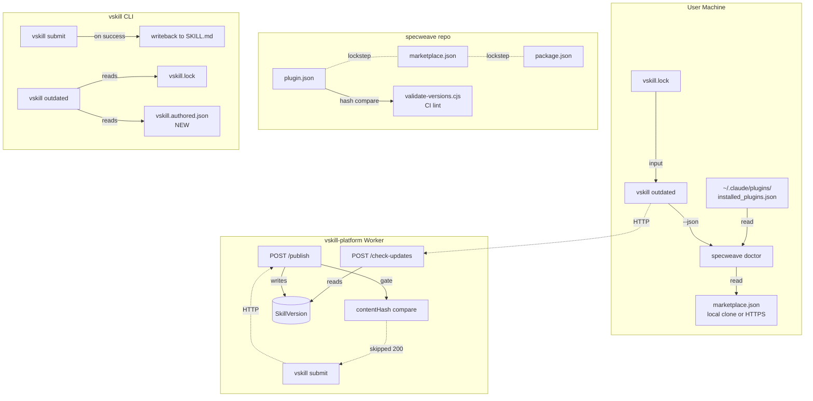
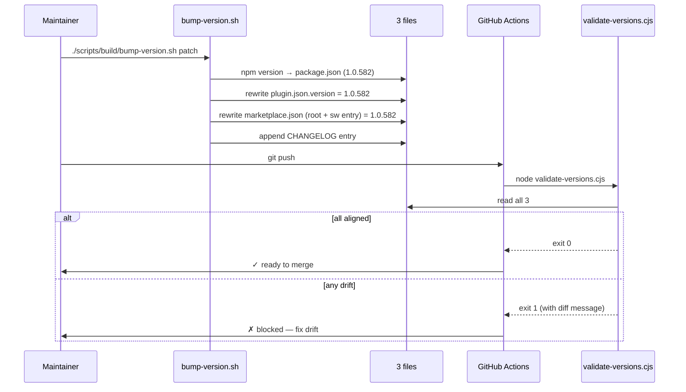
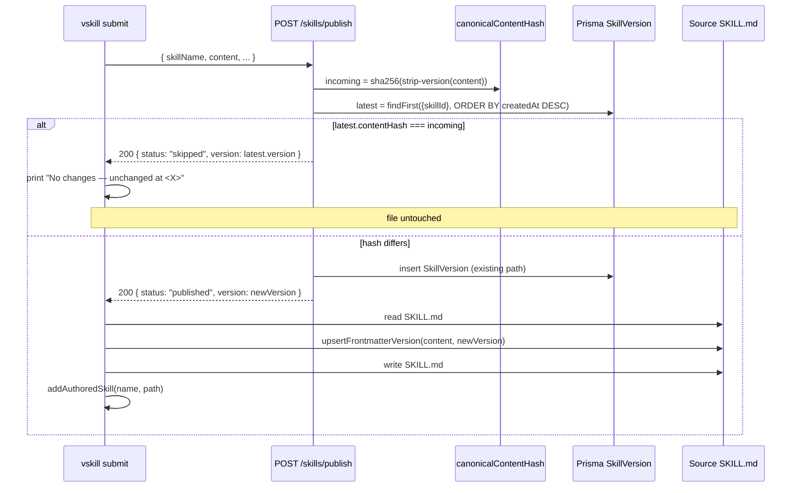
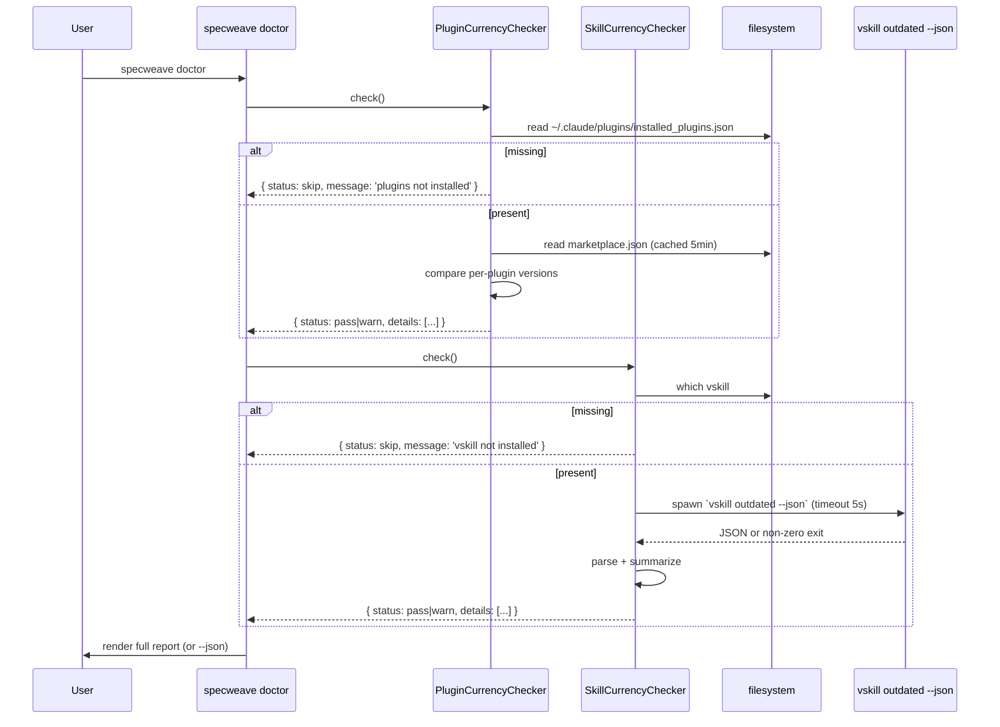

# Implementation Plan: Plugin Update Visibility & Version Alignment Foundation

**Increment**: 0794-plugin-update-visibility-foundation
**Type**: bug (cross-repo, P1)
**Created**: 2026-04-27
**Architect**: parallel-mode

> **Source of truth**: spec.md ACs (US-001..US-006). This plan provides the technical design that satisfies them. ADRs at `.specweave/docs/internal/architecture/adr/0794-{01..04}-*.md` document the load-bearing decisions.

## Overview

Bridge — not unify — Claude Code plugin marketplace and vskill registry. Three independent fixes land together because they share root cause (no contract between the two systems): three-way version lockstep on `sw@specweave`, contentHash gate on vskill publish, doctor checkers as the single update-visibility surface. ADR 0794-03 explains the bridged design; ADRs 0794-01/02/04 document each load-bearing choice.

**Touched repos**: 3 child repos — `specweave`, `vskill-platform`, `vskill`. Each gets an independent PR (no atomic merge). Suggested order: `vskill-platform` → `vskill` → `specweave` (US-001..US-006 dependency chain in spec).

**Key constraint**: NO new external services. Reuses Cloudflare Worker, KV, Prisma, GitHub Actions, npm — all already deployed.

## Architecture (high-level)



## Module-by-module design

### Repo 1: `specweave` (US-001, US-003, US-004, US-005)

#### 1.1 `scripts/build/bump-version.sh` (extend) — US-001

**Current behavior** (verified at lines 70-77, 82-128): runs `npm version <bump>`, writes `package.json`, drafts CHANGELOG entry, optionally commits + tags.

**Change**: after `npm version` updates `package.json`, write the same version into both:

- `plugins/specweave/.claude-plugin/plugin.json` `version` field
- `.claude-plugin/marketplace.json` root `version` field AND the per-plugin entry's `version` (the `plugins[name=sw].version` at line 15)

Implementation: a small inline `node -e` invocation (no new dep) that mutates each JSON file via `JSON.parse → write field → JSON.stringify(2 spaces)`. Preserves indentation and trailing newline.

```bash
# After existing `npm version` line:
node -e '
  const fs = require("fs");
  const v = require("./package.json").version;
  for (const p of ["plugins/specweave/.claude-plugin/plugin.json", ".claude-plugin/marketplace.json"]) {
    const j = JSON.parse(fs.readFileSync(p, "utf8"));
    if (p.endsWith("plugin.json")) j.version = v;
    else { j.version = v; if (Array.isArray(j.plugins)) j.plugins.forEach(pl => { if (pl.name === "sw") pl.version = v; }); }
    fs.writeFileSync(p, JSON.stringify(j, null, 2) + "\n", "utf8");
    console.log("  ✓ Updated " + p);
  }
'
```

Tests: integration test in `repositories/anton-abyzov/specweave/tests/integration/bump-version.test.ts` — clone a temp tree, run the script, assert all three files match.

#### 1.2 `scripts/validation/validate-versions.cjs` (NEW) — US-001

**Pattern source**: clone the structure of `scripts/validation/validate-plugin-manifests.cjs` (already verified — Node.js script, exits non-zero on failure, emoji-free output).

Reads:

- `package.json.version`
- `.claude-plugin/marketplace.json.version` AND `marketplace.json.plugins[name=sw].version`
- `plugins/specweave/.claude-plugin/plugin.json.version`

Asserts byte-equality. On mismatch, prints a unified-diff-style block:

```
✗ Version drift detected:
  package.json:                 1.0.582
  marketplace.json (root):      1.0.582
  marketplace.json (sw entry):  1.0.582
  plugin.json:                  1.0.0   ← MISALIGNED

  Fix: ./scripts/build/bump-version.sh patch
       (or hand-align all four to the same version)
```

Exit codes: `0` aligned, `1` drift, `2` missing/malformed file.

#### 1.3 `.github/workflows/test.yml` or new `validate-versions.yml` — US-001

Add a small job:

```yaml
validate-versions:
  runs-on: ubuntu-latest
  steps:
    - uses: actions/checkout@v4
    - run: node scripts/validation/validate-versions.cjs
```

Wire as a required check on `main` via repo settings (manual, post-merge of this increment).

#### 1.4 One-shot hotfix commit — US-001 AC-US1-02

A standalone commit (separate from the script changes) that writes the current `package.json.version` into `plugins/specweave/.claude-plugin/plugin.json`. Commit message: `fix(plugin): align plugin.json version to package.json (0794 US-001)`.

Order in PR: (a) hotfix commit; (b) bump-version.sh extension; (c) validator; (d) workflow wire. Hotfix first so CI lint passes from the moment the validator is wired in.

#### 1.5 `scripts/validation/validate-skill-versions.cjs` (NEW) — US-003

Walks `plugins/specweave/skills/*/SKILL.md`. For each:

- Parses YAML frontmatter (use the existing `gray-matter` if already a dep, else a minimal regex parser — verify in package.json before adding deps)
- Asserts `version` field is present and matches SemVer 2.0.0 regex (`^\d+\.\d+\.\d+(-[\w.-]+)?(\+[\w.-]+)?$`)

Exit non-zero with a list of offending paths, one per line.

Wire into existing `.github/workflows/skill-lint.yml` (already verified — `paths: plugins/specweave/skills/**`). Add a new step:

```yaml
- name: Validate SKILL.md versions
  run: node scripts/validation/validate-skill-versions.cjs
```

#### 1.6 One-shot stamp script — US-003 AC-US3-01, AC-US3-05

`scripts/build/stamp-skill-versions.sh` (NEW, idempotent):

- For each `plugins/specweave/skills/*/SKILL.md`:
  - If frontmatter has valid `version:` → SKIP (unchanged)
  - Else: insert `version: 1.0.0` immediately after `description:` line (or at end of frontmatter if no description)
- Logs each modification: `+ skills/<name>/SKILL.md (added version: 1.0.0)`
- Logs skipped: `= skills/<name>/SKILL.md (already has version: <X>)`

Run once, commit the resulting 47-file diff in a single commit referencing `0794 US-003`.

Use the same frontmatter helper that `vskill-platform/src/lib/skill-md/inject-version-if-missing.ts` already provides — verified to exist in submission/publish.ts:484. Port to a CLI-friendly version or shell out to a JS one-liner.

#### 1.7 `src/core/doctor/checkers/plugin-currency-checker.ts` (NEW) — US-004

**Pattern source**: clones structure of `installation-health-checker.ts:36-67` (verified).

```typescript
export class PluginCurrencyChecker implements HealthChecker {
  category = 'Plugin Currency';

  async check(projectRoot: string, options: DoctorOptions): Promise<CategoryResult> {
    // 1. Read ~/.claude/plugins/installed_plugins.json
    //    → on missing: return { status: 'skip', message: 'Claude Code plugins not installed' }
    //
    // 2. For each plugin entry, locate its source marketplace.json:
    //    - sw@specweave → repositories/anton-abyzov/specweave/.claude-plugin/marketplace.json
    //      (if present in workspace; otherwise GET https://raw.githubusercontent.com/...)
    //    - Other marketplaces (claude-plugins-official, etc.): cache 5-min via per-source URL
    //
    // 3. Compare installed vs marketplace per-plugin
    //
    // 4. Return CategoryResult:
    //    - All current → { status: 'pass', message: 'all N plugins current' }
    //    - Some outdated → { status: 'warn', message: 'N outdated', details: ['name@source: X → Y', ...],
    //                        fixSuggestion: 'Run: specweave refresh-plugins' }
    //    - Network/parse error → { status: 'warn', message: 'unable to verify', reason: ... }
  }
}
```

Register in `src/core/doctor/doctor.ts:27-36`:

```typescript
const checkers: HealthChecker[] = [
  // ... existing 8 ...
  new PluginCurrencyChecker(),
];
```

JSON-mode output (per AC-US4-03): the existing `formatDoctorReport` already covers text mode; JSON mode in `doctor.ts` writes the full `categories[]` array — no schema change needed beyond adding the new category. The spec's `pluginCurrency` key surfaces in the JSON output as a category entry; if a flatter shape is required, add a small JSON post-processor in the doctor entry point.

KV/disk caching: a small file cache at `~/.claude/specweave/cache/marketplace-{md5(url)}.json` with `mtime` check, TTL 5 minutes. Keeps the warm path under 500ms (AC-US4-06).

#### 1.8 `src/core/doctor/checkers/skill-currency-checker.ts` (NEW) — US-005

**Pattern**: same `HealthChecker` interface; thin shell-out to `vskill outdated --json`.

```typescript
async check(projectRoot, options) {
  // 1. `which vskill` → if missing, return skip
  // 2. cwd to projectRoot; check vskill.lock exists → if missing, return skip
  // 3. `execSync('vskill outdated --json', { timeout: 5000, cwd: projectRoot })`
  //    - exit 1 with valid JSON listing outdated → parse, return warn with details
  //    - exit 0 with [] → return pass
  //    - timeout / non-JSON → return warn { reason: 'unable to verify' }
  // 4. Format max 10 lines; truncate with "… +N more"
}
```

Register in `doctor.ts` after `PluginCurrencyChecker`.

The shell-out path is intentional — re-implementing `vskill outdated` logic in `specweave` would duplicate the disk-version reconcile contract (verified in `vskill/src/eval/disk-version.ts:75-85`). Shell-out is fragile only on PATH issues, which we explicitly handle as `skip` per AC-US5-04.

### Repo 2: `vskill-platform` (US-002a)

#### 2.1 `src/lib/integrity/canonical-hash.ts` (NEW)

Extract the contentHash canonicalization rules into a single helper:

```typescript
export async function canonicalContentHash(content: string): Promise<string> {
  // 1. Strip frontmatter `version:` line (single line YAML, leave nested under `metadata:` alone — see disk-version.ts:39-56 for the same convention)
  // 2. Normalize CRLF → LF
  // 3. UTF-8 SHA-256 (Web Crypto via crypto.subtle, matches existing trust/content-hash.ts:10-16)
  // 4. Return hex string
}
```

Used by both `submission/publish.ts` (replace inline `createHash` at line 631) and the new gate (2.2). Existing `trust/content-hash.ts:10-16` already has the SHA-256 primitive — wrap it with the version-strip preprocess.

#### 2.2 `src/app/api/v1/skills/publish/route.ts` (NEW or extend existing)

**Note**: spec.md US-002a references `POST /api/v1/skills/publish`. Verified file list at `vskill-platform/src/app/api/v1/skills/` — this exact route does NOT exist as a publish endpoint today. The actual publish path runs through `submission/publish.ts:185 publishSkill()` invoked by the submission API. **The plan**: confirm the actual publish surface during T-001 of impl. If it's submission-only, the gate goes into `publishSkill()` itself (the existing `contentUnchanged` logic at lines 417-428 already does this — extend it to be unconditional, not just submission-flow). If a separate `POST /publish` endpoint exists for direct CLI publishes, the gate goes there.

**Gate logic** (per ADR 0794-02):

```typescript
const incoming = await canonicalContentHash(body.content);
const latest = await db.skillVersion.findFirst({
  where: { skillId },
  orderBy: { createdAt: 'desc' },
  select: { contentHash: true, version: true },
});
if (latest && latest.contentHash === incoming) {
  return jsonResponse({ status: 'skipped', reason: 'no changes detected', version: latest.version });
}
// ... existing publish flow continues unchanged
```

Rate-limit counter still consumed (AC-US2a-04). No KV invalidation, no event emission, no SkillVersion insert.

#### 2.3 Tests

- Unit: `canonical-hash.test.ts` — same input → same hash; CRLF/LF parity; version-strip parity
- Integration: `publish-skip.test.ts` — POST identical body twice, assert second response shape and DB row count unchanged
- Contract: existing `dual-publish.test.ts` continues passing

### Repo 3: `vskill` (US-002b, US-006)

#### 3.1 `src/commands/submit.ts` (extend) — US-002b

After `submitSkill()` returns successfully (verified flow at lines 67-80):

```typescript
const response = await submitSkill({...});

if (response.status === 'skipped') {
  console.log(yellow('No changes — version unchanged at ') + bold(response.version));
  return; // do NOT modify file
}

// On 'published': writeback
const sourcePath = resolveSkillMdPath(opts);  // existing helper or simple join
const before = await fs.readFile(sourcePath, 'utf8');
const after = upsertFrontmatterVersion(before, response.version);  // see 3.2
// Defensive parse-then-serialize check (AC-US2b-04)
if (!validatesAsYamlFrontmatter(after)) {
  console.error(red('Writeback would produce invalid YAML — aborting'));
  process.exit(1);
}
await fs.writeFile(sourcePath, after, 'utf8');
console.log(green('✓ Updated ') + dim(sourcePath) + ' (version → ') + bold(response.version) + ')');
```

#### 3.2 `src/lib/frontmatter.ts` (NEW or extend existing)

`upsertFrontmatterVersion(content, newVersion)`:

- Parse `^---\n([\s\S]*?)\n---\n` (regex matches `disk-version.ts:35`)
- If `version:` line exists at top level → replace value (preserve quoting style from source)
- Else if `description:` line exists → insert `version: ${newVersion}` immediately after
- Else → append at end of frontmatter (before closing `---`)
- Re-emit content; return new full string

Reuse the YAML idiom from `disk-version.ts:39-56` (already verified). Do NOT add a new YAML library — the version line is a single key, regex-safe.

#### 3.3 `src/commands/outdated.ts` (extend) — US-006

After lockfile-driven items array (lines 63-81), append authored items:

```typescript
const authored = readAuthoredFile(getProjectRoot()); // [{ name, sourceSkillMdPath }]
for (const a of authored) {
  if (!existsSync(a.sourceSkillMdPath)) {
    pruneFromAuthored(a.name); // AC-US6-04
    console.error(dim(`⚠ ${a.name}: source path no longer exists, removed from tracking`));
    continue;
  }
  const v = readDiskVersion(a.sourceSkillMdPath);
  if (!v) continue;
  items.push({ name: a.name, currentVersion: v, sha: undefined, kind: 'authored' });
}
// ... existing checkUpdates() call ...
// Output: prefix `[authored]` for kind='authored' rows (AC-US6-02)
```

#### 3.4 `src/lockfile/authored.ts` (NEW) — US-006

A separate file `vskill.authored.json` (NOT mixed into vskill.lock per AC-US6-01 spirit):

```json
{
  "version": 1,
  "skills": {
    "owner/repo/skill-name": {
      "sourcePath": "skills/skill-name/SKILL.md",
      "publishedAt": "2026-04-27T..."
    }
  }
}
```

CRUD operations:

- `addAuthoredSkill(name, sourcePath)` — called from `submit.ts` after successful publish (US-002b path)
- `removeAuthoredSkill(name)` — called when `outdated` detects a missing source file
- `readAuthored()` — returns list

`vskill init` writes a `.gitignore` entry for `vskill.authored.json` (AC-US6-06) — verify the existing `init` command writes a default `.gitignore`; if not, add it as part of US-006.

## Sequence diagrams

### S1: Release flow with version lockstep (US-001)



### S2: vskill publish with contentHash gate (US-002a + US-002b)



### S3: specweave doctor running both new checkers (US-004 + US-005)



## ContentHash spec

Defined in ADR 0794-02. The canonical algorithm:

```
canonicalContentHash(content: string) -> string:
  1. content = content.replace(/\r\n/g, "\n")           // CRLF → LF
  2. content = stripTopLevelVersionLine(content)         // see below
  3. return sha256_hex(utf8_bytes(content))
```

**stripTopLevelVersionLine**: walks the frontmatter block (between `^---\n` and `\n---\n`) and removes a single line matching `/^version\s*:\s*[^\n]*$/m` at top indent (no leading whitespace). Lines under nested blocks like `metadata:\n  version: ...` are PRESERVED — they're part of skill metadata semantics and should affect the hash.

**Rationale**:
- Version is the only field that auto-changes on publish; stripping it prevents the hash from being a function of itself.
- Preserving everything else (whitespace, ordering, comments) makes the hash a strict content fingerprint.
- The function is idempotent: `canonicalContentHash(content) === canonicalContentHash(stripVersion(content))`.

**Test fixtures** (must be byte-identical between platform + CLI):
- `fixtures/no-frontmatter.md` (no version → no-op strip)
- `fixtures/with-version.md` (`version: 1.0.0` → stripped)
- `fixtures/version-quoted.md` (`version: "1.0.0"` → stripped)
- `fixtures/nested-metadata-version.md` (only nested → preserved)
- `fixtures/crlf-line-endings.md` (CRLF → normalized to LF before hash)

## CI lint design (`validate-versions.cjs`)

Single-file Node.js script, no deps, mirrors `validate-plugin-manifests.cjs` style.

```javascript
#!/usr/bin/env node
const fs = require('fs');

const sources = [
  { path: 'package.json', label: 'package.json',
    extract: j => j.version },
  { path: '.claude-plugin/marketplace.json', label: 'marketplace.json (root)',
    extract: j => j.version },
  { path: '.claude-plugin/marketplace.json', label: 'marketplace.json (sw entry)',
    extract: j => j.plugins.find(p => p.name === 'sw').version },
  { path: 'plugins/specweave/.claude-plugin/plugin.json', label: 'plugin.json',
    extract: j => j.version },
];

const results = sources.map(s => {
  if (!fs.existsSync(s.path)) return { ...s, version: null, error: 'file missing' };
  try {
    return { ...s, version: s.extract(JSON.parse(fs.readFileSync(s.path, 'utf8'))) };
  } catch (e) {
    return { ...s, version: null, error: e.message };
  }
});

const versions = new Set(results.filter(r => r.version).map(r => r.version));
const errors = results.filter(r => r.error);

if (errors.length) { /* print, exit 2 */ }
if (versions.size === 1) { /* aligned, exit 0 */ }

// Drift — print unified-diff-style block, exit 1
console.error('✗ Version drift detected:');
const longest = Math.max(...results.map(r => r.label.length));
const canonical = results[0].version;
for (const r of results) {
  const padded = r.label.padEnd(longest + 2);
  const marker = r.version === canonical ? '' : '  ← MISALIGNED';
  console.error(`  ${padded}${r.version}${marker}`);
}
console.error('\n  Fix: ./scripts/build/bump-version.sh patch (or hand-align)');
process.exit(1);
```

Runtime target: <1s including JSON parsing for these small files.

## Migration: stamp 47 SKILL.md files with version

**Approach**: one-shot script `scripts/build/stamp-skill-versions.sh` (idempotent — re-running modifies zero files if all already have versions).

**Initial value**: `1.0.0` for all 47 currently missing files.

**Why 1.0.0 and not the current marketplace version?**: The plugin (`sw`) is versioned `1.0.582` (after hotfix), but individual skills haven't had per-skill version semantics until now. Starting at 1.0.0 sets a clean baseline; future per-skill changes can bump independently if needed (out of scope for this increment).

**Risk**: an existing user has the plugin installed and runs `specweave doctor` immediately after upgrading → the doctor compares per-skill versions → the user's installed copy (without `version:`) and the new copy (`1.0.0`) won't differ in any meaningful way because both checkers compare PLUGIN versions (`installed_plugins.json` vs `marketplace.json`), not per-skill SKILL.md versions. **No active install is broken.**

**Future use of per-skill versions**: a separate increment can introduce `vskill outdated`-style polling for plugin-bundled skills against the registry. Out of scope here. The 1.0.0 baseline is groundwork.

**Idempotency check**: re-running the stamp script is a no-op for files that already have a valid `version:` (AC-US3-05). The script logs `=` for skipped, `+` for stamped. CI runs `validate-skill-versions.cjs` to keep the contract.

## Rollback plan

### If version-alignment lint blocks an emergency release

**Scenario**: production hotfix needed. `bump-version.sh` regresses or has a bug; can't rely on it.

**Manual override path**:

1. Hand-edit all four version locations to the same version (~2 minutes — locations are documented in the lint error message).
2. Push. CI runs lint; passes.
3. File a follow-up issue to fix `bump-version.sh`.

**Why no `--skip-validation` flag**: erodes the contract. The cost of hand-aligning is low; the value of the contract is high.

### If contentHash gate falsely blocks legitimate publishes

**Scenario**: a publish is `status: skipped` but the user actually changed the file.

**Diagnostic**: run `vskill publish --debug` (a flag to expose); compare the canonical hash on disk to the hash the API computes. If they differ, canonicalization has a bug — fix the helper.

**Mitigation**: contentHash mismatch is a logic error, not a data loss event. The user's source file is untouched (writeback only happens on `status: published`). Worst case is a delayed publish — never silent data corruption.

### If doctor checkers regress (false `warn` storm)

**Scenario**: doctor lights up "Plugin Currency: warn" for every user.

**Quick fix**: revert the checker registration in `doctor.ts` (one-line revert). Ship a patch. The data plumbing (lockstep, contentHash gate) is independent and stays.

**Why isolated**: the new checkers are read-only and additive. Removing them does not break any other check.

## Test strategy summary

(Planner will expand these into BDD test plans in tasks.md.)

### Unit tests

- `validate-versions.cjs`: aligned, drifted-2-of-4, drifted-3-of-4, missing-file, malformed-JSON
- `validate-skill-versions.cjs`: missing field, malformed SemVer, valid SemVer with prerelease + build
- `canonicalContentHash`: 5 fixtures (see ContentHash spec); CRLF/LF parity; nested-metadata-preserved
- `upsertFrontmatterVersion`: existing version replaced; missing version inserted after description; missing version + missing description → appended; quoted-style preserved
- `PluginCurrencyChecker`: all-current, one-outdated, missing installed_plugins, malformed marketplace, network-fail
- `SkillCurrencyChecker`: vskill missing PATH, vskill.lock missing, JSON parse, non-zero exit, timeout
- Authored tracking: add/remove/prune, source-file-missing pruning

### Integration tests

- `bump-version.sh`: temp clone → run script → assert 4 files match
- Publish flow: identical body twice → second is `skipped`, no DB row added
- Publish flow: 1-byte change → version bumps, new row inserted
- Submit + writeback: publish → read source SKILL.md → version field updated
- Submit + skipped: publish identical → mtime unchanged on source
- doctor end-to-end: tmp HOME with seeded inputs → assert text + JSON output

### E2E (manual gate per spec.md "Manual Verification Gates")

- Publish a dot-release; run `claude /plugin/list`; verify `sw@specweave` shows new version
- Run `vskill publish` twice on unchanged content; verify second prints "No changes" and source is byte-identical
- Run `specweave doctor` on a fresh install (no vskill on PATH); verify "Skill Currency: skip", exit 0

### Performance

- Doctor warm-cache overhead ≤500ms (AC-US4-06, AC-US5-06)
- Doctor cold (network) overhead ≤2000ms
- `validate-versions.cjs` runtime ≤1s
- contentHash gate adds ≤50ms to publish (one DB read on indexed `skillId + createdAt`)

## Cross-repo merge order

Per spec.md "Cross-Project Coordination Notes":

1. **vskill-platform first** (US-002a) — server gate must land before clients depend on it
2. **vskill second** (US-002b, US-006) — client writeback + authored tracking depend on the gate's behavior
3. **specweave last** (US-001, US-003, US-004, US-005) — doctor checkers depend on `vskill outdated` having stable behavior

Each PR is independent (separate CI runs, separate reviewers). No atomic cross-repo merge required. The increment is "complete" when all three PRs are merged.

## Out of scope (reaffirming spec.md)

- SSE / push to CLI
- Unified marketplace
- Cross-marketplace conflict resolver
- Session-start banner (Phase 2)
- Web dashboard
- Telemetry
- Backfilling versions for non-`sw` plugins

## Open questions for planner / impl

1. **Publish endpoint shape**: spec.md US-002a references `POST /api/v1/skills/publish` but the verified file list shows only the submission flow has direct DB writes for SkillVersion. If there is no separate `POST /publish` endpoint today, the gate goes into `submission/publish.ts:417-428` (extending `contentUnchanged` to be unconditional, not just submission-flow). Confirm during T-001 of impl.

2. **Frontmatter writeback YAML library**: spec.md AC-US2b-01 says "preserve frontmatter ordering and any non-version fields." The minimal-regex approach handles the version-line case but does NOT preserve formatting when the file uses block-style YAML. If `gray-matter` or `js-yaml` is already a vskill dep, prefer it. Otherwise, regex is acceptable — current SKILL.md files are flat key-value frontmatter.

3. **Authored skill tracking persistence**: a separate `vskill.authored.json` is the spec's preferred direction (AC-US6-01 says MUST NOT mix with installed-skill entries). Confirm the path during T-006 impl. `.gitignore` entry needs to land via `vskill init` — verify init writes a `.gitignore` today, add if missing.

These are NOT blockers — they are concrete questions the implementer answers in the first task of each repo's branch. The plan is complete enough to start.
