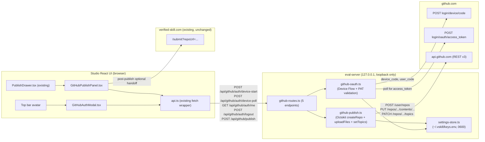
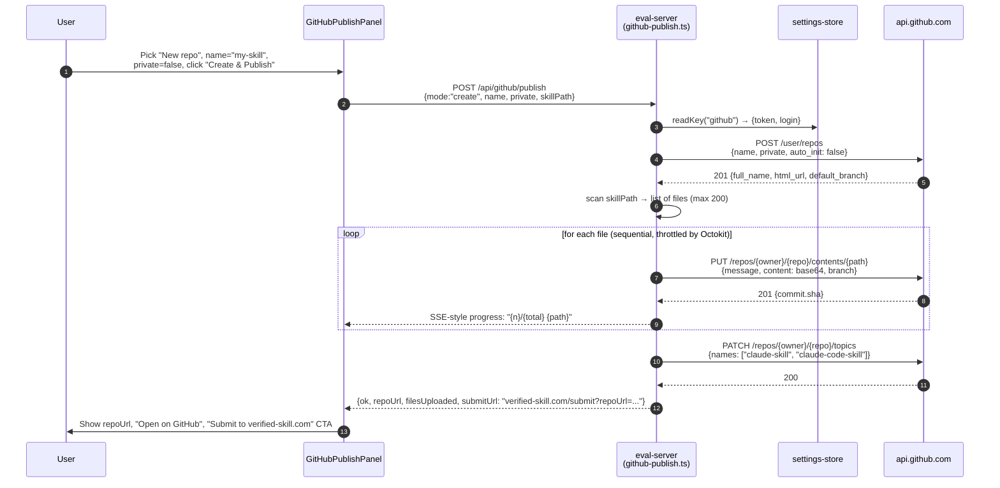
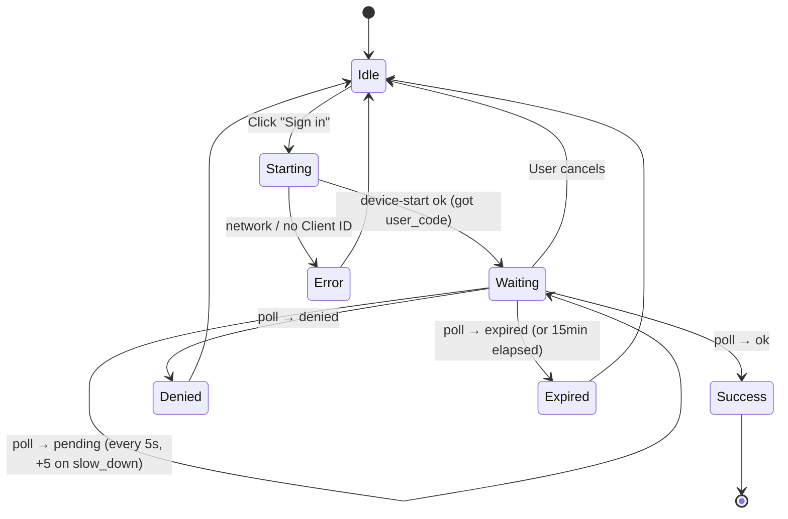

# Plan — GitHub OAuth + Publish-to-GitHub in vskill studio (Phase 0)

**Increment**: `0814-studio-github-publish-phase0`
**Working tree**: `repositories/anton-abyzov/vskill/`
**Architect agent**: this plan
**Companion**: `spec.md` (US-001 … US-00N), `tasks.md` (planner agent), ADRs `0814-01-device-flow-over-pkce-for-local-studio.md` and `0814-02-file-store-vs-keychain-phase0.md`

---

## 0. Goal in one paragraph

Add a parallel publish path inside `vskill studio` so a user signed in with GitHub can create a fresh GitHub repo and upload skill files via the GitHub REST Contents API — without `git init`, without re-typing creds, without leaving the Studio. The existing `git push`-based publish flow at `git-routes.ts:291` is **untouched**. New code lives entirely in the eval-server (3 new TS files) and the Studio React UI (2 new components), gated by a public OAuth Client ID embedded in `src/config/github.ts`. Storage reuses the existing `~/.vskill/keys.env` (POSIX 0600) settings-store with one new provider entry. The architecture is portable as-is to a future Tauri sidecar (server-held token + REST-only) — zero throwaway when Phase 1 wraps Studio in a desktop shell.

---

## 1. System architecture

### 1.1 Component diagram (new path only)



The dashed `verified-skill.com` integration is a one-click handoff (window.open with prefilled query string) — **no auto-submission** in Phase 0. Auto-submit needs platform JWT plumbing and is deferred to a separate increment.

### 1.2 Trust + traffic boundaries

| Hop | Direction | Authentication | CSRF posture |
|---|---|---|---|
| Browser → eval-server | localhost:PORT (loopback) | none (relies on loopback bind + Origin allow-list) | reuse `isRequestAllowed()` from `git-routes.ts:106-108` — Origin must match localhost regex |
| eval-server → github.com OAuth (Device Flow) | outbound HTTPS | Client ID only (public), `device_code` issued server-side | n/a |
| eval-server → api.github.com (REST) | outbound HTTPS | `Authorization: Bearer <token>` (token never leaves server) | n/a |
| eval-server → settings-store (disk) | local fs | POSIX 0600 mode | atomic temp-file + rename (existing) |
| Browser → verified-skill.com (handoff) | new browser tab | platform's existing session | out of scope — handoff only |

**Key invariant**: the GitHub access token never crosses the eval-server → browser boundary. The browser sees `{login, avatar, expiresAt}` only. This is what makes the architecture Tauri-portable: the future Tauri shell holds the token in Stronghold instead of `keys.env`, every other component is unchanged.

---

## 2. Sequence diagrams

### 2.1 Device Flow happy path (US-001)

```mermaid
sequenceDiagram
  autonumber
  participant U as User
  participant UI as Studio UI<br/>(GitHubAuthModal)
  participant ES as eval-server<br/>(github-oauth.ts)
  participant GH as github.com
  participant SS as settings-store<br/>(~/.vskill/keys.env)

  U->>UI: Click "Sign in with GitHub"
  UI->>ES: POST /api/github/auth/device-start
  ES->>GH: POST login/device/code<br/>{client_id, scope: "repo read:user"}
  GH-->>ES: {device_code, user_code, verification_uri, interval, expires_in}
  ES-->>UI: {user_code, verification_uri, expires_in}<br/>(device_code stays server-side)
  UI->>U: Show 6-char code + "Open github.com/login/device" button
  U->>GH: Open browser, paste user_code, approve

  loop every interval (default 5s, max 15min)
    UI->>ES: POST /api/github/auth/device-poll
    ES->>GH: POST login/oauth/access_token<br/>{client_id, device_code, grant_type: device_code}
    alt authorization_pending
      GH-->>ES: {error: "authorization_pending"}
      ES-->>UI: {status: "pending"}
    else slow_down
      GH-->>ES: {error: "slow_down"}
      ES-->>UI: {status: "pending", suggestedInterval: interval+5}
    else success
      GH-->>ES: {access_token, scope, token_type}
      ES->>GH: GET /user (validate + fetch login/avatar)
      GH-->>ES: {login, avatar_url}
      ES->>SS: writeKey("github", JSON{token, login, avatar, scopes, issuedAt})
      ES-->>UI: {status: "ok", login, avatar}
    end
  end

  UI->>U: Top bar shows avatar; modal closes
```

### 2.2 Multi-file publish to a new repo (US-002, happy path)



### 2.3 Update-existing publish (US-003)

```mermaid
sequenceDiagram
  autonumber
  participant U as User
  participant UI as GitHubPublishPanel
  participant ES as eval-server
  participant GH as api.github.com

  U->>UI: Pick "Update existing", select repo from list,<br/>click "Publish update"
  UI->>ES: POST /api/github/publish<br/>{mode:"update", owner, repo, skillPath}
  ES->>ES: scan skillPath → list of files

  loop for each file
    ES->>GH: GET /repos/{owner}/{repo}/contents/{path}
    alt file exists
      GH-->>ES: 200 {sha: existingSha}
      ES->>ES: compute newContent base64; skip if identical
      opt content changed
        ES->>GH: PUT /repos/{owner}/{repo}/contents/{path}<br/>{message, content, sha: existingSha}
        GH-->>ES: 200 {commit.sha}
      end
    else 404
      ES->>GH: PUT /repos/{owner}/{repo}/contents/{path}<br/>{message, content} (no sha → new file)
      GH-->>ES: 201 {commit.sha}
    end
    ES-->>UI: progress event
  end

  ES-->>UI: {ok, repoUrl, changed: N, skipped: M}
```

The "skip if identical" branch matters because skills often contain large prompt files that don't change between publishes — re-PUTting them would create empty commits. We hash the local content vs the remote SHA's blob and only PUT if different. (This is also the resume-on-failure mechanism for AC US-002 edge case — partial uploads can be retried safely.)

---

## 3. Component breakdown

### 3.1 Backend components (NEW)

#### `src/eval-server/github-oauth.ts` — auth primitives
**Project**: vskill

**Purpose**: Device Flow start/poll + PAT validation. Pure functions; injects `fetch` for tests.

**Public surface**:
```ts
export interface DeviceFlowStartResult {
  user_code: string;
  verification_uri: string;
  device_code: string;     // returned to caller (route stores in memory map keyed by sessionId)
  interval: number;        // seconds
  expires_in: number;      // seconds
}

export interface AuthRecord {
  token: string;           // never logged; never sent to UI
  login: string;
  avatar: string;
  scopes: string[];        // parsed from response
  issuedAt: string;        // ISO
}

export async function startDeviceFlow(deps: { fetch: typeof fetch; clientId: string }): Promise<DeviceFlowStartResult>;
export async function pollDeviceFlow(deps: { fetch: typeof fetch; clientId: string; deviceCode: string }): Promise<
  | { status: "pending"; slowDown: boolean }
  | { status: "denied" | "expired" }
  | { status: "ok"; record: AuthRecord }
>;
export async function validatePat(deps: { fetch: typeof fetch; token: string }): Promise<AuthRecord>;
export async function revokeToken(deps: { fetch: typeof fetch; clientId: string; token: string }): Promise<void>;
```

**Dependencies**: `@octokit/rest` for `validatePat` (uses `GET /user`); raw `fetch` for the two Device Flow endpoints because they live on `github.com`, not `api.github.com`, and Octokit's auth model assumes the latter.

**Test seam**: `deps.fetch` injectable; tests use `nock` or a stub to assert the exact request bodies (Device Flow is finicky about `application/x-www-form-urlencoded` vs JSON — GitHub historically required form, recent versions accept JSON with `Accept: application/json`; we send form for compat).

#### `src/eval-server/github-publish.ts` — publish primitives
**Project**: vskill

**Purpose**: Octokit-backed `createRepo`, `uploadFiles`, `setTopics`. No HTTP knowledge — accepts a constructed Octokit instance from the route layer.

**Public surface**:
```ts
import type { Octokit } from "@octokit/rest";

export interface PublishProgressEvent {
  kind: "file" | "topics" | "done";
  index?: number;
  total?: number;
  path?: string;
  status?: "uploaded" | "skipped" | "failed";
  message?: string;
}

export async function createRepo(o: Octokit, args: {
  name: string;
  description?: string;
  private: boolean;
}): Promise<{ owner: string; repo: string; htmlUrl: string; defaultBranch: string }>;

export async function uploadFiles(o: Octokit, args: {
  owner: string;
  repo: string;
  branch: string;
  files: Array<{ path: string; content: Buffer }>;  // path relative to repo root
  mode: "create" | "update";
  commitMessage: string;
  onProgress?: (e: PublishProgressEvent) => void;
}): Promise<{ uploaded: number; skipped: number }>;

export async function setTopics(o: Octokit, args: {
  owner: string;
  repo: string;
  topics: string[];   // ["claude-skill", "claude-code-skill"]
}): Promise<void>;
```

**Why Octokit not raw fetch**: see §4. Three behaviors we'd otherwise reimplement: (a) auth header injection, (b) automatic retry on `secondary_rate_limit` via the throttling plugin, (c) body shape for the Contents API (the field names `content`, `sha`, `branch` are easy to typo).

**Test seam**: tests construct Octokit with a mock `request.hook` (Octokit native test pattern) to assert request shapes; no network.

#### `src/eval-server/github-routes.ts` — HTTP wiring
**Project**: vskill

**Purpose**: Wire 5 endpoints to the `RouteRouter` instance, mirroring the structure of `git-routes.ts:registerGitRoutes`. Reuse `isRequestAllowed()` for CSRF/loopback guard — copied or imported from `git-routes.ts:91-108` (we extract `request-guards.ts` only if both files end up needing it; YAGNI for now — duplicate three lines is fine).

**Endpoints**:

| Method | Path | Body | Response |
|---|---|---|---|
| POST | `/api/github/auth/device-start` | `{}` | `{ user_code, verification_uri, expires_in, sessionId }` |
| POST | `/api/github/auth/device-poll` | `{ sessionId }` | `{ status: "pending"\|"ok"\|"denied"\|"expired", login?, avatar? }` |
| GET  | `/api/github/auth/me` | — | `{ signedIn: bool, login?, avatar?, scopes?, expiresAt? }` |
| POST | `/api/github/auth/logout` | `{}` | `{ ok: true }` |
| POST | `/api/github/publish` | `{ mode: "create"\|"update", name?, private?, owner?, repo?, skillPath, commitMessage }` | `{ ok, repoUrl, uploaded, skipped, submitUrl }` |

**State**: A module-level `Map<sessionId, { deviceCode, startedAt }>` holds in-flight Device Flow sessions. Cleaned on success/timeout. **`device_code` never leaves the eval-server.**

**Streaming**: `/api/github/publish` is plain JSON for v1 (single response after all files). Progress events are dropped server-side or logged. We can layer SSE later if user feedback demands it; the publish handler already calls `onProgress` so the upgrade is one route-layer change.

**Registration in `eval-server.ts`**: one new line right after `registerGitRoutes(router, root);` at line 103:

```ts
registerGitRoutes(router, root);
registerGithubRoutes(router, root);   // ← new
```

### 3.2 Frontend components (NEW)

#### `src/eval-ui/src/components/GitHubAuthModal.tsx`
**Project**: vskill

**Purpose**: Device Flow UX. Drives the polling state machine entirely from the UI side (eval-server is stateless across poll calls — it just talks to GitHub on each poll).

**State machine**:



**PAT fallback**: a "Use a Personal Access Token instead" link below the user-code reveals a textarea + "Validate" button. On validate, calls `POST /api/github/auth/pat` (a 6th tiny route — added inline to `github-routes.ts`; not separately listed in §3.1 because it's a 5-line handler that wraps `validatePat` from `github-oauth.ts`). Used for: (a) air-gapped users, (b) CI-style flows, (c) shipping ahead of OAuth App registration.

**Props**: `{ open, onClose, onAuthenticated(login, avatar) }`. No internal Octokit usage.

#### `src/eval-ui/src/components/GitHubPublishPanel.tsx`
**Project**: vskill

**Purpose**: New tab inside the existing `PublishDrawer.tsx`. Two modes:

- **New repo** — `<input>` for name (default = current skill folder name), `<select>` for visibility (Public/Private), description textarea, "Create & Publish" button.
- **Update existing** — list of repos from `GET /api/github/repos?topic=claude-skill&match=<skillName>` (a 7th lightweight route, also inline in `github-routes.ts`), default-selected if a unique match. "Publish update" button.

After success: green panel with `repoUrl` link, "Open on GitHub" (window.open), "Submit to verified-skill.com" (window.open `?repoUrl=…&skillPath=…`).

**Sign-in gate**: if `GET /api/github/auth/me` returns `signedIn: false`, the panel renders a "Sign in with GitHub" CTA that opens `<GitHubAuthModal/>`. After modal success, panel re-fetches `/me` and renders the form.

### 3.3 Modifications to existing files (light touches)

| File | Change | Lines (rough) |
|---|---|---|
| `src/eval-server/providers.ts` | Add `"github"` to `ProviderDescriptor.id` union; **do NOT add to `PROVIDERS` const** (github stores a JSON blob, not a single key — see §3.4) | +1 line union, plus a separate exported list of "extended providers" |
| `src/eval-server/settings-store.ts` | Add `readJsonKey<T>(provider): T \| null` and `writeJsonKey(provider, blob: T)` helpers — same atomic write + 0600 + dotenv-line `KEY=<base64-json>` | +30 lines, no API break |
| `src/eval-server/eval-server.ts:103` | Add `registerGithubRoutes(router, root);` after `registerGitRoutes` | +1 line |
| `src/eval-ui/src/components/PublishDrawer.tsx` | Wrap existing UI in a tab container; add "GitHub" tab rendering `<GitHubPublishPanel/>` | ~+15 lines, zero behavior change to existing path |
| `src/eval-ui/src/api.ts:1092-1113` | Add `api.githubAuth.{startDevice,pollDevice,me,logout,pat}` and `api.githubPublish(...)` | +60 lines |
| `src/config/github.ts` (NEW) | `export const GITHUB_CLIENT_ID = process.env.VSKILL_GITHUB_CLIENT_ID ?? ""; export const isDeviceFlowEnabled = () => !!GITHUB_CLIENT_ID;` | NEW, ~10 lines |
| `src/index.ts:269-280` (CLI) | OPTIONAL: `vskill auth login\|logout\|status` subcommand calling the same routes via the local eval-server | ~+50 lines (defer if scope tight) |

### 3.4 Token storage layout

`settings-store.ts` extension stores the GitHub auth as one dotenv line with a base64-JSON value:

```
GITHUB_AUTH=eyJ0b2tlbiI6Imdob19...IiwibG9naW4iOiJhbnRvbi1hYnl6b3YiLCJhdmF0YXIiOiJodHRwczovLy4uLiIsInNjb3BlcyI6WyJyZXBvIiwicmVhZDp1c2VyIl0sImlzc3VlZEF0IjoiMjAyNi0wNC0zMFQuLi4ifQ==
```

Decoded JSON shape:
```ts
{
  token: string;     // gho_...
  login: string;
  avatar: string;    // URL
  scopes: string[];
  issuedAt: string;  // ISO
  // expiresAt intentionally omitted: GitHub OAuth tokens don't expire by default
  //   for OAuth Apps. Future per-user-token GitHub Apps add expiry — handle then.
}
```

Why one blob instead of 4 lines: the redacting logger already redacts whole values, so collapsing to one line means the entire payload is auto-redacted. Splitting to `GITHUB_TOKEN`/`GITHUB_LOGIN`/`GITHUB_AVATAR`/`GITHUB_SCOPES` would expose the non-secret fields by accident on first run of any future logger refactor.

---

## 4. Library choices

### 4.1 `@octokit/rest` + `@octokit/plugin-throttling`

**Decision**: use Octokit for all `api.github.com` calls. Use raw `fetch` for the two `github.com/login/...` Device Flow endpoints (Octokit's auth strategies don't model unauthenticated Device Flow cleanly).

**Why Octokit over plain `fetch`**:
- **Throttling for free**: `@octokit/plugin-throttling` handles `secondary_rate_limit` (the 30-req/min repo creation cap) and primary rate limit headers via configurable retry callbacks. Replicating this in raw `fetch` is ~80 lines of date math + Retry-After parsing + jitter.
- **Typed responses**: `@octokit/types` gives us `RestEndpointMethodTypes["repos"]["create"]` etc. — the Contents API request body is fiddly enough that the type safety pays off in tests alone.
- **Negligible weight**: server-side dependency only. Eval-ui browser bundle is unaffected.
- **Already a community standard**: easier code-review by future contributors than a hand-rolled wrapper.

**Pinning**: `@octokit/rest@^21` (current major), `@octokit/plugin-throttling@^9`. Both ESM, zero native deps.

**Config**:
```ts
const octokit = new Octokit({
  auth: token,
  throttle: {
    onRateLimit: (retryAfter, options, _o, retryCount) => retryCount < 2,
    onSecondaryRateLimit: (retryAfter, options, _o, retryCount) => retryCount < 2,
  },
});
```

The `onRateLimit` callback returns `true` to allow Octokit to retry — capped at 2 retries to bound publish latency.

### 4.2 No new browser deps

`GitHubAuthModal` and `GitHubPublishPanel` use existing Studio primitives (Tailwind, the existing modal/dialog components). No `@octokit/*` in the browser bundle (token never leaves the server).

---

## 5. Risk register

| # | Risk | Likelihood | Impact | Mitigation |
|---|---|---|---|---|
| R1 | OAuth App registration delayed → Device Flow blocked | Medium | High (blocks US-001 only) | PAT path ships independently; `isDeviceFlowEnabled()` flag in `src/config/github.ts` hides Device Flow CTA when `GITHUB_CLIENT_ID` is empty — the modal opens directly to the PAT tab |
| R2 | GitHub API rate limit during multi-file publish | Low for normal skills (<50 files), Medium for monorepo-style skills | Medium (slow publish, partial state) | Octokit `@octokit/plugin-throttling` auto-retries; UI shows "rate limited, retrying in Ns"; user can cancel; partial state is recoverable via the "update existing" mode (read SHA, skip identical, PUT changed) |
| R3 | Repo-name collision (`POST /user/repos` returns 422) | Medium for popular names | Low | UI shows "name taken, suggest variant" with auto-suggested suffix `-1`, `-2`, … |
| R4 | Network drop mid-publish → partial commits | Medium | Medium | Resume button re-runs publish in `update` mode; SHA-aware uploader skips identical content (no spurious empty commits) |
| R5 | Token leak in logs | Low (existing redacting logger) | Critical | Pin `GITHUB_AUTH` to redacting logger (existing infra); add a regression test that logs a publish error and asserts the token byte sequence is absent |
| R6 | Token-stealing JS in a malicious skill rendered in Studio | Low (Studio doesn't render skill JS) | Critical if it happened | Token is server-held — never reaches DOM. CSRF guard rejects cross-origin POSTs to `/api/github/*`. Documented in ADR-0814-01 §Security |
| R7 | PAT with insufficient scope (`public_repo` only, missing `repo`) | Medium during early adoption | Medium (publish fails opaquely) | `validatePat` reads `X-OAuth-Scopes` header on `GET /user`; rejects with explicit "needs `repo` scope" error before storing |
| R8 | User signs out and back in with a different account | Low | Low | `settings-store.writeJsonKey("github", ...)` overwrites cleanly; UI re-fetches `/me` |
| R9 | Token expiry mid-session (future GitHub App tokens) | n/a in Phase 0 (OAuth App tokens don't expire) | Medium when it lands | UI catches 401, prompts re-auth, paused publish state preserved in component |
| R10 | Eval-server port-forwarded to a public network | Low (binds 127.0.0.1 by design) | Critical | Loopback bind + Origin allow-list (existing `isRequestAllowed`); explicit reject test in `__tests__/github-routes.test.ts` for non-loopback `remoteAddress` |
| R11 | Phase 1 Tauri rework forces a rewrite of this code | Low | Low | Architecture is REST-only with server-held token — Tauri sidecar swaps `keys.env` for Stronghold and is otherwise untouched. Migration plan documented in ADR-0814-02 |
| R12 | `@octokit/rest` major-version bump breaks build during routine update | Low | Low | Pin minor (`^21`); CI lockfile; release-only updates with PR review |

---

## 6. Migration path to Phase 1 (Tauri shell)

The Phase 0 architecture is explicitly designed so that a future Tauri shell wraps Studio without rewriting any of this increment's code.

**What changes in Phase 1**:
- The eval-server becomes a Tauri sidecar (same Node binary, same routes, same code paths).
- `settings-store.writeJsonKey("github", blob)` is replaced by a Tauri Stronghold call. We add a one-shot migration: on Tauri's first launch, read `~/.vskill/keys.env`, write the GitHub auth blob to Stronghold, `unlink` the file. The migration lives in the Tauri bootstrap, not in this codebase.
- The browser becomes a Tauri WebView. The fetch layer (`api.ts`) is unchanged because Tauri WebViews accept `fetch("/api/github/...")` against the bundled sidecar.

**What stays identical**:
- `github-oauth.ts`, `github-publish.ts`, `github-routes.ts` — every byte.
- `GitHubAuthModal.tsx`, `GitHubPublishPanel.tsx` — every byte.
- The Device Flow itself — Tauri can still pop `verification_uri` in the system browser; same UX.

This portability is **the** reason we chose REST-only + server-held-token in Phase 0. The alternative (browser-side Octokit + localStorage token) would have shaved a few hours off Phase 0 but forced a rewrite at Phase 1.

---

## 7. Architecture decision records

Two ADRs are written alongside this plan:

- **ADR 0814-01** — Device Flow over PKCE/web OAuth for local Studio. Justifies the headline auth choice (no callback URL needed; native local-app fit; smaller attack surface than a localhost OAuth callback).
- **ADR 0814-02** — File-based settings-store reuse vs OS keychain in Phase 0. Records the deliberate deferral of keychain integration to Phase 1 (Tauri Stronghold), with the migration plan above.

Both ADRs live in `.specweave/docs/internal/architecture/adr/` per project convention.

---

## 8. Testing strategy (high level — full breakdown in tasks.md)

| Layer | Tooling | Coverage target |
|---|---|---|
| Unit | Vitest with `nock` for github.com calls | Device Flow state machine (timing, expiry, denied, slow_down); settings-store `readJsonKey`/`writeJsonKey` round-trip; `validatePat` scope validation |
| Integration | Vitest exercising the full `RouteRouter` against a stubbed Octokit | All 5 (+2 inline) routes happy + error paths; CSRF/loopback rejection regression |
| E2E | Playwright (existing harness) | `e2e/github-publish.spec.ts` — boot Studio → mock device-flow start → simulate `device-poll` resolution → click "Create & Publish" with a fixture skill → assert the captured Octokit call matches the expected REST sequence |
| Manual smoke | Real publish to `anton-abyzov/vskill-test-publish` using a real PAT, then again via real Device Flow once OAuth App lands | Documented in spec.md verification section |

**Coverage gates**: 90% line coverage on the three new server files; 100% of AC scenarios covered by E2E.

---

## 9. Implementation phases

### Phase A — Foundation (1.0 day)
1. Add `github` provider to `providers.ts` union + extended-providers list
2. `settings-store.ts`: `readJsonKey` / `writeJsonKey` helpers + tests
3. `src/config/github.ts` with `GITHUB_CLIENT_ID` + `isDeviceFlowEnabled()`
4. Stub `github-routes.ts` with a single `/api/github/auth/me` returning `{signedIn:false}` to validate wiring

### Phase B — Auth (1.5 days)
5. `github-oauth.ts` (Device Flow + PAT validation + revoke)
6. Wire all 5 (+1 PAT) auth-related endpoints in `github-routes.ts`
7. `GitHubAuthModal.tsx` with Device Flow state machine + PAT fallback
8. Top-bar avatar/sign-in indicator
9. Unit + integration tests for auth path

### Phase C — Publish (1.5 days)
10. `github-publish.ts` (`createRepo`, `uploadFiles`, `setTopics`)
11. `/api/github/publish` route + repos-list helper route
12. `GitHubPublishPanel.tsx` (new + update modes)
13. `PublishDrawer.tsx` tab integration
14. `api.ts` client extensions
15. Unit + integration tests for publish path

### Phase D — Polish + ship (0.5 day)
16. E2E spec
17. Optional `vskill auth login|logout|status` CLI subcommand (defer if scope tight)
18. README "Publishing from Studio" section
19. Manual smoke: real PAT publish → real Device Flow publish → "Submit to verified-skill.com" handoff

---

## 10. Out of scope (deferred)

- **Tauri/Electron shell** — separate increment (Phase 1)
- **OS keychain migration** — happens with Tauri shell (Stronghold)
- **Auto-submit to verified-skill.com** — needs platform JWT plumbing; one-click handoff is good enough for v1
- **GitHub App** (vs OAuth App) — fine-grained per-repo perms; only worth it once we have many users
- **Migrating existing `git push` flow to REST** — leaves users with existing remotes undisturbed; revisit only if it becomes a maintenance burden
- **Multi-account / org-account selection** — single signed-in account is enough for v1
- **SSE streaming progress for large publishes** — UI shows "uploading N/total" once per file via JSON response; SSE is a future polish if user feedback demands it
