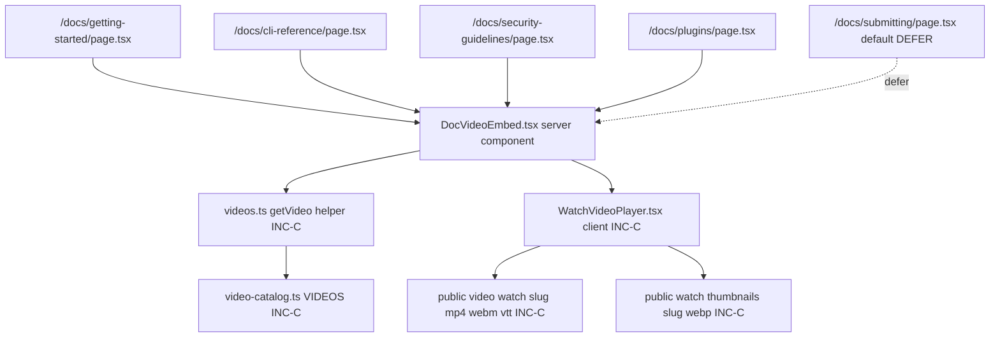

# Implementation Plan: Inline /watch videos on 4 /docs pages, delete dead VideoHero + orphan video assets, lift unique scene-kit components

INC-D (final) of the verified-skill.com video overhaul (master plan: `~/.claude/plans/curried-beaming-summit.md`). Foundations: ADR `0810-01-video-pipeline-and-token-sync.md` (scene-kit + script-as-data), ADR `0812-01-studio-video-refresh-and-docs.md` (`/docs/studio` inline-video precedent + `<track>` wiring on `VideoPlayer.tsx`), ADR `0817-01-watch-library-rename-and-renders.md` (`video-catalog.ts`, `WatchVideoPlayer`, the 4 rendered 101 videos, `captionsSrc` field on the `Video` catalog type).

**Hard scoping rule for this plan**: assume INC-A, INC-B, AND INC-C are all FULLY MERGED before any task in this plan starts. Every catalog-name, player-name, and asset-path reference here is the post-INC-C name. If any of those increments are still open at the time INC-D is dispatched, INC-D blocks — see §2.

All file paths are inside `repositories/anton-abyzov/vskill-platform/` unless explicitly prefixed otherwise.

## 0. Reading order

1. `spec.md` (this increment) — 3 user stories, 21 ACs, OQ-1/OQ-2/OQ-3.
2. ADR `0817-01-watch-library-rename-and-renders.md` — INC-C contract this plan consumes (post-rename catalog + player + asset paths).
3. ADR `0812-01-studio-video-refresh-and-docs.md` — INC-B precedent for inline-video-in-docs (the pattern this plan generalizes for `DocVideoEmbed`).
4. ADR `0810-01-video-pipeline-and-token-sync.md` — INC-A foundation (scene-kit + tokens; relevant only to US-003 lift).
5. `.specweave/docs/internal/architecture/adr/0818-01-docs-inline-videos-and-cleanup.md` (this increment's ADR, written alongside this plan).
6. Master plan `~/.claude/plans/curried-beaming-summit.md` (4-part sequence — INC-D closes it).

## 1. Goal

Inline 4 `/watch` 101-series videos at the top of their topic-matched `/docs/*` pages via a new thin `DocVideoEmbed` server component, delete ~8.5 MB of confirmed-orphan video assets plus the unused `VideoHero` component and its test, and inspect the legacy `repositories/anton-abyzov/specweave/docs-site/remotion/` directory for unique scene-kit candidates with explicit defer-by-default semantics. The plan generalizes the inline-video pattern shipped on `/docs/studio` (INC-B) into a reusable component, threads INC-C's `WatchVideoPlayer` `captionsSrc` prop through, and gates every deletion behind a documented `rg` zero-references check before any `git rm`. The new component is intentionally tiny (server-side catalog lookup + lazy-loaded client island), the deletions are behind verifiable evidence, and the optional scene-kit lift is structured so the inspection report alone counts as completion if risk surfaces.

## 2. Dependencies (HARD blocker — increment cannot start until all are merged)

| Increment | Status precondition | What this plan consumes |
|---|---|---|
| **INC-A 0810** — `MUST be MERGED` | scene-kit foundation at `src/remotion/scene-kit/`, `BRAND_COLORS`, scene-kit conventions for new components | US-003 lift target directory and component contract |
| **INC-B 0812** — `MUST be MERGED` | `/docs/studio` page rendering `VideoPlayer` with `captionsSrc="/video/skill-studio.vtt"` (the inline-embed pattern); `VideoPlayer.tsx` accepts `captionsSrc` prop | US-001 architectural precedent for `DocVideoEmbed` |
| **INC-C 0817** — `MUST be MERGED` | `src/lib/learn/video-catalog.ts` (renamed from `video-data.ts`) exporting `VIDEOS`; `src/app/components/learn/WatchVideoPlayer.tsx` (renamed from `LazyVideoPlayer.tsx`) with `captionsSrc` prop wired; 4 rendered 101 videos at `public/video/watch/{getting-started-101,cli-commands-101,security-scan-101,plugin-marketplace-101}.{mp4,webm,vtt}` plus thumbnails at `public/watch/thumbnails/<slug>.webp`; `Video.captionsSrc` typed in `videos.ts` | US-001 catalog source + player target + actual video files to embed |

If any precondition is unmet, the implementer aborts at task T-001 (precondition check) and surfaces the gap to the user. Do NOT proceed past T-001 with any of the three increments unmerged. **No partial-merge allowance** — INC-C in particular has 4 video renders + the player rename + the catalog rename all in one increment, and any of those landing late corrupts INC-D's catalog lookup.

Other dependencies (non-blocking — environmental):

- Local dev server runnable at `http://localhost:3000` for AC-US1-07 captions + Claude Preview / Playwright verification.
- `rg` (ripgrep) available — used for FR-004 pre-deletion gates.
- Brand decisions locked per memory `project_video_brand_decisions_2026_04.md` — no YouTube embeds anywhere in this increment.
- Local-preview rule per memory `feedback_video_local_preview.md` — closure summary MUST include screenshots from a running local dev server, not "go check yourself".

## 3. File touch list (grouped by user story)

### US-001: inline /watch videos on 4 /docs pages

**Create:**

- `repositories/anton-abyzov/vskill-platform/src/app/components/docs/DocVideoEmbed.tsx` — NEW thin server component (~50–80 LOC).
- `repositories/anton-abyzov/vskill-platform/src/app/components/docs/__tests__/DocVideoEmbed.test.tsx` — Vitest specs for catalog hit + miss + JSX-shape assertions.
- `repositories/anton-abyzov/vskill-platform/tests/e2e/docs-inline-video.spec.ts` — Playwright E2E covering all 4 pages, captions track, "Watch full episode" link.

**Modify:**

- `repositories/anton-abyzov/vskill-platform/src/app/docs/getting-started/page.tsx` — insert `<DocVideoEmbed slug="getting-started-101" />` as first JSX child of body.
- `repositories/anton-abyzov/vskill-platform/src/app/docs/cli-reference/page.tsx` — insert `<DocVideoEmbed slug="cli-commands-101" />` as first JSX child of body.
- `repositories/anton-abyzov/vskill-platform/src/app/docs/security-guidelines/page.tsx` — insert `<DocVideoEmbed slug="security-scan-101" />` as first JSX child of body.
- `repositories/anton-abyzov/vskill-platform/src/app/docs/plugins/page.tsx` — insert `<DocVideoEmbed slug="plugin-marketplace-101" />` as first JSX child of body.
- `repositories/anton-abyzov/vskill-platform/src/app/docs/submitting/page.tsx` — **DEFAULT: untouched** (per OQ-1 default DEFER + plan §6, AC-US1-08). One-sentence comment added inside the page recording the defer rationale; no `DocVideoEmbed` import. Alt path retained behind a plan-review override (§6).

**Touch (only if OQ-2 resolves to "extend player"):**

- `repositories/anton-abyzov/vskill-platform/src/app/components/learn/WatchVideoPlayer.tsx` — extend prop signature with whatever `DocVideoEmbed` requires that's missing post-INC-C. Default expectation: NO touch needed (see §4.6 OQ-2 resolution path).

### US-002: dead code + orphan video deletion

**Delete (via `git rm`, post-grep verification):**

- `repositories/anton-abyzov/vskill-platform/src/app/components/homepage/VideoHero.tsx` (~150 LOC, never imported).
- `repositories/anton-abyzov/vskill-platform/src/app/components/homepage/__tests__/VideoHero.test.tsx` — sibling test for the deleted component.
- `repositories/anton-abyzov/vskill-platform/public/video/ship-while-you-sleep.mp4` (~3 MB orphan).
- `repositories/anton-abyzov/vskill-platform/public/video/specweave-promo.mp4` (~3.5 MB orphan).
- `repositories/anton-abyzov/vskill-platform/public/video/specweave-promo.webm` (~2 MB orphan).

**Modify:** none in US-002 (deletions only). The build/test gate after deletion catches accidental references.

### US-003: scene-kit lift inspection (default-deferrable)

**Create (always):**

- `.specweave/increments/0818-docs-inline-videos-and-dead-code-cleanup/reports/scene-kit-lift-inspection.md` — inspection report enumerating every `.tsx` under `repositories/anton-abyzov/specweave/docs-site/remotion/` with LIFT/SKIP/DEFER recommendation per file.

**Create (only if any LIFT candidates land — conditional on inspection outcome):**

- `repositories/anton-abyzov/vskill-platform/src/remotion/scene-kit/<ComponentName>.tsx` — one file per lifted component.
- `repositories/anton-abyzov/vskill-platform/src/remotion/scene-kit/__tests__/<ComponentName>.test.tsx` — sibling test per lifted component.

**Modify (only if any LIFT lands):**

- `repositories/anton-abyzov/vskill-platform/src/remotion/scene-kit/index.ts` — append exports for the lifted components.

**Move OR delete (US-003 final step, conditional):**

- `repositories/anton-abyzov/specweave/docs-site/remotion/` →
  - **Default**: `git mv` → `repositories/anton-abyzov/specweave/docs-site/.archive/remotion-2026-05/` (preserves git history per OQ-3 default ARCHIVE).
  - **Alt**: `git rm -r` if the architect green-lights outright deletion at plan review (only when inspection shows zero unique components).

**Skipped entirely if US-003 defers:** if AC-US3-05 fires (all components classified DEFER, OR the user/architect rejects the lift at plan review), only the inspection report is written; no creates, no moves, no edits. The increment still closes — the inspection IS the deliverable.

## 4. US-001 plan — DocVideoEmbed component design

### 4.1 Server component vs client component

**Decision: thin server component wrapping the existing `WatchVideoPlayer` client island.** `DocVideoEmbed` itself has NO `"use client"` directive. It does the catalog lookup synchronously at render time on the server, then mounts `WatchVideoPlayer` as the client island that handles play/pause/captions interactions. Three reasons:

1. **No client state in the lookup.** Reading `VIDEOS` from `video-catalog.ts` is a pure synchronous array `find()`. There's no reason to ship the catalog or the lookup logic to the browser — that would bloat the JS bundle for every `/docs/*` page by the size of the catalog (~2–3 KB minified) for zero benefit.
2. **Matches `/docs/studio`'s INC-B shape.** `/docs/studio/page.tsx` is itself a server component (no `"use client"`) that renders `VideoPlayer` (client) inline. Mirroring that shape keeps the two embed patterns architecturally identical — `VideoPlayer` for `/docs/studio`, `WatchVideoPlayer` for the new `/docs/*` pages, both lazy client islands inside server pages.
3. **Lazy-load happens inside `WatchVideoPlayer`, not inside `DocVideoEmbed`.** INC-C's `WatchVideoPlayer.tsx` already implements lazy loading (the file was renamed from `LazyVideoPlayer.tsx` for a reason — its `Lazy` semantics are intact post-rename per ADR 0817-01 §10). `DocVideoEmbed` doesn't need to wrap it again with `next/dynamic`; that would be redundant and add a Suspense boundary for nothing.

### 4.2 Props contract

```ts
type DocVideoEmbedProps = {
  /** Catalog slug — must match a VIDEOS[].slug entry from src/lib/learn/video-catalog.ts */
  slug: string;
  /** Optional override for the "Watch full episode" link text — defaults to "Watch full episode" */
  ctaLabel?: string;
  /** Optional override for the player aspect ratio — defaults to whatever WatchVideoPlayer's default is */
  aspectRatio?: "16/9" | "21/9";
};
```

`slug` is mandatory; `ctaLabel` and `aspectRatio` are optional escape hatches we provide for future reusability but DO NOT exercise on the 4 in-scope pages (all 4 pages call with just `slug`). This forecloses a future "wait, this can't take a custom CTA?" follow-up without leaking tracking complexity into the v1 surface.

### 4.3 Catalog lookup pattern

Mirrors the post-INC-C `getVideo(slug)` helper exported from `src/lib/learn/videos.ts` (see ADR 0817-01 §D1, mentioning `getVideo(slug)` is consumed in `/watch/[slug]/page.tsx`). `DocVideoEmbed.tsx`:

```tsx
import { getVideo } from "@/lib/learn/videos";
import WatchVideoPlayer from "@/components/learn/WatchVideoPlayer";

export default function DocVideoEmbed({ slug, ctaLabel = "Watch full episode" }: DocVideoEmbedProps) {
  const video = getVideo(slug);
  if (!video) {
    if (process.env.NODE_ENV !== "production") {
      console.warn(`[DocVideoEmbed] No catalog entry for slug="${slug}" — rendering null`);
    }
    return null;
  }
  return (
    <div className="doc-video-embed mb-8">
      <WatchVideoPlayer
        slug={slug}
        mp4={video.sources.mp4}
        webm={video.sources.webm}
        poster={video.thumbnail}
        captionsSrc={video.captionsSrc}
        ariaLabel={video.title}
      />
      <p className="mt-2 text-sm">
        <Link href={`/watch/${slug}`}>{ctaLabel} →</Link>
      </p>
    </div>
  );
}
```

The exact `WatchVideoPlayer` prop names (`slug`, `mp4`, `webm`, `poster`, `captionsSrc`, `ariaLabel`) are derived from the post-INC-C player file — see OQ-2 resolution path in §4.6 below for the planning-time check.

### 4.4 Captions / poster wiring

The `Video` catalog type after INC-C (per ADR 0817-01 §D3) carries:

- `sources.mp4` — points at `/video/watch/<slug>.mp4`.
- `sources.webm` — points at `/video/watch/<slug>.webm`.
- `thumbnail` — points at `/watch/thumbnails/<slug>.webp`.
- `captionsSrc` — optional, points at `/video/watch/<slug>.vtt` (typed in `videos.ts` per ADR 0817-01 §D3, populated for the 4 published 101 slugs).

`DocVideoEmbed` passes ALL of these straight to `WatchVideoPlayer`. The `<track kind="captions">` rendering is `WatchVideoPlayer`'s responsibility — exactly how INC-B's `VideoPlayer.tsx` handled it for `/docs/studio` (see ADR 0812-01 §8.2: `<track>` renders only when `captionsSrc` is provided).

For the 4 in-scope slugs, `captionsSrc` IS populated (INC-C ships all 4 `.vtt` files). AC-US1-07 then asserts the `.vtt` returns 200 and `<track>` has a non-empty `src` — verified via Playwright network capture.

### 4.5 "Watch full episode" link styling

Match the INC-B `/docs/studio` precedent. Reading `/docs/studio/page.tsx` (per the INC-B plan §9.3), the body uses prose styling under `DocsLayout`. The CTA below the player is:

```tsx
<p className="mt-2 text-sm">
  <Link href={`/watch/${slug}`}>Watch full episode →</Link>
</p>
```

We use Next.js `Link` (not raw `<a>`) so client-side nav to `/watch/<slug>` is instant. The arrow `→` is the typography choice on `/docs/studio` for related-link rows; copying it here keeps visual consistency.

### 4.6 Fallback behavior + OQ-2 resolution path

**Fallback** (AC-US1-06): if `getVideo(slug)` returns `undefined`, return `null`. No throw, no 500, no error UI. In `NODE_ENV !== "production"`, emit `console.warn` so a dev catches accidental typos. In production, silent `null` — pages don't crash on a stale slug. This is the documented contract for `/docs/submitting` if OQ-1 stays at DEFER (the page never references a slug, so this branch isn't even hit) AND for any future page that pre-references a slug not yet rendered.

**OQ-2 resolution** (planner-phase): the planner must read `src/app/components/learn/WatchVideoPlayer.tsx` (post-INC-C) at task T-002 and confirm the prop names. Two outcomes:

- **(a) Props match what's drafted in §4.3** (`mp4`, `webm`, `poster`, `captionsSrc`, `ariaLabel`, `slug`): no player change. `DocVideoEmbed` ships as-drafted.
- **(b) Player exposes a different prop signature** (e.g. it bundles `mp4`+`webm` into a single `sources` object, or it doesn't take `slug`): the planner records the actual signature in tasks.md and adjusts `DocVideoEmbed`'s body to match. NO player refactor — `DocVideoEmbed` adapts to the player, not vice versa. Out-of-scope rule from spec §Out of Scope ("Modifying `WatchVideoPlayer` beyond what `DocVideoEmbed` requires as a caller") permits a NEW prop addition only if `WatchVideoPlayer` lacks one needed for inline `/docs/*` use. Default expectation post-INC-C: outcome (a) — INC-C ADR 0817-01 §D3 already added `captionsSrc` to the `Video` type and the player. The other prop names match `LazyVideoPlayer`'s pre-rename signature.

### 4.7 Layout placement: above the first heading

For all 4 in-scope pages, the embed is the first JSX child of the page body — ABOVE all current content including the page's `<h1>`. This is the AC-US1-02/03/04/05 requirement and it diverges from `/docs/studio` (which places the video AFTER the lead `<h1>` + lead paragraph). Reasoning: `/docs/studio` is "marketing-shaped" with a hero block; the 4 in-scope `/docs/*` pages are "reference-shaped" — the user is here to learn or to look something up, and a 60–90s video at the very top gives them a "watch or skim" choice with zero scroll cost. Placing it above the heading also makes it visually identical across the 4 pages (the embed is the first thing you see, regardless of page-specific heading copy).

### 4.8 Per-page slug map

| Docs page | DocVideoEmbed slug | Source 101 video (rendered by INC-C) |
|---|---|---|
| `/docs/getting-started` | `getting-started-101` | `Watch101GettingStarted` composition |
| `/docs/cli-reference` | `cli-commands-101` | `Watch101CliCommands` composition |
| `/docs/security-guidelines` | `security-scan-101` | `Watch101SecurityScan` composition |
| `/docs/plugins` | `plugin-marketplace-101` | `Watch101PluginMarketplace` composition |
| `/docs/submitting` | **DEFER** (default) — see §6 OQ-1 | n/a |

### 4.9 Pattern reused from INC-B `/docs/studio`

The INC-B pattern (per its plan §9.3):

```tsx
<VideoPlayer
  mp4="/video/skill-studio.mp4"
  webm="/video/skill-studio.webm"
  captionsSrc="/video/skill-studio.vtt"
  ariaLabel="Skill Studio product walkthrough"
  accentColor="#06b6d4"
/>
```

This is a hardcoded inline call. For 4 pages we generalize: `DocVideoEmbed` derives all 5 props (mp4, webm, captionsSrc, poster/ariaLabel, slug for CTA) from the catalog entry. Net result: pages call `<DocVideoEmbed slug="..." />` and get the full `/docs/studio`-equivalent embed for free, with the catalog as the single source of truth (per FR-003).

## 5. US-002 plan — dead code + orphan asset deletion

### 5.1 rg verification scripts (FR-004 mandate)

Before any `git rm`, capture zero-references evidence. Exact invocations to run from the vskill-platform working directory (commit each output in the closure summary as evidence):

```bash
# AC-US2-01: VideoHero references
rg "VideoHero" repositories/anton-abyzov/vskill-platform/src/

# AC-US2-03: orphan asset references (one rg per file)
rg -F "ship-while-you-sleep" repositories/anton-abyzov/vskill-platform/
rg -F "ship-while-you-sleep.mp4" repositories/anton-abyzov/vskill-platform/
rg -F "specweave-promo" repositories/anton-abyzov/vskill-platform/
rg -F "specweave-promo.mp4" repositories/anton-abyzov/vskill-platform/
rg -F "specweave-promo.webm" repositories/anton-abyzov/vskill-platform/
```

**Acceptance**: each rg returns zero matches, OR the only match is the file itself (the rg over `public/` will see the asset itself; that match is excluded by the AC-US2-03 wording — "excluding the file itself"). If any match surfaces a real reference (e.g. a stale `<source src=".../ship-while-you-sleep.mp4">` in some forgotten page), the deletion is BLOCKED and the implementer fixes the reference first OR escalates the gap.

The rg over `*.{tsx,ts,html,mdx,md,json}` is the AC-mandated coverage — JSON is included because `package.json` build scripts or `manifest.json` could reference video paths.

### 5.2 Order of operations

```
1. Run §5.1 rg invocations.        ───► Capture stdout; zero matches required.
2. `du -sh public/video/` BEFORE.  ───► Record baseline size.
3. `git rm` the 5 files.           ───► Working tree only; commit comes after step 5.
4. `npm run build`.                ───► Must exit 0; build log inspected for missing-module errors.
5. `npx vitest run`.               ───► Must exit 0; VideoHero.test.tsx no longer in test counts.
6. `du -sh public/video/` AFTER.   ───► Compute delta; must be ≥ 7.5 MB and ≤ 10 MB.
7. Commit deletions.               ───► One commit per asset family per §5.4.
```

If step 4 OR step 5 fails, revert via `git checkout <files>` and investigate whatever the build/test caught that the grep missed (FR-005 — failed build is authoritative).

### 5.3 Specific file paths and expected size deltas

| File | Path | Expected size | Notes |
|---|---|---|---|
| `VideoHero.tsx` | `src/app/components/homepage/VideoHero.tsx` | ~6 KB source | ~150 LOC component, never imported |
| `VideoHero.test.tsx` | `src/app/components/homepage/__tests__/VideoHero.test.tsx` | ~2–3 KB source | Sibling test |
| `ship-while-you-sleep.mp4` | `public/video/ship-while-you-sleep.mp4` | ~3 MB | Feb-2026 video-first homepage orphan |
| `specweave-promo.mp4` | `public/video/specweave-promo.mp4` | ~3.5 MB | Same era orphan, mp4 variant |
| `specweave-promo.webm` | `public/video/specweave-promo.webm` | ~2 MB | Same era orphan, webm variant |

Total expected disk delta from `public/video/` after the 3 binary deletions: ~8.5 MB. AC-US2-05 sets the acceptable band at 7.5–10 MB to absorb filesystem block-size variation.

### 5.4 Commit grouping

Group deletions by asset family for clean revert + clean PR review:

- **Commit 1**: `git rm src/app/components/homepage/VideoHero.tsx src/app/components/homepage/__tests__/VideoHero.test.tsx` — message `0818: remove unused VideoHero component + test`.
- **Commit 2**: `git rm public/video/ship-while-you-sleep.mp4` — message `0818: remove orphan ship-while-you-sleep.mp4 (~3 MB)`.
- **Commit 3**: `git rm public/video/specweave-promo.mp4 public/video/specweave-promo.webm` — message `0818: remove orphan specweave-promo media (~5.5 MB)`.

Three commits = three discrete revert points if any of them turn out to break something a build/test missed (e.g. a Lighthouse audit references one of the orphans). If all three land green, the closure summary records the unified delta.

### 5.5 Rollback if build fails

`git checkout HEAD -- <file>` per the file involved, then re-investigate. If the rg missed a reference, the cause is one of:

- A reference inside a binary/locked file (e.g. a `.next/` cached artifact) — these aren't tracked by rg over source extensions; running `npm run build` first (step 4) catches it via missing-module error before commit.
- A dynamic string concatenation (e.g. `` `/video/${slug}.mp4` ``) referencing the orphan slug — the rg over the literal filename misses these. Mitigation: the AC-US2-03 wording covers BOTH the filename AND the path-without-extension form, so a `\`/video/specweave-promo${ext}\`` would surface the `specweave-promo` literal. If a totally dynamic case surfaces (e.g. computed slug from a config), the build-time gate (step 4) catches the runtime missing asset.

## 6. /docs/submitting disposition (OQ-1 resolution)

**Default disposition: DEFER.** No `DocVideoEmbed` added to `/docs/submitting` in this increment. The page file is NOT modified except for a one-line comment recording the rationale:

```tsx
// 2026-05-01 (INC-D 0818): no inline video this increment — submitting flow doesn't
// 1:1 match plugin-marketplace-101 (consume vs. publish). Revisit when a
// submitting-101 or publishing-101 video is rendered.
```

**Alt path (override at plan review)**: if the architect or the user judges `plugin-marketplace-101` close enough to the submission flow to embed there, AC-US1-08 flips the default. In that case:

- `src/app/docs/submitting/page.tsx` gets `<DocVideoEmbed slug="plugin-marketplace-101" />` as the first JSX child of the body (same shape as the 4 default pages).
- A one-sentence comment captures "intentional reuse of plugin-marketplace-101 — submitting and consumption flows share the marketplace context."
- US-001 grows by one Playwright + Vitest pair following the AC-US1-02 pattern.

The override is locked at plan review (BEFORE any task starts), not at implementation time. Once locked, the chosen disposition is recorded in `tasks.md` so the implementer knows which branch to take.

## 7. US-003 plan — optional scene-kit lift

### 7.1 Inspection step (AC-US3-01)

Run from the umbrella repo root:

```bash
ls repositories/anton-abyzov/specweave/docs-site/remotion/
find repositories/anton-abyzov/specweave/docs-site/remotion/ -name "*.tsx" -type f
```

For each `.tsx` file found, the implementer reads it and records in `.specweave/increments/0818-docs-inline-videos-and-dead-code-cleanup/reports/scene-kit-lift-inspection.md`:

| Column | Content |
|---|---|
| File path | `repositories/anton-abyzov/specweave/docs-site/remotion/<filename>.tsx` |
| Exported components | `export const Foo`, `export default Bar`, etc. |
| Equivalent in scene-kit? | Yes (cite path) / No / Behavior-equivalent (cite scene-kit primitive that does the same job) |
| Recommendation | `LIFT` / `SKIP` / `DEFER` (with one-sentence rationale) |

### 7.2 Comparison criteria

`scene-kit/` already ships 12 primitives per ADR 0810-01 (BrowserChrome, TerminalFrame, TUIFrame, BigText, CommandTypewriter, CaptionBar, PillTag, MetricBar, SkillCard, AgentStrip, TransitionWipe, plus the `tokens.ts`/`BRAND_COLORS` exports). Suspect candidates from `docs-site/remotion/` per spec:

- `NumberTicker` — likely unique (no scene-kit equivalent for animated number reveal).
- `TypewriterText` — likely duplicate-ish of `CommandTypewriter` BUT for non-terminal contexts; LIFT only if its API differs meaningfully (e.g. accepts arbitrary text, not just CLI commands).
- `SectionTitle` — likely duplicate of `BigText`; SKIP unless it has unique typography that scene-kit doesn't ship.

Other candidates (anything else under `docs-site/remotion/`): inspect each, classify per the criteria.

### 7.3 LIFT criteria (4 conditions all met)

A component is LIFTed only if ALL of the following are true:

1. **Unique** — no scene-kit primitive does the same job (by behavior, not just by name).
2. **Brand-consistent** — uses `BRAND_COLORS` (or can be migrated to with zero behavior change). If it has hardcoded hex, classify DEFER unless the lift is trivial.
3. **Reusable across videos** — the component is generic enough that a future scene composition would actually use it. Single-use docs-site decoration → SKIP.
4. **Tested or testable** — either ships a test, or is structurally simple enough that a 5-minute Vitest spec covers the render. If the lift requires non-trivial test scaffolding, classify DEFER.

If ANY of the four conditions is unmet, the recommendation is SKIP (for duplicates) or DEFER (for unique-but-risky).

### 7.4 Archive plan (AC-US3-03 default)

Once lift decisions land (or zero LIFTs surface), the legacy `repositories/anton-abyzov/specweave/docs-site/remotion/` directory is moved to `.archive/remotion-2026-05/`:

```bash
git mv repositories/anton-abyzov/specweave/docs-site/remotion \
       repositories/anton-abyzov/specweave/docs-site/.archive/remotion-2026-05
```

`git mv` preserves history per FR-007. The `2026-05` suffix on the archive folder follows the `.archive/<topic>-YYYY-MM/` convention so future archive operations don't collide.

**Alt path: outright `git rm -r`** — only if the inspection report shows zero unique components AND the architect explicitly green-lights deletion at plan review (per OQ-3 alt). Recorded in the closure summary.

### 7.5 Defer logic (AC-US3-05 — increment still closes)

If the inspection report classifies all components as DEFER (everything is risky to lift), OR the user/architect rejects the lift at plan review, the implementation phase produces ONLY:

- The inspection report at `.specweave/increments/0818-docs-inline-videos-and-dead-code-cleanup/reports/scene-kit-lift-inspection.md`.

No new files in `scene-kit/`, no archive move, no `git rm -r`. The legacy directory stays in place and the increment closes COMPLETE — the inspection IS the deliverable. A follow-up "lift unique scene-kit components from docs-site/remotion/" task is recorded under "Out of Scope" of the next increment OR as a brainstorm note (whichever exists at the time).

This branch is a feature, not a fallback: explicitly opt-out US-003 is an architecture-level cost-control. We never lift risky code just to "complete" the story.

### 7.6 docs-site build verification (AC-US3-04)

After archive/delete, verify:

```bash
rg "docs-site/remotion" repositories/anton-abyzov/specweave/  # zero refs (excluding .archive/)
cd repositories/anton-abyzov/specweave/docs-site && npm run build  # exit 0
```

If the docs-site build references the moved directory anywhere, the move surfaces it via build error — fix the reference (most likely an import in the docs-site itself), then re-run.

## 8. Component dependency graph



Read direction: pages depend on `DocVideoEmbed`; the embed depends on the catalog helper + the player; the player depends on the on-disk video assets (rendered by INC-C). Nothing in this graph is novel except `DocVideoEmbed` itself + the page edits — INC-C provides every other node.

## 9. Testing strategy

### 9.1 Unit (Vitest)

| Spec | File | Coverage |
|---|---|---|
| `DocVideoEmbed` happy-path render | `src/app/components/docs/__tests__/DocVideoEmbed.test.tsx` | Catalog hit → renders `<WatchVideoPlayer>` with all 5 expected props (mp4, webm, captionsSrc, poster, ariaLabel) + `<Link>` with `href="/watch/<slug>"` and text "Watch full episode" |
| `DocVideoEmbed` cache miss | `src/app/components/docs/__tests__/DocVideoEmbed.test.tsx` | `slug="does-not-exist"` → renders `null` (no DOM nodes); covers AC-US1-06 |
| `DocVideoEmbed` dev warning | `src/app/components/docs/__tests__/DocVideoEmbed.test.tsx` | In `NODE_ENV !== "production"`, missing slug emits `console.warn` (spied); in production NODE_ENV no warn fires |
| Page-level shape (each of 4 pages) | `src/app/docs/<topic>/__tests__/page.test.tsx` (extend if exists, new if not) | First JSX child of page body is `DocVideoEmbed` with the correct slug; covers AC-US1-02/03/04/05 Vitest leg |

### 9.2 E2E (Playwright)

| Spec | File | Coverage |
|---|---|---|
| Inline video on /docs/getting-started | `tests/e2e/docs-inline-video.spec.ts` (NEW) | Loads page, asserts `<video>` element present above first `<h1>`, captions track has non-empty `src`, "Watch full episode" link href is `/watch/getting-started-101` |
| Inline video on /docs/cli-reference | same file, new test | same as above with `cli-commands-101` |
| Inline video on /docs/security-guidelines | same file, new test | same as above with `security-scan-101` |
| Inline video on /docs/plugins | same file, new test | same as above with `plugin-marketplace-101` |
| .vtt 200 + track src wired | same file (AC-US1-07) | Network capture (Playwright `page.waitForResponse`) asserts `/video/watch/<slug>.vtt` returns 200; `<track>` has matching `src` |
| /docs/submitting unchanged (default DEFER) | same file | No `<video>` element on `/docs/submitting`; covers AC-US1-08 default branch |

### 9.3 Build / size delta assertions (US-002)

| Check | Where | Coverage |
|---|---|---|
| `npm run build` exit 0 | shell, post-deletion | AC-US2-06 |
| `npx vitest run` exit 0 | shell, post-deletion | AC-US2-07 |
| `find ... -name "VideoHero*"` returns empty | closure summary evidence | AC-US2-02 |
| `du -sh public/video/` before + after delta | closure summary evidence | AC-US2-05 |
| `rg` outputs (zero matches) | closure summary evidence | AC-US2-01, AC-US2-03 |

### 9.4 Scene-kit lift tests (US-003 conditional)

| Spec | File | Coverage |
|---|---|---|
| Each lifted component renders | `src/remotion/scene-kit/__tests__/<ComponentName>.test.tsx` | jsdom mount + no-throw assertion (mirrors existing `scene-kit/__tests__/` pattern) |
| Lifted exports surface from index | (existing index test or new) | `import { <ComponentName> } from "@/remotion/scene-kit"` resolves |
| docs-site build green | shell, post-archive | AC-US3-04 |

Coverage target: 90% per spec frontmatter `coverage_target: 90`. Achievable via the unit + E2E specs above; US-003 conditional tests only run if the lift branch fires.

## 10. Risk matrix

| Risk | Likelihood | Impact | Mitigation |
|---|---|---|---|
| **Catalog miss races** — slug typo'd on a page; dev sees blank, no error | M | L | `DocVideoEmbed` emits `console.warn` in non-production; page-level Vitest spec asserts the slug literal (covers misspellings at compile-time-equivalent gate). |
| **Server vs client component boundary** — `DocVideoEmbed` accidentally becomes client (e.g. importing `useState`) | L | M | No state in component; lint via the absence of `"use client"`. Page-level Vitest renders it as a server component (no hydration boundary needed). |
| **MDX integration gotcha** — if any of the 4 `/docs/*` pages turn out to be MDX-driven, `DocVideoEmbed` must be importable into MDX | L | M | Per INC-B plan §9.1, the 4 in-scope pages are `.tsx` (marketing-shaped). `DocVideoEmbed` is a default-export React component — works in both `.tsx` and MDX. T-002 verifies each page's actual extension before edit. |
| **Bundle-size impact** — adding `WatchVideoPlayer` (lazy-loaded) to 4 docs pages bumps JS payload | L | L | INC-C's `WatchVideoPlayer` is already lazy (`Lazy` in its filename pre-rename). The catalog lookup is server-side — only `WatchVideoPlayer` ships to the browser, on-demand at first interaction. Net add per page: ~0 KB initial, ~30–50 KB on play. |
| **Deletion regret** — orphan asset turns out to have a stale reference somewhere the rg missed | L | M | Three-stage gate: rg → build → tests. If all three pass and a regression surfaces post-merge, revert via the per-asset commit. |
| **OQ-2 mismatch** — `WatchVideoPlayer` post-INC-C has different props than expected | M | M | Planner-phase resolution (T-002) reads the actual file. If different, `DocVideoEmbed` body adjusts; no player refactor. |
| **OQ-1 flip mid-implementation** — user changes mind on `/docs/submitting` after T-001 | L | L | Locked at plan review. Mid-implementation flip would be a small task addition (~1 page edit + 1 test) — not a blocker. |
| **US-003 inspection finds nothing** | M | L | AC-US3-05 explicitly handles this: report alone is the deliverable; archive directory anyway per OQ-3 default. |
| **`docs-site` build references archived path** | M | M | AC-US3-04 catches it via post-archive build run. Fix the reference (likely a single import path), re-run. |
| **Build/test time grows from 4 new Playwright specs** | L | L | Each spec is ~5–10 s of wall-clock; 4 × 10 = 40 s added to CI E2E. Acceptable. |
| **`/docs/submitting` consumer reports "where's my video?"** post-merge (UX surprise) | L | L | OQ-1 default DEFER comment in the page file documents the choice; release notes for INC-D mention "4 of 5 candidate pages embed a video". |

## 11. Implementation order (15 steps, dependency-locked)

| Step | Task summary | Why this position |
|---|---|---|
| **T-001** | Precondition check: confirm INC-A, INC-B, INC-C are MERGED (read their increment metadata + the ADR files exist on `main`). Confirm `src/lib/learn/video-catalog.ts` exists and exports `VIDEOS`. Confirm `src/app/components/learn/WatchVideoPlayer.tsx` exists. Confirm `public/video/watch/{getting-started-101,cli-commands-101,security-scan-101,plugin-marketplace-101}.{mp4,webm,vtt}` all exist on disk. If any fails → ABORT. | Hard blocker; without these, every subsequent step compiles against ghost paths. |
| **T-002** | OQ-2 resolution: read post-INC-C `WatchVideoPlayer.tsx` and confirm the prop signature matches §4.3. Record actual prop names in `tasks.md`. If mismatch, plan the player extension as a sub-task (still inside this increment per spec §Out of Scope clause) BEFORE writing `DocVideoEmbed`. | The component's body depends on these props; getting it right pre-build avoids a refactor loop. |
| **T-003** | OQ-1 resolution lock: confirm the architect/user choice for `/docs/submitting` (default DEFER). Record in `tasks.md` so T-009 knows whether to add the 5th page edit. | Plan-review-phase decision must lock before US-001 page edits begin. |
| **T-004** | Build `DocVideoEmbed.tsx` per §4. Server component, props per §4.2, body per §4.3. Add the dev warn. | Component must exist before any page can import it. |
| **T-005** | Write `DocVideoEmbed.test.tsx` (Vitest) covering hit + miss + dev warn + JSX shape (§9.1 first 3 rows). Run; expect pass. | TDD-strict per spec frontmatter `test_mode: TDD`. |
| **T-006** | Edit `/docs/getting-started/page.tsx` to render `<DocVideoEmbed slug="getting-started-101" />` as first body child. Add page-level Vitest spec (§9.1 last row). | First page wires the component; subsequent pages copy the pattern. |
| **T-007** | Edit `/docs/cli-reference/page.tsx` similarly with `slug="cli-commands-101"` + Vitest spec. | Same pattern as T-006. |
| **T-008** | Edit `/docs/security-guidelines/page.tsx` with `slug="security-scan-101"` + Vitest spec. | Same pattern. |
| **T-009** | Edit `/docs/plugins/page.tsx` with `slug="plugin-marketplace-101"` + Vitest spec. If T-003 OQ-1 resolved to override: also edit `/docs/submitting/page.tsx` with `slug="plugin-marketplace-101"` and add a Vitest spec. | Final pages; OQ-1 branch handled here. |
| **T-010** | Write Playwright `tests/e2e/docs-inline-video.spec.ts` covering all 4 (or 5) pages: video element present above first heading, captions track wired, "Watch full episode" link href correct, .vtt 200. Run; expect pass. | E2E gate for AC-US1-07. |
| **T-011** | US-002 deletion gate: run §5.1 rg invocations; capture outputs. If any non-zero matches that aren't the file itself, ABORT US-002 and surface. | Must precede any `git rm`. |
| **T-012** | US-002 execute: `du -sh public/video/` baseline → `git rm` 5 files in 3 commits per §5.4 → `npm run build` exit 0 → `npx vitest run` exit 0 → `du -sh public/video/` after → record delta. | Hard sequence per FR-005; build/test gate before ANY commit lands publicly. |
| **T-013** | US-003 inspection: write `reports/scene-kit-lift-inspection.md` per §7.1–§7.3. Recommendation column drives the next branch. | Always runs (even if defer). |
| **T-014** | US-003 conditional: if any LIFT recommendations land, lift each component to `src/remotion/scene-kit/<Name>.tsx` + sibling test + index.ts export. Then archive (or delete per OQ-3 alt) the legacy directory per §7.4. Run docs-site build per AC-US3-04. If no LIFTs, archive the legacy directory anyway per OQ-3 default (or skip entirely if AC-US3-05 fires). | Conditional branch driven by T-013 outcome. |
| **T-015** | Closure prep: capture all evidence (rg outputs, du deltas, build/test logs, Playwright screenshots from local dev server per `feedback_video_local_preview.md`); write closure summary entries. | Final gate before `/sw:done`. |

T-001/T-002/T-003 are pure planning-phase resolutions; if any of them fail or surface a blocker, the whole increment pauses. T-004 onward is the actual build sequence.

## 12. Rollback plan

Each user story is independently revertable.

- **US-001 rollback**: revert the 4 (or 5) page edits + delete `DocVideoEmbed.tsx` + delete its test + delete the Playwright spec. Net: 6–8 file removals, no schema or asset changes. Pages return to their pre-INC-D state with topic content unchanged (since the embed was purely additive at the top).
- **US-002 rollback**: per the 3-commit grouping in §5.4, revert any single commit independently:
  - `git revert <VideoHero commit>` restores the component + test (~9 KB total).
  - `git revert <ship-while-you-sleep commit>` restores the orphan mp4.
  - `git revert <specweave-promo commit>` restores both promo files.
  Each revert restores the file content via git history; no data loss.
- **US-003 rollback**: if a lift caused a regression, `git mv repositories/anton-abyzov/specweave/docs-site/.archive/remotion-2026-05 repositories/anton-abyzov/specweave/docs-site/remotion` restores the legacy directory; `git rm` the lifted scene-kit component + its test + the index.ts export entry. If only the inspection report shipped (defer branch), there's nothing to roll back — the increment was a no-op except for the report.

The full INC-D revert (worst case): one PR with the union of all three story rollbacks. Total revert blast radius: ~10–15 file changes. Manageable.

## 13. Out of scope (reaffirmed from spec)

- Inline videos on any `/docs/*` beyond the 4 confirmed in scope. `/docs/submitting` is OQ-1 default DEFER.
- Homepage hero refresh / replacement / re-design (separate future increment per master plan).
- Rendering any new videos — all 5 referenced videos rendered by INC-C; INC-D does not invoke Remotion render at all.
- `specweave-workflow-101` video — deferred indefinitely, stays `status: "coming-soon"` in `video-catalog.ts`.
- `studio-tour` long-form `/watch` entry — deferred per master plan.
- `/watch` library page edits — INC-C ships and stabilizes `/watch`; INC-D does not re-touch `src/app/watch/`.
- YouTube re-uploads or R2 / CDN sync.
- Modifying `src/remotion/scene-kit/` beyond US-003 lifts.
- Modifying `WatchVideoPlayer` beyond what `DocVideoEmbed` requires as a caller (OQ-2 outcome (b) only).
- Auto-generating `/docs/{slug}` ↔ `/watch/{slug}` mapping for future videos — hardcoded 4 mappings here.

## 14. ADR cross-refs

This plan is the implementation contract for ADR `0818-01-docs-inline-videos-and-cleanup.md` (sibling file, written alongside this plan). Decisions D1–D4 in that ADR map to:

- **D1** `DocVideoEmbed = thin server component` → §4.1, §4.3
- **D2** Catalog lookup at render time → §4.3, FR-003
- **D3** `/docs/submitting` default DEFER → §6, OQ-1
- **D4** `docs-site/remotion/` archive default → §7.4, OQ-3

Cross-references to prior ADRs:

- ADR 0810-01 — scene-kit foundation; consumed by US-003 lift criteria (§7.3).
- ADR 0812-01 — `/docs/studio` inline pattern + `<track kind="captions">` precedent; the architectural model `DocVideoEmbed` generalizes (§4.1, §4.5, §4.9).
- ADR 0817-01 — `WatchVideoPlayer`, `video-catalog.ts`, `Video.captionsSrc` field, `getVideo(slug)` helper, on-disk `/video/watch/<slug>.{mp4,webm,vtt}` assets — every contract `DocVideoEmbed` consumes.
