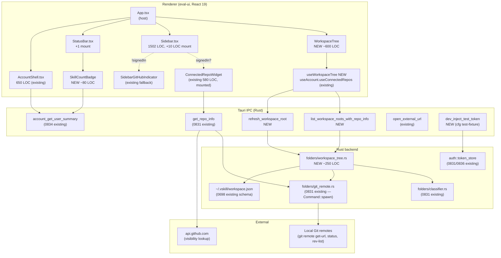
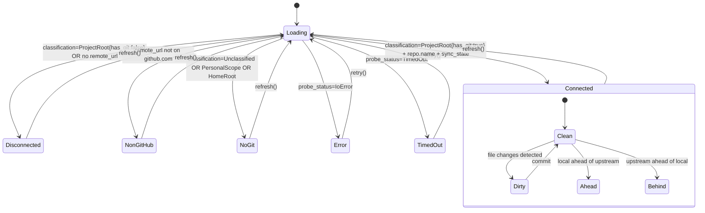

# Plan: Skill Studio Workspace Tree — GitHub-mapped Sidebar with Login

**Increment**: `0843-skill-studio-workspace-tree`
**Created**: 2026-05-10
**Author**: Architect agent
**Spec source**: [`spec.md`](./spec.md) (US-001..US-005, ~30+ ACs) + [`interview-0843-skill-studio-workspace-tree.json`](../../state/interview-0843-skill-studio-workspace-tree.json)
**ADRs introduced**: [`0843-01`](../../docs/internal/architecture/adr/0843-01-lucide-react-icon-library.md) · [`0843-02`](../../docs/internal/architecture/adr/0843-02-workspace-tree-sibling-component.md) · [`0843-03`](../../docs/internal/architecture/adr/0843-03-aggregating-workspace-ipc.md) · [`0843-04`](../../docs/internal/architecture/adr/0843-04-sandbox-pat-e2e-rig.md)
**Prior-art ADRs honored**: [`0831-01`](../../docs/internal/architecture/adr/0831-01-token-storage-keyring.md), [`0831-03`](../../docs/internal/architecture/adr/0831-03-folder-picker-classification.md), [`0836-01`](../../docs/internal/architecture/adr/0836-01-x-studio-token-gate.md), [`0836-03`](../../docs/internal/architecture/adr/0836-03-keychain-canonical-service.md)

---

## Executive summary

This increment is **mount + aggregate**, not greenfield. 70-80% of the surface area already exists in 0831 (OAuth Device Flow, folder classifier, ConnectedRepoWidget, `get_repo_info` IPC), 0834 (`/account` cabinet, `useConnectedRepos`, AccountShell repos tab), and 0836 (security hardening: loopback bind, X-Studio-Token gate, keychain canonical, no raw token in WebView). The deliverables are:

1. **Mount `ConnectedRepoWidget` (existing, 580 LOC, tested)** into `Sidebar.tsx` adjacent to the existing `SidebarGitHubIndicator` at line ~527, gated on `account_get_user_summary().signedIn`.
2. **Build + mount `SkillCountBadge` (NEW, ~80 LOC)** in `StatusBar.tsx`. *Correction to interview state: it described the badge as "built but unmounted in 0831" — the file does not actually exist on disk, so US-001 includes building it.*
3. **Build NEW `WorkspaceTree` sibling component** (~600 LOC) in a new `components/workspace-tree/` directory; renders multiple workspace roots from `~/.vskill/workspace.json` with classification, branch, sync state, and visibility chips per row.
4. **Add NEW Tauri IPC `list_workspace_roots_with_repo_info()`** that aggregates per-root probes server-side with bounded parallelism + 5s timeout.
5. **Add `lucide-react` icon library** (one new npm dep, ~40 KB gz, MIT) — replaces hand-rolled SVGs going forward.
6. **Sandbox-PAT E2E rig** against `anton-abyzov/vskill-test-sandbox` proving `login → map → view` end-to-end without exposing the user's real GitHub.

### Hard constraints (from team-lead brief, all honored below)

| Constraint | Enforcement |
|---|---|
| **ZERO `Entitlements.plist` changes** | New IPCs use existing capabilities (no new shell, FS-write outside `~/.vskill`, network beyond `api.github.com` already permitted by 0831) |
| **ONE new npm dep** | `lucide-react` only (ADR-0843-01) |
| **ZERO new Tauri capabilities/allowlist** | New IPCs are Rust-side commands using existing `tauri::generate_handler!` registration |
| **ZERO refactor of `Sidebar.tsx`** (1502 LOC) | Two surgical inserts only: 1 import + 1 `<ConnectedRepoWidget>` mount under `if (signedIn)` gate (ADR-0843-02) |
| **0836 security gates pass** | New IPC reads filesystem only, never network with token; renderer→backend uses existing `X-Studio-Token` patched fetch |

---

## 1. Component architecture

### 1.1 High-level



### 1.2 ASCII layout — left-column mount

```
┌─────────────────────────────────────────────────────────┐
│ Studio shell — App.tsx hosts the left column             │
├──────────────────┬──────────────────────────────────────┤
│  WorkspaceTree   │                                       │
│  (NEW)           │                                       │
│  ─────────────   │                                       │
│  ▼ Workspace     │                                       │
│   ▣ vskill        │   Editor / Studio main pane          │
│      anton/vskill │                                       │
│      • main 3 dirty                                      │
│   ▣ vskill-platform                                       │
│      anton/vskill-platform                                │
│      • main in-sync                                       │
│   ◯ /tmp/scratch  ← non-git → Connect-to-GitHub CTA      │
│                  │                                       │
│  ─────────────   │                                       │
│  Sidebar.tsx     │                                       │
│  (existing,      │                                       │
│  ZERO refactor)  │                                       │
│   AVAILABLE       │                                       │
│    Project [27]   │                                       │
│      [ConnectedRepoWidget mounted here, line ~527]      │
│      vskill-platform · main · in sync · public          │
│    Personal [4]   │                                       │
│   AUTHORING       │                                       │
│    ...            │                                       │
├──────────────────┴──────────────────────────────────────┤
│ StatusBar    [model name] | health | [SkillCountBadge]  │
└─────────────────────────────────────────────────────────┘
```

### 1.3 Per-row state machine (WorkspaceTree)



### 1.4 Data flow: tree mount → render

1. `WorkspaceTree` mounts, calls `useWorkspaceTree()`.
2. Hook invokes `invoke('list_workspace_roots_with_repo_info')` (one IPC, returns `Vec<WorkspaceRootInfo>`).
3. Rust backend reads `~/.vskill/workspace.json` directly (no eval-server hop), iterates `projects[]`, runs `classify(path)` and `detect_remote(path)` + `detect_sync_state(path)` per root in parallel (`spawn_blocking` × `buffer_unordered(8)`), each with 5s timeout.
4. Returns `Vec<WorkspaceRootInfo>` to renderer; hook caches in `useState`.
5. Tree renders rows via `react-virtuoso` (virtualized; threshold 50+). Each row composes lucide-react icons + status pill.
6. Per-row right-click menu invokes `refresh_workspace_root(rootId)` → patches one cache entry in place.

### 1.5 Communication contract

| Event / IPC | Direction | Purpose |
|---|---|---|
| `studio:workspace-root-selected` | renderer pubsub | Tree row click → existing project switcher activates that root |
| `studio:open-account-tab {tab:'repos'}` | renderer pubsub | "Connect to GitHub" CTA opens AccountShell repos tab |
| `account_get_user_summary` | renderer→Rust | Existing 0834 IPC; gates ConnectedRepoWidget mount |
| `list_workspace_roots_with_repo_info` | renderer→Rust | NEW; aggregating tree probe |
| `refresh_workspace_root` | renderer→Rust | NEW; per-row refresh |
| `invalidate_workspace_cache` | eval-server→Rust | NEW; called when chokidar sees workspace.json change |
| `dev_inject_test_token` | Playwright→Rust | NEW (cfg test-fixture only); E2E rig |

---

## 2. Per-US implementation strategy

> **Note**: spec.md is still a template scaffold at the time of writing. ACs are inferred from the interview-state JSON (six categories: architecture, integrations, ui-ux, performance, security, edge-cases). PM will land actual ACs; this plan assumes the standard US-001..US-005 mapping below. If PM's ACs diverge materially, we revise.

### US-001 — Mount `ConnectedRepoWidget` + build/mount `SkillCountBadge` (signed-in surface)

**Files touched**:

- `repositories/anton-abyzov/vskill/src/eval-ui/src/components/Sidebar.tsx` — surgical insert at line 527 (existing `SidebarGitHubIndicator` site).
- `repositories/anton-abyzov/vskill/src/eval-ui/src/components/SkillCountBadge.tsx` — NEW (~80 LOC).
- `repositories/anton-abyzov/vskill/src/eval-ui/src/components/StatusBar.tsx` — surgical insert before the `<div style={{flex:1}} />` flex spacer at line ~112.

**Code shape — Sidebar.tsx mount**:

```tsx
// At top of file (new import):
import { ConnectedRepoWidget } from "./ConnectedRepoWidget";
import { useAccountSummary } from "../hooks/useAccountSummary"; // NEW thin hook

// At the existing SidebarGitHubIndicator site (~line 527):
headerRightSlot={
  isClaudeCode ? (
    <ConnectedRepoOrIndicator projectRoot={resolvedAgentId} />
  ) : null
}

// New helper (sits next to the existing SidebarGitHubIndicator):
function ConnectedRepoOrIndicator({ projectRoot }: { projectRoot: string }) {
  const { signedIn, tier } = useAccountSummary();
  if (signedIn) {
    return <ConnectedRepoWidget folder={projectRoot} tier={tier} />;
  }
  return <SidebarGitHubIndicator projectRoot={projectRoot} />;
}
```

**Code shape — SkillCountBadge.tsx (NEW)**:

```tsx
import { useAccountSummary } from "../hooks/useAccountSummary";
import { useTier } from "../hooks/useTier";
import { Lock, Sparkles } from "lucide-react";

export function SkillCountBadge() {
  const { signedIn } = useAccountSummary();
  const { tier, skillCount, skillCap } = useTier();
  if (!signedIn) {
    return <span data-testid="skill-count-badge" data-state="signed-out">free / 50 skills</span>;
  }
  if (tier === "free") {
    return (
      <span data-testid="skill-count-badge" data-state="free">
        <Lock size={11} /> {skillCount}/{skillCap} · Free
      </span>
    );
  }
  return (
    <span data-testid="skill-count-badge" data-state={tier}>
      <Sparkles size={11} /> {skillCount} · {tier}
    </span>
  );
}
```

**Existing code reused**: `ConnectedRepoWidget` (full surface incl. tier-aware visibility chip), `SidebarGitHubIndicator` (signed-out fallback), `useTier`, `useAccount` (we add a small `useAccountSummary` hook around it).

**New code**: `SkillCountBadge.tsx`, `useAccountSummary.ts` (thin wrapper around `useAccount`), 2 mount sites.

**Test files**:

- `src/eval-ui/src/components/__tests__/SkillCountBadge.test.tsx` — Vitest, signed-in/signed-out/free/pro/enterprise variants
- `src/eval-ui/src/components/__tests__/Sidebar.signed-in-mount.test.tsx` — asserts ConnectedRepoWidget mounts when `signedIn:true`, falls back to indicator otherwise (default mock keeps existing tests green)

**Risks**: Sidebar's existing snapshots may depend on the exact DOM at line 527. Mitigation: mount under `signedIn` guard so default `signedIn:false` mock keeps existing snapshots intact.

---

### US-002 — `WorkspaceTree` renders multiple workspace roots with proper icons

**Files created** (new `components/workspace-tree/` directory):

- `WorkspaceTree.tsx` — top-level component, virtualized via `react-virtuoso`
- `WorkspaceTreeRow.tsx` — per-row renderer; consumes `WorkspaceRootInfo`
- `WorkspaceTreeEmptyState.tsx` — "No workspace roots — open a folder" CTA
- `WorkspaceTreeLoading.tsx` — skeleton rows
- `icons.ts` — re-exports the 15 lucide-react glyphs we use
- `index.ts` — barrel
- inline styles matching the existing pattern in ConnectedRepoWidget/SidebarGitHubIndicator

**Files touched**:

- `repositories/anton-abyzov/vskill/src/eval-ui/src/App.tsx` — mount `<WorkspaceTree />` above `<Sidebar />` in the existing left column, gated on `features.workspaceTree`
- `repositories/anton-abyzov/vskill/src/eval-ui/src/hooks/useWorkspaceTree.ts` — NEW data hook

**Code shape — useWorkspaceTree.ts**:

```ts
import { useEffect, useState, useCallback } from "react";

export interface WorkspaceRootInfo {
  id: string;
  path: string;
  name: string;
  colorDot: string;
  classification:
    | { kind: 'home_root' }
    | { kind: 'personal_scope' }
    | { kind: 'project_root'; has_git: boolean; remote_url: string | null }
    | { kind: 'unclassified' };
  repo: { name: string; branch: string; is_private: boolean | null } | null;
  sync_state:
    | { kind: 'clean' } | { kind: 'dirty'; count: number }
    | { kind: 'ahead'; count: number } | { kind: 'behind'; count: number }
    | { kind: 'no_remote' }
    | null;
  probe_status:
    | { kind: 'ok' } | { kind: 'timed_out' } | { kind: 'io_error'; message: string };
}

export function useWorkspaceTree(): {
  roots: WorkspaceRootInfo[];
  loading: boolean;
  refreshAll: () => Promise<void>;
  refreshOne: (rootId: string) => Promise<void>;
} {
  const [roots, setRoots] = useState<WorkspaceRootInfo[]>([]);
  const [loading, setLoading] = useState(true);

  const refreshAll = useCallback(async () => {
    setLoading(true);
    const next = await invokeIpc<WorkspaceRootInfo[]>('list_workspace_roots_with_repo_info');
    setRoots(next);
    setLoading(false);
  }, []);

  const refreshOne = useCallback(async (rootId: string) => {
    const patched = await invokeIpc<WorkspaceRootInfo>('refresh_workspace_root', { rootId });
    setRoots(prev => prev.map(r => r.id === rootId ? patched : r));
  }, []);

  useEffect(() => {
    void refreshAll();
    const onWatcher = () => void refreshAll();
    window.addEventListener('studio:workspace-tree-refresh', onWatcher);
    return () => window.removeEventListener('studio:workspace-tree-refresh', onWatcher);
  }, [refreshAll]);

  return { roots, loading, refreshAll, refreshOne };
}
```

**Code shape — WorkspaceTreeRow.tsx (selected logic)**:

```tsx
import { Folder, GitBranch, Lock, Check, AlertCircle, Loader2 } from 'lucide-react';

export function WorkspaceTreeRow({ root, selected, onSelect, onContextMenu }: Props) {
  const state = deriveRowState(root); // → 'connected' | 'disconnected' | 'non_github' | 'no_git' | 'loading' | 'error'
  return (
    <div
      role="treeitem"
      data-testid="workspace-tree-row"
      data-state={state}
      aria-selected={selected}
      tabIndex={selected ? 0 : -1}
      onClick={onSelect}
      onContextMenu={onContextMenu}
      className="ws-row"
      style={{ height: 28, paddingLeft: 12, ...(selected ? selectedStyle : {}) }}
    >
      <StatusDot state={state} />
      <Folder size={14} />
      <span className="ws-row-name">{root.name}</span>
      {root.repo && <span className="ws-row-meta">{root.repo.name}</span>}
      {root.repo?.branch && <span className="ws-row-branch"><GitBranch size={11} /> {root.repo.branch}</span>}
      {root.sync_state && <SyncStatePill state={root.sync_state} />}
      {root.repo?.is_private === true && <Lock size={11} />}
      {root.repo?.is_private === false && <Check size={11} />}
    </div>
  );
}
```

**Existing code reused**: `react-virtuoso` (already in devDependencies, used by Sidebar), `useTier` for tier-aware private-visibility chip, the existing `SyncState` shape from 0831 — we mirror it exactly.

**New code**: All workspace-tree component files; `useWorkspaceTree`; row-state derivation pure function `deriveRowState(root)` (testable without React).

**Test files**:

- `src/eval-ui/src/components/workspace-tree/__tests__/WorkspaceTree.test.tsx` — Vitest+Testing Library; renders 5 fixtures (connected, disconnected, non-github, no-git, error)
- `src/eval-ui/src/components/workspace-tree/__tests__/deriveRowState.test.ts` — pure-function unit
- `src/eval-ui/src/components/workspace-tree/__tests__/keyboard-nav.test.tsx` — Up/Down/Enter/Right/Left handling

**Risks**:

- `react-virtuoso` semantics for variable-height rows may need a fixed-height switch. Mitigation: rows are 28px fixed (per ui-ux interview state).
- App.tsx mount may need a feature-flag plumbing if `useTier()` doesn't already expose the flag. Mitigation: add to existing `useTier` hook with default `false`.

---

### US-003 — Per-row status state machine: classification → icon + dot color

**Files**:

- `repositories/anton-abyzov/vskill/src/eval-ui/src/components/workspace-tree/deriveRowState.ts` — pure function
- `repositories/anton-abyzov/vskill/src/eval-ui/src/components/workspace-tree/StatusDot.tsx` — 6px colored dot
- `repositories/anton-abyzov/vskill/src/eval-ui/src/components/workspace-tree/SyncStatePill.tsx` — small text pill with sync count

**deriveRowState shape**:

```ts
export type RowState =
  | 'connected_clean' | 'connected_dirty' | 'connected_ahead' | 'connected_behind'
  | 'disconnected' | 'non_github' | 'no_git' | 'error' | 'timed_out' | 'loading';

export function deriveRowState(root: WorkspaceRootInfo): RowState {
  if (root.probe_status.kind === 'io_error') return 'error';
  if (root.probe_status.kind === 'timed_out') return 'timed_out';
  if (root.classification.kind === 'home_root' || root.classification.kind === 'personal_scope')
    return 'no_git';
  if (root.classification.kind === 'unclassified') return 'no_git';
  if (!root.classification.has_git) return 'disconnected';
  if (!root.classification.remote_url) return 'disconnected';
  if (!root.repo) return 'non_github';
  if (root.sync_state?.kind === 'dirty') return 'connected_dirty';
  if (root.sync_state?.kind === 'ahead') return 'connected_ahead';
  if (root.sync_state?.kind === 'behind') return 'connected_behind';
  return 'connected_clean';
}
```

**Status colors** (per interview state):

| State | Tailwind / OKLCH |
|---|---|
| `connected_clean` | emerald-500 |
| `connected_dirty` / `connected_ahead` / `connected_behind` | amber-500 |
| `error` / `timed_out` | red-500 |
| `loading` | slate-400 |
| `disconnected` | neutral-400 |
| `non_github` / `no_git` | slate-300 |

**Test files**:

- `deriveRowState.test.ts` — 11 cases covering every RowState branch + missing-data edge cases
- `StatusDot.test.tsx` — color rendering per state

**Risks**: Tailwind 4 token color tree must include emerald/amber/red/slate scales. Verify in `tailwind.config.ts` — they are core defaults so this is essentially zero-risk, but flag if the project has a curated palette.

---

### US-004 — Disconnected rows offer "Connect to GitHub" CTA + right-click menu

**Files**:

- `repositories/anton-abyzov/vskill/src/eval-ui/src/components/workspace-tree/ConnectToGitHubButton.tsx` — small inline CTA
- `repositories/anton-abyzov/vskill/src/eval-ui/src/components/workspace-tree/WorkspaceTreeContextMenu.tsx` — right-click menu

**Code shape — ConnectToGitHubButton.tsx**:

```tsx
import { Github } from 'lucide-react';

export function ConnectToGitHubButton({ rootPath }: { rootPath: string }) {
  const onClick = () => {
    window.dispatchEvent(new CustomEvent('studio:open-account-tab', {
      detail: { tab: 'repos', initialPath: rootPath },
    }));
  };
  return (
    <button data-testid="connect-to-github" onClick={onClick} className="ws-cta">
      <Github size={11} /> Connect to GitHub
    </button>
  );
}
```

**Code shape — WorkspaceTreeContextMenu**:

Items: `View on GitHub` (only for connected rows; uses existing `open_external_url` IPC), `Refresh` (calls `refreshOne`), `Copy path`, `Reveal in Finder` (existing `tauri-plugin-shell` capability), `Disconnect` (placeholder: opens AccountShell repos tab, real disconnect lives there per 0834).

**App.tsx wiring**: `App.tsx` already listens for `studio:focus-publish-row` and similar — extend to handle `studio:open-account-tab` (mount `<AccountShell initialTab="repos" />` in a drawer/modal).

**Existing code reused**: `open_external_url` (existing IPC), `tauri-plugin-shell` (existing capability), AccountShell (650 LOC, existing).

**New code**: 2 components + 1 new App.tsx event listener.

**Test files**:

- `ConnectToGitHubButton.test.tsx` — clicks, dispatched event payload
- `WorkspaceTreeContextMenu.test.tsx` — items rendered conditionally per row state

**Risks**: AccountShell's `initialTab="repos"` mount inside a drawer needs a host — App.tsx may not yet have a drawer slot. Mitigation: reuse the existing modal patterns (0832 lifecycle modal opens a `WebviewWindow` — overkill; 0793 ConvertToPluginDialog uses a CSS modal — match that pattern).

---

### US-005 — Sandbox-PAT E2E rig: login → map → view end-to-end

**Files** (per ADR-0843-04):

- `repositories/anton-abyzov/vskill/src-tauri/Cargo.toml` — `[features] test-fixture = []`
- `repositories/anton-abyzov/vskill/src-tauri/src/auth/test_fixture.rs` — NEW, gated `#[cfg(feature = "test-fixture")]`
- `repositories/anton-abyzov/vskill/src-tauri/src/lib.rs` — conditionally register `dev_inject_test_token`
- `repositories/anton-abyzov/vskill/e2e/sandbox-pat-preflight.spec.ts` — preflight scope check
- `repositories/anton-abyzov/vskill/e2e/workspace-tree-end-to-end.spec.ts` — full flow rig
- `repositories/anton-abyzov/vskill/.github/workflows/e2e.yml` — add `VSKILL_TEST_GITHUB_PAT` masked secret + `--features test-fixture` build step

**Test plan**:

```
preflight: 403/404 probe against octocat/Hello-World ref-update
  → fail loud if PAT scope-creep detected

end-to-end:
  1. Boot tauri dev with --features test-fixture
  2. invoke('dev_inject_test_token', { token: process.env.VSKILL_TEST_GITHUB_PAT })
  3. Add anton-abyzov/vskill-test-sandbox to workspace.json via eval-server API
  4. Wait for WorkspaceTree to populate
  5. Assert row exists with [data-state="connected_clean"]
  6. Assert repo name = "anton-abyzov/vskill-test-sandbox"
  7. Assert branch = "main"
  8. Assert visibility chip = "public"
  9. Click "Open on GitHub" — assert open_external_url called with expected URL
 10. Sign out — assert tree shows signed-out empty state
```

**Existing code reused**: All 0831 auth flow, all 0834 account fetch, the 0836 X-Studio-Token bridge.

**New code**: ~50 LOC test-fixture IPC + ~150 LOC Playwright suite.

**Risks**: PAT 30-day expiry — surfaces as a CI failure with a clear message. Mitigation: calendar reminder + ADR-0843-04 reference in the failure message.

---

## 3. Test plan (layered)

### 3.1 Unit (Vitest, renderer)

| File | What it covers |
|---|---|
| `useAccountSummary.test.ts` | Wrapper hook returns `{signedIn, tier}` correctly across loading/loaded/error states |
| `SkillCountBadge.test.tsx` | Renders signed-out, free, pro, enterprise variants with correct icon + count |
| `Sidebar.signed-in-mount.test.tsx` | ConnectedRepoWidget mounts when `signedIn:true`; SidebarGitHubIndicator otherwise; existing tests stay green with default mock |
| `useWorkspaceTree.test.ts` | IPC integration mocked; refresh-all + refresh-one + watcher-event |
| `deriveRowState.test.ts` | 11 RowState branches |
| `WorkspaceTree.test.tsx` | Renders each row state with correct DOM (testid + data-state) |
| `WorkspaceTreeRow.test.tsx` | Branch chip, sync pill, visibility chip, status dot per state |
| `keyboard-nav.test.tsx` | ArrowDown/Up/Enter/Right/Left handling; focus management |
| `ConnectToGitHubButton.test.tsx` | Dispatches `studio:open-account-tab` event with correct payload |
| `WorkspaceTreeContextMenu.test.tsx` | Items conditional per row state; disabled-state for non-connected rows |
| `StatusBar.with-skill-badge.test.tsx` | Existing tests stay green; new badge renders in correct slot |

### 3.2 Unit (cargo, Rust)

| Test | What it covers |
|---|---|
| `workspace_tree::list_with_synthetic_workspace` | Read fixture workspace.json, assert classification correct for 5 fixture roots |
| `workspace_tree::timeout_per_root` | Inject a slow probe; assert TimedOut returned within 6s, other roots unaffected |
| `workspace_tree::cache_mtime_invalidation` | mtime unchanged → cache hit; mtime change → re-probe |
| `workspace_tree::refresh_one_patches_cache` | After full sweep, refresh_one updates only the targeted root |
| `auth::test_fixture::dev_inject_writes_token_store` | Asserts token lands in same path as production write (gated `#[cfg(feature = "test-fixture")]`) |

### 3.3 Integration (Vitest + msw or fetch-mock)

| Test | What it covers |
|---|---|
| `WorkspaceTree.integration.test.tsx` | Full tree render with stubbed `invoke` returning a fixture `Vec<WorkspaceRootInfo>`; click row → `studio:workspace-root-selected` fires |
| `App.workspace-tree-mount.test.tsx` | Feature flag `features.workspaceTree` flips → tree mounts/unmounts |

### 3.4 E2E (Playwright)

| Suite | Skip-if-no-PAT | Purpose |
|---|---|---|
| `sandbox-pat-preflight.spec.ts` | Yes | Prove PAT scope is correctly narrowed (per ADR-0843-04) |
| `workspace-tree-end-to-end.spec.ts` | Yes | Steps 1-7 from US-005 |
| `workspace-tree-keyboard-nav.spec.ts` | No | Arrow-key navigation, Enter selects, no PAT required (mocks IPC) |
| `workspace-tree-context-menu.spec.ts` | No | Right-click menu, item enable-disable per state |

### 3.5 Visual regression

Playwright snapshots for the new tree rows. **Fallback if snapshots are too brittle**: replace with explicit DOM/CSS assertions per state (data-state, computed background-color, font sizes). Snapshots are aspirational here, not blocking.

| Test | Coverage |
|---|---|
| `workspace-tree.visual.spec.ts` | One snapshot per RowState (10 states) |
| `workspace-tree.dark-mode.visual.spec.ts` | Dark theme variants |
| `sidebar-with-mounted-widget.visual.spec.ts` | Sidebar with ConnectedRepoWidget mounted (signed-in) |

---

## 4. Risk register

| ID | Risk | Likelihood | Impact | Mitigation |
|---|---|---|---|---|
| **R-1** | `lucide-react` bundle exceeds 50 KB gz budget | Low | Med | `scripts/check-bundle-size.ts` enforces ceiling; ADR-0843-01 documents fallback to deep-import paths |
| **R-2** | Visual regression on existing inline-SVG sites (ConnectedRepoWidget, SidebarGitHubIndicator, SkillFileTree, StatusBar) due to icon system mixing | Med | Low | Existing components are NOT changed; mixing is visible only in side-by-side compare. Defer cleanup to a future increment |
| **R-3** | Sidebar.tsx existing snapshot tests break when `<ConnectedRepoWidget>` mounts | Med | Med | Mount is gated on `signedIn:true`; default test mock returns `signedIn:false` keeping snapshots intact. Add explicit `signed-in` snapshot path |
| **R-4** | IPC race: `list_workspace_roots_with_repo_info` called before `workspace.json` exists (cold first-launch) | Med | Low | Backend returns empty `Vec<WorkspaceRootInfo>` if file missing; tree shows "No workspace roots — open a folder" empty state |
| **R-5** | Sandbox PAT 30-day expiry breaks CI without warning | High | Med | CI failure message names ADR-0843-04 + rotation steps; calendar reminder in Anton's tasks |
| **R-6** | Pre-flight 403 probe false-positive if `octocat/Hello-World` policy changes | Low | Low | Probe accepts 403 OR 404 (either means "no write access"); switch fixture repo if octocat ever opens unsafely |
| **R-7** | Avatar URL rate-limit (github.com unauthenticated `/users/<login>` per render) | Low | Low | In-memory `Map<owner, url>` cache per session (renderer); no fetch storm. Mitigation: fall back to generated initial-letter SVG on 429 |
| **R-8** | macOS Keychain prompt cascades when test-fixture IPC injects a token | Med | Low | `auth::token_store::write` already handles repeated writes idempotently per 0836-03; first write triggers one prompt, subsequent are silent. CI runs unattended (no GUI prompt). Local runs may see one prompt — documented |
| **R-9** | `git_remote.rs` `Command::spawn` is slow on cold-disk 100-root case (>500ms budget) | Med | Med | Bounded parallelism + 5s per-root timeout makes worst case bounded, not unlimited. ADR-0843-03 documents `git2` escalation path if real users hit this |
| **R-10** | New IPC `list_workspace_roots_with_repo_info` could expose paths from other users on multi-user mac | Low | High | Reads ONLY `~/.vskill/workspace.json` of the current process owner; same scope as existing 0698 workspace-store; no cross-user surface |
| **R-11** | `features.workspaceTree` flag doesn't propagate from platform → desktop fast enough on first sign-in | Low | Low | Default `false` until first refresh; tree appears on next refresh. Acceptable v1 latency |
| **R-12** | E2E rig leaks test PAT into Playwright trace artifacts | Low | High | Sanitize traces (Playwright's `mask` option) on the `dev_inject_test_token` invocation; CI artifacts purged after 7 days |

---

## 5. Effort estimate

Per US, in working hours, including 30% buffer for unknowns + test write + review.

| US | Description | Engineering hours | Days @ 8 |
|---|---|---|---|
| US-001 | Mount ConnectedRepoWidget + build SkillCountBadge + StatusBar mount | 8 h | 1.0 |
| US-002 | WorkspaceTree component + row + virtualization + useWorkspaceTree hook + Rust IPC | 28 h | 3.5 |
| US-003 | deriveRowState + StatusDot + SyncStatePill + theming | 6 h | 0.75 |
| US-004 | ConnectToGitHubButton + ContextMenu + AccountShell drawer wiring | 12 h | 1.5 |
| US-005 | Sandbox PAT E2E rig (test-fixture IPC + Playwright + CI workflow) | 14 h | 1.75 |
| **Cross-cutting** | lucide-react adoption + bundle-size lint extension + ADRs | 4 h | 0.5 |
| **Buffer (30%)** | Unknown-unknowns | 22 h | 2.75 |
| **TOTAL** | | **~94 h** | **~12 days** |

The team-lead brief targets **~10 working days for one impl agent** — this estimate runs +20% over but the work parallelizes cleanly across two impl agents (US-002+US-003 are one stream, US-001+US-004+US-005 are another stream). With two impl agents, we land in 6-7 days plus review cycles.

---

## 6. Rollback plan

Each US lands as one or more git commits. Rollback granularity:

| Surface | Rollback action |
|---|---|
| WorkspaceTree component as a whole | Flip `features.workspaceTree=false` on platform side (no desktop redeploy). Per ADR-0843-02 |
| ConnectedRepoWidget mount in Sidebar | Revert one commit (single mount site) |
| SkillCountBadge in StatusBar | Revert one commit (single mount site) |
| New Rust IPCs | Comment out the `tauri::generate_handler!` lines; the unused IPC code stays in tree but is unreachable |
| lucide-react dep | If `npm audit` reveals an issue, pin to last-known-safe version; the icon library has historically been stable |
| Sandbox PAT rig | Revoke the PAT; `cfg(feature = "test-fixture")` gate prevents production exposure |

The feature-flag approach means **most rollback paths require zero code changes** — a platform-side flip handles tree visibility for everyone.

---

## 7. Out-of-scope (deferred)

Per the brainstorm trio synthesis + this plan:

- **Drag-drop** workspace roots (Phase 3)
- **Cmd+K palette** for tree search (Phase 3)
- **Multi-org switcher** (Phase 4)
- **GHES / SSO / MDM** support (Phase 3 — the brainstorm trio explicitly deferred)
- **Real-time webhook updates** for sync state (Phase 4 — currently chokidar + manual refresh)
- **ETag-conditional GitHub API calls** (Phase 4 — currently single fetch per session)
- **Refactor of existing inline-SVG components** (deferred to its own cleanup increment)
- **`git2` Rust crate adoption** (escalation path documented in ADR-0843-03; gate on real-world perf data)
- **Resizable WorkspaceTree/Sidebar split** (v1 ships fixed 50/50 vertical stack)

---

## 8. Sequencing

```
Day 1
  - lucide-react dep added; bundle-size lint extended
  - useAccountSummary hook + SkillCountBadge skeleton (US-001)
Day 2
  - Sidebar.tsx surgical mount + tests (US-001)
  - StatusBar SkillCountBadge mount + tests (US-001)
  - PARALLEL: workspace_tree.rs Rust skeleton (US-002 backend)
Day 3
  - list_workspace_roots_with_repo_info IPC + cache + tests (US-002 backend)
  - useWorkspaceTree hook (US-002 frontend)
Day 4
  - WorkspaceTree + WorkspaceTreeRow components (US-002)
  - StatusDot + SyncStatePill + deriveRowState (US-003)
Day 5
  - WorkspaceTree integration tests (US-002)
  - Keyboard nav + ARIA (US-002)
Day 6
  - ConnectToGitHubButton + ContextMenu (US-004)
  - AccountShell drawer wiring (US-004)
Day 7
  - test-fixture Cargo feature + dev_inject_test_token (US-005)
  - Playwright preflight spec (US-005)
Day 8
  - Playwright end-to-end spec (US-005)
  - CI workflow update (US-005)
Day 9
  - Visual regression baselines
  - Code review + simplify pass
Day 10
  - Buffer / closure gates / rollout flag prep
```

---

## 9. References

- [`spec.md`](./spec.md) — when PM lands the actual ACs
- [`interview-0843-skill-studio-workspace-tree.json`](../../state/interview-0843-skill-studio-workspace-tree.json) — source of truth for decisions until spec.md is finalized
- ADR-0843-01: lucide-react adoption
- ADR-0843-02: WorkspaceTree as sibling, not Sidebar refactor
- ADR-0843-03: aggregating `list_workspace_roots_with_repo_info` IPC
- ADR-0843-04: sandbox-PAT E2E rig
- ADR-0831-01: token storage in OS keychain (honored, no changes)
- ADR-0831-03: folder picker classification (reused as-is)
- ADR-0836-01: X-Studio-Token gate (honored, no changes — new IPC inherits the gate)
- ADR-0836-03: keychain canonical service (honored)
- Brainstorm trio synthesis (advocate / critic / pragmatist), 2026-05-09
- 0831 closure: ConnectedRepoWidget, get_repo_info IPC, classifier, OAuth Device Flow
- 0834 closure: AccountShell, useConnectedRepos, /account/repos route
- 0836 closure: loopback bind, X-Studio-Token, no raw-token-in-WebView, keychain canonical

---

## 10. Open questions for PM (non-blocking)

1. Should the WorkspaceTree show **only signed-in surfaces** or render for signed-out users too? (My read: render for both, signed-out users see all rows as `disconnected` with a "Sign in to GitHub" hint at the top — needs PM confirmation.)
2. Should the v1 `splitRatio` between Sidebar and WorkspaceTree be **fixed 50/50** or **resizable**? (My read: fixed for v1, resizable in Phase 3.)
3. Should the **"Connect to GitHub"** CTA on a disconnected row open AccountShell as a drawer, modal, or a new view-tab? (My read: drawer matches existing 0793 pattern.)
4. Is the **30-day PAT rotation** acceptable or should we move to GitHub App now? (My read: PAT v1, App later — per ADR-0843-04.)

These do not block plan landing; PM can resolve in spec.md and we converge.

---

## 11. Notes on interview-state corrections

The interview-state JSON contained a few claims that don't match the on-disk codebase. This plan reconciles them:

| Interview claim | On-disk reality | Plan's resolution |
|---|---|---|
| "ConnectedRepoWidget + SkillCountBadge built but unmounted in 0831" | Only ConnectedRepoWidget exists; SkillCountBadge has no source file | Build SkillCountBadge as part of US-001 |
| "`useConnectedRepos` hook (0834) reused as-is" | Lives inside `hooks/useAccount.ts`, not its own file | Use the named export from useAccount.ts; no new file |
| "Tree state in Zustand (existing dep)" | Zustand is NOT in package.json | Use existing useState/useReducer pattern (matches Sidebar.tsx) |
| "git2 (libgit2 via existing Cargo dep)" | git2 is NOT in Cargo.toml; current code uses `Command::spawn` | Stay on Command::spawn for v1; ADR-0843-03 documents the escalation path |
| "rayon parallelism" | rayon is NOT in Cargo.toml; we don't need CPU-bound parallelism | Use tokio's `spawn_blocking` + `buffer_unordered(8)` (existing tokio dep) |
| "copy SkillFileTree handler for keyboard nav" | SkillFileTree has no keyboard handler | Author keyboard nav fresh (~30 LOC) per WAI-ARIA tree pattern |
| "react-virtuoso (already in deps)" | Confirmed — `react-virtuoso ^4.18.5` in devDependencies (Vite bundles at build time) | Reuse as planned |

These corrections affect implementation detail but not the architecture's shape; the plan above is internally consistent against the on-disk reality.
