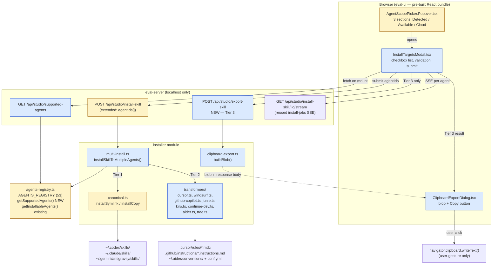

# Plan: Cross-tool skill installation in Skill Studio

> Authoritative architectural plan for increment **0845**. Derived from the user-approved ExitPlanMode plan (`misty-wishing-gadget.md`) and the Phase-1 research recorded in `.specweave/state/interview-0845-cross-tool-skill-installation.json`. Source of truth for the design contract; spec.md owns user stories + acceptance criteria; tasks.md owns the implementation breakdown.

---

## 1. Architectural decisions

The design is a **surgical extension** of vskill's existing installer architecture. The bullets below capture the decisions and the reason each one was preferred over the alternative considered. Three of them rise to ADR level and are written as separate files (see §7).

- **D1 — Decouple installability from binary detection.** Today `detectInstalledAgents()` (`src/agents/agents-registry.ts:853`) drives every UI install affordance. We add a sibling primitive — `getSupportedAgents()` — that returns every non-`isRemoteOnly` registry entry regardless of binary probe. The detection function stays unchanged; UI consumers choose between the two. **Rejected alternative**: extend `detectInstalledAgents` with a `forceShowAll` flag — would have leaked a UI concern into the detection contract. ADR: `0845-01-decouple-installability-from-detection.md`.

- **D2 — Per-tool format transformer pattern.** A new optional field `formatTransformer?: (skill: ParsedSkill) => TransformedFile[]` on `AgentDefinition` lets Tier-2 tools emit non-canonical file layouts (`.cursor/rules/<name>.mdc`, `.github/instructions/<name>.instructions.md`, etc.) without forking the canonical installer flow. Transformers are pure functions colocated under `src/installer/transformers/`. **Rejected alternative**: a class-based `Installer` adapter per tool — overkill for ~50 LOC per tool and would duplicate the registry. ADR: `0845-02-per-tool-format-transformer.md`.

- **D3 — Backward-compatible registry extension.** All four new `AgentDefinition` fields (`tier`, `installMode`, `formatTransformer`, `pasteInstructionsUrl`) are **optional**. Existing 53 entries default to `tier=1` + `installMode="filesystem"` + no transformer (i.e., the current behavior). **Rejected alternative**: required fields with a mass migration — produces 53 churned lines and one massive PR; opt-in keeps the diff focused on the tools we actually change.

- **D4 — Sequential per-agent install (not parallel).** `installSkillToMultipleAgents` loops agents in order so filesystem state is deterministic for tests and error recovery. Per-agent latency is microseconds (transformer is a pure function) + one fs.writeFile, so even 12 targets stays well under 100 ms total. **Rejected alternative**: `Promise.all` — race conditions on shared canonical dir + harder to reason about partial failures.

- **D5 — Clipboard export over filesystem for Tier-3 tools.** ChatGPT, v0, and bolt.new have no local install surface. The export route returns a paste-ready blob to the browser; the user's gesture on a "Copy" button triggers `navigator.clipboard.writeText`. **Rejected alternative**: write a "manifest" file the user has to find and paste — extra friction, no benefit. (Not promoted to an ADR — small surface, single-file impl.)

- **D6 — Localhost-only routes, no new auth surface.** Every new HTTP endpoint follows the existing `isLocalhost()` guard from `install-skill-routes.ts:54-58` and the `SAFE_NAME` regex pattern at `install-skill-routes.ts:32`. No new auth, no platform proxy, no CORS. **Rejected alternative**: route through verified-skill.com — would break the localhost-only architecture documented in project memory `project_studio_cors_free_architecture.md`.

- **D7 — Aider conf.yml is the highest-risk write target.** Mutating a user-owned config file is gated by a backup-write pattern (`.bak` snapshot before edit, append-only, schema-validated YAML parse). The transformer never overwrites an existing `read:` entry — it appends only if absent. **Rejected alternative**: prompt the user to edit `~/.aider.conf.yml` themselves — defeats the "one click, all targets" UX promise. Risk mitigation pattern documented in §8 and promoted to ADR-0845-03.

- **D8 — Reuse the existing SSE `install-jobs` infrastructure for multi-agent progress.** `install-jobs.ts` already manages spawn-job lifecycles + SSE streams (`mountSpawnStreamRoute`). Multi-install emits one progress event per agent under the same job ID. No new SSE framework. **Rejected alternative**: a parallel WebSocket — adds a new network surface for no benefit.

---

## 2. System diagram



Color key: **blue = new**, **yellow = touched**.

---

## 3. File-level plan

| Path | Status | Purpose |
|------|--------|---------|
| `src/agents/agents-registry.ts` | TOUCH | Extend `AgentDefinition` with `tier`, `installMode`, `formatTransformer`, `pasteInstructionsUrl` (all optional). Wire transformer to 8 Tier-2 entries. Wire `pasteInstructionsUrl` to 3 Tier-3 entries. Add `getSupportedAgents()` export. Verify Antigravity entry path (`~/.gemini/antigravity/skills` — confirmed at L211). |
| `src/agents/__tests__/agents-registry.test.ts` | TOUCH | New cases: `getSupportedAgents` returns all non-remote-only; tier defaults to 1; legacy entries still resolve via `getAgent()`. |
| `src/installer/multi-install.ts` | NEW | `installSkillToMultipleAgents(skill, agentIds, scope) → Promise<MultiInstallResult>`. Sequential per-agent loop, dispatches to canonical or transformer based on `agent.formatTransformer` presence. |
| `src/installer/__tests__/multi-install.test.ts` | NEW | Unit + integration. Asserts: per-agent files written at correct paths, mixed Tier 1+2 inputs, partial failure (transformer throws), idempotency (re-install overwrites cleanly). |
| `src/installer/transformers/cursor.ts` | NEW | SKILL.md → `rules/<name>.mdc` (joined onto `~/.cursor` install root). Frontmatter: `description`, `globs: ""`, `alwaysApply: false`. |
| `src/installer/transformers/windsurf.ts` | NEW | SKILL.md → `rules/<name>.md`. Frontmatter stripped (plain markdown). |
| `src/installer/transformers/github-copilot.ts` | NEW | SKILL.md → `instructions/<name>.instructions.md`. Frontmatter: `applyTo: "**"`. |
| `src/installer/transformers/junie.ts` | NEW | SKILL.md → `rules/<name>.md`. Plain markdown, frontmatter stripped. |
| `src/installer/transformers/kiro.ts` | NEW | SKILL.md → `steering/<name>.md`. Plain markdown. |
| `src/installer/transformers/continue-dev.ts` | NEW | SKILL.md → `rules/<name>.md`. Plain markdown. |
| `src/installer/transformers/aider.ts` | NEW | Two outputs: `conventions/<name>.md` under `~/.aider/` (plain markdown body) + a `TransformedFile` representing the `~/.aider.conf.yml` append. The conf.yml mutation runs through the backup-write pattern in `multi-install.ts` (see §8 R3). |
| `src/installer/transformers/trae.ts` | NEW | SKILL.md → `<name>.md`. Plain markdown. |
| `src/installer/transformers/__tests__/*.test.ts` | NEW | One test file per transformer. Asserts frontmatter shape, body preservation, byte-equal idempotency on re-run. |
| `src/installer/transformers/index.ts` | NEW | Barrel export + `TransformedFile` + `ParsedSkill` shared interfaces. |
| `src/installer/clipboard-export.ts` | NEW | `buildClipboardBlob(skill, agentId) → { blob, pasteInstructionsUrl, docsUrl }`. No disk write. |
| `src/installer/__tests__/clipboard-export.test.ts` | NEW | Asserts blob includes skill name + description + body; per-tool paste URL matches registry. |
| `src/installer/canonical.ts` | TOUCH | Add `resolveAgentInstallRoot(agent, opts)` helper returning the **parent** of `localSkillsDir`/`globalSkillsDir`. Used by transformer dispatch. `installSymlink` / `installCopy` themselves remain unchanged (Tier-1 path). |
| `src/installer/__tests__/canonical.test.ts` | TOUCH | New case for `resolveAgentInstallRoot`; existing Tier-1 cases stay green. |
| `src/eval-server/install-skill-routes.ts` | TOUCH | Accept `agentIds?: string[]` (backward-compat: legacy `agent: string` still works). Validate each id against `SAFE_NAME` and `AGENTS_REGISTRY`. Dispatch to `installSkillToMultipleAgents`. SSE per agent. |
| `src/eval-server/__tests__/install-skill-routes.test.ts` | TOUCH | New cases: `agentIds[]` accepted, invalid agent id rejected, SSE emits one event per agent. |
| `src/eval-server/install-state-routes.ts` | TOUCH | Add `GET /api/studio/supported-agents` returning the new shape `{ id, displayName, detected, tier, installMode, resolvedGlobalDir, resolvedLocalDir, pasteInstructionsUrl? }`. Reuse existing `isLocalhost` guard, `SAFE_NAME`. |
| `src/eval-server/__tests__/install-state-routes.test.ts` | TOUCH | New case: `/api/studio/supported-agents` returns the expected count after `installMode="clipboard"` flips for the 3 Tier-3 entries. |
| `src/eval-server/export-skill-routes.ts` | NEW | `POST /api/studio/export-skill { skill, agentId } → { blob, pasteInstructionsUrl, docsUrl }`. Returns 400 if agent is not Tier 3. Localhost-only. |
| `src/eval-server/__tests__/export-skill-routes.test.ts` | NEW | Unit: returns blob for ChatGPT, 400 for Codex (Tier 1), 403 for non-localhost. |
| `src/studio/routes/index.ts` | TOUCH | Register `registerExportSkillRoutes` alongside `registerInstallSkillRoutes` and `registerInstallStateRoutes`. |
| `src/eval-ui/src/components/AgentScopePicker.Popover.tsx` | TOUCH | Restructure sections: "Detected on this machine" / "Available to install" / "Cloud only (paste required)". "Available" rows get inline `+ Install here` CTA → opens `InstallTargetsModal`. Existing two-section view stays behind a `groupBy` prop for snapshot safety. |
| `src/eval-ui/src/components/InstallTargetsModal.tsx` | NEW | Modal with three grouped checkbox sections (Tier 1 / 2 / 3). Per-row: icon + name + resolved target path or "Copy to clipboard". Quick actions ("Select all detected", "Clear"). Default: currently-active tool pre-checked. Submit fires `POST /api/studio/install-skill` + opens SSE. |
| `src/eval-ui/src/components/ClipboardExportDialog.tsx` | NEW | Dialog with blob in `<pre>`, Copy button (user-gesture → `navigator.clipboard.writeText`), link to `pasteInstructionsUrl`. |
| `src/eval-ui/src/components/__tests__/InstallTargetsModal.test.tsx` | NEW | Render tests: validation disables button when 0 selected; "Select all detected" toggles only detected rows; tier-grouped headings present. |
| `src/eval-ui/src/api/install.ts` | TOUCH | Multi-agent request shape; helper `installToAgents(skill, agentIds, scope)` returns a `MultiInstallResult` Promise. |
| `src/eval-ui/src/types.ts` | TOUCH | New `SupportedAgent` and `MultiInstallResult` types. |
| `dist/eval-ui/` | REBUILD | `npm run build:ui` after every eval-ui change (per project memory `project_vskill_studio_runtime.md` — eval-server serves the **pre-built** bundle, not Vite). |
| `tests/e2e/studio/install-targets.spec.ts` | NEW | Playwright E2E (see §9). |
| `.specweave/docs/internal/architecture/adr/0845-01-decouple-installability-from-detection.md` | NEW ADR | See §7. |
| `.specweave/docs/internal/architecture/adr/0845-02-per-tool-format-transformer.md` | NEW ADR | See §7. |
| `.specweave/docs/internal/architecture/adr/0845-03-aider-conf-yml-safe-mutation.md` | NEW ADR | See §7. |

---

## 4. Data flow per tier

### Tier 1 — drop-in (Claude Code, Codex, OpenClaw, OpenCode, Antigravity, Gemini CLI, Amp, Cline, Kimi)

```
POST /api/studio/install-skill { skill: "obsidian-brain", agentIds: ["codex","antigravity"], scope: "user" }
  → install-skill-routes.ts validates agentIds + SAFE_NAME
  → installSkillToMultipleAgents(skill, agentIds, scope)
    → for each agent (sequential):
      → fetch parsed SKILL.md from skill registry
      → installSymlink(skillName, content, [agent], { global: true, projectRoot }) — existing path at canonical.ts:134
        → writes canonical to ~/.agents/skills/obsidian-brain/SKILL.md
        → symlinks ~/.codex/skills/obsidian-brain → ~/.agents/skills/obsidian-brain
        → for Claude Code: direct copy fallback (COPY_FALLBACK_AGENTS at canonical.ts:109)
  → SSE emits { agentId, status: "installed", detail: "<path>" } per agent
```

### Tier 2 — format-converted (Cursor, Windsurf, GitHub Copilot Ext, Junie, Kiro, Continue, Aider, Trae)

```
POST /api/studio/install-skill { skill, agentIds: ["cursor","github-copilot-ext"], scope: "user" }
  → installSkillToMultipleAgents
    → for each agent with formatTransformer set:
      → parseFrontmatter(SKILL.md content) → ParsedSkill { name, description, body, originalFrontmatter, version? }
      → agent.formatTransformer(parsedSkill) → [TransformedFile { relativePath, content }]
      → resolveAgentInstallRoot(agent, { global: true, projectRoot }) → e.g., ~/.cursor (parent of skills/)
      → for each TransformedFile:
        → mkdir -p dirname(targetRoot / relativePath)
        → fs.writeFile(targetRoot / relativePath, content)
      → SSE emit { agentId: "cursor", status: "installed", detail: "~/.cursor/rules/obsidian-brain.mdc" }
```

For Tier 2 we resolve the **parent** of `localSkillsDir` / `globalSkillsDir` because transformer paths bake in their own subfolder layout (`.cursor/rules/*.mdc`, not `.cursor/skills/<name>/SKILL.md`). Helper `resolveAgentInstallRoot(agent, opts)` is added next to the existing `resolveAgentSkillsDir`.

### Tier 3 — clipboard (ChatGPT, v0, bolt.new)

```
POST /api/studio/export-skill { skill: "obsidian-brain", agentId: "chatgpt" }
  → export-skill-routes.ts validates agentId is Tier 3 (installMode === "clipboard")
  → buildClipboardBlob(skill, agentId) → { blob: string, pasteInstructionsUrl: string, docsUrl: string }
  → returns JSON to browser; NO disk write
  → ClipboardExportDialog mounts with blob in <pre>
  → user clicks Copy button → navigator.clipboard.writeText(blob) [user gesture required]
  → toast: "Copied. Open <pasteInstructionsUrl> →"
```

---

## 5. Type definitions

### `AgentDefinition` extension (`src/agents/agents-registry.ts`)

```ts
export interface AgentDefinition {
  // ... existing fields preserved verbatim:
  // id, displayName, localSkillsDir, globalSkillsDir, isUniversal,
  // detectInstalled, parentCompany, featureSupport, pluginCacheDir?,
  // pluginMarketplaceDir?, win32PathOverride?, isRemoteOnly?

  /** Install tier. Defaults to 1 when absent (drop-in SKILL.md, no transform). */
  tier?: 1 | 2 | 3;

  /** Where the install lands. Defaults to "filesystem". Tier 3 is "clipboard". */
  installMode?: "filesystem" | "clipboard";

  /** Pure function: parsed SKILL.md → list of files to write under the agent's
   *  install root. Only set for Tier 2 agents. */
  formatTransformer?: (skill: ParsedSkill) => TransformedFile[];

  /** Tier 3 only — URL of the tool's docs page explaining how to paste the
   *  blob (e.g. "Settings → Custom instructions"). */
  pasteInstructionsUrl?: string;

  /** Tier 3 only — link to the docs landing page for the tool itself. */
  docsUrl?: string;
}
```

### Transformer contract (`src/installer/transformers/index.ts`)

```ts
export interface ParsedSkill {
  /** Skill name without publisher prefix (e.g. "obsidian-brain"). */
  name: string;
  /** First non-empty body line, truncated to 200 chars. */
  description: string;
  /** Body after the closing `---` of the SKILL.md frontmatter, CRLF-normalized. */
  body: string;
  /** Original raw YAML frontmatter block (between the `---` fences), so
   *  transformers can preserve fields like `version` or `author` when needed. */
  originalFrontmatter: string;
  /** Convenience: parsed-out `version` field if present. */
  version?: string;
}

export interface TransformedFile {
  /** Path relative to the agent's install root (the parent of localSkillsDir /
   *  globalSkillsDir). E.g. "rules/obsidian-brain.mdc" for Cursor → resolves
   *  to ~/.cursor/rules/obsidian-brain.mdc. POSIX forward-slash separators;
   *  joined with path.join() at write time. */
  relativePath: string;
  /** Final file contents, byte-equal across re-runs (idempotent). */
  content: string;
  /** Optional file mode (defaults to 0o644). */
  mode?: number;
  /** Special op flag — when "append-yaml-list", the multi-install dispatcher
   *  invokes the safe YAML mutation routine (ADR-0845-03) instead of a plain
   *  fs.writeFile. Used by the Aider transformer for the conf.yml entry. */
  op?: "write" | "append-yaml-list";
  /** When op === "append-yaml-list": the YAML key to mutate (e.g. "read"). */
  yamlListKey?: string;
  /** When op === "append-yaml-list": the value to append to the list. */
  yamlListValue?: string;
}
```

### Multi-install result (`src/installer/multi-install.ts`)

```ts
export type AgentInstallStatus = "installed" | "exported" | "skipped" | "error";

export interface AgentInstallResult {
  agentId: string;
  status: AgentInstallStatus;
  /** Installed: absolute path of the written file (or directory).
   *  Exported:  human-readable label like "clipboard blob ready".
   *  Skipped:   reason (e.g. "no transformer for tier-2 agent without formatter").
   *  Error:     error message. */
  detail: string;
  /** Tier 3 only: the blob to be copied to clipboard. */
  blob?: string;
  /** Tier 3 only: paste-instructions URL. */
  pasteInstructionsUrl?: string;
}

export interface MultiInstallResult {
  skill: string;
  scope: "project" | "user";
  agents: AgentInstallResult[];
  /** Summary counts for the result toast. */
  installedCount: number;
  exportedCount: number;
  errorCount: number;
}
```

### Export route response (`src/eval-server/export-skill-routes.ts`)

```ts
export interface ExportSkillResponse {
  skill: string;
  agentId: string;
  blob: string;
  pasteInstructionsUrl: string;
  docsUrl: string;
}
```

### Supported-agents route response (`src/eval-server/install-state-routes.ts`)

```ts
export interface SupportedAgent {
  id: string;
  displayName: string;
  detected: boolean;
  tier: 1 | 2 | 3;
  installMode: "filesystem" | "clipboard";
  resolvedGlobalDir: string;     // tilde-expanded
  resolvedLocalDir: string;      // relative to projectRoot
  pasteInstructionsUrl?: string; // Tier 3 only
}

export interface SupportedAgentsResponse {
  agents: SupportedAgent[];
}
```

---

## 6. Transformer contracts (per tool)

Each transformer is a pure function. Inputs and outputs are deterministic; re-running with the same `ParsedSkill` must produce byte-equal `TransformedFile[]`. Tests assert this on every transformer.

| Agent ID | Output relative path | Frontmatter shape produced | Body |
|---|---|---|---|
| `cursor` | `rules/<name>.mdc` | `---\ndescription: <desc>\nglobs: ""\nalwaysApply: false\n---` | parsed body, verbatim |
| `windsurf` | `rules/<name>.md` | (none — plain markdown) | parsed body, verbatim |
| `github-copilot-ext` | `instructions/<name>.instructions.md` | `---\napplyTo: "**"\n---` | parsed body, verbatim |
| `junie` | `rules/<name>.md` | (none) | parsed body, verbatim |
| `kiro-cli` | `steering/<name>.md` | (none) | parsed body, verbatim |
| `continue` | `rules/<name>.md` | (none) | parsed body, verbatim |
| `aider` | (a) `conventions/<name>.md` (write) + (b) `~/.aider.conf.yml` (append-yaml-list, key=`read`, value=abs path of `conventions/<name>.md`) | conventions file: plain markdown. conf.yml: append only if not present | parsed body, verbatim |
| `trae` | `<name>.md` | (none) | parsed body, verbatim |

Per-tool rationale (sourced from the approved plan §A3 and Phase-1 research):

- **Cursor `.mdc`** — `alwaysApply: false` + `description` puts the file in agent-requested mode. Cursor decides when to load based on the description matching the conversation. This mirrors Claude Code's auto-trigger semantics best, but Cursor's selection logic is opaque to us. The install result toast must surface this nuance (see §8 R2).

- **GitHub Copilot `.instructions.md`** — `applyTo: "**"` makes the instructions global for the repo. A future enhancement could let the user pin to specific glob patterns; not in v1.

- **Aider** — Aider expects "conventions" files referenced from `~/.aider.conf.yml`'s `read:` list. The transformer emits two `TransformedFile`s: the markdown convention file AND a sentinel with `op: "append-yaml-list"`. The conf.yml mutation runs inside `multi-install.ts` via a dedicated `safeAppendYamlList()` helper so the backup-write pattern (§8 R3, ADR-0845-03) can be applied uniformly. The transformer itself stays pure.

- **Windsurf / Junie / Kiro / Continue / Trae** — All five accept plain markdown rule files. The transformer just strips frontmatter and writes the body. They differ only in subfolder layout.

---

## 7. ADRs to write

Three decisions rise to ADR level. Files to create under `.specweave/docs/internal/architecture/adr/`:

1. **`0845-01-decouple-installability-from-detection.md`** — establishes that installability is a UI concern, not a detection concern. Adds `getSupportedAgents()` as a parallel to `detectInstalledAgents()`. Status: Accepted.

2. **`0845-02-per-tool-format-transformer.md`** — establishes the pure-function transformer pattern (input parsed SKILL.md → list of TransformedFile). Documents why this is a better extension point than per-tool installer classes. Status: Accepted.

3. **`0845-03-aider-conf-yml-safe-mutation.md`** — documents the backup-write pattern for mutating user-owned config files. Used by the Aider transformer; reusable for any future transformer that needs to edit shared config. Status: Accepted.

The Tier-3 clipboard-export design (D5) is NOT promoted to an ADR — the surface is small (one route, one dialog component) and the decision rationale is well-captured here in §1 / §4.

---

## 8. Risks + mitigations

| # | Risk | Mitigation |
|---|------|------------|
| R1 | **Antigravity path drift across releases** (currently `~/.gemini/antigravity/skills` at agents-registry.ts:211). | Single source of truth in `AgentDefinition.globalSkillsDir`. Optional env override `VSKILL_ANTIGRAVITY_SKILLS_DIR` read at `resolveAgentSkillsDir()` only for `id === "antigravity"`. Unit-tested with the env var set. |
| R2 | **Cursor `.mdc` agent-requested mode is opaque** — user may not understand why Cursor "ignores" the skill. | Install result toast for Cursor row includes a one-liner: "Cursor auto-loads this rule when its description matches your conversation. Adjust the description in the file if it's not firing." Link to `https://docs.cursor.com/context/rules` in the toast. |
| R3 | **Aider conf.yml mutation safety** — user-owned file, hand-edits may exist. | Backup-write pattern (ADR-0845-03): write `~/.aider.conf.yml.bak.<timestamp>` first; parse YAML schema; if `read:` list exists, append only if the absolute path is not already present (idempotent); if `read:` is missing, create it with the single entry; never re-order or remove other keys. On any parse failure, abort with a structured error and do NOT touch the original file. |
| R4 | **Idempotency** — re-installing same skill must overwrite cleanly, not append duplicate frontmatter blocks. | Every transformer takes `ParsedSkill` (post-frontmatter parse) and emits a fully-formed file body. `installSymlink`/`installCopy` always overwrite. Aider's `read:` list uses set semantics. All transformer tests assert `transformer(parsed) === transformer(parsed)` byte-equal across two invocations. |
| R5 | **Clipboard requires user gesture** — `navigator.clipboard.writeText()` rejects when called from background contexts (SSE callbacks, useEffect). | The blob is rendered into the `ClipboardExportDialog`'s `<pre>` immediately on dialog mount. The clipboard write only fires from the `onClick` handler of the "Copy" button. Manual Playwright check in E2E. |
| R6 | **win32 path divergence** — `path.join` returns `\` separators; the path-traversal guard in `canonical.ts:32-37` already handles this. | Tests run on `runs-on: [ubuntu, macos, windows]` in CI. Every transformer's `relativePath` is a POSIX-style string (forward slashes), joined via `path.join(targetDir, ...rel.split('/'))` at write time. |
| R7 | **`isRemoteOnly` is currently the off-switch for ChatGPT/v0/bolt.new install affordances**. Flipping it to `false` to enable Tier 3 risks confusing existing callers (e.g. `detectInstalledAgents` skips them by design). | We keep `isRemoteOnly` as-is (true) AND add `installMode: "clipboard"`. New code (`getSupportedAgents`, multi-install, `InstallTargetsModal`) uses `installMode` as the gate. `detectInstalledAgents` keeps its existing semantics — those agents still don't show up as "detected." Old code paths are untouched. This decoupling is itself one motivation for ADR-0845-01. |
| R8 | **A transformer throws for a single agent** in a multi-target install (e.g. malformed YAML). | `installSkillToMultipleAgents` wraps each per-agent dispatch in try/catch. The failing agent gets `status: "error"`, the rest continue. Toast surfaces mixed-result outcome. Integration test covers this. |
| R9 | **eval-server route registration drift** — new routes must register in `src/studio/routes/index.ts:registerScopeTransferRoutes()`, NOT in `eval-server.ts` directly. Easy to miss. | Add a one-line test in `src/eval-server/__tests__/routes-registration.test.ts` (existing or new) that asserts every new route id is mounted by booting the router and checking `router.routes` keys. |
| R10 | **Building `dist/eval-ui/` is required after UI changes** — `eval-server.ts:113` reads the pre-built bundle, NOT Vite. Forgetting `npm run build:ui` ships stale UI. | tasks.md will include `npm run build:ui` as the first step of every UI-touching task and the final step before E2E. CI's smoke step also runs `npm run build:ui` before launching the studio. Documented in project memory `project_vskill_studio_runtime.md`. |
| R11 | **Tier-2 transformer output paths bake in subfolder layout** (e.g. `.cursor/rules/`, not `.cursor/skills/`). The existing `localSkillsDir: ".cursor/skills"` no longer matches reality for Tier-2 use. | Keep `localSkillsDir` / `globalSkillsDir` semantics unchanged. Add a helper `resolveAgentInstallRoot(agent, opts) → string` that returns the parent of those paths. Transformer-output relative paths are joined onto that root. Tier 1 keeps the existing `resolveAgentSkillsDir`. Both layouts coexist when both code paths run — see §12 concern #3. |
| R12 | **AgentScopePicker.tsx already has "detected"/"absent" semantics** (`PickerAgentEntry.presence`). Restructuring to three sections may break snapshot tests for the Popover. | Restructure is opt-in: existing `presence` field stays; we add an `installMode` field. The Popover branches on a new `groupBy="installMode"` prop. Snapshot tests for the existing "detected/absent" view stay green; new tests cover the three-section view. |

---

## 9. Testing strategy

### Coverage targets (per CLAUDE.md)

- Unit: ≥95%
- Integration: ≥90%
- E2E: 100% of acceptance criteria

### Unit (Vitest)

- `src/installer/transformers/__tests__/*.test.ts` — one file per transformer. Each asserts: (a) given a fixture `ParsedSkill`, output `relativePath` and frontmatter shape match the table in §6; (b) body is preserved verbatim modulo trailing-newline normalization; (c) running the transformer twice with the same input produces byte-equal output (idempotency).
- `src/installer/__tests__/multi-install.test.ts` — pure-logic cases with a mocked filesystem (`memfs`). Asserts mixed Tier 1+2+3 routing.
- `src/installer/__tests__/clipboard-export.test.ts` — blob shape, paste URL lookup, error on Tier 1/2 agent.
- `src/agents/__tests__/agents-registry.test.ts` — `getSupportedAgents` excludes `isRemoteOnly=true && installMode != "clipboard"`, includes Tier 3 entries with `installMode="clipboard"`.

### Integration

- `src/installer/__tests__/multi-install.integration.test.ts` — runs `installSkillToMultipleAgents` against a real tmpdir-rooted filesystem (`fs.mkdtempSync`). Verifies on-disk paths for Codex (Tier 1), Cursor (Tier 2), and Aider (Tier 2 + conf.yml mutation). Asserts the conf.yml `.bak.<ts>` file is created and the original is unchanged on transformer error.
- Aider-specific case: pre-populate `~/.aider.conf.yml` (in tmpdir-HOME) with an existing `read:` list, run install, assert new entry appended; run again, assert no duplicate.

### Route tests

- `src/eval-server/__tests__/install-skill-routes.test.ts` — extend existing tests with `agentIds[]` payload shape, invalid agent id rejection, SSE event count matches agent count.
- `src/eval-server/__tests__/export-skill-routes.test.ts` — happy path for `chatgpt`, 400 for `codex` (Tier 1), 403 for non-localhost.
- `src/eval-server/__tests__/install-state-routes.test.ts` — new case for `/api/studio/supported-agents`: returns the expected count after `installMode="clipboard"` flips for the 3 Tier-3 entries; never includes Devin/Replit (still pure remote).

### E2E (Playwright) — `tests/e2e/studio/install-targets.spec.ts`

1. Boot the Studio against a tmpdir-HOME via `process.env.HOME`.
2. Navigate to obsidian-brain skill detail.
3. Click "Install Globally" → assert `InstallTargetsModal` opens.
4. Assert Claude Code is pre-checked (currently-active tool).
5. Tick Codex + Cursor + Antigravity + ChatGPT.
6. Click Install.
7. Wait for SSE-driven result toast.
8. Assert filesystem state:
   - `<tmpHome>/.codex/skills/obsidian-brain/SKILL.md` exists with valid frontmatter
   - `<tmpHome>/.cursor/rules/obsidian-brain.mdc` exists with `alwaysApply: false` in frontmatter
   - `<tmpHome>/.gemini/antigravity/skills/obsidian-brain/SKILL.md` exists
9. Assert `ClipboardExportDialog` opens for ChatGPT with the blob visible.
10. Click "Copy" → assert clipboard contents (Playwright `context.grantPermissions(['clipboard-read'])` + `page.evaluate('navigator.clipboard.readText()')`).
11. Cancel-path: re-open modal, check nothing, click Install → assert button is disabled (no fetch fires).

### Manual smoke (documented in tasks.md)

- ChatGPT clipboard end-to-end: paste the blob into chat.openai.com Custom Instructions, verify GPT picks up the skill on next turn. **Manual gate per CLAUDE.md "Manual Verification Gates"** — required before close.

---

## 10. Verification + rollout

### Build sequence (every UI-touching commit)

```
cd repositories/anton-abyzov/vskill
npm run build         # tsc -p tsconfig.json
npm run build:ui      # vite build → dist/eval-ui/ (REQUIRED — eval-server reads pre-built bundle)
npx vitest run        # unit + integration
npx playwright test tests/e2e/studio/install-targets.spec.ts  # E2E
```

### Local smoke test (final step before tagging the increment for closure)

1. `npx vskill studio` (from a fresh clone)
2. Open the studio UI, navigate to any installable skill (e.g. obsidian-brain).
3. Click "Install Globally" → confirm the new modal with three tier sections appears.
4. Tick at least one Tier 1, one Tier 2, one Tier 3 target.
5. Confirm filesystem writes via `ls -la ~/.cursor/rules/ ~/.codex/skills/ ~/.gemini/antigravity/skills/`.
6. Confirm clipboard dialog opens for the Tier-3 selection, paste link is correct.
7. Re-install the same skill → confirm no duplicate frontmatter, byte-equal output (idempotency from the user's perspective).

### Preview tools (per CLAUDE.md preview-tools section)

- `preview_start` against the Studio dev URL (`http://localhost:<port>`)
- `preview_snapshot` after opening the modal — assert structure
- `preview_click` on three checkboxes + Install
- `preview_console_logs` clean (no errors)
- `preview_screenshot` for the final modal + result toast (proof for closure report)

### Rollout

Single-PR ship to the `vskill` child repo on its own branch. No feature flag — the new install paths are additive (existing single-agent flow stays). If the multi-install endpoint breaks for a user, the existing per-agent `vskill install <skill>` CLI still works as before. Rollback = revert PR.

---

## 11. Out of scope (explicit, re-stated from the approved plan)

- Marketplace/registry changes on verified-skill.com (server-side skill catalog stays the same).
- Skill authoring UX changes (the Skill Studio's "+ New Skill" flow).
- Detection improvements for individual binaries (separate concern from installability).
- Increment 0843 (workspace-tree) — unrelated, continues in parallel.
- Adding new Tier-3 registry entries for ChatGPT Custom GPT and ChatGPT Project Instructions as separate agents — deferred. v1 ships a single `chatgpt` entry whose `pasteInstructionsUrl` covers all three flavors.

---

## 12. Architectural concerns to surface to the user

These warrant explicit user awareness **before** implementation begins:

1. **ChatGPT registry entry doesn't exist yet.** The approved plan assumes a `chatgpt` agent ID, but `AGENTS_REGISTRY` only has `bolt-new`, `v0`, and (separately) `gpt-pilot`. We will **add a new `chatgpt` entry** with `isRemoteOnly: true`, `installMode: "clipboard"`, `tier: 3`, and `pasteInstructionsUrl: "https://chatgpt.com/#settings/Personalization"`. This is a one-line registry addition but should be acknowledged — it's not just "flipping a flag."

2. **`isRemoteOnly` stays true for ChatGPT/v0/bolt.new.** We're decoupling install affordances from `isRemoteOnly` via the new `installMode` field instead of mutating the flag, to keep `detectInstalledAgents()` semantics unchanged. The UI's "Cloud only (paste required)" section is driven by `installMode === "clipboard"`, not by `isRemoteOnly`. This is the cleaner refactor but means readers of the code must know both flags exist.

3. **Tier-2 install root semantics change.** Today, `localSkillsDir: ".cursor/skills"` means "write `<skillName>/SKILL.md` here." For the Tier-2 transformer path, we treat `localSkillsDir`'s **parent** as the install root (so `.cursor/rules/<name>.mdc` lives one level up from `.cursor/skills`). We introduce `resolveAgentInstallRoot` for this. The existing CLI `vskill install <skill> --agent cursor` still uses the Tier-1 path (writing to `.cursor/skills/<name>/SKILL.md`). **Both layouts will exist on disk in parallel** when both code paths run for the same agent. This is intentional (Cursor itself supports both layouts) but the dual-path needs to be documented in the increment closure summary.

4. **Aider is the only transformer that mutates a user-owned config file.** This deserves the most careful test coverage (the integration test in §9 is mandatory) and is the only transformer protected by an ADR (§7 #3).

5. **Estimated implementation tasks**: ~22 tasks across two domains (server-side: 14 tasks; UI: 8 tasks). The approved plan estimated ~18; we landed slightly higher after factoring in the `getSupportedAgents` route, dedicated route-registration test, and the `resolveAgentInstallRoot` helper. The Planner will produce the exact count from the populated spec.md.

6. **Complexity gate (per CLAUDE.md):** Medium-High. Two domains, eight transformers, three new endpoints, two new React components, one ADR per major decision. The recommended runner is `sw:team-lead` with a server-side / UI split, exactly as the approved plan suggested. Falling back to `sw:do` (sequential) is fine but will take ~2x wall time.
