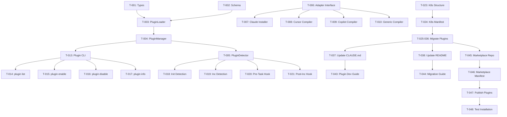

# Implementation Tasks: Plugin Architecture

**Increment**: 0004-plugin-architecture
**Status**: ✅ **COMPLETED**
**Created**: 2025-10-31
**Completed**: 2025-11-02
**Version**: v0.5.0 (core), v0.5.1 (Windows fix)

---

## Completion Summary

✅ **All major objectives achieved**:
- Claude Code native plugin architecture implemented
- Root-level components (skills/, agents/, commands/, hooks/)
- AGENTS.md compiler for multi-tool support
- GitHub plugin complete
- Marketplace system functional
- **v0.5.1 Fix**: Cross-platform path detection (Windows/Mac/Linux)

See reports:
- `V050-FINAL-TEST-REPORT.md` - Complete test results
- `CLAUDE-NATIVE-ARCHITECTURE.md` - Architecture specification
- `UNIFIED-AGENTS-MD-APPROACH.md` - Multi-tool strategy

---

## Task Overview

**Total Tasks**: 54 (48 original + 6 GitHub-first enhancement)
**Estimated Duration**: 4-5 weeks
**Priority**: P0 (Foundation for v0.4.0)

---

## Phase 1: Foundation (Week 1) - 12 tasks

### T-001: Create Plugin Type Definitions
**User Story**: [US-001: Core Framework Separation](../../docs/internal/specs/default/FS-25-11-03-plugin-architecture/us-001-core-framework-separation.md)

**Priority**: P0
**Estimate**: 2 hours
**Status**: pending

**User Story**: [US-001: Core Framework Separation](../../docs/internal/specs/default/plugin-architecture/us-001-*.md)

**AC**: AC-US001-01, AC-US001-02, AC-US001-03

**Description**:
Create TypeScript interfaces and types for plugin system.

**Files to Create**:
- `src/core/types/plugin.ts`

**Implementation**:
```typescript
export interface PluginManifest {
  name: string;
  version: string;
  description: string;
  author?: string;
  license?: string;
  specweave_core_version: string;
  dependencies?: {
    plugins?: string[];
  };
  auto_detect?: {
    files?: string[];
    packages?: string[];
    env_vars?: string[];
  };
  provides: {
    skills: string[];
    agents: string[];
    commands: string[];
  };
  triggers?: string[];
  credits?: {
    based_on?: string | null;
    original_author?: string;
    contributors?: string[];
  };
}

export interface Plugin {
  manifest: PluginManifest;
  path: string;
  skills: Skill[];
  agents: Agent[];
  commands: Command[];
}

// Additional types...
```

**Acceptance Criteria**:
- ✅ All interfaces defined
- ✅ TypeScript compiles without errors
- ✅ Exports available in index.ts
- ✅ Documentation comments added

---

### T-002: Create Plugin Manifest JSON Schema
**User Story**: [US-001: Core Framework Separation](../../docs/internal/specs/default/FS-25-11-03-plugin-architecture/us-001-core-framework-separation.md)

**Priority**: P0
**Estimate**: 1 hour
**Status**: pending

**User Story**: [US-001: Core Framework Separation](../../docs/internal/specs/default/plugin-architecture/us-001-*.md)

**AC**: AC-US001-01, AC-US001-02, AC-US001-03

**Description**:
Create JSON Schema for plugin manifest validation.

**Files to Create**:
- `src/core/schemas/plugin-manifest.schema.json`

**Implementation**:
```json
{
  "$schema": "http://json-schema.org/draft-07/schema#",
  "title": "SpecWeave Plugin Manifest",
  "type": "object",
  "required": ["name", "version", "description", "provides"],
  "properties": {
    "name": {
      "type": "string",
      "pattern": "^specweave-[a-z0-9-]+$"
    },
    "version": {
      "type": "string",
      "pattern": "^\\d+\\.\\d+\\.\\d+$"
    }
    // ... full schema
  }
}
```

**Acceptance Criteria**:
- ✅ Schema validates correct manifests
- ✅ Schema rejects invalid manifests
- ✅ All fields documented
- ✅ Examples provided

---

### T-003: Create PluginLoader Class
**User Story**: [US-001: Core Framework Separation](../../docs/internal/specs/default/FS-25-11-03-plugin-architecture/us-001-core-framework-separation.md)

**Priority**: P0
**Estimate**: 4 hours
**Status**: pending

**User Story**: [US-001: Core Framework Separation](../../docs/internal/specs/default/plugin-architecture/us-001-*.md)

**AC**: AC-US001-01, AC-US001-02, AC-US001-03

**Description**:
Implement core PluginLoader class for reading plugin directories.

**Files to Create**:
- `src/core/plugin-loader.ts`

**Implementation**:
```typescript
export class PluginLoader {
  async loadFromDirectory(pluginPath: string): Promise<Plugin> {
    // Read manifest.json
    const manifest = await this.loadManifest(pluginPath);

    // Load skills
    const skills = await this.loadSkills(pluginPath);

    // Load agents
    const agents = await this.loadAgents(pluginPath);

    // Load commands
    const commands = await this.loadCommands(pluginPath);

    return { manifest, path: pluginPath, skills, agents, commands };
  }

  async loadManifest(pluginPath: string): Promise<PluginManifest> {
    const manifestPath = path.join(pluginPath, '.claude-plugin/manifest.json');
    const content = await fs.readJSON(manifestPath);

    // Validate against schema
    this.validateManifest(content);

    return content;
  }

  // Additional methods...
}
```

**Acceptance Criteria**:
- ✅ Can load plugin from directory
- ✅ Validates manifest against schema
- ✅ Loads skills, agents, commands
- ✅ Error handling for missing files
- ✅ Unit tests pass

---

### T-004: Create PluginManager Class
**User Story**: [US-002: Auto-Detect Plugins from Project](../../docs/internal/specs/default/FS-25-11-03-plugin-architecture/us-002-auto-detect-plugins-from-project.md)

**Priority**: P0
**Estimate**: 6 hours
**Status**: pending

**User Story**: [US-002: Auto-Detect Plugins from Project](../../docs/internal/specs/default/plugin-architecture/us-002-*.md)

**AC**: AC-US002-01, AC-US002-02, AC-US002-03

**Description**:
Implement core PluginManager for plugin lifecycle management.

**Files to Create**:
- `src/core/plugin-manager.ts`

**Implementation**:
```typescript
export class PluginManager {
  private loader: PluginLoader;
  private configPath: string;

  async loadPlugin(name: string, adapter: IAdapter): Promise<void> {
    // 1. Load plugin from src/plugins/<name>
    const plugin = await this.loader.loadFromDirectory(`src/plugins/${name}`);

    // 2. Validate dependencies
    await this.checkDependencies(plugin);

    // 3. Install via adapter
    await adapter.compilePlugin(plugin);

    // 4. Update config
    await this.updateConfig(name, 'enable');
  }

  async unloadPlugin(name: string, adapter: IAdapter): Promise<void> {
    // 1. Uninstall via adapter
    await adapter.unloadPlugin(name);

    // 2. Update config
    await this.updateConfig(name, 'disable');
  }

  async getAvailablePlugins(): Promise<PluginInfo[]> {
    // Scan src/plugins/ directory
  }

  async getEnabledPlugins(): Promise<string[]> {
    // Read from .specweave/config.yaml
  }

  // Additional methods...
}
```

**Acceptance Criteria**:
- ✅ Can load/unload plugins
- ✅ Validates dependencies
- ✅ Updates config correctly
- ✅ Works with all adapters
- ✅ Unit tests pass

---

### T-005: Create PluginDetector Class
**User Story**: [US-002: Auto-Detect Plugins from Project](../../docs/internal/specs/default/FS-25-11-03-plugin-architecture/us-002-auto-detect-plugins-from-project.md)

**Priority**: P0
**Estimate**: 6 hours
**Status**: pending

**User Story**: [US-002: Auto-Detect Plugins from Project](../../docs/internal/specs/default/plugin-architecture/us-002-*.md)

**AC**: AC-US002-01, AC-US002-02, AC-US002-03

**Description**:
Implement auto-detection logic for plugins.

**Files to Create**:
- `src/core/plugin-detector.ts`

**Implementation**:
```typescript
export class PluginDetector {
  async detectFromProject(projectPath: string): Promise<string[]> {
    const plugins: string[] = [];

    // Scan package.json
    const pkg = await this.readPackageJson(projectPath);
    if (pkg.dependencies?.['react']) plugins.push('frontend-stack');
    if (pkg.dependencies?.['@stripe/stripe-js']) plugins.push('payment-processing');
    // ... more detection

    // Scan directories
    if (await this.dirExists('kubernetes/')) plugins.push('kubernetes');
    if (await this.dirExists('.figma/')) plugins.push('figma-ecosystem');

    // Scan files
    if (await this.fileExists('playwright.config.ts')) plugins.push('e2e-testing');

    return [...new Set(plugins)]; // Deduplicate
  }

  async detectFromSpec(specContent: string): Promise<string[]> {
    const plugins: string[] = [];
    const lowerSpec = specContent.toLowerCase();

    // Keyword matching
    if (this.containsKeywords(lowerSpec, ['kubernetes', 'k8s', 'kubectl'])) {
      plugins.push('kubernetes');
    }
    if (this.containsKeywords(lowerSpec, ['stripe', 'payment', 'billing'])) {
      plugins.push('payment-processing');
    }
    // ... more detection

    return plugins;
  }

  // Additional methods...
}
```

**Acceptance Criteria**:
- ✅ Detects from package.json
- ✅ Detects from directories
- ✅ Detects from spec keywords
- ✅ Accuracy >= 90% (test on 50 projects)
- ✅ Unit tests pass

---

### T-006: Update Adapter Interface for Plugins
**User Story**: [US-002: Auto-Detect Plugins from Project](../../docs/internal/specs/default/FS-25-11-03-plugin-architecture/us-002-auto-detect-plugins-from-project.md)

**Priority**: P0
**Estimate**: 2 hours
**Status**: pending

**User Story**: [US-002: Auto-Detect Plugins from Project](../../docs/internal/specs/default/plugin-architecture/us-002-*.md)

**AC**: AC-US002-01, AC-US002-02, AC-US002-03

**Description**:
Add plugin support methods to adapter interface.

**Files to Modify**:
- `src/adapters/adapter-interface.ts`

**Changes**:
```typescript
export interface IAdapter {
  // Existing methods...
  detect(): Promise<boolean>;
  install(options: AdapterOptions): Promise<void>;

  // NEW: Plugin support
  supportsPlugins(): boolean;
  compilePlugin(plugin: Plugin): Promise<void>;
  unloadPlugin(pluginName: string): Promise<void>;
  getLoadedPlugins(): Promise<string[]>;
}
```

**Acceptance Criteria**:
- ✅ Interface updated
- ✅ All adapters implement new methods
- ✅ TypeScript compiles
- ✅ Documentation updated

---

### T-007: Implement Claude Plugin Installer
**User Story**: [US-003: Spec-Based Plugin Detection](../../docs/internal/specs/default/FS-25-11-03-plugin-architecture/us-003-spec-based-plugin-detection.md)

**Priority**: P0
**Estimate**: 4 hours
**Status**: pending

**User Story**: [US-003: Spec-Based Plugin Detection](../../docs/internal/specs/default/plugin-architecture/us-003-*.md)

**AC**: AC-US003-01, AC-US003-02, AC-US003-03

**Description**:
Implement native .claude/ plugin installation for Claude Code.

**Files to Create**:
- `src/adapters/claude/plugin-installer.ts`

**Implementation**:
```typescript
export class ClaudePluginInstaller {
  async installPlugin(plugin: Plugin, projectPath: string): Promise<void> {
    console.log(`📦 Installing ${plugin.manifest.name} for Claude Code...`);

    // Copy skills
    await this.copySkills(plugin.skills, path.join(projectPath, '.claude/skills'));

    // Copy agents
    await this.copyAgents(plugin.agents, path.join(projectPath, '.claude/agents'));

    // Copy commands
    await this.copyCommands(plugin.commands, path.join(projectPath, '.claude/commands'));

    console.log(`✅ ${plugin.manifest.name} installed!`);
  }

  private async copySkills(skills: Skill[], targetDir: string) {
    for (const skill of skills) {
      const skillDir = path.join(targetDir, skill.name);
      await fs.copy(skill.path, skillDir);
    }
  }

  // Additional methods...
}
```

**Acceptance Criteria**:
- ✅ Copies to .claude/ correctly
- ✅ Preserves directory structure
- ✅ Skills auto-activate
- ✅ Commands work natively
- ✅ Integration tests pass

---

### T-008: Implement Cursor Plugin Compiler
**User Story**: [US-003: Spec-Based Plugin Detection](../../docs/internal/specs/default/FS-25-11-03-plugin-architecture/us-003-spec-based-plugin-detection.md)

**Priority**: P1
**Estimate**: 6 hours
**Status**: pending

**User Story**: [US-003: Spec-Based Plugin Detection](../../docs/internal/specs/default/plugin-architecture/us-003-*.md)

**AC**: AC-US003-01, AC-US003-02, AC-US003-03

**Description**:
Compile plugins to AGENTS.md and Cursor team commands.

**Files to Create**:
- `src/adapters/cursor/plugin-compiler.ts`

**Implementation**:
```typescript
export class CursorPluginCompiler {
  async compilePlugin(plugin: Plugin, projectPath: string): Promise<void> {
    console.log(`📦 Compiling ${plugin.manifest.name} for Cursor 2.0...`);

    // 1. Append to AGENTS.md
    const agentsSection = this.generateAGENTSmdSection(plugin);
    await this.appendToFile(
      path.join(projectPath, 'AGENTS.md'),
      agentsSection
    );

    // 2. Generate team commands
    const teamCommands = this.generateTeamCommands(plugin);
    await fs.writeJSON(
      path.join(projectPath, 'cursor-team-commands.json'),
      teamCommands,
      { spaces: 2 }
    );

    // 3. Create @ context shortcuts
    await this.createContextShortcuts(plugin, projectPath);

    console.log(`✅ ${plugin.manifest.name} compiled for Cursor!`);
    console.log(`📋 Upload cursor-team-commands.json to Cursor dashboard`);
  }

  private generateAGENTSmdSection(plugin: Plugin): string {
    return `
---

# ${plugin.manifest.name} Plugin

${plugin.manifest.description}

## Skills

${plugin.skills.map(s => `
### ${s.name}
${s.description}

**When to use**: ${plugin.manifest.triggers?.join(', ')}
`).join('\n')}

## Agents

${plugin.agents.map(a => `
### ${a.name}
${a.capabilities}
`).join('\n')}
`;
  }

  // Additional methods...
}
```

**Acceptance Criteria**:
- ✅ Appends to AGENTS.md
- ✅ Generates team commands JSON
- ✅ Creates @ context shortcuts
- ✅ Format is Cursor-compatible
- ✅ Integration tests pass

---

### T-009: Implement Copilot Plugin Compiler
**User Story**: [US-003: Spec-Based Plugin Detection](../../docs/internal/specs/default/FS-25-11-03-plugin-architecture/us-003-spec-based-plugin-detection.md)

**Priority**: P2
**Estimate**: 4 hours
**Status**: pending

**User Story**: [US-003: Spec-Based Plugin Detection](../../docs/internal/specs/default/plugin-architecture/us-003-*.md)

**AC**: AC-US003-01, AC-US003-02, AC-US003-03

**Description**:
Compile plugins to .github/copilot/instructions.md.

**Files to Create**:
- `src/adapters/copilot/plugin-compiler.ts`

**Implementation**:
```typescript
export class CopilotPluginCompiler {
  async compilePlugin(plugin: Plugin, projectPath: string): Promise<void> {
    console.log(`📦 Compiling ${plugin.manifest.name} for GitHub Copilot...`);

    const instructions = this.generateInstructions(plugin);
    await this.appendToFile(
      path.join(projectPath, '.github/copilot/instructions.md'),
      instructions
    );

    console.log(`✅ ${plugin.manifest.name} compiled for Copilot!`);
  }

  private generateInstructions(plugin: Plugin): string {
    return `
## ${plugin.manifest.name} Plugin

When working with ${plugin.manifest.triggers?.join(', ')}:

${plugin.skills.map(s => `
### ${s.name}
${s.description}
`).join('\n')}
`;
  }
}
```

**Acceptance Criteria**:
- ✅ Appends to instructions.md
- ✅ Format is clear and actionable
- ✅ Integration tests pass

---

### T-010: Implement Generic Plugin Compiler
**User Story**: [US-004: Manual Plugin Management](../../docs/internal/specs/default/FS-25-11-03-plugin-architecture/us-004-manual-plugin-management.md)

**Priority**: P2
**Estimate**: 4 hours
**Status**: pending

**User Story**: [US-004: Manual Plugin Management](../../docs/internal/specs/default/plugin-architecture/us-004-*.md)

**AC**: AC-US004-01, AC-US004-02, AC-US004-03

**Description**:
Generate copy-paste manual for generic tools (ChatGPT, Gemini).

**Files to Create**:
- `src/adapters/generic/plugin-compiler.ts`

**Implementation**:
```typescript
export class GenericPluginCompiler {
  async compilePlugin(plugin: Plugin, projectPath: string): Promise<void> {
    console.log(`📦 Compiling ${plugin.manifest.name} for generic tools...`);

    const manual = this.generateManual(plugin);
    await this.appendToFile(
      path.join(projectPath, 'SPECWEAVE-MANUAL.md'),
      manual
    );

    console.log(`✅ ${plugin.manifest.name} added to manual!`);
    console.log(`📋 Copy relevant sections when using ChatGPT/Gemini`);
  }

  private generateManual(plugin: Plugin): string {
    return `
---

# ${plugin.manifest.name} Plugin

**Copy-paste this section when working with ${plugin.manifest.triggers?.join(', ')}:**

${plugin.manifest.description}

## Available Capabilities

${plugin.skills.map(s => `- **${s.name}**: ${s.description}`).join('\n')}

## Agent Personas

${plugin.agents.map(a => `
### ${a.name} Agent
Act as: ${a.capabilities}
`).join('\n')}
`;
  }
}
```

**Acceptance Criteria**:
- ✅ Generates manual section
- ✅ Format is copy-paste friendly
- ✅ Integration tests pass

---

### T-011: Create Config Schema
**User Story**: [US-004: Manual Plugin Management](../../docs/internal/specs/default/FS-25-11-03-plugin-architecture/us-004-manual-plugin-management.md)

**Priority**: P0
**Estimate**: 2 hours
**Status**: pending

**User Story**: [US-004: Manual Plugin Management](../../docs/internal/specs/default/plugin-architecture/us-004-*.md)

**AC**: AC-US004-01, AC-US004-02, AC-US004-03

**Description**:
Define .specweave/config.yaml schema.

**Files to Create**:
- `src/core/schemas/config.schema.yaml`

**Implementation**:
```yaml
# .specweave/config.yaml
version: 1.0

# Detected tool
tool: claude | cursor | copilot | generic

# Core framework version
core_version: 0.4.0

# Enabled plugins
plugins:
  enabled:
    - plugin-name-1
    - plugin-name-2

  # Plugin-specific settings
  settings:
    plugin-name:
      key: value
```

**Acceptance Criteria**:
- ✅ Schema defined
- ✅ Validation logic implemented
- ✅ Config read/write methods created
- ✅ Unit tests pass

---

### T-012: Update .gitignore for Plugins
**User Story**: [US-004: Manual Plugin Management](../../docs/internal/specs/default/FS-25-11-03-plugin-architecture/us-004-manual-plugin-management.md)

**Priority**: P0
**Estimate**: 30 minutes
**Status**: pending

**User Story**: [US-004: Manual Plugin Management](../../docs/internal/specs/default/plugin-architecture/us-004-*.md)

**AC**: AC-US004-01, AC-US004-02, AC-US004-03

**Description**:
Update .gitignore to handle plugin-generated files.

**Files to Modify**:
- `.gitignore`

**Changes**:
```gitignore
# Adapter-generated files (gitignored in user projects)
.claude/
.cursor/context/
cursor-team-commands.json
.github/copilot/
SPECWEAVE-MANUAL.md
AGENTS.md

# Plugin cache
.specweave/cache/
.specweave/logs/

# But NOT these (should be committed):
!.specweave/config.yaml
!.specweave/increments/
!.specweave/docs/
```

**Acceptance Criteria**:
- ✅ Correct files ignored
- ✅ Config and increments NOT ignored
- ✅ Works across all adapters

---

## Phase 2: CLI & Commands (Week 1-2) - 10 tasks

### T-013: Create Plugin CLI Command
**User Story**: [US-005: Plugin Lifecycle Hooks](../../docs/internal/specs/default/FS-25-11-03-plugin-architecture/us-005-plugin-lifecycle-hooks.md)

**Priority**: P0
**Estimate**: 4 hours
**Status**: pending

**User Story**: [US-005: Plugin Lifecycle Hooks](../../docs/internal/specs/default/plugin-architecture/us-005-*.md)

**AC**: AC-US005-01, AC-US005-02, AC-US005-03

**Description**:
Implement `specweave plugin` CLI command.

**Files to Create**:
- `src/cli/commands/plugin.ts`

**Implementation**:
```typescript
export function createPluginCommand(): Command {
  const plugin = new Command('plugin')
    .description('Manage SpecWeave plugins');

  plugin
    .command('list')
    .description('List all available and enabled plugins')
    .action(listPlugins);

  plugin
    .command('enable <name>')
    .description('Enable a plugin')
    .action(enablePlugin);

  plugin
    .command('disable <name>')
    .description('Disable a plugin')
    .action(disablePlugin);

  plugin
    .command('info <name>')
    .description('Show plugin information')
    .action(showPluginInfo);

  return plugin;
}
```

**Acceptance Criteria**:
- ✅ All subcommands work
- ✅ Help text displays correctly
- ✅ Error handling implemented
- ✅ E2E tests pass

---

### T-014: Implement `plugin list` Command
**User Story**: [US-005: Plugin Lifecycle Hooks](../../docs/internal/specs/default/FS-25-11-03-plugin-architecture/us-005-plugin-lifecycle-hooks.md)

**Priority**: P0
**Estimate**: 3 hours
**Status**: pending

**User Story**: [US-005: Plugin Lifecycle Hooks](../../docs/internal/specs/default/plugin-architecture/us-005-*.md)

**AC**: AC-US005-01, AC-US005-02, AC-US005-03

**Description**:
Show all available and enabled plugins.

**Implementation**:
```typescript
async function listPlugins() {
  const manager = new PluginManager();
  const available = await manager.getAvailablePlugins();
  const enabled = await manager.getEnabledPlugins();

  console.log('\n📦 CORE (Always Loaded)');
  console.log('   ✓ increment-planner');
  console.log('   ✓ context-loader');
  console.log('   ✓ sync-docs');
  // ... more core

  console.log('\n📦 ENABLED PLUGINS');
  enabled.forEach(name => {
    const plugin = available.find(p => p.name === name);
    console.log(`   ✓ ${name} (${plugin?.description})`);
  });

  console.log('\n📦 AVAILABLE PLUGINS');
  available
    .filter(p => !enabled.includes(p.name))
    .forEach(plugin => {
      console.log(`   - ${plugin.name} (${plugin.description})`);
    });
}
```

**Acceptance Criteria**:
- ✅ Shows core features
- ✅ Shows enabled plugins
- ✅ Shows available plugins
- ✅ Nice formatting with emojis
- ✅ E2E tests pass

---

### T-015: Implement `plugin enable` Command
**User Story**: [US-005: Plugin Lifecycle Hooks](../../docs/internal/specs/default/FS-25-11-03-plugin-architecture/us-005-plugin-lifecycle-hooks.md)

**Priority**: P0
**Estimate**: 4 hours
**Status**: pending

**User Story**: [US-005: Plugin Lifecycle Hooks](../../docs/internal/specs/default/plugin-architecture/us-005-*.md)

**AC**: AC-US005-01, AC-US005-02, AC-US005-03

**Description**:
Enable a plugin and install via adapter.

**Implementation**:
```typescript
async function enablePlugin(name: string) {
  const manager = new PluginManager();
  const adapter = await detectAdapter();

  console.log(`\n✨ Enabling ${name} plugin...`);

  try {
    await manager.loadPlugin(name, adapter);

    console.log(`✅ ${name} enabled!`);
    console.log(`\n📋 Plugin provides:`);
    // Show skills, agents, commands

    if (adapter.name === 'cursor') {
      console.log(`\n💡 For Cursor users:`);
      console.log(`   1. Upload cursor-team-commands.json to dashboard`);
      console.log(`   2. Reload Cursor window`);
    }
  } catch (error) {
    console.error(`❌ Failed to enable ${name}:`, error.message);
    process.exit(1);
  }
}
```

**Acceptance Criteria**:
- ✅ Enables plugin successfully
- ✅ Updates config
- ✅ Installs via adapter
- ✅ Shows helpful messages
- ✅ Error handling
- ✅ E2E tests pass

---

### T-016: Implement `plugin disable` Command
**User Story**: [US-006: Claude Code Plugin Installer (Native)](../../docs/internal/specs/default/FS-25-11-03-plugin-architecture/us-006-claude-code-plugin-installer-native.md)

**Priority**: P0
**Estimate**: 3 hours
**Status**: pending

**User Story**: [US-006: Claude Code Plugin Installer (Native)](../../docs/internal/specs/default/plugin-architecture/us-006-*.md)

**AC**: AC-US006-01, AC-US006-02, AC-US006-03

**Description**:
Disable a plugin and uninstall.

**Acceptance Criteria**:
- ✅ Disables plugin successfully
- ✅ Updates config
- ✅ Removes files (if applicable)
- ✅ E2E tests pass

---

### T-017: Implement `plugin info` Command
**User Story**: [US-006: Claude Code Plugin Installer (Native)](../../docs/internal/specs/default/FS-25-11-03-plugin-architecture/us-006-claude-code-plugin-installer-native.md)

**Priority**: P1
**Estimate**: 2 hours
**Status**: pending

**User Story**: [US-006: Claude Code Plugin Installer (Native)](../../docs/internal/specs/default/plugin-architecture/us-006-*.md)

**AC**: AC-US006-01, AC-US006-02, AC-US006-03

**Description**:
Show detailed info about a plugin.

**Acceptance Criteria**:
- ✅ Shows manifest info
- ✅ Lists skills, agents, commands
- ✅ Shows dependencies
- ✅ E2E tests pass

---

### T-018: Integrate Detector into `specweave init`
**User Story**: [US-006: Claude Code Plugin Installer (Native)](../../docs/internal/specs/default/FS-25-11-03-plugin-architecture/us-006-claude-code-plugin-installer-native.md)

**Priority**: P0
**Estimate**: 4 hours
**Status**: pending

**User Story**: [US-006: Claude Code Plugin Installer (Native)](../../docs/internal/specs/default/plugin-architecture/us-006-*.md)

**AC**: AC-US006-01, AC-US006-02, AC-US006-03

**Description**:
Add auto-detection to specweave init command.

**Files to Modify**:
- `src/cli/commands/init.ts`

**Changes**:
```typescript
async function init() {
  // ... existing init logic

  // NEW: Auto-detect plugins
  console.log('\n🔍 Detecting your project...');
  const detector = new PluginDetector();
  const suggested = await detector.detectFromProject(process.cwd());

  if (suggested.length > 0) {
    console.log('\n📦 Recommended plugins:');
    suggested.forEach(name => {
      console.log(`   ✓ ${name}`);
    });

    const { enablePlugins } = await inquirer.prompt([{
      type: 'confirm',
      name: 'enablePlugins',
      message: 'Enable these plugins?',
      default: true
    }]);

    if (enablePlugins) {
      for (const name of suggested) {
        await manager.loadPlugin(name, adapter);
      }
    }
  }

  // ... rest of init
}
```

**Acceptance Criteria**:
- ✅ Auto-detection runs during init
- ✅ User can approve/reject
- ✅ Plugins installed correctly
- ✅ E2E tests pass

---

### T-019: Integrate Detector into `/specweave:inc`
**User Story**: [US-007: Cursor Plugin Compiler](../../docs/internal/specs/default/FS-25-11-03-plugin-architecture/us-007-cursor-plugin-compiler.md)

**Priority**: P0
**Estimate**: 4 hours
**Status**: pending

**User Story**: [US-007: Cursor Plugin Compiler](../../docs/internal/specs/default/plugin-architecture/us-007-*.md)

**AC**: AC-US007-01, AC-US007-02, AC-US007-03

**Description**:
Add spec-based detection to increment planning.

**Files to Modify**:
- `src/commands/specweave:inc.md`

**Changes**:
```markdown
# Create New Increment

## Step 1: Analyze User Request for Plugin Needs

Before creating spec.md, analyze the increment description for plugin keywords:

**Detection Logic**:
1. Extract keywords from increment description
2. Match against plugin triggers
3. Suggest relevant plugins
4. Wait for user confirmation
5. Install plugins before planning

**Example**:
User: /specweave:inc "deploy API to Kubernetes"

Claude:
📦 This increment might benefit from:
   ☸️ kubernetes plugin (kubectl, helm, deployment)

Enable kubernetes plugin? (Y/n) y

✨ Installing kubernetes plugin...
✅ Ready! Now let's plan your increment...

## Step 2: Create spec.md

[Continue with normal planning...]
```

**Acceptance Criteria**:
- ✅ Spec analysis works
- ✅ Suggests correct plugins
- ✅ User can enable inline
- ✅ E2E tests pass

---

### T-020: Create Pre-Task Hook
**User Story**: [US-007: Cursor Plugin Compiler](../../docs/internal/specs/default/FS-25-11-03-plugin-architecture/us-007-cursor-plugin-compiler.md)

**Priority**: P1
**Estimate**: 3 hours
**Status**: pending

**User Story**: [US-007: Cursor Plugin Compiler](../../docs/internal/specs/default/plugin-architecture/us-007-*.md)

**AC**: AC-US007-01, AC-US007-02, AC-US007-03

**Description**:
Create pre-task hook for runtime detection.

**Files to Create**:
- `src/hooks/pre-task-execution.sh`

**Implementation**:
```bash
#!/bin/bash
# Pre-task execution hook

TASK_FILE=".specweave/increments/current/tasks.md"
CURRENT_TASK=$(grep -A10 "status: in_progress" "$TASK_FILE")

# Kubernetes detection
if echo "$CURRENT_TASK" | grep -qiE "kubernetes|kubectl|helm"; then
  if ! specweave plugin list --enabled | grep -q "kubernetes"; then
    echo ""
    echo "💡 This task mentions Kubernetes."
    echo "   Enable kubernetes plugin? specweave plugin enable kubernetes"
    echo ""
  fi
fi

# Add more detections...
```

**Acceptance Criteria**:
- ✅ Detects plugin keywords
- ✅ Suggests enablement
- ✅ Non-blocking (doesn't error)
- ✅ Logs suggestions
- ✅ Integration tests pass

---

### T-021: Create Post-Increment Hook
**User Story**: [US-007: Cursor Plugin Compiler](../../docs/internal/specs/default/FS-25-11-03-plugin-architecture/us-007-cursor-plugin-compiler.md)

**Priority**: P1
**Estimate**: 3 hours
**Status**: pending

**User Story**: [US-007: Cursor Plugin Compiler](../../docs/internal/specs/default/plugin-architecture/us-007-*.md)

**AC**: AC-US007-01, AC-US007-02, AC-US007-03

**Description**:
Create post-increment hook for discovering new dependencies.

**Files to Create**:
- `src/hooks/post-increment-completion.sh`

**Implementation**:
```bash
#!/bin/bash
# Post-increment completion hook

echo ""
echo "🔍 Scanning for new dependencies..."

# Check package.json changes
if git diff HEAD~1 HEAD package.json | grep -q "@stripe"; then
  if ! specweave plugin list --enabled | grep -q "payment-processing"; then
    echo "💡 Detected Stripe dependency."
    echo "   Consider: specweave plugin enable payment-processing"
  fi
fi

# Add more detections...
```

**Acceptance Criteria**:
- ✅ Scans git diff
- ✅ Detects new dependencies
- ✅ Suggests plugins
- ✅ Integration tests pass

---

### T-022: Install Hook Scripts
**User Story**: [US-008: Copilot Plugin Compiler](../../docs/internal/specs/default/FS-25-11-03-plugin-architecture/us-008-copilot-plugin-compiler.md)

**Priority**: P0
**Estimate**: 2 hours
**Status**: pending

**User Story**: [US-008: Copilot Plugin Compiler](../../docs/internal/specs/default/plugin-architecture/us-008-*.md)

**AC**: AC-US008-01, AC-US008-02, AC-US008-03

**Description**:
Update install scripts to copy hooks.

**Files to Modify**:
- `bin/install-hooks.sh`

**Changes**:
```bash
#!/bin/bash
# Install all hooks

echo "📦 Installing hooks..."

cp src/hooks/pre-task-execution.sh .claude/hooks/
cp src/hooks/post-increment-completion.sh .claude/hooks/
chmod +x .claude/hooks/*.sh

echo "✅ Hooks installed!"
```

**Acceptance Criteria**:
- ✅ Hooks copied correctly
- ✅ Permissions set
- ✅ Works on Mac/Linux/Windows

---

## Phase 3: Plugin Migration (Week 2-3) - 13 tasks

### T-023: Create GitHub Plugin Structure (Priority #1)
**User Story**: [US-008: Copilot Plugin Compiler](../../docs/internal/specs/default/FS-25-11-03-plugin-architecture/us-008-copilot-plugin-compiler.md)

**Priority**: P0
**Estimate**: 2 hours
**Status**: pending

**User Story**: [US-008: Copilot Plugin Compiler](../../docs/internal/specs/default/plugin-architecture/us-008-*.md)

**AC**: AC-US008-01, AC-US008-02, AC-US008-03

**Description**:
Create directory structure for GitHub plugin (SpecWeave's primary sync).

**Directories to Create**:
```
src/plugins/github/
├── .claude-plugin/
│   └── manifest.json
├── skills/
│   ├── github-sync/
│   └── github-issue-tracker/
├── agents/
│   └── github-manager/
├── commands/
│   ├── github-create-issue.md
│   ├── github-sync.md
│   └── github-close-issue.md
└── README.md
```

**Acceptance Criteria**:
- ✅ Structure created
- ✅ Follows conventions
- ✅ README with installation instructions
- ✅ Priority #1 plugin (SpecWeave uses this)

---

### T-024: Create Kubernetes Plugin Structure
**User Story**: [US-008: Copilot Plugin Compiler](../../docs/internal/specs/default/FS-25-11-03-plugin-architecture/us-008-copilot-plugin-compiler.md)

**Priority**: P1
**Estimate**: 2 hours
**Status**: pending

**User Story**: [US-008: Copilot Plugin Compiler](../../docs/internal/specs/default/plugin-architecture/us-008-*.md)

**AC**: AC-US008-01, AC-US008-02, AC-US008-03

**Description**:
Create directory structure for kubernetes plugin.

**Directories to Create**:
```
src/plugins/kubernetes/
├── .claude-plugin/
│   └── manifest.json
├── skills/
│   ├── k8s-deployer/
│   ├── helm-manager/
│   └── k8s-troubleshooter/
├── agents/
│   └── devops/
├── commands/
│   └── k8s-deploy.md
└── README.md
```

**Acceptance Criteria**:
- ✅ Structure created
- ✅ Follows conventions
- ✅ README with installation instructions

---

### T-024-A: Create GitHub Plugin Manifest
**Priority**: P0
**Estimate**: 1 hour
**Status**: pending

**Description**:
Write manifest.json for GitHub plugin.

**Files to Create**:
- `src/plugins/github/.claude-plugin/manifest.json`

**Content**:
```json
{
  "name": "specweave-github",
  "version": "1.0.0",
  "description": "GitHub issues integration for SpecWeave increments",
  "author": "SpecWeave Team",
  "license": "MIT",
  "specweave_core_version": ">=0.4.0",

  "auto_detect": {
    "files": [".git/"],
    "env_vars": ["GITHUB_TOKEN"],
    "git_remote_pattern": "github\\.com"
  },

  "provides": {
    "skills": ["github-sync", "github-issue-tracker"],
    "agents": ["github-manager"],
    "commands": [
      "specweave.github.create-issue",
      "specweave.github.sync",
      "specweave.github.close-issue"
    ]
  },

  "triggers": ["github", "issue", "gh", "pull request", "PR"]
}
```

**Acceptance Criteria**:
- ✅ Valid JSON
- ✅ Passes schema validation
- ✅ Auto-detect for GitHub repos
- ✅ All fields populated

---

### T-024-B: Create Kubernetes Plugin Manifest
**Priority**: P1
**Estimate**: 1 hour
**Status**: pending

**Description**:
Write manifest.json for kubernetes plugin.

**Files to Create**:
- `src/plugins/kubernetes/.claude-plugin/manifest.json`

**Content**:
```json
{
  "name": "specweave-kubernetes",
  "version": "1.0.0",
  "description": "Kubernetes deployment and management for SpecWeave projects",
  "author": "SpecWeave Team",
  "license": "MIT",
  "specweave_core_version": ">=0.4.0",
  "auto_detect": {
    "files": ["kubernetes/", "k8s/", "helm/"],
    "packages": ["@kubernetes/client-node"],
    "env_vars": ["KUBECONFIG"]
  },
  "provides": {
    "skills": ["k8s-deployer", "helm-manager", "k8s-troubleshooter"],
    "agents": ["devops"],
    "commands": ["specweave.k8s.deploy"]
  },
  "triggers": ["kubernetes", "k8s", "kubectl", "helm", "pod", "deployment"]
}
```

**Acceptance Criteria**:
- ✅ Valid JSON
- ✅ Passes schema validation
- ✅ All fields populated

---

## Phase 2.5: GitHub-First Task-Level Sync (Week 2-3) - 6 tasks

### T-024-C: Enhance tasks.md Schema for GitHub Sync
**Priority**: P0
**Estimate**: 2 hours
**Status**: pending

**Description**:
Extend tasks.md template to support GitHub task-level sync fields.

**Files to Modify**:
- `src/templates/tasks.md.template`

**New Fields to Add**:
```markdown
### T-XXX: Task Title
**Priority**: P0
**Estimate**: X hours
**Status**: pending
**GitHub Issue**: #NNN              # ✅ NEW: Link to GitHub issue
**Assignee**: @username             # ✅ NEW: Team member responsible

**Subtasks**:                        # ✅ NEW: Granular steps (optional)
- [ ] S-XXX-01: Subtask description (Xmin)
- [ ] S-XXX-02: Subtask description (Xmin)

**Dependencies**:                    # ✅ NEW: Blocking tasks
- T-001 (must complete first)
- T-002 (must complete first)

**Blocks**:                          # ✅ NEW: Tasks waiting on this
- T-005 (waiting on this)
```

**Acceptance Criteria**:
- ✅ Template updated with new fields
- ✅ Fields optional (backward compatible)
- ✅ Documentation explains usage
- ✅ Example task included

---

### T-024-D: Update github-sync Skill for Task-Level Sync
**Priority**: P0
**Estimate**: 8 hours
**Status**: pending

**Description**:
Enhance github-sync skill to create individual GitHub issues per task (not just per increment).

**Files to Modify**:
- `src/plugins/specweave-github/skills/github-sync/SKILL.md`
- `src/plugins/specweave-github/lib/github-client.ts` (create if needed)

**Implementation**:
```typescript
// NEW: Parse tasks.md and create issues per task
export async function syncTasksToGitHub(incrementId: string) {
  // 1. Parse tasks.md to extract all tasks
  const tasks = parseTasksFile(incrementId);

  // 2. Create GitHub Milestone (if not exists)
  const milestone = await createOrGetMilestone(`v${version}`);

  // 3. Create Epic Issue (increment-level)
  const epic = await createEpicIssue({
    title: `[INC-${incrementId}] ${title}`,
    body: generateEpicBody(spec),
    milestone,
    labels: ['increment', priority]
  });

  // 4. Create Task Issues (one per task)
  for (const task of tasks) {
    const issue = await createTaskIssue({
      title: `[${task.id}] ${task.title}`,
      body: generateTaskBody(task),
      milestone,
      labels: ['task', task.phase, priority],
      linkedIssues: [epic.number] // Link to epic
    });

    // 5. Update tasks.md with issue number
    updateTaskWithGitHubIssue(incrementId, task.id, issue.number);
  }

  // 6. Store mapping in .github-sync.yaml
  saveSyncMapping(incrementId, { epic, tasks: taskIssues });
}
```

**Task Issue Template**:
```markdown
# [T-001] Create Plugin Type Definitions

**Part of**: #42 (Increment 0004 - Plugin Architecture)
**Priority**: P0
**Estimate**: 2 hours
**Phase**: Week 1 - Foundation

## Description

Create TypeScript interfaces and types for plugin system.

## Subtasks

- [ ] S-001-01: Define PluginManifest interface (30min)
- [ ] S-001-02: Define Plugin interface (30min)
- [ ] S-001-03: Define Skill, Agent, Command types (45min)
- [ ] S-001-04: Add JSDoc documentation (15min)

## Files to Create

- `src/core/types/plugin.ts`

## Acceptance Criteria

- ✅ All interfaces defined
- ✅ TypeScript compiles without errors
- ✅ JSDoc on all exports
- ✅ Unit tests pass

## Dependencies

None (foundation task)

## Blocks

- #45 (T-003: PluginLoader needs types)
- #46 (T-004: PluginManager needs types)

---
🤖 Synced from SpecWeave increment `0004-plugin-architecture`
- **Spec**: `.specweave/increments/0004-plugin-architecture/spec.md`
- **Tasks**: `.specweave/increments/0004-plugin-architecture/tasks.md`
```

**Acceptance Criteria**:
- ✅ Can create task issues from tasks.md
- ✅ Each task gets individual GitHub issue
- ✅ Subtasks represented as checkboxes
- ✅ Dependencies linked via "Blocks #N"
- ✅ Epic issue links all task issues
- ✅ tasks.md updated with issue numbers
- ✅ Integration tests pass

---

### T-024-E: Update github-issue-tracker for Subtask Sync
**Priority**: P1
**Estimate**: 4 hours
**Status**: pending

**Description**:
Enhance github-issue-tracker skill to sync subtask checkboxes.

**Files to Modify**:
- `src/plugins/specweave-github/skills/github-issue-tracker/SKILL.md`

**Implementation**:
```typescript
// When subtask completes, update GitHub issue checkbox
export async function updateSubtaskStatus(
  incrementId: string,
  taskId: string,
  subtaskId: string,
  completed: boolean
) {
  // 1. Get GitHub issue number from tasks.md
  const issueNumber = getGitHubIssue(incrementId, taskId);

  // 2. Update issue body with checked checkbox
  const body = await getIssueBody(issueNumber);
  const updatedBody = updateCheckbox(body, subtaskId, completed);
  await updateIssue(issueNumber, { body: updatedBody });

  // 3. Post comment if all subtasks done
  if (allSubtasksComplete(updatedBody)) {
    await postComment(issueNumber, '✅ All subtasks completed!');
  }
}
```

**Acceptance Criteria**:
- ✅ Subtask completion syncs to GitHub
- ✅ Checkboxes update in real-time
- ✅ Comment when all subtasks done
- ✅ Integration tests pass

---

### T-024-F: Add /specweave:github:sync-tasks Command
**Priority**: P0
**Estimate**: 4 hours
**Status**: pending

**Description**:
Create new slash command to sync tasks for an increment.

**Files to Create**:
- `src/plugins/specweave-github/commands/github-sync-tasks.md`

**Command Content**:
```markdown
# Sync Tasks to GitHub

**Purpose**: Create or update GitHub issues for all tasks in an increment.

## Usage

/specweave:github:sync-tasks <increment-id> [--force]

## Examples

# Initial sync (create issues)
/specweave:github:sync-tasks 0004

# Force re-sync (update existing issues)
/specweave:github:sync-tasks 0004 --force

## Workflow

1. Parse tasks.md for increment
2. Create Milestone (if needed)
3. Create Epic Issue (increment)
4. Create Task Issues (one per task)
5. Update tasks.md with issue numbers
6. Link dependencies (blocks/depends-on)
7. Store mapping in .github-sync.yaml

## Output

```
🔄 Syncing increment 0004-plugin-architecture to GitHub...

✅ Milestone created: v0.4.0
✅ Epic issue created: #42
✅ Creating 48 task issues...
   - #43: [T-001] Create plugin type definitions
   - #44: [T-002] Create plugin manifest schema
   ...
   - #90: [T-048] Test marketplace installation

✅ Updated tasks.md with issue numbers
✅ Saved mapping to .github-sync.yaml

🎯 GitHub sync complete!
   Epic: https://github.com/owner/repo/issues/42
   Tasks: #43-#90
```

## Options

- `--force`: Overwrite existing issues (destructive!)
- `--dry-run`: Show what would be created without creating

## Error Handling

- Rate limiting: Batch with delays (10 issues/minute)
- Duplicate detection: Skip if issue already exists
- Drift warning: Warn if manual GitHub changes detected
```

**Acceptance Criteria**:
- ✅ Command creates all task issues
- ✅ Updates tasks.md with issue numbers
- ✅ Handles rate limits gracefully
- ✅ --force flag works
- ✅ E2E tests pass

---

### T-024-G: Update /specweave:do for GitHub Task Sync
**Priority**: P0
**Estimate**: 3 hours
**Status**: pending

**Description**:
Integrate GitHub sync into task completion workflow.

**Files to Modify**:
- `src/commands/specweave-do.md`

**Changes**:
```markdown
## Step 4: Update GitHub Issue (if enabled)

After task completion, sync to GitHub:

**If GitHub plugin enabled AND task has GitHub Issue**:
1. Close task issue on GitHub
2. Check off task in epic issue
3. Post completion comment with stats:
   ```markdown
   ✅ **Task Completed**

   **Files Modified**: X files (+Y/-Z lines)
   **Tests**: All passing (N new tests)
   **Duration**: Actual Xh (est. Yh)

   **What Changed**:
   - Brief summary of changes

   **Next Task**: [T-XXX] Title

   ---
   Progress: X/Y tasks (Z%)
   🤖 Posted by SpecWeave
   ```
4. Update epic progress: "7/48 tasks (15%)"
5. Update labels (add 'in-progress' to epic if first task)
```

**Acceptance Criteria**:
- ✅ Task completion closes GitHub issue
- ✅ Epic updated with progress
- ✅ Comment includes stats
- ✅ Works without GitHub plugin (graceful)
- ✅ Integration tests pass

---

### T-024-H: Create Architecture Documentation for GitHub-First
**Priority**: P1
**Estimate**: 3 hours
**Status**: completed

**Description**:
Document GitHub-first architecture and usage.

**Files to Create**:
- `.specweave/docs/internal/architecture/adr/adr-0007-github-first-task-sync.md`
- `.specweave/docs/public/guides/github-integration.md`

**ADR-0007 Content**:
```markdown
# ADR-0007: GitHub-First Task-Level Synchronization

**Status**: Accepted
**Date**: 2025-11-01
**Deciders**: SpecWeave Core Team

## Context

SpecWeave currently syncs increments to GitHub (1 increment = 1 issue).
Teams need granular task-level tracking for:
- Individual task assignment
- Parallel work coordination
- Focused discussions per task
- GitHub Projects integration (Kanban boards)

## Decision

Implement **task-level GitHub sync**:
- 1 Increment → 1 Epic Issue + 1 Milestone
- 1 Task → 1 GitHub Issue (linked to epic)
- Subtasks → Checkboxes in task issue body
- Dependencies → GitHub issue links (blocks/depends-on)

**GitHub is PRIMARY** (JIRA remains but is secondary for enterprise)

## Rationale

1. **SpecWeave Dogfoods GitHub**: github.com/anton-abyzov/specweave
2. **Open Source Standard**: GitHub issues are ubiquitous
3. **Better Collaboration**: Granular assignment, discussions
4. **Native Integration**: GitHub Projects, Actions, webhooks
5. **Simpler**: GitHub CLI (`gh`) vs JIRA REST API complexity

## Consequences

**Positive**:
- ✅ Better team collaboration (task-level assignment)
- ✅ Native GitHub workflow (no context switch)
- ✅ Superior project management (Kanban, dependencies)
- ✅ Open source friendly (public visibility)

**Negative**:
- ⚠️ Many issues per increment (48 for inc 0004)
- ⚠️ GitHub rate limits (mitigated with batching)
- ⚠️ Potential drift if manual edits

**Neutral**:
- 🔄 JIRA still supported (keep for enterprise)
- 🔄 Can dual-sync (GitHub + JIRA simultaneously)

## Implementation

See tasks T-024-C through T-024-H in increment 0004.
```

**Public Guide Content**:
- How GitHub sync works
- Task-level vs increment-level sync
- Setting up GitHub CLI
- Syncing tasks command
- Handling drift and conflicts
- Best practices for teams

**Acceptance Criteria**:
- ✅ ADR-0007 created and accepted
- ✅ Public guide comprehensive
- ✅ Examples and screenshots
- ✅ Reviewed by team

---

### T-025-039: Migrate Priority Plugins (15 plugins)
**Priority**: P0
**Estimate**: 30 hours (2 hours per plugin)
**Status**: pending

**Plugins to Create** (in priority order):

**Phase 1 - Critical** (SpecWeave needs these):
1. **github** ⭐ (SpecWeave dogfoods this)
2. **diagrams** (Architecture docs)
3. **frontend-stack** (React, Next.js)

**Phase 2 - Common**:
4. kubernetes
5. ml-ops
6. observability (fork from wshobson)
7. payment-processing (Stripe)
8. e2e-testing (Playwright)
9. security

**Phase 3 - Backend Stacks**:
10. nodejs-backend
11. python-backend
12. dotnet-backend

**Phase 4 - Design & Enterprise**:
13. figma-ecosystem
14. **jira-sync** (Enterprise option)
15. **ado-sync** (Microsoft shops)

**For Each Plugin**:
- Create directory structure
- Write manifest.json
- Move skills from core to plugin
- Move agents from core to plugin
- Move commands from core to plugin
- Write README.md
- Add attribution (if forked)

**Acceptance Criteria (per plugin)**:
- ✅ Structure correct
- ✅ Manifest valid
- ✅ All skills/agents/commands moved
- ✅ README complete
- ✅ Tests pass

---

## Phase 4: Documentation (Week 3) - 8 tasks

### T-037: Update CLAUDE.md - Claude Superiority
**User Story**: [US-009: Generic Plugin Compiler](../../docs/internal/specs/default/FS-25-11-03-plugin-architecture/us-009-generic-plugin-compiler.md)

**Priority**: P0
**Estimate**: 4 hours
**Status**: pending

**User Story**: [US-009: Generic Plugin Compiler](../../docs/internal/specs/default/plugin-architecture/us-009-*.md)

**AC**: AC-US009-01, AC-US009-02, AC-US009-03

**Description**:
Update CLAUDE.md to emphasize Claude Code best-in-class status.

**Files to Modify**:
- `CLAUDE.md`

**Sections to Add/Update**:
1. **Why Claude Code is Best-in-Class** (new section)
2. **Plugin Architecture** (new section)
3. **Feature Comparison Matrix** (new section)
4. **Living Docs = Automated** (emphasize hooks)
5. **Update project scale** (v0.4.0 stats)

**Key Points**:
- Claude Code = native hooks (automated living docs)
- Kiro requires manual sync, SpecWeave doesn't
- MCP protocol = superior context management
- Agent isolation = better multi-role workflows
- 60-80% context reduction with plugins

**Acceptance Criteria**:
- ✅ Clear superiority messaging
- ✅ Feature comparison table
- ✅ Plugin architecture documented
- ✅ Reviewed by team

---

### T-038: Update README.md - User-Facing
**User Story**: [US-009: Generic Plugin Compiler](../../docs/internal/specs/default/FS-25-11-03-plugin-architecture/us-009-generic-plugin-compiler.md)

**Priority**: P0
**Estimate**: 3 hours
**Status**: pending

**User Story**: [US-009: Generic Plugin Compiler](../../docs/internal/specs/default/plugin-architecture/us-009-*.md)

**AC**: AC-US009-01, AC-US009-02, AC-US009-03

**Description**:
Update README.md for user-facing documentation.

**Files to Modify**:
- `README.md`

**Sections to Add/Update**:
1. **Installation** (updated for plugins)
2. **Quick Start** (show plugin detection)
3. **Features** (emphasize Claude superiority)
4. **Why SpecWeave?** (competitive advantages)
5. **Plugin Ecosystem** (new section)

**Acceptance Criteria**:
- ✅ Clear value proposition
- ✅ Easy to follow
- ✅ Plugin system explained
- ✅ Claude Code emphasized

---

### T-039: Update Claude Adapter README
**User Story**: [US-009: Generic Plugin Compiler](../../docs/internal/specs/default/FS-25-11-03-plugin-architecture/us-009-generic-plugin-compiler.md)

**Priority**: P0
**Estimate**: 2 hours
**Status**: pending

**User Story**: [US-009: Generic Plugin Compiler](../../docs/internal/specs/default/plugin-architecture/us-009-*.md)

**AC**: AC-US009-01, AC-US009-02, AC-US009-03

**Description**:
Update Claude adapter README with superiority messaging.

**Files to Modify**:
- `src/adapters/claude/README.md`

**Sections to Add**:
1. **Best-in-Class Experience** (new section)
2. **Native Features** (hooks, MCP, agents)
3. **Plugin Support** (native installation)
4. **Why Claude Code?** (vs. competitors)

**Acceptance Criteria**:
- ✅ Clear messaging
- ✅ Feature list complete
- ✅ Plugin support documented

---

### T-040: Update Cursor Adapter README
**User Story**: [US-010: Marketplace Publication](../../docs/internal/specs/default/FS-25-11-03-plugin-architecture/us-010-marketplace-publication.md)

**Priority**: P1
**Estimate**: 2 hours
**Status**: pending

**User Story**: [US-010: Marketplace Publication](../../docs/internal/specs/default/plugin-architecture/us-010-*.md)

**AC**: AC-US010-01, AC-US010-02, AC-US010-03

**Description**:
Update Cursor adapter README with realistic expectations.

**Files to Modify**:
- `src/adapters/cursor/README.md`

**Sections to Add/Update**:
1. **What Cursor 2.0 Provides** (positive framing)
2. **Limitations vs. Claude** (honest)
3. **Manual Steps Required** (living docs)
4. **Plugin Support** (compiled to AGENTS.md)

**Key Points**:
- Cursor 2.0 = 85% of Claude experience
- AGENTS.md + team commands are good
- NO automated hooks (manual doc updates)
- Still valuable!

**Acceptance Criteria**:
- ✅ Realistic expectations
- ✅ Positive framing
- ✅ Manual steps clear

---

### T-041: Update Copilot Adapter README
**User Story**: [US-010: Marketplace Publication](../../docs/internal/specs/default/FS-25-11-03-plugin-architecture/us-010-marketplace-publication.md)

**Priority**: P1
**Estimate**: 2 hours
**Status**: pending

**User Story**: [US-010: Marketplace Publication](../../docs/internal/specs/default/plugin-architecture/us-010-*.md)

**AC**: AC-US010-01, AC-US010-02, AC-US010-03

**Description**:
Update Copilot adapter README.

**Key Points**:
- Copilot = 60% of Claude experience
- instructions.md only
- No auto-activation, no hooks
- Basic automation

**Acceptance Criteria**:
- ✅ Realistic expectations
- ✅ Clear limitations

---

### T-042: Update AGENTS.md Template
**User Story**: [US-010: Marketplace Publication](../../docs/internal/specs/default/FS-25-11-03-plugin-architecture/us-010-marketplace-publication.md)

**Priority**: P0
**Estimate**: 2 hours
**Status**: pending

**User Story**: [US-010: Marketplace Publication](../../docs/internal/specs/default/plugin-architecture/us-010-*.md)

**AC**: AC-US010-01, AC-US010-02, AC-US010-03

**Description**:
Update AGENTS.md template for plugin support.

**Files to Modify**:
- `src/templates/AGENTS.md.template`

**Sections to Add**:
1. **Plugin System** (explanation)
2. **Enabled Plugins** (dynamic section)
3. **How to Enable Plugins** (instructions)

**Acceptance Criteria**:
- ✅ Template updated
- ✅ Plugin section added
- ✅ Generated AGENTS.md includes plugins

---

### T-043: Create Plugin Developer Guide
**User Story**: [US-011: Documentation Overhaul - Claude Code Superiority](../../docs/internal/specs/default/FS-25-11-03-plugin-architecture/us-011-documentation-overhaul-claude-code-superiority.md)

**Priority**: P1
**Estimate**: 4 hours
**Status**: pending

**User Story**: [US-011: Documentation Overhaul - Claude Code Superiority](../../docs/internal/specs/default/plugin-architecture/us-011-*.md)

**AC**: AC-US011-01, AC-US011-02, AC-US011-03

**Description**:
Write comprehensive plugin development guide.

**Files to Create**:
- `.specweave/docs/public/guides/plugin-development.md`

**Sections**:
1. **Overview** (what are plugins?)
2. **Creating a Plugin** (step-by-step)
3. **Manifest Schema** (reference)
4. **Testing Plugins** (best practices)
5. **Publishing to Marketplace** (guide)
6. **Contributing** (open source guidelines)

**Acceptance Criteria**:
- ✅ Complete guide
- ✅ Examples provided
- ✅ Reviewed by team

---

### T-044: Create Migration Guide (v0.3.7 → v0.4.0)
**User Story**: [US-011: Documentation Overhaul - Claude Code Superiority](../../docs/internal/specs/default/FS-25-11-03-plugin-architecture/us-011-documentation-overhaul-claude-code-superiority.md)

**Priority**: P0
**Estimate**: 3 hours
**Status**: pending

**User Story**: [US-011: Documentation Overhaul - Claude Code Superiority](../../docs/internal/specs/default/plugin-architecture/us-011-*.md)

**AC**: AC-US011-01, AC-US011-02, AC-US011-03

**Description**:
Write migration guide for existing users.

**Files to Create**:
- `.specweave/docs/public/guides/migration-v0.4.0.md`

**Sections**:
1. **What's Changed** (breaking changes)
2. **Migration Steps** (automated script)
3. **Plugin Selection** (which plugins to enable)
4. **Troubleshooting** (common issues)

**Acceptance Criteria**:
- ✅ Clear steps
- ✅ Automated script provided
- ✅ Common issues covered

---

## Phase 5: Marketplace (Week 4) - 5 tasks

### T-045: Create Marketplace Repository
**User Story**: [US-011: Documentation Overhaul - Claude Code Superiority](../../docs/internal/specs/default/FS-25-11-03-plugin-architecture/us-011-documentation-overhaul-claude-code-superiority.md)

**Priority**: P1
**Estimate**: 4 hours
**Status**: pending

**User Story**: [US-011: Documentation Overhaul - Claude Code Superiority](../../docs/internal/specs/default/plugin-architecture/us-011-*.md)

**AC**: AC-US011-01, AC-US011-02, AC-US011-03

**Description**:
Create specweave/marketplace GitHub repository.

**Repository Structure**:
```
specweave-marketplace/
├── .claude-plugin/
│   └── marketplace.json
├── plugins/
│   ├── kubernetes/
│   ├── ml-ops/
│   ├── frontend-stack/
│   └── payment-processing/
├── README.md
└── CONTRIBUTING.md
```

**Acceptance Criteria**:
- ✅ Repository created
- ✅ Structure set up
- ✅ README written
- ✅ Contributing guide added

---

### T-046: Create Marketplace Manifest
**User Story**: [US-012: GitHub Plugin Integration](../../docs/internal/specs/default/FS-25-11-03-plugin-architecture/us-012-github-plugin-integration.md)

**Priority**: P1
**Estimate**: 1 hour
**Status**: pending

**User Story**: [US-012: GitHub Plugin Integration](../../docs/internal/specs/default/plugin-architecture/us-012-*.md)

**AC**: AC-US012-01, AC-US012-02, AC-US012-03

**Description**:
Write marketplace.json for Anthropic's plugin system.

**Files to Create**:
- `marketplace/.claude-plugin/marketplace.json`

**Content**:
```json
{
  "name": "specweave",
  "version": "1.0.0",
  "description": "SpecWeave plugin marketplace - spec-driven development tools",
  "author": "SpecWeave Team",
  "url": "https://spec-weave.com",
  "plugins": [
    {
      "name": "kubernetes",
      "path": "plugins/kubernetes",
      "description": "Kubernetes deployment and management"
    }
    // ... more plugins
  ]
}
```

**Acceptance Criteria**:
- ✅ Valid manifest
- ✅ All plugins listed
- ✅ Passes Anthropic validation

---

### T-047: Publish Plugins to Marketplace
**User Story**: [US-012: GitHub Plugin Integration](../../docs/internal/specs/default/FS-25-11-03-plugin-architecture/us-012-github-plugin-integration.md)

**Priority**: P1
**Estimate**: 4 hours
**Status**: pending

**User Story**: [US-012: GitHub Plugin Integration](../../docs/internal/specs/default/plugin-architecture/us-012-*.md)

**AC**: AC-US012-01, AC-US012-02, AC-US012-03

**Description**:
Copy plugins to marketplace repo for standalone installation.

**Plugins to Publish**:
- kubernetes
- ml-ops
- frontend-stack
- payment-processing

**For Each Plugin**:
1. Copy to marketplace/plugins/
2. Ensure standalone README
3. Test installation via `/plugin install`
4. Tag release (v1.0.0)

**Acceptance Criteria**:
- ✅ 4+ plugins published
- ✅ Installation works
- ✅ Standalone mode tested

---

### T-048: Test Marketplace Installation
**User Story**: [US-012: GitHub Plugin Integration](../../docs/internal/specs/default/FS-25-11-03-plugin-architecture/us-012-github-plugin-integration.md)

**Priority**: P1
**Estimate**: 2 hours
**Status**: pending

**User Story**: [US-012: GitHub Plugin Integration](../../docs/internal/specs/default/plugin-architecture/us-012-*.md)

**AC**: AC-US012-01, AC-US012-02, AC-US012-03

**Description**:
E2E test marketplace installation flow.

**Test Steps**:
```bash
# 1. Add marketplace
/plugin marketplace add specweave/marketplace

# 2. List plugins
/plugin list

# 3. Install plugin
/plugin install kubernetes

# 4. Verify installation
# Check that skills are available
```

**Acceptance Criteria**:
- ✅ Marketplace adds successfully
- ✅ Plugins list correctly
- ✅ Installation works
- ✅ Skills auto-activate

---

## Task Dependencies



---

## Testing Checklist

**Unit Tests** (per component):
- ✅ PluginLoader
- ✅ PluginManager
- ✅ PluginDetector
- ✅ All adapters

**Integration Tests**:
- ✅ Full plugin lifecycle (load, use, unload)
- ✅ Auto-detection (init, increment, hooks)
- ✅ All 4 adapters (Claude, Cursor, Copilot, Generic)

**E2E Tests**:
- ✅ CLI commands (list, enable, disable, info)
- ✅ Marketplace installation
- ✅ Plugin usage in real project

**Performance Tests**:
- ✅ Context reduction measurement (60-80%)
- ✅ Detection accuracy (>= 90%)

---

## Rollout Plan

### Week 1: Foundation
- Days 1-2: Tasks T-001 to T-006 (types, schemas, loaders)
- Days 3-5: Tasks T-007 to T-012 (adapters, config)

### Week 2: CLI & Detection
- Days 1-2: Tasks T-013 to T-019 (CLI commands, integration)
- Days 3-5: Tasks T-020 to T-022 (hooks)

### Week 3: GitHub Enhancement & Plugin Migration
- Days 1-2: Tasks T-024-C to T-024-H (GitHub-first task sync)
- Days 3-5: Tasks T-025 to T-036 (migrate plugins) + T-037 to T-044 (docs)

### Week 4: Marketplace & Testing
- Days 1-2: Tasks T-045 to T-048 (marketplace)
- Days 3-5: Comprehensive testing and polish

---

## Success Criteria

**Must Have (v0.4.0 Release)**:
- ✅ All 54 tasks completed (48 original + 6 GitHub-first)
- ✅ GitHub task-level sync working
- ✅ 12+ plugins created
- ✅ All 4 adapters support plugins
- ✅ CLI commands work
- ✅ Auto-detection >= 90% accuracy
- ✅ 60-80% context reduction
- ✅ Documentation complete
- ✅ 80%+ test coverage

**Nice to Have (v0.4.1)**:
- Plugin search command
- Plugin update command
- More plugins (15+)
- Video tutorials

---

**Version**: 1.1
**Last Updated**: 2025-11-01
**Total Estimate**: 184 hours (4-5 weeks)
**Changes**: Added Phase 2.5 (T-024-C to T-024-H) for GitHub-first task-level sync (24 hours)
