```mermaid
graph LR
    LivingDocs[Living Docs Spec<br/>SPEC-0005-authentication<br/>📚 Permanent Knowledge Base]
    Inc1[Increment 0007<br/>Basic Login<br/>📝 Temporary Snapshot]
    Inc2[Increment 0012<br/>OAuth Integration<br/>📝 Temporary Snapshot]
    Inc3[Increment 0018<br/>Two-Factor Auth<br/>📝 Temporary Snapshot]

    LivingDocs -->|"References:<br/>US-001 to US-003"| Inc1
    LivingDocs -->|"References:<br/>US-010 to US-012"| Inc2
    LivingDocs -->|"References:<br/>US-018 to US-020"| Inc3

    LivingDocs -.->|"Links to"| Brownfield[Existing Docs<br/>Legacy Auth System]
    LivingDocs -.->|"Links to"| PMTool[Jira Epic AUTH-123<br/>ADO Work Item #456]

    Inc1 -->|"Can delete<br/>after completion"| Trash1[🗑️]
    Inc2 -->|"Can delete<br/>after completion"| Trash2[🗑️]
    Inc3 -->|"Can delete<br/>after completion"| Trash3[🗑️]

    style LivingDocs fill:#90EE90,stroke:#228B22,stroke-width:3px
    style Inc1 fill:#FFE4B5,stroke:#FFA500,stroke-width:2px
    style Inc2 fill:#FFE4B5,stroke:#FFA500,stroke-width:2px
    style Inc3 fill:#FFE4B5,stroke:#FFA500,stroke-width:2px
    style Brownfield fill:#E0E0E0,stroke:#808080
    style PMTool fill:#E0E0E0,stroke:#808080
```

# Implementation Plan: Increment 0008 - User Education & FAQ

**Increment**: 0008-user-education-faq
**Architect**: AI System Architect
**Created**: 2025-11-04
**Estimated Effort**: 12-16 hours

---

## 1. Architecture Overview

### System Context


### High-Level Components

**Component 1: Documentation Layer** (FAQ + Diagrams)
- `docs-site/docs/faq.md` - Comprehensive FAQ page
- Mermaid diagrams embedded in FAQ and README
- Cross-references to detailed documentation

**Component 2: Intelligence Layer** (PM Agent Validation)
- `plugins/specweave/agents/pm/AGENT.md` - Enhanced with validation logic
- Heuristic detection for large features, brownfield, PM tools
- Non-blocking suggestions with clear reasoning

**Component 3: User Experience Layer** (CLI + Templates)
- `src/cli/commands/init.ts` - Enhanced onboarding messages
- `src/templates/CLAUDE.md.template` - Updated with FAQ reference
- Navigation updates for website

---

## 2. Technical Design

### 2.1 FAQ Page Structure

**File**: `docs-site/docs/faq.md`

**Docusaurus Configuration**:
```yaml
---
id: faq
title: Frequently Asked Questions (FAQ)
sidebar_label: FAQ
sidebar_position: 10
---
```

**Content Structure**:
```markdown
# Frequently Asked Questions (FAQ)

## Table of Contents
- [Specs Architecture](#specs-architecture)
- [Workflow](#workflow)
- [Testing](#testing)
- [Documentation](#documentation)

## Specs Architecture

### Q1: Why does SpecWeave have specs in TWO locations?
[Answer with diagram]

### Q2: Is a living docs spec required for every increment?
[Answer: NO, optional for major features]

... (8+ questions total)
```

**Technical Requirements**:
- Markdown format (Docusaurus compatible)
- Mermaid diagrams (GitHub + Docusaurus rendering)
- Internal cross-references (anchors, relative links)
- Mobile-responsive (Docusaurus handles this)

---

### 2.2 Mermaid Diagrams

#### Diagram 1: Two-Spec Architecture

**Purpose**: Show relationship between Living Docs Specs and Increment Specs

**Mermaid Code**:


**Embedding**:
- FAQ page (primary)
- README.md (condensed version)
- CLAUDE.md (reference)

---

#### Diagram 2: "Do I Need a Living Docs Spec?" Flowchart

**Purpose**: Help users decide when to create living docs specs

**Mermaid Code**:


**Embedding**:
- FAQ page (primary)
- PM agent suggestions (text-based version)

---

#### Diagram 3: Updated Main Workflow

**Purpose**: Show current SpecWeave workflow with two-spec architecture

**Location**: README.md "How It Works" section

**Mermaid Code**:
```mermaid
sequenceDiagram
    participant User
    participant PM as PM Agent
    participant Architect
    participant TestPlanner as Test-Aware Planner
    participant Developer
    participant Hooks

    User->>PM: /specweave:inc "User Authentication"

    Note over PM: Step 1: Analyze Feature
    PM->>PM: Detect: Large feature (OAuth, 2FA)<br/>3+ increments likely

    alt Major Feature Detected
        PM->>User: 💡 Suggest: Create living docs spec?<br/>Reason: Large feature, brownfield links
        User->>PM: Decision: Yes/No
        opt User says YES
            PM->>PM: Create living docs spec<br/>.specweave/docs/internal/specs/spec-0005-authentication/
        end
    end

    Note over PM: Step 2: Create Increment Spec
    PM->>PM: Create increment spec<br/>.specweave/increments/0007-basic-login/spec.md
    PM->>PM: Generate user stories (US-001 to US-003)

    PM->>Architect: Create technical plan
    Architect->>Architect: Design architecture, components
    Architect->>Architect: Create plan.md with test strategy

    Architect->>TestPlanner: Generate tasks with embedded tests
    TestPlanner->>TestPlanner: Create tasks.md (BDD format)

    Note over Developer: Implementation Phase
    Developer->>Developer: /specweave:do (implement T-001)
    Developer->>Hooks: Task T-001 complete ✅

    Hooks->>Hooks: post-task-completion hook fires
    Hooks->>Hooks: Update living docs (ADRs, HLDs)
    Hooks->>Hooks: Sync to PM tool (Jira, ADO)

    Developer->>Developer: Continue with T-002, T-003...
    Developer->>User: All tasks complete ✅

    User->>PM: /specweave:done 0007
    PM->>PM: Validate: All tasks done, tests passing
    PM->>PM: Update living docs spec<br/>(mark US-001 to US-003 complete)
    PM->>User: Increment 0007 complete ✅

    style PM fill:#FFB6C1
    style Architect fill:#87CEEB
    style TestPlanner fill:#98FB98
    style Hooks fill:#FFD700
```

**Key Changes from Previous Diagram**:
1. Added PM agent validation step (Step 1)
2. Clarified living docs spec creation (optional, conditional)
3. Shown increment spec creation (always happens)
4. Added hook synchronization (living docs + PM tool sync)
5. Shown living docs spec update on completion

---

### 2.3 PM Agent Validation Logic

**File**: `plugins/specweave/agents/pm/AGENT.md`

**New Step**: Insert between existing steps (after user feature description, before spec creation)

**Step 1B: Living Docs Spec Check (NEW)**

```markdown
### Step 1B: Living Docs Spec Check (Proactive Guidance)

**Purpose**: Detect scenarios where a living docs spec would be beneficial and suggest creation.

**Detection Heuristics**:

1. **Large Feature Detection**:
   - User description mentions 3+ distinct features/components (e.g., "login, OAuth, 2FA")
   - Keywords: "system", "platform", "infrastructure", "multiple", "phases"
   - User stories > 10 (complex feature)

2. **Brownfield Integration Detection**:
   - User mentions: "existing", "legacy", "current", "migrate from", "replace"
   - User wants to link to existing documentation

3. **External PM Tool Detection**:
   - Config file (`.specweave/config.json`) has `externalPM.enabled = true`
   - User mentions: "Jira epic", "ADO feature", "GitHub milestone"

4. **Historical Record Need Detection**:
   - User mentions: "document architecture", "why we chose", "decision history"
   - User mentions: "onboard new developers", "knowledge base"

**Suggestion Format**:

```
💡 Living Docs Spec Suggestion

This appears to be a MAJOR feature that would benefit from a living docs spec:

Detected:
✅ Large feature (authentication system with OAuth, 2FA, session management)
✅ Likely to span 3+ increments
✅ External PM tool configured (Jira)

Benefits of creating a living docs spec:
📚 Permanent knowledge base (survives increment deletion)
🔗 Centralized brownfield documentation links
📊 External PM tool integration (Jira epic AUTH-123)
📜 Historical record (why we built authentication this way)

Living docs spec will be created at:
.specweave/docs/internal/specs/spec-0005-authentication/spec.md

Would you like to create a living docs spec? (Recommended for major features)
[ ] Yes, create living docs spec
[ ] No, increment spec only (I can create it later if needed)
```

**Implementation**:
- Non-blocking (user can skip)
- Clear reasoning (user understands why)
- Optional (not mandatory)
- Can be created later if needed

**Skip Logic**:
- User says "No" → Continue with increment spec only
- User says "Yes" → Create living docs spec, then create increment spec
- User can create living docs spec manually later
```

**Technical Implementation**:
- Heuristic-based (not AI-powered)
- Fast (< 100ms analysis)
- Local (no external API calls)
- Conservative (low false positive rate)

---

### 2.4 CLI Onboarding Enhancement

**File**: `src/cli/commands/init.ts`

**Current Output** (simplified):
```typescript
console.log('✔ .specweave/ structure created');
console.log('✔ Core plugin installed');
console.log('✔ Slash commands ready');
```

**Enhanced Output** (after "structure created"):
```typescript
console.log('✔ .specweave/ structure created');
console.log('');
console.log('📚 About SpecWeave\'s Spec Architecture:');
console.log('   SpecWeave uses TWO types of specs for different purposes:');
console.log('   - Living Docs Specs (permanent, for major features)');
console.log('   - Increment Specs (temporary, for focused work)');
console.log('');
console.log('   Learn more: https://spec-weave.com/docs/faq#specs-architecture');
console.log('');
console.log('✔ Core plugin installed');
```

**Template Update**: `src/templates/CLAUDE.md.template`

**Add Section** (near top, after project description):
```markdown
## Quick Reference: Two-Spec Architecture

**SpecWeave uses TWO types of specs**:

1. **Living Docs Specs** (`.specweave/docs/internal/specs/`) - **OPTIONAL for major features**
   - Permanent knowledge base (entire feature, 20 user stories)
   - Links to brownfield documentation
   - External PM tool integration (Jira, ADO, GitHub)
   - Spans multiple increments

2. **Increment Specs** (`.specweave/increments/####/spec.md`) - **ALWAYS REQUIRED**
   - Temporary implementation snapshot (3 user stories)
   - What you're building RIGHT NOW
   - Can be deleted after completion

**When to create living docs spec?**
- ✅ Feature spans 3+ increments
- ✅ Need brownfield integration
- ✅ External PM tool tracking
- ❌ Small feature (1-2 increments) - increment spec is sufficient

**Learn more**: https://spec-weave.com/docs/faq#specs-architecture
```

---

## 3. Component Architecture

### 3.1 FAQ Page Component Breakdown

**Structure**:
```
docs-site/docs/faq.md
├── Header (title, description, TOC)
├── Section: Specs Architecture (8 questions)
│   ├── Q1: Two locations (diagram 1)
│   ├── Q2: Required? (diagram 2)
│   ├── Q3: Delete?
│   ├── Q4: Source of truth?
│   ├── Q5: Brownfield links?
│   ├── Q6: Small features?
│   ├── Q7: PM tools?
│   └── Q8: Project structure?
├── Section: Workflow (3 questions)
│   ├── Q: Pause increment?
│   ├── Q: Pause vs abandon?
│   └── Q: Resume work?
├── Section: Testing (3 questions)
├── Section: Documentation (3 questions)
└── Section: Advanced (3 questions)
```

**Total**: 20+ questions (phase 1: 8 specs questions, phase 2: +12 questions)

---

### 3.2 PM Agent Validation Component

**Location**: `plugins/specweave/agents/pm/AGENT.md`

**Integration Point**: Step 1B (between user input and spec creation)

**Pseudocode**:
```typescript
function checkLivingDocsNeed(userInput: string, config: Config): Suggestion | null {
  let score = 0;
  let reasons: string[] = [];

  // Heuristic 1: Large feature detection
  if (hasMultipleComponents(userInput)) {
    score += 3;
    reasons.push('Large feature (multiple components)');
  }

  // Heuristic 2: Brownfield integration
  if (mentionsBrownfield(userInput)) {
    score += 2;
    reasons.push('Brownfield integration mentioned');
  }

  // Heuristic 3: External PM tool
  if (config.externalPM?.enabled) {
    score += 2;
    reasons.push(`External PM tool configured (${config.externalPM.tool})`);
  }

  // Heuristic 4: Historical record
  if (mentionsHistoricalRecord(userInput)) {
    score += 1;
    reasons.push('Historical record need mentioned');
  }

  // Threshold: Score >= 3 suggests living docs spec
  if (score >= 3) {
    return {
      suggested: true,
      reasons,
      confidence: score >= 5 ? 'high' : 'medium'
    };
  }

  return null;
}
```

**Helper Functions**:
```typescript
function hasMultipleComponents(text: string): boolean {
  // Count distinct features mentioned
  const features = extractFeatures(text); // "login", "OAuth", "2FA"
  return features.length >= 3;
}

function mentionsBrownfield(text: string): boolean {
  const keywords = ['existing', 'legacy', 'current', 'migrate', 'replace'];
  return keywords.some(kw => text.toLowerCase().includes(kw));
}

function mentionsHistoricalRecord(text: string): boolean {
  const keywords = ['document', 'architecture', 'why we chose', 'onboard'];
  return keywords.some(kw => text.toLowerCase().includes(kw));
}
```

---

## 4. Data Flow

### 4.1 User Reads FAQ

```
User encounters confusion
  → Searches "SpecWeave specs"
  → Finds README.md with FAQ link
  → Clicks link → docs-site/docs/faq.md
  → Reads Q1: "Why two locations?"
  → Sees diagram showing Living Docs ↔ Increment Specs
  → Reads Q2: "Is living docs required?" → Answer: NO
  → Understands: Optional for major features
  → Returns to work with correct understanding
```

---

### 4.2 PM Agent Suggests Living Docs Spec

```
User runs: /specweave:inc "Add authentication system"
  → PM agent analyzes: "authentication system"
  → Detects: Multiple features (login, OAuth, 2FA)
  → Detects: config.externalPM.enabled = true (Jira)
  → Score: 5 (high confidence)
  → Displays suggestion with reasoning
  → User decides: "Yes, create living docs spec"
  → PM agent creates: .specweave/docs/internal/specs/spec-0005-authentication/spec.md
  → PM agent creates: .specweave/increments/0007-basic-login/spec.md
  → User proceeds with correct structure
```

---

### 4.3 User Runs `specweave init`

```
User runs: specweave init my-project
  → CLI creates .specweave/ structure
  → CLI displays: "About SpecWeave's Spec Architecture..."
  → CLI shows: "Living Docs Specs (permanent, optional)"
  → CLI shows: "Increment Specs (temporary, required)"
  → CLI shows: "Learn more: [FAQ link]"
  → User's CLAUDE.md includes FAQ reference
  → User starts with correct understanding from day one
```

---

## 5. Implementation Strategy

### Phase 1: Documentation (Priority: P0, Effort: 4-6 hours)

**Tasks**:
1. Create `docs-site/docs/faq.md` with 8 specs architecture questions
2. Create Mermaid diagrams (2-spec architecture, decision flowchart)
3. Update README.md workflow diagram
4. Add FAQ link to README.md and website navigation

**Deliverables**:
- FAQ page published and accessible
- 2+ diagrams rendering correctly
- Navigation links working

---

### Phase 2: PM Agent Enhancement (Priority: P1, Effort: 4-6 hours)

**Tasks**:
1. Add Step 1B to PM agent (living docs spec check)
2. Implement heuristic detection logic
3. Design suggestion message format
4. Test with various user inputs

**Deliverables**:
- PM agent suggests living docs specs appropriately
- User can skip suggestion (non-blocking)
- Clear reasoning provided

---

### Phase 3: Onboarding Enhancement (Priority: P2, Effort: 2-4 hours)

**Tasks**:
1. Update `src/cli/commands/init.ts` with enhanced messages
2. Update `src/templates/CLAUDE.md.template` with FAQ reference
3. Test onboarding flow end-to-end

**Deliverables**:
- `specweave init` educates users about two-spec architecture
- User's CLAUDE.md includes FAQ reference
- First-run experience improved

---

## 6. Test Strategy

### 6.1 Documentation Testing

**Manual Tests**:
- ✅ FAQ page renders correctly (Docusaurus)
- ✅ Mermaid diagrams render correctly (GitHub, Docusaurus, local)
- ✅ All links work (no 404s)
- ✅ Mobile responsiveness (FAQ page readable on phone)
- ✅ Search works (browser Ctrl+F finds answers)

**Automated Tests**:
- Link validation script (`npm run validate-links`)
- Markdown linting (`npm run lint:md`)
- Diagram rendering test (Playwright E2E)

---

### 6.2 PM Agent Validation Testing

**Unit Tests** (`tests/unit/agents/pm-validation.test.ts`):
```typescript
describe('PM Agent Living Docs Spec Detection', () => {
  it('should suggest living docs for large features', () => {
    const input = 'Add authentication system with login, OAuth, and 2FA';
    const result = checkLivingDocsNeed(input, mockConfig);
    expect(result.suggested).toBe(true);
    expect(result.reasons).toContain('Large feature (multiple components)');
  });

  it('should not suggest for small features', () => {
    const input = 'Add dark mode toggle';
    const result = checkLivingDocsNeed(input, mockConfig);
    expect(result).toBeNull();
  });

  it('should suggest when brownfield integration mentioned', () => {
    const input = 'Migrate existing authentication to new system';
    const result = checkLivingDocsNeed(input, mockConfig);
    expect(result.suggested).toBe(true);
    expect(result.reasons).toContain('Brownfield integration mentioned');
  });

  it('should suggest when external PM tool configured', () => {
    const config = { externalPM: { enabled: true, tool: 'jira' } };
    const input = 'Add user authentication';
    const result = checkLivingDocsNeed(input, config);
    expect(result.suggested).toBe(true);
  });
});
```

**Integration Tests** (`tests/integration/pm-agent-suggestions.test.ts`):
- Test full PM agent flow with living docs suggestion
- Test user skip flow (no living docs created)
- Test user accept flow (living docs + increment specs created)

**Coverage Target**: 90%+ for PM validation logic

---

### 6.3 CLI Onboarding Testing

**E2E Tests** (`tests/e2e/onboarding.spec.ts`):
```typescript
test('specweave init shows two-spec architecture message', async () => {
  const { stdout } = await runCLI(['init', 'test-project']);

  expect(stdout).toContain('About SpecWeave\'s Spec Architecture');
  expect(stdout).toContain('Living Docs Specs (permanent, optional)');
  expect(stdout).toContain('Increment Specs (temporary, required)');
  expect(stdout).toContain('https://spec-weave.com/docs/faq');
});

test('CLAUDE.md template includes FAQ reference', async () => {
  await runCLI(['init', 'test-project']);

  const claudeMd = fs.readFileSync('test-project/CLAUDE.md', 'utf-8');
  expect(claudeMd).toContain('Two-Spec Architecture');
  expect(claudeMd).toContain('Living Docs Specs');
  expect(claudeMd).toContain('Increment Specs');
  expect(claudeMd).toContain('https://spec-weave.com/docs/faq');
});
```

**Coverage Target**: 100% for onboarding flow (critical user experience)

---

## 7. Deployment Plan

### 7.1 Pre-Deployment Checklist

- [ ] All tests passing (unit + integration + E2E)
- [ ] FAQ page reviewed by 2+ users
- [ ] Diagrams render correctly on all platforms
- [ ] PM agent validation accuracy > 90%
- [ ] No regressions (existing functionality works)
- [ ] Documentation updated (CHANGELOG.md, README.md)

---

### 7.2 Deployment Steps

**Step 1: Documentation Deployment**
```bash
# Build docs site
cd docs-site
npm run build

# Deploy to GitHub Pages (or hosting)
npm run deploy

# Verify: https://spec-weave.com/docs/faq
```

**Step 2: Code Deployment**
```bash
# Run all tests
npm test
npm run test:e2e

# Build package
npm run build

# Bump version (patch: 0.8.0 → 0.8.1)
npm version patch

# Publish to NPM
npm publish

# Tag release
git tag v0.8.1
git push origin v0.8.1
```

**Step 3: Verification**
```bash
# Install globally
npm install -g specweave

# Test onboarding
specweave init test-project
# Verify: Enhanced messages shown

# Test PM agent
cd test-project
# Create large feature, verify suggestion shown
```

---

### 7.3 Rollback Plan

**If issues detected**:

1. **Documentation Issues** (FAQ broken):
   - Revert FAQ commit
   - Redeploy docs site
   - Fix locally, test, redeploy

2. **PM Agent Issues** (false positives):
   - Adjust heuristic thresholds
   - Redeploy CLI with patch version
   - Monitor user feedback

3. **Onboarding Issues** (confusing messages):
   - Revert init.ts changes
   - Patch release with simplified messages
   - Iterate based on user feedback

---

## 8. Success Metrics

### 8.1 Launch Metrics (Week 1)

| Metric | Target |
|--------|--------|
| **FAQ Page Views** | 100+ views |
| **FAQ Page Bounces** | < 40% (users find answers) |
| **PM Agent Suggestions** | 10+ shown to users |
| **PM Agent Acceptance** | > 50% users accept suggestion |
| **No Regressions** | Zero bug reports |

---

### 8.2 Long-Term Metrics (3 Months)

| Metric | Target |
|--------|--------|
| **FAQ Page Views** | 500+ views/month |
| **User Confusion (GitHub Issues)** | < 2/month (was ~5/month) |
| **Discord Questions (Specs)** | < 3/week (was ~10/week) |
| **Living Docs Spec Usage** | 60% of major features |
| **PM Agent Accuracy** | > 90% correct suggestions |

---

## 9. Risks & Mitigation

### Risk 1: User Confusion Persists

**Mitigation**:
- Monitor GitHub issues and Discord questions
- Iterate FAQ based on user feedback
- Add more examples and diagrams
- Consider video tutorials (future increment)

---

### Risk 2: PM Agent False Positives

**Mitigation**:
- Start with conservative thresholds
- Log all suggestions (analytics)
- Iterate based on user feedback
- Provide easy skip option

---

### Risk 3: Diagram Rendering Issues

**Mitigation**:
- Test on multiple platforms (GitHub, Docusaurus, local)
- Provide PNG fallbacks
- Use simple Mermaid syntax (widely supported)

---

## 10. Dependencies & Prerequisites

### Dependencies

**External**:
- Docusaurus 3.x (already installed)
- Mermaid (supported by Docusaurus + GitHub)
- No new dependencies needed

**Internal**:
- Increment 0007 (two-spec architecture established)
- FAQ-SECTION-PLAN.md (content source)
- SPECS-ARCHITECTURE-CLARIFICATION.md (detailed reference)

---

### Prerequisites

**Before Starting Implementation**:
- ✅ Spec.md reviewed and approved
- ✅ Plan.md reviewed and approved
- ✅ Development environment ready
- ✅ All tests passing (baseline)

---

## 11. Next Steps

1. **Create tasks.md** with detailed implementation tasks and embedded tests
2. **Begin implementation** following task order
3. **Test incrementally** after each task
4. **Deploy to staging** for user testing
5. **Collect feedback** before production release

---

**Status**: READY FOR TASK CREATION
**Next**: Create tasks.md with test-aware planner agent
**Estimated Timeline**: 1-2 weeks for complete implementation and testing
