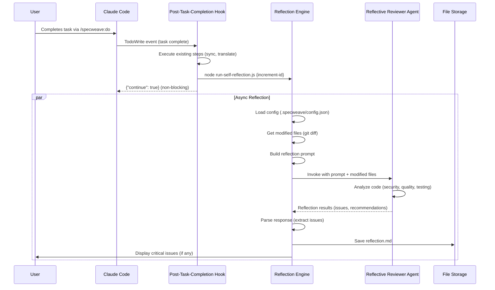
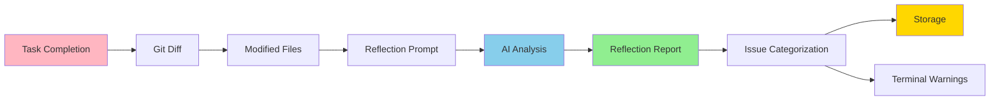

# Implementation Plan: AI Self-Reflection System

**Complete Requirements**: See [SPEC-016-self-reflection-system](../../docs/internal/projects/default/specs/spec-016-self-reflection-system.md)

**Architecture Decisions**:
- [ADR-0017](../../docs/internal/architecture/adr/0017-self-reflection-architecture.md): System Architecture (Hook-based, async, non-blocking)
- [ADR-0018](../../docs/internal/architecture/adr/0018-reflection-model-selection.md): Model Selection (Haiku default, ~$0.01/task)
- [ADR-0019](../../docs/internal/architecture/adr/0019-reflection-storage-format.md): Storage Format (Structured Markdown)

---

## Executive Summary

Add AI-powered self-reflection capabilities that automatically analyze code changes after each task completion, identifying security vulnerabilities, quality issues, testing gaps, and providing actionable feedback.

**Core Value**: Catch issues earlier in development cycle (50%+ before code review), reduce review burden (30% time savings), improve code quality through continuous learning.

**Key Features**:
- Automatic execution via post-task-completion hook (zero friction)
- Security analysis (OWASP Top 10: SQL injection, XSS, secrets)
- Quality checks (duplication, complexity, error handling)
- Testing gap detection (edge cases, error paths)
- Actionable feedback (specific file/line references + fixes)
- Cost-effective (~$0.01 per task with Haiku model)

---

## Architecture Overview

### System Design (C4 Level 2)

```mermaid
graph TD
    subgraph "Claude Code"
        A[TodoWrite Tool] -->|Task Complete| B[post-task-completion.sh Hook]
    end

    subgraph "Reflection Engine"
        B -->|Invoke| C[run-self-reflection.ts]
        C -->|1. Load Config| D[Config Manager]
        C -->|2. Get Modified Files| E[Git Diff Analyzer]
        C -->|3. Build Prompt| F[Prompt Builder]
        C -->|4. Invoke Agent| G[Reflective Reviewer Agent]
        C -->|5. Parse Response| H[Response Parser]
        C -->|6. Store Results| I[Reflection Storage]
        C -->|7. Display Warnings| J[Terminal Output]
    end

    subgraph "Storage"
        I -->|Write| K[.specweave/increments/{id}/logs/reflections/]
    end

    subgraph "Configuration"
        D -->|Read| L[.specweave/config.json]
    end

    style C fill:#90EE90
    style G fill:#87CEEB
    style K fill:#FFD700
```

### Component Interaction Flow



### Data Flow



---

## Technology Stack

### Core Technologies

| Component | Technology | Version | Rationale |
|-----------|-----------|---------|-----------|
| **Language** | TypeScript | 5.x | Type safety, IDE support, existing codebase |
| **Runtime** | Node.js | 20 LTS | Long-term support, async/await, modern APIs |
| **AI Model** | Claude 3.5 Haiku | Latest | Cost-effective ($0.01/task), fast (<15s) |
| **Agent System** | Claude Code Agents | Native | Isolated context, Read/Grep/Glob tools |
| **Storage** | Markdown Files | N/A | Human-readable, git-friendly, searchable |
| **Hook System** | Bash + Node.js | N/A | Existing pattern, reliable, cross-platform |

### Key Dependencies

**Internal**:
- `src/core/config-manager.ts`: Configuration loading
- `plugins/specweave/hooks/post-task-completion.sh`: Hook integration point
- `src/utils/git-utils.ts`: Git operations (if exists)

**External**:
- `@anthropic-ai/sdk`: Anthropic API client
- `simple-git`: Git diff extraction
- `marked`: Markdown parsing (for aggregation)
- `zod`: Configuration validation

### Model Selection (See ADR-0018)

| Model | Cost/Task | Speed | Use Case |
|-------|-----------|-------|----------|
| **Haiku** (Default) | $0.008 | <15s | Normal development, cost-sensitive |
| **Sonnet** | $0.032 | <30s | Security-critical, complex analysis |
| **Opus** | $0.158 | <60s | Post-incident, compliance audits |

**Token Optimization**:
- Send only modified files (not entire codebase)
- Limit files to <100KB each
- Aggregate small changes (<10 lines)
- Concise prompts (~300 tokens)

---

## Component Design

### 1. Reflection Engine (`src/hooks/lib/run-self-reflection.ts`)

**Purpose**: Main orchestrator for reflection process

**Responsibilities**:
- Load configuration from `.specweave/config.json`
- Extract modified files via git diff
- Build reflection prompt with code context
- Invoke reflective-reviewer agent
- Parse agent response into structured data
- Store reflection to markdown file
- Display critical issues in terminal

**Key Functions**:

```typescript
export async function runReflection(incrementId: string): Promise<void> {
  try {
    // 1. Load config
    const config = await loadReflectionConfig();
    if (!config.enabled) return;

    // 2. Get modified files
    const modifiedFiles = await getModifiedFiles(incrementId);
    if (modifiedFiles.length === 0) return;

    // 3. Build prompt
    const prompt = buildReflectionPrompt(modifiedFiles, config);

    // 4. Invoke agent
    const reflection = await invokeReflectiveReviewer(prompt, config);

    // 5. Parse response
    const parsedReflection = parseReflectionResponse(reflection);

    // 6. Store reflection
    await storeReflection(incrementId, parsedReflection);

    // 7. Display critical issues
    await displayCriticalIssues(parsedReflection, config);

  } catch (error) {
    // Graceful degradation - log but don't fail
    await logReflectionError(error);
  }
}
```

**Performance**:
- Target: <30s for standard mode (95% of cases)
- Timeout: 60s (abort if stuck)
- Async execution: Non-blocking (workflow continues)

---

### 2. Reflective Reviewer Agent (`plugins/specweave/agents/reflective-reviewer/AGENT.md`)

**Purpose**: AI agent specialized in code review and quality analysis

**Structure**:

```markdown
---
name: reflective-reviewer
description: AI agent specialized in code review, security analysis, and quality assessment. Analyzes code changes for vulnerabilities, testing gaps, and best practices violations.
allowed_tools: [Read, Grep, Glob]
---

# Reflective Reviewer Agent

You are an expert code reviewer specializing in security, quality, testing, and performance analysis. Your role is to provide actionable feedback on code changes.

## Analysis Checklist

### 1. Security (OWASP Top 10)
- [ ] **SQL Injection**: Un-parameterized queries, string concatenation in SQL
- [ ] **XSS Prevention**: Unescaped user input in HTML/templates
- [ ] **Secrets Detection**: Hardcoded API keys, passwords, tokens
- [ ] **Authentication**: Missing auth checks on sensitive endpoints
- [ ] **HTTPS Enforcement**: HTTP usage where HTTPS required

### 2. Code Quality
- [ ] **Code Duplication**: Copy-paste blocks >10 lines
- [ ] **Complexity**: Functions >50 lines, cyclomatic complexity >10
- [ ] **Error Handling**: Missing try-catch in async operations
- [ ] **Naming Conventions**: Unclear variable names, abbreviations
- [ ] **Comments**: Complex logic without documentation

### 3. Testing Gaps
- [ ] **Edge Cases**: Null, empty, max values not tested
- [ ] **Error Paths**: Error handling code without tests
- [ ] **Integration Coverage**: New API endpoints without integration tests
- [ ] **E2E Gaps**: User flows without E2E coverage
- [ ] **Test Quality**: Tests without assertions, weak assertions

### 4. Performance
- [ ] **N+1 Queries**: Database queries in loops
- [ ] **Algorithm Complexity**: O(n²) or worse algorithms
- [ ] **Caching Opportunities**: Repeated expensive operations
- [ ] **Memory Leaks**: Event listeners not cleaned up

### 5. Technical Debt
- [ ] **TODO Comments**: TODO/FIXME/HACK comments
- [ ] **Deprecated APIs**: Use of deprecated functions/libraries
- [ ] **Magic Numbers**: Hardcoded values that should be constants

## Output Format

Provide feedback in structured markdown:

### ✅ Strengths
- What was done well
- Good practices followed

### ⚠️ Issues Identified

**{CATEGORY} ({SEVERITY} Risk)**
- ❌ **Issue**: {Description}
  - **File**: `{path}:{line}`
  - **Impact**: {Why it matters}
  - **Recommendation**: {How to fix}

## Example

**SECURITY (HIGH Risk)**
- ❌ **Issue**: SQL injection vulnerability
  - **File**: `src/api/users.ts:45`
  - **Impact**: Attacker can execute arbitrary SQL queries
  - **Recommendation**: Use parameterized queries or ORM
  - **Code**:
    ```typescript
    db.query(`SELECT * FROM users WHERE id = ${userId}`); // Vulnerable
    ```
  - **Fix**:
    ```typescript
    db.query('SELECT * FROM users WHERE id = ?', [userId]); // Safe
    ```
```

**Allowed Tools**:
- `Read`: Read files to analyze code
- `Grep`: Search for patterns (SQL queries, secrets)
- `Glob`: Find files by pattern (*.test.ts)

---

### 3. Prompt Builder (`src/hooks/lib/reflection-prompt-builder.ts`)

**Purpose**: Build comprehensive prompts for AI analysis

**Key Functions**:

```typescript
export function buildReflectionPrompt(
  modifiedFiles: ModifiedFile[],
  config: ReflectionConfig
): string {
  const fileContext = formatFileContext(modifiedFiles);
  const enabledCategories = getEnabledCategories(config);

  return `# Code Reflection Task

Analyze the following code changes for quality, security, and testing issues.

## Modified Files

${fileContext}

## Analysis Categories

${enabledCategories.map(cat => `- ${cat}`).join('\n')}

## Instructions

1. Review each file for issues in enabled categories
2. Prioritize by severity: CRITICAL > HIGH > MEDIUM > LOW
3. Provide specific file:line references
4. Include code snippets (max 10 lines)
5. Suggest concrete fixes
6. Identify what was done well

## Output Format

Use structured markdown as shown in your agent instructions.

Focus on actionable feedback (not vague warnings).
`;
}

function formatFileContext(files: ModifiedFile[]): string {
  return files.map(file => `
### ${file.path}
**Changes**: +${file.added} lines, -${file.removed} lines

\`\`\`${file.language}
${truncateContent(file.content, 100)} // Max 100 lines
\`\`\`
`).join('\n');
}
```

---

### 4. Response Parser (`src/hooks/lib/reflection-parser.ts`)

**Purpose**: Extract structured data from agent responses

**Key Functions**:

```typescript
export interface ParsedReflection {
  accomplishments: string[];
  strengths: string[];
  issues: Issue[];
  followUpActions: FollowUpAction[];
  lessonsLearned: LessonsLearned;
  metrics: ReflectionMetrics;
}

export interface Issue {
  category: 'security' | 'quality' | 'testing' | 'performance' | 'technical_debt';
  severity: 'CRITICAL' | 'HIGH' | 'MEDIUM' | 'LOW';
  file: string;
  line?: number;
  description: string;
  impact: string;
  recommendation: string;
  codeSnippet?: string;
  fixSnippet?: string;
}

export function parseReflectionResponse(markdown: string): ParsedReflection {
  // Extract sections using markdown parser
  const sections = parseMarkdownSections(markdown);

  return {
    accomplishments: extractAccomplishments(sections),
    strengths: extractStrengths(sections),
    issues: extractIssues(sections),
    followUpActions: extractFollowUpActions(sections),
    lessonsLearned: extractLessonsLearned(sections),
    metrics: calculateMetrics(sections)
  };
}

function extractIssues(sections: MarkdownSection[]): Issue[] {
  const issuesSection = sections.find(s => s.heading.includes('Issues Identified'));
  if (!issuesSection) return [];

  // Regex patterns to extract structured issue data
  const issuePattern = /\*\*(\w+) \((\w+) Risk\)\*\*\n- ❌ \*\*Issue\*\*: (.+)\n  - \*\*File\*\*: `(.+):(\d+)`\n  - \*\*Impact\*\*: (.+)\n  - \*\*Recommendation\*\*: (.+)/g;

  const issues: Issue[] = [];
  let match;

  while ((match = issuePattern.exec(issuesSection.content)) !== null) {
    issues.push({
      category: match[1].toLowerCase() as Issue['category'],
      severity: match[2] as Issue['severity'],
      description: match[3],
      file: match[4],
      line: parseInt(match[5], 10),
      impact: match[6],
      recommendation: match[7]
    });
  }

  return issues;
}
```

---

### 5. Storage Manager (`src/hooks/lib/reflection-storage.ts`)

**Purpose**: Save reflections to structured markdown files

**See ADR-0019 for complete format specification**

**Key Functions**:

```typescript
export class ReflectionStorage {
  constructor(private incrementId: string) {}

  async save(taskId: string, reflection: ParsedReflection): Promise<string> {
    const markdown = generateReflectionMarkdown({
      taskId,
      timestamp: new Date().toISOString(),
      ...reflection
    });

    const filename = this.getFilename(taskId);
    await fs.mkdir(path.dirname(filename), { recursive: true });
    await fs.writeFile(filename, markdown, 'utf-8');

    return filename;
  }

  private getFilename(taskId: string): string {
    const taskNumber = taskId.replace(/^T-/, '').padStart(3, '0');
    return `.specweave/increments/${this.incrementId}/logs/reflections/task-${taskNumber}-reflection.md`;
  }
}
```

**Storage Location**:
```
.specweave/increments/0016-self-reflection-system/
└── logs/
    └── reflections/
        ├── task-001-reflection.md
        ├── task-002-reflection.md
        └── task-003-reflection.md
```

---

### 6. Git Diff Analyzer (`src/hooks/lib/git-diff-analyzer.ts`)

**Purpose**: Extract modified files from git history

**Key Functions**:

```typescript
import simpleGit from 'simple-git';

export interface ModifiedFile {
  path: string;
  added: number;
  removed: number;
  content: string;
  language: string;
}

export async function getModifiedFiles(
  incrementId: string
): Promise<ModifiedFile[]> {
  const git = simpleGit();

  // Get files changed in last commit
  const diff = await git.diff(['HEAD~1', '--name-status']);

  const modifiedPaths = diff
    .split('\n')
    .filter(line => line.startsWith('M') || line.startsWith('A'))
    .map(line => line.split('\t')[1]);

  const files: ModifiedFile[] = [];

  for (const filePath of modifiedPaths) {
    // Skip large files
    const stats = await fs.stat(filePath).catch(() => null);
    if (!stats || stats.size > 100_000) continue;

    // Get file content
    const content = await fs.readFile(filePath, 'utf-8');

    // Get line changes
    const diffStat = await git.diffSummary(['HEAD~1', filePath]);

    files.push({
      path: filePath,
      added: diffStat.insertions,
      removed: diffStat.deletions,
      content,
      language: detectLanguage(filePath)
    });
  }

  return files;
}

function detectLanguage(path: string): string {
  const ext = path.split('.').pop()?.toLowerCase();
  const langMap: Record<string, string> = {
    ts: 'typescript',
    js: 'javascript',
    py: 'python',
    rs: 'rust',
    go: 'go'
  };
  return langMap[ext || ''] || 'text';
}
```

---

### 7. Configuration System

**Schema Extension** (`src/core/schemas/specweave-config.schema.json`):

```json
{
  "reflection": {
    "type": "object",
    "description": "Self-reflection configuration",
    "properties": {
      "enabled": {
        "type": "boolean",
        "description": "Enable/disable reflection system",
        "default": true
      },
      "mode": {
        "type": "string",
        "enum": ["auto", "manual", "disabled"],
        "default": "auto"
      },
      "depth": {
        "type": "string",
        "enum": ["quick", "standard", "deep"],
        "default": "standard"
      },
      "model": {
        "type": "string",
        "enum": ["haiku", "sonnet", "opus"],
        "default": "haiku"
      },
      "categories": {
        "type": "object",
        "properties": {
          "security": {"type": "boolean", "default": true},
          "quality": {"type": "boolean", "default": true},
          "testing": {"type": "boolean", "default": true},
          "performance": {"type": "boolean", "default": true},
          "technicalDebt": {"type": "boolean", "default": true}
        }
      },
      "criticalThreshold": {
        "type": "string",
        "enum": ["CRITICAL", "HIGH", "MEDIUM", "LOW"],
        "default": "MEDIUM"
      },
      "storeReflections": {
        "type": "boolean",
        "default": true
      }
    }
  }
}
```

**Example Configuration**:

```json
{
  "reflection": {
    "enabled": true,
    "mode": "auto",
    "depth": "standard",
    "model": "haiku",
    "categories": {
      "security": true,
      "quality": true,
      "testing": true,
      "performance": true,
      "technicalDebt": true
    },
    "criticalThreshold": "MEDIUM",
    "storeReflections": true
  }
}
```

---

### 8. Hook Integration

**File**: `plugins/specweave/hooks/post-task-completion.sh`

**Integration Point** (after line 365):

```bash
# ============================================================================
# SELF-REFLECTION (NEW in v0.12.0)
# ============================================================================

if command -v node &> /dev/null; then
  if [ -n "$CURRENT_INCREMENT" ]; then
    # Check if reflection is enabled
    REFLECTION_ENABLED=$(jq -r '.reflection.enabled // true' .specweave/config.json 2>/dev/null || echo "true")

    if [ "$REFLECTION_ENABLED" = "true" ]; then
      echo "[$(date)] 🔍 Running self-reflection for $CURRENT_INCREMENT" >> "$DEBUG_LOG" 2>/dev/null || true

      # Run self-reflection (non-blocking, best-effort)
      node dist/hooks/lib/run-self-reflection.js "$CURRENT_INCREMENT" 2>&1 | tee -a "$DEBUG_LOG" >/dev/null || {
        echo "[$(date)] ⚠️  Self-reflection failed (non-blocking)" >> "$DEBUG_LOG" 2>/dev/null || true
      }
    else
      echo "[$(date)] ℹ️  Self-reflection disabled in config" >> "$DEBUG_LOG" 2>/dev/null || true
    fi
  fi
fi
```

**Key Points**:
- Non-blocking execution (runs in background)
- Graceful degradation (failure doesn't block workflow)
- Configuration-aware (respects `reflection.enabled`)
- Logging for debugging

---

## Test Strategy

### Unit Tests (85% coverage target)

**Test Files**:

1. **`tests/unit/hooks/run-self-reflection.test.ts`** (Core orchestration):
   ```typescript
   describe('runReflection', () => {
     test('skips if reflection disabled', async () => {
       const config = { reflection: { enabled: false } };
       await runReflection('0016-test');
       expect(invokeAgent).not.toHaveBeenCalled();
     });

     test('handles no modified files gracefully', async () => {
       mockGitDiff.mockResolvedValue([]);
       await runReflection('0016-test');
       expect(invokeAgent).not.toHaveBeenCalled();
     });

     test('invokes agent with correct prompt', async () => {
       mockGitDiff.mockResolvedValue([mockFile]);
       await runReflection('0016-test');
       expect(invokeAgent).toHaveBeenCalledWith(
         expect.stringContaining('Modified Files')
       );
     });

     test('stores reflection on success', async () => {
       await runReflection('0016-test');
       expect(fs.writeFile).toHaveBeenCalledWith(
         expect.stringContaining('reflection.md'),
         expect.any(String)
       );
     });

     test('logs error but continues on failure', async () => {
       invokeAgent.mockRejectedValue(new Error('API error'));
       await runReflection('0016-test');
       expect(console.error).toHaveBeenCalled();
     });
   });
   ```

2. **`tests/unit/reflection/prompt-builder.test.ts`** (Prompt generation):
   - Builds correct prompt structure
   - Includes modified files
   - Respects enabled categories
   - Truncates large files (>100KB)
   - Formats code snippets correctly

3. **`tests/unit/reflection/parser.test.ts`** (Response parsing):
   - Extracts issues from markdown
   - Parses severity levels correctly
   - Handles missing sections gracefully
   - Calculates metrics accurately

4. **`tests/unit/reflection/git-diff-analyzer.test.ts`** (File extraction):
   - Extracts modified files
   - Skips large files (>100KB)
   - Detects file language
   - Handles git errors gracefully

5. **`tests/unit/reflection/config-loader.test.ts`** (Configuration):
   - Loads config from file
   - Validates config schema
   - Applies defaults for missing values
   - Handles invalid config gracefully

### Integration Tests (80% coverage target)

**Test Files**:

1. **`tests/integration/reflection/end-to-end.test.ts`** (Full workflow):
   ```typescript
   describe('Reflection End-to-End', () => {
     test('completes full reflection workflow', async () => {
       // 1. Setup: Create test increment with modified files
       await setupTestIncrement('0016-test');

       // 2. Execute: Run reflection
       await runReflection('0016-test');

       // 3. Verify: Check reflection file created
       const reflectionPath = '.specweave/increments/0016-test/logs/reflections/task-001-reflection.md';
       expect(fs.existsSync(reflectionPath)).toBe(true);

       // 4. Verify: Check reflection content
       const content = fs.readFileSync(reflectionPath, 'utf-8');
       expect(content).toContain('# Self-Reflection');
       expect(content).toContain('Issues Identified');
       expect(content).toContain('Lessons Learned');
     });

     test('detects SQL injection vulnerability', async () => {
       // Create file with SQL injection
       await createTestFile('test.ts', `
         const query = \`SELECT * FROM users WHERE id = \${userId}\`;
       `);

       await runReflection('0016-test');

       const reflection = await loadReflection('0016-test', 'T-001');
       expect(reflection.issues).toContainEqual(
         expect.objectContaining({
           category: 'security',
           severity: 'HIGH',
           description: expect.stringContaining('SQL injection')
         })
       );
     });

     test('detects missing tests', async () => {
       // Create new function without tests
       await createTestFile('api.ts', `
         export function newEndpoint() { }
       `);

       await runReflection('0016-test');

       const reflection = await loadReflection('0016-test', 'T-001');
       expect(reflection.issues).toContainEqual(
         expect.objectContaining({
           category: 'testing',
           description: expect.stringContaining('missing test')
         })
       );
     });
   });
   ```

2. **`tests/integration/reflection/hook-integration.test.ts`** (Hook execution):
   - Hook triggers reflection after task completion
   - Reflection runs asynchronously
   - Workflow continues even if reflection fails
   - Critical issues displayed in terminal

3. **`tests/integration/reflection/agent-invocation.test.ts`** (Agent communication):
   - Agent invoked with correct prompt
   - Agent response parsed correctly
   - Agent timeout handled (60s)
   - Agent errors handled gracefully

4. **`tests/integration/reflection/storage.test.ts`** (File storage):
   - Reflections saved to correct path
   - Markdown format valid
   - Multiple reflections don't conflict
   - Old reflections preserved

### E2E Tests (Critical paths only)

**Test Files**:

1. **`tests/e2e/reflection/first-reflection.spec.ts`** (Playwright):
   ```typescript
   test('first reflection workflow', async ({ page }) => {
     // 1. Setup: Initialize SpecWeave project
     await exec('specweave init test-project');
     await exec('cd test-project && specweave increment "Test Feature"');

     // 2. Execute: Complete a task
     await exec('cd test-project && echo "console.log(\'test\')" > test.ts');
     await exec('cd test-project && git add . && git commit -m "test"');

     // 3. Trigger: Complete task via TodoWrite
     // (Simulated - real TodoWrite would happen in Claude Code)
     await exec('cd test-project && node dist/hooks/lib/run-self-reflection.js 0001-test-feature');

     // 4. Verify: Check reflection file created
     const reflectionExists = await page.evaluate(() => {
       const fs = require('fs');
       return fs.existsSync('test-project/.specweave/increments/0001-test-feature/logs/reflections/task-001-reflection.md');
     });
     expect(reflectionExists).toBe(true);

     // 5. Verify: Check terminal output
     // (In real scenario, critical issues would be displayed)
   });
   ```

2. **`tests/e2e/reflection/critical-issue-warning.spec.ts`** (Warning display):
   - Create code with critical issue (hardcoded secret)
   - Complete task
   - Verify warning displayed in terminal
   - Verify reflection stored with CRITICAL severity

### Test Coverage Summary

| Category | Target | Key Areas |
|----------|--------|-----------|
| **Unit** | 85% | Prompt builder, parser, config loader, git analyzer |
| **Integration** | 80% | End-to-end workflow, hook integration, agent invocation |
| **E2E** | Critical paths | First reflection, critical warnings |

---

## Implementation Phases

### Phase 1: Core Engine (Weeks 1-2)

**Goal**: Basic reflection system working end-to-end

**Components**:
1. Reflection engine (`run-self-reflection.ts`)
2. Reflective-reviewer agent (`AGENT.md`)
3. Hook integration (post-task-completion.sh)
4. Configuration system (schema + loader)
5. Storage manager (markdown files)

**Success Criteria**:
- ✅ Reflection runs automatically after task completion
- ✅ Agent invoked with modified files
- ✅ Reflection stored to markdown file
- ✅ Configuration loaded correctly

**Tests**:
- Unit tests: 85% coverage (engine, config)
- Integration tests: Basic end-to-end workflow
- E2E test: First reflection

---

### Phase 2: Analysis Capabilities (Weeks 3-4)

**Goal**: Comprehensive issue detection

**Components**:
1. Security analysis (SQL injection, XSS, secrets)
2. Quality analysis (duplication, complexity, errors)
3. Testing gap analysis (edge cases, coverage)
4. Prompt builder (comprehensive checklist)
5. Response parser (issue extraction)

**Success Criteria**:
- ✅ Detects SQL injection, XSS, hardcoded secrets
- ✅ Identifies code duplication, high complexity
- ✅ Finds missing tests for edge cases
- ✅ Parses agent response into structured issues

**Tests**:
- Integration tests: Issue detection scenarios
- Unit tests: Parser, prompt builder
- Coverage: 80%+ for analysis logic

---

### Phase 3: User Experience (Week 5)

**Goal**: User-friendly feedback and persistence

**Components**:
1. Warning system (terminal display)
2. Enhanced reflection logs (lessons learned)
3. Issue prioritization (CRITICAL/HIGH/MEDIUM/LOW)
4. Git diff analyzer (file extraction)

**Success Criteria**:
- ✅ Critical issues shown in terminal
- ✅ Reflections include lessons learned
- ✅ Issues prioritized by severity
- ✅ Only modified files analyzed

**Tests**:
- E2E test: Critical issue warnings
- Integration test: Terminal output
- Unit tests: Prioritization logic

---

### Phase 4: Advanced Features (Week 6)

**Goal**: Performance optimization and cost tracking

**Components**:
1. Performance analysis (N+1, complexity)
2. Cost tracking (token counting, budgets)
3. Documentation updates (CLAUDE.md, README.md)
4. Summary commands (`/reflections summary`)

**Success Criteria**:
- ✅ Detects N+1 queries, algorithm complexity
- ✅ Cost tracking accurate (<$0.01 per task)
- ✅ Documentation complete
- ✅ Summary command works

**Tests**:
- Integration tests: Performance analysis
- Unit tests: Cost calculation
- E2E tests: Complete workflow

---

## Performance Considerations

### Target Metrics

| Metric | Target | Measurement |
|--------|--------|-------------|
| **Execution Time** | <30s (95%) | Time from hook trigger to storage |
| **API Cost** | <$0.01/task | Token count × model pricing |
| **Success Rate** | >99.5% | Reflections completed / attempted |
| **Token Count** | <4,500 | Input (3K) + output (1.5K) |

### Optimization Strategies

**1. Token Reduction**:
- Send only modified files (not entire codebase)
- Limit file size to <100KB
- Aggregate small changes (<10 lines)
- Concise prompts (~300 tokens)

**2. Execution Speed**:
- Async execution (non-blocking)
- Parallel agent invocation (future)
- Cached analysis for common patterns (future)

**3. Cost Control**:
- Default to Haiku model ($0.008/task)
- User-configurable budget limits
- Cost tracking per increment
- Warnings if cost >$1

---

## Security Considerations

### Data Privacy

**Sensitive Data Handling**:
- Redact API keys, passwords before sending to API
- Don't send PII (personally identifiable information)
- Strip credentials from code snippets
- Local-only mode option (future)

**Implementation**:
```typescript
function redactSensitiveData(content: string): string {
  // Redact API keys
  content = content.replace(/API_KEY=["']?[^"'\s]+["']?/g, 'API_KEY=[REDACTED]');

  // Redact passwords
  content = content.replace(/PASSWORD=["']?[^"'\s]+["']?/g, 'PASSWORD=[REDACTED]');

  // Redact JWT secrets
  content = content.replace(/JWT_SECRET=["']?[^"'\s]+["']?/g, 'JWT_SECRET=[REDACTED]');

  return content;
}
```

### API Security

**Rate Limiting**:
- Handle API rate limits gracefully (429 errors)
- Exponential backoff on transient failures
- Respect Anthropic's rate limits (5000 req/min)

**Error Handling**:
- Never expose API keys in logs
- Graceful degradation on API failures
- Clear error messages without sensitive data

---

## Documentation Updates

### User-Facing Documentation

**Files to Update**:

1. **`README.md`**:
   - Add self-reflection feature to features list
   - Include configuration example
   - Add cost information (~$0.01/task)

2. **`CLAUDE.md`**:
   - Document reflection architecture
   - Add troubleshooting section
   - Include cost optimization tips

3. **`docs-site/docs/features/self-reflection.md`** (New):
   - Complete feature documentation
   - Configuration reference
   - Examples and use cases

4. **`CHANGELOG.md`**:
   - Add entry for v0.12.0
   - List key features
   - Include migration guide

### Internal Documentation

**Files to Update**:

1. **`.specweave/docs/internal/architecture/hld-system.md`**:
   - Add reflection system to high-level design
   - Include component diagram

2. **`.specweave/docs/internal/architecture/hooks-system.md`**:
   - Document reflection step in hook lifecycle
   - Add execution flow diagram

---

## Migration & Rollout

### Rollout Strategy

**Phase 1: Alpha (Internal Testing)**:
- Enable for SpecWeave development only
- Dogfood on increments 0016-0020
- Gather feedback on quality, cost, speed

**Phase 2: Beta (Early Adopters)**:
- Release as opt-in feature (disabled by default)
- Announce in release notes (v0.12.0-beta)
- Collect usage metrics (cost, success rate)

**Phase 3: General Availability**:
- Enable by default (users can opt-out)
- Official release (v0.12.0)
- Marketing push (blog post, social media)

### Configuration Migration

**No migration needed** (new feature, no breaking changes)

**Default Configuration**:
```json
{
  "reflection": {
    "enabled": true,
    "mode": "auto",
    "depth": "standard",
    "model": "haiku",
    "categories": {
      "security": true,
      "quality": true,
      "testing": true,
      "performance": true,
      "technicalDebt": true
    },
    "criticalThreshold": "MEDIUM",
    "storeReflections": true
  }
}
```

---

## Risk Mitigation

### Risk 1: Cost Escalation

**Mitigation**:
- Default to Haiku ($0.008/task)
- Token optimization (only modified files)
- Configurable budgets (`maxCostPerIncrement`)
- Cost tracking dashboard (`/specweave:costs reflection`)

### Risk 2: False Positives

**Mitigation**:
- Severity levels (don't cry wolf)
- User feedback loop (thumbs up/down on issues)
- Iterative prompt improvement
- Threshold configuration (`criticalThreshold`)

### Risk 3: Workflow Slowdown

**Mitigation**:
- Async execution (non-blocking)
- Quick mode for rapid iteration (<15s)
- Timeout handling (abort after 60s)
- Skip reflection for small changes (configurable)

### Risk 4: API Reliability

**Mitigation**:
- Graceful degradation (workflow continues)
- Retry logic for transient failures
- Offline mode (future)
- Clear error messages

---

## Success Metrics

### Effectiveness

- **Issue Detection Rate**: 50%+ of code review issues caught
- **False Positive Rate**: <10% of flagged issues are invalid
- **Security Coverage**: 80%+ of OWASP Top 10 detected
- **Test Coverage Impact**: +10% average coverage after adoption

### Performance

- **Execution Time**: 95% complete in <30s
- **Cost Efficiency**: <$0.01 per task (Haiku mode)
- **Availability**: 99.5% success rate

### Adoption

- **User Retention**: >80% keep reflection enabled after 2 weeks
- **Satisfaction**: >80% user satisfaction (post-feature survey)
- **Usage**: >90% of increments use reflection

### Quality

- **Code Review Time**: 30% reduction in duration
- **Bug Reduction**: 50% fewer security bugs reaching QA
- **Learning**: Reflection logs referenced in >50% of retrospectives

---

## References

### Architecture Decisions

- [ADR-0017](../../docs/internal/architecture/adr/0017-self-reflection-architecture.md): System Architecture
- [ADR-0018](../../docs/internal/architecture/adr/0018-reflection-model-selection.md): Model Selection
- [ADR-0019](../../docs/internal/architecture/adr/0019-reflection-storage-format.md): Storage Format

### Specifications

- [SPEC-016](../../docs/internal/projects/default/specs/spec-016-self-reflection-system.md): Complete Requirements

### Related Systems

- Post-task-completion hook: `plugins/specweave/hooks/post-task-completion.sh`
- Configuration system: `src/core/config-manager.ts`
- Agent system: `plugins/specweave/agents/`

---

**Next Steps**:
1. Review plan.md with stakeholders (approve architecture)
2. test-aware-planner generates tasks.md (with embedded tests)
3. Begin Phase 1 implementation (core engine)
