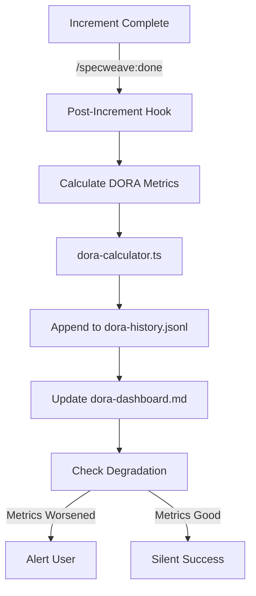
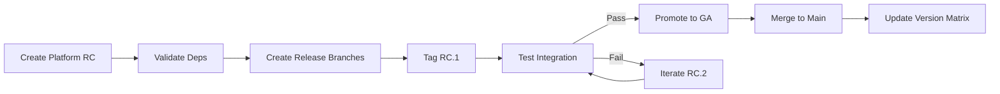

# Increment 0023: Release Management Plugin Enhancements

## Quick Overview

**CRITICAL DISCOVERY**: The `specweave-release` plugin exists with comprehensive documentation (24K lines) but is **incomplete and not registered as a Claude Code plugin**. This increment enhances it with:

1. **Claude Code Integration** - Add `plugin.json` to register as native plugin
2. **DORA Metrics Tracking** - Persistent tracking + trending + living docs dashboard
3. **Platform Release Coordination** - Multi-repo git tag synchronization with GitFlow
4. **Automated Release Branches** - GitFlow `release/*` branch automation
5. **Hooks Integration** - Post-task-completion hooks for automated metrics

**Why This Matters**: Transforms existing 80% complete plugin into production-ready release management system with enterprise-grade coordination for multi-repo platforms.

---

## Problem Statement

### Current State Analysis

**What Exists (80% Complete)**:
- ✅ Plugin structure: `plugins/specweave-release/`
- ✅ 4 skills: strategy-advisor, coordinator, version-aligner, rc-manager
- ✅ 1 agent: release-manager
- ✅ 3 commands: init, align, rc
- ✅ DORA calculator: `src/metrics/dora-calculator.ts` (TypeScript implementation)
- ✅ Documentation: README.md, IMPLEMENTATION.md (24K lines)
- ✅ Concepts: Umbrella versioning, multi-repo coordination, RC workflows

**What's Missing (20% - Critical Gaps)**:
- ❌ **No `plugin.json`** - Plugin not registered with Claude Code (can't auto-load!)
- ❌ **No DORA tracking** - Calculator exists, but no persistent storage/trending
- ❌ **No platform release commands** - No `/specweave-release:platform-release`
- ❌ **No GitFlow automation** - release/* branches mentioned but not automated
- ❌ **No multi-repo tag sync** - Can't coordinate git tags across repos
- ❌ **No hooks** - No post-task-completion integration for auto-tracking
- ❌ **No DORA dashboard** - No living docs showing DORA trends

### The User's Request

**Specific Requirements**:
1. **Multi-repo platform releases** with release candidates
2. **Git tags for versioning** entire platform (all repos together)
3. **GitFlow integration** with separate release branches
4. **DORA metrics implementation** as usable plugin skill
5. **Best practices** from SpecWeave's own development

**Example Scenario**:
```
Platform Release v3.0.0 (Umbrella):
├── frontend: v5.0.0-rc.1 → v5.0.0
├── backend: v2.9.0-rc.1 → v2.9.0
├── api-gateway: v4.0.0-rc.1 → v4.0.0
├── auth-service: v2.0.0 (unchanged)
└── shared-lib: v2.0.0-rc.1 → v2.0.0

Git Flow:
1. Create release/v3.0.0 branches in all repos
2. Tag RCs: v3.0.0-rc.1, v3.0.0-rc.2, v3.0.0-rc.3
3. Test cross-repo integration
4. Merge to main + tag v3.0.0 (final)
5. Track DORA metrics: deployment frequency, lead time, MTTR
```

---

## User Stories

### US-001: Claude Code Plugin Registration (P0 - Critical)

**As a** SpecWeave user
**I want** the release plugin to auto-load via Claude Code's plugin system
**So that** I don't have to manually invoke skills/commands

**Acceptance Criteria**:
- AC-001: `plugin.json` exists in `.claude-plugin/plugin.json` (P0, testable)
- AC-002: Plugin registers 4 skills + 1 agent + 7 commands (P0, testable)
- AC-003: Auto-loads when `specweave init` runs (P0, testable)
- AC-004: Listed in `claude plugin list --installed` (P0, testable)

**Technical Details**:
```json
{
  "name": "specweave-release",
  "version": "1.0.0",
  "description": "Enterprise release management for single-repo, multi-repo, monorepo",
  "skills": "skills",
  "agents": "agents",
  "commands": "commands"
}
```

---

### US-002: DORA Metrics Persistent Tracking (P1)

**As a** engineering leader
**I want** DORA metrics tracked persistently over time
**So that** I can see trends and measure improvement

**Acceptance Criteria**:
- AC-010: Metrics stored in JSON: `.specweave/metrics/dora-history.jsonl` (P1, testable)
- AC-011: Append-only log format (one metric snapshot per line) (P1, testable)
- AC-012: Track all 4 metrics: deployment frequency, lead time, CFR, MTTR (P1, testable)
- AC-013: Calculate trends: 7-day, 30-day, 90-day rolling averages (P1, testable)
- AC-014: Detect degradation: Alert if metrics worsen >20% (P1, testable)

**Technical Details**:
```jsonl
{"timestamp":"2025-11-01T10:00:00Z","deployFreq":{"value":8,"unit":"per-month","tier":"high"},...}
{"timestamp":"2025-11-08T10:00:00Z","deployFreq":{"value":9,"unit":"per-month","tier":"high"},...}
{"timestamp":"2025-11-15T10:00:00Z","deployFreq":{"value":7,"unit":"per-month","tier":"high"},...}
```

**Storage Format**: JSONL (JSON Lines) for append-only efficiency

---

### US-003: DORA Living Docs Dashboard (P1)

**As a** team member
**I want** a living docs DORA dashboard with trends
**So that** I can quickly see engineering performance

**Acceptance Criteria**:
- AC-020: Dashboard file: `.specweave/docs/internal/delivery/dora-dashboard.md` (P1, testable)
- AC-021: Auto-updates after every deployment/increment (P1, testable)
- AC-022: Shows current metrics + 7/30/90-day trends (P1, testable)
- AC-023: Visual indicators: ✅🟢 Elite, 🟡 High, 🟠 Medium, 🔴 Low (P1, testable)
- AC-024: Links to detailed reports and ADRs (P1, testable)

**Format**:
```markdown
# DORA Metrics Dashboard

**Last Updated**: 2025-11-11 20:00 UTC
**Overall Rating**: 🟢 **High** (3/4 metrics at High or Elite)

| Metric | Current | 7-Day Trend | 30-Day Trend | Tier |
|--------|---------|-------------|--------------|------|
| Deployment Frequency | 8/month | ↑ +12% | ↑ +5% | 🟢 High |
| Lead Time | 16h | ↓ -20% | ↓ -10% | 🟢 High |
| Change Failure Rate | 0% | → 0% | → 0% | ✅ Elite |
| MTTR | N/A | - | - | ⚪ N/A |
```

---

### US-004: Platform Release Coordination (P1)

**As a** release engineer
**I want** to coordinate releases across multiple repos
**So that** all services release together as a platform version

**Acceptance Criteria**:
- AC-030: Command `/specweave-release:platform-release create v3.0.0` (P1, testable)
- AC-031: Creates release branches in all repos: `release/v3.0.0` (P1, testable)
- AC-032: Tags RCs in all repos: `v*-rc.1` (per-repo versions) (P1, testable)
- AC-033: Validates cross-repo compatibility before tagging (P1, testable)
- AC-034: Updates version matrix in living docs (P1, testable)

**Workflow**:
```bash
# 1. Create platform RC
/specweave-release:platform-release create v3.0.0

# Creates:
# - frontend: release/v5.0.0 + tag v5.0.0-rc.1
# - backend: release/v2.9.0 + tag v2.9.0-rc.1
# - api-gateway: release/v4.0.0 + tag v4.0.0-rc.1

# 2. Test integration

# 3. Promote to GA
/specweave-release:platform-release promote v3.0.0-rc.3

# Creates final tags:
# - frontend: v5.0.0
# - backend: v2.9.0
# - api-gateway: v4.0.0
# - Updates: .specweave/docs/internal/delivery/version-matrix.md
```

---

### US-005: GitFlow Release Branch Automation (P2)

**As a** developer
**I want** automated GitFlow release branch management
**So that** I don't have to manually create/merge release branches

**Acceptance Criteria**:
- AC-040: Create `release/v*` branches from develop (P2, testable)
- AC-041: Enforce no new features in release branches (only fixes) (P2, testable)
- AC-042: Auto-merge to main + develop after release (P2, testable)
- AC-043: Delete release branches after merge (configurable) (P2, testable)
- AC-044: Hotfix workflow: branch from main tag (P2, testable)

**GitFlow Pattern**:
```
develop → release/v2.0.0 → (testing + RC iterations) → main (v2.0.0 tag)
                                                      ↓
                                                   develop (merge back)
```

---

### US-006: Multi-Repo Git Tag Synchronization (P1)

**As a** release engineer
**I want** git tags synchronized across multiple repos
**So that** platform versions are consistent

**Acceptance Criteria**:
- AC-050: Tags created atomically across all repos (P1, testable)
- AC-051: Rollback if any repo fails (P1, testable)
- AC-052: Manifest file tracks platform → service version mappings (P1, testable)
- AC-053: Validates all tags exist before declaring release complete (P1, testable)

**Manifest Format** (`.specweave/platform-releases.json`):
```json
{
  "v3.0.0": {
    "created": "2025-11-11T10:00:00Z",
    "services": {
      "frontend": "v5.0.0",
      "backend": "v2.9.0",
      "api-gateway": "v4.0.0",
      "auth-service": "v2.0.0",
      "shared-lib": "v2.0.0"
    },
    "status": "released"
  }
}
```

---

### US-007: Post-Task-Completion Hooks Integration (P1)

**As a** developer
**I want** DORA metrics tracked automatically after task completion
**So that** I don't have to manually run metrics

**Acceptance Criteria**:
- AC-060: Hook fires after `/specweave:done` completes (P1, testable)
- AC-061: Calculates DORA metrics for completed increment (P1, testable)
- AC-062: Appends to metrics history (JSONL) (P1, testable)
- AC-063: Updates living docs dashboard (P1, testable)
- AC-064: Detects degradation and alerts (P1, testable)

**Hook Location**: `plugins/specweave-release/hooks/post-increment-completion.sh`

**Logic**:
```bash
#!/bin/bash
# After /specweave:done completes:

# 1. Calculate DORA metrics
node dist/metrics/dora-calculator.js

# 2. Append to history
cat metrics/dora-latest.json >> .specweave/metrics/dora-history.jsonl

# 3. Update dashboard
# (Calls dora-dashboard-generator.ts)

# 4. Check for degradation
# (Compares current vs 30-day average)
```

---

## Technical Architecture

### Enhanced Plugin Structure

```
plugins/specweave-release/
├── .claude-plugin/
│   └── plugin.json                     # 🆕 NEW - Claude Code registration
├── skills/                              # ✅ EXISTS (4 skills)
│   ├── release-strategy-advisor/
│   ├── release-coordinator/
│   ├── version-aligner/
│   └── rc-manager/
├── agents/                              # ✅ EXISTS (1 agent)
│   └── release-manager/
├── commands/                            # ✅ EXISTS (3) + 🆕 NEW (4)
│   ├── specweave-release-init.md       # ✅ EXISTS
│   ├── specweave-release-align.md      # ✅ EXISTS
│   ├── specweave-release-rc.md         # ✅ EXISTS
│   ├── specweave-release-platform.md   # 🆕 NEW - Platform release
│   ├── specweave-release-dora.md       # 🆕 NEW - DORA dashboard
│   ├── specweave-release-gitflow.md    # 🆕 NEW - GitFlow automation
│   └── specweave-release-matrix.md     # 🆕 NEW - Version matrix
├── hooks/                               # 🆕 NEW
│   ├── hooks.json                      # Hook registration
│   └── post-increment-completion.sh    # DORA metrics tracking
├── lib/                                 # ✅ EXISTS (TypeScript utils)
│   ├── dora-tracker.ts                 # 🆕 NEW - Persistent tracking
│   ├── dashboard-generator.ts          # 🆕 NEW - Living docs dashboard
│   ├── platform-coordinator.ts         # 🆕 NEW - Multi-repo coordination
│   ├── gitflow-manager.ts              # 🆕 NEW - Release branch automation
│   └── tag-synchronizer.ts             # 🆕 NEW - Git tag sync
└── README.md                            # ✅ EXISTS (update with new features)
```

### DORA Metrics Data Flow



### Platform Release Flow



---

## Out of Scope

**Deferred to Future Increments**:
- ❌ External tool sync (GitHub Releases, Jira Fix Versions) - Use existing sync plugins
- ❌ Automated changelog generation - Use conventional commits
- ❌ Canary deployment orchestration - Use infrastructure plugins
- ❌ Rollback automation - Use infrastructure plugins
- ❌ Security scanning integration - Use security plugins

---

## Success Criteria

**Must Have (P0/P1)**:
- ✅ Plugin registered with Claude Code (auto-loads)
- ✅ DORA metrics tracked persistently (JSONL storage)
- ✅ Living docs dashboard auto-updates
- ✅ Platform release coordination works for multi-repo
- ✅ Git tags synchronized across repos
- ✅ Hooks integrated for auto-tracking

**Nice to Have (P2)**:
- ✅ GitFlow automation (release branches)
- ✅ Degradation alerts (20% threshold)
- ✅ Version matrix living docs
- ✅ Hotfix workflow automation

**Validation**:
- Manual test: Create platform release v3.0.0 across 3 test repos
- Verify: Git tags created, version matrix updated, DORA metrics tracked
- Verify: Dashboard shows trends, degradation detection works

---

## Dependencies

**Internal**:
- ✅ `src/metrics/dora-calculator.ts` - Already exists, use as-is
- ✅ Existing release plugin skills/agents - Reuse, don't rewrite
- ✅ SpecWeave hooks system - Integrate with existing post-task-completion

**External**:
- Git CLI - For tag creation, branch management
- GitHub API - For metrics calculation (already used by dora-calculator)

---

## Related Documentation

- `.specweave/docs/internal/delivery/dora-metrics.md` - Existing DORA doc
- `plugins/specweave-release/README.md` - Existing plugin README
- `plugins/specweave-release/IMPLEMENTATION.md` - Existing implementation summary
- `src/metrics/dora-calculator.ts` - Existing metrics calculator

---

## Notes

**Key Insight**: This is NOT building a plugin from scratch - it's **completing the last 20%** of an existing 80% complete plugin. Focus on:

1. **Integration** (plugin.json, hooks)
2. **Persistence** (DORA tracking, living docs dashboard)
3. **Coordination** (platform releases, git tag sync)

**Estimated Effort**: 2-3 days (vs 2-3 weeks to build from scratch)
