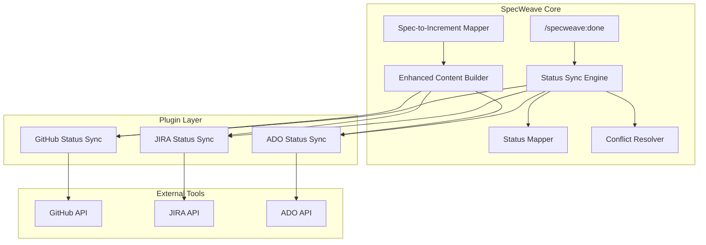

# Technical Plan: External Tool Status Synchronization

**Increment**: 0031-external-tool-status-sync
**Architect**: Claude Code
**Created**: 2025-11-12
**Status**: Design Complete

---

## System Architecture



---

## Component Design

### Phase 1: Enhanced Content Sync

#### 1.1 Enhanced Content Builder (`src/core/sync/enhanced-content-builder.ts`)

**Purpose**: Build rich external issue descriptions with full spec content.

```typescript
export interface EnhancedContent {
  title: string;           // [SPEC-ID] Feature Name
  summary: string;         // Executive summary
  userStories: UserStory[];
  tasks: TaskLink[];
  architectureDocs: string[];
  sourceLinks: {
    spec: string;
    plan: string;
    tasks: string;
  };
}

export class EnhancedContentBuilder {
  /**
   * Build rich external description from spec
   */
  public buildExternalDescription(spec: SpecContent): string {
    const sections: string[] = [];

    // 1. Executive Summary
    sections.push(this.buildSummarySection(spec));

    // 2. User Stories (collapsible in GitHub)
    sections.push(this.buildUserStoriesSection(spec));

    // 3. Linked Tasks
    sections.push(this.buildTasksSection(spec));

    // 4. Architecture References
    if (spec.architectureDocs.length > 0) {
      sections.push(this.buildArchitectureSection(spec));
    }

    // 5. Source Links
    sections.push(this.buildSourceLinksSection(spec));

    return sections.join('\n\n');
  }

  private buildUserStoriesSection(spec: SpecContent): string {
    // Use GitHub collapsible sections
    let markdown = '## User Stories\n\n';

    for (const story of spec.userStories) {
      markdown += `<details>\n`;
      markdown += `<summary><strong>US-${story.id}: ${story.title}</strong></summary>\n\n`;
      markdown += `**As a** ${story.asA}\n`;
      markdown += `**I want** ${story.iWant}\n`;
      markdown += `**So that** ${story.soThat}\n\n`;

      // Acceptance Criteria
      if (story.acceptanceCriteria.length > 0) {
        markdown += `**Acceptance Criteria**:\n`;
        story.acceptanceCriteria.forEach(ac => {
          markdown += `- [ ] **${ac.id}**: ${ac.description} (${ac.priority}, ${ac.testable ? 'testable' : 'manual'})\n`;
        });
      }

      markdown += `\n</details>\n\n`;
    }

    return markdown;
  }

  private buildTasksSection(spec: SpecContent): string {
    const mapping = spec.taskMapping; // From Spec-to-Increment Mapper

    let markdown = '## Tasks\n\n';
    markdown += `This epic includes ${mapping.tasks.length} tasks from increment ${mapping.incrementId}:\n\n`;

    for (const task of mapping.tasks) {
      const ghIssue = task.githubIssue ? ` (#${task.githubIssue})` : '';
      markdown += `- **${task.id}**: ${task.title}${ghIssue}\n`;

      // Show which user stories this task implements
      if (task.userStories.length > 0) {
        markdown += `  - Implements: ${task.userStories.join(', ')}\n`;
      }
    }

    markdown += `\nSee full task list: [tasks.md](${mapping.tasksUrl})\n`;

    return markdown;
  }
}
```

---

#### 1.2 Spec-to-Increment Mapper (`src/core/sync/spec-increment-mapper.ts`)

**Purpose**: Map permanent specs to increment tasks with traceability.

```typescript
export interface SpecIncrementMapping {
  specId: string;                    // spec-0031-external-tool-status-sync
  increments: IncrementMapping[];
}

export interface IncrementMapping {
  id: string;                        // 0031-external-tool-status-sync
  userStoryMapping: {
    [userStoryId: string]: string[]; // US-001 → [T-001, T-002, T-003]
  };
  externalLinks: {
    github?: {
      epic: number;                  // #123
      tasks: {
        [taskId: string]: number;    // T-001 → #456
      };
    };
    jira?: {
      epic: string;                  // PROJ-123
      tasks: {
        [taskId: string]: string;
      };
    };
    ado?: {
      epic: number;
      tasks: {
        [taskId: string]: number;
      };
    };
  };
}

export class SpecIncrementMapper {
  /**
   * Create mapping between spec and increment
   */
  public async createMapping(
    specPath: string,
    incrementId: string
  ): Promise<SpecIncrementMapping> {
    const spec = await this.parseSpec(specPath);
    const tasks = await this.parseTasks(incrementId);

    const mapping: SpecIncrementMapping = {
      specId: spec.id,
      increments: []
    };

    const userStoryMapping: { [key: string]: string[] } = {};

    // Extract US-XXX from task AC field
    for (const task of tasks) {
      const userStories = this.extractUserStories(task.ac);

      for (const us of userStories) {
        if (!userStoryMapping[us]) {
          userStoryMapping[us] = [];
        }
        userStoryMapping[us].push(task.id);
      }
    }

    mapping.increments.push({
      id: incrementId,
      userStoryMapping,
      externalLinks: await this.loadExternalLinks(incrementId)
    });

    return mapping;
  }

  /**
   * Query: Which increment implemented US-001?
   */
  public async findIncrementForUserStory(
    specId: string,
    userStoryId: string
  ): Promise<IncrementMapping | null> {
    const mapping = await this.loadMapping(specId);

    for (const increment of mapping.increments) {
      if (increment.userStoryMapping[userStoryId]) {
        return increment;
      }
    }

    return null;
  }
}
```

---

### Phase 2: Status Synchronization

#### 2.1 Status Mapper (`src/core/sync/status-mapper.ts`)

**Purpose**: Map SpecWeave statuses to tool-specific statuses.

```typescript
export interface StatusMapping {
  [specweaveStatus: string]: string | StatusMappingConfig;
}

export interface StatusMappingConfig {
  state: string;
  labels?: string[];  // GitHub-specific
  tags?: string[];    // ADO-specific
}

export class StatusMapper {
  private config: SyncConfig;

  constructor(config: SyncConfig) {
    this.config = config;
  }

  /**
   * Map SpecWeave status to external tool status
   */
  public mapToExternal(
    specweaveStatus: string,
    tool: 'github' | 'jira' | 'ado'
  ): StatusMappingConfig {
    const mappings = this.config.sync.statusSync.mappings[tool];

    if (!mappings) {
      throw new Error(`No status mappings configured for ${tool}`);
    }

    const mapping = mappings[specweaveStatus];

    if (!mapping) {
      throw new Error(`No mapping for status "${specweaveStatus}" in ${tool}`);
    }

    // Normalize to StatusMappingConfig
    if (typeof mapping === 'string') {
      return { state: mapping };
    }

    return mapping;
  }

  /**
   * Map external tool status to SpecWeave status (reverse lookup)
   */
  public mapFromExternal(
    externalStatus: string,
    tool: 'github' | 'jira' | 'ado'
  ): string | null {
    const mappings = this.config.sync.statusSync.mappings[tool];

    for (const [specweaveStatus, mapping] of Object.entries(mappings)) {
      const state = typeof mapping === 'string' ? mapping : mapping.state;

      if (state === externalStatus) {
        return specweaveStatus;
      }
    }

    return null; // Unknown external status
  }

  /**
   * Validate status mapping configuration
   */
  public validate(): ValidationResult {
    const errors: string[] = [];

    // Check all required SpecWeave statuses are mapped
    const requiredStatuses = ['planning', 'active', 'paused', 'completed', 'abandoned'];

    for (const tool of ['github', 'jira', 'ado'] as const) {
      const mappings = this.config.sync.statusSync.mappings[tool];

      if (!mappings) {
        errors.push(`No mappings configured for ${tool}`);
        continue;
      }

      for (const status of requiredStatuses) {
        if (!mappings[status]) {
          errors.push(`Missing mapping for "${status}" in ${tool}`);
        }
      }
    }

    return {
      valid: errors.length === 0,
      errors
    };
  }
}
```

---

#### 2.2 Status Sync Engine (`src/core/sync/status-sync-engine.ts`)

**Purpose**: Orchestrate bidirectional status synchronization.

```typescript
export interface SyncOptions {
  incrementId: string;
  newStatus: string;
  tool: 'github' | 'jira' | 'ado';
  promptUser: boolean;
  conflictResolution?: ConflictResolutionStrategy;
}

export interface SyncResult {
  success: boolean;
  action: 'synced' | 'skipped' | 'conflict' | 'error';
  externalStatus?: string;
  conflict?: StatusConflict;
  error?: string;
}

export class StatusSyncEngine {
  private mapper: StatusMapper;
  private conflictResolver: ConflictResolver;
  private plugins: {
    github: GitHubStatusSync;
    jira: JiraStatusSync;
    ado: AdoStatusSync;
  };

  /**
   * Sync status to external tool (SpecWeave → External)
   */
  public async syncToExternal(options: SyncOptions): Promise<SyncResult> {
    const { incrementId, newStatus, tool, promptUser } = options;

    // 1. Load increment metadata
    const metadata = await MetadataManager.load(incrementId);

    if (!metadata.externalLinks?.[tool]) {
      return {
        success: false,
        action: 'skipped',
        error: `No ${tool} link found for increment ${incrementId}`
      };
    }

    // 2. Map status
    const externalMapping = this.mapper.mapToExternal(newStatus, tool);

    // 3. Get current external status
    const plugin = this.plugins[tool];
    const currentExternal = await plugin.getStatus(metadata.externalLinks[tool]);

    // 4. Check if already in target state
    if (currentExternal.state === externalMapping.state) {
      return {
        success: true,
        action: 'skipped',
        externalStatus: currentExternal.state,
        error: `Already in target state: ${externalMapping.state}`
      };
    }

    // 5. Detect conflicts
    const conflict = await this.conflictResolver.detect({
      local: newStatus,
      remote: currentExternal.state,
      tool
    });

    if (conflict) {
      // Handle conflict
      const resolution = await this.conflictResolver.resolve(conflict, options.conflictResolution);

      if (resolution.action === 'abort') {
        return {
          success: false,
          action: 'conflict',
          conflict
        };
      }

      // Use resolved status
      externalMapping.state = resolution.resolvedStatus;
    }

    // 6. Prompt user (if enabled)
    if (promptUser) {
      const userChoice = await this.promptUserForStatusUpdate(
        incrementId,
        tool,
        currentExternal.state,
        externalMapping.state
      );

      if (userChoice === 'no') {
        return {
          success: true,
          action: 'skipped',
          externalStatus: currentExternal.state
        };
      }

      if (userChoice === 'custom') {
        const customStatus = await this.promptForCustomStatus(tool);
        externalMapping.state = customStatus;
      }
    }

    // 7. Update external tool
    await plugin.updateStatus(metadata.externalLinks[tool], externalMapping);

    // 8. Log sync event
    await this.logSyncEvent({
      incrementId,
      tool,
      fromStatus: currentExternal.state,
      toStatus: externalMapping.state,
      timestamp: new Date().toISOString(),
      triggeredBy: 'specweave'
    });

    return {
      success: true,
      action: 'synced',
      externalStatus: externalMapping.state
    };
  }

  /**
   * Sync status from external tool (External → SpecWeave)
   */
  public async syncFromExternal(
    incrementId: string,
    tool: 'github' | 'jira' | 'ado'
  ): Promise<SyncResult> {
    const metadata = await MetadataManager.load(incrementId);

    if (!metadata.externalLinks?.[tool]) {
      return {
        success: false,
        action: 'skipped',
        error: `No ${tool} link found`
      };
    }

    // 1. Get external status
    const plugin = this.plugins[tool];
    const externalStatus = await plugin.getStatus(metadata.externalLinks[tool]);

    // 2. Map to SpecWeave status
    const specweaveStatus = this.mapper.mapFromExternal(externalStatus.state, tool);

    if (!specweaveStatus) {
      return {
        success: false,
        action: 'error',
        error: `Unknown external status: ${externalStatus.state}`
      };
    }

    // 3. Check if already in sync
    if (metadata.status === specweaveStatus) {
      return {
        success: true,
        action: 'skipped',
        externalStatus: externalStatus.state
      };
    }

    // 4. Prompt user for SpecWeave status change
    const userChoice = await inquirer.prompt([{
      type: 'confirm',
      name: 'updateLocal',
      message: `External ${tool} issue is "${externalStatus.state}". Update SpecWeave to "${specweaveStatus}"?`,
      default: true
    }]);

    if (!userChoice.updateLocal) {
      return {
        success: true,
        action: 'skipped'
      };
    }

    // 5. Update SpecWeave status
    metadata.status = specweaveStatus;
    await MetadataManager.save(incrementId, metadata);

    return {
      success: true,
      action: 'synced',
      externalStatus: externalStatus.state
    };
  }

  /**
   * Prompt user for status update
   */
  private async promptUserForStatusUpdate(
    incrementId: string,
    tool: string,
    currentStatus: string,
    newStatus: string
  ): Promise<'yes' | 'no' | 'custom'> {
    const metadata = await MetadataManager.load(incrementId);
    const link = metadata.externalLinks?.[tool];

    console.log(chalk.blue('\n🔗 External Tool Sync:'));
    console.log(chalk.dim(`   ${tool.toUpperCase()} Link: ${link?.url || 'N/A'}`));
    console.log(chalk.dim(`   Current status: ${currentStatus}`));
    console.log(chalk.dim(`   New status: ${newStatus}\n`));

    const answer = await inquirer.prompt([{
      type: 'list',
      name: 'choice',
      message: 'Update external status?',
      choices: [
        { name: `Yes, update to "${newStatus}" (add completion comment)`, value: 'yes' },
        { name: 'No, keep current status (I\'ll update manually)', value: 'no' },
        { name: 'Custom status (specify)', value: 'custom' }
      ]
    }]);

    return answer.choice;
  }
}
```

---

#### 2.3 Conflict Resolver (`src/core/sync/conflict-resolver.ts`)

**Purpose**: Handle status conflicts gracefully.

```typescript
export type ConflictResolutionStrategy =
  | 'prompt'           // Ask user to resolve
  | 'last-write-wins'  // Use most recent timestamp
  | 'specweave-wins'   // Keep local status
  | 'external-wins';   // Use external status

export interface StatusConflict {
  incrementId: string;
  tool: string;
  localStatus: string;
  remoteStatus: string;
  localTimestamp: string;
  remoteTimestamp: string;
}

export interface ConflictResolution {
  action: 'use-local' | 'use-remote' | 'abort';
  resolvedStatus: string;
}

export class ConflictResolver {
  /**
   * Detect status conflict
   */
  public async detect(params: {
    local: string;
    remote: string;
    tool: string;
  }): Promise<StatusConflict | null> {
    const { local, remote, tool } = params;

    if (local === remote) {
      return null; // No conflict
    }

    // Load timestamps
    const metadata = await MetadataManager.load(params.incrementId);
    const remoteTimestamp = await this.getRemoteTimestamp(tool, metadata.externalLinks[tool]);

    return {
      incrementId: params.incrementId,
      tool,
      localStatus: local,
      remoteStatus: remote,
      localTimestamp: metadata.lastActivity,
      remoteTimestamp
    };
  }

  /**
   * Resolve conflict based on strategy
   */
  public async resolve(
    conflict: StatusConflict,
    strategy: ConflictResolutionStrategy = 'prompt'
  ): Promise<ConflictResolution> {
    switch (strategy) {
      case 'prompt':
        return await this.promptUserForResolution(conflict);

      case 'last-write-wins':
        return this.resolveByTimestamp(conflict);

      case 'specweave-wins':
        return {
          action: 'use-local',
          resolvedStatus: conflict.localStatus
        };

      case 'external-wins':
        return {
          action: 'use-remote',
          resolvedStatus: conflict.remoteStatus
        };

      default:
        throw new Error(`Unknown conflict resolution strategy: ${strategy}`);
    }
  }

  private async promptUserForResolution(conflict: StatusConflict): Promise<ConflictResolution> {
    console.log(chalk.yellow('\n⚠️  Status Conflict Detected\n'));
    console.log(chalk.dim(`   Increment: ${conflict.incrementId}`));
    console.log(chalk.dim(`   Tool: ${conflict.tool}\n`));

    console.log(chalk.white('   Local (SpecWeave):'));
    console.log(chalk.dim(`     Status: ${conflict.localStatus}`));
    console.log(chalk.dim(`     Updated: ${conflict.localTimestamp}\n`));

    console.log(chalk.white('   Remote (External):'));
    console.log(chalk.dim(`     Status: ${conflict.remoteStatus}`));
    console.log(chalk.dim(`     Updated: ${conflict.remoteTimestamp}\n`));

    const answer = await inquirer.prompt([{
      type: 'list',
      name: 'resolution',
      message: 'How would you like to resolve this conflict?',
      choices: [
        { name: `Use local status: "${conflict.localStatus}"`, value: 'local' },
        { name: `Use remote status: "${conflict.remoteStatus}"`, value: 'remote' },
        { name: 'Abort (I\'ll resolve manually)', value: 'abort' }
      ]
    }]);

    if (answer.resolution === 'abort') {
      return { action: 'abort', resolvedStatus: conflict.localStatus };
    }

    return {
      action: answer.resolution === 'local' ? 'use-local' : 'use-remote',
      resolvedStatus: answer.resolution === 'local' ? conflict.localStatus : conflict.remoteStatus
    };
  }
}
```

---

### Phase 3: Plugin Implementations

#### 3.1 GitHub Status Sync (`plugins/specweave-github/lib/github-status-sync.ts`)

```typescript
export class GitHubStatusSync {
  private client: GitHubClientV2;

  /**
   * Get current issue status
   */
  public async getStatus(link: ExternalLink): Promise<ExternalStatus> {
    const issue = await this.client.getIssue(link.issueNumber);

    return {
      state: issue.state,  // 'open' or 'closed'
      labels: issue.labels.map(l => l.name),
      updatedAt: issue.updated_at
    };
  }

  /**
   * Update issue status
   */
  public async updateStatus(
    link: ExternalLink,
    mapping: StatusMappingConfig
  ): Promise<void> {
    const { state, labels } = mapping;

    // Update state (open/closed)
    if (state === 'closed') {
      await this.client.closeIssue(link.issueNumber, 'Completed in SpecWeave');
    } else if (state === 'open') {
      await this.client.reopenIssue(link.issueNumber);
    }

    // Update labels
    if (labels && labels.length > 0) {
      await this.client.addLabels(link.issueNumber, labels);
    }

    // Post status update comment
    await this.postStatusComment(link.issueNumber, mapping);
  }

  private async postStatusComment(
    issueNumber: number,
    mapping: StatusMappingConfig
  ): Promise<void> {
    const comment = `
🔄 **Status Update**

SpecWeave status synced: \`${mapping.state}\`${mapping.labels ? ` (labels: ${mapping.labels.join(', ')})` : ''}

---
🤖 Auto-updated by SpecWeave
`.trim();

    await this.client.postComment(issueNumber, comment);
  }
}
```

#### 3.2 JIRA Status Sync (`plugins/specweave-jira/lib/jira-status-sync.ts`)

```typescript
export class JiraStatusSync {
  private client: JiraClient;

  /**
   * Get current issue status
   */
  public async getStatus(link: ExternalLink): Promise<ExternalStatus> {
    const issue = await this.client.getIssue(link.issueKey);

    return {
      state: issue.fields.status.name,
      updatedAt: issue.fields.updated
    };
  }

  /**
   * Update issue status (use JIRA transitions API)
   */
  public async updateStatus(
    link: ExternalLink,
    mapping: StatusMappingConfig
  ): Promise<void> {
    const { state } = mapping;

    // Get available transitions
    const transitions = await this.client.getTransitions(link.issueKey);

    // Find transition to target state
    const transition = transitions.find(t => t.to.name === state);

    if (!transition) {
      throw new Error(`No transition found to status "${state}" for ${link.issueKey}`);
    }

    // Execute transition
    await this.client.transitionIssue(link.issueKey, transition.id);

    // Post status comment
    await this.postStatusComment(link.issueKey, state);
  }

  private async postStatusComment(issueKey: string, newStatus: string): Promise<void> {
    const comment = `Status synced from SpecWeave: ${newStatus}`;
    await this.client.addComment(issueKey, comment);
  }
}
```

---

## Configuration Schema

**Update**: `.specweave/config.schema.json`

```json
{
  "sync": {
    "statusSync": {
      "enabled": {
        "type": "boolean",
        "default": true,
        "description": "Enable status synchronization"
      },
      "autoSync": {
        "type": "boolean",
        "default": true,
        "description": "Automatically sync status changes"
      },
      "promptUser": {
        "type": "boolean",
        "default": true,
        "description": "Prompt user before syncing status"
      },
      "conflictResolution": {
        "type": "string",
        "enum": ["prompt", "last-write-wins", "specweave-wins", "external-wins"],
        "default": "prompt"
      },
      "mappings": {
        "type": "object",
        "properties": {
          "github": { "$ref": "#/definitions/statusMapping" },
          "jira": { "$ref": "#/definitions/statusMapping" },
          "ado": { "$ref": "#/definitions/statusMapping" }
        }
      }
    }
  },
  "definitions": {
    "statusMapping": {
      "type": "object",
      "properties": {
        "planning": { "type": "string" },
        "active": { "type": "string" },
        "paused": { "type": "string" },
        "completed": { "type": "string" },
        "abandoned": { "type": "string" }
      },
      "required": ["planning", "active", "paused", "completed", "abandoned"]
    }
  }
}
```

---

## Test Strategy

### Unit Tests (90% coverage)

**File**: `tests/unit/sync/status-mapper.test.ts`
```typescript
describe('StatusMapper', () => {
  test('maps SpecWeave status to GitHub status', () => {
    const mapper = new StatusMapper(mockConfig);
    const result = mapper.mapToExternal('completed', 'github');
    expect(result.state).toBe('closed');
  });

  test('handles paused status with labels', () => {
    const mapper = new StatusMapper(mockConfig);
    const result = mapper.mapToExternal('paused', 'github');
    expect(result.labels).toContain('paused');
  });

  test('validates status mappings', () => {
    const mapper = new StatusMapper(invalidConfig);
    const validation = mapper.validate();
    expect(validation.valid).toBe(false);
    expect(validation.errors).toContain('Missing mapping for "completed" in github');
  });
});
```

### Integration Tests (85% coverage)

**File**: `tests/integration/sync/github-status-sync.test.ts`
```typescript
describe('GitHubStatusSync', () => {
  test('updates issue status via GitHub API', async () => {
    const sync = new GitHubStatusSync(mockClient);
    await sync.updateStatus(
      { issueNumber: 123, url: 'https://...' },
      { state: 'closed', labels: ['completed'] }
    );

    expect(mockClient.closeIssue).toHaveBeenCalledWith(123, expect.any(String));
    expect(mockClient.addLabels).toHaveBeenCalledWith(123, ['completed']);
  });

  test('handles API errors gracefully', async () => {
    mockClient.closeIssue.mockRejectedValue(new Error('Network error'));

    await expect(sync.updateStatus(...)).rejects.toThrow('Network error');
  });
});
```

### E2E Tests (100% critical paths)

**File**: `tests/e2e/status-sync.spec.ts`
```typescript
test('complete increment with status sync prompt', async ({ page }) => {
  // 1. Create increment with GitHub link
  await page.goto('http://localhost:3000');
  await createIncrement('0031-test-feature');

  // 2. Complete increment
  await page.click('button[data-testid="complete-increment"]');

  // 3. Verify prompt appears
  await expect(page.locator('text=Update external status?')).toBeVisible();

  // 4. User selects "Yes"
  await page.click('button[data-testid="sync-yes"]');

  // 5. Verify GitHub issue closed
  const issue = await getGitHubIssue(123);
  expect(issue.state).toBe('closed');

  // 6. Verify comment posted
  expect(issue.comments[0].body).toContain('SpecWeave status synced');
});
```

---

## Performance Requirements

- **Status sync**: <2 seconds per increment (GitHub API roundtrip)
- **Bulk operations**: <5 seconds for 10 increments (batched)
- **Conflict detection**: <1 second (local comparison)
- **User prompts**: Non-blocking (async with spinners)

---

## Security Considerations

1. **API Tokens**: Stored in environment variables (never in config)
2. **Rate Limiting**: Implement exponential backoff for API calls
3. **Error Handling**: Graceful degradation on network failures
4. **Audit Logging**: Log all status changes with timestamp and user

---

## Architecture Decision Records

### ADR-0031-001: Status Mapping Strategy

**Decision**: Use configurable mappings instead of hardcoded status translations.

**Rationale**:
- Different teams have different workflows
- Tool-specific states vary (GitHub: 2 states, JIRA: 10+ states, ADO: custom)
- Future-proof for new external tools
- Users can customize without code changes

**Consequences**:
- + Flexibility for diverse teams
- + Extensible for future tools
- - More configuration required
- - Validation needed to prevent invalid mappings

### ADR-0031-002: Conflict Resolution Approach

**Decision**: Prompt-first conflict resolution (default), with configurable strategies.

**Rationale**:
- User control prevents surprises
- Different conflicts need different handling
- Some users prefer automatic resolution
- Logging provides audit trail

**Consequences**:
- + User control and transparency
- + Configurable for automation
- - More user interaction required
- - Prompts can interrupt flow

### ADR-0031-003: Bidirectional Sync Implementation

**Decision**: Pull model for external → SpecWeave, push model for SpecWeave → External.

**Rationale**:
- Pull: User-initiated, prevents surprises
- Push: Automated, saves manual work
- Webhooks not feasible for all tools
- Polling introduces lag

**Consequences**:
- + Clear ownership of sync direction
- + User control for external changes
- - Polling delay for external → SpecWeave
- - No real-time sync from external tools

---

## File Structure

```
src/core/sync/
├── enhanced-content-builder.ts       # NEW
├── spec-increment-mapper.ts          # NEW
├── status-mapper.ts                  # NEW
├── status-sync-engine.ts             # NEW
├── conflict-resolver.ts              # NEW
└── types.ts                          # Enhanced types

plugins/specweave-github/lib/
├── github-status-sync.ts             # NEW
└── github-spec-content-sync.ts       # ENHANCED

plugins/specweave-jira/lib/
├── jira-status-sync.ts               # NEW
└── jira-spec-content-sync.ts         # ENHANCED

plugins/specweave-ado/lib/
├── ado-status-sync.ts                # NEW
└── ado-spec-content-sync.ts          # ENHANCED

tests/
├── unit/sync/
│   ├── status-mapper.test.ts
│   ├── conflict-resolver.test.ts
│   └── enhanced-content-builder.test.ts
├── integration/sync/
│   ├── github-status-sync.test.ts
│   ├── jira-status-sync.test.ts
│   └── ado-status-sync.test.ts
└── e2e/
    └── status-sync.spec.ts
```

---

## Migration Guide

For existing projects using external tool sync:

1. **Update config**: Add `sync.statusSync` section with default mappings
2. **No code changes**: Backwards compatible (defaults to current behavior)
3. **Opt-in**: Set `statusSync.enabled: true` to use new features
4. **Test**: Verify status mappings match your workflow

---

## Next Steps

1. ✅ Approve this technical design
2. Generate `tasks.md` with implementation tasks
3. Implement Phase 1 (Enhanced Content Sync) - 2-3 days
4. Implement Phase 2 (Status Sync) - 5-7 days
5. Implement Phase 3 (Advanced Features) - 2-3 days
6. Test with real projects
7. Document configuration options
8. Release and gather feedback

---

**Created**: 2025-11-12
**Reviewed By**: TBD
**Status**: Ready for Implementation
