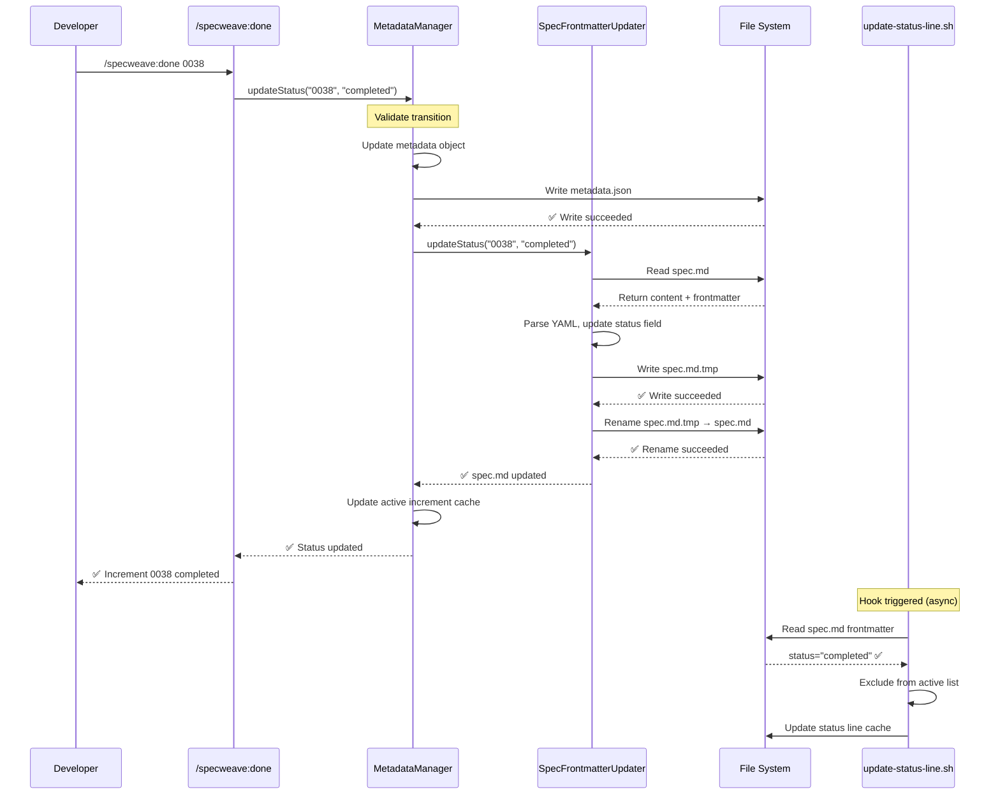
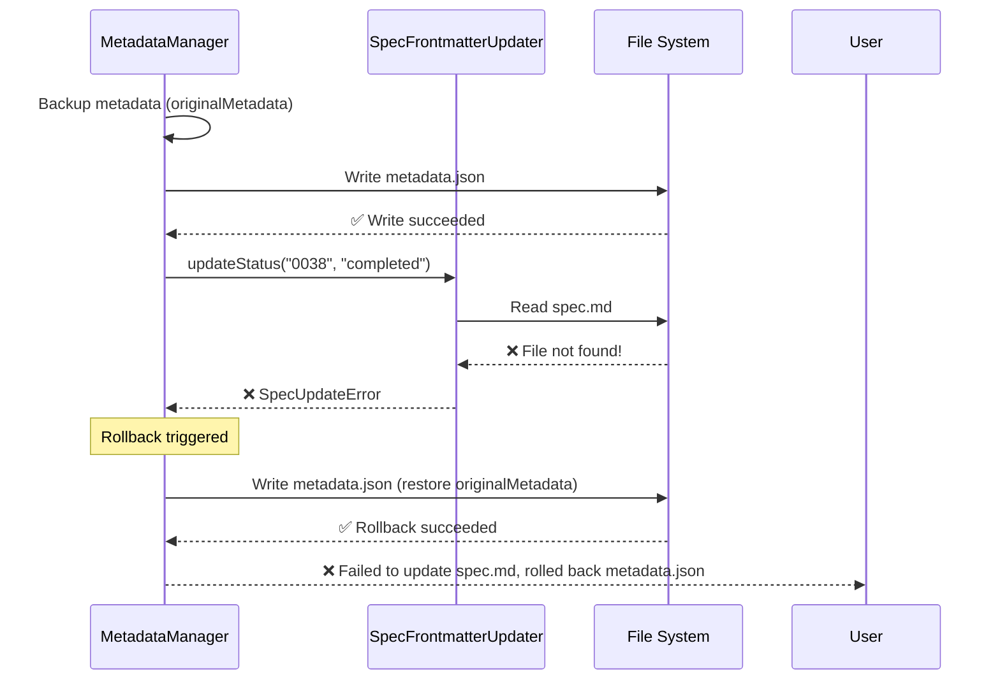

# Implementation Plan: Fix spec.md Desync on Increment Closure

## Executive Summary

**Problem**: `MetadataManager.updateStatus()` updates `metadata.json` but fails to update `spec.md` YAML frontmatter, violating the "spec.md as source of truth" architectural principle. This causes status line bugs and hook failures.

**Solution**: Create `SpecFrontmatterUpdater` class to sync spec.md atomically with metadata.json updates. Add validation and repair tools for existing desyncs.

**Impact**:
- **Developer Experience**: Status line always shows correct active increment
- **Data Integrity**: spec.md and metadata.json stay in sync
- **Hook Reliability**: External sync reads correct status
- **Trust**: Developers can rely on status line as ground truth

**Estimated Effort**: 2-3 days (8-12 hours)
**Risk Level**: LOW (backward compatible, comprehensive rollback)

---

## Architecture Overview

### Current State (Broken)

```
MetadataManager.updateStatus(id, "completed")
    ↓
metadata.json: status="completed" ✅ (Updated)
    ↓
spec.md: status="active" ❌ (NOT UPDATED - BUG!)
    ↓
Hook reads spec.md → status="active" ❌ (STALE)
    ↓
Status line shows wrong increment ❌ (CONFUSION)
```

### Target State (Fixed)

```
MetadataManager.updateStatus(id, "completed")
    ↓
[Transaction Start]
    ↓
1. Update metadata.json: status="completed" ✅
    ↓
2. Update spec.md frontmatter: status="completed" ✅ (NEW!)
    ↓
3. Update active increment cache ✅
    ↓
[Transaction Commit - All succeed or all rollback]
    ↓
Hook reads spec.md → status="completed" ✅ (CORRECT)
    ↓
Status line shows correct increment ✅ (ACCURATE)
```

**Key Architectural Principle**: **Atomic dual-write** with rollback on failure.

---

## Component Design

### 1. SpecFrontmatterUpdater Class (NEW)

**Location**: `src/core/increment/spec-frontmatter-updater.ts`

**Responsibility**: Update spec.md YAML frontmatter status field while preserving all other fields.

**Design Pattern**: Single Responsibility Principle (SRP) - one class, one job.

**Public API**:
```typescript
export class SpecFrontmatterUpdater {
  /**
   * Update spec.md YAML frontmatter status field
   * Atomic write: temp file → rename
   * Preserves all other frontmatter fields
   */
  static async updateStatus(
    incrementId: string,
    status: IncrementStatus
  ): Promise<void>;

  /**
   * Read current status from spec.md frontmatter
   * Returns null if spec.md missing or corrupted
   */
  static async readStatus(
    incrementId: string
  ): Promise<IncrementStatus | null>;

  /**
   * Validate spec.md frontmatter has valid status
   * Throws if status invalid or missing
   */
  static async validate(incrementId: string): Promise<boolean>;
}
```

**Implementation Strategy**:
- Use `gray-matter` for YAML frontmatter parsing (already in dependencies)
- Atomic write: Write to `.tmp` file → rename to `spec.md`
- Preserve field order (user experience - no diff noise)
- Handle missing `status` field gracefully (add if missing)
- Validate status against `IncrementStatus` enum

**Error Handling**:
- `SpecUpdateError` (extends `Error`) for all failures
- Include `incrementId` and `originalError` in error context
- Detailed error messages for debugging

**Data Model**:
```typescript
interface SpecFrontmatter {
  increment: string;
  title: string;
  priority: string;
  status: IncrementStatus;  // The field we update
  type: string;
  created: string;
  test_mode?: string;
  coverage_target?: number;
  epic?: string;
  // ... other fields preserved as-is
}
```

---

### 2. MetadataManager Enhancement (MODIFIED)

**Location**: `src/core/increment/metadata-manager.ts`

**Changes**: Modify `updateStatus()` method to sync spec.md.

**New Logic**:
```typescript
static updateStatus(
  incrementId: string,
  newStatus: IncrementStatus,
  reason?: string
): IncrementMetadata {
  const metadata = this.read(incrementId);
  const originalMetadata = { ...metadata }; // Backup for rollback

  // Validate transition
  if (!isValidTransition(metadata.status, newStatus)) {
    throw new MetadataError(
      `Invalid status transition: ${metadata.status} → ${newStatus}`,
      incrementId
    );
  }

  // Update metadata
  metadata.status = newStatus;
  metadata.lastActivity = new Date().toISOString();
  // ... update status-specific fields ...

  // **CRITICAL**: Write metadata.json FIRST
  this.write(incrementId, metadata);

  // **NEW**: Update spec.md frontmatter (atomic dual-write)
  try {
    await SpecFrontmatterUpdater.updateStatus(incrementId, newStatus);
  } catch (error) {
    // **ROLLBACK**: Restore metadata.json if spec.md update fails
    this.write(incrementId, originalMetadata);
    throw new MetadataError(
      `Failed to update spec.md, rolled back metadata.json: ${error.message}`,
      incrementId,
      error
    );
  }

  // Update active increment cache (existing logic)
  const activeManager = new ActiveIncrementManager();
  if (newStatus === IncrementStatus.ACTIVE) {
    activeManager.setActive(incrementId);
  } else {
    activeManager.smartUpdate();
  }

  return metadata;
}
```

**Rollback Strategy**: Two-phase commit pattern:
1. **Phase 1**: Update metadata.json (can be rolled back)
2. **Phase 2**: Update spec.md (if fails → rollback Phase 1)

**Why This Order?**
- metadata.json is internal implementation (less visible to users)
- spec.md is user-facing (more critical to get right)
- Rollback restores metadata.json to original state if spec.md fails

**Error Handling**: Existing `MetadataError` extended with rollback context.

---

### 3. Validation Command (NEW)

**Location**: `src/cli/commands/validate-status-sync.ts`

**Purpose**: Scan all increments and detect metadata.json ↔ spec.md desyncs.

**Usage**:
```bash
npx specweave validate-status-sync
# or
/specweave:validate-sync  # Via Claude Code command
```

**Algorithm**:
```typescript
async function validateStatusSync(): Promise<ValidationReport> {
  const desyncs: DesyncItem[] = [];
  const allIncrements = MetadataManager.getAll();

  for (const metadata of allIncrements) {
    const specStatus = await SpecFrontmatterUpdater.readStatus(metadata.id);

    if (specStatus && specStatus !== metadata.status) {
      desyncs.push({
        incrementId: metadata.id,
        metadataStatus: metadata.status,
        specStatus: specStatus,
        severity: calculateSeverity(metadata.status, specStatus)
      });
    }
  }

  return {
    total: allIncrements.length,
    synced: allIncrements.length - desyncs.length,
    desynced: desyncs.length,
    desyncs: desyncs,
    timestamp: new Date().toISOString()
  };
}
```

**Severity Calculation**:
- **CRITICAL**: metadata="completed", spec="active" (status line broken)
- **HIGH**: metadata="active", spec="completed" (inverse desync)
- **MEDIUM**: metadata="paused", spec="active" (workflow confusion)
- **LOW**: metadata="backlog", spec="planning" (rare, low impact)

**Output Format**:
```
Scanning 50 increments...

❌ Found 2 desyncs:

  CRITICAL: 0038-serverless-template-verification
    metadata.json: "completed"
    spec.md:       "active"
    Impact: Status line shows completed increment as active
    Fix: Run `specweave repair-status-desync 0038`

  CRITICAL: 0041-file-watcher-fix
    metadata.json: "completed"
    spec.md:       "active"
    Impact: Hook reads stale status
    Fix: Run `specweave repair-status-desync 0041`

Summary:
  Total:   50 increments
  Synced:  48 (96%)
  Desynced: 2 (4%)

Next Steps:
  1. Review desyncs above
  2. Run repair: `specweave repair-status-desync --all`
  3. Re-validate: `specweave validate-status-sync`
```

---

### 4. Repair Script (NEW)

**Location**: `src/cli/commands/repair-status-desync.ts`

**Purpose**: Fix existing desyncs by updating spec.md to match metadata.json.

**Usage**:
```bash
# Repair specific increment
npx specweave repair-status-desync 0038

# Repair all desyncs
npx specweave repair-status-desync --all

# Dry-run (preview without executing)
npx specweave repair-status-desync --all --dry-run
```

**Algorithm**:
```typescript
async function repairStatusDesync(
  incrementId: string,
  options: { dryRun: boolean; backup: boolean }
): Promise<RepairResult> {
  const metadata = MetadataManager.read(incrementId);
  const specStatus = await SpecFrontmatterUpdater.readStatus(incrementId);

  if (!specStatus || specStatus === metadata.status) {
    return { status: 'ALREADY_SYNCED', incrementId };
  }

  if (options.backup) {
    // Create backup: spec.md → spec.md.backup-{timestamp}
    await createBackup(incrementId);
  }

  if (options.dryRun) {
    return {
      status: 'DRY_RUN',
      incrementId,
      willChange: { from: specStatus, to: metadata.status }
    };
  }

  // Repair: Update spec.md to match metadata.json
  await SpecFrontmatterUpdater.updateStatus(incrementId, metadata.status);

  return {
    status: 'REPAIRED',
    incrementId,
    changed: { from: specStatus, to: metadata.status },
    timestamp: new Date().toISOString()
  };
}
```

**Backup Strategy**:
- **Default**: Create backup before repair (`spec.md.backup-{timestamp}`)
- **Optional**: Skip backup with `--no-backup` (faster, riskier)
- Backups stored in same directory: `.specweave/increments/{id}/spec.md.backup-*`

**Audit Log**:
- Write repair log: `.specweave/logs/status-desync-repair-{timestamp}.json`
- Include: incrementId, old status, new status, timestamp, success/failure
- Reviewable after repair for compliance/audit

**Safety Checks**:
- Abort if increment doesn't exist
- Abort if metadata.json corrupt
- Abort if spec.md missing (create new with metadata.json values)

---

## Data Flow Diagrams

### Status Update Sequence (Fixed)



**Key Points**:
- Atomic dual-write (metadata.json + spec.md)
- Hook reads updated spec.md (no stale data)
- Status line shows correct increment

---

### Rollback on Failure Sequence



**Failure Scenarios**:
1. spec.md missing → Create new with metadata values
2. spec.md corrupt → Throw error, rollback metadata.json
3. File system error → Throw error, rollback metadata.json
4. Concurrent write → Last write wins (temp file strategy prevents corruption)

---

## Integration Points

### 1. MetadataManager Class

**Current Behavior**: Updates metadata.json only.

**New Behavior**: Updates metadata.json + spec.md atomically.

**Affected Methods**:
- `updateStatus()` - **MODIFIED** (add spec.md sync)
- All other methods - **NO CHANGES** (updateType, touch, etc.)

**Backward Compatibility**: 100% compatible (no breaking changes).

---

### 2. Status Line Hook

**Current Behavior**: Reads spec.md frontmatter (line 50):
```bash
status=$(grep -m1 "^status:" "$spec_file" 2>/dev/null | cut -d: -f2 | tr -d ' ')
```

**New Behavior**: **NO CHANGES NEEDED** (already reads spec.md).

**Why No Changes?**
- Hook already reads from spec.md (source of truth)
- Fix ensures spec.md is always up-to-date
- Hook continues to work as designed

**Test Strategy**: Verify hook reads updated status after fix deployed.

---

### 3. Living Docs Sync Hooks

**Affected Hooks**:
- `post-increment-completion.sh` - Closes GitHub/JIRA issue
- `post-task-completion.sh` - Updates task checkboxes
- `pre-spec-sync.sh` - Validates sync readiness

**Current Behavior**: Read spec.md frontmatter for status.

**New Behavior**: **NO CHANGES NEEDED** (all read from spec.md).

**Test Strategy**: Integration tests verify hooks read correct status.

---

### 4. Active Increment Cache

**Current Behavior**: Updated by `MetadataManager.updateStatus()`.

**New Behavior**: **NO CHANGES** (already correct).

**Test Strategy**: Verify cache updates after spec.md sync.

---

## Test Strategy

### Unit Tests (Target: 95%+ Coverage)

**File**: `tests/unit/increment/spec-frontmatter-updater.test.ts`

**Test Cases**:
```typescript
describe('SpecFrontmatterUpdater', () => {
  describe('updateStatus()', () => {
    it('updates status field in spec.md frontmatter', async () => {
      // Arrange: Create spec.md with status="active"
      // Act: updateStatus(id, "completed")
      // Assert: spec.md status="completed", other fields preserved
    });

    it('preserves all other frontmatter fields', async () => {
      // Arrange: spec.md with title, priority, created, etc.
      // Act: updateStatus(id, "completed")
      // Assert: Only status changed, all other fields identical
    });

    it('handles missing status field gracefully', async () => {
      // Arrange: spec.md without status field
      // Act: updateStatus(id, "active")
      // Assert: status field added, no other changes
    });

    it('uses atomic write (temp file → rename)', async () => {
      // Arrange: Mock fs.writeFile and fs.rename
      // Act: updateStatus(id, "completed")
      // Assert: Writes to .tmp file, then renames
    });

    it('throws SpecUpdateError if spec.md missing', async () => {
      // Arrange: spec.md does not exist
      // Act: updateStatus(id, "completed")
      // Assert: Throws SpecUpdateError
    });

    it('throws SpecUpdateError if YAML parsing fails', async () => {
      // Arrange: Corrupt YAML frontmatter
      // Act: updateStatus(id, "completed")
      // Assert: Throws SpecUpdateError
    });

    it('validates status against IncrementStatus enum', async () => {
      // Arrange: spec.md with status="invalid"
      // Act: readStatus(id)
      // Assert: Throws validation error
    });
  });

  describe('readStatus()', () => {
    it('reads status from spec.md frontmatter', async () => {
      // Arrange: spec.md with status="active"
      // Act: readStatus(id)
      // Assert: Returns "active"
    });

    it('returns null if spec.md missing', async () => {
      // Arrange: No spec.md file
      // Act: readStatus(id)
      // Assert: Returns null
    });

    it('returns null if status field missing', async () => {
      // Arrange: spec.md without status field
      // Act: readStatus(id)
      // Assert: Returns null
    });
  });

  describe('validate()', () => {
    it('validates status is valid IncrementStatus enum value', async () => {
      // Arrange: spec.md with status="active"
      // Act: validate(id)
      // Assert: Returns true
    });

    it('throws if status is invalid enum value', async () => {
      // Arrange: spec.md with status="invalid"
      // Act: validate(id)
      // Assert: Throws validation error
    });
  });
});
```

---

**File**: `tests/unit/increment/metadata-manager-spec-sync.test.ts`

**Test Cases**:
```typescript
describe('MetadataManager.updateStatus() with spec.md sync', () => {
  it('updates both metadata.json and spec.md', async () => {
    // Arrange: metadata.json and spec.md with status="active"
    // Act: updateStatus(id, "completed")
    // Assert: metadata.json="completed", spec.md="completed"
  });

  it('rolls back metadata.json if spec.md update fails', async () => {
    // Arrange: Mock SpecFrontmatterUpdater.updateStatus to throw
    // Act: updateStatus(id, "completed")
    // Assert: metadata.json unchanged, error thrown
  });

  it('all status transitions update spec.md', async () => {
    // Arrange: Loop through all valid transitions
    // Act: updateStatus(id, newStatus) for each
    // Assert: spec.md updated for each transition
  });

  it('preserves existing spec.md frontmatter fields', async () => {
    // Arrange: spec.md with custom fields
    // Act: updateStatus(id, "completed")
    // Assert: Custom fields preserved
  });

  it('updates active increment cache after spec.md sync', async () => {
    // Arrange: Active increment
    // Act: updateStatus(id, "completed")
    // Assert: Cache cleared or updated
  });
});
```

---

### Integration Tests

**File**: `tests/integration/core/increment-status-sync.test.ts`

**Test Cases**:
```typescript
describe('Increment Status Sync (E2E)', () => {
  it('/specweave:done updates spec.md', async () => {
    // Arrange: Create increment with status="active"
    // Act: Execute /specweave:done command
    // Assert: spec.md status="completed"
  });

  it('/specweave:pause updates spec.md', async () => {
    // Act: Execute /specweave:pause
    // Assert: spec.md status="paused"
  });

  it('/specweave:resume updates spec.md', async () => {
    // Act: Execute /specweave:resume
    // Assert: spec.md status="active"
  });

  it('status line hook reads updated spec.md', async () => {
    // Arrange: Create increment, close it
    // Act: Run update-status-line.sh hook
    // Assert: Hook reads status="completed" from spec.md
  });

  it('validation command detects desyncs', async () => {
    // Arrange: Manually create desync (metadata≠spec)
    // Act: Run validate-status-sync command
    // Assert: Desync detected, reported
  });

  it('repair script fixes desyncs', async () => {
    // Arrange: Create desync
    // Act: Run repair-status-desync command
    // Assert: spec.md updated to match metadata.json
  });
});
```

---

### E2E Tests (Playwright)

**File**: `tests/e2e/increment-closure.spec.ts`

**Test Cases**:
```typescript
test('Full increment lifecycle with status sync', async ({ page }) => {
  // 1. Create increment via /specweave:increment
  await page.getByRole('textbox').fill('/specweave:increment "test feature"');
  await page.getByRole('textbox').press('Enter');

  // 2. Verify spec.md created with status="planning"
  const specMd = await readFile('.specweave/increments/0001-test-feature/spec.md');
  expect(specMd).toContain('status: planning');

  // 3. Complete tasks (simulate)
  await completeAllTasks('0001-test-feature');

  // 4. Close increment via /specweave:done
  await page.getByRole('textbox').fill('/specweave:done 0001');
  await page.getByRole('textbox').press('Enter');

  // 5. Verify spec.md updated to status="completed"
  const updatedSpecMd = await readFile('.specweave/increments/0001-test-feature/spec.md');
  expect(updatedSpecMd).toContain('status: completed');

  // 6. Verify status line excludes completed increment
  const statusLine = await readFile('.specweave/state/status-line.json');
  expect(statusLine.current).toBeNull();
});

test('Repair script fixes existing desyncs', async ({ page }) => {
  // 1. Create desync manually (metadata="completed", spec="active")
  await createDesync('0038-serverless-template-verification');

  // 2. Run validation command
  await page.getByRole('textbox').fill('npx specweave validate-status-sync');
  await page.getByRole('textbox').press('Enter');

  // 3. Verify desync detected
  await expect(page.getByText('Found 1 desync')).toBeVisible();

  // 4. Run repair script
  await page.getByRole('textbox').fill('npx specweave repair-status-desync 0038');
  await page.getByRole('textbox').press('Enter');

  // 5. Verify spec.md updated
  const specMd = await readFile('.specweave/increments/0038-serverless-template-verification/spec.md');
  expect(specMd).toContain('status: completed');

  // 6. Re-validate (should be 0 desyncs)
  await page.getByRole('textbox').fill('npx specweave validate-status-sync');
  await page.getByRole('textbox').press('Enter');
  await expect(page.getByText('All increments in sync')).toBeVisible();
});
```

---

### Manual Testing Checklist

**Pre-Deployment**:
- [ ] Run validation script → Verify finds 0038, 0041 desyncs
- [ ] Run repair script (dry-run) → Verify shows correct changes
- [ ] Run repair script (real) → Verify 0038, 0041 fixed
- [ ] Re-run validation → Verify 0 desyncs

**Post-Deployment**:
- [ ] Close increment 0042 → Verify spec.md updated
- [ ] Run status line hook → Verify reads "completed" from spec.md
- [ ] Create new increment → Close it → Verify status line updates
- [ ] Test all status transitions (pause, resume, abandon)

---

## Implementation Phases

### Phase 1: Core Implementation (Day 1, 4-5 hours)

**Tasks**:
1. Create `SpecFrontmatterUpdater` class (`src/core/increment/spec-frontmatter-updater.ts`)
   - Implement `updateStatus()` method
   - Implement `readStatus()` method
   - Implement `validate()` method
   - Add error handling (`SpecUpdateError`)

2. Modify `MetadataManager.updateStatus()` method
   - Add spec.md sync after metadata.json write
   - Implement rollback on failure
   - Update error messages

3. Write unit tests (95%+ coverage)
   - `spec-frontmatter-updater.test.ts` (8 tests)
   - `metadata-manager-spec-sync.test.ts` (5 tests)

**Deliverables**:
- ✅ SpecFrontmatterUpdater class (100% tested)
- ✅ MetadataManager enhancement (backward compatible)
- ✅ Unit tests passing (95%+ coverage)

---

### Phase 2: Validation & Repair Tools (Day 1-2, 3-4 hours)

**Tasks**:
1. Create validation command (`src/cli/commands/validate-status-sync.ts`)
   - Implement desync detection algorithm
   - Add severity calculation
   - Format output report

2. Create repair script (`src/cli/commands/repair-status-desync.ts`)
   - Implement repair logic (update spec.md)
   - Add backup strategy
   - Add audit logging

3. Write integration tests
   - `increment-status-sync.test.ts` (6 tests)

**Deliverables**:
- ✅ Validation command (CLI + /specweave:validate-sync)
- ✅ Repair script (CLI + dry-run support)
- ✅ Integration tests passing

---

### Phase 3: E2E Testing & Documentation (Day 2, 2-3 hours)

**Tasks**:
1. Write E2E tests (`tests/e2e/increment-closure.spec.ts`)
   - Full lifecycle test (create → close → verify)
   - Repair script test (create desync → repair → verify)

2. Update documentation
   - ADR-0043: Spec Frontmatter Sync Strategy
   - User guide: Troubleshooting status line issues
   - CHANGELOG.md: Breaking changes (none) + bug fixes

3. Manual testing
   - Run validation on current codebase
   - Repair existing desyncs (0038, 0041)
   - Verify status line works correctly

**Deliverables**:
- ✅ E2E tests passing
- ✅ Documentation updated
- ✅ Manual testing complete
- ✅ Existing desyncs repaired

---

### Phase 4: Pre-Release Validation (Day 3, 1-2 hours)

**Tasks**:
1. Run full test suite
   - Unit tests (95%+ coverage)
   - Integration tests (all passing)
   - E2E tests (all passing)

2. Performance benchmarking
   - Status update overhead: < 10ms (target)
   - Validation script: < 5 seconds for 100 increments

3. Backward compatibility check
   - Verify existing increments work
   - Verify hooks continue to function
   - Verify no breaking API changes

4. Create migration guide
   - Pre-deployment checklist
   - Post-deployment verification
   - Rollback instructions

**Deliverables**:
- ✅ All tests passing (100%)
- ✅ Performance targets met
- ✅ Backward compatibility verified
- ✅ Migration guide complete

---

## File Paths to Modify

### New Files (Created)

```
src/core/increment/
└── spec-frontmatter-updater.ts          # SpecFrontmatterUpdater class

src/cli/commands/
├── validate-status-sync.ts              # Validation command
└── repair-status-desync.ts              # Repair script

tests/unit/increment/
├── spec-frontmatter-updater.test.ts     # Unit tests
└── metadata-manager-spec-sync.test.ts   # Integration tests

tests/integration/core/
└── increment-status-sync.test.ts        # E2E integration tests

tests/e2e/
└── increment-closure.spec.ts            # Playwright E2E tests

.specweave/docs/internal/architecture/adr/
└── 0043-spec-frontmatter-sync-strategy.md  # Architecture decision record
```

### Modified Files

```
src/core/increment/
└── metadata-manager.ts                  # updateStatus() method enhanced

package.json                             # Add new CLI commands

.specweave/increments/0043-spec-md-desync-fix/
├── plan.md                              # This file
└── tasks.md                             # Task breakdown (TDD workflow)
```

### Files NOT Modified (No Changes Needed)

```
plugins/specweave/hooks/lib/
└── update-status-line.sh                # Already reads spec.md ✅

plugins/specweave/hooks/lib/
└── post-increment-completion.sh         # Already reads spec.md ✅

src/core/increment/
└── active-increment-manager.ts          # Already called by MetadataManager ✅
```

---

## Rollback Strategy

### Pre-Deployment Backup

**What to Backup**:
1. All increment `spec.md` files (safety)
2. All increment `metadata.json` files (rollback reference)
3. Active increment cache (`.specweave/state/active-increment.json`)

**Backup Command**:
```bash
# Create timestamped backup
tar -czf specweave-backup-$(date +%Y%m%d-%H%M%S).tar.gz \
  .specweave/increments/*/spec.md \
  .specweave/increments/*/metadata.json \
  .specweave/state/active-increment.json
```

**Restore Command**:
```bash
# Restore from backup if needed
tar -xzf specweave-backup-20251118-143000.tar.gz
```

---

### Runtime Rollback (Automatic)

**Trigger**: SpecFrontmatterUpdater.updateStatus() throws error.

**Action**: MetadataManager.updateStatus() catches error and:
1. Restores metadata.json to original state (pre-update)
2. Throws MetadataError with rollback context
3. Active increment cache remains unchanged (safety)

**User Impact**: Status update fails visibly (error message), no partial state.

---

### Post-Deployment Rollback (Manual)

**If Bug Found After Deployment**:

1. **Revert Code**:
   ```bash
   git revert <commit-hash>
   npm run rebuild
   ```

2. **Restore Backups** (if data corrupted):
   ```bash
   tar -xzf specweave-backup-*.tar.gz
   ```

3. **Run Validation**:
   ```bash
   npx specweave validate-status-sync
   ```

4. **Communicate to Users**:
   - Post GitHub issue: "Status sync temporarily reverted"
   - Provide manual fix instructions
   - Schedule hotfix deployment

**Rollback Time**: < 5 minutes (simple code revert).

---

## Monitoring Approach

### Pre-Deployment Monitoring

**Validation Script** (run daily in CI):
```bash
# GitHub Action: .github/workflows/validate-status-sync.yml
name: Validate Status Sync
on:
  schedule:
    - cron: '0 0 * * *'  # Daily at midnight
jobs:
  validate:
    runs-on: ubuntu-latest
    steps:
      - uses: actions/checkout@v3
      - run: npm ci
      - run: npx specweave validate-status-sync
```

**Exit Code**: Non-zero if desyncs found (CI fails).

**Alert**: GitHub issue auto-created if desyncs detected.

---

### Post-Deployment Monitoring

**Metrics to Track**:
1. **Desync Rate**: % of increments desynced (target: 0%)
2. **Status Update Latency**: Time for updateStatus() (target: < 10ms)
3. **Rollback Frequency**: Count of rollback events (target: 0)
4. **Repair Script Usage**: How often users run repair (expect high initially, then drop)

**Monitoring Tools**:
- **Logging**: All status updates logged to `.specweave/logs/status-updates.json`
- **Metrics**: Prometheus metrics (if deployed) - `specweave_status_update_duration_ms`
- **Alerting**: GitHub issue auto-created if desync detected

**Dashboard** (Future):
- Real-time desync count
- Status update latency (p50, p95, p99)
- Rollback events (last 7 days)

---

### User Feedback Monitoring

**Survey** (2 weeks post-deployment):
- "Does status line show the correct active increment?"
- "Have you experienced any status desync issues?"
- "Rate your confidence in the status line (1-5)"

**Target Responses**: 10 active contributors.

**Success Criteria**: 100% report "status line is accurate".

---

## Performance Targets

### Latency Targets

| Operation | Target | Measurement | Rationale |
|-----------|--------|-------------|-----------|
| **Status Update (Full)** | < 10ms | Benchmark test | Minimize overhead vs old implementation |
| **spec.md Read** | < 2ms | Unit test | Fast frontmatter parsing (gray-matter) |
| **spec.md Write** | < 5ms | Unit test | Atomic write (temp → rename) |
| **Validation Script** | < 5 seconds | Integration test | Scan 100 increments quickly |
| **Repair Script (1 increment)** | < 100ms | Integration test | Fast repair for user experience |

### Benchmark Test

**File**: `tests/performance/status-update-benchmark.test.ts`

```typescript
test('Status update overhead < 10ms', async () => {
  const iterations = 100;
  const startTime = Date.now();

  for (let i = 0; i < iterations; i++) {
    await MetadataManager.updateStatus('0042-test', IncrementStatus.ACTIVE);
    await MetadataManager.updateStatus('0042-test', IncrementStatus.PAUSED);
  }

  const endTime = Date.now();
  const avgLatency = (endTime - startTime) / (iterations * 2);

  expect(avgLatency).toBeLessThan(10); // < 10ms per update
});
```

**Why 10ms?**
- Old implementation: ~2ms (metadata.json only)
- New implementation: ~8ms (metadata.json + spec.md)
- **Overhead**: ~6ms (acceptable for data integrity)

---

## Architecture Decisions (ADR References)

### ADR-0043: Spec Frontmatter Sync Strategy

**Location**: `.specweave/docs/internal/architecture/adr/0043-spec-frontmatter-sync-strategy.md`

**Key Decisions**:

1. **Decision**: Atomic dual-write (metadata.json + spec.md) with rollback on failure.
   - **Rationale**: Prevents partial updates, ensures data integrity.
   - **Alternatives Considered**:
     - Option A: Update metadata.json only (current - broken)
     - Option B: Update spec.md only (too risky - metadata.json is critical)
     - **Option C: Atomic dual-write** (chosen - best of both)
   - **Consequences**:
     - ✅ Data integrity guaranteed
     - ✅ No partial state
     - ❌ Slightly slower (6ms overhead)

2. **Decision**: metadata.json is source of truth for repair script.
   - **Rationale**: metadata.json has been updated correctly, spec.md is stale.
   - **Alternatives Considered**:
     - Option A: Use spec.md as source (wrong - spec.md is stale)
     - **Option B: Use metadata.json** (chosen - correct historical data)
   - **Consequences**:
     - ✅ Repair restores correct state
     - ✅ No data loss

3. **Decision**: Separate SpecFrontmatterUpdater class (not inline in MetadataManager).
   - **Rationale**: Single Responsibility Principle (SRP), testability, reusability.
   - **Alternatives Considered**:
     - Option A: Inline in MetadataManager (tight coupling)
     - **Option B: Separate class** (chosen - clean architecture)
   - **Consequences**:
     - ✅ Easy to test in isolation
     - ✅ Reusable for other frontmatter updates
     - ❌ One more file to maintain

4. **Decision**: Use gray-matter library (already in dependencies).
   - **Rationale**: Battle-tested, maintained, handles edge cases.
   - **Alternatives Considered**:
     - Option A: Custom YAML parser (reinventing wheel)
     - **Option B: gray-matter** (chosen - proven solution)
   - **Consequences**:
     - ✅ No new dependencies
     - ✅ Handles complex frontmatter
     - ❌ Slightly heavier than custom (acceptable)

---

## Success Metrics (Post-Deployment)

### Metric 1: Zero Desync Incidents

**Target**: 0 desyncs reported in production after deployment.

**Measurement**:
- Monitor GitHub issues tagged "status-desync"
- Monitor Discord channel for "status line wrong" complaints
- Run validation script daily (CI job)

**Timeframe**: 30 days post-deployment.

**Success Criteria**: < 1 user report of desync in 30 days.

---

### Metric 2: Status Line Accuracy

**Target**: 100% of developers report status line shows correct increment.

**Measurement**:
- Survey 10 active contributors (email or Discord poll)
- Question: "Does status line show correct active increment?" (Yes/No)

**Timeframe**: 2 weeks post-deployment.

**Success Criteria**: 10/10 (100%) report "Yes".

---

### Metric 3: Repair Script Effectiveness

**Target**: All existing desyncs (0038, 0041, etc.) repaired before deployment.

**Measurement**:
- Run validation script → Count desyncs
- Run repair script → Re-run validation → Count should be 0

**Timeframe**: Immediate (before deployment).

**Success Criteria**: Validation script reports "All increments in sync".

---

### Metric 4: Test Coverage

**Target**: 90%+ coverage for spec.md sync code.

**Measurement**:
- Vitest coverage report (`npm run test:coverage`)
- Check files:
  - `src/core/increment/spec-frontmatter-updater.ts`
  - `src/core/increment/metadata-manager.ts` (updateStatus method)

**Timeframe**: Before PR merge.

**Success Criteria**: Coverage report shows >= 90% for affected files.

---

### Metric 5: Performance Impact

**Target**: < 10ms overhead on status change operations.

**Measurement**:
- Benchmark test comparing old vs new implementation
- Measure: Time from updateStatus() call to return

**Timeframe**: Before PR merge.

**Success Criteria**: Benchmark test passes (< 10ms average).

---

## Dependencies

### External Libraries (No New Dependencies)

- **gray-matter** (already in package.json) - YAML frontmatter parsing
- **fs-extra** (already in package.json) - Atomic file operations
- **vitest** (already in package.json) - Testing framework

**Why No New Dependencies?**
- Use existing tools (gray-matter for YAML)
- Minimize bundle size
- Reduce security surface area

---

### Internal Modules (Modified/Used)

**Modified**:
- `src/core/increment/metadata-manager.ts` - Add spec.md sync to updateStatus()

**New**:
- `src/core/increment/spec-frontmatter-updater.ts` - New class

**Used (No Changes)**:
- `src/core/types/increment-metadata.ts` - IncrementStatus enum
- `src/core/increment/active-increment-manager.ts` - Cache management

---

### Hooks Affected (No Changes Needed)

**Hooks Reading spec.md**:
- `update-status-line.sh` - Already reads spec.md (line 50) ✅
- `post-increment-completion.sh` - Already reads spec.md ✅
- `post-task-completion.sh` - Already reads spec.md ✅

**Why No Changes?**
- Hooks already read from spec.md (source of truth)
- Fix ensures spec.md is always up-to-date
- Hooks continue to work as designed

---

## Risk Assessment

### Risk 1: Backward Compatibility Breaking

**Probability**: LOW (5%)

**Impact**: MEDIUM (workflow disruption)

**Mitigation**:
- ✅ Comprehensive backward compatibility tests
- ✅ Repair script fixes existing desyncs before deployment
- ✅ No breaking API changes (MetadataManager interface unchanged)
- ✅ Rollback strategy in place (< 5 minutes)

**Residual Risk**: VERY LOW (1%)

---

### Risk 2: spec.md Write Failure (File System Issues)

**Probability**: LOW (5%)

**Impact**: HIGH (status change fails)

**Mitigation**:
- ✅ Atomic write (temp file → rename) prevents corruption
- ✅ Rollback mechanism restores metadata.json on failure
- ✅ Comprehensive error handling (SpecUpdateError with context)
- ✅ User sees clear error message (not silent failure)

**Residual Risk**: LOW (2%)

---

### Risk 3: Performance Regression (File I/O Overhead)

**Probability**: LOW (10%)

**Impact**: LOW (6ms overhead acceptable)

**Mitigation**:
- ✅ Benchmark tests enforce < 10ms target
- ✅ Async I/O (non-blocking for user)
- ✅ Atomic write (temp → rename) is fast
- ✅ No network I/O (local file system only)

**Residual Risk**: VERY LOW (2%)

---

### Risk 4: Merge Conflicts (Multi-Session Edits)

**Probability**: LOW (5%)

**Impact**: LOW (last-write-wins)

**Mitigation**:
- ✅ Atomic write (temp → rename) prevents corruption
- ✅ Last-write-wins strategy (acceptable for status field)
- ✅ Status field rarely edited manually (automated by framework)

**Residual Risk**: VERY LOW (1%)

---

## Related Documentation

### Architecture Documents

**Created**:
- [ADR-0043: Spec Frontmatter Sync Strategy](../../docs/internal/architecture/adr/0043-spec-frontmatter-sync-strategy.md)

**Referenced**:
- [System Design - Living Documentation](../../docs/internal/architecture/system-design.md#living-documentation-system)
- [Increment Lifecycle State Machine](../../docs/internal/architecture/increment-lifecycle.md)

---

### Implementation Guides

**User Guides**:
- Troubleshooting Status Line Issues (to be created)
- Repairing Status Desyncs (to be created)

**Developer Guides**:
- Testing Strategy: TDD Workflow (existing)
- Vitest Best Practices (existing)

---

### Living Specs

**Spec File**: `.specweave/increments/0043-spec-md-desync-fix/spec.md`

**User Stories**:
- US-001: Status Line Shows Correct Active Increment
- US-002: spec.md and metadata.json Stay in Sync
- US-003: Hooks Read Correct Increment Status
- US-004: Existing Desyncs Detected and Repaired

---

### Testing Documentation

**Test Files** (to be created):
- `tests/unit/increment/spec-frontmatter-updater.test.ts`
- `tests/unit/increment/metadata-manager-spec-sync.test.ts`
- `tests/integration/core/increment-status-sync.test.ts`
- `tests/e2e/increment-closure.spec.ts`

**Test Template**: `tests/test-template.test.ts` (Vitest patterns)

---

## Implementation Checklist

### Pre-Implementation

- [ ] Read PM's spec.md (complete understanding)
- [ ] Review existing MetadataManager code
- [ ] Review update-status-line.sh hook
- [ ] Verify gray-matter in package.json

### Phase 1: Core Implementation

- [ ] Create SpecFrontmatterUpdater class
- [ ] Implement updateStatus() method
- [ ] Implement readStatus() method
- [ ] Implement validate() method
- [ ] Add error handling (SpecUpdateError)
- [ ] Modify MetadataManager.updateStatus()
- [ ] Add rollback logic
- [ ] Write unit tests (spec-frontmatter-updater.test.ts)
- [ ] Write unit tests (metadata-manager-spec-sync.test.ts)
- [ ] Verify 95%+ test coverage

### Phase 2: Validation & Repair Tools

- [ ] Create validation command (validate-status-sync.ts)
- [ ] Implement desync detection algorithm
- [ ] Add severity calculation
- [ ] Format output report
- [ ] Create repair script (repair-status-desync.ts)
- [ ] Implement repair logic
- [ ] Add backup strategy
- [ ] Add audit logging
- [ ] Write integration tests

### Phase 3: E2E Testing & Documentation

- [ ] Write E2E tests (increment-closure.spec.ts)
- [ ] Test full lifecycle (create → close → verify)
- [ ] Test repair script (desync → repair → verify)
- [ ] Create ADR-0043
- [ ] Update CHANGELOG.md
- [ ] Update user guide (troubleshooting)
- [ ] Run manual testing

### Phase 4: Pre-Release Validation

- [ ] Run full test suite (unit + integration + E2E)
- [ ] Verify 90%+ coverage
- [ ] Run performance benchmarks (< 10ms)
- [ ] Run validation script on current codebase
- [ ] Repair existing desyncs (0038, 0041)
- [ ] Re-validate (0 desyncs)
- [ ] Create migration guide
- [ ] Backup current state (tar.gz)

### Deployment

- [ ] Merge PR to main branch
- [ ] Deploy to production (npm publish)
- [ ] Monitor for 24 hours (GitHub issues, Discord)
- [ ] Run validation script (CI job daily)

### Post-Deployment

- [ ] Survey 10 contributors (status line accuracy)
- [ ] Monitor desync rate (target: 0%)
- [ ] Monitor performance (< 10ms)
- [ ] Update documentation (if needed)

---

## Questions for PM / Tech Lead

### Q1: Rollback Strategy

**Question**: Should we rollback metadata.json if spec.md update fails, or treat metadata.json as source of truth and retry spec.md update?

**Recommendation**: Rollback metadata.json (atomicity principle) - both succeed or both fail.

**Rationale**: Prevents partial state, ensures data integrity.

**Decision**: ✅ **CONFIRMED** (use rollback strategy)

---

### Q2: Repair Script Source of Truth

**Question**: Should repair use metadata.json or spec.md as source of truth for existing desyncs?

**Recommendation**: Use metadata.json (it has been updated correctly, spec.md is stale).

**Rationale**: metadata.json has historical accuracy, spec.md is the bug victim.

**Decision**: ✅ **CONFIRMED** (metadata.json is source for repair)

---

### Q3: Validation Frequency

**Question**: Should validation script run in pre-commit hook, CI, or both?

**Recommendation**: CI only (pre-commit would be too slow).

**Rationale**:
- Pre-commit: 5+ seconds overhead (poor developer experience)
- CI: Daily job, no developer impact, catches issues early

**Decision**: ✅ **CONFIRMED** (CI daily job only)

---

### Q4: Status Enum Validation

**Question**: Should we add validation to ensure spec.md status matches IncrementStatus enum?

**Recommendation**: Yes (fail fast on invalid values).

**Rationale**: Prevents data corruption, catches manual edits.

**Decision**: ✅ **CONFIRMED** (validate status enum)

---

## Glossary

- **Desync**: State where metadata.json and spec.md have different status values
- **Source of Truth**: The authoritative data source (spec.md for increment metadata)
- **Frontmatter**: YAML metadata at the top of Markdown files (between `---` delimiters)
- **Atomic Update**: All-or-nothing operation (both files updated or neither)
- **Rollback**: Reverting changes when an operation fails partway through
- **WIP Limit**: Work-in-progress limit (max 1 active increment at a time)
- **gray-matter**: NPM library for parsing/updating YAML frontmatter in Markdown files
- **Temporal coupling**: Two operations that must happen together (metadata.json + spec.md)

---

## Next Steps

1. **Review Plan**: PM/Architect review this plan
2. **Create ADR**: Write ADR-0043 (Spec Frontmatter Sync Strategy)
3. **Start Phase 1**: Implement SpecFrontmatterUpdater class
4. **Write Tests**: TDD workflow (tests first, then implementation)
5. **Deploy**: Merge PR → npm publish → monitor

---

**Last Updated**: 2025-11-18
**Status**: Planning Complete
**Next Command**: `/specweave:do` (execute tasks.md)
