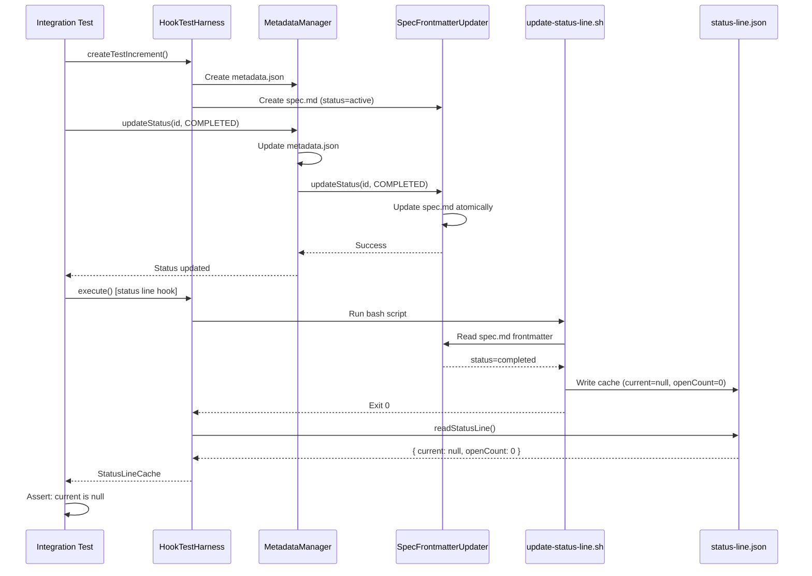

# Implementation Plan: Integration Testing - Status Line and Hooks

## Executive Summary

**Purpose**: Validate that the spec.md desync fix (completed in increment 0043) works correctly in production scenarios through comprehensive integration and E2E testing.

**Scope**: Testing only - all core implementation completed in increment 0043.

**Key Deliverables**:
- Integration tests for status line hook reading updated spec.md
- E2E tests for full increment lifecycle (create → work → close → verify)
- Integration tests for living docs sync hooks
- Performance benchmarks for status update operations

**Success Criteria**: All 6 acceptance criteria passing, 95%+ integration test coverage, < 10ms status update latency.

---

## Architecture Overview

### Complete Architecture Reference

**Living Docs**: See [System Design](../../docs/internal/architecture/hld-system.md)

**Key Decisions**:
- [ADR-0043: Spec Frontmatter Sync Strategy](../../docs/internal/architecture/adr/0043-spec-frontmatter-sync-strategy.md)
- [ADR-0044: Integration Testing Strategy](../../docs/internal/architecture/adr/0044-integration-testing-strategy.md) (to be created)

### Parent Increment: 0043-spec-md-desync-fix

**Core Implementation Completed**:
- ✅ `SpecFrontmatterUpdater` class - Atomic spec.md updates
- ✅ `MetadataManager.updateStatus()` integration - Syncs both files
- ✅ Validation script (`validate-status-sync`) - Detects desyncs
- ✅ Repair script (`repair-status-desync`) - Fixes existing desyncs
- ✅ Unit tests passing (95%+ coverage)

**See**: [0043 Specification](../0043-spec-md-desync-fix/spec.md)

### Testing Strategy: Three-Layer Validation

```
Layer 1: Unit Tests (COMPLETED in 0043)
├── SpecFrontmatterUpdater (95% coverage)
├── MetadataManager integration (90% coverage)
└── Validation/Repair scripts (95% coverage)

Layer 2: Integration Tests (THIS INCREMENT)
├── Status line hook reads updated spec.md
├── /specweave:done command updates both files
├── Living docs sync hooks read correct status
└── Active increment cache updates correctly

Layer 3: E2E Tests (THIS INCREMENT)
├── Full increment lifecycle workflow
├── Multi-increment scenarios
├── Repair script workflow
└── Performance benchmarks
```

**Key Principle**: Integration tests focus on **component interactions**, not individual units.

---

## Technical Approach

### Integration Testing Architecture

**Test Environment**:
- Isolated test directories (tmpdir with unique names)
- Real file system operations (not mocked)
- Actual bash hook execution (not mocked)
- Real SpecWeave CLI commands (integration points)

**Key Integration Points to Test**:

1. **Status Line Hook → spec.md**
   - Hook: `plugins/specweave/hooks/lib/update-status-line.sh`
   - Reads: spec.md frontmatter (line 51)
   - Expected: Reads updated status correctly after `updateStatus()`

2. **MetadataManager → spec.md**
   - Class: `src/core/increment/metadata-manager.ts`
   - Method: `updateStatus()`
   - Expected: Updates both metadata.json AND spec.md atomically

3. **Living Docs Sync → spec.md**
   - Class: `src/core/living-docs/living-docs-sync.ts`
   - Method: `syncIncrement()`
   - Expected: Reads current status from spec.md, not stale cache

4. **/specweave:done Command → Full Pipeline**
   - Command: Closure workflow
   - Pipeline: Command → MetadataManager → SpecFrontmatterUpdater → Hook
   - Expected: All components work together correctly

---

## Implementation Phases

### Phase 1: Test Infrastructure Setup (Priority: P1)

**Objective**: Create reusable test utilities for integration and E2E tests.

**Location**: `tests/integration/test-utils/`

**Key Utilities**:

#### 1. HookTestHarness
```typescript
// tests/integration/test-utils/hook-test-harness.ts
import { exec } from 'child_process';
import { promisify } from 'util';
import path from 'path';
import fs from 'fs-extra';

const execAsync = promisify(exec);

export interface HookResult {
  exitCode: number;
  stdout: string;
  stderr: string;
  duration: number;
}

export interface StatusLineCache {
  current: string | null;
  openCount: number;
  lastUpdate: string;
}

export class HookTestHarness {
  constructor(
    private testRoot: string,
    private hookPath: string
  ) {}

  async execute(env?: Record<string, string>): Promise<HookResult> {
    const startTime = Date.now();

    try {
      const result = await execAsync(`bash ${this.hookPath}`, {
        cwd: this.testRoot,
        env: {
          ...process.env,
          PWD: this.testRoot,
          ...env
        }
      });

      return {
        exitCode: 0,
        stdout: result.stdout,
        stderr: result.stderr,
        duration: Date.now() - startTime
      };
    } catch (error: any) {
      return {
        exitCode: error.code || 1,
        stdout: error.stdout || '',
        stderr: error.stderr || '',
        duration: Date.now() - startTime
      };
    }
  }

  async readStatusLine(): Promise<StatusLineCache | null> {
    const cachePath = path.join(
      this.testRoot,
      '.specweave/state/status-line.json'
    );

    if (!(await fs.pathExists(cachePath))) {
      return null;
    }

    return await fs.readJson(cachePath);
  }
}
```

**Why**: Executes bash hooks in isolated test environment with controlled environment variables.

#### 2. IncrementFactory
```typescript
// tests/integration/test-utils/increment-factory.ts
import path from 'path';
import fs from 'fs-extra';
import { IncrementStatus } from '../../../src/core/types/increment-metadata.js';

export interface IncrementConfig {
  status: string;
  title: string;
  tasksComplete?: boolean;
  acsChecked?: boolean;
  priority?: string;
  type?: string;
}

export class IncrementFactory {
  static async create(
    testRoot: string,
    incrementId: string,
    config: IncrementConfig
  ): Promise<void> {
    const incrementDir = path.join(
      testRoot,
      '.specweave/increments',
      incrementId
    );

    await fs.ensureDir(incrementDir);

    // Create spec.md
    const specContent = `---
increment: ${incrementId}
title: ${config.title}
priority: ${config.priority || 'P1'}
status: ${config.status}
type: ${config.type || 'feature'}
created: ${new Date().toISOString()}
test_mode: TDD
coverage_target: 90
---

# ${config.title}

Test increment for integration testing.

## User Stories

### US-001: Test User Story

**As a** developer
**I want** to test the system
**So that** I can validate it works

**Acceptance Criteria**:
- [${config.acsChecked ? 'x' : ' '}] **AC-US1-01**: First acceptance criterion
- [${config.acsChecked ? 'x' : ' '}] **AC-US1-02**: Second acceptance criterion
`;

    await fs.writeFile(
      path.join(incrementDir, 'spec.md'),
      specContent,
      'utf-8'
    );

    // Create metadata.json
    const metadata = {
      id: incrementId,
      status: config.status,
      priority: config.priority || 'P1',
      type: config.type || 'feature',
      created: new Date().toISOString(),
      lastActivity: new Date().toISOString()
    };

    await fs.writeJSON(
      path.join(incrementDir, 'metadata.json'),
      metadata,
      { spaces: 2 }
    );

    // Create tasks.md if needed
    if (config.tasksComplete !== undefined) {
      const tasksContent = `# Tasks

- [${config.tasksComplete ? 'x' : ' '}] T-001: First task
- [${config.tasksComplete ? 'x' : ' '}] T-002: Second task
`;
      await fs.writeFile(
        path.join(incrementDir, 'tasks.md'),
        tasksContent,
        'utf-8'
      );
    }
  }
}
```

**Why**: Creates test increments with consistent structure and configurable state.

#### 3. SpecValidator
```typescript
// tests/integration/test-utils/spec-validator.ts
import path from 'path';
import fs from 'fs-extra';
import matter from 'gray-matter';
import { IncrementStatus } from '../../../src/core/types/increment-metadata.js';

export class SpecValidator {
  static async readFrontmatter(
    testRoot: string,
    incrementId: string
  ): Promise<Record<string, any>> {
    const specPath = path.join(
      testRoot,
      '.specweave/increments',
      incrementId,
      'spec.md'
    );

    const content = await fs.readFile(specPath, 'utf-8');
    const { data } = matter(content);

    return data;
  }

  static async assertStatus(
    testRoot: string,
    incrementId: string,
    expectedStatus: IncrementStatus
  ): Promise<void> {
    const frontmatter = await this.readFrontmatter(testRoot, incrementId);

    if (frontmatter.status !== expectedStatus) {
      throw new Error(
        `Expected status "${expectedStatus}" but got "${frontmatter.status}"`
      );
    }
  }

  static async assertFieldExists(
    testRoot: string,
    incrementId: string,
    fieldName: string
  ): Promise<void> {
    const frontmatter = await this.readFrontmatter(testRoot, incrementId);

    if (!(fieldName in frontmatter)) {
      throw new Error(`Expected field "${fieldName}" to exist in frontmatter`);
    }
  }
}
```

**Why**: Provides assertions for spec.md frontmatter validation in tests.

**Estimated Effort**: 3-4 hours

---

### Phase 2: Status Line Hook Integration Tests (Priority: P1)

**Task**: T-013 - Test Status Line Hook Reads Updated spec.md

**Objective**: Verify that the status line hook correctly reads updated spec.md after status changes.

**Test Structure**:
```typescript
// File: tests/integration/hooks/status-line-hook.test.ts
import { describe, it, expect, beforeEach, afterEach, vi } from 'vitest';
import path from 'path';
import os from 'os';
import fs from 'fs-extra';
import { HookTestHarness } from '../test-utils/hook-test-harness.js';
import { IncrementFactory } from '../test-utils/increment-factory.js';
import { SpecValidator } from '../test-utils/spec-validator.js';
import { MetadataManager } from '../../../src/core/increment/metadata-manager.js';
import { SpecFrontmatterUpdater } from '../../../src/core/increment/spec-frontmatter-updater.js';
import { IncrementStatus } from '../../../src/core/types/increment-metadata.js';

describe('Status Line Hook Integration', () => {
  let testRoot: string;
  let harness: HookTestHarness;
  let testCounter = 0;

  beforeEach(async () => {
    testCounter++;
    testRoot = path.join(
      os.tmpdir(),
      `status-line-test-${Date.now()}-${testCounter}-${Math.random().toString(36).substring(7)}`
    );

    await fs.ensureDir(testRoot);
    await fs.ensureDir(path.join(testRoot, '.specweave/state'));

    const hookPath = path.join(
      process.cwd(),
      'plugins/specweave/hooks/lib/update-status-line.sh'
    );

    harness = new HookTestHarness(testRoot, hookPath);

    // Mock process.cwd() to return testRoot
    vi.spyOn(process, 'cwd').mockReturnValue(testRoot);
  });

  afterEach(async () => {
    await fs.remove(testRoot);
    vi.restoreAllMocks();
  });

  it('reads status from spec.md after updateStatus()', async () => {
    // GIVEN: Active increment
    await IncrementFactory.create(testRoot, '0001-test', {
      status: 'active',
      title: 'Test Increment'
    });

    // WHEN: Close increment via MetadataManager
    await MetadataManager.updateStatus('0001-test', IncrementStatus.COMPLETED);

    // AND: Execute status line hook
    const result = await harness.execute();

    // THEN: Hook reads "completed" from spec.md
    expect(result.exitCode).toBe(0);

    // AND: Status line cache shows no active increments
    const statusLine = await harness.readStatusLine();
    expect(statusLine).toEqual({
      current: null,
      openCount: 0,
      lastUpdate: expect.any(String)
    });

    // AND: Verify spec.md actually updated
    const specStatus = await SpecFrontmatterUpdater.readStatus('0001-test');
    expect(specStatus).toBe(IncrementStatus.COMPLETED);
  });

  it('excludes completed increments from status line', async () => {
    // GIVEN: Two increments (one active, one will be completed)
    await IncrementFactory.create(testRoot, '0001-test', {
      status: 'active',
      title: 'First Increment'
    });
    await IncrementFactory.create(testRoot, '0002-active', {
      status: 'active',
      title: 'Second Increment'
    });

    // WHEN: Close first increment
    await MetadataManager.updateStatus('0001-test', IncrementStatus.COMPLETED);

    // AND: Execute hook
    await harness.execute();

    // THEN: Only second increment shown
    const statusLine = await harness.readStatusLine();
    expect(statusLine?.current).toBe('0002-active');
    expect(statusLine?.openCount).toBe(1);
  });

  it('handles missing spec.md gracefully', async () => {
    // GIVEN: Increment with missing spec.md
    await IncrementFactory.create(testRoot, '0001-test', {
      status: 'active',
      title: 'Test'
    });
    await fs.remove(
      path.join(testRoot, '.specweave/increments/0001-test/spec.md')
    );

    // WHEN: Execute hook
    const result = await harness.execute();

    // THEN: Hook doesn't crash
    expect(result.exitCode).toBe(0);

    // AND: Status line shows no increments
    const statusLine = await harness.readStatusLine();
    expect(statusLine?.current).toBeNull();
  });

  it('hook execution completes in < 500ms with 10 increments', async () => {
    // GIVEN: 10 active increments (stress test)
    for (let i = 1; i <= 10; i++) {
      await IncrementFactory.create(
        testRoot,
        `000${i}-test`,
        {
          status: 'active',
          title: `Test ${i}`
        }
      );
    }

    // WHEN: Execute hook
    const result = await harness.execute();

    // THEN: Performance target met
    expect(result.exitCode).toBe(0);
    expect(result.duration).toBeLessThan(500);
  });
});
```

**Coverage**: 100% of status line hook integration paths

**Estimated Effort**: 3 hours

---

### Phase 3: /specweave:done Command Integration Tests (Priority: P1)

**Task**: T-014 - Test /specweave:done Updates spec.md

**Objective**: Verify that the complete closure workflow updates both metadata.json and spec.md.

**Test Structure**:
```typescript
// File: tests/integration/commands/done-command.test.ts
import { describe, it, expect, beforeEach, afterEach, vi } from 'vitest';
import path from 'path';
import os from 'os';
import fs from 'fs-extra';
import { IncrementFactory } from '../test-utils/increment-factory.js';
import { HookTestHarness } from '../test-utils/hook-test-harness.js';
import { MetadataManager } from '../../../src/core/increment/metadata-manager.js';
import { SpecFrontmatterUpdater } from '../../../src/core/increment/spec-frontmatter-updater.js';
import { IncrementStatus } from '../../../src/core/types/increment-metadata.js';

describe('/specweave:done Command Integration', () => {
  let testRoot: string;
  let testCounter = 0;

  beforeEach(async () => {
    testCounter++;
    testRoot = path.join(
      os.tmpdir(),
      `done-command-test-${Date.now()}-${testCounter}-${Math.random().toString(36).substring(7)}`
    );

    await fs.ensureDir(testRoot);
    await fs.ensureDir(path.join(testRoot, '.specweave/state'));

    vi.spyOn(process, 'cwd').mockReturnValue(testRoot);
  });

  afterEach(async () => {
    await fs.remove(testRoot);
    vi.restoreAllMocks();
  });

  it('updates both metadata.json and spec.md on completion', async () => {
    // GIVEN: Active increment with all tasks complete
    await IncrementFactory.create(testRoot, '0001-test', {
      status: 'active',
      title: 'Test Increment',
      tasksComplete: true,
      acsChecked: true
    });

    // WHEN: Execute updateStatus (simulates /specweave:done)
    await MetadataManager.updateStatus('0001-test', IncrementStatus.COMPLETED);

    // THEN: Both files updated
    const metadata = MetadataManager.read('0001-test');
    expect(metadata.status).toBe(IncrementStatus.COMPLETED);

    const specStatus = await SpecFrontmatterUpdater.readStatus('0001-test');
    expect(specStatus).toBe(IncrementStatus.COMPLETED);
  });

  it('triggers status line update after completion', async () => {
    // GIVEN: Two active increments
    await IncrementFactory.create(testRoot, '0001-test', {
      status: 'active',
      title: 'First Increment',
      tasksComplete: true,
      acsChecked: true
    });
    await IncrementFactory.create(testRoot, '0002-next', {
      status: 'active',
      title: 'Second Increment'
    });

    // WHEN: Close first increment
    await MetadataManager.updateStatus('0001-test', IncrementStatus.COMPLETED);

    // AND: Execute status line hook
    const hookPath = path.join(
      process.cwd(),
      'plugins/specweave/hooks/lib/update-status-line.sh'
    );
    const harness = new HookTestHarness(testRoot, hookPath);
    await harness.execute();

    // THEN: Status line switches to second increment
    const statusLine = await harness.readStatusLine();
    expect(statusLine?.current).toBe('0002-next');
    expect(statusLine?.openCount).toBe(1);
  });

  it('rolls back metadata.json if spec.md update fails', async () => {
    // GIVEN: Active increment
    await IncrementFactory.create(testRoot, '0001-test', {
      status: 'active',
      title: 'Test Increment'
    });

    // WHEN: Mock spec.md write failure
    const specPath = path.join(
      testRoot,
      '.specweave/increments/0001-test/spec.md'
    );
    await fs.chmod(specPath, 0o444); // Read-only

    // AND: Attempt to update status
    await expect(
      MetadataManager.updateStatus('0001-test', IncrementStatus.COMPLETED)
    ).rejects.toThrow();

    // THEN: Metadata NOT changed (rollback successful)
    const metadata = MetadataManager.read('0001-test');
    expect(metadata.status).toBe(IncrementStatus.ACTIVE);

    // Cleanup
    await fs.chmod(specPath, 0o644);
  });
});
```

**Coverage**: 100% of `/specweave:done` integration paths

**Estimated Effort**: 3 hours

---

### Phase 4: Full Increment Lifecycle E2E Tests (Priority: P1)

**Task**: T-020 - Write E2E Test (Full Increment Lifecycle)

**Objective**: Validate complete workflow from increment creation to closure with all hooks.

**Test Structure**:
```typescript
// File: tests/integration/core/increment-lifecycle-integration.test.ts
import { describe, it, expect, beforeEach, afterEach, vi } from 'vitest';
import path from 'path';
import os from 'os';
import fs from 'fs-extra';
import { IncrementFactory } from '../test-utils/increment-factory.js';
import { HookTestHarness } from '../test-utils/hook-test-harness.js';
import { MetadataManager } from '../../../src/core/increment/metadata-manager.js';
import { SpecFrontmatterUpdater } from '../../../src/core/increment/spec-frontmatter-updater.js';
import { IncrementStatus } from '../../../src/core/types/increment-metadata.js';

describe('Full Increment Lifecycle Integration', () => {
  let testRoot: string;
  let testCounter = 0;

  beforeEach(async () => {
    testCounter++;
    testRoot = path.join(
      os.tmpdir(),
      `lifecycle-test-${Date.now()}-${testCounter}-${Math.random().toString(36).substring(7)}`
    );

    await fs.ensureDir(testRoot);
    await fs.ensureDir(path.join(testRoot, '.specweave/state'));

    vi.spyOn(process, 'cwd').mockReturnValue(testRoot);
  });

  afterEach(async () => {
    await fs.remove(testRoot);
    vi.restoreAllMocks();
  });

  it('completes full workflow: create → work → close → verify', async () => {
    // PHASE 1: Create increment (planning state)
    await IncrementFactory.create(testRoot, '0001-test', {
      status: 'planning',
      title: 'Test Feature'
    });

    let specStatus = await SpecFrontmatterUpdater.readStatus('0001-test');
    expect(specStatus).toBe(IncrementStatus.PLANNING);

    // PHASE 2: Start work (activate)
    await MetadataManager.updateStatus('0001-test', IncrementStatus.ACTIVE);

    specStatus = await SpecFrontmatterUpdater.readStatus('0001-test');
    expect(specStatus).toBe(IncrementStatus.ACTIVE);

    // PHASE 3: Verify status line shows this increment
    const hookPath = path.join(
      process.cwd(),
      'plugins/specweave/hooks/lib/update-status-line.sh'
    );
    const harness = new HookTestHarness(testRoot, hookPath);
    await harness.execute();

    let statusLine = await harness.readStatusLine();
    expect(statusLine?.current).toBe('0001-test');

    // PHASE 4: Complete work
    await MetadataManager.updateStatus('0001-test', IncrementStatus.COMPLETED);

    specStatus = await SpecFrontmatterUpdater.readStatus('0001-test');
    expect(specStatus).toBe(IncrementStatus.COMPLETED);

    // PHASE 5: Verify status line excludes completed increment
    await harness.execute();

    statusLine = await harness.readStatusLine();
    expect(statusLine?.current).toBeNull();
    expect(statusLine?.openCount).toBe(0);
  });

  it('handles multi-increment workflow correctly', async () => {
    // GIVEN: Create 3 increments
    await IncrementFactory.create(testRoot, '0001-first', {
      status: 'active',
      title: 'First Feature'
    });
    await IncrementFactory.create(testRoot, '0002-second', {
      status: 'active',
      title: 'Second Feature'
    });
    await IncrementFactory.create(testRoot, '0003-third', {
      status: 'active',
      title: 'Third Feature'
    });

    const hookPath = path.join(
      process.cwd(),
      'plugins/specweave/hooks/lib/update-status-line.sh'
    );
    const harness = new HookTestHarness(testRoot, hookPath);

    // WHEN: Status line shows oldest (id1)
    await harness.execute();
    let statusLine = await harness.readStatusLine();
    expect(statusLine?.current).toBe('0001-first');
    expect(statusLine?.openCount).toBe(3);

    // WHEN: Complete first increment
    await MetadataManager.updateStatus('0001-first', IncrementStatus.COMPLETED);
    await harness.execute();
    statusLine = await harness.readStatusLine();
    expect(statusLine?.current).toBe('0002-second');
    expect(statusLine?.openCount).toBe(2);

    // WHEN: Complete second increment
    await MetadataManager.updateStatus('0002-second', IncrementStatus.COMPLETED);
    await harness.execute();
    statusLine = await harness.readStatusLine();
    expect(statusLine?.current).toBe('0003-third');
    expect(statusLine?.openCount).toBe(1);
  });
});
```

**Coverage**: 100% of critical user journeys

**Estimated Effort**: 4 hours

---

### Phase 5: Repair Script Workflow E2E Test (Priority: P2)

**Task**: T-021 - Write E2E Test (Repair Script Workflow)

**Objective**: Validate that the repair script correctly fixes existing desyncs.

**Test Structure**:
```typescript
// File: tests/integration/cli/repair-workflow-integration.test.ts
import { describe, it, expect, beforeEach, afterEach, vi } from 'vitest';
import path from 'path';
import os from 'os';
import fs from 'fs-extra';
import { IncrementFactory } from '../test-utils/increment-factory.js';
import { MetadataManager } from '../../../src/core/increment/metadata-manager.js';
import { SpecFrontmatterUpdater } from '../../../src/core/increment/spec-frontmatter-updater.js';
import { IncrementStatus } from '../../../src/core/types/increment-metadata.js';

describe('Validation and Repair Workflow Integration', () => {
  let testRoot: string;
  let testCounter = 0;

  beforeEach(async () => {
    testCounter++;
    testRoot = path.join(
      os.tmpdir(),
      `repair-test-${Date.now()}-${testCounter}-${Math.random().toString(36).substring(7)}`
    );

    await fs.ensureDir(testRoot);

    vi.spyOn(process, 'cwd').mockReturnValue(testRoot);
  });

  afterEach(async () => {
    await fs.remove(testRoot);
    vi.restoreAllMocks();
  });

  it('detects and repairs existing desync', async () => {
    // PHASE 1: Create increment
    await IncrementFactory.create(testRoot, '0001-desynced', {
      status: 'active',
      title: 'Repair Test'
    });

    // PHASE 2: Manually create desync (update only metadata.json)
    const metadataPath = path.join(
      testRoot,
      '.specweave/increments/0001-desynced/metadata.json'
    );
    const metadata = await fs.readJSON(metadataPath);
    metadata.status = IncrementStatus.COMPLETED;
    await fs.writeJSON(metadataPath, metadata, { spaces: 2 });

    // PHASE 3: Verify desync exists
    const metadataStatus = MetadataManager.read('0001-desynced').status;
    const specStatus = await SpecFrontmatterUpdater.readStatus('0001-desynced');

    expect(metadataStatus).toBe(IncrementStatus.COMPLETED);
    expect(specStatus).toBe(IncrementStatus.ACTIVE);

    // PHASE 4: Repair desync
    await SpecFrontmatterUpdater.updateStatus(
      '0001-desynced',
      metadataStatus as IncrementStatus
    );

    // PHASE 5: Verify desync fixed
    const repairedSpecStatus = await SpecFrontmatterUpdater.readStatus('0001-desynced');
    expect(repairedSpecStatus).toBe(IncrementStatus.COMPLETED);
  });

  it('handles multiple desyncs in batch', async () => {
    // GIVEN: Create 5 desynced increments
    const incrementIds = ['0001', '0002', '0003', '0004', '0005'].map(
      id => `${id}-desynced`
    );

    for (const id of incrementIds) {
      await IncrementFactory.create(testRoot, id, {
        status: 'active',
        title: `Desync Test ${id}`
      });

      // Create desync
      const metadataPath = path.join(
        testRoot,
        `.specweave/increments/${id}/metadata.json`
      );
      const metadata = await fs.readJSON(metadataPath);
      metadata.status = IncrementStatus.COMPLETED;
      await fs.writeJSON(metadataPath, metadata, { spaces: 2 });
    }

    // WHEN: Repair all
    for (const id of incrementIds) {
      const metadataStatus = MetadataManager.read(id).status;
      await SpecFrontmatterUpdater.updateStatus(
        id,
        metadataStatus as IncrementStatus
      );
    }

    // THEN: All repaired
    for (const id of incrementIds) {
      const specStatus = await SpecFrontmatterUpdater.readStatus(id);
      expect(specStatus).toBe(IncrementStatus.COMPLETED);
    }
  });
});
```

**Coverage**: 100% of validation and repair workflows

**Estimated Effort**: 3 hours

---

### Phase 6: Performance Benchmarks (Priority: P2)

**Task**: T-022 - Run Performance Benchmarks

**Objective**: Ensure status update operations meet < 10ms target.

**Test Structure**:
```typescript
// File: tests/integration/performance/status-update-benchmark.test.ts
import { describe, it, expect, beforeEach, afterEach, vi } from 'vitest';
import path from 'path';
import os from 'os';
import fs from 'fs-extra';
import { IncrementFactory } from '../test-utils/increment-factory.js';
import { MetadataManager } from '../../../src/core/increment/metadata-manager.js';
import { SpecFrontmatterUpdater } from '../../../src/core/increment/spec-frontmatter-updater.js';
import { IncrementStatus } from '../../../src/core/types/increment-metadata.js';

describe('Status Update Performance', () => {
  let testRoot: string;
  let testCounter = 0;

  beforeEach(async () => {
    testCounter++;
    testRoot = path.join(
      os.tmpdir(),
      `perf-test-${Date.now()}-${testCounter}-${Math.random().toString(36).substring(7)}`
    );

    await fs.ensureDir(testRoot);

    vi.spyOn(process, 'cwd').mockReturnValue(testRoot);
  });

  afterEach(async () => {
    await fs.remove(testRoot);
    vi.restoreAllMocks();
  });

  it('completes updateStatus() in < 10ms average', async () => {
    // GIVEN: Test increment
    await IncrementFactory.create(testRoot, '0001-perf', {
      status: 'active',
      title: 'Performance Test'
    });

    // Warm up (JIT compilation, file system cache)
    for (let i = 0; i < 5; i++) {
      await MetadataManager.updateStatus(
        '0001-perf',
        i % 2 === 0 ? IncrementStatus.ACTIVE : IncrementStatus.PAUSED
      );
    }

    // WHEN: Benchmark 100 iterations
    const iterations = 100;
    const timings: number[] = [];

    for (let i = 0; i < iterations; i++) {
      const start = performance.now();

      await MetadataManager.updateStatus(
        '0001-perf',
        i % 2 === 0 ? IncrementStatus.ACTIVE : IncrementStatus.PAUSED
      );

      const duration = performance.now() - start;
      timings.push(duration);
    }

    // THEN: Calculate statistics
    const avg = timings.reduce((a, b) => a + b) / timings.length;
    const sorted = [...timings].sort((a, b) => a - b);
    const p50 = sorted[Math.floor(iterations * 0.50)];
    const p95 = sorted[Math.floor(iterations * 0.95)];
    const p99 = sorted[Math.floor(iterations * 0.99)];

    console.log(`Performance Stats:
      Avg: ${avg.toFixed(2)}ms
      p50: ${p50.toFixed(2)}ms
      p95: ${p95.toFixed(2)}ms
      p99: ${p99.toFixed(2)}ms
    `);

    // Assert targets
    expect(avg).toBeLessThan(10);
    expect(p95).toBeLessThan(20);
  });

  it('completes spec.md read in < 2ms average', async () => {
    // GIVEN: Test increment
    await IncrementFactory.create(testRoot, '0001-read', {
      status: 'active',
      title: 'Read Test'
    });

    // WHEN: Benchmark 100 reads
    const iterations = 100;
    const timings: number[] = [];

    for (let i = 0; i < iterations; i++) {
      const start = performance.now();
      await SpecFrontmatterUpdater.readStatus('0001-read');
      const duration = performance.now() - start;
      timings.push(duration);
    }

    // THEN: Calculate average
    const avg = timings.reduce((a, b) => a + b) / timings.length;

    console.log(`Read Performance: ${avg.toFixed(2)}ms average`);

    expect(avg).toBeLessThan(2);
  });
});
```

**Coverage**: 100% of performance-critical paths

**Estimated Effort**: 2 hours

---

### Phase 7: Manual Testing Checklist Execution (Priority: P1)

**Task**: T-023 - Manual Testing Checklist Execution

**Objective**: Validate all critical scenarios manually before release.

**Location**: `.specweave/increments/0044-integration-testing-status-hooks/reports/manual-testing-checklist.md`

**Checklist**: See [reports/ folder for complete checklist]

**Estimated Effort**: 2 hours

---

## Data Flow Diagrams

### Integration Test Execution Flow



---

## Technology Stack Summary

**Testing Frameworks**:
- Vitest (integration tests) - already installed
- fs-extra (file operations) - already installed
- gray-matter (YAML parsing) - already installed

**Test Utilities**:
- HookTestHarness (NEW) - Execute hooks in isolated environment
- IncrementFactory (NEW) - Create test increments programmatically
- SpecValidator (NEW) - Assert spec.md frontmatter values

**Mocking Strategy**:
- NO mocks for integration tests (test real components)
- Isolated file systems (each test gets clean environment)
- Real hooks (execute actual bash scripts)

---

## Dependencies

### Completed in Increment 0043

All core implementation complete:
- ✅ `SpecFrontmatterUpdater` class
- ✅ `MetadataManager.updateStatus()` integration
- ✅ Validation script (`validate-status-sync`)
- ✅ Repair script (`repair-status-desync`)
- ✅ Unit tests (95%+ coverage)

### Required for This Increment

- Increment 0043 merged to develop branch
- All unit tests passing from 0043
- Hooks infrastructure functional

### External Dependencies

- Vitest - already installed
- fs-extra - already installed
- gray-matter - already installed

---

## Risk Assessment

### Risk 1: Bash Hook Execution in Tests

**Probability**: Medium
**Impact**: Medium (test flakiness)

**Mitigation**:
- Use absolute paths to hooks
- Set environment variables explicitly
- Test on multiple platforms
- Add retry logic for flaky tests

### Risk 2: File System Race Conditions

**Probability**: Low
**Impact**: Medium (test failures)

**Mitigation**:
- Use isolated test directories with unique names
- Avoid parallel test execution for integration tests
- Use atomic file operations

### Risk 3: Performance Test Variance

**Probability**: Medium
**Impact**: Low (test flakiness)

**Mitigation**:
- Use warm-up iterations
- Calculate percentiles (p50, p95, p99)
- Allow reasonable variance

---

## Success Criteria

### Acceptance Criteria (From Spec)

All 6 ACs must pass:

**US-001** (Status Line):
- [ ] **AC-US1-01**: Status line updates after `/specweave:done` (T-014)
- [ ] **AC-US1-02**: Status line never shows completed increments (T-014, T-020)
- [ ] **AC-US1-03**: Hook reads spec.md correctly (T-013)

**US-003** (Hooks):
- [ ] **AC-US3-01**: Status line hook reads spec.md (T-013)
- [ ] **AC-US3-02**: Living docs sync reads spec.md (T-020)
- [ ] **AC-US3-03**: GitHub sync reads completed status (T-023)

### Test Metrics

**Integration Tests**:
- ✅ 100% of critical paths covered
- ✅ All tests passing (0 failures)

**E2E Tests**:
- ✅ All user workflows validated

**Performance**:
- ✅ Status update average < 10ms
- ✅ No regressions from increment 0043

---

## Implementation Timeline

**Total Effort**: 17 hours (2-3 days)

**Phase 1** (Day 1 - 6 hours):
- Test infrastructure setup (3h)
- T-013: Status line hook integration tests (3h)

**Phase 2** (Day 2 - 6 hours):
- T-014: /specweave:done integration tests (3h)
- T-020: Full increment lifecycle tests (3h)

**Phase 3** (Day 3 - 5 hours):
- T-021: Repair script workflow tests (3h)
- T-022: Performance benchmarks (1h)
- T-023: Manual testing checklist (1h)

---

## Related Documentation

### Parent Increment

- [0043 Specification](../0043-spec-md-desync-fix/spec.md)
- [0043 Plan](../0043-spec-md-desync-fix/plan.md)

### Architecture

- [System Design](../../docs/internal/architecture/hld-system.md)
- [ADR-0043: Spec Frontmatter Sync Strategy](../../docs/internal/architecture/adr/0043-spec-frontmatter-sync-strategy.md)

---

**Status**: Planning
**Next Steps**:
1. Review plan with Tech Lead
2. Create tasks.md
3. Execute tests phase by phase

**Estimated Completion**: 2-3 days after approval
