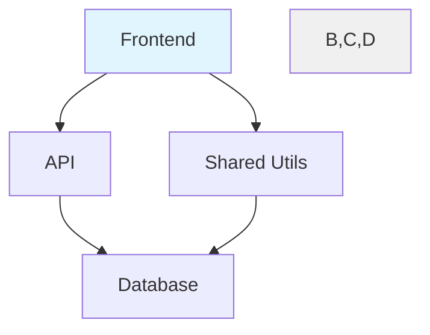

# Technical Architecture: Living Docs Visualization & Integration

## Vision

Build the **visualization and integration layer** that makes the core analysis engine's insights accessible through interactive dashboards, diagrams, and automated workflows.

## Architecture Overview

```
┌─────────────────────────────────────────────────────────┐
│  0134: Core Engine (Orchestrator + Analyzers)           │
│  ↓ Outputs: ModuleGraph, ADRs, TechDebtReport          │
└────────────────────┬────────────────────────────────────┘
                     │
        ┌────────────┼────────────┐
        │            │            │
   ┌────▼───┐   ┌───▼────┐   ┌──▼─────┐
   │Mermaid │   │  D3.js │   │Report  │
   │Diagram │   │ Graph  │   │Writer  │
   │Gen     │   │(HTML)  │   │(MD)    │
   └────┬───┘   └───┬────┘   └──┬─────┘
        │           │           │
        └───────────┼───────────┘
                    │
          ┌─────────▼──────────┐
          │  CLI Integration   │
          │  Hook Integration  │
          └────────────────────┘
```

## Component Design

### 1. Mermaid Diagram Generator

**File**: `src/core/living-docs/intelligent-analyzer/mermaid-generator.ts`

**Purpose**: Exports module graph to Mermaid diagram format.

**API**:
```typescript
class MermaidGenerator {
  exportModuleGraph(graph: ModuleGraph): string;
  exportTeamStructure(teams: TeamStructure): string;

  private renderNode(module: Module): string;
  private renderEdge(dep: Dependency): string;
  private highlightCircularDeps(cycles: CircularDep[]): string;
}
```

**Output Format**:


### 2. D3.js Interactive Graph

**File**: `src/core/living-docs/intelligent-analyzer/graph-visualizer.ts`

**Purpose**: Generate standalone HTML with interactive dependency graph.

**API**:
```typescript
class GraphVisualizer {
  generateHTML(graph: ModuleGraph): string;

  private renderTemplate(data: GraphData): string;
  private embedD3Script(): string;
  private embedStyles(): string;
}
```

**Features**:
- Zoom and pan
- Click module to show details
- Filter by module type
- Highlight circular dependencies (red)
- Search modules

**Output**: `.specweave/docs/internal/architecture/diagrams/module-graph.html`

### 3. HTML Dashboard

**File**: `src/core/living-docs/intelligent-analyzer/dashboard-generator.ts`

**Purpose**: Create overview page with project statistics.

**API**:
```typescript
class DashboardGenerator {
  generateDashboard(data: DashboardData): string;

  private renderStats(stats: ProjectStats): string;
  private renderADRList(adrs: ADR[]): string;
  private renderTechDebtSummary(debt: TechDebtReport): string;
  private renderModuleList(modules: Module[]): string;
}

interface DashboardData {
  projectStats: ProjectStats;
  adrs: ADR[];
  techDebt: TechDebtReport;
  modules: Module[];
  lastUpdate: string;
}
```

**Dashboard Sections**:
1. Project Overview (repo count, file count, tech stack)
2. ADR List (numbered, with status)
3. Tech Debt Summary (P1/P2/P3 counts)
4. Module Count & Coupling Metrics
5. Quick Links (graphs, reports)

**Output**: `.specweave/docs/internal/index.html`

### 4. Report Writer

**File**: `src/core/living-docs/intelligent-analyzer/report-writer.ts`

**Purpose**: Generate markdown reports for technical debt and team structure.

**API**:
```typescript
class ReportWriter {
  writeTechDebtReport(debt: TechDebtReport, outputPath: string): void;
  writeTeamStructureDoc(teams: TeamStructure, outputPath: string): void;

  private formatDebtItem(item: DebtItem): string;
  private formatTeam(team: Team): string;
}
```

**Tech Debt Report Format**:
```markdown
# Technical Debt Report

**Generated**: 2025-12-09 10:30 AM
**Project**: MyApp (3 repos)
**Total Issues**: 47

## Summary
| Category | Count | Severity |
|----------|-------|----------|
| Outdated Dependencies | 12 | P2 |
...

## Critical Issues (P1)
### 1. High Cyclomatic Complexity
**File**: `backend/src/services/OrderProcessor.ts:123`
**Complexity**: 18 (threshold: 10)
...
```

### 5. CLI Command Integration

**File**: `src/commands/living-docs.ts`

**Purpose**: Implement `/specweave:living-docs update` slash command.

**API**:
```typescript
async function livingDocsUpdate(options: UpdateOptions): Promise<void> {
  const orchestrator = new LivingDocsOrchestrator(projectRoot);
  const result = await orchestrator.update(options);

  // Generate visualizations
  const mermaidGen = new MermaidGenerator();
  const graphViz = new GraphVisualizer();
  const dashboard = new DashboardGenerator();
  const reportWriter = new ReportWriter();

  // Write outputs
  // ...

  console.log(`✅ Living docs updated (${result.duration}ms)`);
}
```

**Command Options**:
```bash
--incremental  # Use Git diff for changes
--full         # Ignore cache, rebuild everything
--adr-only     # Only run ADR discovery
--tech-debt-only  # Only run tech debt analysis
--modules-only    # Only rebuild module graph
--dry-run      # Show what would be updated
```

### 6. Hook Integration

**File**: `plugins/specweave/hooks/post-increment-completion.sh`

**Purpose**: Automatically update living docs after increment completion.

**Hook Types**:

**PostIncrementCompletion** (mandatory):
```bash
# Triggered by /specweave:done
# Updates living docs for the completed feature
```

**PostCommit** (optional):
```bash
# Triggered by git post-commit hook
# Runs incremental update if enabled in config
```

**PostSpecEdit** (optional):
```bash
# Triggered when spec.md is modified
# Re-syncs that specific feature
```

**Configuration**:
```json
{
  "livingDocs": {
    "autoUpdate": true,
    "updateOnCommit": false,
    "updateOnSpecEdit": true
  }
}
```

## Data Flow

### Full Update with Visualization

```
1. User runs: /specweave:living-docs update
2. Core Engine (0134) executes:
   - Phase 1: Discovery (repo scan)
   - Phase 2: Analysis (patterns, graph, debt)
   - Phase 3: Synthesis (ADRs)
3. Visualization (0135) generates:
   - Mermaid diagram (.mmd file)
   - Interactive graph (HTML + D3.js)
   - Dashboard (index.html)
   - Tech debt report (markdown)
   - Team structure doc (markdown)
4. Output summary:
   - Files created: 12
   - Files updated: 5
   - Duration: 3m 45s
```

### Hook-Triggered Update

```
1. User runs: /specweave:done 0050
2. Increment closes successfully
3. PostIncrementCompletion hook fires
4. Hook runs: /specweave:living-docs update --incremental
5. Only FS-050 docs updated (fast)
6. User sees: "✅ Living docs updated for FS-050"
```

## File Structure

```
src/core/living-docs/intelligent-analyzer/
├── mermaid-generator.ts      # Mermaid diagram export
├── graph-visualizer.ts       # D3.js HTML generator
├── dashboard-generator.ts    # Dashboard HTML
├── report-writer.ts          # Markdown reports
└── organization-synthesizer.ts # Team structure

src/commands/
└── living-docs.ts            # CLI command

plugins/specweave/hooks/
├── post-increment-completion.sh
├── post-commit.sh (optional)
└── post-spec-edit.sh (optional)
```

## Technology Choices

### Why D3.js (not Canvas)?

**Chosen: D3.js**
- ✅ SVG-based (scalable, crisp at any zoom)
- ✅ Rich interaction support
- ✅ Easy to style with CSS
- ✅ No external dependencies (embedded in HTML)

**Rejected: Canvas**
- ❌ Raster-based (pixelation at zoom)
- ❌ Harder to implement interactions

### Why Standalone HTML (not web server)?

**Chosen: Standalone HTML files**
- ✅ No server setup required
- ✅ Works offline
- ✅ Easy to share (copy file)
- ✅ Version-controlled

**Rejected: Web server**
- ❌ Requires server setup
- ❌ Dependency on runtime

### Why Mermaid + D3.js (not just one)?

**Both formats serve different needs**:
- **Mermaid**: Version-controlled text (.mmd), renders in docs
- **D3.js**: Interactive exploration, zoom/pan/filter

## Performance Targets

| Operation | Target | Implementation |
|-----------|--------|----------------|
| Mermaid generation | <1s | String template |
| D3.js HTML generation | <5s | HTML template |
| Dashboard generation | <3s | HTML template |
| Tech debt report | <2s | Markdown formatting |
| Full visualization pipeline | <10s | Parallel generation |

## Implementation Phases

**Phase 4**: Visualization & Documentation (T-017 to T-021)
- Mermaid generator
- D3.js interactive graph
- HTML dashboard
- Report writer
- Team structure docs

**Phase 5**: Integration & Polish (T-022 to T-028)
- CLI command
- Hook integration
- Progress reporting
- Error handling
- E2E testing

## Monitoring

**Metrics**:
- Visualization generation time
- Dashboard load time (client-side)
- Hook execution success rate
- User engagement with dashboards

**Logs**: `.specweave/logs/living-docs-update.log`
