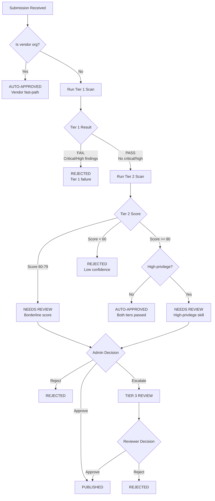

# Auto-Approve vs Manual-Review Decision Logic

**Status**: DRAFT
**Author**: anton.abyzov@gmail.com
**Date**: 2026-02-15
**Satisfies**: AC-US10-05, AC-US10-06 (T-034)
**Dependencies**: T-008 (Three-Tier Certification), T-029 (Submission State Machine)

---

## 1. Overview

The decision logic determines whether a submission is auto-approved, flagged for human review, or rejected based on scan results, vendor status, and configurable thresholds.

---

## 2. Decision Tree



---

## 3. Decision Rules

### 3.1 Vendor Fast-Path

```typescript
function isVendorAutoApproved(submission: Submission): boolean {
  const owner = extractOwner(submission.repoUrl);
  return TRUSTED_ORGS.includes(owner.toLowerCase());
}

const TRUSTED_ORGS = [
  'anthropics', 'openai', 'google', 'google-gemini',
  'vercel-labs', 'supabase', 'microsoft'
];
```

**Result**: Skip all scanning. Transition directly to `VENDOR_APPROVED` → `PUBLISHED`.

### 3.2 Tier 1 Gate

```typescript
function evaluateTier1(result: Tier1Result): 'pass' | 'fail' {
  if (result.findings.some(f => f.severity === 'critical' || f.severity === 'high')) {
    return 'fail';
  }
  if (!result.structuralChecks.every(c => c.passed)) {
    return 'fail';
  }
  return 'pass';
}
```

**Pass**: Zero critical/high findings AND all structural checks pass.
**Fail**: Any critical/high finding OR any structural check failure.

### 3.3 Tier 2 Thresholds

```typescript
interface DecisionThresholds {
  autoApproveMin: number;    // Score >= this → auto-approve (default: 80)
  concernsMin: number;       // Score >= this → needs review (default: 60)
  rejectBelow: number;       // Score < this → reject (default: 60)
}

const DEFAULT_THRESHOLDS: DecisionThresholds = {
  autoApproveMin: 80,
  concernsMin: 60,
  rejectBelow: 60,
};

function evaluateTier2(result: Tier2Result, thresholds: DecisionThresholds): Decision {
  if (result.score >= thresholds.autoApproveMin && result.verdict === 'PASS') {
    return 'auto-approve';
  }
  if (result.score >= thresholds.concernsMin) {
    return 'needs-review';
  }
  return 'reject';
}
```

### 3.4 High-Privilege Detection

Even if Tier 2 score >= 80, certain skills are flagged for review:

```typescript
function isHighPrivilege(skillContent: string): boolean {
  const HIGH_PRIVILEGE_PATTERNS = [
    /Bash\(\*\)/,                          // Unrestricted shell access
    /Write.*\/etc\//,                      // System directory writes
    /process\.env/,                        // Environment variable access
    /scripts\//,                           // Scripts directory present
    /sudo|chmod\s+[0-7]{3,4}/,            // Elevated permissions
    /ssh|gpg|private.key/i,               // Cryptographic key access
  ];

  return HIGH_PRIVILEGE_PATTERNS.some(p => p.test(skillContent));
}
```

**Result**: If high-privilege AND score >= 80, transition to `NEEDS_REVIEW` instead of `AUTO_APPROVED`.

---

## 4. Edge Cases

### 4.1 Borderline Scores (75-79)

| Scenario | Action |
|----------|--------|
| Score 79, no concerns | `NEEDS_REVIEW` — admin reviews with low urgency |
| Score 79, 1+ concerns | `NEEDS_REVIEW` — admin reviews with medium urgency |
| Score 75, vendor-adjacent | `NEEDS_REVIEW` — may be auto-approved after admin check |

### 4.2 Mixed Signals

| Scenario | Action |
|----------|--------|
| Tier 1 PASS, Tier 2 score 85, but 1 "CONCERN" | `AUTO_APPROVED` (score > 80 overrides) |
| Tier 1 PASS (0 findings), Tier 2 score 62 | `NEEDS_REVIEW` (LLM detected behavioral issues) |
| Tier 1 PASS (2 medium), Tier 2 score 91 | `AUTO_APPROVED` (medium findings acceptable) |
| Vendor org, known security issue | `NEEDS_REVIEW` (per-skill trust revocation) |

### 4.3 High-Privilege Skills with High Scores

| Scenario | Action |
|----------|--------|
| Score 95, requests `Bash(*)` | `NEEDS_REVIEW` — admin verifies shell access is justified |
| Score 88, has `scripts/` dir | `NEEDS_REVIEW` — admin reviews scripts content |
| Score 92, `process.env` access | `NEEDS_REVIEW` — admin verifies env var usage is documented |

---

## 5. Configurable Thresholds

Thresholds can be configured per deployment:

```json
// vskill.config.json or environment variables
{
  "pipeline": {
    "thresholds": {
      "autoApproveMin": 80,
      "concernsMin": 60,
      "rejectBelow": 60
    },
    "highPrivilegeCheck": true,
    "vendorAutoApprove": true
  }
}
```

| Config | Default | Description |
|--------|---------|-------------|
| `autoApproveMin` | 80 | Minimum Tier 2 score for auto-approval |
| `concernsMin` | 60 | Minimum score to reach NEEDS_REVIEW (below = reject) |
| `rejectBelow` | 60 | Score threshold for automatic rejection |
| `highPrivilegeCheck` | true | Enable high-privilege detection |
| `vendorAutoApprove` | true | Enable vendor fast-path |

---

## 6. Decision Audit

Every decision is recorded in the audit trail:

```typescript
interface DecisionAudit {
  submissionId: string;
  decision: 'auto-approve' | 'needs-review' | 'reject' | 'vendor-approve';
  reason: string;
  tier1Result: { verdict: string; findingsCount: number };
  tier2Result?: { score: number; verdict: string; concerns: string[] };
  highPrivilege: boolean;
  thresholds: DecisionThresholds;
  timestamp: string;
}
```

---

## 7. Complete Decision Function

```typescript
async function makeDecision(
  submission: Submission,
  tier1: Tier1Result,
  tier2: Tier2Result | null,
  config: PipelineConfig
): Promise<Decision> {
  // 1. Vendor fast-path
  if (config.vendorAutoApprove && isVendorAutoApproved(submission)) {
    return { action: 'vendor-approve', reason: 'Trusted organization' };
  }

  // 2. Tier 1 gate
  if (evaluateTier1(tier1) === 'fail') {
    return {
      action: 'reject',
      reason: `Tier 1 failed: ${tier1.findings.filter(f =>
        f.severity === 'critical' || f.severity === 'high'
      ).length} critical/high findings`,
    };
  }

  // 3. Tier 2 evaluation
  if (!tier2) throw new Error('Tier 2 result required for non-vendor submissions');

  const thresholds = config.thresholds ?? DEFAULT_THRESHOLDS;

  if (tier2.score < thresholds.rejectBelow) {
    return { action: 'reject', reason: `Tier 2 score ${tier2.score} below threshold ${thresholds.rejectBelow}` };
  }

  if (tier2.score < thresholds.autoApproveMin) {
    return { action: 'needs-review', reason: `Tier 2 score ${tier2.score} in review range` };
  }

  // 4. High-privilege check
  if (config.highPrivilegeCheck) {
    const content = await fetchSkillContent(submission.repoUrl, submission.skillPath);
    if (isHighPrivilege(content)) {
      return {
        action: 'needs-review',
        reason: `High-privilege skill with score ${tier2.score} — manual review required`,
      };
    }
  }

  // 5. Auto-approve
  return { action: 'auto-approve', reason: `Tier 1 PASS + Tier 2 score ${tier2.score} >= ${thresholds.autoApproveMin}` };
}
```

---

## 8. References

- [Three-Tier Certification](./three-tier-certification.md) — Scoring criteria
- [Submission State Machine](./submission-state-machine.md) — State transitions
- [Database Schema](./database-schema.md) — Submission model
