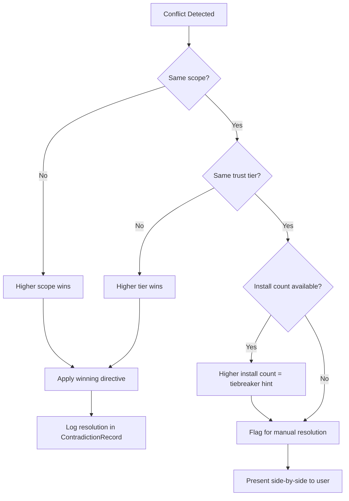
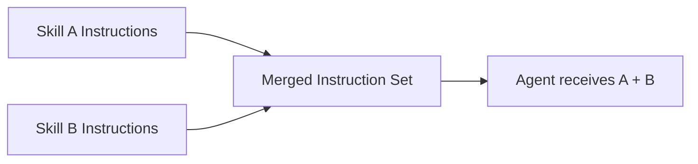
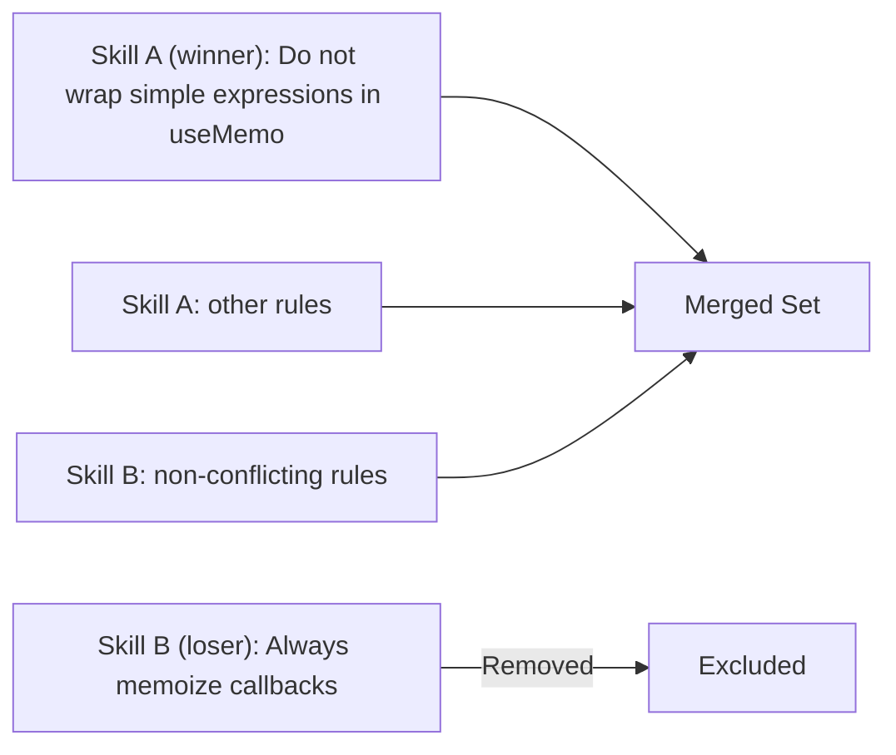
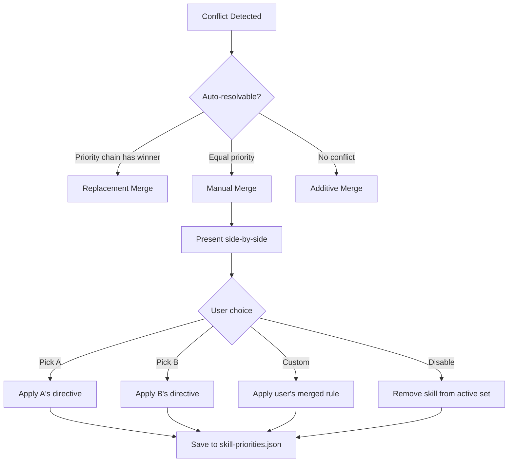
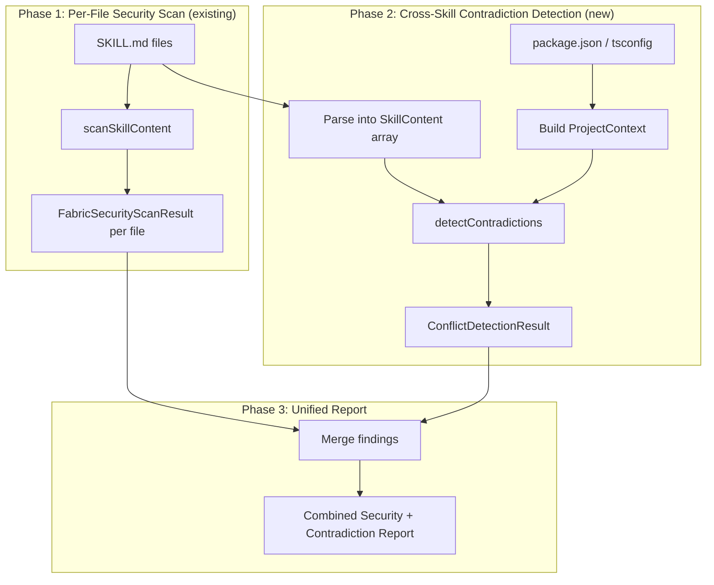

# Contradiction Detection System Design

Version: 1.0 | Author: anton.abyzov@gmail.com | Date: 2026-02-15

---

## 1. Overview

The AI agent skills ecosystem has crossed 200,000 published skills with zero cross-skill conflict detection. As documented in the companion research (skill-contradictions.md), developers installing multiple skills routinely encounter silent instruction conflicts: Vercel's react-best-practices tells agents "do not wrap simple expressions with primitive types in useMemo" while a competing react-expert skill mandates unconditional memoization; a Bun runtime skill declares "never use npm" while Google's stitch-skills hardcodes `npm run validate`; React 19 skills inject `useActionState` patterns into React 18 projects. None of these conflicts produce warnings. The agent resolves them non-deterministically, producing inconsistent code across sessions.

This document designs a contradiction detection system for SpecWeave's Fabric Registry. The system introduces four conflict type classifiers, detection heuristics with confidence scoring, a four-level priority chain for automated resolution, three merge strategies for different conflict severities, and a concrete integration path into the existing `security-scanner.ts` infrastructure.

The design goal is to catch contradictions at skill installation time (static analysis) rather than at agent runtime (dynamic resolution), shifting the cost of conflict resolution from every prompt to a one-time installation check.

---

## 2. Four Conflict Types

### 2.1 Behavioral Contradictions

**Definition**: Two or more skills issue opposing instructions on the same programming topic, pattern, or practice.

**Real examples from research**:
- Vercel's react-best-practices: "Do not wrap simple expressions with primitive types in useMemo" vs. react-expert by Jeffallan: "Memoize when passing callbacks/objects to memoized children" (unconditional)
- react-state-management by wshobson: "For large apps use Redux Toolkit" vs. Vercel: "Zustand selectors for performance optimization" vs. clean-code by xenitV1: lists only "zustand/jotai" as 2025 recommendation
- Softaworks react-dev: "Never implement forwardRef in React 19+" vs. Google stitch-skills: no mention of forwardRef deprecation, validation scripts built for pre-React-19 patterns

**Detection heuristics**:

1. **Keyword opposition patterns**: Scan for paired directives where one skill uses an affirmative keyword and another uses its negation on the same subject.

   Opposition pairs:
   - `always X` vs. `never X`
   - `prefer X` vs. `avoid X`
   - `use X` vs. `do not use X` / `don't use X`
   - `must X` vs. `must not X`
   - `require X` vs. `prohibit X`
   - `recommended` vs. `deprecated` / `discouraged`

2. **Topic clustering**: Group skill instructions by subject matter (memoization, state management, ref handling, etc.) using keyword extraction, then compare directives within each cluster.

3. **Qualified vs. unconditional directives**: Detect when one skill issues a qualified rule ("memoize when passing to memoized children") and another issues a blanket rule ("do not wrap simple expressions in useMemo") on the same API surface. The conflict is in the scope of the qualifier.

**Confidence scoring**:
- **High**: Direct keyword opposition on the same API name (e.g., both mention `useMemo` with opposing verbs)
- **Medium**: Same topic cluster with opposing sentiment but different API names (e.g., "use Zustand" vs. "use Redux Toolkit" -- same topic, different recommendations)
- **Low**: Implicit opposition through omission (e.g., one skill lists approved libraries and another recommends a library not on that list)

### 2.2 Configuration Contradictions

**Definition**: Two or more skills hardcode incompatible tooling, configuration values, or command invocations.

**Real examples from research**:
- Google stitch-skills hardcodes `npm run validate` and `npm run dev` vs. bout3fiddy's bun skill: "Never use npm, yarn, pnpm, or node directly"
- clean-code by xenitV1: "Pin versions in production; avoid ^ or ~" vs. most skills assuming caret ranges by default when running `npm install` or `bun add`
- clean-code: "50/300 Rule: files exceeding 300 lines should be split" vs. react-best-practices patterns that routinely produce 300+ line component files

**Detection heuristics**:

1. **Hardcoded command extraction**: Parse skill content for shell commands (code blocks and inline backticks), extract the package manager binary, and compare across skills.

   Target binaries: `npm`, `yarn`, `pnpm`, `bun`, `node`, `deno`

2. **Numeric threshold extraction**: Parse rules that set numeric limits ("50 lines", "300 lines", "100% coverage") and detect when two skills set different thresholds for the same metric.

3. **Configuration key conflicts**: Extract config file directives (e.g., "set strict: true in tsconfig", "use module: commonjs") and compare across skills for the same config key with different values.

**Confidence scoring**:
- **High**: Two skills reference the same binary/tool with opposing directives (one hardcodes `npm run`, another forbids `npm`)
- **Medium**: Two skills set different numeric limits for the same category (file length limits differ by more than 2x)
- **Low**: Implicit configuration assumptions (one skill assumes caret versioning without stating it; another explicitly forbids it)

### 2.3 Dependency Contradictions

**Definition**: Two or more skills assume different runtime versions, framework versions, or dependency configurations that are mutually incompatible.

**Real examples from research**:
- Softaworks react-dev: "ref as prop (forwardRef deprecated)" (React 19) vs. Google stitch-skills: validation scripts built for pre-React-19 patterns
- Vercel react-best-practices: "Use toSorted()" (requires Node.js 20+) vs. projects with `engines.node: ">=18"` in package.json
- bun-package-manager: uses `bun.lock` vs. any skill running `npm install` generating `package-lock.json`

**Detection heuristics**:

1. **Frontmatter dependency comparison**: If skills declare `dependencies` in YAML frontmatter, compare version ranges for overlap. Non-overlapping ranges are conflicts.

2. **API surface detection**: Maintain a lookup table mapping API names to their minimum runtime versions:
   - `useActionState` -> React >= 19.0.0
   - `use()` hook -> React >= 19.0.0
   - `toSorted()` -> Node.js >= 20.0.0, ES2023
   - `Array.fromAsync()` -> Node.js >= 22.0.0
   - `forwardRef` -> deprecated in React 19.0.0

3. **Project validation**: Compare detected API assumptions against the project's actual `package.json` (dependencies, engines) and `tsconfig.json` (lib, target).

4. **Lockfile conflict detection**: At skill activation, scan for coexisting lockfiles (`package-lock.json`, `yarn.lock`, `pnpm-lock.yaml`, `bun.lock`) and flag when a package-manager skill does not match the existing lockfile.

**Confidence scoring**:
- **High**: Skill uses an API that does not exist in the project's declared runtime version (e.g., `useActionState` in a React 18 project)
- **Medium**: Skill assumes a runtime version not declared in its frontmatter, and the project's version is ambiguous
- **Low**: Skill references a pattern that is deprecated but still functional in the project's runtime version

### 2.4 Precedence Contradictions

**Definition**: Two or more skills compete for authority on the same topic without a clear priority signal, or the resolution mechanism is undefined.

**Real examples from research**:
- Global `clean-code` skill (in `~/.claude/skills/`) with "50/300 Rule" vs. project-level `react-best-practices` (in `.claude/skills/`) -- no defined priority between global and project skills
- Vercel's react-best-practices (vendor, 234K installs) vs. react-expert by Jeffallan (community, 100+ installs) -- no trust-tier precedence in any agent runtime
- AGENTS.md says "Use pnpm" (always active) vs. SKILL.md says "Run npm install" (selectively loaded) -- no defined priority between instruction types
- 5+ skills matching a task context causes non-deterministic skill loading with 0-3 actually loaded

**Detection heuristics**:

1. **Scope collision analysis**: Determine each skill's scope (global, project, directory) from its installation path and detect overlapping topic coverage.

2. **Trust-tier comparison**: Compare the `tier` field (`official`, `verified`, `community`) from the Fabric Registry for skills covering the same topic. Flag when a community skill contradicts an official or verified skill without an explicit override.

3. **Install-path precedence**: Derive priority from where the skill is installed:
   - `~/.claude/skills/` = global scope (lowest priority)
   - `.claude/skills/` at project root = project scope (higher priority)
   - `.claude/skills/` in subdirectory = directory scope (highest priority)

4. **Context saturation risk**: Count skills matching a task context. When the count exceeds 4, flag as a precedence risk because the runtime may silently drop skills.

**Confidence scoring**:
- **High**: Two skills at the same scope level and same trust tier cover the same topic with opposing instructions
- **Medium**: Skills at different scope levels cover the same topic (resolution is possible via priority chain but not explicit)
- **Low**: Skills cover adjacent but not identical topics (potential for interaction effects but no direct conflict)

---

## 3. Detection Heuristics

### 3.1 Behavioral Contradiction Detection

#### Algorithm

```
function detectBehavioralContradictions(skills: SkillContent[]): ContradictionRecord[]

  // Step 1: Extract directive statements from each skill
  for each skill in skills:
    directives[skill.id] = extractDirectives(skill.content)
    // A directive is: { verb, subject, qualifier?, line, raw }
    // e.g., { verb: "avoid", subject: "useMemo", qualifier: "simple expressions", line: 42 }

  // Step 2: Build a subject index
  subjectIndex = groupBy(allDirectives, d => normalizeSubject(d.subject))
  // normalizeSubject: "useMemo" and "React.useMemo" -> "useMemo"
  //                   "Redux Toolkit" and "redux-toolkit" -> "redux-toolkit"

  // Step 3: For each subject with 2+ directives from different skills, check opposition
  contradictions = []
  for each (subject, directives) in subjectIndex:
    if directives come from < 2 distinct skills: continue

    for each pair (d1, d2) where d1.skillId != d2.skillId:
      if isOpposing(d1.verb, d2.verb):
        confidence = computeBehavioralConfidence(d1, d2)
        contradictions.push({
          type: "behavioral",
          skillA: d1.skillId,
          skillB: d2.skillId,
          subject: subject,
          directiveA: d1.raw,
          directiveB: d2.raw,
          confidence: confidence,
          lineA: d1.line,
          lineB: d2.line
        })

  return contradictions
```

**`extractDirectives` detail**: Scan each line for sentence patterns matching `<modal/imperative verb> <subject>`. The verb vocabulary is:

| Affirmative | Negative |
|-------------|----------|
| always, must, should, prefer, use, recommend, require, implement | never, must not, should not, avoid, do not, don't, prohibit, deprecate, discourage |

The subject is the noun phrase following the verb, normalized by stripping articles and lowercasing.

**`isOpposing` detail**: Returns true when one verb is in the affirmative set and the other is in the negative set, OR when both are affirmative but recommend mutually exclusive alternatives for the same category (e.g., "use Zustand" vs. "use Redux Toolkit" for state management).

#### Example

**Input**:
```
Skill A (react-expert):
  Line 15: "Memoize when passing callbacks/objects to memoized children"

Skill B (react-best-practices):
  Line 42: "Do not wrap simple expressions with primitive types in useMemo"
```

**Extracted directives**:
```
d1 = { verb: "memoize", subject: "useMemo/callbacks", qualifier: null, skill: "react-expert", line: 15 }
d2 = { verb: "do not wrap", subject: "useMemo", qualifier: "simple expressions", skill: "react-best-practices", line: 42 }
```

**Output**:
```json
{
  "type": "behavioral",
  "skillA": "react-expert",
  "skillB": "react-best-practices",
  "subject": "useMemo",
  "directiveA": "Memoize when passing callbacks/objects to memoized children",
  "directiveB": "Do not wrap simple expressions with primitive types in useMemo",
  "confidence": "high",
  "lineA": 15,
  "lineB": 42
}
```

**Confidence**: HIGH -- both directives reference the same API (`useMemo`) and the verbs are in opposition ("memoize" vs. "do not wrap").

### 3.2 Configuration Contradiction Detection

#### Algorithm

```
function detectConfigContradictions(skills: SkillContent[]): ContradictionRecord[]

  // Step 1: Extract hardcoded commands from code blocks and inline backticks
  for each skill in skills:
    commands[skill.id] = extractCommands(skill.content)
    // A command is: { binary, args, line, raw }
    // e.g., { binary: "npm", args: "run validate", line: 88 }

  // Step 2: Extract numeric thresholds
  for each skill in skills:
    thresholds[skill.id] = extractThresholds(skill.content)
    // e.g., { metric: "file-lines", value: 300, line: 22 }

  // Step 3: Detect package manager conflicts
  pkgManagers = new Map<skillId, Set<string>>()
  for each (skillId, cmds) in commands:
    for each cmd in cmds:
      if cmd.binary in ["npm", "yarn", "pnpm", "bun", "deno"]:
        pkgManagers[skillId].add(cmd.binary)

  for each pair (skillA, skillB):
    if pkgManagers[skillA] and pkgManagers[skillB] are disjoint
       AND either skill contains a "never use <other-binary>" directive:
      contradictions.push(configContradiction(skillA, skillB, "package-manager"))

  // Step 4: Detect threshold conflicts
  allThresholds = flatten(thresholds)
  thresholdIndex = groupBy(allThresholds, t => t.metric)
  for each (metric, entries) in thresholdIndex:
    if entries from 2+ skills AND max(values) / min(values) > 2.0:
      contradictions.push(configContradiction(entries, "numeric-threshold"))

  return contradictions
```

**`extractCommands` detail**: Parse lines inside fenced code blocks (``` ... ```) and inline backtick spans for patterns matching `<binary> <subcommand> [args]`. Focus on known tool binaries: package managers, build tools (`tsc`, `vite`, `webpack`, `esbuild`), linters (`eslint`, `prettier`, `biome`), and test runners (`vitest`, `jest`, `playwright`).

#### Example

**Input**:
```
Skill A (react:components by Google):
  Line 88: "Running `npm run validate <file_path>` on each component"
  Line 112: "Dev server verification with `npm run dev`"

Skill B (bun by bout3fiddy):
  Line 3: "Bun is the ONLY approved JavaScript/TypeScript toolkit."
  Line 5: "Never use npm, yarn, pnpm, or node directly."
```

**Output**:
```json
{
  "type": "configuration",
  "skillA": "react:components",
  "skillB": "bun",
  "subject": "package-manager",
  "directiveA": "npm run validate, npm run dev",
  "directiveB": "Never use npm, yarn, pnpm, or node directly",
  "confidence": "high",
  "lineA": 88,
  "lineB": 5
}
```

**Confidence**: HIGH -- Skill A hardcodes `npm` commands; Skill B explicitly forbids `npm`.

### 3.3 Dependency Contradiction Detection

#### Algorithm

```
function detectDependencyContradictions(
  skills: SkillContent[],
  projectContext?: ProjectContext
): ContradictionRecord[]

  // Step 1: Extract version assumptions from frontmatter
  for each skill in skills:
    deps[skill.id] = parseFrontmatterDependencies(skill.frontmatter)
    // e.g., { react: ">=19.0.0", node: ">=20.0.0" }

  // Step 2: Extract implicit version assumptions from API usage
  for each skill in skills:
    apis[skill.id] = extractAPIMentions(skill.content)
    for each api in apis[skill.id]:
      impliedVersion = API_VERSION_TABLE.lookup(api.name)
      if impliedVersion:
        impliedDeps[skill.id].push({ dep: impliedVersion.package, minVersion: impliedVersion.min })

  // Step 3: Cross-skill version range comparison
  allDeps = merge(deps, impliedDeps)
  depIndex = groupBy(allDeps, d => d.dep)  // group by package name
  for each (pkg, entries) in depIndex:
    ranges = entries.map(e => e.minVersion)
    if not overlapping(ranges):
      contradictions.push(dependencyContradiction(entries, "version-mismatch"))

  // Step 4: Project context validation (if available)
  if projectContext:
    projectVersions = parsePackageJson(projectContext.packageJson)
    for each (skillId, skillDeps) in allDeps:
      for each dep in skillDeps:
        projectVersion = projectVersions[dep.dep]
        if projectVersion AND not satisfies(projectVersion, dep.minVersion):
          contradictions.push(dependencyContradiction(
            skill, dep, projectVersion, "project-mismatch"
          ))

  return contradictions
```

**API_VERSION_TABLE** (partial):

| API | Package | Min Version | Deprecation |
|-----|---------|-------------|-------------|
| `useActionState` | react | 19.0.0 | -- |
| `use()` | react | 19.0.0 | -- |
| `forwardRef` | react | 0.13.0 | Deprecated in 19.0.0 |
| `useFormState` | react-dom | 18.0.0 | Removed in 19.0.0 |
| `toSorted()` | node | 20.0.0 | -- |
| `Array.fromAsync()` | node | 22.0.0 | -- |
| `structuredClone()` | node | 17.0.0 | -- |
| `fetch()` (global) | node | 18.0.0 | -- |

#### Example

**Input**:
```
Skill A (react-dev by Softaworks):
  Frontmatter: (no dependencies declared)
  Line 24: "Accept ref as a regular component property instead of using forwardRef wrapper"
  Line 31: "Never implement forwardRef in React 19+"
  Line 45: "useActionState (replaces useFormState)"

Skill B (react:components by Google):
  Frontmatter: (no dependencies declared)
  Content: validation scripts using @swc/core AST checking, no React 19 patterns

Project package.json: { "react": "^18.2.0" }
```

**Implied dependencies**:
```
Skill A: { react: ">=19.0.0" }  (from useActionState, ref-as-prop)
Skill B: { react: ">=16.8.0" }  (from hooks usage, no React 19 APIs)
```

**Output**:
```json
[
  {
    "type": "dependency",
    "skillA": "react-dev",
    "skillB": "react:components",
    "subject": "react-version",
    "directiveA": "Assumes React >=19.0.0 (useActionState, ref as prop)",
    "directiveB": "Assumes React >=16.8.0 (pre-React-19 validation)",
    "confidence": "medium"
  },
  {
    "type": "dependency",
    "skillA": "react-dev",
    "project": true,
    "subject": "react-version",
    "directiveA": "Assumes React >=19.0.0 (useActionState)",
    "projectVersion": "^18.2.0",
    "confidence": "high"
  }
]
```

### 3.4 Precedence Contradiction Detection

#### Algorithm

```
function detectPrecedenceContradictions(skills: SkillContent[]): ContradictionRecord[]

  // Step 1: Determine scope and trust tier for each skill
  for each skill in skills:
    skill.scope = deriveScope(skill.installPath)
    // "global" | "project" | "directory"
    skill.trustTier = lookupTier(skill.author, fabricRegistry)
    // "official" | "verified" | "community"

  // Step 2: Cluster skills by topic domain
  clusters = clusterByDomain(skills)
  // Uses tag overlap, description similarity, and subject extraction

  // Step 3: For each cluster with 2+ skills, check for precedence ambiguity
  for each cluster in clusters:
    if cluster.skills.length < 2: continue

    pairs = allPairs(cluster.skills)
    for each (s1, s2) in pairs:
      if s1.scope == s2.scope AND s1.trustTier == s2.trustTier:
        // Same scope + same tier = no resolution mechanism
        confidence = "high"
      else if s1.scope == s2.scope:
        // Same scope, different tier = resolvable but needs weighting
        confidence = "medium"
      else:
        // Different scope = resolvable via priority chain
        confidence = "low"

      contradictions.push({
        type: "precedence",
        skillA: s1, skillB: s2,
        scopeA: s1.scope, scopeB: s2.scope,
        tierA: s1.trustTier, tierB: s2.trustTier,
        confidence: confidence
      })

  // Step 4: Context saturation check
  for each cluster in clusters:
    if cluster.skills.length > 4:
      contradictions.push({
        type: "precedence",
        subtype: "context-saturation",
        skills: cluster.skills,
        count: cluster.skills.length,
        confidence: "high",
        message: "5+ skills in same domain risk non-deterministic loading"
      })

  return contradictions
```

#### Example

**Input**:
```
Skill A: react-best-practices (project scope, official tier, Vercel)
Skill B: react-expert (project scope, community tier, Jeffallan)
Skill C: react-dev (project scope, verified tier, Softaworks)
Skill D: react-state-management (project scope, community tier, wshobson)
Skill E: clean-code (global scope, community tier, xenitV1)
```

**Output**:
```json
[
  {
    "type": "precedence",
    "skillA": "react-best-practices",
    "skillB": "react-expert",
    "scopeA": "project", "scopeB": "project",
    "tierA": "official", "tierB": "community",
    "confidence": "medium",
    "resolution": "official tier takes precedence"
  },
  {
    "type": "precedence",
    "subtype": "context-saturation",
    "skills": ["react-best-practices", "react-expert", "react-dev", "react-state-management", "clean-code"],
    "count": 5,
    "confidence": "high",
    "message": "5 skills in React domain risk non-deterministic loading"
  }
]
```

---

## 4. Priority Chain

### 4.1 Resolution Order

The contradiction resolution priority chain follows a four-level hierarchy. When two skills conflict, the skill at the higher priority level wins.

```
local (directory-scoped)  >  project  >  vendor  >  community
        [highest]                                      [lowest]
```

Expanded with trust-tier integration:

```
Priority 1: Directory-scoped skills (.claude/skills/ in subdirectories)
             Any tier -- proximity to code overrides tier
Priority 2: Project-scoped skills (.claude/skills/ at project root)
             Sub-ordered by tier: official > verified > community
Priority 3: Vendor skills (official tier, regardless of install path)
             e.g., vercel-labs, google-labs-code, callstackincubator
Priority 4: Community skills (community tier, global install path)
             e.g., personal preference skills in ~/.claude/skills/
```



### 4.2 Determining Priority from Skill Metadata

Each skill's priority is computed from three metadata fields:

| Field | Source | Maps To |
|-------|--------|---------|
| `installPath` | Filesystem location | scope: global / project / directory |
| `tier` | Fabric Registry `FabricRegistryEntry.tier` | trust: official / verified / community |
| `author` | Fabric Registry `FabricRegistryEntry.author` | vendor identification |

**Priority score formula**:

```
priorityScore = (scopeWeight * 100) + (tierWeight * 10) + installCountNormalized

where:
  scopeWeight:  directory=3, project=2, global=1
  tierWeight:   official=3, verified=2, community=1
  installCountNormalized: log10(installCount) capped at 9
```

Example scores:
- Directory-scoped official skill: 330 + installCount bonus
- Project-scoped official skill: 230 + installCount bonus
- Project-scoped community skill: 210 + installCount bonus
- Global community skill: 110 + installCount bonus

### 4.3 Equal-Priority Conflict Handling

When two skills produce the same priority score (same scope, same tier, similar install counts), the system cannot auto-resolve. The resolution strategy escalates:

1. **Check for explicit override declarations**: If either skill's frontmatter declares `overrides: [other-skill]` or `conflicts-with: [other-skill]`, use that declaration.
2. **Check project-level skill-config**: If `.specweave/skill-priorities.json` exists and ranks the skills, use the project owner's declared priority.
3. **Flag for manual resolution**: Present both directives side-by-side in the contradiction report and require user input. Neither directive is applied automatically.

---

## 5. Three Merge Strategies

### 5.1 Additive Merge

**When to apply**: No overlap detected between skills' instruction sets. Both skills cover distinct topics or distinct aspects of the same topic without opposing directives.

**Mechanism**: Concatenate instructions from both skills. No modification, no filtering. Both instruction sets are presented to the agent in full.

**Example**: `react-best-practices` covers component patterns and performance. `typescript-advanced-types` covers generic constraints and utility types. No topic overlap -- additive merge produces the union of both instruction sets.



**Guardrail**: Even in additive merge, the system checks total instruction volume. If the combined instruction count exceeds 50 directives (context saturation threshold), a warning is emitted recommending skill consolidation.

### 5.2 Replacement Merge

**When to apply**: A conflict is detected and the priority chain produces a clear winner. The higher-priority skill's directive replaces the lower-priority skill's directive for the conflicting topic only. Non-conflicting instructions from both skills are retained.

**Mechanism**:

1. Identify the conflicting directives (subject + opposing verbs).
2. Determine the winner via the priority chain (Section 4).
3. Remove the losing directive from the merged instruction set.
4. Annotate the removal in the contradiction report so the user can audit.

**Example**: Project-scoped `react-best-practices` (official tier, score 230) says "Do not wrap simple expressions in useMemo." Global-scoped `react-expert` (community tier, score 110) says "Always memoize callbacks passed to children." The `react-best-practices` directive wins. The merged instruction set includes the Vercel memoization rule and drops the react-expert's unconditional memoization rule. All other react-expert instructions (e.g., component naming conventions) are retained.



**Guardrail**: Replacement merge logs every suppressed directive. Users can review suppressed directives via `specweave skill-conflicts --show-suppressed` and override if needed.

### 5.3 Manual Merge

**When to apply**: A conflict is detected but the priority chain cannot resolve it (equal priority) OR the conflict severity is high enough that automated resolution is risky (e.g., React version assumptions that could break builds).

**Mechanism**:

1. Present the conflict as a side-by-side comparison in the terminal.
2. Require the user to choose one of:
   - **Pick A**: Skill A's directive wins for this topic.
   - **Pick B**: Skill B's directive wins for this topic.
   - **Custom**: User writes a merged directive that replaces both.
   - **Disable skill**: Remove one skill from the active set entirely.
3. Record the user's choice in `.specweave/skill-priorities.json` so it persists across sessions.

**Example output**:

```
CONTRADICTION DETECTED: Memoization Strategy
--------------------------------------------
Skill A: react-best-practices (Vercel, official, project)
  Line 42: "Do not wrap simple expressions with primitive types in useMemo"

Skill B: react-expert (Jeffallan, community, project)
  Line 15: "Memoize when passing callbacks/objects to memoized children"

These skills give opposing guidance on useMemo usage.

Resolution options:
  [1] Use Skill A's rule (skip memoization for simple expressions)
  [2] Use Skill B's rule (always memoize callbacks to memoized children)
  [3] Write a custom merged rule
  [4] Disable react-expert for this project

Your choice:
```



---

## 6. Integration with Existing Scanner

### 6.1 Current Scanner Architecture

The existing `src/core/fabric/security-scanner.ts` operates on a single SKILL.md file at a time via `scanSkillContent(content: string)`. It checks 26 regex patterns across 6 categories: `destructive-command`, `remote-code-execution`, `credential-access`, `dangerous-permissions`, `prompt-injection`, and `network-access`. It also checks frontmatter for the `name:` field issue.

Contradiction detection is fundamentally different: it requires comparing two or more skills simultaneously. This means it cannot be a simple extension of the existing per-file scanner. Instead, it operates as a parallel scan phase that runs after individual security scans complete.

### 6.2 New `instruction-contradiction` Finding Category

Add `instruction-contradiction` as a seventh finding category in the security scanner's output taxonomy. Contradiction findings use the existing `FabricSecurityFinding` interface with extended severity semantics:

| Severity | Meaning for Contradictions |
|----------|---------------------------|
| `critical` | Skills produce mutually exclusive outputs (e.g., `npm` vs. `never npm`) that will cause build failures |
| `high` | Skills assume incompatible dependency versions that may cause runtime errors |
| `medium` | Skills give opposing behavioral guidance that produces inconsistent but functional code |
| `low` | Skills have overlapping domains with minor stylistic differences |
| `info` | Skills cover similar topics but no direct conflict detected (informational overlap notice) |

### 6.3 ContradictionRecord Type

```typescript
/** The four types of contradiction the system detects */
type ContradictionType = 'behavioral' | 'configuration' | 'dependency' | 'precedence';

/** Confidence level for a detected contradiction */
type ContradictionConfidence = 'high' | 'medium' | 'low';

/** Merge strategy selected or recommended for a contradiction */
type MergeStrategy = 'additive' | 'replacement' | 'manual';

/** A single detected contradiction between two skills */
interface ContradictionRecord {
  /** Unique identifier for this contradiction */
  id: string;

  /** Which of the four conflict types this is */
  type: ContradictionType;

  /** Optional subtype for more specific classification */
  subtype?: string;

  /** Confidence that this is a real contradiction */
  confidence: ContradictionConfidence;

  /** Mapped severity for integration with FabricSecurityFinding */
  severity: FabricSecurityFinding['severity'];

  /** First skill in the contradiction */
  skillA: {
    id: string;
    name: string;
    author: string;
    tier: FabricTier;
    scope: 'global' | 'project' | 'directory';
    directive: string;
    line?: number;
  };

  /** Second skill in the contradiction (absent for project-mismatch findings) */
  skillB?: {
    id: string;
    name: string;
    author: string;
    tier: FabricTier;
    scope: 'global' | 'project' | 'directory';
    directive: string;
    line?: number;
  };

  /** The topic or subject both skills address */
  subject: string;

  /** Whether this contradiction involves a project context mismatch */
  projectMismatch?: {
    expected: string;
    actual: string;
    source: string;  // e.g., "package.json", "tsconfig.json", "lockfile"
  };

  /** Recommended merge strategy */
  recommendedStrategy: MergeStrategy;

  /** If replacement strategy, which skill wins and why */
  resolution?: {
    winner: string;  // skill ID
    reason: string;  // e.g., "higher priority score (230 vs 110)"
    priorityScoreA: number;
    priorityScoreB: number;
  };

  /** Human-readable summary for display */
  summary: string;
}
```

### 6.4 ConflictDetectionResult Type

```typescript
/** Result of running contradiction detection across a set of skills */
interface ConflictDetectionResult {
  /** Whether any critical or high-severity contradictions were found */
  passed: boolean;

  /** All detected contradictions */
  contradictions: ContradictionRecord[];

  /** Summary counts by type */
  counts: {
    behavioral: number;
    configuration: number;
    dependency: number;
    precedence: number;
    total: number;
  };

  /** Summary counts by confidence */
  confidenceCounts: {
    high: number;
    medium: number;
    low: number;
  };

  /** Skills that were analyzed */
  analyzedSkills: string[];

  /** Project context used for dependency validation (if available) */
  projectContext?: {
    packageJsonPath: string;
    tsconfigPath?: string;
    detectedPackageManager?: string;
    detectedLockfile?: string;
  };

  /** Auto-resolved contradictions (replacement merge applied) */
  autoResolved: ContradictionRecord[];

  /** Contradictions requiring manual resolution */
  requiresManualResolution: ContradictionRecord[];
}
```

### 6.5 Function Skeleton

```typescript
/**
 * Content extracted from a skill for contradiction analysis.
 * This is the input unit -- one per installed skill.
 */
interface SkillContent {
  /** Unique skill identifier (author/name) */
  id: string;
  /** Skill display name */
  name: string;
  /** Skill author */
  author: string;
  /** Trust tier from Fabric Registry */
  tier: FabricTier;
  /** Installation scope */
  scope: 'global' | 'project' | 'directory';
  /** Raw SKILL.md content */
  content: string;
  /** Parsed YAML frontmatter (if present) */
  frontmatter?: Record<string, unknown>;
  /** Installation path */
  installPath: string;
}

/**
 * Optional project context for dependency validation.
 */
interface ProjectContext {
  /** Parsed package.json content */
  packageJson?: Record<string, unknown>;
  /** Parsed tsconfig.json content */
  tsconfig?: Record<string, unknown>;
  /** Detected lockfiles in project root */
  lockfiles?: string[];
  /** Project root path */
  rootPath: string;
}

/**
 * Detects contradictions across a set of installed skills.
 *
 * This function is the main entry point for contradiction detection.
 * It runs all four detection heuristics and returns a unified result.
 *
 * @param skills - Array of skill content to analyze
 * @param projectContext - Optional project context for dependency validation
 * @returns ConflictDetectionResult with all detected contradictions
 */
export function detectContradictions(
  skills: SkillContent[],
  projectContext?: ProjectContext
): ConflictDetectionResult {

  const contradictions: ContradictionRecord[] = [];

  // Phase 1: Behavioral contradiction detection
  // - Extract directives (verb + subject) from each skill
  // - Group by normalized subject
  // - Check for opposing verbs across skills
  const behavioral = detectBehavioralContradictions(skills);
  contradictions.push(...behavioral);

  // Phase 2: Configuration contradiction detection
  // - Extract hardcoded commands from code blocks
  // - Extract numeric thresholds
  // - Compare package manager usage across skills
  // - Compare threshold values for the same metric
  const configuration = detectConfigContradictions(skills);
  contradictions.push(...configuration);

  // Phase 3: Dependency contradiction detection
  // - Parse frontmatter dependencies
  // - Detect implicit version assumptions from API mentions
  // - Cross-compare version ranges across skills
  // - Validate against project package.json if available
  const dependency = detectDependencyContradictions(skills, projectContext);
  contradictions.push(...dependency);

  // Phase 4: Precedence contradiction detection
  // - Compute scope and tier for each skill
  // - Cluster skills by domain
  // - Flag same-scope same-tier overlaps
  // - Check for context saturation (5+ skills in one domain)
  const precedence = detectPrecedenceContradictions(skills);
  contradictions.push(...precedence);

  // Phase 5: Apply priority chain to determine resolution strategy
  const { autoResolved, requiresManual } = applyPriorityChain(contradictions);

  // Phase 6: Compute summary
  return {
    passed: !contradictions.some(
      c => c.severity === 'critical' || c.severity === 'high'
    ),
    contradictions,
    counts: {
      behavioral: behavioral.length,
      configuration: configuration.length,
      dependency: dependency.length,
      precedence: precedence.length,
      total: contradictions.length,
    },
    confidenceCounts: {
      high: contradictions.filter(c => c.confidence === 'high').length,
      medium: contradictions.filter(c => c.confidence === 'medium').length,
      low: contradictions.filter(c => c.confidence === 'low').length,
    },
    analyzedSkills: skills.map(s => s.id),
    projectContext: projectContext ? {
      packageJsonPath: `${projectContext.rootPath}/package.json`,
      tsconfigPath: projectContext.tsconfig
        ? `${projectContext.rootPath}/tsconfig.json`
        : undefined,
      detectedPackageManager: detectPackageManager(projectContext),
      detectedLockfile: projectContext.lockfiles?.[0],
    } : undefined,
    autoResolved,
    requiresManualResolution: requiresManual,
  };
}
```

### 6.6 Integration Architecture

The contradiction detection system operates as a second-pass analysis layered on top of the existing per-file security scanner:



The key integration points in the existing codebase:

1. **`security-scanner.ts`**: Add an export for `detectContradictions` alongside the existing `scanSkillContent`. The two functions share the `FabricSecurityFinding` type but operate independently -- `scanSkillContent` takes one file, `detectContradictions` takes an array.

2. **`registry-schema.ts`**: Extend the `FabricSecurityFinding.category` type documentation to include `instruction-contradiction` as a valid category value. No type changes needed since `category` is already `string`.

3. **CLI surface**: Expose contradiction detection via `specweave skill-conflicts [--project-context] [--show-suppressed]` that loads all installed skills, runs `detectContradictions`, and outputs a formatted report.

4. **Install-time hook**: When a user installs a new skill via the Fabric Registry, automatically run `detectContradictions` with the new skill added to the existing set. If critical or high contradictions are found, warn before completing installation.

---

## 7. TypeScript Interface Design

The complete set of TypeScript interfaces for the contradiction detection system, consolidated for implementation reference:

```typescript
import { FabricTier, FabricSecurityFinding } from './registry-schema.js';

// ---------------------------------------------------------------------------
// Enums and Union Types
// ---------------------------------------------------------------------------

/** The four types of contradiction the system detects */
export type ContradictionType =
  | 'behavioral'
  | 'configuration'
  | 'dependency'
  | 'precedence';

/** Confidence level for a detected contradiction */
export type ContradictionConfidence = 'high' | 'medium' | 'low';

/** Merge strategy selected or recommended for a contradiction */
export type MergeStrategy = 'additive' | 'replacement' | 'manual';

/** Scope derived from a skill's installation path */
export type SkillScope = 'global' | 'project' | 'directory';

/** Verb polarity for behavioral detection */
export type DirectivePolarity = 'affirmative' | 'negative';

// ---------------------------------------------------------------------------
// Input Types
// ---------------------------------------------------------------------------

/** Content extracted from a skill for contradiction analysis */
export interface SkillContent {
  /** Unique skill identifier (author/name) */
  id: string;
  /** Skill display name */
  name: string;
  /** Skill author or organization */
  author: string;
  /** Trust tier from Fabric Registry */
  tier: FabricTier;
  /** Installation scope derived from install path */
  scope: SkillScope;
  /** Raw SKILL.md content */
  content: string;
  /** Parsed YAML frontmatter (if present) */
  frontmatter?: Record<string, unknown>;
  /** Filesystem path where the skill is installed */
  installPath: string;
}

/** Project context for dependency validation */
export interface ProjectContext {
  /** Parsed package.json content */
  packageJson?: {
    dependencies?: Record<string, string>;
    devDependencies?: Record<string, string>;
    engines?: Record<string, string>;
  };
  /** Parsed tsconfig.json content */
  tsconfig?: {
    compilerOptions?: {
      lib?: string[];
      target?: string;
      module?: string;
      strict?: boolean;
    };
  };
  /** Lockfiles detected in project root */
  lockfiles?: string[];
  /** Project root path */
  rootPath: string;
}

// ---------------------------------------------------------------------------
// Internal Analysis Types
// ---------------------------------------------------------------------------

/** A single extracted directive from a skill's content */
export interface ExtractedDirective {
  /** The imperative or modal verb ("always", "never", "prefer", "avoid") */
  verb: string;
  /** Normalized polarity of the verb */
  polarity: DirectivePolarity;
  /** The subject of the directive (API name, tool, pattern) */
  subject: string;
  /** Optional qualifier narrowing the scope ("for simple expressions") */
  qualifier?: string;
  /** Line number in the source SKILL.md */
  line: number;
  /** Raw text of the directive as it appears in the file */
  raw: string;
  /** ID of the skill this directive was extracted from */
  skillId: string;
}

/** A hardcoded command extracted from a skill's content */
export interface ExtractedCommand {
  /** The binary being invoked (npm, bun, yarn, tsc, etc.) */
  binary: string;
  /** Arguments passed to the binary */
  args: string;
  /** Line number in the source SKILL.md */
  line: number;
  /** Raw text of the command */
  raw: string;
  /** ID of the skill this command was extracted from */
  skillId: string;
}

/** A numeric threshold extracted from a skill's content */
export interface ExtractedThreshold {
  /** The metric being constrained (file-lines, function-lines, coverage) */
  metric: string;
  /** The numeric value */
  value: number;
  /** The comparator (max, min, exactly) */
  comparator: 'max' | 'min' | 'exactly';
  /** Line number in the source SKILL.md */
  line: number;
  /** Raw text of the threshold rule */
  raw: string;
  /** ID of the skill this threshold was extracted from */
  skillId: string;
}

/** An API mention that implies a dependency version requirement */
export interface ImpliedDependency {
  /** The API name detected (e.g., "useActionState", "toSorted") */
  apiName: string;
  /** The package this API belongs to (e.g., "react", "node") */
  package: string;
  /** Minimum version required for this API */
  minVersion: string;
  /** Whether this API is deprecated (and in which version) */
  deprecatedIn?: string;
  /** Line number where the API was mentioned */
  line: number;
  /** ID of the skill this was extracted from */
  skillId: string;
}

// ---------------------------------------------------------------------------
// Output Types
// ---------------------------------------------------------------------------

/** Reference to a skill participating in a contradiction */
export interface ContradictionSkillRef {
  /** Skill identifier */
  id: string;
  /** Skill display name */
  name: string;
  /** Skill author */
  author: string;
  /** Trust tier */
  tier: FabricTier;
  /** Installation scope */
  scope: SkillScope;
  /** The specific directive causing the conflict */
  directive: string;
  /** Line number in the skill's SKILL.md */
  line?: number;
  /** Computed priority score */
  priorityScore?: number;
}

/** A project-mismatch finding within a dependency contradiction */
export interface ProjectMismatch {
  /** What the skill expects */
  expected: string;
  /** What the project actually has */
  actual: string;
  /** Source of the project data (package.json, tsconfig.json, lockfile) */
  source: string;
}

/** Resolution details when replacement merge is applied */
export interface ContradictionResolution {
  /** ID of the winning skill */
  winner: string;
  /** Why this skill won */
  reason: string;
  /** Priority score of skill A */
  priorityScoreA: number;
  /** Priority score of skill B */
  priorityScoreB: number;
}

/** A single detected contradiction between two or more skills */
export interface ContradictionRecord {
  /** Unique identifier for this contradiction (e.g., "CTR-001") */
  id: string;
  /** Which of the four conflict types this is */
  type: ContradictionType;
  /** Optional subtype (e.g., "context-saturation", "version-mismatch") */
  subtype?: string;
  /** Confidence that this is a real contradiction */
  confidence: ContradictionConfidence;
  /** Severity mapped to FabricSecurityFinding scale */
  severity: FabricSecurityFinding['severity'];
  /** First skill in the contradiction */
  skillA: ContradictionSkillRef;
  /** Second skill (absent for project-only mismatches) */
  skillB?: ContradictionSkillRef;
  /** The topic both skills address */
  subject: string;
  /** Project mismatch details (for dependency type) */
  projectMismatch?: ProjectMismatch;
  /** Recommended merge strategy */
  recommendedStrategy: MergeStrategy;
  /** Resolution details if replacement merge is possible */
  resolution?: ContradictionResolution;
  /** Human-readable summary for display */
  summary: string;
}

/** Aggregate result from running contradiction detection */
export interface ConflictDetectionResult {
  /** True if no critical or high-severity contradictions found */
  passed: boolean;
  /** All detected contradictions */
  contradictions: ContradictionRecord[];
  /** Count of contradictions by type */
  counts: {
    behavioral: number;
    configuration: number;
    dependency: number;
    precedence: number;
    total: number;
  };
  /** Count of contradictions by confidence level */
  confidenceCounts: {
    high: number;
    medium: number;
    low: number;
  };
  /** IDs of all skills that were analyzed */
  analyzedSkills: string[];
  /** Project context metadata (if project context was provided) */
  projectContext?: {
    packageJsonPath: string;
    tsconfigPath?: string;
    detectedPackageManager?: string;
    detectedLockfile?: string;
  };
  /** Contradictions that were auto-resolved via priority chain */
  autoResolved: ContradictionRecord[];
  /** Contradictions requiring user input */
  requiresManualResolution: ContradictionRecord[];
}

// ---------------------------------------------------------------------------
// Configuration Types
// ---------------------------------------------------------------------------

/** User-defined skill priority overrides stored in skill-priorities.json */
export interface SkillPriorityConfig {
  /** Ordered priority list (index 0 = highest priority) */
  priority?: string[];
  /** Skills explicitly disabled for this project */
  disabled?: string[];
  /** Project-wide tool preferences that override skill assumptions */
  overrides?: {
    packageManager?: 'npm' | 'yarn' | 'pnpm' | 'bun';
    reactVersion?: string;
    nodeVersion?: string;
  };
  /** Saved manual resolution choices keyed by contradiction ID */
  manualResolutions?: Record<string, {
    choice: 'skillA' | 'skillB' | 'custom' | 'disable';
    customDirective?: string;
    disabledSkill?: string;
    resolvedAt: string;
  }>;
}

// ---------------------------------------------------------------------------
// Function Signatures
// ---------------------------------------------------------------------------

/** Main entry point for contradiction detection */
export declare function detectContradictions(
  skills: SkillContent[],
  projectContext?: ProjectContext
): ConflictDetectionResult;

/** Detect behavioral contradictions (opposing directives) */
export declare function detectBehavioralContradictions(
  skills: SkillContent[]
): ContradictionRecord[];

/** Detect configuration contradictions (incompatible tooling) */
export declare function detectConfigContradictions(
  skills: SkillContent[]
): ContradictionRecord[];

/** Detect dependency contradictions (version mismatches) */
export declare function detectDependencyContradictions(
  skills: SkillContent[],
  projectContext?: ProjectContext
): ContradictionRecord[];

/** Detect precedence contradictions (authority conflicts) */
export declare function detectPrecedenceContradictions(
  skills: SkillContent[]
): ContradictionRecord[];

/** Apply priority chain to produce resolution recommendations */
export declare function applyPriorityChain(
  contradictions: ContradictionRecord[]
): {
  autoResolved: ContradictionRecord[];
  requiresManual: ContradictionRecord[];
};

/** Convert ContradictionRecords to FabricSecurityFindings for unified reporting */
export declare function contradictionsToFindings(
  contradictions: ContradictionRecord[]
): FabricSecurityFinding[];
```

---

## 8. Open Questions

1. **LLM-assisted detection**: Should high-confidence semantic contradiction detection use an LLM call (comparing two skill passages for semantic opposition), or should it remain purely heuristic-based? LLM calls add latency and cost at install time but dramatically improve recall for non-obvious contradictions like the memoization example.

2. **Transitive contradictions**: If Skill A conflicts with Skill B, and Skill B conflicts with Skill C, should the system flag a potential A-C interaction even if no direct conflict is detected? This increases the false positive rate but catches cascading incompatibilities.

3. **Version evolution**: When a skill updates its content, should previously-resolved contradictions be re-evaluated? The current design stores manual resolutions by contradiction ID, but the ID may need to incorporate a content hash to detect when the underlying directives change.

4. **Community feedback loop**: Should contradiction reports be anonymized and aggregated back to the Fabric Registry so that skill authors can see which other skills their skill conflicts with? This creates a network effect where popular contradictions get resolved by authors rather than by each user individually.
