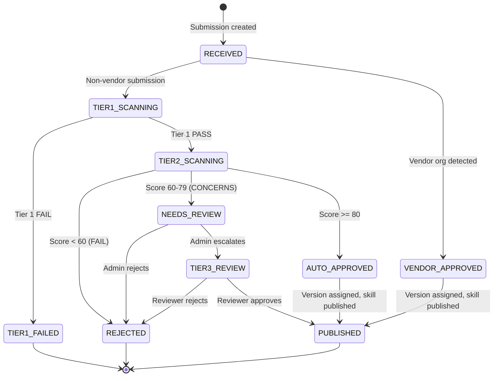

# Submission State Machine & Pipeline Design

**Status**: DRAFT
**Author**: anton.abyzov@gmail.com
**Date**: 2026-02-15
**Satisfies**: AC-US10-03, AC-US10-04, AC-US10-05, AC-US10-06, AC-US10-09, AC-US10-10 (T-029)
**Dependencies**: T-008 (Three-Tier Certification)

---

## 1. Overview

The submission pipeline processes skill verification requests through a deterministic state machine. Each submission flows through scanning tiers, automated decision logic, and optional human review before being published or rejected. Every state transition is logged for a complete audit trail.

---

## 2. State Machine

### 2.1 States

```typescript
enum SubmissionState {
  /** Initial state — submission received via API or web form */
  RECEIVED = 'RECEIVED',

  /** Tier 1 deterministic scan running */
  TIER1_SCANNING = 'TIER1_SCANNING',

  /** Tier 1 failed — terminal state */
  TIER1_FAILED = 'TIER1_FAILED',

  /** Tier 2 LLM judge analysis running */
  TIER2_SCANNING = 'TIER2_SCANNING',

  /** Both tiers passed with score >= 80 — auto-approved */
  AUTO_APPROVED = 'AUTO_APPROVED',

  /** Tier 2 returned CONCERNS (60-79) or high-privilege skill — needs human review */
  NEEDS_REVIEW = 'NEEDS_REVIEW',

  /** Tier 3 manual review in progress */
  TIER3_REVIEW = 'TIER3_REVIEW',

  /** Approved and published to registry */
  PUBLISHED = 'PUBLISHED',

  /** Rejected at any stage — terminal state */
  REJECTED = 'REJECTED',

  /** Vendor auto-verified — bypassed scanning */
  VENDOR_APPROVED = 'VENDOR_APPROVED',
}
```

### 2.2 State Diagram



### 2.3 Transition Rules

| From | To | Trigger | Actor |
|------|----|---------|-------|
| `RECEIVED` | `VENDOR_APPROVED` | Repo owner matches trusted org list | System |
| `RECEIVED` | `TIER1_SCANNING` | Non-vendor submission | System |
| `TIER1_SCANNING` | `TIER2_SCANNING` | Tier 1 scan PASS | Worker |
| `TIER1_SCANNING` | `TIER1_FAILED` | Tier 1 scan FAIL | Worker |
| `TIER2_SCANNING` | `AUTO_APPROVED` | Tier 2 score >= 80 | Worker |
| `TIER2_SCANNING` | `NEEDS_REVIEW` | Tier 2 score 60-79 | Worker |
| `TIER2_SCANNING` | `REJECTED` | Tier 2 score < 60 | Worker |
| `NEEDS_REVIEW` | `TIER3_REVIEW` | Admin clicks "Escalate" | Admin |
| `NEEDS_REVIEW` | `REJECTED` | Admin clicks "Reject" | Admin |
| `TIER3_REVIEW` | `PUBLISHED` | Reviewer approves | Admin |
| `TIER3_REVIEW` | `REJECTED` | Reviewer rejects | Admin |
| `AUTO_APPROVED` | `PUBLISHED` | Version assigned, skill created | System |
| `VENDOR_APPROVED` | `PUBLISHED` | Version assigned, skill created | System |

### 2.4 Transition Function

```typescript
interface StateTransition {
  from: SubmissionState;
  to: SubmissionState;
  trigger: string;
  actor: 'system' | 'worker' | 'admin';
  timestamp: string;
  metadata?: Record<string, unknown>;
}

function validateTransition(
  current: SubmissionState,
  next: SubmissionState
): boolean {
  const VALID_TRANSITIONS: Record<SubmissionState, SubmissionState[]> = {
    RECEIVED: ['VENDOR_APPROVED', 'TIER1_SCANNING'],
    TIER1_SCANNING: ['TIER2_SCANNING', 'TIER1_FAILED'],
    TIER1_FAILED: [],
    TIER2_SCANNING: ['AUTO_APPROVED', 'NEEDS_REVIEW', 'REJECTED'],
    AUTO_APPROVED: ['PUBLISHED'],
    NEEDS_REVIEW: ['TIER3_REVIEW', 'REJECTED'],
    TIER3_REVIEW: ['PUBLISHED', 'REJECTED'],
    PUBLISHED: [],
    REJECTED: [],
    VENDOR_APPROVED: ['PUBLISHED'],
  };

  return VALID_TRANSITIONS[current]?.includes(next) ?? false;
}
```

---

## 3. Vendor Fast-Path

Submissions from trusted organizations bypass all scanning:

```typescript
const TRUSTED_ORGS = [
  'anthropics', 'openai', 'google', 'google-gemini',
  'vercel-labs', 'supabase', 'microsoft'
];

async function processSubmission(submission: Submission): Promise<void> {
  const repoOwner = extractOwner(submission.repoUrl);

  if (TRUSTED_ORGS.includes(repoOwner.toLowerCase())) {
    await transitionTo(submission, 'VENDOR_APPROVED', {
      trigger: 'vendor-auto-verify',
      actor: 'system',
      metadata: { org: repoOwner },
    });
    await publishSkill(submission);
    return;
  }

  // Non-vendor: start Tier 1 scanning
  await transitionTo(submission, 'TIER1_SCANNING', {
    trigger: 'non-vendor-submission',
    actor: 'system',
  });
  await env.SCAN_QUEUE.send({ submissionId: submission.id, jobType: 'tier1-scan' });
}
```

---

## 4. Worker Architecture

### 4.1 Job Queue

The pipeline uses **Cloudflare Queues** for job processing — native to the Workers platform, push-based, durable delivery.

```typescript
// wrangler.toml queue configuration
// [[queues.producers]]
//   queue = "submission-pipeline"
//   binding = "SCAN_QUEUE"
//
// [[queues.consumers]]
//   queue = "submission-pipeline"
//   max_batch_size = 10
//   max_batch_timeout = 30
//   max_retries = 3
//   dead_letter_queue = "submission-dlq"

interface QueueMessage {
  submissionId: string;
  jobType: 'tier1-scan' | 'tier2-scan' | 'publish';
  payload?: Record<string, unknown>;
}
```

### 4.2 Message Processing

Messages are pushed to the consumer Worker automatically by Cloudflare Queues. No polling required.

```typescript
export default {
  async queue(batch: MessageBatch<QueueMessage>, env: Env): Promise<void> {
    for (const msg of batch.messages) {
      try {
        await processSubmissionJob(msg.body, env);
        msg.ack();
      } catch (error) {
        // Retry with exponential backoff (up to 3 retries)
        msg.retry({ delaySeconds: 30 * (msg.attempts + 1) });
      }
    }
  },
};
```

### 4.3 Worker Process

Job routing by message type:

```typescript
async function processSubmissionJob(message: QueueMessage, env: Env): Promise<void> {
  switch (message.jobType) {
    case 'tier1-scan':
      await runTier1Scan(message.submissionId, env);
      break;
    case 'tier2-scan':
      await runTier2Scan(message.submissionId, env);
      break;
    case 'publish':
      await publishSkill(message.submissionId, env);
      break;
  }
  }

  private async runTier1Scan(job: Job): Promise<void> {
    const submission = await getSubmission(job.submissionId);
    const content = await fetchSkillContent(submission.repoUrl, submission.skillPath);
    const result = await tier1Scanner.scan(content);

    await saveScanResult(submission.id, 'tier1', result);

    if (result.verdict === 'PASS') {
      await transitionTo(submission, 'TIER2_SCANNING', {
        trigger: 'tier1-pass',
        actor: 'worker',
        metadata: { findings: result.findings.length },
      });
      await enqueueJob('tier2-scan', { submissionId: submission.id });
    } else {
      await transitionTo(submission, 'TIER1_FAILED', {
        trigger: 'tier1-fail',
        actor: 'worker',
        metadata: { findings: result.findings },
      });
    }
  }

  private async runTier2Scan(job: Job): Promise<void> {
    const submission = await getSubmission(job.submissionId);
    const content = await fetchSkillContent(submission.repoUrl, submission.skillPath);
    const tier1Result = await getLatestScanResult(submission.id, 'tier1');
    const result = await tier2Judge.evaluate(content, tier1Result);

    await saveScanResult(submission.id, 'tier2', result);

    if (result.score >= 80) {
      await transitionTo(submission, 'AUTO_APPROVED', {
        trigger: 'tier2-pass',
        actor: 'worker',
        metadata: { score: result.score },
      });
      await env.SCAN_QUEUE.send({ submissionId: submission.id, jobType: 'publish' });
    } else if (result.score >= 60) {
      await transitionTo(submission, 'NEEDS_REVIEW', {
        trigger: 'tier2-concerns',
        actor: 'worker',
        metadata: { score: result.score, concerns: result.concerns },
      });
    } else {
      await transitionTo(submission, 'REJECTED', {
        trigger: 'tier2-fail',
        actor: 'worker',
        metadata: { score: result.score },
      });
    }
  }
}
```

### 4.4 Retry & Error Handling

| Scenario | Behavior |
|----------|----------|
| Tier 1 scan timeout | Retry up to 3 times with exponential backoff |
| Tier 2 LLM API error | Retry up to 3 times, then fail with notification |
| Git clone failure | Retry once, then mark as failed |
| Worker crash | Cloudflare Queues re-delivers unacknowledged messages automatically |
| Job stuck in processing | Cloudflare Queues visibility timeout, then re-delivers |

---

## 5. Audit Trail

### 5.1 State Event Log

Every state transition creates an immutable audit event:

```typescript
interface SubmissionStateEvent {
  id: string;            // UUID
  submissionId: string;  // FK to submissions
  fromState: SubmissionState;
  toState: SubmissionState;
  trigger: string;       // What caused the transition
  actor: string;         // 'system', 'worker', or admin user ID
  actorType: 'system' | 'worker' | 'admin';
  metadata: Record<string, unknown>;  // Context-specific data
  createdAt: string;     // ISO timestamp
}
```

### 5.2 Example Audit Trail

```json
[
  {
    "fromState": null,
    "toState": "RECEIVED",
    "trigger": "api-submission",
    "actor": "system",
    "createdAt": "2026-02-15T18:00:00Z"
  },
  {
    "fromState": "RECEIVED",
    "toState": "TIER1_SCANNING",
    "trigger": "non-vendor-submission",
    "actor": "system",
    "createdAt": "2026-02-15T18:00:01Z"
  },
  {
    "fromState": "TIER1_SCANNING",
    "toState": "TIER2_SCANNING",
    "trigger": "tier1-pass",
    "actor": "worker",
    "metadata": { "findings": 0, "duration_ms": 234 },
    "createdAt": "2026-02-15T18:00:02Z"
  },
  {
    "fromState": "TIER2_SCANNING",
    "toState": "AUTO_APPROVED",
    "trigger": "tier2-pass",
    "actor": "worker",
    "metadata": { "score": 92, "model": "@cf/meta/llama-3.1-70b-instruct" },
    "createdAt": "2026-02-15T18:00:15Z"
  },
  {
    "fromState": "AUTO_APPROVED",
    "toState": "PUBLISHED",
    "trigger": "publish-complete",
    "actor": "system",
    "metadata": { "version": "1.0.0", "skillId": "sk_abc123" },
    "createdAt": "2026-02-15T18:00:16Z"
  }
]
```

---

## 6. Pipeline Metrics

### 6.1 Tracked Metrics

| Metric | Description |
|--------|-------------|
| `submissions_received_total` | Total submissions received |
| `tier1_scan_duration_ms` | Tier 1 scan latency histogram |
| `tier2_scan_duration_ms` | Tier 2 scan latency histogram |
| `auto_approve_rate` | % of submissions auto-approved |
| `rejection_rate` | % of submissions rejected |
| `needs_review_rate` | % of submissions needing human review |
| `queue_depth` | Current pending jobs by type |
| `job_failure_rate` | % of jobs that fail after all retries |

### 6.2 SLA Targets

| Stage | Target Latency | P95 |
|-------|---------------|-----|
| Tier 1 scan | < 500ms | < 1s |
| Tier 2 scan | < 15s | < 30s |
| Auto-approve to publish | < 5s | < 10s |
| End-to-end (non-review) | < 30s | < 60s |
| Human review (Tier 3) | < 5 business days | < 10 days |

---

## 7. References

- [Three-Tier Certification](./three-tier-certification.md) — Tier definitions and pass criteria
- [AD-9: Submission Pipeline](../plan.md) — Architecture decision
- [Database Schema](./database-schema.md) — Prisma schema for all entities
- [Auto-Approve Logic](./auto-approve-logic.md) — Decision tree details
