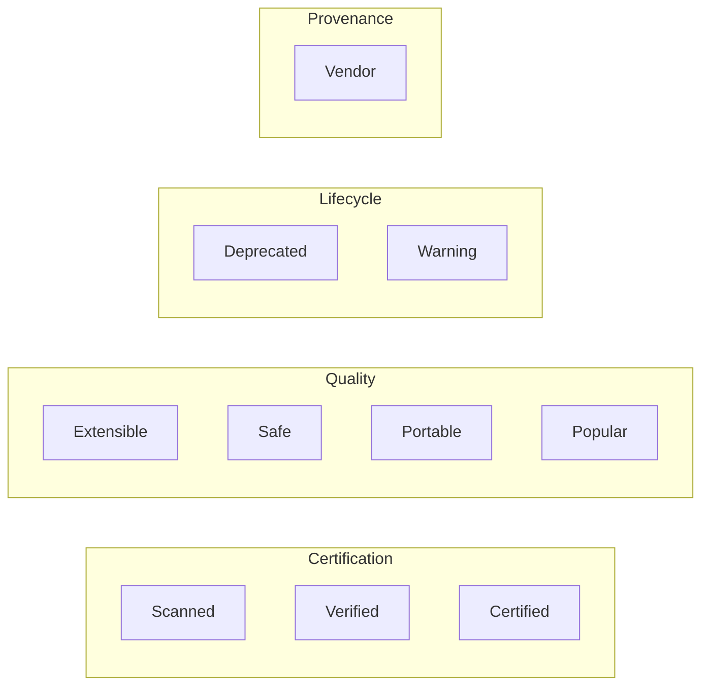
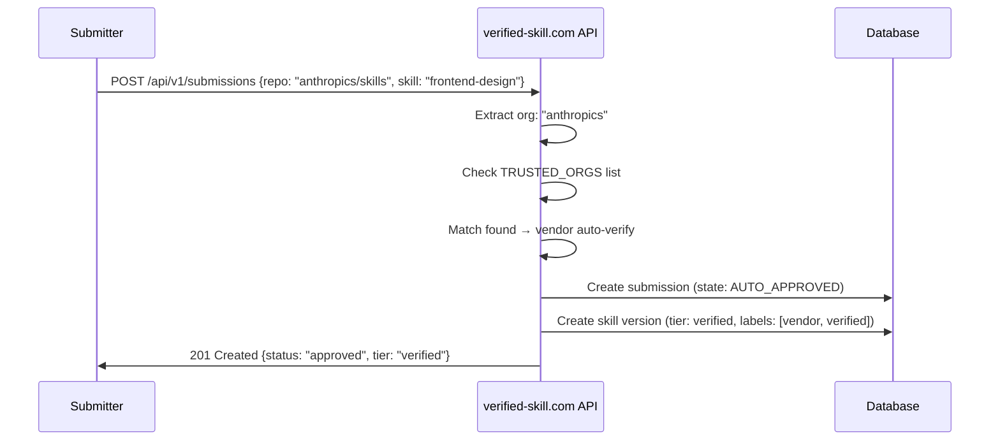
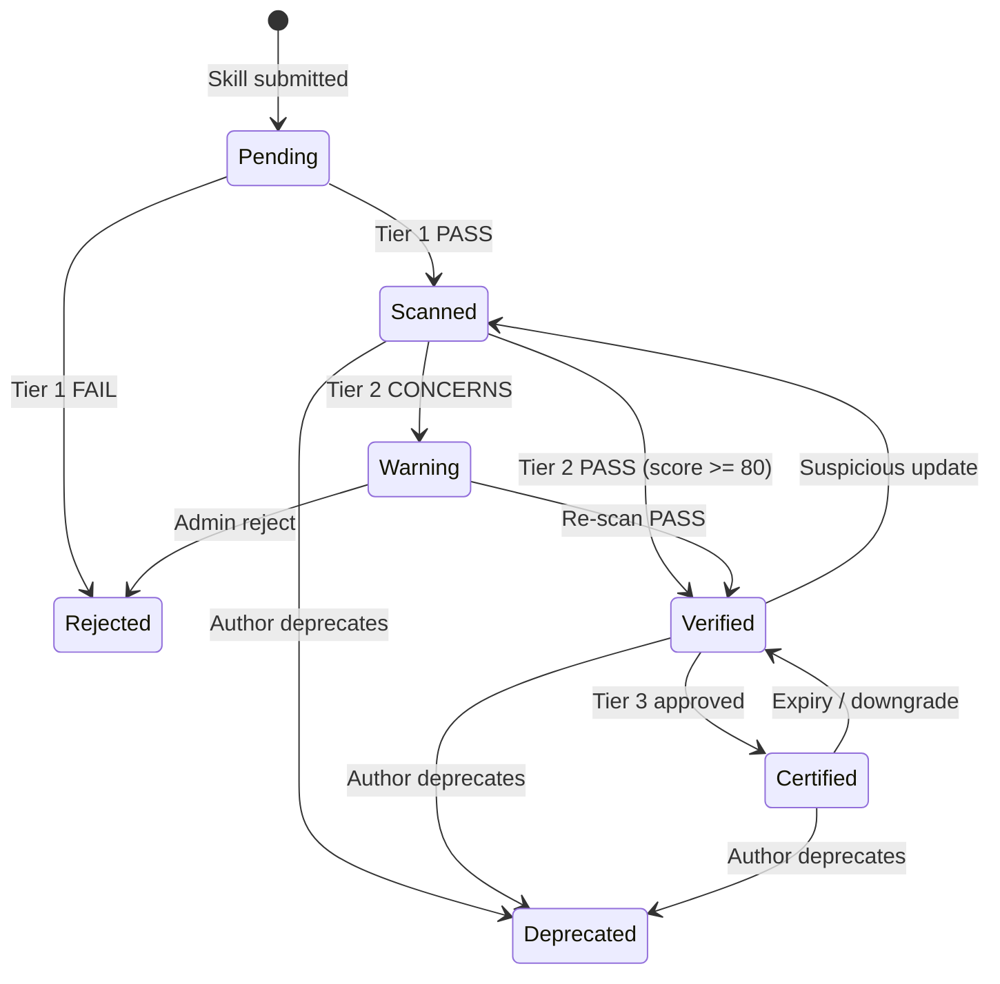

# Trust Labels and Badge System Design

**Status**: DRAFT
**Author**: anton.abyzov@gmail.com
**Date**: 2026-02-15
**Satisfies**: AC-US4-03, AC-US4-04 (T-009)
**Dependencies**: T-008 (Three-Tier Certification)

---

## 1. Overview

Trust labels and badges provide visual, machine-readable indicators of skill quality, safety, and compatibility. They are displayed in CLI output, web interfaces, documentation, and GitHub READMEs. The system is designed to be extensible — new labels can be added without schema changes.

---

## 2. Trust Labels

### 2.1 Label Definitions

| Label | ID | Category | Description | Criteria |
|-------|-----|----------|-------------|----------|
| **Scanned** | `scanned` | Certification | Passed Tier 1 deterministic scan | Tier 1 PASS (37 patterns, 0 critical/high findings) |
| **Verified** | `verified` | Certification | Passed Tier 1 + Tier 2 LLM judge | Tier 2 score >= 80 |
| **Certified** | `certified` | Certification | Passed all 3 tiers + human review | Tier 3 attestation signed |
| **Extensible** | `extensible` | Quality | Works with 10+ agents | Tested on 10+ agents from compatibility matrix |
| **Safe** | `safe` | Security | Zero findings at any severity | Tier 1 findings = 0 (not even info-level) |
| **Portable** | `portable` | Compatibility | Uses only universal SKILL.md features | No `context: fork`, no hooks, no agent-specific features |
| **Deprecated** | `deprecated` | Lifecycle | Superseded by newer skill | Author-declared or admin-set |
| **Warning** | `warning` | Security | Has known issues but not malicious | Medium-severity findings or unresolved concerns |
| **Vendor** | `vendor` | Provenance | Published by a platform vendor | GitHub org in trusted org list (AD-5) |
| **Popular** | `popular` | Community | High install count / engagement | Top 10% by installs in category |

### 2.2 Label Categories



### 2.3 Label Mutual Exclusivity Rules

| Rule | Description |
|------|-------------|
| Certification labels are **hierarchical** | A `certified` skill implicitly has `verified` and `scanned` — only the highest is displayed |
| `safe` + `warning` are **mutually exclusive** | A skill cannot be both safe and have warnings |
| `deprecated` overrides quality labels | Deprecated skills keep their certification but quality labels are dimmed |
| `vendor` + certification are **additive** | Vendor skills can also be verified or certified |
| `popular` is **computed, not assigned** | Derived from install metrics, not manually set |

### 2.4 Label Assignment Matrix

| Label | Assigned By | Automatic? | Revocable? |
|-------|-----------|-----------|-----------|
| `scanned` | Tier 1 scanner | Yes | Yes (on re-scan failure) |
| `verified` | Tier 2 LLM judge | Yes | Yes (on re-scan or downgrade) |
| `certified` | Tier 3 human reviewer | No (manual) | Yes (expiry or revocation) |
| `extensible` | Compatibility test matrix | Yes | Yes (on re-test) |
| `safe` | Tier 1 scanner (zero findings) | Yes | Yes (on re-scan) |
| `portable` | Format analysis | Yes | Yes (on skill update) |
| `deprecated` | Author or admin | No (manual) | Yes (author can un-deprecate) |
| `warning` | Scanner or admin | Both | Yes (on fix and re-scan) |
| `vendor` | GitHub org matching | Yes | Yes (org trust revocation) |
| `popular` | Install metrics | Yes (computed) | Yes (rank changes) |

---

## 3. Visual Badge Specifications

### 3.1 Badge Design System

All badges follow a consistent visual language inspired by shields.io format:

```
┌────────────────────────────┐
│  ICON  │  LABEL  │  VALUE  │
└────────────────────────────┘
```

### 3.2 Badge Specifications

| Badge | Shape | Left Color | Right Color | Icon | Text |
|-------|-------|------------|-------------|------|------|
| **Scanned** | Shield | `#555` (gray) | `#4c1` (green) | Shield icon | `scanned \| pass` |
| **Verified** | Shield | `#555` (gray) | `#08f` (blue) | Checkmark | `verified \| v1.3.0` |
| **Certified** | Shield | `#555` (gray) | `#f0c` (purple) | Star | `certified \| v1.3.0` |
| **Extensible** | Shield | `#555` (gray) | `#0ac` (teal) | Puzzle piece | `extensible \| 15 agents` |
| **Safe** | Shield | `#555` (gray) | `#2d2` (bright green) | Lock | `safe \| 0 findings` |
| **Portable** | Shield | `#555` (gray) | `#fa0` (orange) | Globe | `portable \| universal` |
| **Deprecated** | Shield | `#555` (gray) | `#999` (dark gray) | Archive | `deprecated` |
| **Warning** | Shield | `#555` (gray) | `#fb0` (yellow) | Triangle | `warning \| 3 issues` |
| **Vendor** | Shield | `#555` (gray) | `#39f` (sky blue) | Building | `vendor \| anthropic` |
| **Popular** | Shield | `#555` (gray) | `#e44` (red) | Flame | `popular \| top 10%` |

### 3.3 SVG Badge Template

Badges are rendered as SVG for crisp display at any resolution:

```xml
<svg xmlns="http://www.w3.org/2000/svg" width="{{width}}" height="20">
  <linearGradient id="b" x2="0" y2="100%">
    <stop offset="0" stop-color="#bbb" stop-opacity=".1"/>
    <stop offset="1" stop-opacity=".1"/>
  </linearGradient>
  <clipPath id="a">
    <rect width="{{width}}" height="20" rx="3" fill="#fff"/>
  </clipPath>
  <g clip-path="url(#a)">
    <rect width="{{leftWidth}}" height="20" fill="{{leftColor}}"/>
    <rect x="{{leftWidth}}" width="{{rightWidth}}" height="20" fill="{{rightColor}}"/>
    <rect width="{{width}}" height="20" fill="url(#b)"/>
  </g>
  <g fill="#fff" text-anchor="middle" font-family="Verdana,Geneva,sans-serif" font-size="11">
    <text x="{{leftCenter}}" y="15" fill="#010101" fill-opacity=".3">{{label}}</text>
    <text x="{{leftCenter}}" y="14">{{label}}</text>
    <text x="{{rightCenter}}" y="15" fill="#010101" fill-opacity=".3">{{value}}</text>
    <text x="{{rightCenter}}" y="14">{{value}}</text>
  </g>
</svg>
```

### 3.4 Badge API Endpoints

```
GET /api/v1/badges/{skill-name}.svg              → Default badge (highest certification)
GET /api/v1/badges/{skill-name}/verified.svg      → Specific badge type
GET /api/v1/badges/{skill-name}/all.json          → All labels as JSON
GET /api/v1/badges/{skill-name}/{version}.svg     → Version-specific badge
```

**Response headers**:
- `Cache-Control: max-age=3600` (1 hour cache)
- `Content-Type: image/svg+xml` (for SVG endpoints)
- `ETag` for conditional requests

### 3.5 Badge Embedding

#### GitHub README

```markdown

```

#### HTML

```html

```

#### CLI Output

```
my-skill v1.3.0
  [VERIFIED] [SAFE] [PORTABLE]
  Scanned: 37 patterns, 0 findings
  Verified: Score 92/100
  Compatible with: 15 agents
```

---

## 4. Badge Display Contexts

### 4.1 CLI Display

In terminal/CLI output, badges are displayed as colored text labels:

```
$ npx vskill list

  INSTALLED SKILLS
  ────────────────────────────────────────────
  react-best-practices  v2.1.0  [VERIFIED] [EXTENSIBLE]
    Vercel Labs · 234K installs · Scanned Feb 15, 2026

  bun-package-manager   v1.0.3  [SCANNED] [WARNING]
    secondsky · 1.2K installs · 3 medium findings

  clean-code            v1.5.0  [CERTIFIED] [SAFE] [PORTABLE]
    xenitV1 · 45K installs · Certified Jan 20, 2026
```

**Color Mapping for Terminal**:

| Badge | ANSI Color | chalk.js |
|-------|-----------|----------|
| SCANNED | Green | `chalk.green` |
| VERIFIED | Blue | `chalk.blue` |
| CERTIFIED | Magenta | `chalk.magenta` |
| SAFE | Bright Green | `chalk.greenBright` |
| EXTENSIBLE | Cyan | `chalk.cyan` |
| PORTABLE | Yellow | `chalk.yellow` |
| WARNING | Yellow + Bold | `chalk.yellow.bold` |
| DEPRECATED | Gray | `chalk.gray` |
| VENDOR | Blue + Underline | `chalk.blue.underline` |
| POPULAR | Red | `chalk.red` |

### 4.2 Web Display

On verified-skill.com, badges are displayed as pill-shaped colored elements:

```
┌──────────────────────────────────────────────┐
│  react-best-practices                        │
│  by Vercel Labs                              │
│                                              │
│  [✓ VERIFIED v2.1.0]  [🔒 SAFE]  [🧩 15]   │
│                                              │
│  React and Next.js performance optimization  │
│  234,129 installs · Updated 3 days ago       │
└──────────────────────────────────────────────┘
```

### 4.3 Documentation Display

In Docusaurus/docs pages, badges render as inline elements:

```markdown
## react-best-practices

<Badge type="verified" version="2.1.0" />
<Badge type="safe" />
<Badge type="extensible" count={15} />
```

### 4.4 Search Result Display

In search results (web + CLI), badges serve as filter and sort criteria:

| Filter | Options |
|--------|---------|
| Minimum tier | Scanned, Verified, Certified |
| Labels | Safe, Extensible, Portable, Vendor |
| Exclude | Deprecated, Warning |
| Sort by | Tier (desc), Popularity, Recency |

---

## 5. Vendor Auto-Verification Rules

### 5.1 Trusted GitHub Organizations

Per AD-5 in plan.md, these organizations receive automatic `verified` + `vendor` labels:

| Organization | Auto-Verified? | Auto-Vendor? | Notes |
|-------------|:-:|:-:|-------|
| `anthropics/` | Yes | Yes | Agent Skills standard creator |
| `openai/` | Yes | Yes | Codex CLI publisher |
| `google/` | Yes | Yes | Gemini CLI publisher |
| `google-gemini/` | Yes | Yes | Gemini skills org |
| `vercel-labs/` | Yes | Yes | Skills.sh creator |
| `supabase/` | Yes | Yes | Database platform partner |
| `microsoft/` | Yes | Yes | Copilot skill publisher |

### 5.2 Verification Flow for Vendor Skills



### 5.3 Vendor Auto-Verification Limits

- Auto-verification grants `verified` tier (Tier 2 equivalent), NOT `certified` (Tier 3)
- Vendors can request Tier 3 certification for specific skills
- Auto-verification can be revoked per-skill or per-org by platform admin
- Even vendor skills are subject to continuous monitoring — badge downgrade is possible
- Vendor skills that receive security reports are escalated to Tier 3 review

---

## 6. Label Data Model

### 6.1 TypeScript Types

```typescript
/**
 * All available trust labels.
 * Extensible — new labels can be added without schema migration.
 */
type TrustLabelId =
  | 'scanned'
  | 'verified'
  | 'certified'
  | 'extensible'
  | 'safe'
  | 'portable'
  | 'deprecated'
  | 'warning'
  | 'vendor'
  | 'popular';

/**
 * A trust label applied to a skill.
 */
interface TrustLabel {
  /** Label identifier */
  id: TrustLabelId;

  /** When the label was applied */
  appliedAt: string;

  /** Who/what applied the label */
  appliedBy: 'scanner' | 'llm-judge' | 'admin' | 'system' | 'author';

  /** Additional context (e.g., vendor org name, agent count, finding count) */
  metadata?: Record<string, string | number>;

  /** Version this label applies to (null = all versions) */
  version?: string;

  /** When this label expires (e.g., certified expiry) */
  expiresAt?: string;
}
```

### 6.2 Badge Rendering Function

```typescript
interface BadgeOptions {
  format: 'svg' | 'json' | 'text';
  style?: 'flat' | 'flat-square' | 'for-the-badge';
}

interface BadgeResult {
  label: string;
  value: string;
  color: string;
  icon?: string;
  svg?: string;      // If format = 'svg'
  text?: string;     // If format = 'text'
}

function renderBadge(label: TrustLabel, options: BadgeOptions): BadgeResult;
```

---

## 7. Label Lifecycle

### 7.1 Label State Transitions



### 7.2 Quality Labels (Independent Lifecycle)

| Label | Gained When | Lost When |
|-------|------------|-----------|
| `safe` | Tier 1 scan: 0 findings at any severity | Any finding detected on re-scan |
| `extensible` | Compatibility test: 10+ agents pass | Agent count drops below 10 on re-test |
| `portable` | Format analysis: no platform-specific features | Skill adds `context: fork`, hooks, or agent-specific code |
| `popular` | Install count in top 10% of category | Rank drops below top 10% |
| `vendor` | GitHub org in trusted list | Org trust revoked |

---

## 8. Extensibility

### 8.1 Adding New Labels

New labels can be added without schema changes:

1. Add the new ID to the `TrustLabelId` union type
2. Define assignment criteria in the scanner/judge
3. Add badge visual specification (color, icon, text format)
4. Add to the label documentation
5. No database migration needed (labels stored as JSON array)

### 8.2 Custom Labels (Future)

Organizations using verified-skill.com self-hosted could define custom labels:

```json
{
  "customLabels": [
    {
      "id": "hipaa-compliant",
      "category": "compliance",
      "color": "#006400",
      "icon": "shield-check",
      "criteria": "Reviewed for HIPAA compliance by security team"
    }
  ]
}
```

---

## 9. References

- [shields.io](https://shields.io/) — Badge design inspiration
- [AD-2: Three-tier verification model](/plan.md) — Tier definitions
- [AD-5: Vendor auto-verification](/plan.md) — Trusted org list
- [T-008: Three-tier certification](/research/three-tier-certification.md) — Certification criteria
- [SpecWeave registry-schema.ts](/src/core/fabric/registry-schema.ts) — Existing FabricTier type
