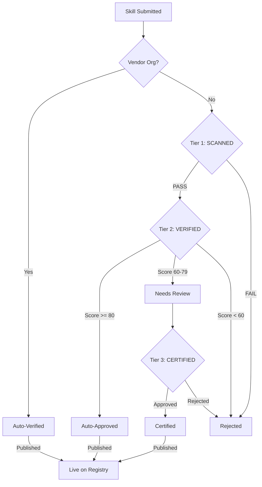

# verified-skill.com — Product Requirements Document

**Status**: DRAFT
**Author**: anton.abyzov@gmail.com
**Date**: 2026-02-15
**Satisfies**: AC-US7-01 through AC-US7-14 (T-015)
**Dependencies**: T-006 (Competitive Analysis), T-008 (Three-Tier Certification), T-009 (Trust Labels & Badges)

---

## 1. Mission

**Make AI agent skills trustworthy.** verified-skill.com is the authoritative registry for security-verified AI agent skills. Every skill listed has been scanned, verified, or certified through a transparent three-tier process — giving developers confidence that the skills they install won't steal credentials, exfiltrate data, or compromise their systems.

### 1.1 Problem Statement

The AI skills ecosystem is a security disaster:
- **36.82%** of skills have security flaws (Snyk ToxicSkills, Feb 2026)
- **76** confirmed malicious payloads in the wild
- **233K installs** on the top Skills.sh skill — with zero security scanning
- Skills.sh has **zero versioning** — upstream pushes silently change all agents
- Existing scanners produce false negatives (Skill Defender cleared actual malware) or are themselves malicious (SkillGuard)

### 1.2 Vision

verified-skill.com becomes the **shields.io for AI agent skills** — the canonical source of trust badges that developers embed in READMEs, CI pipelines, and agent configurations. When a developer sees `[VERIFIED v1.3.0]`, they know exactly what was scanned, when, and at what depth.

---

## 2. Target Users

| Persona | Description | Primary Need |
|---------|-------------|-------------|
| **Security-conscious developer** | Uses AI agents daily, worried about supply chain risk | Know which skills are safe before installing |
| **Skill author** | Builds skills for the community | Get a trust badge to increase adoption |
| **Enterprise security team** | Evaluates tools for organization-wide deployment | Audit trail, compliance, version pinning |
| **Platform integrator** | Builds on top of agent ecosystems | API access to verification data |

---

## 3. Value Proposition

### 3.1 For Developers (Consumers)

> "Install skills you can trust. Every skill on verified-skill.com has been scanned for malicious patterns, verified by AI analysis, and version-pinned so updates can't sneak in malware."

- **Security-first installation**: `npx vskill install` scans before installing
- **Version pinning**: Badge says "verified at v1.3.0" — not just "verified"
- **39-agent support**: One install command, all agents updated
- **Diff scanning on updates**: See exactly what changed before accepting

### 3.2 For Skill Authors (Publishers)

> "Get verified, get discovered. Submit your skill, pass our three-tier review, and earn a badge that GitHub, npm, and every agent marketplace recognizes."

- **Free scanning (all tiers)**: Automated pattern check + AI analysis, instant results
- **Verified badge**: Embeddable SVG for README, website, docs
- **Version tracking**: Semantic versioning with diff analysis
- **Discoverability**: Listed in curated registry with popularity signals

### 3.3 For Enterprise

> "Audit every skill your team installs. Version-pinned verification, lock files, and continuous monitoring ensure compliance."

- **Lock files**: `vskill.lock` with SHA-256 hashes per version
- **Continuous monitoring**: Badge downgrade alerts on suspicious updates
- **Admin dashboard**: Manage internal skill approval workflow
- **API access**: Integrate verification into CI/CD pipelines

---

## 4. Competitive Positioning

### 4.1 Landscape

```
                    Scanning Depth
                         ^
                         |
    Snyk agent-scan  *   |
                         |   @ verified-skill.com (target)
    Cisco Scanner    *   |
                         |
    pors/skill-audit *   |
                         |
    SkillsDirectory  *   |
                         |
    -----------------+---+--------------------> Registry Breadth
                         |
    Skills.sh        *   |
    ClawHub          *   |
```

**verified-skill.com occupies the upper-right quadrant**: deep scanning + comprehensive directory. No existing tool occupies this space.

### 4.2 Key Differentiators

| Feature | Skills.sh | SkillsDirectory | Snyk agent-scan | verified-skill.com |
|---------|:-:|:-:|:-:|:-:|
| Security scanning | None | 50+ rules | Static + LLM | 3-tier (static + LLM + human) |
| Version pinning | None | None | None | SHA-256 lock file |
| Badge API | None | None | None | SVG + JSON API |
| Multi-agent install | 39 agents | None | None | 39 agents |
| Diff scanning | None | None | None | Per-update diff |
| Continuous monitoring | None | None | Proxy mode | Badge downgrade alerts |
| Submission pipeline | None | Opaque review | None | Transparent state machine |
| Open source scanner | N/A | No | Yes | Yes |

---

## 5. Three-Tier Verification Architecture

Reference: [three-tier-certification.md](./three-tier-certification.md)



### 5.1 Tier Summary

| Tier | Name | Method | Cost | Latency | Badge |
|------|------|--------|------|---------|-------|
| **1** | Scanned | 37 regex patterns + structural checks | Free | < 500ms | `scanned` |
| **2** | Verified | Tier 1 + LLM judge (Workers AI Llama 3.1 70B) | ~$0.003/skill | 5-15s | `verified` |
| **3** | Certified | Tier 1 + 2 + human review + sandbox | Free (volunteer) | 1-5 days | `certified` |

### 5.2 Vendor Auto-Verification

Skills from trusted GitHub organizations receive automatic `verified` status:

| Organization | Rationale |
|-------------|-----------|
| `anthropics/` | Agent Skills standard creator |
| `openai/` | Codex CLI publisher |
| `google/`, `google-gemini/` | Gemini CLI publisher |
| `vercel-labs/` | Skills.sh creator |
| `supabase/` | Database platform partner |
| `microsoft/` | Copilot skill publisher (131 skills) |

Reference: [trust-labels-badges.md](./trust-labels-badges.md)

---

## 6. Tech Stack

| Layer | Technology | Rationale |
|-------|-----------|-----------|
| **Framework** | Next.js 15+ App Router | SSR for SEO, Server Components for performance, React ecosystem |
| **Language** | TypeScript (strict) | Type safety, shared types with CLI |
| **Hosting** | Cloudflare Workers (via @opennextjs/cloudflare) | Serverless, auto-scaling, native Queues and Workers AI integration |
| **Database** | PostgreSQL (Neon) | JSONB for flexible metadata, data storage only |
| **ORM** | Prisma (client engine, @prisma/adapter-neon) | Type-safe queries, no Rust binary (Workers-compatible) |
| **Job Queue** | Cloudflare Queues | Push-based, durable, at-least-once delivery, free tier: 10K ops/day |
| **LLM (Tier 2)** | Cloudflare Workers AI (`@cf/meta/llama-3.1-70b-instruct`) | Serverless, no API key, ~$0.003/scan |
| **Email** | Resend (resend.com) | Modern API, React Email templates, 100/day free tier |
| **Auth** | JWT (Phase 1) → NextAuth (Phase 2) | Simple admin auth first, OAuth later |
| **CI/CD** | GitHub Actions | Standard, free for public repos |
| **Monitoring** | Cloudflare Analytics + Sentry | Built-in performance + error tracking |
| **CDN/Storage** | Cloudflare R2 | Badge SVG caching, scan result storage |

---

## 7. Repository Structure

Turborepo monorepo (private):

```
vskill/
├── turbo.json                    # Turborepo config
├── package.json                  # Root workspace
├── packages/
│   ├── cli/                      # npx vskill CLI
│   │   ├── src/
│   │   │   ├── commands/         # add, scan, list, compare, update, submit
│   │   │   ├── agents/           # 39-agent registry + detection
│   │   │   ├── scanner/          # Tier 1 scanner (shared with web)
│   │   │   └── lockfile/         # vskill.lock management
│   │   ├── package.json          # npm: vskill
│   │   └── tsconfig.json
│   ├── web/                      # verified-skill.com website
│   │   ├── src/
│   │   │   ├── app/              # Next.js App Router pages
│   │   │   │   ├── page.tsx      # Landing page
│   │   │   │   ├── skills/       # Skill listing + detail pages
│   │   │   │   ├── submit/       # Submission form
│   │   │   │   ├── admin/        # Admin dashboard
│   │   │   │   └── api/          # API routes
│   │   │   ├── components/       # Shared React components
│   │   │   ├── lib/              # Shared utilities
│   │   │   └── emails/           # React Email templates
│   │   ├── prisma/
│   │   │   └── schema.prisma     # Database schema
│   │   ├── package.json
│   │   └── next.config.ts
│   └── scanner/                  # Shared scanning engine
│       ├── src/
│       │   ├── tier1/            # Pattern scanner
│       │   ├── tier2/            # LLM judge integration
│       │   ├── pipeline/         # Submission state machine
│       │   ├── agents/           # 39-agent registry data
│       │   └── versioning/       # Semantic version engine
│       ├── package.json
│       └── tsconfig.json
├── .github/
│   └── workflows/                # CI/CD pipelines
└── .env.example                  # Environment variables template
```

---

## 8. Website Architecture

### 8.1 Page Structure

| Route | Page | Description |
|-------|------|-------------|
| `/` | Landing | Hero, onboarding flow, trending skills, agent grid |
| `/skills` | Skill Listing | Search, filter by tier/category/popularity, sortable grid |
| `/skills/[name]` | Skill Detail | Badges, scan results, version history, agent compatibility |
| `/skills/[name]/versions/[version]` | Version Detail | Diff view, scan results for specific version |
| `/submit` | Submit Skill | Form: GitHub URL, skill name, optional email |
| `/submit/[id]` | Submission Status | Real-time status tracking |
| `/agents` | Agent Registry | All 39 agents with compatibility info |
| `/leaderboard` | Skill Ranking | Sortable by category, tier, popularity |
| `/trending` | Trending | Hot skills by time window (7d/30d) |
| `/admin` | Admin Dashboard | Login, submission queue, stats (protected) |
| `/api/v1/*` | API | REST endpoints for programmatic access |
| `/api/v1/badges/[name].svg` | Badge API | Dynamic SVG badge generation |

### 8.2 Core Components

```
AppLayout
├── Header (nav, search bar, theme toggle)
├── Main
│   ├── HeroSection (landing only)
│   ├── OnboardingFlow (landing only)
│   ├── TrendingGrid (landing only)
│   ├── AgentRegistryGrid (landing + /agents)
│   ├── SkillCard (listing, search results)
│   ├── SkillDetailPage (detail view)
│   ├── BadgeDisplay (inline badges)
│   ├── ScanResultPanel (scan findings)
│   ├── VersionTimeline (version history)
│   ├── SubmissionForm (submit page)
│   ├── SubmissionTracker (status page)
│   └── AdminDashboard (protected)
└── Footer (links, legal, social)
```

---

## 9. Landing Page Onboarding Flow

The landing page features a prominent 4-step onboarding flow positioned below the hero section, guiding new users through the complete workflow:

```
┌─────────────────────────────────────────────────────────────────────┐
│                                                                     │
│  HOW IT WORKS                                                       │
│                                                                     │
│  ┌─────────┐     ┌─────────┐     ┌─────────────┐     ┌─────────┐  │
│  │  1.INIT  │ ──> │ 2.FIND  │ ──> │ 3.INSTALL   │ ──> │4.UPDATE │  │
│  │         │     │         │     │   & VERIFY   │     │         │  │
│  └─────────┘     └─────────┘     └─────────────┘     └─────────┘  │
│                                                                     │
│  npx vskill     Browse skills    Security scan      npx vskill     │
│  init           on the registry  runs before        update          │
│                 or CLI search    install. Badge      Diff scan      │
│                                  shows tier.         highlights     │
│                                                      changes.       │
└─────────────────────────────────────────────────────────────────────┘
```

### 9.1 Step Details

| Step | Title | Description | CTA |
|------|-------|-------------|-----|
| **1. Init** | Set up your project | `npx vskill init` detects your agents and creates `vskill.lock` | Copy command |
| **2. Find** | Discover verified skills | Browse the registry or `npx vskill list --trending` | Browse Skills |
| **3. Install & Verify** | Scan before you trust | Security scan runs automatically. See findings before confirming. | Try It Now |
| **4. Update** | Stay safe on updates | Diff scan highlights new patterns. Approve or reject changes. | Learn More |

### 9.2 Interactive Demo

Below the steps, an interactive terminal demo shows the complete flow:

```
$ npx vskill install anthropics/skills --skill frontend-design

  Fetching skill... done
  Running security scan...

  TIER 1 SCAN RESULTS
  ────────────────────
  Patterns checked:  37
  Critical findings: 0
  High findings:     0
  Medium findings:   0

  Verdict: PASS [VERIFIED] (Vendor: Anthropic)

  Install to 3 detected agents?
  > Claude Code, Cursor, Windsurf

  [Y] Install  [N] Cancel  [D] Details

$ Y
  Installed frontend-design v1.3.0 to 3 agents
  Lock file updated: vskill.lock
```

---

## 10. Agent Registry Visualization

The agent registry is a card/grid layout displaying all 39 supported agents with visual indicators for universal vs non-universal support and platform icons.

### 10.1 Layout

```
┌─────────────────────────────────────────────────────────────────┐
│  39 SUPPORTED AGENTS                                            │
│  Skills work across all major AI coding agents                  │
│                                                                 │
│  UNIVERSAL AGENTS (shared .agents/skills/)                      │
│  ┌──────────┐ ┌──────────┐ ┌──────────┐ ┌──────────┐          │
│  │ ★ Codex  │ │★ Gemini  │ │★ Copilot │ │★ Kimi    │          │
│  │   CLI    │ │   CLI    │ │  GitHub  │ │  Code    │          │
│  └──────────┘ └──────────┘ └──────────┘ └──────────┘          │
│  ┌──────────┐ ┌──────────┐                                     │
│  │★OpenCode │ │   Amp    │                                     │
│  └──────────┘ └──────────┘                                     │
│                                                                 │
│  NON-UNIVERSAL AGENTS                                           │
│  ┌──────────┐ ┌──────────┐ ┌──────────┐ ┌──────────┐          │
│  │  Claude  │ │  Cursor  │ │ Windsurf │ │   Roo    │          │
│  │   Code   │ │          │ │          │ │   Code   │          │
│  └──────────┘ └──────────┘ └──────────┘ └──────────┘          │
│  ┌──────────┐ ┌──────────┐ ┌──────────┐ ┌──────────┐ ...     │
│  │   Cline  │ │ Continue │ │  Goose   │ │  Junie   │          │
│  └──────────┘ └──────────┘ └──────────┘ └──────────┘          │
│                                                                 │
│  + 25 more agents                                [View All →]  │
└─────────────────────────────────────────────────────────────────┘
```

### 10.2 Agent Card Component

Each agent card displays:
- **Platform icon**: SVG icon or logo placeholder
- **Agent name**: Display name
- **Universal badge**: Star icon (★) for universal agents
- **Skill count**: Number of verified skills compatible with this agent
- **Detection status**: "Detected" pill if agent found locally (CLI context)

### 10.3 Agent Data Structure

```typescript
interface AgentCard {
  id: string;              // e.g., 'claude-code'
  displayName: string;     // e.g., 'Claude Code'
  isUniversal: boolean;    // Uses .agents/skills/
  icon: string;            // SVG icon path
  skillsDir: string;       // Local skills directory
  verifiedSkillCount: number;
  platform: 'desktop' | 'cli' | 'ide-extension' | 'web';
}
```

---

## 11. UI Design Direction

### 11.1 Design Philosophy

**Verification-first. Trust visible. Minimalistic.**

The UI should communicate trust and security at every level. Not another dark-mode developer tool — a distinctive, professional identity that stands apart from the crowded agent tooling space.

### 11.2 Color Palette

| Token | Value | Usage |
|-------|-------|-------|
| `--primary` | `#2563EB` (Royal Blue) | Primary actions, verified badges, links |
| `--primary-light` | `#DBEAFE` | Primary backgrounds, hover states |
| `--accent` | `#7C3AED` (Violet) | Certified badge, premium features |
| `--accent-light` | `#EDE9FE` | Accent backgrounds |
| `--success` | `#059669` (Emerald) | Scanned pass, safe badge |
| `--warning` | `#D97706` (Amber) | Warning badge, concerns |
| `--danger` | `#DC2626` (Red) | Rejected, critical findings |
| `--surface` | `#FAFBFC` | Page background (light mode) |
| `--surface-dark` | `#0F172A` (Slate 900) | Page background (dark mode) |
| `--card` | `#FFFFFF` | Card backgrounds (light mode) |
| `--card-dark` | `#1E293B` (Slate 800) | Card backgrounds (dark mode) |
| `--text` | `#1E293B` (Slate 800) | Primary text (light mode) |
| `--text-dark` | `#F1F5F9` (Slate 100) | Primary text (dark mode) |
| `--muted` | `#64748B` (Slate 500) | Secondary text, labels |

### 11.3 Typography

| Element | Font | Weight | Size |
|---------|------|--------|------|
| **Headings** | Inter | 700 (Bold) | 2.5rem / 2rem / 1.5rem |
| **Body** | Inter | 400 (Regular) | 1rem (16px) |
| **Code** | JetBrains Mono | 400 | 0.875rem (14px) |
| **Badges** | Inter | 600 (Semibold) | 0.75rem (12px) |
| **Labels** | Inter | 500 (Medium) | 0.8125rem (13px) |

### 11.4 Design Principles

1. **Trust signals prominent**: Badges and verification status are the most visually prominent elements on every skill card and detail page
2. **Clean whitespace**: Generous padding, no visual clutter — let the data breathe
3. **Data-dense where it matters**: Scan results, version history, and findings displayed in compact, scannable formats
4. **Light mode default**: Professional, clean appearance. Dark mode available as toggle.
5. **No gratuitous animations**: Subtle transitions only — hover states, page transitions. No parallax, no particle effects.
6. **Mobile-responsive**: Full functionality on mobile, optimized touch targets for badge viewing and skill browsing

### 11.5 Component Design Language

```
Card:        rounded-lg, shadow-sm, border border-slate-200
Button:      rounded-md, font-medium, transition-colors
Badge:       rounded-full, px-2.5 py-0.5, font-semibold text-xs
Input:       rounded-md, border-slate-300, focus:ring-2 focus:ring-primary
Table:       divide-y, striped rows (even:bg-slate-50)
Code block:  bg-slate-900, rounded-lg, font-mono, syntax highlighted
```

### 11.6 Iconography

Lucide icons for consistency. Badge-specific icons:

| Badge | Icon | Source |
|-------|------|--------|
| Scanned | `Shield` | Lucide |
| Verified | `ShieldCheck` | Lucide |
| Certified | `Award` | Lucide |
| Safe | `Lock` | Lucide |
| Extensible | `Puzzle` | Lucide |
| Portable | `Globe` | Lucide |
| Vendor | `Building2` | Lucide |
| Warning | `AlertTriangle` | Lucide |
| Popular | `TrendingUp` | Lucide |
| Deprecated | `Archive` | Lucide |

---

## 12. Popularity Signals

Each skill page aggregates popularity signals from multiple sources:

### 12.1 Signal Sources

| Signal | Source | Update Frequency | Weight |
|--------|--------|-----------------|--------|
| **GitHub Stars** | GitHub API | Daily | 25% |
| **GitHub Forks** | GitHub API | Daily | 10% |
| **npm Downloads** | npm Registry API | Weekly | 20% |
| **vskill Installs** | Internal telemetry | Real-time | 30% |
| **Commit Recency** | GitHub API | Daily | 15% |

### 12.2 Display on Skill Page

```
┌──────────────────────────────────────────────────────┐
│  react-best-practices                                │
│  by Vercel Labs · v2.1.0 · [VERIFIED] [SAFE]        │
│                                                      │
│  POPULARITY                                          │
│  ★ 1,234 stars  ⑂ 89 forks  ↓ 45K npm/wk           │
│  ⬡ 234K vskill installs  ⟳ Updated 3 days ago      │
│                                                      │
│  TREND: ↑ 12% installs this week                    │
└──────────────────────────────────────────────────────┘
```

### 12.3 Data Model

```typescript
interface PopularitySignals {
  githubStars: number;
  githubForks: number;
  npmWeeklyDownloads: number;
  vskillInstalls: number;
  lastCommitAt: string;          // ISO timestamp
  installVelocity7d: number;     // Installs in last 7 days
  installVelocity30d: number;    // Installs in last 30 days
  starsGrowth7d: number;         // Stars gained in last 7 days
  starsGrowth30d: number;        // Stars gained in last 30 days
  updatedAt: string;             // When signals were last refreshed
}
```

---

## 13. Trending Algorithm

The trending section on the homepage and `/trending` page surfaces skills that are gaining momentum. The algorithm uses a weighted composite score with configurable time windows.

### 13.1 Algorithm

```typescript
function computeTrendingScore(skill: SkillWithSignals, window: '7d' | '30d'): number {
  const signals = skill.popularity;
  const w = window === '7d' ? 7 : 30;

  // Normalize each signal to 0-100 range using category percentiles
  const installVelocity = normalize(
    window === '7d' ? signals.installVelocity7d : signals.installVelocity30d,
    skill.category
  );
  const starsGrowth = normalize(
    window === '7d' ? signals.starsGrowth7d : signals.starsGrowth30d,
    skill.category
  );
  const recency = computeRecencyScore(signals.lastCommitAt, w);
  const tierBonus = TIER_WEIGHTS[skill.certification?.level ?? 'none'];

  // Weighted composite
  return (
    installVelocity * 0.40 +  // Install momentum (heaviest weight)
    starsGrowth     * 0.25 +  // Community interest
    recency         * 0.20 +  // Active maintenance
    tierBonus       * 0.15    // Verification tier bonus
  );
}

const TIER_WEIGHTS: Record<CertificationLevel, number> = {
  none: 0,
  rejected: 0,
  scanned: 30,
  verified: 60,
  certified: 100,
};

function computeRecencyScore(lastCommitAt: string, windowDays: number): number {
  const daysSinceCommit = differenceInDays(new Date(), new Date(lastCommitAt));
  if (daysSinceCommit <= 1) return 100;
  if (daysSinceCommit >= windowDays * 2) return 0;
  return Math.max(0, 100 - (daysSinceCommit / (windowDays * 2)) * 100);
}
```

### 13.2 Time Windows

| Window | Use Case | Refresh Rate |
|--------|----------|-------------|
| **7d** | "Hot right now" — homepage trending section | Every 6 hours |
| **30d** | "Rising this month" — trending page default | Every 24 hours |

### 13.3 Anti-Gaming

- **Install deduplication**: Only count unique IP + user-agent combinations per day
- **Star spike detection**: Flag skills with >10x normal star growth (potential star buying)
- **Recency ceiling**: Recency score caps at 100 (updated today = max recency, not "more updated")
- **Tier bonus as quality gate**: Unverified skills get 0 tier bonus, reducing gaming incentive

---

## 14. Skill Ranking & Leaderboard

The `/leaderboard` page provides sortable rankings by category with filters.

### 14.1 Categories

| Category | Example Skills |
|----------|---------------|
| **Security** | Code review, vulnerability scanning, SAST integration |
| **Coding** | React best practices, clean code, TDD |
| **DevOps** | CI/CD setup, Docker, Kubernetes |
| **Writing** | Documentation, technical writing, copywriting |
| **Data** | SQL optimization, data analysis, visualization |
| **Testing** | Unit testing, E2E testing, performance testing |
| **Design** | UI/UX, accessibility, design system |
| **General** | Productivity, project management, learning |

### 14.2 Leaderboard View

```
┌─────────────────────────────────────────────────────────────────────┐
│  SKILL LEADERBOARD                                                  │
│                                                                     │
│  Category: [All ▼]  Tier: [Verified+ ▼]  Sort: [Installs ▼]      │
│                                                                     │
│  #  Skill                    Author        Tier       Installs     │
│  ── ─────────────────────── ─────────── ────────── ──────────      │
│  1  react-best-practices     Vercel Labs  VERIFIED   234,129       │
│  2  clean-code               xenitV1      CERTIFIED   45,200       │
│  3  frontend-design          Anthropic    VERIFIED    38,100       │
│  4  nextjs-app-router        devjtools    SCANNED     31,000       │
│  5  bun-package-manager      secondsky    SCANNED      1,200       │
│  ...                                                                │
│                                                                     │
│  Showing 1-20 of 847 skills              [← Prev] [Next →]        │
└─────────────────────────────────────────────────────────────────────┘
```

### 14.3 Filter Options

| Filter | Options | Default |
|--------|---------|---------|
| **Category** | All, Security, Coding, DevOps, Writing, Data, Testing, Design, General | All |
| **Minimum Tier** | Any, Scanned, Verified, Certified | Any |
| **Agent** | Any, or specific agent name | Any |
| **Time Range** | All time, This month, This week | All time |
| **Sort** | Installs, Stars, Trending Score, Newest, Recently Updated | Installs |
| **Labels** | Safe, Extensible, Portable, Vendor | (none) |

### 14.4 Ranking Score

```typescript
function computeRankingScore(skill: SkillWithSignals, sortBy: SortOption): number {
  switch (sortBy) {
    case 'installs': return skill.popularity.vskillInstalls;
    case 'stars': return skill.popularity.githubStars;
    case 'trending': return computeTrendingScore(skill, '30d');
    case 'newest': return new Date(skill.createdAt).getTime();
    case 'recently-updated': return new Date(skill.popularity.lastCommitAt).getTime();
  }
}
```

---

## 15. Licensing & Cost Model

### 15.1 Open Source (MIT License)

verified-skill.com is fully open source and free to use:

| Feature | Cost | Notes |
|---------|------|-------|
| Tier 1 scanning | Free | Deterministic, no external API |
| Tier 2 scanning | Free* | Via Cloudflare Workers AI (operator's account) |
| Tier 3 certification | Free | Community volunteer reviewers |
| Badge API | Free | Unlimited |
| Skill submission | Free | Unlimited |
| CLI (npx vskill) | Free | MIT licensed |
| Self-hosting | Free | Full source available |

*Workers AI cost at scale: ~$45/month at 500 scans/day (Llama 3.1 70B at $0.293/M input, $2.253/M output tokens). Free tier covers ~10,000 neurons/day. Cloudflare Queues stays within free tier at this volume.

### 15.2 Sustainability

Revenue is not a goal. The project is sustained by:
- Open-source community contributions
- Volunteer Tier 3 reviewers
- Cloudflare's generous free tier for Workers, Queues, and Workers AI
- Neon PostgreSQL free tier (0.5 GB storage)

---

## 16. Search Architecture

### 16.1 Search Features

- **Full-text search**: Skill name, description, tags, author
- **Faceted filtering**: Tier, category, labels, agent compatibility
- **Autocomplete**: Suggest skills as user types (debounced, 200ms)
- **Search URL syncing**: Filters reflected in URL params for shareability

### 16.2 Implementation

- **Phase 1**: PostgreSQL `tsvector` + `tsquery` (good enough for <10K skills)
- **Phase 2**: Algolia or Typesense (when scale demands dedicated search)

### 16.3 Search Results

```typescript
interface SearchResult {
  skill: SkillSummary;
  score: number;           // Relevance score
  highlights: {            // Matched text fragments
    name?: string;
    description?: string;
    tags?: string[];
  };
}
```

---

## 17. Badge API

### 17.1 Endpoints

```
GET /api/v1/badges/{skill-name}.svg              → Default badge (highest tier)
GET /api/v1/badges/{skill-name}/verified.svg      → Specific badge type
GET /api/v1/badges/{skill-name}/all.json          → All labels as JSON
GET /api/v1/badges/{skill-name}/{version}.svg     → Version-specific badge
```

### 17.2 SVG Badge

Dynamic SVG generation following shields.io visual language:

```
[verified | v1.3.0]   — Blue shield, version-specific
[certified | v2.0.0]  — Purple shield, highest tier
[scanned | pass]      — Green shield, basic tier
```

### 17.3 Embedding

```markdown
<!-- In GitHub README -->

```

### 17.4 Caching

- `Cache-Control: max-age=3600` (1 hour)
- `ETag` for conditional requests
- Edge-cached via Cloudflare CDN

---

## 18. Success Metrics

### 18.1 Launch Metrics (Month 1)

| Metric | Target |
|--------|--------|
| Skills indexed | 500+ |
| Tier 1 scans completed | 1,000+ |
| Badge embeds | 100+ |
| CLI installs (npx vskill) | 500+ |
| Submission requests | 50+ |

### 18.2 Growth Metrics (Month 6)

| Metric | Target |
|--------|--------|
| Skills indexed | 5,000+ |
| Monthly active CLI users | 2,000+ |
| Community contributors | 100+ |
| Tier 2 verifications | 500+ |
| Badge API requests/day | 10,000+ |

---

## 19. Risks and Mitigations

| Risk | Impact | Likelihood | Mitigation |
|------|--------|-----------|------------|
| **Snyk adds registry** | High | Medium | Move fast, brand recognition first |
| **Workers AI costs at scale** | Low | Medium | ~$45/mo at 500/day; Cloudflare manages scaling; no API key needed |
| **False negative** (miss malware) | Very High | Medium | Three-tier defense-in-depth, continuous monitoring |
| **False positive** (block good skill) | Medium | Medium | Appeal process, human review for borderline |
| **Gaming** (fake installs/stars) | Medium | Medium | Deduplication, anomaly detection |
| **Vendor org compromise** | High | Low | Per-skill revocation, continuous monitoring |

---

## 20. References

- [Three-Tier Certification Design](./three-tier-certification.md) — T-008
- [Trust Labels & Badges](./trust-labels-badges.md) — T-009
- [Registry Schema Extensions](./registry-schema-extensions.md) — T-013
- [Competitive Analysis](./competitive-analysis.md) — T-006
- [Skills.sh Installer Internals](./skills-sh-installer-internals.md) — T-006b
- [Snyk ToxicSkills](https://snyk.io/blog/toxicskills-malicious-ai-agent-skills-clawhub/)
- [Snyk: Why Your Skill Scanner Is Just False Security](https://snyk.io/blog/skill-scanner-false-security/)
