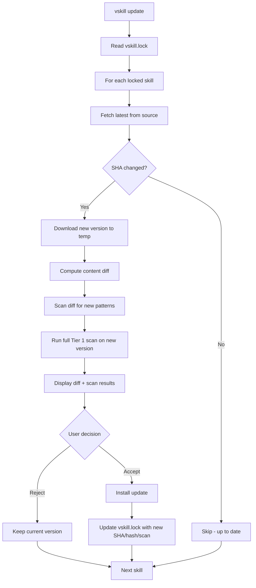
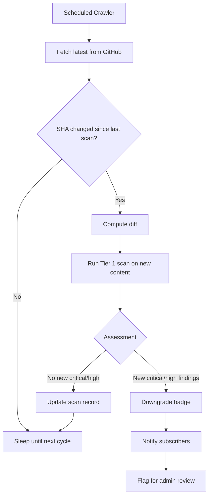

# Version-Pinned Verification Design

**Status**: DRAFT
**Author**: anton.abyzov@gmail.com
**Date**: 2026-02-15
**Satisfies**: AC-US9-01, AC-US9-02, AC-US9-03, AC-US9-04, AC-US9-05 (T-015c)
**Dependencies**: T-008 (Three-Tier Certification), T-015b (vskill CLI Design)

---

## 1. Overview

Version-pinned verification solves the **update poisoning** attack: a skill passes verification at v1.0, then silently injects malware at v1.2 while the "verified" badge persists. Skills.sh has zero versioning — `npx skills add` always gets HEAD of main, and the symlink architecture means upstream pushes silently change all agents.

**Core principle**: Verification is **per-version**, not per-skill. A badge reads "verified at v1.3.0" — never just "verified."

---

## 2. Lock File Schema (`vskill.lock`)

### 2.1 Format

The lock file is a JSON file committed to the project repository, enabling team-wide version consistency (similar to `package-lock.json`).

```json
{
  "lockVersion": 1,
  "generatedAt": "2026-02-15T18:00:00Z",
  "generatedBy": "vskill@0.1.0",
  "skills": {
    "anthropics/skills/frontend-design": {
      "version": "1.3.0",
      "source": "github",
      "sourceUrl": "https://github.com/anthropics/skills",
      "skillPath": "skills/frontend-design/SKILL.md",
      "gitSha": "abc123def456789012345678901234567890abcd",
      "treeSha": "tree123def456789012345678901234567890ab",
      "contentHash": "sha256:e3b0c44298fc1c149afbf4c8996fb92427ae41e4649b934ca495991b7852b855",
      "installedAt": "2026-02-15T18:00:00Z",
      "updatedAt": "2026-02-15T18:00:00Z",
      "scan": {
        "tier": "verified",
        "method": "vendor-auto",
        "scannedAt": "2026-02-15T18:00:00Z",
        "scannerVersion": "0.1.0",
        "patternsChecked": 37,
        "findings": {
          "critical": 0,
          "high": 0,
          "medium": 0,
          "low": 0,
          "info": 0
        },
        "verdict": "PASS",
        "score": null
      },
      "labels": ["verified", "vendor", "safe"],
      "agents": ["claude-code", "cursor", "windsurf"]
    },
    "secondsky/bun-package-manager": {
      "version": "1.0.3",
      "source": "github",
      "sourceUrl": "https://github.com/secondsky/bun-package-manager",
      "skillPath": "SKILL.md",
      "gitSha": "789abc123def456789012345678901234567890d",
      "treeSha": "tree789abc123def456789012345678901234567",
      "contentHash": "sha256:d7a8fbb307d7809469ca9abcb0082e4f8d5651e46d3cdb762d02d0bf37c9e592",
      "installedAt": "2026-02-14T12:00:00Z",
      "updatedAt": "2026-02-14T12:00:00Z",
      "scan": {
        "tier": "scanned",
        "method": "automated-scan",
        "scannedAt": "2026-02-14T12:00:00Z",
        "scannerVersion": "0.1.0",
        "patternsChecked": 37,
        "findings": {
          "critical": 0,
          "high": 0,
          "medium": 2,
          "low": 1,
          "info": 0
        },
        "verdict": "PASS",
        "score": null
      },
      "labels": ["scanned", "warning"],
      "agents": ["claude-code", "cursor"]
    }
  }
}
```

### 2.2 TypeScript Interface

```typescript
interface VskillLockFile {
  /** Lock file format version */
  lockVersion: number;

  /** When the lock file was last modified */
  generatedAt: string;

  /** CLI version that generated this file */
  generatedBy: string;

  /** Locked skills keyed by source/skill-name */
  skills: Record<string, LockedSkill>;
}

interface LockedSkill {
  /** Semantic version (assigned by verified-skill.com or derived from git tag) */
  version: string;

  /** Source type */
  source: 'github' | 'gitlab' | 'git' | 'local' | 'direct-url';

  /** Source URL */
  sourceUrl: string;

  /** Path to SKILL.md within the repository */
  skillPath: string;

  /** Git commit SHA at install time */
  gitSha: string;

  /** GitHub tree SHA for folder-level change detection */
  treeSha: string;

  /** SHA-256 hash of the installed SKILL.md content */
  contentHash: string;

  /** ISO timestamp when first installed */
  installedAt: string;

  /** ISO timestamp when last updated */
  updatedAt: string;

  /** Security scan results at install/update time */
  scan: LockedScanResult;

  /** Trust labels at install time */
  labels: string[];

  /** Agents this skill was installed to */
  agents: string[];
}

interface LockedScanResult {
  /** Verification tier achieved */
  tier: 'scanned' | 'verified' | 'certified';

  /** How verification was performed */
  method: 'automated-scan' | 'llm-judge' | 'manual-review' | 'vendor-auto';

  /** When scan was performed */
  scannedAt: string;

  /** Scanner version used */
  scannerVersion: string;

  /** Number of patterns checked */
  patternsChecked: number;

  /** Finding counts by severity */
  findings: {
    critical: number;
    high: number;
    medium: number;
    low: number;
    info: number;
  };

  /** Overall verdict */
  verdict: 'PASS' | 'FAIL';

  /** Tier 2 LLM judge score (null if Tier 1 only) */
  score: number | null;
}
```

---

## 3. Update Flow with Diff Scan

When a user runs `npx vskill update`, the CLI compares the installed version against the latest remote version and highlights security-relevant changes.

### 3.1 Flow Diagram



### 3.2 Diff Scan — Highlighting New Patterns

The diff scan is the key innovation. Instead of just running a full scan on the new version, it specifically highlights **patterns that were NOT present in the previously verified version**.

```typescript
interface DiffScanResult {
  /** Skills being compared */
  skillName: string;
  fromVersion: string;
  toVersion: string;

  /** Content diff summary */
  diff: {
    linesAdded: number;
    linesRemoved: number;
    linesModified: number;
    sectionsAdded: string[];
    sectionsRemoved: string[];
    sectionsModified: string[];
  };

  /** NEW security patterns not in the previous version */
  newFindings: Finding[];

  /** Patterns that were in the old version and are still present */
  existingFindings: Finding[];

  /** Patterns that were in the old version but removed */
  removedFindings: Finding[];

  /** Full scan result for the new version */
  fullScan: ScanResult;

  /** Risk assessment */
  updateRisk: 'low' | 'medium' | 'high' | 'critical';
}
```

### 3.3 Update Risk Classification

| Risk Level | Criteria | User Action |
|-----------|----------|-------------|
| **Low** | No new findings, patch-level changes only | Auto-accept (with `--yes`) |
| **Medium** | New medium/low findings or minor content changes | Prompt for confirmation |
| **High** | New high findings or scope expansion detected | Require explicit confirmation + show details |
| **Critical** | New critical findings or suspicious patterns | Block update, recommend investigation |

### 3.4 CLI Output for Updates

```
$ npx vskill update

  Checking 3 installed skills...

  react-best-practices (v2.1.0 → v2.2.0)
  ──────────────────────────────────────────
  Content diff:
    + 1 new section: "Server Component patterns" (44 lines)
    ~ 2 modified sections (minor wording changes)
    - 1 removed reference: "getServerSideProps"

  Security diff:
    NEW  MEDIUM  fetch() usage added (line 52)
    NEW  INFO    import statement added (line 46)

  Full scan: PASS (37 patterns, 0 critical/high)
  Update risk: LOW

  [Y] Accept update  [N] Skip  [D] Full diff

  bun-package-manager (v1.0.3 → v1.1.0)
  ──────────────────────────────────────────
  Content diff:
    + 1 new section: "Advanced configuration" (28 lines)
    ~ Modified: "Installation" section

  Security diff:
    NEW  HIGH  eval() usage added (line 89) — REVIEW REQUIRED
    Existing: 2 medium findings unchanged

  Full scan: PASS (37 patterns, 1 high)
  Update risk: HIGH

  [Y] Accept (not recommended)  [N] Skip  [D] Full diff

  clean-code (v1.5.0) — Up to date ✓
```

---

## 4. Per-Version Badges

### 4.1 Badge Format

Badges always include the version they apply to:

```
[verified | v1.3.0]     — NOT just [verified]
[certified | v2.0.0]   — NOT just [certified]
[scanned | v1.0.3]     — NOT just [scanned]
```

### 4.2 Badge API

```
GET /api/v1/badges/{skill-name}.svg             → Latest verified version
GET /api/v1/badges/{skill-name}/{version}.svg    → Specific version badge
GET /api/v1/badges/{skill-name}/latest.json      → Latest version info
GET /api/v1/badges/{skill-name}/versions.json    → All version history
```

### 4.3 Badge Version Resolution

```typescript
function resolveBadgeVersion(skillName: string, requestedVersion?: string): BadgeInfo {
  if (requestedVersion) {
    // Return badge for specific version
    return getBadgeForVersion(skillName, requestedVersion);
  }

  // Find highest-tier verified version
  const versions = getVersionHistory(skillName);
  const best = versions
    .filter(v => v.tier !== 'rejected')
    .sort((a, b) => TIER_ORDER[b.tier] - TIER_ORDER[a.tier] || semverCompare(b.version, a.version))
    [0];

  return {
    version: best.version,
    tier: best.tier,
    text: `${best.tier} | v${best.version}`,
  };
}
```

### 4.4 Version History Display

```
VERSION HISTORY: react-best-practices
──────────────────────────────────────────────
v2.2.0  [VERIFIED]   Feb 15, 2026  Score: 94  0 findings
v2.1.0  [VERIFIED]   Feb 01, 2026  Score: 92  0 findings
v2.0.0  [VERIFIED]   Jan 15, 2026  Score: 88  1 info finding
v1.5.0  [SCANNED]    Dec 10, 2025  —          0 findings
v1.0.0  [SCANNED]    Nov 01, 2025  —          2 low findings
```

---

## 5. Continuous Monitoring

### 5.1 Overview

verified-skill.com continuously monitors registered skills for suspicious updates. When a previously verified skill receives an update that introduces concerning patterns, the badge is automatically downgraded.

### 5.2 Monitoring Pipeline



### 5.3 Downgrade Rules

| Condition | From | To | Action |
|-----------|------|----|--------|
| New critical finding in update | Verified/Certified | Scanned | Auto-downgrade, notify |
| New high finding in update | Certified | Verified | Auto-downgrade, notify |
| Content hash mismatch | Any | Scanned | Tamper detection, investigate |
| Certification expired (6mo) | Certified | Verified | Auto-downgrade |
| Author account suspended | Any | Rejected | Platform action |
| Org trust revoked | Verified (vendor) | Scanned | Admin action |

### 5.4 Monitoring Schedule

| Tier | Check Frequency | Rationale |
|------|----------------|-----------|
| Certified | Every 6 hours | Highest trust = highest vigilance |
| Verified | Every 24 hours | Regular monitoring |
| Scanned | Every 72 hours | Lower priority but still monitored |
| Vendor | Every 24 hours | Trust but verify |

### 5.5 Notification on Downgrade

When a badge is downgraded, the following parties are notified:

1. **Skill author** (if email provided): "Your skill X was downgraded from Verified to Scanned due to new critical findings in the latest commit."
2. **Subscribers** (users who installed via vskill): CLI warning on next run
3. **Admin dashboard**: Flagged for review

---

## 6. CLI Warnings for Downgraded Skills

### 6.1 On-Run Check

Every time vskill runs any command, it performs a quick check against the registry for any badge changes:

```typescript
async function checkBadgeStatus(lockFile: VskillLockFile): Promise<BadgeAlert[]> {
  const alerts: BadgeAlert[] = [];

  for (const [key, skill] of Object.entries(lockFile.skills)) {
    const current = await fetchCurrentBadge(key);
    if (!current) continue;

    const installedTier = TIER_ORDER[skill.scan.tier];
    const currentTier = TIER_ORDER[current.tier];

    if (currentTier < installedTier) {
      alerts.push({
        skillName: key,
        installedTier: skill.scan.tier,
        currentTier: current.tier,
        reason: current.downgradeReason,
        message: `WARNING: ${key} downgraded from ${skill.scan.tier} to ${current.tier}`,
      });
    }
  }

  return alerts;
}
```

### 6.2 Warning Display

```
$ npx vskill list

  ⚠ BADGE ALERTS
  ────────────────────────────────────────────
  bun-package-manager: DOWNGRADED
    Was: VERIFIED (at install time)
    Now: SCANNED (as of Feb 15, 2026)
    Reason: New critical finding detected in v1.1.0 (eval() usage)
    Action: Run `npx vskill scan bun-package-manager` for details

  INSTALLED SKILLS
  ────────────────────────────────────────────
  react-best-practices  v2.1.0  [VERIFIED]
  bun-package-manager   v1.0.3  [SCANNED ↓]  ⚠ Downgraded
  clean-code            v1.5.0  [CERTIFIED]

  3 skills installed (1 alert)
```

### 6.3 Alert Persistence

- Alerts persist until the user acknowledges them: `npx vskill acknowledge bun-package-manager`
- Or until the issue is resolved (skill re-verified at same or higher tier)
- Acknowledgment recorded in `vskill.lock`:

```json
{
  "acknowledged": {
    "bun-package-manager": {
      "at": "2026-02-15T19:00:00Z",
      "fromTier": "verified",
      "toTier": "scanned",
      "reason": "User accepted risk"
    }
  }
}
```

---

## 7. Content Hashing

### 7.1 Hash Algorithm

SHA-256 hash of the entire SKILL.md file content (normalized):

```typescript
function computeContentHash(content: string): string {
  // Normalize: trim, normalize line endings to \n
  const normalized = content.trim().replace(/\r\n/g, '\n');
  const hash = createHash('sha256').update(normalized, 'utf8').digest('hex');
  return `sha256:${hash}`;
}
```

### 7.2 Hash Usage

| Context | Purpose |
|---------|---------|
| **Lock file** | Detect local tampering (installed content ≠ locked hash) |
| **Version comparison** | Determine if content actually changed between versions |
| **Badge verification** | Confirm badge applies to specific content |
| **Continuous monitoring** | Detect upstream content changes |

### 7.3 Integrity Check

```
$ npx vskill verify

  INTEGRITY CHECK
  ────────────────────────────────────────────
  react-best-practices  ✓  Content matches lock file hash
  bun-package-manager   ✓  Content matches lock file hash
  clean-code            ✗  Content modified locally!
    Lock hash:    sha256:d7a8fbb...
    Current hash: sha256:e5b9c00...
    Action: Run `npx vskill update clean-code` to re-sync
```

---

## 8. Comparison with Skills.sh Lock File

| Feature | Skills.sh (`skill-lock.json`) | vskill (`vskill.lock`) |
|---------|-------------------------------|----------------------|
| **Format** | JSON | JSON |
| **Version** | v3 (wiped on upgrade) | v1 (migration support) |
| **Hash type** | GitHub tree SHA (folder-level) | SHA-256 content hash + git SHA + tree SHA |
| **Scope** | Global installs only | Project + global |
| **Security scan** | None | Full scan results stored |
| **Version tracking** | None (tree SHA only) | Semantic version + content hash |
| **Diff scanning** | None | Full diff with pattern highlighting |
| **Badge tracking** | None | Tier, labels, method |
| **Agent tracking** | Last selected agents only | Per-skill agent list |
| **Committable** | No (~/ location) | Yes (project root) |
| **Branch safety** | Assumes `main` always | Records branch at install |
| **Tamper detection** | None | Content hash verification |

---

## 9. Migration from Skills.sh

For users migrating from `npx skills` to `npx vskill`:

```
$ npx vskill migrate

  Scanning for existing skills installations...

  Found Skills.sh lock file: ~/.agents/.skill-lock.json (3 skills)
  Found installed skills in:
    ~/.claude/skills/ (3 skills)
    ~/.cursor/skills/ (3 skills)

  MIGRATION PLAN
  ────────────────────────────────────────────
  1. Import 3 skills from Skills.sh lock file
  2. Scan each skill (Tier 1)
  3. Create vskill.lock with results
  4. No files will be moved or modified

  Proceed? [Y/n]

  Scanning react-best-practices... PASS [VERIFIED - vendor]
  Scanning bun-package-manager...  PASS [SCANNED - 2 medium]
  Scanning clean-code...           PASS [SCANNED - 0 findings]

  Created: vskill.lock (3 skills)
  Migration complete. Run `npx vskill list` to verify.
```

---

## 10. References

- [Three-Tier Certification](./three-tier-certification.md) — Tier definitions and pass criteria
- [vskill CLI Design](./vskill-cli-design.md) — CLI commands and user flows
- [Trust Labels & Badges](./trust-labels-badges.md) — Badge specifications
- [Skills.sh Installer Internals](./skills-sh-installer-internals.md) — Current lock file design (v3)
- [AD-7: Version-Pinned Verification](../plan.md) — Architecture decision
