# Enterprise Application Development 101

## What is an Enterprise Application?

An **enterprise application** is a large-scale software system designed to operate in corporate environments, serving the complex needs of organizations rather than individual consumers. These applications are mission-critical systems that power core business operations.

### Common Examples

**E-Commerce Platforms**
- Amazon, Shopify, eBay
- Handle millions of transactions daily
- Manage inventory, payments, shipping, customer data
- Require 24/7 availability

**Banking Systems**
- Online banking, mobile banking apps
- Process financial transactions with strict accuracy
- Must comply with regulations (PCI-DSS, SOX)
- Handle sensitive customer data

**Healthcare Systems**
- Electronic Health Records (EHR)
- Patient management systems
- Comply with HIPAA regulations
- Integrate with insurance, labs, pharmacies

**SaaS Platforms**
- Salesforce, Microsoft 365, Slack
- Multi-tenant architecture (one system, many customers)
- Subscription billing, user management
- High reliability expectations

**Enterprise Resource Planning (ERP)**
- SAP, Oracle, NetSuite
- Manage company-wide operations (HR, finance, supply chain)
- Integration with multiple departments
- Long-term data retention requirements

## Why Enterprise Apps Are Different

Enterprise applications operate at a fundamentally different scale and with different constraints than personal projects or small applications.

### Comparison: Simple App vs Enterprise App

| Aspect | Simple App | Enterprise App |
|--------|-----------|----------------|
| **Users** | Tens to hundreds | Thousands to millions |
| **Data Volume** | MBs to GBs | TBs to PBs |
| **Uptime Requirement** | 95-98% (some downtime acceptable) | 99.9%+ (43 minutes max downtime/month) |
| **Security** | Basic authentication | Multi-layer security, compliance (HIPAA, SOC 2) |
| **Team Size** | 1-5 developers | 10-100+ developers across multiple teams |
| **Lifespan** | 1-2 years | 5-10+ years (decades for some systems) |
| **Cost of Failure** | Minor inconvenience | Revenue loss, legal liability, reputational damage |
| **Testing** | Manual testing, basic [unit tests](/docs/glossary/terms/unit-testing) | Automated test suites, 80%+ [coverage](/docs/glossary/terms/test-coverage) |
| **Deployment** | Manual deploy, single server | [CI/CD](/docs/glossary/terms/ci-cd) pipelines, multiple environments (dev/staging/prod) |
| **Documentation** | README, inline comments | Comprehensive docs, architecture diagrams, [ADRs](/docs/glossary/terms/adr) |
| **Monitoring** | Basic error logs | Centralized logging, metrics dashboards, alerting |

### Key Characteristics

**Scale**
- Must handle peak loads (Black Friday, tax season)
- Database queries optimized for millions of records
- Infrastructure auto-scales based on demand

**Reliability**
- Redundancy (multiple servers, databases)
- Failover mechanisms (automatic recovery)
- Disaster recovery plans (backup data centers)

**Security**
- Defense in depth (multiple security layers)
- Regular security audits and penetration testing
- Compliance certifications required

**Maintainability**
- Code must be readable by new team members
- Architecture decisions documented (ADRs)
- Modular design enables safe changes

**Integration**
- Connect with third-party services (payment gateways, email providers)
- Internal system integrations (CRM, ERP, analytics)
- API-first design for extensibility

## Typical Enterprise Application Architecture

### The 3-Tier Architecture

The foundation of most enterprise applications is the **3-tier architecture**, which separates concerns into three distinct layers:

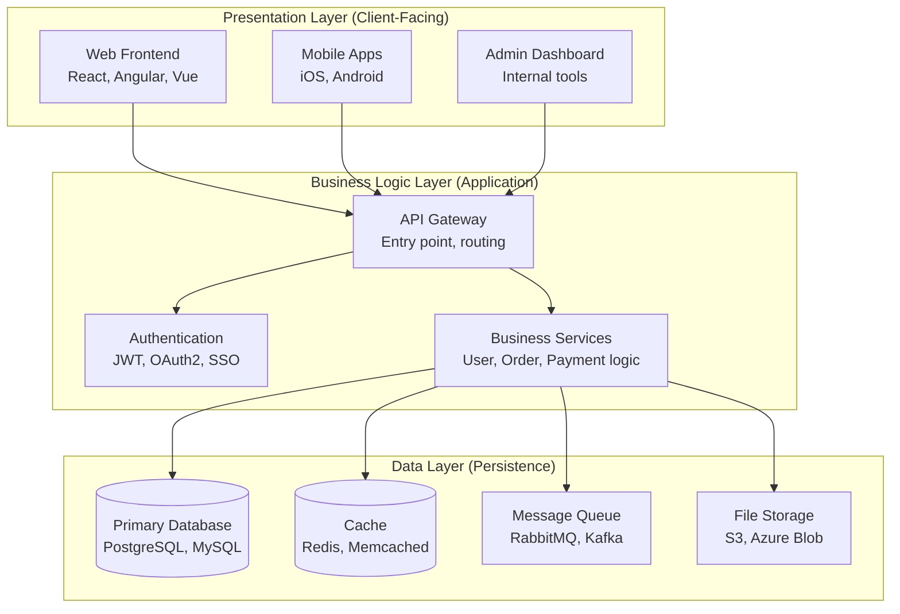

**Presentation Layer**
- User interfaces (web, mobile, desktop)
- Renders data from API
- Handles user interactions
- Stateless (no business logic)

**Business Logic Layer**
- Core application logic
- Business rules enforcement
- Data validation
- API endpoints

**Data Layer**
- Persistent storage (databases)
- Caching for performance
- Message queues for async tasks
- File/blob storage

**Benefits**
- Clear separation of concerns
- Each layer can scale independently
- Easy to swap implementations (e.g., change database)
- Parallel development (frontend/backend teams)

### Modern Microservices Architecture

As applications grow, the monolithic business logic layer often splits into **[microservices](/docs/glossary/terms/microservices)**—small, independent services that each handle a specific business capability.

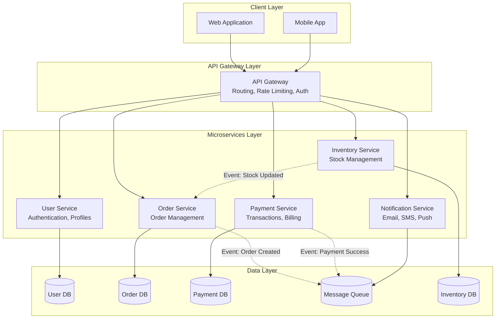

**Key Principles**

**Single Responsibility**
- Each service does ONE thing well
- User service handles authentication, not payments
- Clear boundaries reduce complexity

**Independent Deployment**
- Update payment service without restarting user service
- Faster release cycles
- Reduced risk (isolated failures)

**Technology Diversity**
- User service in Node.js, payment service in Java
- Choose best tool for each job
- Gradual technology migration

**Decentralized Data**
- Each service owns its database
- No shared database (prevents coupling)
- Data consistency via events

## The Software Development Lifecycle (SDLC)

Enterprise applications follow a structured development process to manage complexity and ensure quality.

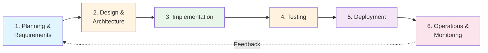

### Phase 1: Planning & Requirements

**Goal**: Understand WHAT to build and WHY

**Activities**
- Stakeholder interviews (business teams, customers)
- Market research and competitive analysis
- Defining success metrics (KPIs)
- Prioritizing features (MoSCoW method)

**Key Artifacts**
- **Product Requirements Document (PRD)**: Business objectives, target users, success criteria
- **[User Stories](/docs/glossary/terms/user-stories)**: "As a [user], I want [feature] so that [benefit]"
- **[Acceptance Criteria](/docs/glossary/terms/acceptance-criteria)**: Measurable conditions for done

**Example User Story**
```
As an e-commerce customer,
I want to save items to a wishlist,
So that I can purchase them later without searching again.

Acceptance Criteria:
- AC-001: User can add items to wishlist from product page
- AC-002: Wishlist persists across sessions (logged-in users)
- AC-003: User can remove items from wishlist
- AC-004: User receives email if wishlist item goes on sale
```

**SpecWeave Integration**
- `/sw:increment "Add wishlist feature"` creates `spec.md`
- PM agent generates user stories with AC-IDs
- Traceability from requirements to tests

### Phase 2: Design & Architecture

**Goal**: Decide HOW to build it (technical approach)

**Activities**
- High-Level Design (HLD): System architecture, component interactions
- Low-Level Design (LLD): Class diagrams, [API](/docs/glossary/terms/api) contracts, database schema
- Technology stack selection (languages, frameworks, databases)
- Architecture Decision Records ([ADRs](/docs/glossary/terms/adr)): Document WHY we chose X over Y

**Key Artifacts**
- **Architecture Diagrams**: C4 model (context, container, component, code)
- **API Specifications**: OpenAPI/Swagger docs
- **Database Schema**: ER diagrams, table definitions
- **ADRs**: Decision rationale (e.g., "Why PostgreSQL over MongoDB")

**Example ADR**
```
ADR-005: Use PostgreSQL for Order Database

Context: Need reliable transactional database for order management

Decision: PostgreSQL

Rationale:
- ACID compliance (critical for financial data)
- Mature tooling (pg_dump, replication)
- JSON support (flexible schema for metadata)
- Team expertise (faster development)

Alternatives Considered:
- MongoDB: No transactions, eventual consistency risk
- MySQL: Weaker JSON support

Status: Accepted
```

**SpecWeave Integration**
- Architect agent creates `plan.md` with HLD/LLD
- ADRs stored in `.specweave/docs/internal/architecture/adr/`
- Diagrams auto-generated with Mermaid

### Phase 3: Implementation

**Goal**: Write the code that implements the design

**Activities**
- Setting up development environment
- Writing application code
- Writing unit tests ([TDD](/docs/glossary/terms/tdd): test-first approach)
- Code reviews (peer validation)
- Continuous integration (automated build/test)

**Best Practices**
- **Small commits**: Atomic changes, easy to review
- **Branch strategy**: Feature branches, PR-based workflow
- **Code standards**: Linting, formatting (ESLint, Prettier)
- **Documentation**: Inline comments for complex logic

**Example: Feature Branch Workflow**
```bash
# 1. Create feature branch from main
git checkout -b feature/wishlist-backend

# 2. Implement feature in small commits
git commit -m "feat: add Wishlist model"
git commit -m "feat: add POST /wishlist endpoint"
git commit -m "test: add unit tests for wishlist service"

# 3. Push and create Pull Request
git push origin feature/wishlist-backend

# 4. Code review → approval → merge to main
```

**SpecWeave Integration**
- `/sw:do` executes tasks from `tasks.md`
- Embedded test plans (BDD format)
- AC-ID traceability (spec → task → test)

### Phase 4: Testing

**Goal**: Verify the system works correctly

**Testing Levels**

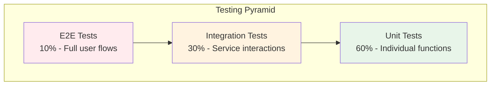

**Unit Tests**
- Test individual functions in isolation
- Fast (milliseconds)
- High coverage (80-90%)
- Example: `isValidEmail()` function

**Integration Tests**
- Test service interactions
- Database, API endpoints
- Moderate speed (seconds)
- Example: POST /users endpoint saves to DB

**[End-to-End (E2E)](/docs/glossary/terms/e2e) Tests**
- Test complete user workflows
- Browser automation ([Playwright](/docs/glossary/terms/playwright), Cypress)
- Slow (minutes)
- Example: User signup → login → add to cart → checkout

**Non-Functional Tests**
- **Performance**: Load testing (can handle 10K concurrent users?)
- **Security**: Penetration testing, vulnerability scans
- **Accessibility**: WCAG compliance (screen readers)

**SpecWeave Integration**
- Tests embedded in `tasks.md`
- BDD format: Given/When/Then
- Coverage targets per task (80-90%)
- `/sw:validate-coverage` checks completeness

### Phase 5: Deployment

**Goal**: Deliver code to production safely

**Modern CI/CD Pipeline**

```mermaid
graph LR
    Commit[Code Commit] --> Build[Build & Compile]
    Build --> UnitTest[Run Unit Tests]
    UnitTest --> IntegTest[Run Integration Tests]
    IntegTest --> Staging[Deploy to Staging]
    Staging --> E2ETest[Run E2E Tests]
    E2ETest --> Approval[Manual Approval]
    Approval --> Prod[Deploy to Production]
    Prod --> Monitor[Monitor & Rollback if Needed]

    style Commit fill:#e3f2fd
    style Build fill:#f3e5f5
    style UnitTest fill:#e8f5e9
    style IntegTest fill:#fff3e0
    style Staging fill:#fce4ec
    style E2ETest fill:#fff3e0
    style Approval fill:#ffebee
    style Prod fill:#c8e6c9
    style Monitor fill:#b2ebf2
```

**Environments**
- **Development**: Developer local machines
- **Staging**: Production-like environment for testing
- **Production**: Live system serving real users

**Deployment Strategies**
- **Blue-Green**: Two production environments, switch traffic instantly
- **Canary**: Roll out to 5% of users, then 50%, then 100%
- **Rolling**: Update servers one at a time (no downtime)

**[Infrastructure as Code (IaC)](/docs/glossary/terms/iac)**
- Define infrastructure in code ([Terraform](/docs/glossary/terms/terraform), CloudFormation)
- Version control for infrastructure
- Reproducible deployments

**SpecWeave Integration**
- GitHub Actions integration
- Automated living docs sync post-deployment
- DORA metrics tracking (deployment frequency, lead time)

### Phase 6: Operations & Monitoring

**Goal**: Keep the system running reliably

**Observability Pillars**

**Logging**
- Structured logs (JSON format)
- Centralized aggregation (ELK Stack, Splunk)
- Error tracking (Sentry, Rollbar)

**Metrics**
- Application metrics (request rate, latency, error rate)
- Infrastructure metrics (CPU, memory, disk)
- Business metrics (revenue, conversions)
- Dashboards (Grafana, Datadog)

**Alerting**
- On-call rotation (PagerDuty, Opsgenie)
- SLA/SLO tracking (99.9% uptime)
- Incident response runbooks

**Example Alert**
```
Alert: API Error Rate > 5%
Current: 12% (120 errors/min)
Impact: Users cannot checkout
Runbook: https://docs.company.com/runbooks/api-errors
Assigned: On-Call Engineer
```

**SpecWeave Integration**
- Living docs stay current (post-task completion hook)
- Incident documentation (ADRs for root cause)
- Operational runbooks in `.specweave/docs/internal/operations/`

## Roles in Enterprise Development

Enterprise applications require diverse expertise across multiple roles:

| Role | Responsibilities | Skills | SpecWeave Agent |
|------|-----------------|--------|-----------------|
| **Product Manager (PM)** | Define requirements, prioritize features, stakeholder communication | Business analysis, user research, roadmap planning | PM Agent (spec) |
| **Software Architect** | Design system architecture, technology decisions, ADRs | System design, scalability, trade-off analysis | Architect Agent (plan) |
| **Backend Developer** | Implement [APIs](/docs/glossary/terms/api), business logic, database design | Java, Python, [Node.js](/docs/glossary/terms/nodejs), SQL, API design | Tech Lead Agent (tasks) |
| **Frontend Developer** | Build user interfaces, client-side logic | [React](/docs/glossary/terms/react), [Angular](/docs/glossary/terms/angular), Vue, [TypeScript](/docs/glossary/terms/typescript), CSS | Frontend Agent (plugin) |
| **DevOps Engineer** | [CI/CD](/docs/glossary/terms/ci-cd) pipelines, infrastructure, deployment automation | [Docker](/docs/glossary/terms/docker), [Kubernetes](/docs/glossary/terms/kubernetes), [Terraform](/docs/glossary/terms/terraform), AWS/Azure | DevOps Agent (plugin) |
| **QA Engineer** | Test planning, automation, quality assurance | Selenium, Playwright, test frameworks | QA Agent (plugin) |
| **Security Engineer** | Security audits, compliance, threat modeling | OWASP, penetration testing, cryptography | Security Agent (plugin) |
| **Data Engineer** | Data pipelines, ETL, analytics infrastructure | Spark, Airflow, SQL, data modeling | Data Agent (plugin) |
| **SRE (Site Reliability Engineer)** | Production reliability, incident response, monitoring | Linux, networking, distributed systems | SRE Agent (plugin) |

**SpecWeave Connection**
- Core agents (PM, Architect, Tech Lead) mirror real-world roles
- Plugin agents extend to specialized domains (ML, payments, infrastructure)
- Agents produce artifacts in standard formats (spec.md, plan.md, tasks)

## Common Enterprise Patterns

### 1. API-First Development

**Concept**: Design the API contract BEFORE implementing frontend or backend.

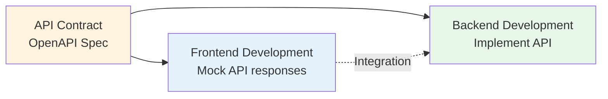

**Benefits**
- Parallel development (frontend/backend teams)
- Clear contract prevents integration issues
- API documentation auto-generated

**Example OpenAPI Spec**
```yaml
openapi: 3.0.0
paths:
  /wishlist:
    post:
      summary: Add item to wishlist
      requestBody:
        content:
          application/json:
            schema:
              type: object
              properties:
                productId:
                  type: string
      responses:
        201:
          description: Item added
        400:
          description: Invalid product ID
```

### 2. Database-Per-Service (Microservices)

**Concept**: Each microservice owns its database, no shared database.

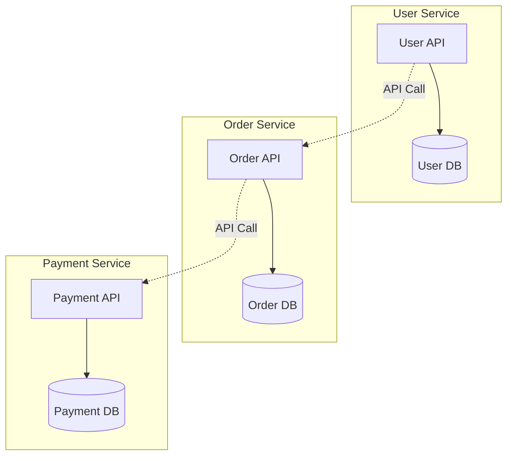

**Benefits**
- Services can evolve independently
- Technology diversity (Postgres, MongoDB, Redis)
- Fault isolation (payment DB down doesn't break user service)

**Trade-offs**
- No SQL joins across services
- Data consistency challenges (eventual consistency)
- Distributed transactions complexity

### 3. Event-Driven Architecture

**Concept**: Services communicate via events instead of direct API calls.

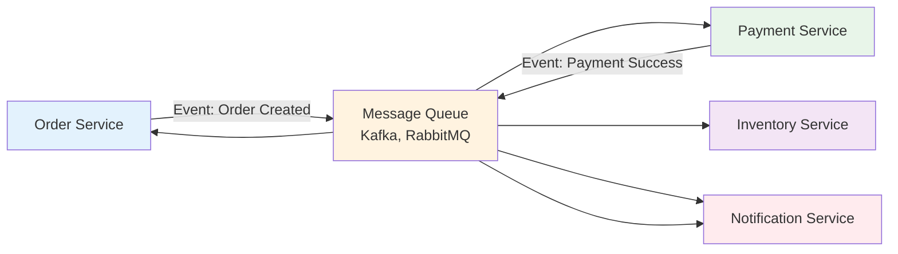

**Benefits**
- Loose coupling (services don't know about each other)
- Resilience (if inventory service is down, event waits in queue)
- Scalability (add more consumers for popular events)

**Use Cases**
- Order processing pipelines
- Real-time notifications
- Data synchronization
- Audit logging

### 4. Circuit Breaker Pattern

**Concept**: Prevent cascading failures when a service is down.

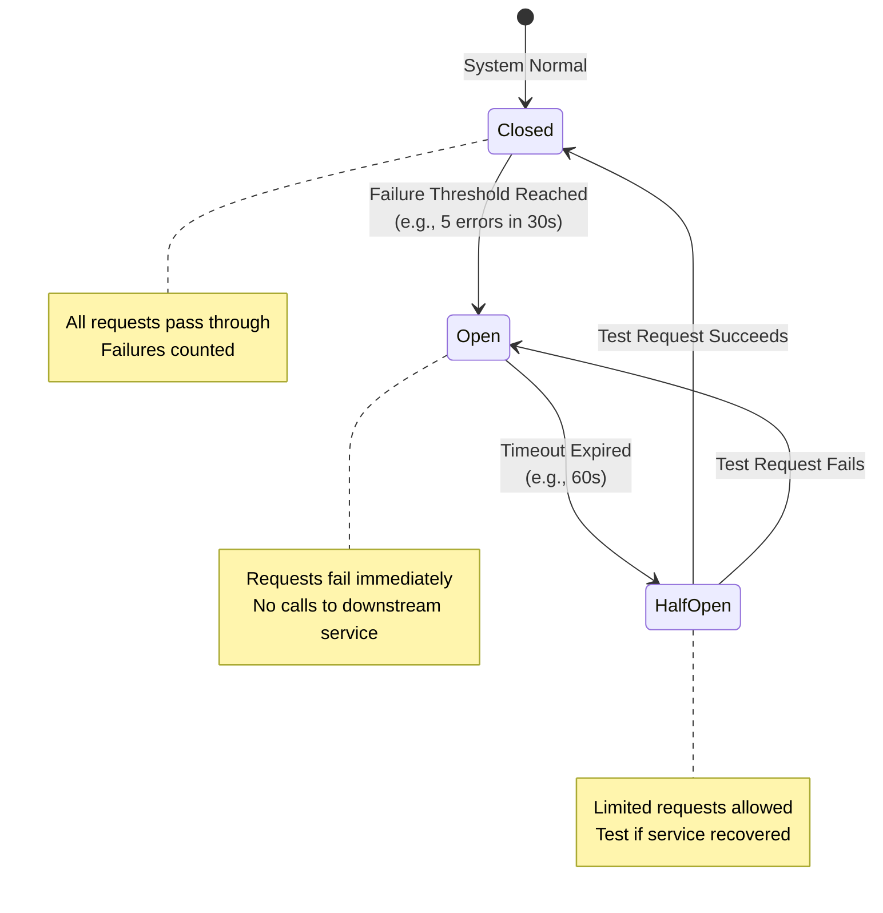

**Benefits**
- Fast failure (don't wait for timeout)
- Service recovery time (stops overwhelming broken service)
- Graceful degradation (show cached data instead of error)

### 5. CQRS (Command Query Responsibility Segregation)

**Concept**: Separate read and write operations into different models.

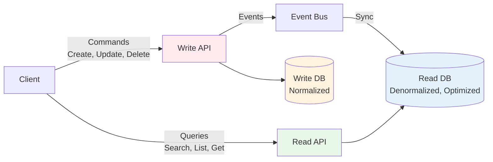

**Benefits**
- Optimized databases for each use case (write DB normalized, read DB denormalized)
- Independent scaling (read-heavy apps scale read replicas)
- Complex queries don't affect write performance

**Use Cases**
- E-commerce product catalogs (millions of reads, few writes)
- Analytics dashboards (complex queries)
- Audit systems (append-only writes, complex reporting)

## Documentation Strategy

### Why Documentation Matters

**Knowledge Sharing**
- New developers onboard faster (30 days → 7 days with good docs)
- Team alignment (everyone understands the "why")
- Reduce bus factor (no single point of failure)

**Future Maintenance**
- "Why did we choose Redis?" → ADR explains the reasoning
- "How does authentication work?" → Architecture diagram shows flow
- 6 months later: "What did this code do?" → Inline comments help

**Compliance Requirements**
- FDA (medical devices): Traceability from requirements to code
- SOC 2 (security): Document access controls, incident response
- HIPAA (healthcare): Audit trails for data access

**Incident Response**
- Runbooks guide on-call engineers
- Architecture diagrams help diagnose issues
- Historical decisions (ADRs) provide context

### Documentation Hierarchy

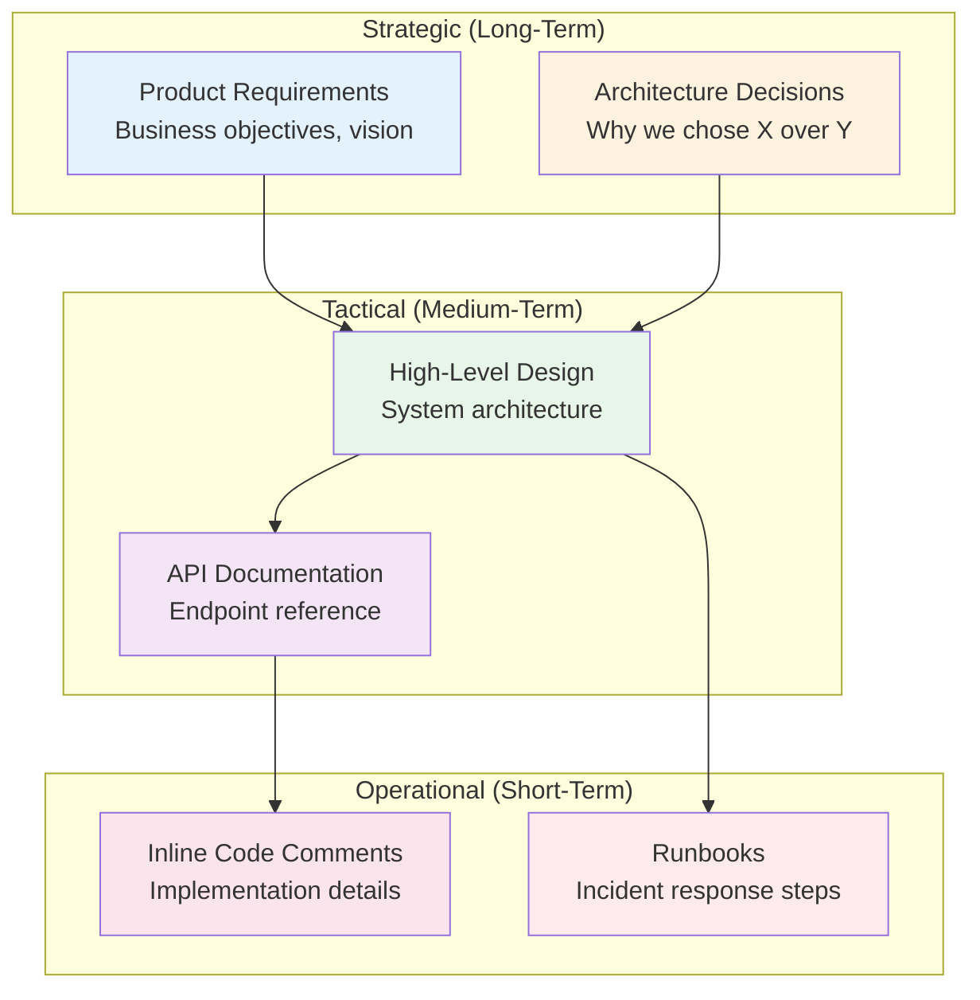

**SpecWeave's Living Documentation**

Traditional problem: Docs become stale
```
Week 1: Write docs
Week 2: Update code, forget to update docs
Month 1: Docs are 50% wrong
Year 1: Docs are 90% wrong, no one trusts them
```

SpecWeave solution: Auto-sync after every task
```
Task completes → post-task-completion hook fires → living docs sync
- ADRs updated (Proposed → Accepted)
- Architecture diagrams regenerated
- API docs refreshed
- Always current, always trusted
```

## Real-World Example: E-Commerce Platform

Let's build a complete e-commerce platform to see how enterprise concepts come together.

### System Architecture

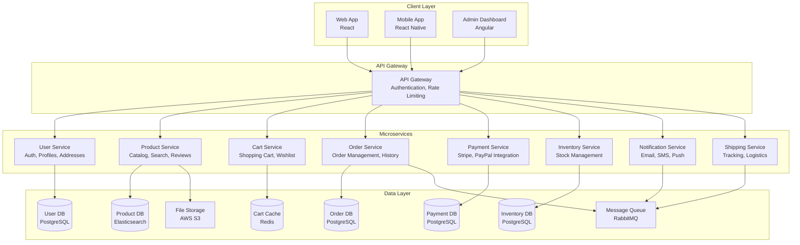

### User Checkout Flow (Detailed)

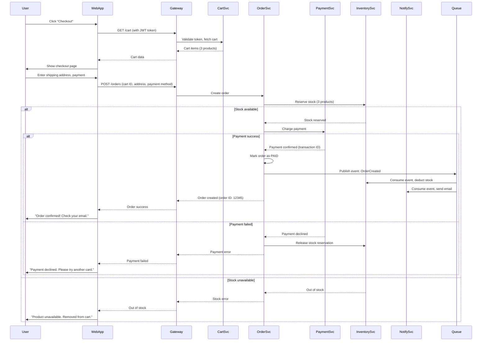

### Service Responsibilities

**User Service**
- Authentication (JWT tokens, OAuth2)
- User profiles (name, email, preferences)
- Address management (shipping, billing)
- Password reset, email verification

**Product Service**
- Product catalog (100K+ products)
- Search (Elasticsearch for fast full-text search)
- Reviews and ratings
- Image storage (S3)

**Cart Service**
- Shopping cart (Redis for fast access)
- Wishlist
- Cart expiration (7 days)
- Session-based carts (guest users)

**Order Service**
- Order creation, status tracking
- Order history
- Cancellation, returns
- Integration with shipping service

**Payment Service**
- Stripe, PayPal integration
- PCI-DSS compliance (never store card numbers)
- Refund processing
- Transaction history

**Inventory Service**
- Stock levels (real-time)
- Warehouse management
- Restock alerts
- Stock reservation (during checkout)

**Notification Service**
- Email (SendGrid, Mailgun)
- SMS (Twilio)
- Push notifications (Firebase)
- Templates (order confirmation, shipping updates)

**Shipping Service**
- Carrier integration (FedEx, UPS, USPS)
- Tracking number generation
- Shipping cost calculation
- Delivery time estimates

### Data Models (Simplified)

**User Service**
```sql
CREATE TABLE users (
    id UUID PRIMARY KEY,
    email VARCHAR(255) UNIQUE NOT NULL,
    password_hash VARCHAR(255) NOT NULL,
    first_name VARCHAR(100),
    last_name VARCHAR(100),
    created_at TIMESTAMP DEFAULT NOW(),
    updated_at TIMESTAMP DEFAULT NOW()
);

CREATE TABLE addresses (
    id UUID PRIMARY KEY,
    user_id UUID REFERENCES users(id),
    street VARCHAR(255),
    city VARCHAR(100),
    state VARCHAR(50),
    zip_code VARCHAR(20),
    country VARCHAR(50),
    is_default BOOLEAN DEFAULT FALSE
);
```

**Order Service**
```sql
CREATE TABLE orders (
    id UUID PRIMARY KEY,
    user_id UUID NOT NULL,
    status VARCHAR(50), -- PENDING, PAID, SHIPPED, DELIVERED, CANCELLED
    total_amount DECIMAL(10,2),
    shipping_address_id UUID,
    payment_method VARCHAR(50),
    payment_transaction_id VARCHAR(255),
    created_at TIMESTAMP DEFAULT NOW(),
    updated_at TIMESTAMP DEFAULT NOW()
);

CREATE TABLE order_items (
    id UUID PRIMARY KEY,
    order_id UUID REFERENCES orders(id),
    product_id UUID,
    quantity INT,
    unit_price DECIMAL(10,2),
    subtotal DECIMAL(10,2)
);
```

### API Endpoints (Sample)

```
# User Service
POST   /auth/signup
POST   /auth/login
POST   /auth/logout
GET    /users/:id
PUT    /users/:id
GET    /users/:id/addresses
POST   /users/:id/addresses

# Product Service
GET    /products
GET    /products/:id
POST   /products (admin only)
GET    /products/search?q=laptop
POST   /products/:id/reviews

# Cart Service
GET    /cart
POST   /cart/items
DELETE /cart/items/:id
POST   /cart/clear

# Order Service
POST   /orders
GET    /orders/:id
GET    /orders (user's order history)
PUT    /orders/:id/cancel

# Payment Service
POST   /payments (internal only, called by order service)
POST   /refunds (admin only)
```

### Development Workflow with SpecWeave

**Phase 1: Planning**
```bash
# PM creates increment
/sw:increment "Add wishlist feature"

# Generates spec.md with:
# - User stories (US-001: Save items to wishlist)
# - Acceptance criteria (AC-US1-01: User can add/remove items)
# - Success metrics (wishlist adoption rate > 30%)
```

**Phase 2: Design**
```bash
# Architect reviews spec, creates plan.md with:
# - HLD: Wishlist table in Cart Service
# - API design: POST /wishlist, GET /wishlist, DELETE /wishlist/:id
# - Database schema
# - ADR: Why Cart Service owns wishlist (not User Service)
```

**Phase 3: Implementation**
```bash
# Tech Lead generates tasks.md with embedded tests:
# - T-001: Create Wishlist table (unit tests, 90% coverage)
# - T-002: Add POST /wishlist endpoint (integration tests, 85% coverage)
# - T-003: Add GET /wishlist endpoint (E2E tests, critical path)
# - T-004: Update frontend (Playwright tests)
# - T-005: Documentation update

# Execute tasks
/sw:do

# Claude Code implements T-001, T-002, etc.
# After each task: post-task-completion hook syncs living docs
```

**Phase 4: Testing**
```bash
# Validate test coverage
/sw:validate-coverage

# Output:
# ✅ T-001: 92% coverage (target: 90%)
# ✅ T-002: 87% coverage (target: 85%)
# ✅ T-003: 100% E2E critical path
# ✅ T-004: Playwright tests passing
# ✅ Overall: 89% coverage (target: 85%)
```

**Phase 5: Deployment**
```bash
# CI/CD pipeline (GitHub Actions)
# - Build → Unit tests → Integration tests → Deploy to staging
# - E2E tests on staging → Manual approval → Deploy to production
# - Post-deployment: Living docs sync, DORA metrics update
```

**Phase 6: Operations**
```bash
# Monitoring dashboard shows:
# - Wishlist creation rate: 1,200/hour
# - API latency: P95 = 120ms (target: &lt;200ms)
# - Error rate: 0.3% (target: &lt;1%)

# Living docs automatically updated:
# - ADR-012: Wishlist in Cart Service (Proposed → Accepted)
# - API docs: POST /wishlist endpoint documented
# - Architecture diagram: Wishlist component added
```

## How SpecWeave Supports Enterprise Development

### 1. Specification-First Workflow

**Traditional Problem**
```
Developer: "I'll just start coding, we can figure out requirements later"
Result: Scope creep, rework, missed requirements
```

**SpecWeave Solution**
```
PM Agent: Generate spec.md with:
  - User stories (what the user wants)
  - Acceptance criteria (measurable done conditions)
  - Success metrics (how we measure impact)

Result: Clear direction, no ambiguity, testable outcomes
```

**Benefits**
- Single source of truth (spec)
- Traceability (requirement → code → test)
- Stakeholder alignment (everyone approves spec first)

### 2. Architecture Documentation (ADRs)

**Traditional Problem**
```
6 months later: "Why did we choose MongoDB?"
Engineer: "I don't remember. The person who decided left the company."
Result: Fear of change, technical debt accumulates
```

**SpecWeave Solution**
```
Architect Agent: Generate ADR-005
  - Context: Need database for product catalog
  - Decision: Elasticsearch (not MongoDB)
  - Rationale: Fast full-text search, faceted navigation
  - Alternatives: MongoDB (slower search), PostgreSQL (no full-text)
  - Status: Accepted

Result: Historical record, rationale preserved forever
```

**Benefits**
- Onboarding (new engineers understand past decisions)
- Change decisions (re-evaluate with full context)
- Compliance (audit trail for regulations)

### 3. Test Traceability (AC-IDs)

**Traditional Problem**
```
QA: "This test is failing. What requirement does it test?"
Engineer: "I don't know. The test was written 2 years ago."
Result: Fear of deleting tests, bloated test suites
```

**SpecWeave Solution**
```
spec.md:
  AC-US1-01: User can add items to wishlist

tasks.md:
  T-002: Implement POST /wishlist endpoint
    AC: AC-US1-01
    Test Cases:
      - Unit: addToWishlist(userId, productId) → wishlist updated
      - Integration: POST /wishlist → 201 Created
      - E2E: User clicks "Add to Wishlist" → item appears in wishlist page

Result: Clear traceability from requirement to test
```

**Benefits**
- Understand test purpose (AC-US1-01 explains why this test exists)
- Safe refactoring (if requirement changes, update linked tests)
- Coverage analysis (/sw:validate-coverage shows AC-ID coverage)

### 4. Living Documentation (Auto-Sync)

**Traditional Problem**
```
Week 1: Write docs (accurate)
Week 2: Update code, forget docs (docs 20% stale)
Month 1: Docs 50% wrong
Year 1: Docs 90% wrong, no one trusts them
```

**SpecWeave Solution**
```
post-task-completion.sh hook:
  - Task T-002 completes
  - Hook fires automatically
  - Syncs living docs:
    - ADR-012: Proposed → Accepted
    - API docs: POST /wishlist endpoint added
    - Architecture diagram: Wishlist component added
    - CHANGELOG.md: Updated with new feature

Result: Docs always current, always trusted
```

**Benefits**
- Zero manual effort (automation)
- Always accurate (syncs after every task)
- Trusted source (team relies on docs)

### 5. Compliance Support (FDA, SOC 2, HIPAA)

**Regulatory Requirements**

**FDA (Medical Devices)**
- Traceability: Requirement → Design → Code → Test
- Validation: Tests prove requirements are met
- Change control: Document all changes

**SOC 2 (Security)**
- Access controls: Who can deploy to production?
- Audit trails: When was code deployed? By whom?
- Incident response: Documented runbooks

**HIPAA (Healthcare)**
- Data handling: Encrypt PHI (Protected Health Information)
- Access logs: Who accessed patient data?
- Compliance documentation: Policies, procedures

**SpecWeave Compliance Features**

```
AC-IDs provide traceability:
  SPEC-0005 (User Authentication)
  ├── AC-US1-01: User can log in
  │   ├── T-001: Implement AuthService
  │   │   └── Test: validLogin() passes
  │   └── T-003: Implement POST /auth/login
  │       └── Test: E2E login flow passes
  └── AC-US1-02: Failed login attempts are logged
      └── T-004: Implement audit logging
          └── Test: Failed login creates audit log entry

Audit trail:
  2025-11-04 10:30 - PM Agent creates spec.md
  2025-11-04 11:15 - Architect Agent creates plan.md
  2025-11-04 14:20 - T-001 completed (commit abc123)
  2025-11-04 16:45 - T-003 completed (commit def456)
  2025-11-05 09:10 - Deployed to production (v1.2.0)

ADRs document decisions:
  ADR-007: Why We Chose JWT for Authentication
  - Regulatory context: HIPAA requires secure authentication
  - Decision: JWT tokens (not session cookies)
  - Rationale: Stateless, scalable, audit trail in token
```

## Best Practices for Enterprise Development

### 1. Start Small, Iterate Often

**Don't**: Build the entire system before deploying
```
6 months development → Deploy → Realize requirements changed
```

**Do**: Ship incremental value
```
Week 1: Basic authentication → Deploy
Week 2: User profiles → Deploy
Week 3: Password reset → Deploy
```

**SpecWeave Support**: Increments naturally enforce small batches

### 2. Write Tests First (TDD)

**Don't**: Write code, then write tests as an afterthought
```
Code works → Tests pass (but are they testing the right thing?)
```

**Do**: Write tests first
```
Red (failing test) → Green (minimal code) → Refactor (improve code)
```

**SpecWeave Support**: `test_mode: TDD` in tasks.md, embedded test plans

### 3. Document Decisions (ADRs)

**Don't**: Make decisions in Slack/email, no record
```
6 months later: "Why did we choose X?"
Answer: "No one remembers"
```

**Do**: Write Architecture Decision Records
```
ADR-008: Why We Chose Polling Over WebSockets
- Context: Need real-time order updates
- Decision: Long-polling (not WebSockets)
- Rationale: Simpler, works with load balancers, fewer browser issues
```

**SpecWeave Support**: ADRs auto-generated, stored in `.specweave/docs/internal/architecture/adr/`

### 4. Code Reviews Are Mandatory

**Don't**: Merge code without review
```
Developer pushes to main → Production breaks
```

**Do**: Pull Request workflow
```
Feature branch → PR → Code review → Approval → Merge
```

**Best Practices**
- Small PRs (200-400 lines, easier to review)
- Clear description (what, why, testing done)
- Link to spec (AC-IDs)

### 5. Monitor Everything

**Don't**: Deploy and hope it works
```
Production breaks → Users complain → You find out hours later
```

**Do**: Proactive monitoring
```
Error rate spike → Alert fires → On-call investigates → Fix deployed
```

**Four Golden Signals** (Google SRE)
- Latency: How long requests take
- Traffic: How many requests
- Errors: How many requests fail
- Saturation: How full the system is (CPU, memory)

### 6. Automate Repetitive Tasks

**Don't**: Manual processes (error-prone, slow)
```
Developer: "Can someone deploy to staging?"
DevOps: "I'm busy, maybe tomorrow"
```

**Do**: CI/CD automation
```
Push to main → Tests run → Deploy to staging (automatic)
Manual approval → Deploy to production (one-click)
```

### 7. Use Feature Flags

**Don't**: Big bang releases (all-or-nothing)
```
Deploy new checkout flow → 20% of users can't checkout → Rollback
```

**Do**: Feature flags (gradual rollout)
```
Enable for 5% → Monitor → 50% → Monitor → 100%
```

**Example**
```javascript
if (featureFlags.newCheckoutFlow) {
  // New code
} else {
  // Old code (fallback)
}
```

### 8. Practice Blameless Postmortems

**Don't**: Blame individuals for incidents
```
"Who broke production?" → Fear, hiding mistakes
```

**Do**: Blameless postmortems (focus on systems)
```
"What systemic issue allowed this to happen?"
"How can we prevent this class of error?"
```

**Example Postmortem**
```
Incident: Database ran out of disk space
Root Cause: No disk usage monitoring
Fix: Add disk usage alerts (>80% → warning, >90% → critical)
Prevention: Automated disk cleanup scripts
Follow-up: Review all critical resources for monitoring gaps
```

### 9. Keep Services Small and Focused

**Don't**: Monolithic microservices (1000+ endpoints in one service)
```
"User Service" that also handles orders, payments, shipping
```

**Do**: Single Responsibility Principle
```
User Service: Authentication, profiles
Order Service: Order management
Payment Service: Payment processing
```

**Rule of thumb**: If it takes >30 minutes to explain a service, it's too big

### 10. Invest in Developer Experience

**Don't**: "Works on my machine" problems
```
New developer: "I spent 3 days setting up the environment"
```

**Do**: One-command setup
```bash
make dev-setup  # Installs all dependencies, seeds database, starts services
```

**SpecWeave Support**: `specweave init` sets up project structure, `.claude/` files, ready to go

## Common Pitfalls to Avoid

### 1. Premature Optimization

**Mistake**: Optimize before knowing if it's needed
```
Developer: "Let's cache everything! Add Redis! Use microservices!"
Result: Complexity without benefit (100 users don't need microservices)
```

**Solution**: Measure first, optimize later
```
Profile the code → Find bottleneck → Optimize that ONE thing
```

**Rule**: "Premature optimization is the root of all evil" - Donald Knuth

### 2. Skipping Tests

**Mistake**: "We'll add tests later" (spoiler: you won't)
```
No tests → Code breaks → Fear of change → Technical debt
```

**Solution**: Tests are non-negotiable
```
SpecWeave: tasks.md includes test plans (80-90% coverage)
CI/CD: Blocks merges if tests fail
```

### 3. Not Planning for Failure

**Mistake**: Assume everything works perfectly
```
Payment gateway goes down → Entire checkout flow breaks
```

**Solution**: Design for failure
```
Circuit breakers (fail fast)
Fallbacks (use cached data)
Graceful degradation (show error message, allow retry)
```

### 4. Poor Error Messages

**Mistake**: Generic error messages
```
User sees: "Error 500: Internal Server Error"
Developer sees: Stack trace with no context
```

**Solution**: Actionable error messages
```
User sees: "Payment declined. Please check your card details or try another card."
Developer sees: "PaymentGatewayError: Stripe API returned 402 (insufficient_funds)"
Logs include: request ID, user ID, timestamp, stack trace
```

### 5. No Rollback Plan

**Mistake**: Deploy without a way to undo
```
Deploy v2.0 → Production breaks → "How do we rollback?"
```

**Solution**: Always have a rollback plan
```
Blue-green deployment (instant rollback by switching traffic)
Database migrations (reversible with down() function)
Feature flags (disable feature without redeploying)
```

### 6. Ignoring Security

**Mistake**: "We'll add security later"
```
Launch with no HTTPS → User passwords stolen → Lawsuit
```

**Solution**: Security from day one
```
HTTPS everywhere (TLS certificates)
Input validation (prevent SQL injection, XSS)
Authentication (JWT tokens, not session cookies)
Regular security audits (penetration testing)
```

### 7. Over-Engineering

**Mistake**: Use complex architecture for simple problems
```
TODO list app with microservices, Kafka, Kubernetes
```

**Solution**: Choose the right tool for the job
```
Small app: Monolith (Rails, Django)
Medium app: Modular monolith (separate modules, one codebase)
Large app: Microservices (when team size >50 engineers)
```

**Rule**: Start simple, split when needed (not preemptively)

## Next Steps: Continue Your Learning

### Explore Related Guides

**Infrastructure & Operations**
- Infrastructure as Code (IaC) Fundamentals
  - Terraform, CloudFormation, Ansible
  - Immutable infrastructure
  - GitOps workflows

**Backend Development**
- Backend Development Guide
  - REST APIs, GraphQL
  - Database design (SQL vs NoSQL)
  - Authentication patterns

**Frontend Development**
- Frontend Development Guide
  - React, Angular, Vue
  - State management (Redux, Zustand)
  - Performance optimization

**DevOps & CI/CD**
- CI/CD Pipeline Design
  - GitHub Actions, GitLab CI, Jenkins
  - Automated testing strategies
  - Deployment strategies

**Testing Strategies**
- Testing Pyramid in Practice
  - Unit, integration, E2E tests
  - TDD and BDD workflows
  - Test coverage strategies

### Glossary Terms

Deepen your understanding of key concepts:

- [API (Application Programming Interface)](/docs/glossary/terms/api)
- [Microservices Architecture](/docs/glossary/terms/microservices)
- [CI/CD (Continuous Integration/Continuous Deployment)](/docs/glossary/terms/ci-cd)
- [Infrastructure as Code (IaC)](/docs/glossary/terms/iac)
- [Docker & Containerization](/docs/glossary/terms/docker)
- [Kubernetes (K8s)](/docs/glossary/terms/kubernetes)
- Authentication & Authorization

### SpecWeave in Action

**Try SpecWeave for Your Next Project**

1. **Install SpecWeave**
   ```bash
   npm install -g specweave
   specweave init
   ```

2. **Create Your First Increment**
   ```bash
   /sw:increment "Add user authentication"
   ```

3. **Follow the Workflow**
   - PM agent generates `spec.md` (user stories, AC)
   - Architect agent creates `plan.md` (HLD, LLD, ADRs)
   - Tech Lead generates `tasks.md` (embedded tests)
   - `/sw:do` executes tasks
   - Living docs sync automatically

4. **Join the Community**
   - [GitHub Discussions](https://github.com/anton-abyzov/specweave/discussions)
   - [Discord Community](https://discord.gg/specweave)
   - [Documentation](https://spec-weave.com)

### Additional Resources

**Books**
- *Designing Data-Intensive Applications* by Martin Kleppmann
- *The Phoenix Project* by Gene Kim (DevOps)
- *Clean Architecture* by Robert C. Martin
- *Site Reliability Engineering* by Google

**Courses**
- [System Design Interview Prep](https://www.systemdesignprep.com)
- [AWS Certified Solutions Architect](https://aws.amazon.com/certification/)
- [Microservices Patterns](https://microservices.io)

**Blogs & Newsletters**
- [Engineering blogs](https://github.com/kilimchoi/engineering-blogs) (Uber, Netflix, Spotify)
- [High Scalability](http://highscalability.com)
- [Martin Fowler's Blog](https://martinfowler.com)

---

## Summary

Enterprise application development is fundamentally different from building personal projects. It requires:

**Planning & Discipline**
- Specification-first workflows (clear requirements)
- Architecture decisions documented (ADRs)
- Test-driven development (80%+ coverage)

**Scale & Reliability**
- Microservices for independent scaling
- Database-per-service for fault isolation
- Event-driven architecture for resilience
- Circuit breakers for graceful degradation

**Team Collaboration**
- Clear roles (PM, Architect, Developers, DevOps)
- Living documentation (always current)
- Code reviews (peer validation)
- Blameless postmortems (learn from failures)

**Automation & Monitoring**
- CI/CD pipelines (automated testing and deployment)
- Observability (logging, metrics, alerting)
- Infrastructure as Code (reproducible deployments)

**SpecWeave Advantage**
- Specification-first (spec.md = single source of truth)
- Living documentation (auto-syncs after every task)
- Test traceability (AC-IDs link requirements to tests)
- Compliance support (FDA, SOC 2, HIPAA)
- Increment-based workflow (small batches, continuous delivery)

**Next Steps**: Start your next project with SpecWeave, follow the SDLC, and build enterprise-grade systems with confidence.

---

**Document Version**: 1.0
**Last Updated**: 2025-11-04
**Feedback**: [Open an issue](https://github.com/anton-abyzov/specweave/issues) or [join discussions](https://github.com/anton-abyzov/specweave/discussions)
