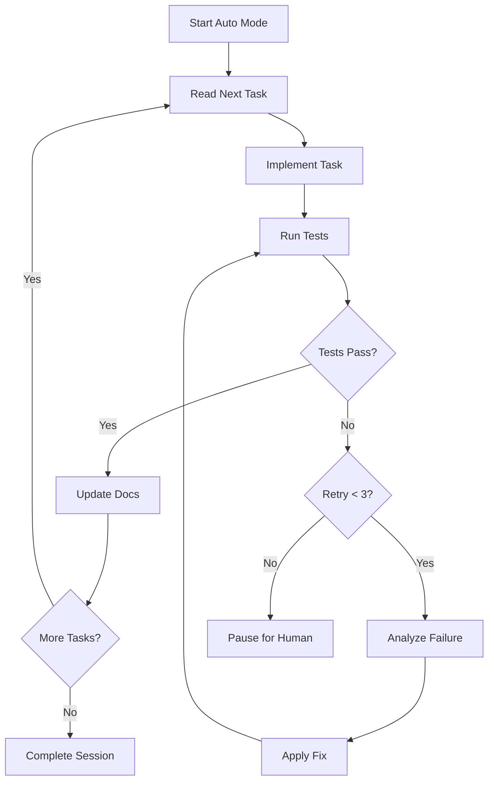

# Auto Mode - Autonomous Execution

:::tip The Flagship Feature
Auto mode is SpecWeave's most powerful feature - it can execute tasks, run tests, fix failures, and sync to GitHub/JIRA **completely autonomously for hours**.
:::

## Quick Start

```bash
# Start autonomous execution
/sw:auto

# Check progress (in another session)
/sw:auto-status

# Emergency stop (rarely needed - just close session)
/sw:cancel-auto
```

## What is Auto Mode?

Auto mode executes your tasks autonomously in a continuous loop:

1. **Reads next task** from `tasks.md`
2. **Implements the task** (writes code, runs commands)
3. **Runs tests automatically** (unit + integration + E2E if present)
4. **Self-heals failures** (up to 3 retry attempts with fixes)
5. **Syncs to living docs** (updates documentation)
6. **Moves to next task** (repeats until all done)

**Real-world proven**: Tested with increments taking 2-3 hours, mobile app generation, multi-repo coordination.

---

## Label Visibility

**You can now SEE what auto mode is doing!** Labels appear in your conversation showing real-time progress.

### During Execution

When auto mode continues working, you see:

```
╔══════════════════════════════════════════════════════════════╗
║  🔄 AUTO SESSION CONTINUING                                  ║
║  🤖 Main Orchestrator                                        ║
╠══════════════════════════════════════════════════════════════╣
║  Why: Work incomplete, continuing...                         ║
║  Iteration: 42/2500                                         ║
║  Increment: 0001-user-auth                                  ║
║  Subagents used: 3                                          ║
╠══════════════════════════════════════════════════════════════╣
║  🎯 WHEN WILL SESSION STOP?                                  ║
║  ├─ Mode: STANDARD MODE                                     ║
║  └─ Criteria: ALL tasks [x] completed + tests passing       ║
║  ✅ Tests: 42 passed, 0 failed                              ║
╚══════════════════════════════════════════════════════════════╝
```

**What this tells you:**
- **Current iteration**: 42 out of 2500 max (safety limit)
- **Active increment**: 0001-user-auth
- **Subagents spawned**: 3 specialized agents used
- **Stop criteria**: Mode and what needs to happen to complete
- **Test status**: 42 tests passing, 0 failures

### On Completion

When auto mode finishes successfully:

```
┏━━━━━━━━━━━━━━━━━━━━━━━━━━━━━━━━━━━━━━━━━━━━━━━━━━━━━━━━━━━━┓
┃  ✅ AUTO SESSION COMPLETE                                   ┃
┃  🤖 Main Orchestrator                                       ┃
┣━━━━━━━━━━━━━━━━━━━━━━━━━━━━━━━━━━━━━━━━━━━━━━━━━━━━━━━━━━━━┫
┃  Status: SUCCESS - All work completed                       ┃
┃  Reason: All tasks completed, all tests passed             ┃
┣━━━━━━━━━━━━━━━━━━━━━━━━━━━━━━━━━━━━━━━━━━━━━━━━━━━━━━━━━━━━┫
┃  📊 SESSION SUMMARY                                         ┃
┃  ├─ Iterations: 47/100                                      ┃
┃  ├─ Increment: 0001-user-auth                              ┃
┃  ├─ Subagents spawned: 3                                   ┃
┃  └─ Tests: 42 passed, 0 failed                             ┃
┗━━━━━━━━━━━━━━━━━━━━━━━━━━━━━━━━━━━━━━━━━━━━━━━━━━━━━━━━━━━━┛
```

:::info Label Visibility
Labels appear directly in your conversation, giving you complete visibility into auto mode's progress!
:::

---

## How It Works

Auto mode implements a **stop hook feedback loop** - it continuously checks "Am I done yet?" after each task.

### The Execution Loop



### Key Mechanisms

**1. Self-Healing**
- Analyzes test failures
- Extracts specific error details
- Applies targeted fixes
- Retries automatically (max 3 attempts)

**2. Test Validation** (MANDATORY)
- Runs `npm test` after every task
- Runs E2E tests if Playwright detected
- Blocks completion on ANY test failure
- TDD strict mode: 0 failures required

**3. Safety Nets**
- Max iterations (default: 2500)
- Max hours (default: none)
- Circuit breakers (external APIs)
- Human gates (dangerous operations)

---

## Stop Conditions

Auto mode stops when ANY of these conditions are met:

### ✅ Success Conditions

| Condition | Description |
|-----------|-------------|
| **All tasks complete** | Every task in `tasks.md` marked `[x] completed` |
| **All tests passing** | `npm test` returns 0 failures |
| **E2E tests passed** | Playwright tests pass (if detected) |
| **Multiple increments** | Transitions to next increment in queue |

:::tip Smart Completion (v1.0.131+)
Auto mode now **approves when all tasks are complete**, even if increments are still in "active" status. This handles cases where:
- Auto-close validation failed but work is done
- User prefers manual `/sw:done` for final review
- External sync is pending but implementation is complete

The session won't block indefinitely waiting for manual closure.
:::

### 🛑 Stop Conditions

| Condition | Description | Action |
|-----------|-------------|--------|
| **Max turns** | Reached maxTurns (default: 20) | Session ends |
| **Max iterations** | Reached 2500 iterations | Session ends |
| **Max hours** | Time limit exceeded (if configured) | Session ends |
| **Stale session** | No activity for maxSessionAge (default: 2h) | Session cleared |
| **Test failures (3x)** | Tests failed 3 times in a row | Pause for human |
| **Low confidence** | Self-assessment score < 0.50 | Pause for review |
| **Credential errors** | Multiple auth/deployment failures | Pause for config |
| **Human gate** | Dangerous operation detected | Wait for approval |
| **Circuit breaker** | External API failing repeatedly | Queue and continue |
| **Max retries exceeded** | Stop hook blocked too many times (v1.0.131+) | Force approve to break loop |

:::info maxTurns vs maxRetries (v1.0.226+)
- **maxTurns**: Hard stop - total turns in session (NEVER resets). Controls session duration.
- **maxRetries**: Stuck detection - retries on same work (resets when work changes). Prevents loops.

A "turn" is when Claude Code considers stopping (calls the stop hook), not individual API roundtrips.
:::

### ⏸️ Pause Conditions

These pause the session but don't end it:

- **External configuration needed** (env vars, credentials)
- **Structural issues** (architecture decisions required)
- **Unfixable errors** (but more work in queue - skips to next)

---

## Advanced Usage

### Check Progress

While auto mode is running, check status from another session:

```bash
/sw:auto-status
```

**Output:**
```
📊 AUTO SESSION STATUS

Session ID: auto-2026-01-06-a8b012
Status: RUNNING
Started: 2 hours ago
Iteration: 847/2500

Current Increment: 0023-payment-integration
Completed: 12/25 tasks
Tests: 156 passed, 0 failed

Circuit Breakers:
├─ GitHub: CLOSED (healthy)
├─ JIRA: CLOSED (healthy)
└─ ADO: CLOSED (healthy)

Human Gates: None pending
```

### Emergency Stop

If you need to manually cancel (rarely needed):

```bash
/sw:cancel-auto
```

:::warning Emergency Use Only
Prefer closing the Claude Code session naturally. `/sw:cancel-auto` is for emergencies where the session is stuck or unresponsive.
:::

### TDD Strict Mode

Enable stricter test requirements:

```json
// .specweave/config.json
{
  "auto": {
    "tddStrictMode": true
  }
}
```

**Changes behavior:**
- Tests MUST be written before implementation
- 0 test failures required (not just "most passing")
- Blocks completion if 0 tests passed (suspicious)

---

## Configuration Options

### Session Limits

```json
// .specweave/config.json
{
  "auto": {
    "enabled": true,            // Enable auto mode (default: true)
    "maxTurns": 20,             // HARD STOP: Total turns in session (default: 20)
    "maxRetries": 20,           // Stuck detection: Retries on same work (default: 20)
    "maxSessionAge": 7200,      // Stale session timeout in seconds (default: 2 hours)
    "maxIterations": 2500,      // Max loop iterations (safety)
    "maxHours": 8,              // Max duration in hours (optional)
    "tddStrictMode": false,     // Require TDD discipline
    "requireTests": false,      // Require tests to pass before task completion
    "requireValidation": true,  // Require validation before closure
    "requireLLMEval": false,    // Lightweight LLM-based completion evaluation
    "requireJudgeLLM": false,   // Heavy AI quality gate (/sw:judge-llm)
    "skipQualityGates": false   // Skip all quality gates (not recommended)
  }
}
```

:::info Config Migration (v1.0.131+)
If your project was created before v1.0.131, the `auto` section may be missing from your config. Run `specweave update` to automatically add default values:

```bash
specweave update
```

This migrates your config safely without affecting existing settings.
:::

### Circuit Breakers

Prevent external API failures from blocking progress:

```json
{
  "auto": {
    "circuitBreaker": {
      "github": { "maxFailures": 3, "resetMinutes": 5 },
      "jira": { "maxFailures": 3, "resetMinutes": 5 },
      "ado": { "maxFailures": 3, "resetMinutes": 5 }
    }
  }
}
```

### Stop Hook Circuit Breaker (v1.0.131+)

The stop hook includes a built-in circuit breaker that prevents infinite loops:

**How it works:**
1. Each time the stop hook returns "block", a retry counter increments
2. When retries exceed `auto.maxRetries` (default: 20), the circuit breaker triggers
3. Session automatically approves to break the loop
4. Counter resets on successful approval or completion

**Why this matters:**
- Prevents sessions from getting stuck indefinitely
- Handles edge cases where completion criteria can't be satisfied
- Ensures deterministic behavior even with complex increment configurations

**Tuning:**
```json
{
  "auto": {
    "maxRetries": 20   // Increase for complex increments, decrease for faster fail-safe
  }
}
```

### Quality Gate Presets (v1.0.226+)

During `specweave init`, you can choose a quality gate preset that configures auto mode behavior:

| Preset | requireTests | requireValidation | requireLLMEval | Description |
|--------|--------------|-------------------|----------------|-------------|
| **Production** | ✅ | ✅ | ✅ | All gates enabled - best for production code |
| **Standard** | ✅ | ✅ | ❌ | Tests + validation - good balance |
| **Minimal** | ❌ | ✅ | ❌ | Validation only - fast iteration |
| **None** | ❌ | ❌ | ❌ | Skip all gates - hackathon mode |

**Note:** `requireLLMEval` (lightweight, integrated in stop hook) is different from `requireJudgeLLM` (heavy, uses `/sw:judge-llm` command). Production preset enables the lightweight eval but not the heavy judge.

### Debugging with Decision Log (v1.0.226+)

View all stop hook decisions with the decision-log command:

```bash
# View last 20 decisions
specweave decision-log

# Filter by hook
specweave decision-log --hook stop-auto

# Filter by decision type (allow/block/approve)
specweave decision-log --decision block

# Time window (1h, 24h, 7d)
specweave decision-log --since 1h

# Follow in real-time
specweave decision-log --tail

# Raw JSON for scripting
specweave decision-log --json
```

**Log location:** `.specweave/logs/decisions.jsonl`

---

## Best Practices

### ✅ DO

- **Start with small increments** (5-10 tasks max for first time)
- **Monitor first few iterations** (check if it's progressing correctly)
- **Ensure tests exist** (auto mode needs tests to validate)
- **Use for repetitive tasks** (CRUD operations, API endpoints)
- **Review logs periodically** (check `.specweave/logs/auto-iterations.log`)

### ❌ DON'T

- **Don't use for exploratory work** (architecture decisions need human input)
- **Don't ignore test failures** (fix broken tests before starting auto)
- **Don't run on dirty git tree** (commit or stash changes first)
- **Don't use without tests** (auto mode validates via tests)

---

## Real-World Examples

### Example 1: Mobile App Generation (2-3 hours)

```bash
/sw:increment "React Native app with authentication and offline sync"
# Creates 25 tasks: setup, navigation, auth screens, API, offline storage, tests

/sw:auto
# Runs for 2.5 hours:
# - Installs dependencies (Expo, React Navigation)
# - Creates screens with proper navigation
# - Implements auth flow with AsyncStorage
# - Sets up offline sync with network detection
# - Writes and runs 42 tests (all passing)
# - Updates living docs
# Session completes autonomously!
```

### Example 2: Microservices Coordination

```bash
/sw:increment "Add payment webhook to order service and update frontend"
# Multi-repo increment: backend service + frontend + shared types

/sw:auto
# Coordinates across repos:
# 1. Updates shared/ with PaymentWebhookEvent type
# 2. Adds webhook handler to backend/
# 3. Updates frontend/ to show payment status
# 4. Runs tests in all three repos
# 5. Syncs to GitHub (3 PRs created)
```

### Example 3: Documentation Generation

```bash
/sw:increment "Generate API docs for all endpoints"
# 15 tasks: one per endpoint category

/sw:auto
# Processes each endpoint:
# - Extracts OpenAPI specs from code
# - Generates markdown docs
# - Creates Postman collection
# - Adds examples and response schemas
# - Validates docs against actual API
# Completes in 45 minutes
```

---

## Troubleshooting

### "Session keeps retrying same failure"

**Symptom**: Auto mode stuck retrying a failing test 3 times.

**Solution**:
1. Let it complete 3 retries (it will pause)
2. Review the failure details in the pause message
3. Fix manually with `/sw:do`
4. Continue with `/sw:resume` or start fresh

### "Auto mode stopped early"

**Symptom**: Session ended before all tasks complete.

**Possible causes**:
- Max iterations reached → Check logs
- Max hours exceeded → Increase limit or split increment
- Low confidence score → Review last few tasks for quality

**Check logs**:
```bash
tail -50 .specweave/logs/auto-stop-reasons.log
```

### "Tests not running"

**Symptom**: Auto mode completes but shows "Tests: NOT YET RUN"

**Solution**:
1. Ensure `npm test` command works
2. Check test files exist (`*.test.ts`, `*.spec.ts`)
3. Verify test framework installed (Vitest, Jest, Playwright)

### "Circuit breaker triggered"

**Symptom**: Message says "GitHub circuit breaker open"

**Solution**:
- Wait 5 minutes (auto-reset)
- Check GitHub API rate limits
- Verify GITHUB_TOKEN is valid
- Auto mode will queue sync and continue with other work

---

## Monitoring & Logs

### Log Files

Auto mode creates detailed logs:

| File | Contains |
|------|----------|
| `.specweave/logs/auto-iterations.log` | Every iteration with timestamp |
| `.specweave/logs/auto-stop-reasons.log` | Why session stopped each time |
| `.specweave/logs/auto-sessions.log` | Session start/end events |
| `.specweave/state/auto-session.json` | Current session state |

### Session State File

View current session details:

```bash
cat .specweave/state/auto-session.json
```

```json
{
  "sessionId": "auto-2026-01-06-a8b012",
  "status": "running",
  "startTime": "2026-01-06T10:00:00Z",
  "iteration": 847,
  "maxIterations": 2500,
  "currentIncrement": "0023-payment-integration",
  "completedIncrements": ["0022-user-profile"],
  "testRetryCount": 0,
  "circuitBreakers": {
    "github": { "state": "closed", "failures": 0 },
    "jira": { "state": "closed", "failures": 0 }
  }
}
```

---

## Comparison: Auto vs Manual

| Aspect | `/sw:auto` | `/sw:do` |
|--------|-----------|----------|
| **Execution** | Autonomous (hours) | Manual (one task) |
| **Test validation** | Automatic | Manual |
| **Failure handling** | Self-healing (3 retries) | Human fixes |
| **Progress visibility** | Labels show status | Direct feedback |
| **Best for** | Repetitive tasks, CRUD | Exploratory work |
| **Supervision** | Monitor periodically | Full attention |

**Choose auto mode when:**
- Tasks are well-defined (clear acceptance criteria)
- Tests exist for validation
- Work is repetitive (many similar tasks)
- You want to "set and forget"

**Choose manual mode when:**
- Exploring new architecture
- Making complex design decisions
- Debugging tricky issues
- Learning the codebase

---

## Next Steps

1. **Try a small increment first** (5 tasks max)
   ```bash
   /sw:increment "Add user profile page with avatar upload"
   /sw:auto
   ```

2. **Monitor the first session** (watch the labels, check logs)

3. **Review results** (check code quality, test coverage, docs)

4. **Scale up gradually** (10 tasks → 25 tasks → multiple increments)

5. **Join the community** ([Discord](https://discord.gg/UYg4BGJ65V)) and share your autonomous execution stories!

---

## See Also

- [Commands Overview](/docs/commands/overview) - All available commands
- [Status Management](/docs/commands/status-management) - Increment status commands
- [TDD Workflow](/docs/academy/specweave-essentials/06-tdd-workflow) - Test-driven development
- [Multi-Project Setup](/docs/guides/multi-project-setup) - Coordinate across repos
- [Quick Start](/docs/quick-start) - Getting started guide
