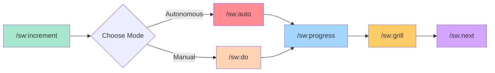

# Commands Overview

SpecWeave provides slash commands for every stage of your development workflow. This page covers the **essential commands** you'll use daily.

:::warning No Shortcuts
All commands MUST use the `/sw:*` namespace prefix. Shortcuts like `/inc`, `/do`, `/pause`, `/resume` (without the namespace) conflict with Claude Code's native commands and other repositories.
:::

## The Core Workflow



**Pro tip**: Use `/sw:auto` for autonomous execution (hours of hands-free work!) or `/sw:do` for manual task-by-task control. **Always run `/sw:grill` before closing!**

## 1. Planning

### `/sw:increment` - Create New Increment

**Start every new feature here** - This is your entry point.

```bash
/sw:increment "User authentication with JWT"
/sw:increment "Payment processing with Stripe"
```

**What it does**:
- 🔍 Detects tech stack automatically
- 📋 PM-led planning (spec.md, plan.md, tasks.md)
- 🧪 Creates test strategy
- 👥 Strategic agent review (Architect, Security, QA)

---

## 2. Execution

### `/sw:auto` - Autonomous Execution ⭐ FLAGSHIP

:::tip The Power Feature
**Ship features while you sleep.** Auto mode executes tasks for hours autonomously - implementing code, running tests, self-healing failures, and syncing to GitHub/JIRA.
:::

```bash
/sw:auto                  # Start autonomous execution
/sw:auto-status           # Check progress (from another session)
/sw:cancel-auto           # Emergency stop (rarely needed)
```

**What it does**:
- 🔄 **Continuous loop**: Read task → Implement → Test → Fix → Next
- 🧪 **Test validation**: Runs tests after EVERY task
- 🔧 **Self-healing**: Analyzes failures, applies fixes (max 3 retries)
- 📚 **Living docs sync**: Updates documentation automatically
- ⏱️ **Hours of work**: Proven with 2-3 hour sessions

**Stop conditions**:
- ✅ All tasks complete + all tests passing
- 🛑 Max iterations reached (default: 2500)
- ⏸️ Test failures after 3 retries → pauses for human

**Best for**: Well-defined tasks, CRUD operations, repetitive work

**See**: [Auto Mode Deep Dive](./auto.md)

---

### `/sw:do` - Manual Task Execution

**Task-by-task control** - For exploratory work or complex decisions.

```bash
/sw:do           # Auto-finds active increment
/sw:do 0007      # Specific increment
```

**What it does**:
- 🎯 Resumes from last incomplete task
- 🔊 Plays sound after each task
- 🔗 Syncs to GitHub (if enabled)

**Best for**: Architecture decisions, debugging, learning codebase

---

## 3. Monitoring

### `/sw:progress` - Check Status

```bash
/sw:progress         # Current increment
/sw:progress 0007    # Specific increment
```

Shows: Task completion, time tracking, current phase, upcoming tasks.

---

## 4. Quality Assurance

### `/sw:validate` - Quick Validation

```bash
/sw:validate 0007              # 120+ rule-based checks
/sw:validate 0007 --quality    # Include AI assessment
```

Validates: Consistency, completeness, testability, traceability.

---

### `/sw:qa` - AI Quality Gate

```bash
/sw:qa 0007 --gate    # Before closing (recommended)
```

Returns: 🟢 PASS | 🟡 CONCERNS | 🔴 FAIL

---

### `/sw:grill` - Code Review (MANDATORY) 🔥

:::warning Required Before Closing
`/sw:grill` must pass before `/sw:done` will work. This is enforced automatically.
:::

```bash
/sw:grill 0007                # Full review
/sw:grill 0007 security       # Focus on security
/sw:grill 0007 performance    # Focus on performance
```

**What it reviews:**
- 🔒 Security vulnerabilities (OWASP Top 10)
- ⚡ Performance issues (N+1 queries, complexity)
- 🎯 Edge cases and error handling
- 📐 Code quality and maintainability

**Issue severities:** BLOCKER, CRITICAL, MAJOR, MINOR, SUGGESTION

**On PASS:** Creates marker file allowing `/sw:done` to proceed.

---

## 5. Completion

### `/sw:next` - Smart Workflow Transition ⭐ RECOMMENDED

```bash
/sw:next    # Auto-close + suggest next work
```

**What it does**: Validates gates → closes increment → suggests next task.

---

### `/sw:done` - Close Increment

```bash
/sw:grill 0007   # Required first!
/sw:done 0007    # Close specific increment
```

**Prerequisite:** `/sw:grill` must pass first.

Use `/sw:next` instead - it does the same thing plus suggests next work.

---

## 6. External Sync (Optional)

For GitHub, JIRA, or Azure DevOps integration:

```bash
/sw-github:sync 0007    # Two-way sync with GitHub
/sw-jira:sync 0007      # Two-way sync with JIRA
/sw-ado:sync 0007       # Two-way sync with Azure DevOps
```

See [GitHub Integration](/docs/academy/specweave-essentials/14-github-integration) for setup.

---

## Quick Reference

### The 5 Essential Commands

| Command | Purpose | When to Use |
|---------|---------|-------------|
| `/sw:increment` | Create new increment | Starting new feature |
| `/sw:auto` | Autonomous execution | Hands-free work (hours) |
| `/sw:do` | Manual execution | Task-by-task control |
| `/sw:progress` | Check status | Monitoring progress |
| `/sw:next` | Complete + suggest next | Finishing work |

### Auto Mode Commands

| Command | Purpose |
|---------|---------|
| `/sw:auto` | Start autonomous execution |
| `/sw:auto-status` | Check progress (from another session) |
| `/sw:cancel-auto` | Emergency stop (rarely needed) |

### Quality Commands

| Command | Purpose |
|---------|---------|
| `/sw:validate` | Quick rule-based validation |
| `/sw:qa --gate` | AI quality gate check |
| `/sw:grill` | Code review (MANDATORY before close) |

### State Management

| Command | Purpose |
|---------|---------|
| `/sw:pause` | Pause active increment |
| `/sw:resume` | Resume paused work |
| `/sw:status` | Show all increments |

### CLI Commands (Terminal)

| Command | Purpose |
|---------|---------|
| `specweave init .` | Initialize project |
| `specweave update` | **Full update**: CLI + plugins + instructions (use this first) |
| `specweave update --no-plugins` | Update without refreshing plugins |
| `specweave refresh-marketplace` | Plugin-only refresh (see note below) |

:::info About `refresh-marketplace`
Most users should use `specweave update`. The `refresh-marketplace` command exists for specific situations:

**What it does beyond Claude Code's native auto-update:**
- Fixes hook permissions (`chmod +x`) — Claude Code doesn't preserve executable bits
- Manages lazy loading state (router-only installation)
- Cleans up orphaned cache/skills directories
- Updates instruction files (CLAUDE.md, AGENTS.md)

**When to use it:**
- Hooks stopped working after Claude Code update
- Skills not activating despite being installed
- Want to refresh plugins without updating CLI version

**Note:** You can enable Claude Code's native marketplace auto-update via `/plugin` → Marketplaces → Enable auto-update. However, this doesn't fix hook permissions or manage SpecWeave-specific state.
:::

---

## Example Workflows

### Autonomous (Recommended)

```bash
/sw:increment "User authentication"
/sw:auto                  # Let it run for hours
# ... come back later ...
/sw:grill 0007            # Code review (mandatory!)
/sw:next                  # Close and see what's next
```

### Manual (For Complex Decisions)

```bash
/sw:increment "Payment integration"
/sw:do                    # Task-by-task with your guidance
/sw:progress              # Check status
/sw:qa --gate             # Quality check
/sw:grill 0007            # Code review (mandatory!)
/sw:done 0007             # Close
```

---

## Best Practices

### 1. Choose the Right Mode

- **Use `/sw:auto`** for: CRUD, repetitive tasks, well-defined specs
- **Use `/sw:do`** for: Architecture decisions, debugging, exploration

### 2. Grill and Validate Before Closing

```bash
/sw:qa --gate       # Quality check
/sw:grill 0007      # Code review (mandatory!)
/sw:done 0007       # Now close
```

---

## Next Steps

- [Auto Mode Deep Dive](./auto) - Autonomous execution details
- [Quick Start Guide](/docs/quick-start) - Get started in 5 minutes
- [GitHub Integration](/docs/academy/specweave-essentials/14-github-integration) - External tool integration

---

> **Philosophy**: SpecWeave is designed for **autonomous execution**. Let `/sw:auto` do the heavy lifting while you focus on decisions that matter.
