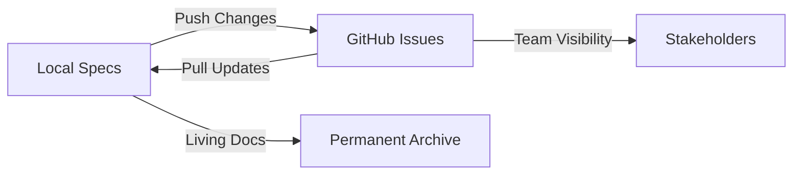

# GitHub Enterprise Migration Guide

:::tip Enterprise Focus
This guide explains how SpecWeave integrates with GitHub for **enterprise teams** working across multiple environments, repositories, and release cycles.
:::

---

## 🎯 Why GitHub Integration Matters for Enterprises

### The Enterprise Challenge

Large organizations face unique challenges:

- **Multiple Environments**: dev → qa → staging → uat → preview → prod
- **Complex Release Cycles**: Weekly sprints, monthly releases, quarterly planning
- **Distributed Teams**: Frontend, Backend, Mobile, QA, DevOps across repos
- **Compliance Requirements**: Audit trails, approval workflows, change tracking
- **Tooling Integration**: GitHub must sync with JIRA, Azure DevOps, ServiceNow

**SpecWeave solves this** by acting as the **single source of truth** that syncs bidirectionally with GitHub while maintaining full traceability.

---

## 🏗️ Architecture: Local-First, GitHub as Mirror

### CRITICAL: Source of Truth Pattern

```
✅ CORRECT Architecture:
.specweave/docs/specs/ (LOCAL - Source of Truth)
    ↓ Bidirectional Sync
GitHub Issues/Projects (MIRROR - Team Visibility)

❌ WRONG (GitHub as Source of Truth):
GitHub Issues (External)
    ↓ One-way sync
.specweave/ (Local - Backup copy)
```

**Why Local-First?**

1. **Offline Work**: Developers can work without internet (airplane, cafe, VPN issues)
2. **Version Control**: `.specweave/` is in git → full history, diffs, rollbacks
3. **No Vendor Lock-in**: Switch from GitHub → GitLab → Bitbucket without losing data
4. **Fast Access**: No API rate limits, no network latency
5. **Privacy**: Sensitive specs don't need to leave your infrastructure

### Bidirectional Sync Flow



**Key Points**:
- Changes in `.specweave/` → automatically sync to GitHub
- Changes in GitHub → automatically sync to `.specweave/`
- Conflict resolution favors LOCAL (you control the truth)
- GitHub = visibility layer for non-technical stakeholders

---

## 🚀 Quick Start: GitHub Integration

### Step 1: Initialize SpecWeave with GitHub

```bash
# Initialize SpecWeave (interactive)
specweave init

# During setup, select:
? Select issue tracker: GitHub
? GitHub instance: GitHub.com (cloud) or GitHub Enterprise Server
? Organization/Owner: myorg
? Repository: myproject
```

**Result**: Creates `.env` with GitHub token and `.specweave/config.json` with sync profile.

### Step 2: Verify Connection

```bash
# Test GitHub connection
gh auth status

# Expected output:
# ✓ Logged in to github.com as username (oauth_token)
# ✓ Token: ghp_****
```

### Step 3: Create First Increment (Auto-Syncs!)

```bash
# Plan increment
/sw:increment "Add user authentication"

# Result: Auto-creates GitHub issue!
# 🔗 GitHub Issue #123 created
# 🔗 https://github.com/myorg/myproject/issues/123
```

**THAT'S IT!** Every task completion now auto-updates GitHub.

---

## 🏢 Enterprise Patterns

### Pattern 1: Multi-Environment Deployment

**Scenario**: Your app has 6 environments:

```
dev → qa → staging → uat → preview → prod
```

**How SpecWeave Handles This**:

```json
// .specweave/config.json
{
  "sync": {
    "profiles": {
      "dev-github": {
        "provider": "github",
        "displayName": "Development",
        "config": {
          "owner": "myorg",
          "repo": "myapp-dev"
        }
      },
      "qa-github": {
        "provider": "github",
        "displayName": "QA Environment",
        "config": {
          "owner": "myorg",
          "repo": "myapp-qa"
        }
      },
      "prod-github": {
        "provider": "github",
        "displayName": "Production",
        "config": {
          "owner": "myorg",
          "repo": "myapp-prod"
        }
      }
    }
  }
}
```

**Usage (Git-Style Commands)**:
```bash
# Pull latest from dev environment
/sw-github:pull --profile dev-github

# Push progress to dev environment
/sw-github:push 0012 --profile dev-github

# Two-way sync
/sw-github:sync 0012 --profile dev-github

# Promote to QA (create new issue in QA repo)
/sw-github:create 0012 --profile qa-github

# Promote to prod (after UAT approval)
/sw-github:create 0012 --profile prod-github
```

**Result**: Same increment tracked across ALL environments with full traceability.

---

### Pattern 2: Multi-Repo Microservices

**Scenario**: 12 microservices across 4 teams:

```
Frontend Team:
├── web-app (React)
└── mobile-app (React Native)

Backend Team:
├── api-gateway (Node.js)
├── auth-service (Node.js)
├── payment-service (Node.js)
└── notification-service (Node.js)

Data Team:
├── analytics-service (Python)
└── ml-pipeline (Python)

DevOps Team:
├── infrastructure ([Terraform](/docs/glossary/terms/terraform))
├── monitoring (Prometheus/Grafana)
├── ci-cd ([GitHub Actions](/docs/glossary/terms/github-actions))
└── secrets-manager (Vault)
```

**SpecWeave Configuration**:

```json
{
  "sync": {
    "profiles": {
      "frontend-web": {
        "provider": "github",
        "config": {"owner": "myorg", "repo": "web-app"}
      },
      "frontend-mobile": {
        "provider": "github",
        "config": {"owner": "myorg", "repo": "mobile-app"}
      },
      "backend-api": {
        "provider": "github",
        "config": {"owner": "myorg", "repo": "api-gateway"}
      },
      "backend-auth": {
        "provider": "github",
        "config": {"owner": "myorg", "repo": "auth-service"}
      }
      // ... (8 more profiles)
    },
    "projects": {
      "frontend": {
        "name": "Frontend Team",
        "keywords": ["react", "ui", "mobile", "web"],
        "defaultSyncProfile": "frontend-web",
        "team": "Frontend Team"
      },
      "backend": {
        "name": "Backend Services",
        "keywords": ["api", "service", "backend", "node"],
        "defaultSyncProfile": "backend-api",
        "team": "Backend Team"
      }
    }
  }
}
```

**Smart Project Detection** (Automatic!):

```bash
# Create increment with keywords
/sw:increment "Add dark mode to mobile app"

# SpecWeave detects:
# - Keywords: "mobile", "app"
# - Project: "frontend" (score: 0.85)
# - Profile: "frontend-mobile"
# - Auto-syncs to: myorg/mobile-app
```

**Manual Override** (When Needed):

```bash
# Pull from specific repo
/sw-github:pull --profile backend-auth

# Push to specific repo
/sw-github:push 0015 --profile backend-auth

# Two-way sync
/sw-github:sync 0015 --profile backend-auth
```

---

## 🔄 Git-Style Sync Commands (Recommended)

### Quick Reference

SpecWeave provides intuitive **git-style commands** for GitHub synchronization:

| Command | Purpose |
|---------|---------|
| `/sw-github:pull` | Pull changes from GitHub (like `git pull`) |
| `/sw-github:push` | Push progress to GitHub (like `git push`) |
| `/sw-github:sync` | Two-way sync (pull + push) |
| `/sw-github:status` | Check sync status |

### Basic Usage

```bash
# Pull latest changes from GitHub
/sw-github:pull

# Push your progress to GitHub
/sw-github:push

# Two-way sync (both directions)
/sw-github:sync 0012
```

### Multi-Project Sync

```bash
# Pull ALL specs across ALL projects (living docs sync)
/sw-github:pull --all

# Pull specific feature hierarchy
/sw-github:pull --feature FS-042

# Push all local changes to GitHub
/sw-github:push --all
```

### Sync Brief Output

After every sync operation, you'll see a compact summary:

```
┌─────────────────────────────────────────────────────────┐
│  PULL COMPLETE                                 ✓ GitHub │
├─────────────────────────────────────────────────────────┤
│  Scanned: 35 specs across 2 repos                       │
│  Updated: 5 specs                                       │
│  Conflicts: 1 (resolved: external wins)                 │
├─────────────────────────────────────────────────────────┤
│  CHANGES APPLIED                                        │
│    ↓ Status changes:    3                               │
│    ↓ Label updates:     2                               │
│    + Comments imported: 4                               │
└─────────────────────────────────────────────────────────┘
```

**Symbols**: `↓` = pulled (incoming), `↑` = pushed (outgoing), `✓` = success

---

### Pattern 3: Release Management

**Scenario**: Monthly release cycle with:
- Weekly sprints
- Sprint reviews every Friday
- Release branches: `release/v1.2.0`
- Hotfixes: `hotfix/v1.2.1`

**SpecWeave Integration**:

```bash
# Plan feature for Sprint 24
/sw:increment "User profile enhancements"

# During sprint: Tasks auto-update GitHub
# Task T-001 completed → GitHub checkbox updated
# Task T-002 completed → GitHub checkbox updated

# Sprint review (Friday): Show GitHub issue
# All stakeholders see progress without asking devs!

# Create release branch
git checkout -b release/v1.24.0

# Tag increment with release version
/sw:done 0018 --tag v1.24.0

# Result: GitHub issue tagged with "release-v1.24.0" label
```

**GitHub Labels** (Auto-Created):

```
specweave              # All SpecWeave increments
increment              # Increment type
status:planning        # Current status
status:in-progress
status:completed
priority:p1            # Priority level
release-v1.24.0        # Release tag
team:frontend          # Team assignment
```

---

### Pattern 4: Compliance & Audit Trails

**Requirement**: SOC 2, ISO 27001, HIPAA compliance requires:
- Who made changes?
- When were changes made?
- What was changed?
- Why was it changed?

**SpecWeave Provides Full Traceability**:

```
1. Spec Files (in git):
   - Author: git log shows who wrote spec
   - When: git commit timestamps
   - What: git diff shows changes
   - Why: Commit messages + spec frontmatter

2. GitHub Issues (for stakeholders):
   - Progress comments (auto-generated)
   - Task checklists (auto-updated)
   - Status transitions (tracked)
   - Labels (auto-applied)

3. Living Docs Archive:
   - .specweave/docs/specs/ (permanent record)
   - User stories with implementation history
   - Cross-links to increments
   - Audit-ready format
```

**Audit Report Example**:

```bash
# Generate audit report for increment
/sw:audit 0018

# Output:
📊 Audit Report: Increment 0018
━━━━━━━━━━━━━━━━━━━━━━━━━━━━━━━━━━━━━━━━

Increment ID: 0018-user-profile-enhancements
Status: Completed
Created: 2025-11-01 09:00:00 UTC
Completed: 2025-11-08 16:30:00 UTC
Duration: 7 days, 7.5 hours

Author: john.doe@company.com
Reviewer: jane.smith@company.com
Approver: architect@company.com

GitHub Issue: #145
GitHub Repo: myorg/web-app
Branch: feature/user-profile-enhancements
PR: #156 (merged on 2025-11-08)

Tasks Completed: 12/12 (100%)
Tests Added: 45 (90% coverage)
Files Changed: 23 files (+1,234 -567 lines)

Changes:
  - Spec: 3 commits (git log --oneline spec.md)
  - Plan: 1 commit (technical design approved)
  - Tasks: 18 commits (task completion tracking)

External Tool Sync:
  - GitHub Issue #145 updated 12 times
  - JIRA Epic PROJ-45 synced (if configured)
  - ADO Work Item 678 synced (if configured)

Living Docs:
  - User stories distributed to:
    .specweave/docs/specs/frontend/user-profile/
  - 5 user stories created
  - 12 tasks mapped to stories
  - Full traceability maintained

Compliance Notes:
  ✓ All changes tracked in git
  ✓ Code review completed (PR #156)
  ✓ Tests cover 90% of new code
  ✓ Documentation updated
  ✓ Security review passed (no vulnerabilities)
```

---

## 🔧 Advanced Configuration

### Multi-Instance Support

**Scenario**: Using GitHub.com + GitHub Enterprise Server

```json
{
  "sync": {
    "profiles": {
      "public-github": {
        "provider": "github",
        "displayName": "GitHub.com (Open Source)",
        "config": {
          "baseUrl": "https://api.github.com",
          "owner": "myorg",
          "repo": "public-project"
        }
      },
      "enterprise-github": {
        "provider": "github",
        "displayName": "GitHub Enterprise (Internal)",
        "config": {
          "baseUrl": "https://github.company.com/api/v3",
          "owner": "engineering",
          "repo": "internal-platform"
        }
      }
    }
  }
}
```

**Tokens** (separate for each instance):

```bash
# .env
GITHUB_TOKEN=ghp_public_token_here           # For GitHub.com
GHE_TOKEN=ghp_enterprise_token_here          # For GitHub Enterprise
```

---

### Rate Limiting Strategy

**Problem**: Large projects hit GitHub's rate limits:
- **GitHub.com**: 5,000 requests/hour (authenticated)
- **GitHub Enterprise**: 15,000 requests/hour (configurable)

**Solution**: Time range filtering + intelligent batching

```bash
# Sync last 1 month only (recommended)
/sw-github:sync 0020 --time-range 1M

# Time range options:
# 1W  - Last 1 week  (~50 items, 75 API calls)
# 1M  - Last 1 month (~200 items, 300 API calls) ✅ RECOMMENDED
# 3M  - Last 3 months (~600 items, 900 API calls)
# 6M  - Last 6 months (~1,200 items, 1,800 API calls)
# ALL - All time (~5,000+ items, 7,500+ API calls) ❌ AVOID
```

**Pre-Flight Validation** (Automatic):

```
🔍 Sync Impact Analysis:
━━━━━━━━━━━━━━━━━━━━━━━━━━━━━━━━━━━━━━━━

Time Range: 1 month
Estimated Items: ~200
Estimated API Calls: ~300
Current Rate Limit: 4,850 / 5,000 remaining

Impact: MEDIUM (safe to proceed)

⚡ Recommendations:
  ✓ Proceed with sync
  ✓ 4,550 API calls remaining after sync
  ✓ Rate limit resets in 42 minutes
```

---

### GitHub Actions Integration

**Workflow**: Auto-sync on deployment

```yaml
# .github/workflows/deploy-production.yml
name: Deploy to Production

on:
  push:
    branches: [main]

jobs:
  deploy:
    runs-on: ubuntu-latest
    steps:
      - uses: actions/checkout@v3

      - name: Install SpecWeave
        run: npm install -g specweave

      - name: Sync SpecWeave to GitHub
        env:
          GITHUB_TOKEN: ${{ secrets.GITHUB_TOKEN }}
        run: |
          # Find active increment
          ACTIVE_INCREMENT=$(specweave status --active --json | jq -r '.id')

          # Sync to GitHub
          specweave sync github $ACTIVE_INCREMENT

          # Close increment on successful deployment
          specweave done $ACTIVE_INCREMENT --deployed

      - name: Deploy Application
        run: |
          # Your deployment logic here
```

**Result**: Deployments automatically update GitHub issues!

---

## 📊 Metrics & Reporting

### DORA Metrics (Automatic)

SpecWeave tracks **DORA 4 metrics** automatically:

1. **Deployment Frequency**
   - Tracked via `/sw:done` with `--deployed` flag
   - Syncs to GitHub as deployment event
   - Viewable in GitHub Insights

2. **Lead Time for Changes**
   - Increment created → Deployed
   - Tracked in metadata.json
   - Reported in `/sw:metrics`

3. **Change Failure Rate**
   - Hotfix increments tagged with `type:hotfix`
   - Failed deployments tracked
   - Ratio: hotfixes / total deployments

4. **Time to Restore Service**
   - Incident increments (`type:incident`)
   - Created → Completed timestamp
   - Average MTTR per team

**View DORA Metrics**:

```bash
/sw:metrics --dora

# Output:
📊 DORA Metrics (Last 90 Days)
━━━━━━━━━━━━━━━━━━━━━━━━━━━━━━━━━━━━━━━━

Deployment Frequency: 12.4 deploys/week
  Status: Elite (>1 deploy/day goal: ✗, >1/week: ✓)
  Trend: ↑ 15% vs last quarter

Lead Time for Changes: 4.2 days
  Status: Elite (<1 day goal: ✗, <1 week: ✓)
  Trend: ↓ 8% vs last quarter (improving!)

Change Failure Rate: 8.5%
  Status: High Performer (<15%)
  Trend: ↓ 12% vs last quarter (improving!)

Time to Restore Service: 1.8 hours
  Status: Elite (<1 hour goal: ✗, <1 day: ✓)
  Trend: ↓ 20% vs last quarter (improving!)

Overall Rating: HIGH PERFORMER
Next Goal: Elite (all 4 metrics elite)
```

---

## 🔒 Security Best Practices

### Token Management

**DO** ✅:
- Use Personal Access Tokens (classic) with minimal scopes
- Store tokens in `.env` (gitignored)
- Rotate tokens every 90 days
- Use separate tokens for dev/qa/prod
- Revoke tokens when team members leave

**DON'T** ❌:
- Commit tokens to git
- Share tokens via Slack/email
- Use tokens with `admin` scope
- Reuse personal tokens for CI/CD
- Use tokens without expiration

**Token Scopes** (Minimal Required):

```
✓ repo (access repositories)
✓ workflow (update GitHub Actions)
✓ read:org (read organization info)
✗ admin:org (NOT needed)
✗ delete_repo (NOT needed)
```

### GitHub Apps (Alternative)

For **enterprise security**, use GitHub Apps instead of PATs:

```bash
# Install SpecWeave GitHub App
# https://github.com/apps/specweave

# Configure in .env
GITHUB_APP_ID=123456
GITHUB_APP_PRIVATE_KEY_PATH=/secure/specweave.pem
GITHUB_APP_INSTALLATION_ID=78910
```

**Benefits**:
- ✅ Fine-grained permissions
- ✅ Revocable per-repository access
- ✅ Audit logs (who, what, when)
- ✅ No personal tokens needed
- ✅ Organization-wide policies

---

## 🚨 Troubleshooting

### Issue: "Repository not found"

**Cause**: Token lacks `repo` scope or repository is private.

**Fix**:
```bash
# Check token scopes
gh auth status

# Regenerate token with correct scopes
# https://github.com/settings/tokens

# Update .env
GITHUB_TOKEN=ghp_new_token_here
```

---

### Issue: "Rate limit exceeded"

**Cause**: Too many API calls in 1 hour.

**Fix**:
```bash
# Check rate limit status
gh api rate_limit

# Wait for reset OR reduce time range
/sw-github:sync 0020 --time-range 1W  # Use shorter range
```

---

### Issue: "Sync creates duplicate issues"

**Cause**: Metadata file missing or corrupted.

**Fix**:
```bash
# Check metadata
cat .specweave/increments/0020-feature/metadata.json

# Should contain:
# {
#   "github": {
#     "issue": 145,
#     "url": "https://github.com/myorg/myrepo/issues/145"
#   }
# }

# If missing, link manually:
/sw-github:link 0020 --issue 145
```

---

## 📚 Related Guides

- [Azure DevOps Migration Guide](./azure-devops-migration)
- [JIRA Migration Guide](./jira-migration)
- [Multi-Environment Deployment Strategy](./multi-environment-deployment)
- [Release Management Guide](./release-management)
- [GitHub Integration](/docs/academy/specweave-essentials/14-github-integration)

---

## 🆘 Getting Help

- **Documentation**: https://spec-weave.com
- **GitHub Issues**: https://github.com/anton-abyzov/specweave/issues
- **Discussions**: https://github.com/anton-abyzov/specweave/discussions
- **Enterprise Support**: enterprise@spec-weave.com
