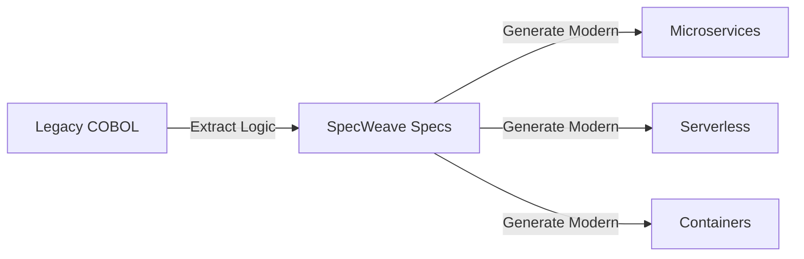

# Knowledge Transfer & Project Migration

## The Ultimate Project Portability

**SpecWeave transforms your project knowledge into portable, implementation-agnostic specifications that can be transferred, reimplemented, and modernized across any boundary.**

:::tip The Game Changer
Your entire project's intellectual property becomes **portable specs** that can be:
- **Transferred** between companies
- **Reimplemented** in any tech stack
- **Modernized** from legacy to cutting-edge
- **Scaled** from [monolith](/docs/glossary/terms/monolith) to [microservices](/docs/glossary/terms/microservices)
:::

## Use Case 1: Cross-Company Knowledge Transfer

### The Scenario
Your company acquires a startup, or you're switching jobs and need to rebuild similar systems, or you're a consultancy implementing proven patterns across clients.

### The Solution
```bash
# At Company A - Extract the entire knowledge base
specweave extract-specs --source legacy-project/
# Generates: Complete spec hierarchy with 500+ user stories

# At Company B - Reimplement with modern stack
specweave init new-project
specweave import-specs ./extracted-specs/
specweave implement --tech-stack "Next.js, FastAPI, PostgreSQL"
```

### Real-World Impact
- **6 months → 6 weeks**: Full system reimplementation
- **100% knowledge retention**: No tribal knowledge lost
- **Zero vendor lock-in**: Specs are pure Markdown + YAML
- **Legal compliance**: Specs (the "what") vs code (the "how")

## Use Case 2: Monolith to Microservices Migration

### The Challenge
Your 500,000-line monolith needs to become 12 microservices across 3 teams.

### The SpecWeave Approach
```yaml
# 1. Extract and analyze existing system
specweave analyze monolith/ --detect-boundaries
# Output: Suggested service boundaries based on data flow

# 2. Generate microservice specs
specweave split-specs --strategy domain-driven
# Creates: 12 service specifications with clear interfaces

# 3. Parallel implementation by teams
Team Frontend: specweave implement services/ui --team frontend
Team Backend:  specweave implement services/api --team backend
Team Data:     specweave implement services/data --team data
```

### Migration Patterns Supported
- **Strangler Fig**: Gradual replacement with specs as contracts
- **Big Bang**: Complete rewrite with full spec coverage
- **Hybrid**: Core services first, periphery later
- **Event-Driven**: Specs include event schemas and flows

## Use Case 3: Legacy Modernization

### Transform COBOL to Cloud-Native



### Process
1. **Reverse Engineering**: Extract business logic into specs
2. **Enhancement**: Add modern patterns (REST APIs, events, observability)
3. **Multi-Target Generation**: Same specs → multiple implementations
4. **Parallel Tracks**: Old system runs while new system builds

## Use Case 4: Consulting & System Integrators

### Build Once, Deploy Everywhere

**For consultancies and SIs**: Capture your best practices and proven architectures as reusable SpecWeave templates.

```yaml
# Your IP Library
templates/
├── ecommerce-platform/      # 200 user stories, proven architecture
├── fintech-compliance/       # 150 user stories, regulatory included
├── healthcare-ehr/           # 300 user stories, [HIPAA](/docs/glossary/terms/hipaa)-compliant
└── saas-multitenant/         # 180 user stories, full platform

# Client implementation
specweave init client-project --template ecommerce-platform
specweave customize --client-requirements ./client-needs.yaml
specweave implement --team-size 5 --timeline "3 months"
```

### Value Proposition
- **10x faster delivery**: Reuse 80% of specs
- **Consistent quality**: Proven patterns every time
- **Knowledge accumulation**: Each project improves templates
- **Team scaling**: Junior devs implement senior architect designs

## Use Case 5: Merger & Acquisition Tech Integration

### Consolidate Multiple Codebases

When companies merge, SpecWeave becomes your integration blueprint:

```bash
# Extract from both companies
specweave extract company-a/ --output specs/company-a/
specweave extract company-b/ --output specs/company-b/

# Analyze overlap and conflicts
specweave analyze-overlap specs/company-a/ specs/company-b/
# Output: 40% overlap, 15% conflicts, 45% unique

# Generate unified architecture
specweave merge-specs --strategy best-of-breed
# Creates: Unified spec combining best practices

# Implement new unified platform
specweave implement unified-platform/ --parallel-teams 8
```

## The Power of Specification Portability

### Why This Works

1. **Specs are IP, Code is Commodity**
   - Your specifications capture the "what" and "why"
   - Implementation (the "how") can be regenerated
   - AI makes implementation increasingly automated

2. **Language-Agnostic Knowledge**
   - Specs in Markdown + YAML = universal
   - No vendor lock-in, no proprietary formats
   - Human-readable, AI-parseable

3. **Complete Traceability**
   - Every line of code traces to a spec
   - Every spec traces to business value
   - Full audit trail for compliance

### ROI Metrics

| Scenario | Traditional | With SpecWeave | Savings |
|----------|------------|----------------|---------|
| Complete Rewrite | 18 months | 3 months | 83% |
| Microservices Migration | 24 months | 6 months | 75% |
| Cross-Company Transfer | 12 months | 6 weeks | 88% |
| M&A Integration | 36 months | 9 months | 75% |
| Legacy Modernization | 30 months | 8 months | 73% |

## Getting Started

### For Greenfield Projects
```bash
# Start with specs, implement anywhere
npm install -g specweave
specweave init my-portable-project
```

### For Existing Projects
```bash
# Extract your knowledge, make it portable
specweave analyze existing-project/
specweave extract-specs --intelligent-mode
```

### For Migrations
```bash
# Transform monoliths to microservices
specweave analyze-boundaries monolith/
specweave generate-migration-plan --target microservices
```

## Enterprise Support

### Professional Services
- **Spec Extraction**: We extract specs from your legacy systems
- **Migration Planning**: Architecture design for your target state
- **Team Training**: Teach your team spec-driven development
- **Custom Templates**: Build reusable patterns for your domain

### Tools & Automation
- **AI-Powered Extraction**: GPT-4 analyzes code → generates specs
- **Multi-Language Support**: Extract from any language
- **Compliance Templates**: [HIPAA](/docs/glossary/terms/hipaa), PCI, [SOC2](/docs/glossary/terms/soc2) built-in
- **CI/CD Integration**: Automated spec validation

## Success Stories

### FinTech Modernization
> "We migrated a 20-year-old Java monolith to cloud-native microservices in 4 months. The specs became our single source of truth." - *CTO, Major Bank*

### Consulting Firm Scale
> "We now deliver client projects 5x faster by reusing our spec library. Each project adds to our IP." - *Partner, Top-10 Consultancy*

### Acquisition Integration
> "Post-merger, we unified 3 different codebases into one platform using SpecWeave specs as the blueprint." - *VP Engineering, SaaS Unicorn*

## The Future: Specs as Assets

In the AI era, your specifications become your most valuable technical assets:

- **Specs outlive code**: Technology changes, business logic persists
- **AI-ready knowledge**: LLMs can implement from specs
- **Infinitely portable**: Today's Node.js, tomorrow's Quantum
- **Compound value**: Each project enriches your spec library

:::note The Bottom Line
**Stop rewriting the same systems. Start accumulating reusable specifications.**

With SpecWeave, every project contributes to a growing library of portable, reusable knowledge that can be implemented anywhere, by anyone, in any technology.
:::

## Next Steps

- **[Quick Start](/docs/quick-start)** - Start your first portable project
- **[Brownfield Workflow](/docs/workflows/brownfield)** - Extract specs from existing code
- **[Multi-Project Setup](/docs/guides/multi-project-setup)** - Learn project organization patterns
- **[Contact Sales](https://spec-weave.com/enterprise)** - Discuss your migration project