# Your First Increment

**Build a real feature in 15 minutes.**

This hands-on tutorial walks you through the complete SpecWeave workflow — from idea to shipped code.

---

## Prerequisites

- SpecWeave installed (`npm install -g specweave`)
- Project initialized (`specweave init .`)
- Claude Code (or another AI tool) ready

---

## Step 1: Define Your Feature

Think of something simple for your project. Examples:

| Project Type | Example Feature |
|--------------|-----------------|
| **Web App** | "Add dark mode toggle" |
| **API** | "Add health check endpoint" |
| **Mobile** | "Add pull-to-refresh" |
| **CLI** | "Add --verbose flag" |

For this tutorial, we'll use: **"Add a greeting message component"**

---

## Step 2: Create the Increment

In Claude Code:

```bash
/sw:increment "Add greeting message component"
```

**What happens:**

1. **PM Agent** analyzes your request and creates user stories
2. **Architect Agent** designs the implementation approach
3. **Planner Agent** generates tasks with embedded tests

**Output** — Three files in `.specweave/increments/0001-greeting-message/`:

```
├── spec.md      # WHAT: User stories, acceptance criteria
├── plan.md      # HOW: Architecture, design decisions
└── tasks.md     # DO: Implementation tasks with tests
```

---

## Step 3: Review the Spec

Open `spec.md` and review the generated content:

```markdown
## User Stories

### US-001: Greeting Message Display
**As a** user,
**I want** to see a personalized greeting,
**So that** I feel welcomed when using the application.

**Acceptance Criteria:**
- [ ] AC-US1-01: Greeting displays user's name when logged in
- [ ] AC-US1-02: Greeting shows generic message when not logged in
- [ ] AC-US1-03: Greeting updates immediately on name change
```

**Edit if needed** — Add missing requirements, adjust acceptance criteria.

---

## Step 4: Execute Tasks

### Option A: Autonomous Mode

```bash
/sw:auto
```

Watch SpecWeave:
1. Pick up the first task
2. Implement it
3. Run tests
4. Update docs
5. Move to next task
6. Repeat until done

**Real-time labels** show progress:
```
🔄 AUTO SESSION CONTINUING
Iteration: 3/2500
Increment: 0001-greeting-message
Tests: 4 passed, 0 failed
```

### Option B: Step-by-Step

```bash
/sw:do
```

Executes one task at a time. Check progress:

```bash
/sw:progress
```

Output:
```
📊 Increment 0001-greeting-message
├── Tasks: 3/5 completed (60%)
├── Tests: 12 passing
├── Coverage: 78%
└── Next: T-004: Add responsive styles
```

---

## Step 5: Validate Quality

Before closing, run validation:

```bash
/sw:validate 0001
```

SpecWeave checks:
- All tasks marked complete
- Test coverage meets threshold (60%+ default)
- Acceptance criteria satisfied
- Living docs synced

**If validation fails**, SpecWeave tells you exactly what's missing.

---

## Step 6: Complete the Increment

When all checks pass:

```bash
/sw:done 0001
```

SpecWeave:
1. Validates quality gates one final time
2. Updates status to `completed`
3. Syncs to external tools (GitHub/JIRA/ADO if configured)
4. Archives the increment

---

## What You Just Did

```mermaid
flowchart LR
    A["Your Idea"] --> B["Spec ✓"]
    B --> C["Plan ✓"]
    C --> D["Tasks ✓"]
    D --> E["Code"]
    E --> F["Living Docs"]

    style B fill:#d4edda,stroke:#28a745
    style C fill:#d4edda,stroke:#28a745
    style D fill:#d4edda,stroke:#28a745
    style F fill:#cce5ff,stroke:#0d6efd
```



**Permanent artifacts created:**
- Specification with traceable requirements
- Architecture decisions documented
- Implementation with tests
- Living documentation that never goes stale

---

## Understanding the Three Files

### spec.md — The WHAT

Business requirements, user stories, acceptance criteria.

```markdown
### US-001: Feature Name
**As a** [user type],
**I want** [capability],
**So that** [benefit].

**Acceptance Criteria:**
- [ ] AC-US1-01: Specific, testable condition
```

### plan.md — The HOW

Architecture, design decisions, technical approach.

```markdown
## Design Decisions

### ADR-001: Component Architecture
**Decision**: Use React functional components with hooks
**Rationale**: Consistent with existing codebase, better testing
```

### tasks.md — The DO

Implementation tasks with embedded tests.

```markdown
### T-001: Create Greeting Component
**User Story**: US-001
**Satisfies ACs**: AC-US1-01, AC-US1-02
**Status**: [ ] pending

**Test Cases:**
- test_greeting_shows_user_name_when_logged_in
- test_greeting_shows_generic_when_anonymous
```

---

## Next Steps

| Goal | Command/Resource |
|------|------------------|
| **Start next feature** | `/sw:increment "next feature"` |
| **Check all progress** | `/sw:status` |
| **Learn TDD workflow** | [Lesson 6: TDD](/docs/academy/specweave-essentials/06-tdd-workflow) |
| **Connect GitHub** | [GitHub Integration](/docs/academy/specweave-essentials/14-github-integration) |
| **Full curriculum** | [SpecWeave Essentials](/docs/academy/specweave-essentials/) |

---

## Common Questions

### What if I need to change the spec mid-way?

Edit `spec.md` directly. SpecWeave tracks changes and adapts tasks accordingly.

### What if tests fail?

In `/sw:auto` mode, SpecWeave automatically tries to fix failing tests (up to 3 attempts). In `/sw:do` mode, you'll be prompted to fix them.

### Can I skip tasks?

Mark irrelevant tasks as `[x] skipped` with a note. SpecWeave respects this during validation.

---

**Congratulations!** You've completed your first increment.

→ [Learn the full workflow](/docs/academy/specweave-essentials/04-the-next-command)
