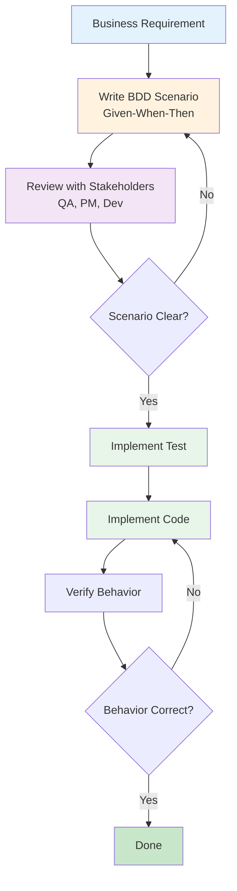

# BDD (Behavior-Driven Development)

**Behavior-Driven Development (BDD)** is a software development methodology that focuses on describing the **behavior** of a system from the user's perspective using natural language. BDD extends TDD by emphasizing collaboration between developers, QA, and business stakeholders.

---

## Core Concept: Given-When-Then

BDD uses a structured format to describe behavior:

```gherkin
Given [initial context/state]
When [action/event occurs]
Then [expected outcome]
```

### Example: User Login

```gherkin
Given a user with email "user@example.com" and password "SecurePass123"
When the user submits the login form
Then the user should be redirected to the dashboard
And a session token should be stored
```

---

## BDD vs TDD

| Aspect | TDD | BDD |
|--------|-----|-----|
| **Focus** | Testing implementation | Describing behavior |
| **Language** | Technical (code-focused) | Natural (user-focused) |
| **Audience** | Developers | Developers, QA, Business |
| **Structure** | Test functions | Given-When-Then scenarios |
| **Goal** | Prevent bugs | Shared understanding |
| **When used** | During implementation | During requirements + implementation |

### TDD Example

```typescript
// Technical focus: Testing function behavior
test('should return hashed password', async () => {
  const result = await hashPassword('password123');
  expect(result).toMatch(/^\$2[aby]\$\d+\$/);
});
```

### BDD Example

```typescript
// User behavior focus: What happens from user perspective
describe('User Registration', () => {
  test('Given valid credentials, When user registers, Then account is created', async () => {
    // Behavior-focused test
  });
});
```

---

## BDD Workflow



---

## BDD in SpecWeave

SpecWeave uses **BDD format** for test plans in `tasks.md`:

### Example Task with BDD

```markdown
## T-001: Implement User Login

**AC**: AC-US1-01 (User can log in with valid credentials)

**Test Plan** (BDD format):
- **Given** user with valid email and password → **When** login submitted → **Then** redirect to dashboard with JWT token
- **Given** user with invalid password → **When** login submitted → **Then** show error "Invalid credentials"
- **Given** user with 5 failed attempts → **When** 6th attempt → **Then** lock account for 15 minutes

**Test Cases**:
- Unit (`auth.test.ts`): validLogin, invalidPassword, accountLocking → 90% coverage
- Integration (`auth-flow.test.ts`): loginEndpoint, sessionPersistence → 85% coverage
- E2E (`login.spec.ts`): completeLoginFlow → 100% critical path

**Implementation**: AuthService.ts, JWT generation, rate limiting

**Overall Coverage**: 88%
```

### BDD Format Benefits

1. **Clear Intent**: Stakeholders understand what's being tested
2. **Traceability**: Given-When-Then maps to acceptance criteria
3. **Comprehensive**: Forces thinking about edge cases
4. **Living Documentation**: Test plans document behavior

---

## BDD Frameworks and Tools

### Cucumber/Gherkin (Specification by Example)

**Gherkin** is a domain-specific language for writing BDD scenarios:

```gherkin
Feature: User Authentication
  As a user
  I want to log in with my credentials
  So that I can access my account

  Scenario: Successful login with valid credentials
    Given a registered user with email "user@example.com"
    And the user's password is "SecurePass123"
    When the user navigates to the login page
    And enters their email and password
    And clicks the "Login" button
    Then the user should be redirected to "/dashboard"
    And a session cookie should be set

  Scenario: Failed login with invalid password
    Given a registered user with email "user@example.com"
    When the user enters email "user@example.com"
    And enters password "WrongPassword"
    And clicks the "Login" button
    Then an error message "Invalid credentials" should be displayed
    And the user should remain on the login page

  Scenario: Account lockout after multiple failed attempts
    Given a registered user with email "user@example.com"
    And the user has failed to login 5 times
    When the user attempts to login again
    Then an error message "Account locked for 15 minutes" should be displayed
    And no further login attempts should be allowed
```

**Implementation** (Cucumber + JavaScript):

```javascript
// features/step_definitions/auth.steps.js
const { Given, When, Then } = require('@cucumber/cucumber');
const { expect } = require('chai');

Given('a registered user with email {string}', function (email) {
  this.user = { email, password: 'SecurePass123' };
  // Create user in test database
});

When('the user enters their email and password', function () {
  this.page.fill('[name="email"]', this.user.email);
  this.page.fill('[name="password"]', this.user.password);
});

Then('the user should be redirected to {string}', async function (path) {
  await expect(this.page.url()).to.include(path);
});
```

### Jest with describe/it (BDD-style)

**Jest** can be written in BDD style using descriptive test names:

```typescript
// tests/unit/services/auth.test.ts
describe('AuthService', () => {
  describe('User Login', () => {
    it('should redirect to dashboard when credentials are valid', async () => {
      // Given: Valid user credentials
      const email = 'user@example.com';
      const password = 'SecurePass123';

      // When: User logs in
      const result = await authService.login(email, password);

      // Then: Redirect to dashboard with token
      expect(result.redirectUrl).toBe('/dashboard');
      expect(result.token).toBeDefined();
    });

    it('should show error when password is invalid', async () => {
      // Given: User with wrong password
      const email = 'user@example.com';
      const password = 'WrongPassword';

      // When: User attempts login
      const login = () => authService.login(email, password);

      // Then: Error is thrown
      await expect(login()).rejects.toThrow('Invalid credentials');
    });

    it('should lock account after 5 failed attempts', async () => {
      // Given: User has failed 5 times
      const email = 'user@example.com';
      await simulateFailedAttempts(email, 5);

      // When: 6th attempt is made
      const result = () => authService.login(email, 'AnyPassword');

      // Then: Account is locked
      await expect(result()).rejects.toThrow('Account locked for 15 minutes');
    });
  });
});
```

---

## BDD Patterns

### Specification by Example

Turn abstract requirements into **concrete examples**:

**Abstract Requirement**:
> Users should not be able to withdraw more than their account balance

**Concrete Examples** (BDD):
```gherkin
Scenario: Successful withdrawal within balance
  Given account balance is $100
  When user withdraws $50
  Then withdrawal succeeds
  And balance is $50

Scenario: Failed withdrawal exceeding balance
  Given account balance is $100
  When user attempts to withdraw $150
  Then withdrawal fails with error "Insufficient funds"
  And balance remains $100
```

### Background (Common Setup)

Use `Background` to avoid repeating setup:

```gherkin
Feature: Shopping Cart

  Background:
    Given the user is logged in as "user@example.com"
    And the cart is empty

  Scenario: Add product to cart
    When the user adds "Laptop" to cart
    Then the cart should contain 1 item

  Scenario: Remove product from cart
    Given the cart contains "Laptop"
    When the user removes "Laptop" from cart
    Then the cart should be empty
```

### Scenario Outline (Data-Driven Tests)

Test multiple inputs with same scenario:

```gherkin
Scenario Outline: Password validation
  Given a user registration form
  When the user enters password "<password>"
  Then the validation result should be "<result>"

  Examples:
    | password      | result  |
    | abc           | Invalid |
    | abcdefgh      | Valid   |
    | Ab1!          | Invalid |
    | Abcdefgh1!    | Valid   |
```

---

## BDD in Different Testing Levels

### Unit Tests (BDD-style)

```typescript
describe('Order.calculateTotal()', () => {
  it('should return sum of item prices', () => {
    // Given: Order with 2 items
    const order = new Order();
    order.addItem({ price: 100 });
    order.addItem({ price: 50 });

    // When: Calculating total
    const total = order.calculateTotal();

    // Then: Total is sum of prices
    expect(total).toBe(150);
  });
});
```

### Integration Tests (BDD-style)

```typescript
describe('POST /api/orders', () => {
  it('should create order and update inventory', async () => {
    // Given: Product in stock
    await createProduct({ id: 'laptop', stock: 10 });

    // When: User creates order
    const response = await request(app)
      .post('/api/orders')
      .send({ productId: 'laptop', quantity: 2 });

    // Then: Order created and stock reduced
    expect(response.status).toBe(201);
    expect(response.body.order.id).toBeDefined();

    const product = await getProduct('laptop');
    expect(product.stock).toBe(8);
  });
});
```

### E2E Tests (BDD-style with Playwright)

```typescript
test('User can complete checkout flow', async ({ page }) => {
  // Given: User has items in cart
  await page.goto('/products');
  await page.click('[data-product="laptop"]');
  await page.click('button:has-text("Add to Cart")');

  // When: User proceeds to checkout
  await page.click('a[href="/cart"]');
  await page.click('button:has-text("Checkout")');
  await page.fill('[name="cardNumber"]', '4242424242424242');
  await page.click('button:has-text("Pay")');

  // Then: Order is confirmed
  await expect(page.locator('text=Order Confirmed')).toBeVisible();
  await expect(page.url()).toContain('/order-success');
});
```

---

## BDD Benefits

### 1. Shared Understanding

BDD scenarios create **ubiquitous language** between technical and non-technical stakeholders:

```gherkin
# Business stakeholder writes this (no code required):
Scenario: Premium user gets free shipping
  Given a user with "Premium" membership
  When the user places an order over $50
  Then shipping cost should be $0
```

### 2. Living Documentation

BDD scenarios document system behavior in executable format:

```bash
# Run tests to generate living documentation
npm run test:bdd -- --format html > bdd-report.html

# Output shows all scenarios with pass/fail status
```

### 3. Improved Communication

BDD forces clarifying questions **before** implementation:

**Vague Requirement**: "Users should be able to reset password"

**BDD Clarification**:
```gherkin
Scenario: Password reset with valid email
  Given a user with email "user@example.com"
  When the user requests password reset
  Then a reset link should be sent to "user@example.com"
  And the link should expire after 1 hour

Scenario: Password reset with unregistered email
  Given an email "unknown@example.com" is not registered
  When the user requests password reset
  Then no email should be sent (security: don't reveal if email exists)
  But a success message should still be shown
```

### 4. Acceptance Criteria Validation

BDD scenarios ARE executable acceptance criteria:

**User Story**:
> As a user, I want to log in with email and password

**Acceptance Criteria** (BDD scenarios):
```gherkin
Scenario: Successful login ✅
Scenario: Invalid password ✅
Scenario: Account lockout ✅
```

---

## BDD Anti-Patterns

### 1. Too Much Detail (Imperative vs Declarative)

```gherkin
# ❌ Bad: Imperative (too much UI detail)
Scenario: User login
  Given the user opens "https://example.com/login"
  And the user clicks the email field
  And the user types "user@example.com" in the email field
  And the user clicks the password field
  And the user types "password" in the password field
  And the user clicks the "Login" button
  Then the browser URL should be "https://example.com/dashboard"

# ✅ Good: Declarative (focus on behavior)
Scenario: User login
  Given a registered user with email "user@example.com"
  When the user logs in with valid credentials
  Then the user should see their dashboard
```

### 2. Testing Implementation Details

```gherkin
# ❌ Bad: Tests implementation
Scenario: Password hashing
  Given a password "password123"
  When the password is hashed using bcrypt with 10 salt rounds
  Then the hash should start with "$2b$10$"

# ✅ Good: Tests behavior
Scenario: Secure password storage
  Given a user registers with password "password123"
  When the user's account is created
  Then the password should be stored securely (not plain text)
```

### 3. Scenarios Without Clear Value

```gherkin
# ❌ Bad: Tests obvious behavior
Scenario: Button exists
  Given the login page
  Then a "Login" button should be visible

# ✅ Good: Tests meaningful behavior
Scenario: Login button enables when form is valid
  Given the user has entered valid email and password
  When all validation passes
  Then the "Login" button should be enabled
```

---

## BDD Tools Ecosystem

### JavaScript/TypeScript

- **Cucumber.js**: Gherkin syntax, step definitions
- **Jest**: BDD-style with describe/it
- **Playwright**: E2E testing with BDD structure
- **Vitest**: Modern Jest alternative

### Python

- **Behave**: Gherkin for Python
- **pytest-bdd**: BDD plugin for pytest

### Ruby

- **RSpec**: BDD framework for Ruby
- **Cucumber**: Original Gherkin implementation

### Java

- **Cucumber-JVM**: Gherkin for Java
- **JBehave**: BDD framework

---

## Related Terms

- [TDD (Test-Driven Development)](/docs/glossary/terms/tdd) - Write tests before code
- [Unit Testing](/docs/glossary/terms/unit-testing) - Testing individual functions
- E2E Testing - Testing complete user flows
- Acceptance Testing - Validating business requirements

---

## Summary

**BDD focuses on behavior**:
- **Given-When-Then** format for clarity
- **Natural language** for collaboration
- **Living documentation** via executable scenarios
- **Shared understanding** between technical and business

**SpecWeave uses BDD**:
- Test plans in `tasks.md` use Given-When-Then format
- AC-IDs trace from spec.md to tasks.md to tests
- BDD clarifies intent for all stakeholders

**Key insight**: BDD is about **communication first, testing second**. It bridges the gap between business requirements and technical implementation.
