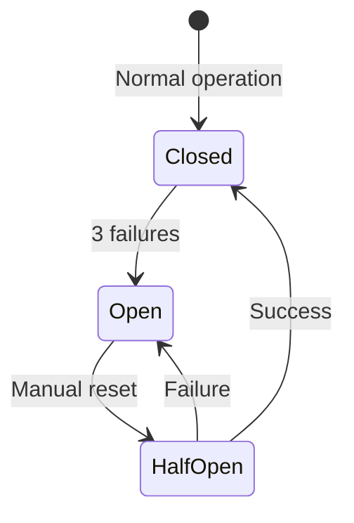

# Circuit Breaker

A **Circuit Breaker** is a safety mechanism in SpecWeave that prevents cascading failures when hooks or sync operations repeatedly fail. After 3 consecutive failures, the circuit "trips" and stops further attempts until manually reset.

---

## How It Works



| State | Behavior |
|-------|----------|
| **Closed** | Normal operation, all requests pass through |
| **Open** | Blocked, requests fail fast without trying |
| **Half-Open** | Testing if service recovered |

---

## When It Trips

The circuit breaker trips when:

1. **Hook failures**: Same hook fails 3 times in a row
2. **Sync failures**: GitHub/JIRA/ADO sync fails repeatedly
3. **API errors**: External service returns errors consistently

---

## Benefits

1. **Prevents crash loops**: Stops repeated failing operations
2. **Protects resources**: Stops hammering failing services
3. **Enables recovery**: Gives systems time to recover
4. **Fail fast**: Returns errors quickly instead of timing out

---

## Checking Status

```bash
# Check if circuit breaker is tripped
cat .specweave/state/.hook-circuit-breaker 2>/dev/null

# If output shows "open", the circuit is tripped
```

---

## Resetting

When you've fixed the underlying issue:

```bash
# Reset circuit breaker
rm -f .specweave/state/.hook-circuit-breaker*

# Or reset all hook state
rm -f .specweave/state/.hook-*
```

---

## Configuration

Circuit breaker thresholds can be configured:

```json
// .specweave/config.json
{
  "circuitBreaker": {
    "failureThreshold": 3,
    "resetTimeout": 60000
  }
}
```

---

## Related Terms

- [Hooks](/docs/glossary/terms/hooks) - Protected by circuit breakers
- [Split-Source Sync](/docs/glossary/terms/split-source-sync) - Uses circuit breakers for external APIs
- [Context Explosion](/docs/glossary/terms/context-explosion) - Different failure mode
