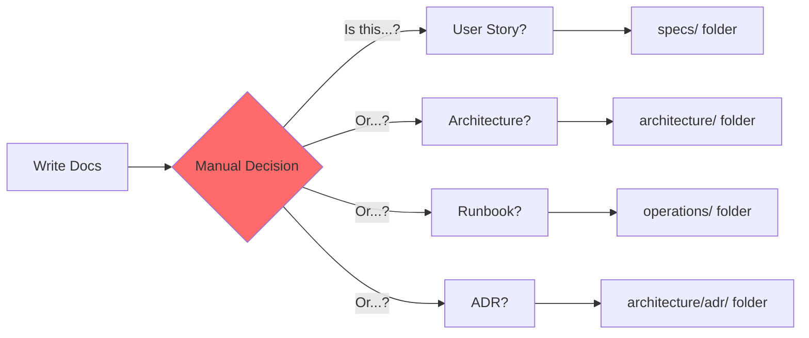
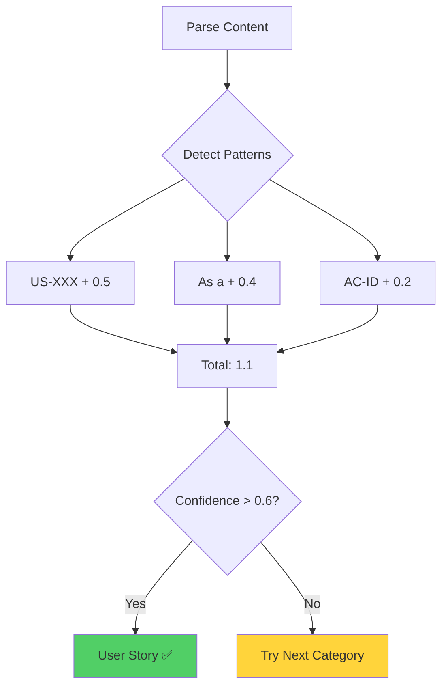
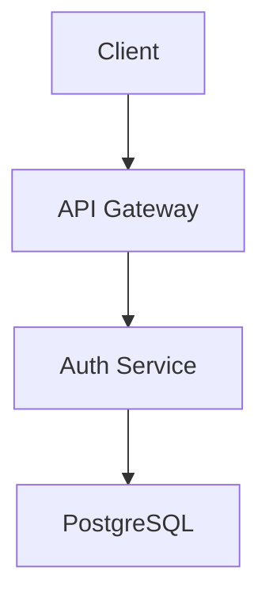
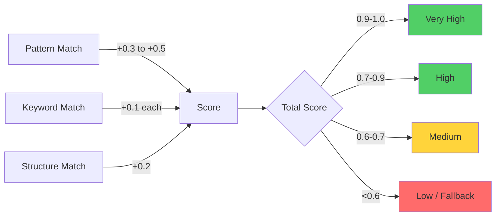

# Content Classification

**Content Classification** is SpecWeave's automatic system for categorizing documentation into nine distinct types (user stories, NFRs, architecture, ADRs, operations, delivery, strategy, governance, overview). Each category has specific detection patterns, confidence scoring, and target folders for intelligent organization.

---

## The Problem with Manual Classification

Traditional documentation requires **manual organization**:



**Problems**:
- ❌ **Manual work** (developer must decide)
- ❌ **Inconsistent** (different people classify differently)
- ❌ **Error-prone** (easy to put files in wrong folder)
- ❌ **Time-consuming** (extra step for every document)
- ❌ **No validation** (no check if classification is correct)

---

## Automatic Classification: The Solution

**Pattern-based detection** with confidence scoring:



**Benefits**:
- ✅ **Zero manual work** (automatic detection)
- ✅ **Consistent** (same rules for everyone)
- ✅ **Accurate** (pattern-based with confidence scoring)
- ✅ **Fast** (10-20ms per document)
- ✅ **Validated** (confidence threshold ensures quality)

---

## 9-Category System

SpecWeave classifies content into **nine categories**:

```mermaid
graph TB
    A{Content Type?} --> B1[User Story]
    A --> B2[NFR]
    A --> B3[Architecture]
    A --> B4[ADR]
    A --> B5[Operations]
    A --> B6[Delivery]
    A --> B7[Strategy]
    A --> B8[Governance]
    A --> B9[Overview]

    B1 --> C1[specs/{project}/]
    B2 --> C2[specs/{project}/nfr/]
    B3 --> C3[architecture/]
    B4 --> C4[architecture/adr/]
    B5 --> C5[operations/]
    B6 --> C6[delivery/]
    B7 --> C7[strategy/]
    B8 --> C8[governance/]
    B9 --> C9[specs/{project}/]

    style B1 fill:#51cf66
    style B4 fill:#ff922b
    style B5 fill:#ff6b6b
```

### Complete Category Table

| Category | Pattern | Keywords | Target Folder | Confidence |
|----------|---------|----------|---------------|------------|
| **1. User Story** | `US-\d+`, `As a .* I want` | `acceptance criteria`, `AC-` | `specs/{project}/` | 0.9 |
| **2. NFR** | `NFR-\d+`, `performance`, `scalability` | `latency`, `throughput`, `SLO`, `SLA` | `specs/{project}/nfr/` | 0.8 |
| **3. Architecture** | `architecture`, `mermaid`, `C4` | `system design`, `HLD`, `LLD`, `diagram` | `architecture/` | 0.7 |
| **4. ADR** | `ADR-\d+`, `## Context`, `## Decision` | `decision`, `options`, `consequences` | `architecture/adr/` | 0.9 |
| **5. Operations** | `runbook`, `SLO`, `incident` | `postmortem`, `monitoring`, `alerts` | `operations/` | 0.8 |
| **6. Delivery** | `test strategy`, `pipeline`, `deployment` | `CI/CD`, `release`, `build`, `deploy` | `delivery/` | 0.7 |
| **7. Strategy** | `PRD`, `business`, `vision` | `objectives`, `goals`, `roadmap`, `market` | `strategy/` | 0.7 |
| **8. Governance** | `security`, `GDPR`, `HIPAA` | `compliance`, `policy`, `audit`, `SOC 2` | `governance/` | 0.8 |
| **9. Overview** | `overview`, `summary`, `quick start` | `introduction`, `getting started` | `specs/{project}/` | 0.6 |

---

## Detection Patterns

### 1. User Story

**Patterns**:
- `US-\d+` (e.g., US-001, US-002) → +0.5
- `As a .* I want` → +0.4
- `Acceptance Criteria` → +0.2
- `AC-US\d+-\d+` (e.g., AC-US1-01) → +0.2

**Keywords** (+0.1 each):
- `user story`, `feature`, `functionality`, `acceptance criteria`

**Example**:
```markdown
### US-001: User Login

**As a** user
**I want** to log in with my email and password
**So that** I can access my personalized dashboard

**Acceptance Criteria**:
- [ ] AC-US1-01: User can log in with valid credentials (P1)
```

**Detection**:
- Pattern: `US-001` → +0.5
- Pattern: `As a .* I want` → +0.4
- Keyword: `Acceptance Criteria` → +0.2
- **Total**: 1.1
- **Confidence**: 0.9 (high)
- **Category**: User Story ✅

### 2. NFR (Non-Functional Requirement)

**Patterns**:
- `NFR-\d+` (e.g., NFR-001) → +0.5
- `performance` → +0.3
- `scalability` → +0.3
- `latency < \d+ms` → +0.2

**Keywords** (+0.1 each):
- `throughput`, `SLO`, `SLA`, `availability`, `reliability`

**Example**:
```markdown
### NFR-001: API Performance

**Requirement**: All API endpoints must respond within 200ms at p95

**Metrics**:
- Latency: &lt;200ms (p95)
- Throughput: >10,000 req/sec
- Availability: 99.9% (SLO)
```

**Detection**:
- Pattern: `NFR-001` → +0.5
- Keyword: `performance` → +0.3
- Keyword: `Latency` → +0.1
- Keyword: `SLO` → +0.1
- **Total**: 1.0
- **Confidence**: 0.8 (high)
- **Category**: NFR ✅

### 3. Architecture

**Patterns**:
- `architecture` → +0.3
- ` ```mermaid` → +0.3
- `C4 model` → +0.3
- `HLD`, `LLD` → +0.2 each

**Keywords** (+0.1 each):
- `system design`, `component`, `service`, `diagram`, `flow`

**Example**:
```markdown
### Authentication System Architecture

High-level design for authentication service.



**Components**:
- Auth Service: Handles login/logout
- PostgreSQL: Stores user credentials
```

**Detection**:
- Keyword: `Architecture` → +0.3
- Pattern: ` ```mermaid` → +0.3
- Keyword: `system design` → +0.1
- **Total**: 0.7
- **Confidence**: 0.7 (medium)
- **Category**: Architecture ✅

### 4. ADR (Architecture Decision Record)

**Patterns**:
- `ADR-\d+` (e.g., ADR-001) → +0.5
- `## Context` → +0.3
- `## Decision` → +0.3
- `## Consequences` → +0.2

**Keywords** (+0.1 each):
- `options`, `alternative`, `trade-offs`, `rationale`

**Example**:
```markdown
### ADR-001: OAuth vs JWT for Authentication

## Context

We need to choose an authentication mechanism for our API.

## Decision

We will use JWT (JSON Web Tokens) for stateless authentication.

## Options Considered

1. OAuth 2.0 (complex, requires authorization server)
2. JWT (simple, stateless, self-contained)
3. Session cookies (stateful, requires session store)

## Consequences

**Positive**:
- Stateless (no session store needed)
- Scalable (no shared state)
- Simple (easy to implement)

**Negative**:
- Token revocation is hard
- Larger payload than session ID
```

**Detection**:
- Pattern: `ADR-001` → +0.5
- Pattern: `## Context` → +0.3
- Pattern: `## Decision` → +0.3
- Keyword: `Options Considered` → +0.1
- **Total**: 1.2
- **Confidence**: 0.9 (high)
- **Category**: ADR ✅

### 5. Operations

**Patterns**:
- `runbook` → +0.4
- `SLO`, `SLA` → +0.3 each
- `incident`, `postmortem` → +0.3 each

**Keywords** (+0.1 each):
- `monitoring`, `alerts`, `on-call`, `troubleshooting`, `recovery`

**Example**:
```markdown
### Runbook: Authentication Service Downtime

## Symptoms

- Login API returns 503 errors
- Health check fails
- Auth service pods restarting

## Diagnosis

1. Check pod status: `kubectl get pods -n auth`
2. Check logs: `kubectl logs -n auth auth-service-xxx`
3. Check database connectivity

## Resolution

1. Restart auth service: `kubectl rollout restart deployment/auth-service -n auth`
2. Scale up replicas if needed: `kubectl scale deployment/auth-service --replicas=5 -n auth`
3. Verify health: `curl https://api.example.com/auth/health`

## Prevention

- Add database connection pooling
- Increase pod resource limits
- Improve error handling
```

**Detection**:
- Keyword: `Runbook` → +0.4
- Keyword: `incident` → +0.3
- Keyword: `troubleshooting` → +0.1
- Keyword: `recovery` → +0.1
- **Total**: 0.9
- **Confidence**: 0.8 (high)
- **Category**: Operations ✅

### 6. Delivery

**Patterns**:
- `test strategy` → +0.4
- `pipeline`, `deployment` → +0.3 each
- `CI/CD` → +0.3

**Keywords** (+0.1 each):
- `release`, `build`, `deploy`, `staging`, `production`

**Example**:
```markdown
### Test Strategy: Authentication Service

## Test Pyramid

- **Unit Tests**: 90% coverage (AuthService, validators)
- **Integration Tests**: 85% coverage (API endpoints)
- **E2E Tests**: 100% critical path (login flow)

## Testing Approach

1. **TDD**: Write tests before implementation (Red → Green → Refactor)
2. **Mocking**: Use test doubles for external dependencies
3. **CI Integration**: Run tests on every PR

## Coverage Targets

- Critical paths: 100%
- Business logic: 90%
- Overall: 85%
```

**Detection**:
- Keyword: `Test Strategy` → +0.4
- Keyword: `Test Pyramid` → +0.2
- Keyword: `coverage` → +0.1
- **Total**: 0.7
- **Confidence**: 0.7 (medium)
- **Category**: Delivery ✅

### 7. Strategy

**Patterns**:
- `PRD` → +0.4
- `business`, `vision` → +0.3 each
- `objectives`, `goals` → +0.2 each

**Keywords** (+0.1 each):
- `roadmap`, `market`, `customer`, `value proposition`

**Example**:
```markdown
### Product Requirements Document: Authentication

## Business Objective

Enable secure user authentication to support personalized experiences and reduce support costs.

## Market Context

- 80% of competitors offer OAuth social login
- Users expect seamless authentication
- Security is top concern (GDPR compliance)

## Success Criteria

- Reduce login support tickets by 50%
- Achieve 99.9% authentication uptime
- Support 10,000 concurrent logins
```

**Detection**:
- Keyword: `PRD` → +0.4
- Keyword: `Business Objective` → +0.3
- Keyword: `Market Context` → +0.1
- **Total**: 0.8
- **Confidence**: 0.7 (medium)
- **Category**: Strategy ✅

### 8. Governance

**Patterns**:
- `security` → +0.3
- `GDPR`, `HIPAA`, `SOC 2` → +0.3 each
- `compliance`, `policy` → +0.3 each

**Keywords** (+0.1 each):
- `audit`, `regulation`, `privacy`, `data protection`

**Example**:
```markdown
### Security Policy: Password Storage

## Requirements

All user passwords must be stored securely using industry-standard hashing algorithms.

## Compliance

- **OWASP**: Top 10 security best practices
- **GDPR**: Article 32 (Security of processing)
- **SOC 2**: Trust Services Criteria (CC6.1)

## Implementation

- Use bcrypt with 10 salt rounds (minimum)
- Never store plaintext passwords
- Implement rate limiting (5 attempts / 15 minutes)
- Log all authentication attempts
```

**Detection**:
- Keyword: `Security Policy` → +0.3
- Keyword: `Compliance` → +0.3
- Keyword: `GDPR` → +0.3
- Keyword: `OWASP` → +0.1
- **Total**: 1.0
- **Confidence**: 0.8 (high)
- **Category**: Governance ✅

### 9. Overview

**Patterns**:
- `overview`, `summary` → +0.3 each
- `quick start`, `getting started` → +0.3 each
- `introduction` → +0.2

**Keywords** (+0.1 each):
- `about`, `what is`, `how to use`

**Example**:
```markdown
### Overview: Authentication System

## Quick Summary

This increment implements basic authentication with email/password, session management, and rate limiting.

## What's Included

- User login/logout
- Password hashing (bcrypt)
- JWT session tokens
- Rate limiting (5 attempts / 15 minutes)

## Getting Started

See [US-001](./us-001-user-login.md) for user login flow.
```

**Detection**:
- Keyword: `Overview` → +0.3
- Keyword: `Quick Summary` → +0.3
- Keyword: `Getting Started` → +0.3
- **Total**: 0.9
- **Confidence**: 0.6 (medium)
- **Category**: Overview ✅

---

## Confidence Scoring

Each category gets a **confidence score** (0.0 to 1.0):



### Confidence Levels

| Confidence | Range | Meaning | Action |
|------------|-------|---------|--------|
| **Very High** | 0.9-1.0 | Strong match (multiple patterns) | Classify with high confidence |
| **High** | 0.7-0.9 | Good match (primary pattern + keywords) | Classify with medium confidence |
| **Medium** | 0.6-0.7 | Acceptable match (keywords only) | Classify if above threshold |
| **Low** | &lt;0.6 | Weak match (fallback) | Try next category or use fallback |

**Default Threshold**: 0.6 (medium confidence minimum)

---

## Classification Algorithm

```typescript
// Pseudocode for classification
function classifySection(section: Section): Classification {
  const scores = {
    userStory: 0,
    nfr: 0,
    architecture: 0,
    adr: 0,
    operations: 0,
    delivery: 0,
    strategy: 0,
    governance: 0,
    overview: 0
  };

  // 1. Pattern matching (high weight)
  if (section.heading.match(/US-\d+/)) scores.userStory += 0.5;
  if (section.content.match(/As a .* I want/)) scores.userStory += 0.4;
  if (section.heading.match(/ADR-\d+/)) scores.adr += 0.5;
  if (section.content.match(/## Context/)) scores.adr += 0.3;

  // 2. Keyword matching (medium weight)
  if (section.content.includes('runbook')) scores.operations += 0.4;
  if (section.content.includes('test strategy')) scores.delivery += 0.4;
  if (section.content.includes('architecture')) scores.architecture += 0.3;

  // 3. Structure matching (low weight)
  if (section.content.match(/```mermaid/)) scores.architecture += 0.3;
  if (section.content.includes('## Decision')) scores.adr += 0.3;

  // 4. Find highest score
  const category = Object.keys(scores).reduce((a, b) =>
    scores[a] > scores[b] ? a : b
  );

  const confidence = scores[category];

  // 5. Check threshold
  if (confidence < 0.6) {
    return {category: 'overview', confidence: 0.6}; // Fallback
  }

  return {category, confidence};
}
```

---

## Configuration

**Adjust Classification Settings** (`.specweave/config.json`):

```json
{
  "livingDocs": {
    "intelligent": {
      "enabled": true,
      "classificationConfidenceThreshold": 0.6,  // Minimum confidence (0.0-1.0)
      "fallbackCategory": "overview",            // Default if no match
      "enablePatternMatching": true,             // Use patterns (recommended)
      "enableKeywordMatching": true,             // Use keywords (recommended)
      "enableStructureMatching": true            // Use structure (optional)
    }
  }
}
```

---

## Anti-Patterns

### 1. Too Low Confidence Threshold

```json
// ❌ Bad: Accept low-quality matches
{
  "classificationConfidenceThreshold": 0.3  // Too low
}
// Result: Misclassified content (user stories in operations/ folder)

// ✅ Good: Use default or higher
{
  "classificationConfidenceThreshold": 0.6  // Default (recommended)
}
// Result: Accurate classification
```

### 2. Disabling Pattern Matching

```json
// ❌ Bad: Disable patterns
{
  "enablePatternMatching": false  // Patterns off
}
// Result: Poor accuracy (relies only on keywords)

// ✅ Good: Keep patterns enabled
{
  "enablePatternMatching": true  // Patterns on (recommended)
}
// Result: High accuracy (patterns + keywords)
```

### 3. Manual Classification After Automatic

```bash
# ❌ Bad: Move files manually after automatic classification
mv specs/backend/us-001.md architecture/us-001.md
# Result: Next sync overwrites your manual change

# ✅ Good: Trust automatic classification or update patterns
# If classification is wrong, update patterns in config
```

---

## Related Terms

- [Intelligent Living Docs Sync](/docs/glossary/terms/intelligent-living-docs-sync) - Full sync system
- [Project Detection](/docs/glossary/terms/project-detection) - Multi-project support
- [User Stories](/docs/glossary/terms/user-stories) - User story format
- [ADR](/docs/glossary/terms/adr) - Architecture Decision Records
- [Acceptance Criteria](/docs/glossary/terms/acceptance-criteria) - AC format

---

## Summary

**Content Classification** automatically categorizes documentation into nine types:

**9 Categories**:
1. User Story → `specs/{project}/`
2. NFR → `specs/{project}/nfr/`
3. Architecture → `architecture/`
4. ADR → `architecture/adr/`
5. Operations → `operations/`
6. Delivery → `delivery/`
7. Strategy → `strategy/`
8. Governance → `governance/`
9. Overview → `specs/{project}/`

**Detection**:
- Pattern matching (US-XXX, ADR-XXX, etc.) → High weight
- Keyword matching (architecture, runbook, etc.) → Medium weight
- Structure matching (mermaid diagrams, ## Decision) → Low weight

**Confidence Scoring**:
- 0.9-1.0: Very high (multiple patterns)
- 0.7-0.9: High (primary pattern + keywords)
- 0.6-0.7: Medium (keywords only)
- &lt;0.6: Low (fallback to overview)

**Result**: Automatic, consistent, accurate organization with zero manual work.
