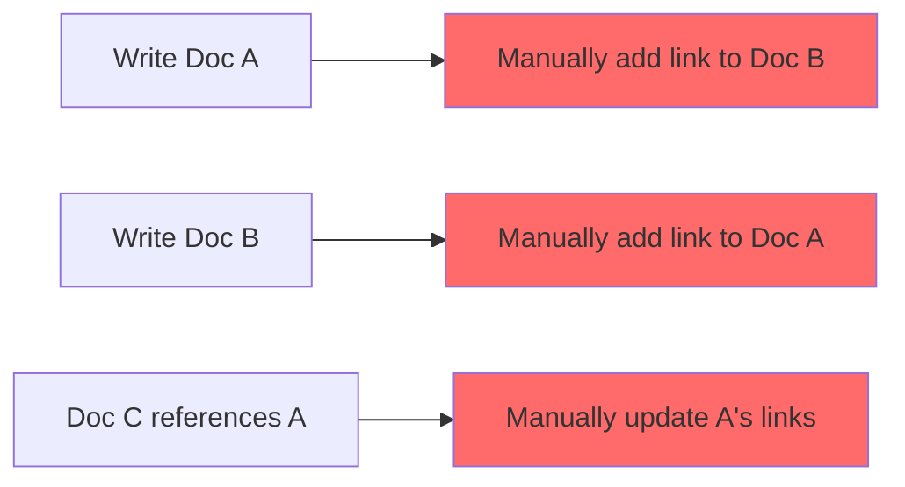
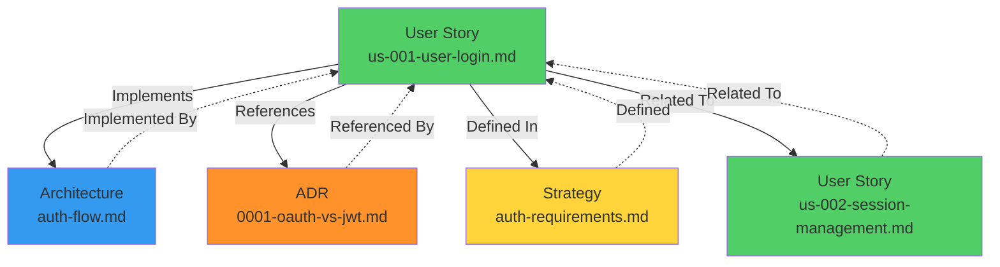
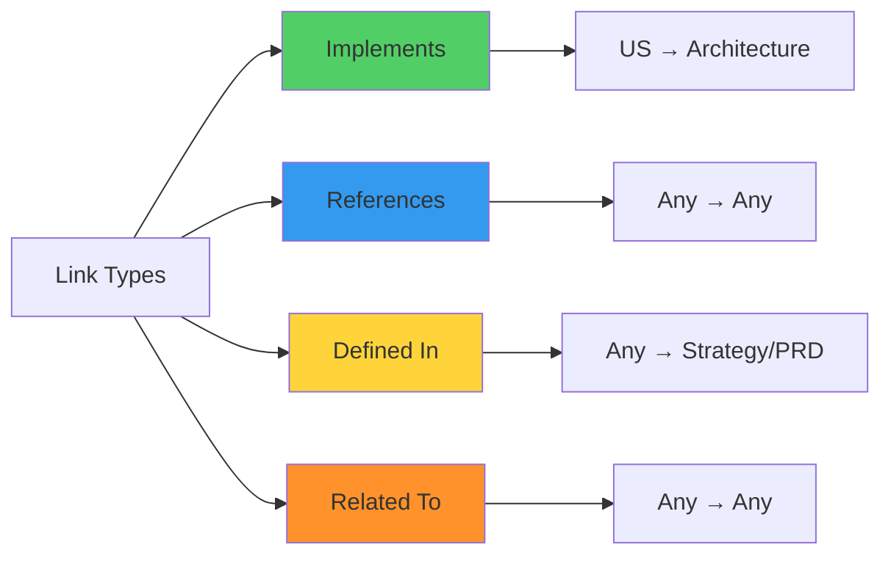
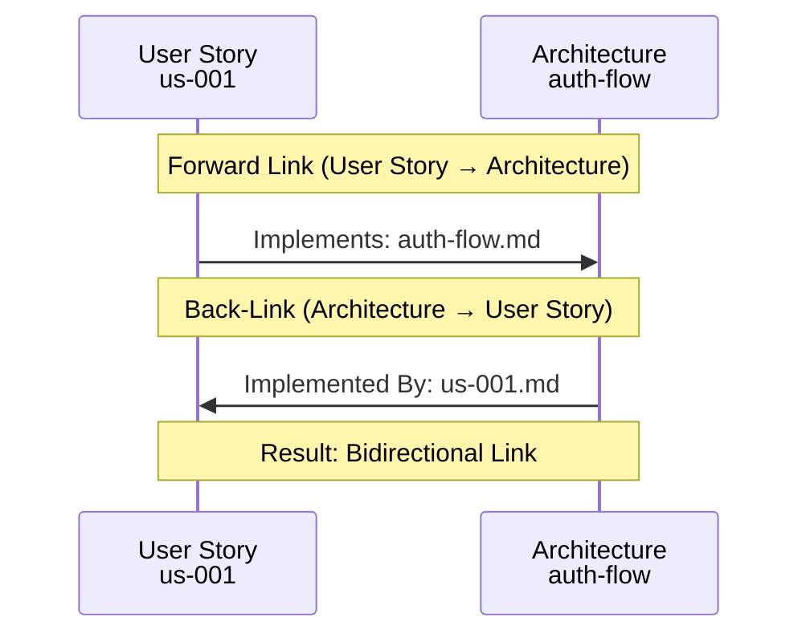
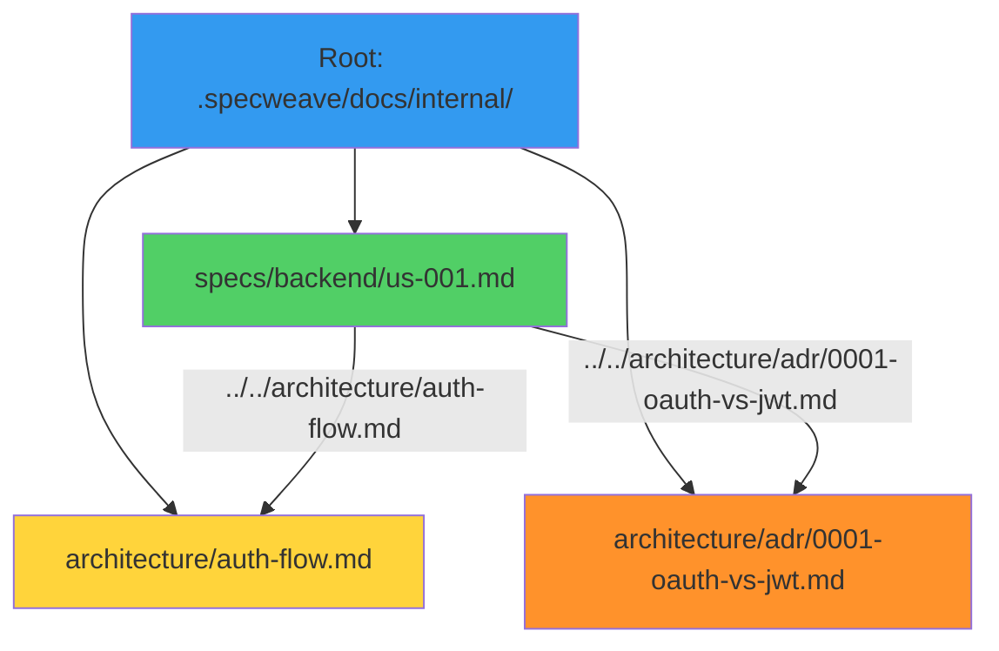

# Cross-Linking

**Cross-Linking** is SpecWeave's automatic system for generating bidirectional links between related documents. It creates four types of relationships (implements, references, defined-in, related-to) with relative path resolution and "Related Documents" sections in Markdown.

---

## The Problem with Manual Linking

Traditional documentation requires **manual links**:



**Problems**:
- ❌ **Manual work** (developer must add links)
- ❌ **Broken links** (doc moved, link outdated)
- ❌ **Unidirectional** (A links to B, but B doesn't link back)
- ❌ **Incomplete** (forget to link related docs)
- ❌ **Hard to maintain** (links break over time)

---

## Automatic Cross-Linking: The Solution

**Bidirectional links** generated automatically:



**Benefits**:
- ✅ **Zero manual work** (automatic detection)
- ✅ **Always accurate** (relative paths updated automatically)
- ✅ **Bidirectional** (A → B and B → A)
- ✅ **Complete** (all related docs connected)
- ✅ **Self-healing** (links update when files move)

---

## 4 Link Types

Cross-linking supports **four relationship types**:



### Link Type Details

| Link Type | Direction | Meaning | Example | Use When |
|-----------|-----------|---------|---------|----------|
| **Implements** | US → Architecture | User story implements architecture design | `us-001` → `auth-flow.md` | User story implements technical design |
| **References** | Any → Any | References another document (ADR, design, doc) | `us-001` → `adr/0001-oauth-vs-jwt.md` | Document cites or uses another doc |
| **Defined In** | Any → Strategy | Original business case or requirement | `us-001` → `auth-requirements.md` | Feature originates from PRD/strategy |
| **Related To** | Any → Any | Related but not directly dependent | `us-001` → `us-002-session-management.md` | Features in same area |

---

## Link Detection Patterns

### 1. Implements (US → Architecture)

**Pattern**: User stories automatically link to architecture docs in same domain

**Detection**:
```typescript
// Pseudocode
function findImplementsLinks(userStory: Doc): Link[] {
  const links: Link[] = [];
  const domain = userStory.category; // e.g., "authentication"

  // Find architecture docs with same domain
  const archDocs = findDocs({
    category: 'architecture',
    domain: domain
  });

  archDocs.forEach(arch => {
    links.push({
      type: 'implements',
      target: arch,
      reason: 'Same domain architecture'
    });
  });

  return links;
}
```

**Example**:
```markdown
<!-- User Story: us-001-user-login.md -->
# US-001: User Login

## Related Documents

### Implements
- [Authentication Architecture](../../architecture/auth-flow.md) - System design for authentication
```

### 2. References (Any → Any)

**Pattern**: Explicit `[text](path)` links in content

**Detection**:
```typescript
// Pseudocode
function findReferencesLinks(doc: Doc): Link[] {
  const links: Link[] = [];

  // Find all markdown links
  const matches = doc.content.matchAll(/\[([^\]]+)\]\(([^)]+)\)/g);

  for (const match of matches) {
    const [_, text, path] = match;

    // Only count links to other docs (not external URLs)
    if (!path.startsWith('http')) {
      links.push({
        type: 'references',
        target: path,
        reason: 'Explicit reference in content'
      });
    }
  }

  return links;
}
```

**Example**:
```markdown
<!-- User Story: us-001-user-login.md -->
# US-001: User Login

See [ADR-001: OAuth vs JWT](../../architecture/adr/0001-oauth-vs-jwt.md) for token design decisions.

## Related Documents

### References
- [ADR-001: OAuth vs JWT](../../architecture/adr/0001-oauth-vs-jwt.md) - Token design decision
```

### 3. Defined In (Any → Strategy)

**Pattern**: Documents link to originating PRD or business requirements

**Detection**:
```typescript
// Pseudocode
function findDefinedInLinks(doc: Doc): Link[] {
  const links: Link[] = [];

  // Find strategy docs that mention this feature
  const strategyDocs = findDocs({
    category: 'strategy',
    mentions: doc.title
  });

  strategyDocs.forEach(strat => {
    links.push({
      type: 'defined-in',
      target: strat,
      reason: 'Original business requirement'
    });
  });

  return links;
}
```

**Example**:
```markdown
<!-- User Story: us-001-user-login.md -->
# US-001: User Login

## Related Documents

### Defined In
- [Business Requirements](../../strategy/auth-requirements.md) - Original business case for authentication
```

### 4. Related To (Any → Any)

**Pattern**: Documents in same category or same increment

**Detection**:
```typescript
// Pseudocode
function findRelatedToLinks(doc: Doc): Link[] {
  const links: Link[] = [];

  // Find docs in same increment
  const incrementDocs = findDocs({
    increment: doc.increment,
    exclude: doc.id
  });

  // Find docs in same category
  const categoryDocs = findDocs({
    category: doc.category,
    exclude: doc.id
  });

  // Combine and deduplicate
  const allRelated = [...incrementDocs, ...categoryDocs];

  allRelated.forEach(related => {
    links.push({
      type: 'related-to',
      target: related,
      reason: 'Same increment or category'
    });
  });

  return links;
}
```

**Example**:
```markdown
<!-- User Story: us-001-user-login.md -->
# US-001: User Login

## Related Documents

### Related To
- [US-002: Session Management](./us-002-session-management.md) - Related user story
- [US-003: Rate Limiting](./us-003-rate-limiting.md) - Security measure for login
```

---

## Bidirectional Links

Cross-linking generates **automatic back-links**:



**Example**: Forward link + Back-link

**File 1**: `specs/backend/us-001-user-login.md`
```markdown
# US-001: User Login

## Related Documents

### Implements
- [Authentication Architecture](../../architecture/auth-flow.md)  ← Forward link
```

**File 2**: `architecture/auth-flow.md`
```markdown
# Authentication Architecture

## Related Documents

### Implemented By
- [US-001: User Login](../specs/backend/us-001-user-login.md)  ← Back-link (automatic)
```

---

## Relative Path Resolution

Cross-linking uses **relative paths** for portability:



**Path Calculation**:
```
From: specs/backend/us-001-user-login.md
To:   architecture/auth-flow.md

Step 1: Go up to root
  specs/backend/ → ../..

Step 2: Navigate to target
  ../../ + architecture/auth-flow.md

Result: ../../architecture/auth-flow.md
```

**Why Relative Paths?**
- ✅ **Portable** (works when docs folder moves)
- ✅ **Version controlled** (Git-friendly)
- ✅ **No hardcoded paths** (works on any machine)
- ✅ **Docusaurus compatible** (relative paths work in static sites)

---

## Related Documents Section Format

Cross-linking generates a **"Related Documents"** section:

```markdown
## Related Documents

### Implements
- [Authentication Architecture](../../architecture/auth-flow.md) - System design for authentication

### References
- [ADR-001: OAuth vs JWT](../../architecture/adr/0001-oauth-vs-jwt.md) - Why we chose JWT for sessions

### Defined In
- [Business Requirements](../../strategy/auth-requirements.md) - Original business case for authentication

### Related To
- [US-002: Session Management](./us-002-session-management.md) - Related user story
- [US-003: Rate Limiting](./us-003-rate-limiting.md) - Security measure for login
```

**Format Rules**:
- ✅ Markdown heading level 2 (`##`)
- ✅ Subsections for each link type (`###`)
- ✅ Bullet list of links (`-`)
- ✅ Link text: Target title (e.g., `Authentication Architecture`)
- ✅ Optional description after link (` - System design...`)

---

## Complete Example

**File**: `specs/backend/us-001-user-login.md`

```yaml
---
id: us-001-user-login
title: "US-001: User Login"
sidebar_label: "User Login"
description: "User can log in with email and password"
tags: ["user-story", "backend", "authentication", "P1"]
increment: "0016-authentication"
project: "backend"
category: "user-story"
last_updated: "2025-11-10"
status: "planning"
priority: "P1"
related:
  - us-002-session-management
  - architecture/auth-flow
  - architecture/adr/0001-oauth-vs-jwt
---

# US-001: User Login

**As a** user
**I want** to log in with my email and password
**So that** I can access my personalized dashboard

## Acceptance Criteria

- [ ] AC-US1-01: User can log in with valid credentials (P1, testable)
- [ ] AC-US1-02: Invalid credentials show error message (P1, testable)
- [ ] AC-US1-03: 5 failed attempts lock account for 15 minutes (P2, testable)

## Implementation Notes

This user story implements the [Authentication Architecture](../../architecture/auth-flow.md) design.
See [ADR-001: OAuth vs JWT](../../architecture/adr/0001-oauth-vs-jwt.md) for token design decisions.

## Related Documents

### Implements
- [Authentication Architecture](../../architecture/auth-flow.md) - System design for authentication
- [Session Token Design](../../architecture/session-token-design.md) - JWT token structure

### References
- [ADR-001: OAuth vs JWT](../../architecture/adr/0001-oauth-vs-jwt.md) - Why we chose JWT for sessions
- [ADR-002: bcrypt vs argon2](../../architecture/adr/0002-password-hashing.md) - Password hashing algorithm choice

### Defined In
- [Business Requirements](../../strategy/auth-requirements.md) - Original business case for authentication
- [PRD: Authentication System](../../strategy/prd-authentication.md) - Product requirements document

### Related To
- [US-002: Session Management](./us-002-session-management.md) - Related user story (session handling)
- [US-003: Rate Limiting](./us-003-rate-limiting.md) - Security measure for login attempts
- [NFR-001: Login Performance](./nfr/nfr-001-login-performance.md) - Performance requirements

---

**Source**: Increment [0016-authentication](../../../../increments/0016-authentication/spec.md)
**Last Updated**: 2025-11-10
```

---

## Configuration

**Enable Cross-Linking** (`.specweave/config.json`):

```json
{
  "livingDocs": {
    "intelligent": {
      "enabled": true,
      "generateCrossLinks": true,           // ✅ Enable cross-linking
      "crossLinkTypes": [                   // Link types to generate
        "implements",
        "references",
        "defined-in",
        "related-to"
      ],
      "includeLinkDescriptions": true,      // Add " - Description" after link
      "maxRelatedLinks": 10,                // Limit number of related links
      "excludeExternalLinks": true          // Don't include http:// links
    }
  }
}
```

---

## Performance

**Cross-linking is fast**:

| Metric | Time | Notes |
|--------|------|-------|
| **Find Implements** | 5ms | Search architecture docs |
| **Find References** | 3ms | Parse markdown links |
| **Find Defined In** | 5ms | Search strategy docs |
| **Find Related To** | 5ms | Search same increment/category |
| **Generate Section** | 2ms | Render markdown |
| **Total** | 20ms | Per document |

**Result**: Fast enough for real-time sync (&lt;50ms overhead).

---

## Anti-Patterns

### 1. Disabling Cross-Linking

```json
// ❌ Bad: Disable cross-linking
{
  "generateCrossLinks": false
}
// Result: No related documents, hard to navigate

// ✅ Good: Enable cross-linking
{
  "generateCrossLinks": true
}
// Result: Related documents automatically connected
```

### 2. Manual Links Instead of Automatic

```markdown
<!-- ❌ Bad: Manual links (will be overwritten) -->
## Related Documents
- [Some Doc](../some-doc.md)

<!-- ✅ Good: Let intelligent sync generate links -->
(No manual "Related Documents" section needed)
<!-- Links auto-generated on next sync -->
```

### 3. Too Many Related Links

```json
// ❌ Bad: Too many links (overwhelming)
{
  "maxRelatedLinks": 100  // Too many
}
// Result: 100 links in "Related To" section

// ✅ Good: Reasonable limit
{
  "maxRelatedLinks": 10  // Reasonable
}
// Result: Top 10 most relevant links
```

---

## Related Terms

- [Intelligent Living Docs Sync](/docs/glossary/terms/intelligent-living-docs-sync) - Full sync system
- [Content Classification](/docs/glossary/terms/content-classification) - 9-category system
- [Project Detection](/docs/glossary/terms/project-detection) - Multi-project support
- [Docusaurus Frontmatter](/docs/glossary/terms/docusaurus-frontmatter) - YAML metadata

---

## Summary

**Cross-Linking** automatically generates bidirectional links between related documents:

**4 Link Types**:
1. **Implements** - User story → Architecture
2. **References** - Any → Any (explicit links)
3. **Defined In** - Any → Strategy/PRD
4. **Related To** - Same increment or category

**Bidirectional**:
- Forward link: A → B
- Back-link: B → A (automatic)

**Relative Paths**:
- Portable (works when docs move)
- Version controlled (Git-friendly)
- Docusaurus compatible

**Performance**:
- Fast (&lt;20ms per document)
- Async (non-blocking)

**Result**: Documentation that's navigable, interconnected, and self-documenting.
