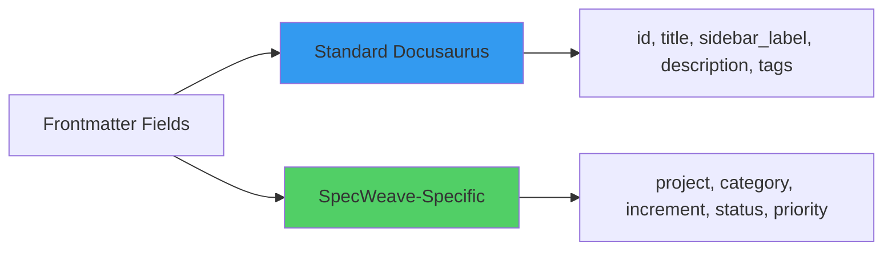
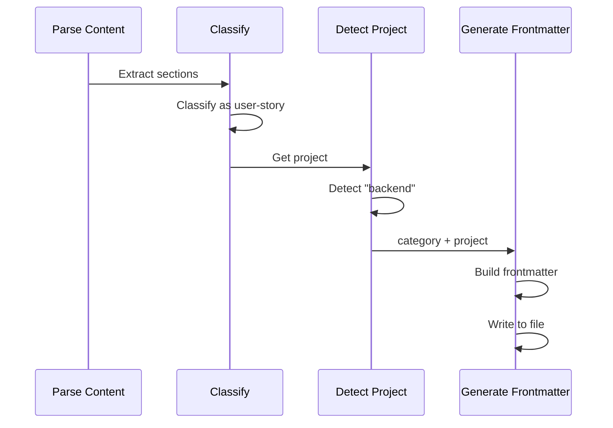

# Docusaurus Frontmatter

**Docusaurus Frontmatter** is YAML metadata at the top of Markdown files that provides context for Docusaurus static site generation and LLM understanding. SpecWeave's intelligent living docs sync automatically generates rich frontmatter with standard fields (id, title, sidebar_label, description, tags) and SpecWeave-specific fields (project, category, increment, status).

---

## What is Frontmatter?

**Frontmatter** is YAML metadata enclosed between `---` delimiters:

```markdown
---
id: us-001-user-login
title: "US-001: User Login"
sidebar_label: "User Login"
description: "User can log in with email and password"
tags: ["user-story", "backend", "authentication"]
---

# US-001: User Login

(Content follows...)
```

**Key Points**:
- ✅ YAML format (key-value pairs)
- ✅ Between `---` delimiters
- ✅ Must be at top of file (no content before)
- ✅ Provides metadata (not visible in rendered content)
- ✅ Used by Docusaurus for navigation, search, categorization

---

## Why Frontmatter Matters

Traditional docs lack metadata:

```markdown
# US-001: User Login

**As a** user
**I want** to log in with my email and password
**So that** I can access my personalized dashboard
```

**Problems**:
- ❌ **No context** (LLM doesn't know this is a user story)
- ❌ **No project** (which project? backend? frontend?)
- ❌ **No traceability** (which increment created this?)
- ❌ **Manual Docusaurus setup** (sidebar, search, tags)
- ❌ **Poor navigation** (no structured metadata)

---

## Rich Frontmatter: The Solution

**Automatic generation** with comprehensive metadata:

```yaml
---
id: us-001-user-login
title: "US-001: User Login"
sidebar_label: "User Login"
description: "User can log in with email and password"
tags: ["user-story", "backend", "authentication", "P1"]
increment: "0016-authentication"
project: "backend"
category: "user-story"
last_updated: "2025-11-10"
status: "planning"
priority: "P1"
author: "anton-abyzov"
related:
  - us-002-session-management
  - architecture/auth-flow
  - architecture/adr/0001-oauth-vs-jwt
---
```

**Benefits**:
- ✅ **LLM Context** (AI knows project, category, status)
- ✅ **Docusaurus Ready** (no manual setup)
- ✅ **Better Search** (tags, description)
- ✅ **Traceability** (increment, author, last_updated)
- ✅ **Navigation** (sidebar_label, related docs)

---

## Frontmatter Fields

SpecWeave generates **two categories** of fields:



### Standard Docusaurus Fields

| Field | Required | Purpose | Example | Generated From |
|-------|----------|---------|---------|----------------|
| **id** | ✅ | Unique document ID | `us-001-user-login` | Section heading (kebab-case) |
| **title** | ✅ | Page title | `"US-001: User Login"` | Section heading (full text) |
| **sidebar_label** | ⚠️ | Sidebar display text | `"User Login"` | Title without US-XXX prefix |
| **description** | ⚠️ | SEO, search | `"User can log in..."` | First paragraph or summary |
| **tags** | ⚠️ | Categorization, filtering | `["user-story", "backend"]` | Category + project + keywords |

### SpecWeave-Specific Fields

| Field | Required | Purpose | Example | Generated From |
|-------|----------|---------|---------|----------------|
| **increment** | ✅ | Traceability | `"0016-authentication"` | Increment ID from sync |
| **project** | ✅ | Multi-project | `"backend"` | Project detection algorithm |
| **category** | ✅ | Document type | `"user-story"` | Content classification |
| **last_updated** | ✅ | Freshness | `"2025-11-10"` | Current date |
| **status** | ⚠️ | Workflow state | `"planning"`, `"implementation"` | Increment status |
| **priority** | ⚠️ | Importance | `"P1"`, `"P2"` | AC priority or manual |
| **author** | ⚠️ | Ownership | `"anton-abyzov"` | Git author or config |
| **related** | ⚠️ | Cross-links | `["us-002-session-management"]` | Cross-linking algorithm |

---

## LLM Context (AI Understanding)

Frontmatter provides **rich context for LLMs**:

```yaml
---
id: us-001-user-login
title: "US-001: User Login"
project: "backend"         # ← LLM knows this is backend
category: "user-story"     # ← LLM knows this is a user story
increment: "0016-authentication"  # ← LLM knows which increment
tags: ["authentication", "security", "P1"]  # ← LLM knows topic
---
```

**Example Questions LLMs Can Answer**:

**Q1**: "Show me all backend user stories"
```bash
# LLM searches:
# - project: "backend"
# - category: "user-story"
# → Returns: us-001-user-login.md, us-002-session-management.md, ...
```

**Q2**: "Which increment implemented authentication?"
```bash
# LLM searches:
# - tags contains "authentication"
# - reads increment field: "0016-authentication"
# → Answer: Increment 0016
```

**Q3**: "What's the status of user login feature?"
```bash
# LLM reads us-001-user-login.md:
# - status: "planning"
# → Answer: Planning phase
```

**Q4**: "Find P1 user stories in backend"
```bash
# LLM filters:
# - project: "backend"
# - category: "user-story"
# - priority: "P1"
# → Returns: us-001-user-login.md (and others)
```

---

## Docusaurus Integration

Frontmatter enables **zero-config Docusaurus**:

### 1. Sidebar Generation

```yaml
---
sidebar_label: "User Login"  # ← Appears in sidebar
---
```

**Docusaurus Sidebar** (auto-generated):
```
Authentication
├── User Login          ← sidebar_label
├── Session Management
└── Rate Limiting
```

### 2. Search Index

```yaml
---
description: "User can log in with email and password"  # ← Indexed for search
tags: ["user-story", "authentication", "backend"]       # ← Indexed for search
---
```

**Search Results**:
```
Query: "authentication backend"
→ Match: us-001-user-login.md (tags: authentication, backend)
```

### 3. Breadcrumbs

```yaml
---
title: "US-001: User Login"  # ← Used in breadcrumbs
project: "backend"            # ← Used in breadcrumbs
---
```

**Breadcrumbs**:
```
Home > Backend > Specs > User Login
```

### 4. Last Updated

```yaml
---
last_updated: "2025-11-10"  # ← Shown at bottom of page
---
```

**Page Footer**:
```
Last updated: November 10, 2025
```

---

## Auto-Generation

Intelligent sync **automatically generates frontmatter**:



**Example Input** (no frontmatter):
```markdown
### US-001: User Login

**As a** user
**I want** to log in with my email and password
**So that** I can access my personalized dashboard

**Acceptance Criteria**:
- [ ] AC-US1-01: User can log in with valid credentials (P1)
```

**Example Output** (with generated frontmatter):
```yaml
---
id: us-001-user-login
title: "US-001: User Login"
sidebar_label: "User Login"
description: "User can log in with email and password"
tags: ["user-story", "backend", "authentication", "P1"]
increment: "0016-authentication"
project: "backend"
category: "user-story"
last_updated: "2025-11-10"
status: "planning"
priority: "P1"
related:
  - us-002-session-management
---

### US-001: User Login

**As a** user
**I want** to log in with my email and password
**So that** I can access my personalized dashboard

**Acceptance Criteria**:
- [ ] AC-US1-01: User can log in with valid credentials (P1)
```

---

## Configuration

**Enable Auto-Generated Frontmatter** (`.specweave/config.json`):

```json
{
  "livingDocs": {
    "intelligent": {
      "enabled": true,
      "generateFrontmatter": true,           // ✅ Enable frontmatter generation
      "frontmatterFields": {
        "standard": ["id", "title", "sidebar_label", "description", "tags"],
        "specweave": ["increment", "project", "category", "last_updated", "status", "priority"]
      },
      "includeLLMContext": true,             // ✅ Add project, category for LLM
      "includeRelatedDocs": true,            // ✅ Add related: [] field
      "author": "anton-abyzov"               // Default author
    }
  }
}
```

---

## Anti-Patterns

### 1. Manual Frontmatter (Will Be Overwritten)

```yaml
<!-- ❌ Bad: Manual frontmatter -->
---
title: "My User Story"
custom_field: "value"
---

# US-001: User Login
(Content...)

<!-- Next sync will overwrite manual frontmatter -->
```

**Solution**: Let intelligent sync generate frontmatter automatically.

### 2. Incomplete Frontmatter

```yaml
<!-- ❌ Bad: Missing fields -->
---
title: "US-001: User Login"
---

# US-001: User Login
(Content...)
```

**Problems**:
- ❌ No LLM context (missing project, category)
- ❌ Poor Docusaurus integration (missing sidebar_label, description)
- ❌ No traceability (missing increment, author)

**Solution**: Enable `generateFrontmatter: true` for complete fields.

### 3. Wrong YAML Format

```yaml
<!-- ❌ Bad: Invalid YAML -->
---
title: US-001: User Login  # ← Missing quotes (breaks YAML parser)
tags: [user-story, backend]  # ← No quotes around values
---
```

**Solution**: Use intelligent sync (generates valid YAML automatically).

---

## Benefits Summary

### 1. LLM Context

```yaml
---
project: "backend"
category: "user-story"
---
```

**Result**: LLM can answer "Show me all backend user stories"

### 2. Docusaurus Ready

```yaml
---
sidebar_label: "User Login"
description: "User can log in..."
tags: ["authentication"]
---
```

**Result**: Sidebar, search, breadcrumbs work out-of-the-box

### 3. Traceability

```yaml
---
increment: "0016-authentication"
author: "anton-abyzov"
last_updated: "2025-11-10"
---
```

**Result**: Know who created it, when, and which increment

### 4. Navigation

```yaml
---
related:
  - us-002-session-management
  - architecture/auth-flow
---
```

**Result**: Related documents linked automatically

---

## Related Terms

- [Intelligent Living Docs Sync](/docs/glossary/terms/intelligent-living-docs-sync) - Full sync system
- [Content Classification](/docs/glossary/terms/content-classification) - 9-category system
- [Project Detection](/docs/glossary/terms/project-detection) - Multi-project support
- [Cross-Linking](/docs/glossary/terms/cross-linking) - Automatic document linking

---

## Summary

**Docusaurus Frontmatter** provides rich metadata for documentation:

**Standard Fields**:
- id, title, sidebar_label, description, tags (Docusaurus)

**SpecWeave Fields**:
- increment, project, category, last_updated, status, priority (traceability + LLM context)

**Benefits**:
- ✅ LLM Context (AI understands project, category, status)
- ✅ Docusaurus Ready (sidebar, search, breadcrumbs)
- ✅ Traceability (increment, author, date)
- ✅ Navigation (related docs)

**Auto-Generation**:
- Intelligent sync generates frontmatter automatically
- Zero manual work
- Always up-to-date

**Result**: Documentation that's navigable, searchable, traceable, and LLM-friendly.
