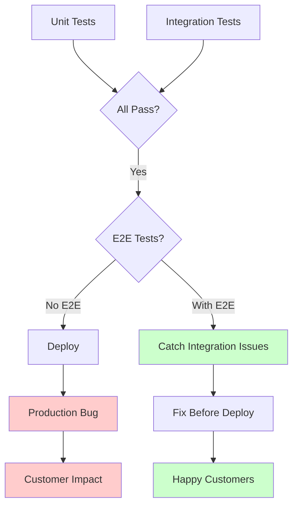
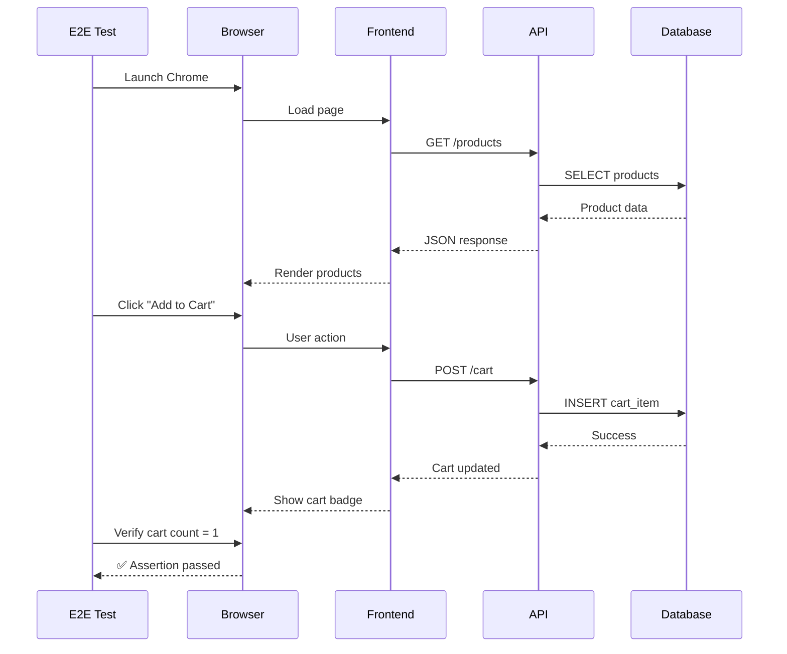
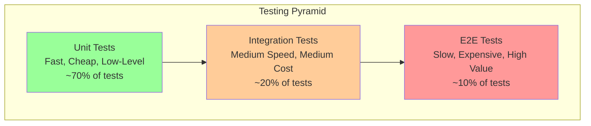

# E2E (End-to-End Testing)

## Definition

**E2E (End-to-End) Testing** is a software testing methodology that validates entire user workflows from start to finish, simulating real user interactions across the full application stack.

Think of it as **"test-driving a car"** - you don't just test the engine (unit test) or the transmission (integration test), you drive the entire car to ensure everything works together.

## What Problem Does It Solve?

### The Problem: Everything Works... Separately

**Scenario**: Your e-commerce checkout flow

**Unit Tests Pass** ✅:
- Payment service works ✅
- Inventory service works ✅
- Email service works ✅

**But In Production** ❌:
- User clicks "Buy" → Payment succeeds → Inventory NOT updated → Order confirmation never sent → Angry customer

**Why?** Services work independently but not together.

### E2E Testing Solution



## How It Works

### E2E Test Flow



### Testing Pyramid



**Key Principle**: More unit tests (fast, cheap), fewer E2E tests (slow, expensive).

## Real-World Examples

### Example 1: Login Flow (Playwright)

**Test**: User can log in with valid credentials

```typescript
// tests/e2e/auth/login.spec.ts
import { test, expect } from '@playwright/test';

test('user can log in successfully', async ({ page }) => {
  // 1. Navigate to login page
  await page.goto('https://app.example.com/login');

  // 2. Fill in credentials
  await page.fill('input[name="email"]', 'user@example.com');
  await page.fill('input[name="password"]', 'SecurePass123');

  // 3. Click login button
  await page.click('button[type="submit"]');

  // 4. Wait for navigation to dashboard
  await page.waitForURL('**/dashboard');

  // 5. Verify user is logged in
  await expect(page.locator('.user-name')).toHaveText('John Doe');
  await expect(page.locator('.logout-btn')).toBeVisible();
});

test('invalid credentials show error', async ({ page }) => {
  await page.goto('https://app.example.com/login');

  await page.fill('input[name="email"]', 'wrong@example.com');
  await page.fill('input[name="password"]', 'WrongPassword');
  await page.click('button[type="submit"]');

  // Verify error message
  await expect(page.locator('.error-message')).toHaveText(
    'Invalid email or password'
  );

  // Verify still on login page
  await expect(page).toHaveURL(/login/);
});
```

### Example 2: E-Commerce Checkout Flow

**Test**: User can complete purchase from cart to confirmation

```typescript
// tests/e2e/checkout/purchase-flow.spec.ts
import { test, expect } from '@playwright/test';

test('complete checkout flow', async ({ page }) => {
  // Setup: Login first
  await page.goto('https://app.example.com/login');
  await page.fill('input[name="email"]', 'buyer@example.com');
  await page.fill('input[name="password"]', 'BuyerPass123');
  await page.click('button[type="submit"]');
  await page.waitForURL('**/dashboard');

  // Step 1: Browse products
  await page.goto('https://app.example.com/products');
  await expect(page.locator('.product-card')).toHaveCount(10);

  // Step 2: Add item to cart
  await page.locator('.product-card').first().click();
  await page.click('button:has-text("Add to Cart")');
  await expect(page.locator('.cart-badge')).toHaveText('1');

  // Step 3: Go to cart
  await page.click('.cart-icon');
  await page.waitForURL('**/cart');
  await expect(page.locator('.cart-item')).toHaveCount(1);

  // Step 4: Proceed to checkout
  await page.click('button:has-text("Checkout")');
  await page.waitForURL('**/checkout');

  // Step 5: Fill shipping info
  await page.fill('input[name="address"]', '123 Main St');
  await page.fill('input[name="city"]', 'New York');
  await page.fill('input[name="zip"]', '10001');

  // Step 6: Enter payment info
  await page.fill('input[name="cardNumber"]', '4242424242424242');
  await page.fill('input[name="expiry"]', '12/25');
  await page.fill('input[name="cvc"]', '123');

  // Step 7: Place order
  await page.click('button:has-text("Place Order")');

  // Step 8: Verify confirmation
  await page.waitForURL('**/order/confirmation/**');
  await expect(page.locator('.order-success')).toHaveText(
    'Order placed successfully!'
  );
  await expect(page.locator('.order-number')).toBeVisible();

  // Step 9: Verify email sent (check via test email service)
  // In real tests, you'd check a test email inbox
});
```

### Example 3: Form Validation (Cypress)

**Test**: Registration form validates inputs correctly

```javascript
// cypress/e2e/auth/registration.cy.js
describe('User Registration', () => {
  beforeEach(() => {
    cy.visit('/register');
  });

  it('validates email format', () => {
    cy.get('input[name="email"]').type('invalid-email');
    cy.get('input[name="password"]').type('ValidPass123');
    cy.get('button[type="submit"]').click();

    cy.get('.email-error').should('contain', 'Invalid email format');
    cy.url().should('include', '/register'); // Still on registration
  });

  it('requires strong password', () => {
    cy.get('input[name="email"]').type('user@example.com');
    cy.get('input[name="password"]').type('weak'); // No uppercase, no number
    cy.get('button[type="submit"]').click();

    cy.get('.password-error').should('contain', 'Password must contain uppercase and number');
  });

  it('successfully registers with valid data', () => {
    cy.get('input[name="email"]').type('newuser@example.com');
    cy.get('input[name="password"]').type('SecurePass123');
    cy.get('input[name="confirmPassword"]').type('SecurePass123');
    cy.get('button[type="submit"]').click();

    cy.url().should('include', '/confirm-email');
    cy.get('.success-message').should('contain', 'Check your email to confirm');
  });
});
```

## How SpecWeave Uses E2E Testing

### 1. Embedded in tasks.md

E2E tests are planned alongside implementation:

```markdown
## T-003: Implement Login API Endpoint

**Test Plan** (BDD format):
- **Given** user with valid credentials → **When** POST /api/login → **Then** receive JWT token

**Test Cases**:
- Unit (`auth.test.ts`): validateCredentials, hashPassword, generateToken → 90% coverage
- Integration (`auth-api.test.ts`): loginEndpoint, errorHandling → 85% coverage
- **E2E (`login-flow.spec.ts`): completeLoginFlow, invalidCredentials → Critical path**

**Implementation**: LoginController.ts, JWT middleware, rate limiting
```

### 2. Critical Path Testing

**SpecWeave Philosophy**: 100% E2E coverage for critical paths only

```
Critical Paths (Must Have E2E):
✅ User authentication (login, logout, password reset)
✅ Payment processing (checkout flow)
✅ Data export/import (CSV, PDF)
✅ Admin actions (user deletion, role changes)

Non-Critical Paths (Unit/Integration Sufficient):
❌ UI theme changes (not critical)
❌ Sorting/filtering (unit tests fine)
❌ Tooltips and help text
```

### 3. Test Structure

```
tests/
├── e2e/                          # E2E tests (Playwright)
│   ├── auth/
│   │   ├── login.spec.ts         # Login flow
│   │   └── registration.spec.ts  # Registration flow
│   ├── checkout/
│   │   └── purchase-flow.spec.ts # Complete purchase
│   └── admin/
│       └── user-management.spec.ts
│
├── integration/                  # Integration tests
│   ├── api/
│   └── database/
│
└── unit/                         # Unit tests
    └── services/
```

### 4. CI/CD Integration

```yaml
# .github/workflows/ci.yml
name: CI

on: [push, pull_request]

jobs:
  test:
    runs-on: ubuntu-latest
    steps:
      - uses: actions/checkout@v3
      - uses: actions/setup-node@v3

      # Fast tests first
      - name: Unit Tests
        run: npm test

      - name: Integration Tests
        run: npm run test:integration

      # Slow tests last (only on PR/merge)
      - name: E2E Tests
        if: github.event_name == 'pull_request'
        run: npm run test:e2e
```

### 5. SpecWeave Commands

```bash
# Run all E2E tests
npm run test:e2e

# Run specific test file
npx playwright test tests/e2e/auth/login.spec.ts

# Run in headed mode (see browser)
npx playwright test --headed

# Run in debug mode (step through)
npx playwright test --debug

# Generate test report
npx playwright show-report
```

## Best Practices

### 1. Test Critical Paths Only

**Don't test everything E2E** - it's slow and expensive.

✅ **E2E for**:
- User authentication flows
- Payment/checkout processes
- Data deletion (irreversible actions)
- Admin actions with high impact

❌ **Unit/Integration for**:
- Business logic calculations
- Data validation
- API response formatting
- Database queries

### 2. Use Page Object Model

**Organize tests with reusable page objects**:

```typescript
// pages/LoginPage.ts
export class LoginPage {
  constructor(private page: Page) {}

  async goto() {
    await this.page.goto('/login');
  }

  async login(email: string, password: string) {
    await this.page.fill('input[name="email"]', email);
    await this.page.fill('input[name="password"]', password);
    await this.page.click('button[type="submit"]');
  }

  async getErrorMessage() {
    return this.page.locator('.error-message').textContent();
  }
}

// tests/auth/login.spec.ts
import { LoginPage } from '../pages/LoginPage';

test('login with invalid credentials', async ({ page }) => {
  const loginPage = new LoginPage(page);
  await loginPage.goto();
  await loginPage.login('wrong@example.com', 'WrongPass');

  const error = await loginPage.getErrorMessage();
  expect(error).toBe('Invalid email or password');
});
```

### 3. Independent Tests

**Each test should be independent** - no shared state:

```typescript
❌ Bad: Tests depend on each other
test('create user', async () => { /* creates user ID 123 */ });
test('update user', async () => { /* assumes user 123 exists */ });

✅ Good: Each test sets up its own data
test('create user', async () => {
  const user = await createTestUser();
  // Test with this user
  await deleteTestUser(user.id);
});

test('update user', async () => {
  const user = await createTestUser();
  // Test with this user
  await deleteTestUser(user.id);
});
```

### 4. Use Test Data Factories

**Generate test data programmatically**:

```typescript
// factories/UserFactory.ts
export class UserFactory {
  static createUser(overrides = {}) {
    return {
      email: `test-${Date.now()}@example.com`,
      password: 'TestPass123',
      name: 'Test User',
      ...overrides
    };
  }
}

// Usage in tests
const user = UserFactory.createUser({ name: 'John Doe' });
```

### 5. Parallelize When Possible

```typescript
// playwright.config.ts
export default defineConfig({
  workers: 4, // Run 4 tests in parallel
  fullyParallel: true,
});
```

**Warning**: Only parallelize if tests are truly independent.

## Common Mistakes

### ❌ Mistake 1: Testing Everything E2E

**Problem**: E2E tests are slow (30s-2min each). Testing everything = hours-long test suite.

**Solution**: E2E for critical paths only (10% of tests), unit/integration for the rest (90%).

### ❌ Mistake 2: Flaky Tests

**Problem**: Tests pass sometimes, fail other times (timing issues, network delays).

**Solution**:
- Use explicit waits: `await page.waitForSelector('.loaded')`
- Avoid `page.waitForTimeout(5000)` (unreliable)
- Use Playwright's auto-waiting: `await page.click()` waits automatically

### ❌ Mistake 3: Testing Implementation Details

**Problem**: Tests break when UI changes slightly.

```typescript
❌ Bad: Testing CSS classes
await expect(page.locator('.btn-primary-blue')).toBeVisible();

✅ Good: Testing behavior
await expect(page.locator('button:has-text("Login")')).toBeVisible();
```

### ❌ Mistake 4: No Cleanup

**Problem**: Tests create data but don't delete it → database fills up.

**Solution**: Clean up test data after each test:

```typescript
test.afterEach(async () => {
  await deleteTestData();
});
```

### ❌ Mistake 5: Ignoring CI/CD

**Problem**: Tests only run locally → production bugs slip through.

**Solution**: Run E2E tests in CI/CD pipeline (GitHub Actions, CircleCI).

### Browser Automation Modes

When running E2E tests with SpecWeave, two browser automation modes are available:

- **`@playwright/cli`**: Token-efficient CLI for automated test runs and CI/CD (see [Playwright glossary entry](./playwright.md#cli-vs-mcp-mode-selection))
- **Playwright MCP plugin**: Rich DOM inspection for interactive debugging and self-healing tests

Most E2E test execution uses CLI mode for efficiency. Switch to MCP mode when you need to interactively explore page structure or debug failing selectors.

## Related Terms

- **[Unit Testing](/docs/glossary/terms/unit-testing)** - Test individual functions/classes in isolation
- **[Integration Testing](/docs/glossary/terms/integration-testing)** - Test multiple components together
- **[TDD (Test-Driven Development)](/docs/glossary/terms/tdd)** - Write tests before code
- **[BDD (Behavior-Driven Development)](/docs/glossary/terms/bdd)** - Write tests in Given/When/Then format
- **[Test Coverage](/docs/glossary/terms/test-coverage)** - Percentage of code tested
- **[Playwright](/docs/glossary/terms/playwright)** - E2E testing framework for web apps
- **Cypress** - Alternative E2E testing framework

## Learn More

- **E2E Testing Guide** - Comprehensive guide to E2E testing
- **[Playwright Documentation](https://playwright.dev/)** - Official Playwright docs

---

**Category**: Testing & Quality

**Tags**: `#e2e` `#testing` `#playwright` `#cypress` `#automation` `#quality`
