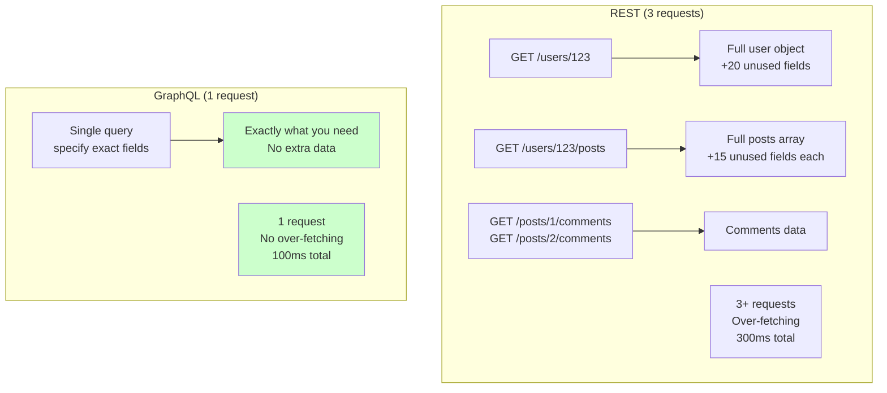

# GraphQL

## Definition

**GraphQL** is a query language for APIs and a runtime for executing those queries, developed by Facebook (now Meta). It allows clients to request exactly the data they need, nothing more and nothing less.

Think of it as **"ordering à la carte"** - instead of getting a fixed meal (REST), you tell the kitchen exactly what you want: "Give me the burger with no pickles, extra cheese, and just the name of the chef."

## What Problem Does It Solve?

### The Problem: REST Over-fetching and Under-fetching

**Scenario**: Your mobile app needs to show a user profile with their posts and comments.

**REST Approach** (multiple requests):

```bash
# Request 1: Get user
GET /users/123
→ {"id": 123, "name": "John", "email": "john@example.com", "bio": "...", "created": "..."}
# Returns ALL user fields (over-fetching)

# Request 2: Get user's posts
GET /users/123/posts
→ [{"id": 1, "title": "...", "content": "...", "created": "...", "updated": "..."}]
# Returns ALL post fields (over-fetching)

# Request 3: Get comments count for each post
GET /posts/1/comments
GET /posts/2/comments
GET /posts/3/comments
# Multiple requests (N+1 problem)
```

**Problems**:
- Over-fetching: Getting fields you don't need (waste bandwidth)
- Under-fetching: Multiple requests to get all needed data (slow)
- Rigid structure: Can't customize response
- N+1 problem: Need to make many requests for nested data

**GraphQL Solution** (single request):

```graphql
query {
  user(id: 123) {
    name              # Only fields you need
    posts {
      title
      commentsCount   # Computed field
    }
  }
}
```

**Response** (exactly what you asked for):

```json
{
  "data": {
    "user": {
      "name": "John",
      "posts": [
        {"title": "First Post", "commentsCount": 5},
        {"title": "Second Post", "commentsCount": 3}
      ]
    }
  }
}
```

### Why GraphQL Matters



## How It Works

### GraphQL Schema

**Define what data is available**:

```graphql
type User {
  id: ID!
  name: String!
  email: String!
  bio: String
  posts: [Post!]!
  createdAt: DateTime!
}

type Post {
  id: ID!
  title: String!
  content: String!
  author: User!
  comments: [Comment!]!
  createdAt: DateTime!
}

type Query {
  user(id: ID!): User
  users: [User!]!
  post(id: ID!): Post
}

type Mutation {
  createUser(name: String!, email: String!): User!
  createPost(title: String!, content: String!): Post!
}
```

## Real-World Examples

### Example 1: Query (Read Data)

**Basic query** - Get user with posts:

```graphql
query {
  user(id: 123) {
    name
    email
    posts {
      title
      createdAt
    }
  }
}
```

**Response**:

```json
{
  "data": {
    "user": {
      "name": "John Doe",
      "email": "john@example.com",
      "posts": [
        {"title": "My First Post", "createdAt": "2025-11-01T10:00:00Z"},
        {"title": "GraphQL Tutorial", "createdAt": "2025-11-03T14:30:00Z"}
      ]
    }
  }
}
```

### Example 2: Mutation (Write Data)

**Create new user**:

```graphql
mutation {
  createUser(name: "Alice", email: "alice@example.com") {
    id
    name
    email
  }
}
```

## How SpecWeave Uses GraphQL

### Planning GraphQL APIs

**During increment planning**:

```markdown
## Increment 0009: GraphQL User API

### Schema Design

Types: User, Post, Comment
Queries: user(id), users, post(id)
Mutations: createUser, createPost
```

### Testing GraphQL APIs

```typescript
test('query user with posts', async () => {
  const query = `
    query {
      user(id: "123") {
        name
        posts { title }
      }
    }
  `;

  const response = await graphqlClient.request(query);
  expect(response.user.name).toBe('John Doe');
});
```

## GraphQL vs REST

### When to Use GraphQL

Use GraphQL when:
- Mobile apps (minimize bandwidth)
- Complex nested data relationships
- Multiple clients with different needs
- Real-time requirements (subscriptions)

Use REST when:
- Simple CRUD operations
- Heavy caching needed
- File uploads/downloads
- Team unfamiliar with GraphQL

## Best Practices

### 1. Design Schema Carefully

Schema is a contract - changes can break clients.

### 2. Avoid N+1 Problem

Use DataLoader for batching database queries.

### 3. Limit Query Depth

Prevent malicious deep queries (set max depth).

### 4. Use Pagination

Don't return huge arrays without pagination.

## Common Mistakes

### Mistake 1: Exposing Database Structure

Don't mirror database table names in schema.

### Mistake 2: No Query Cost Analysis

Implement query cost limits to prevent expensive queries.

### Mistake 3: Not Using Fragments

Use fragments to avoid repeating field selections.

## Related Terms

- **[REST](/docs/glossary/terms/rest)** - Alternative API style
- **[API](/docs/glossary/terms/api)** - GraphQL is one type of API
- **[Node.js](/docs/glossary/terms/nodejs)** - Popular runtime for GraphQL servers
- **Backend** - GraphQL is backend technology

## Learn More

- **[GraphQL Official Docs](https://graphql.org/)** - Official documentation
- **[Apollo GraphQL](https://www.apollographql.com/)** - Popular GraphQL platform
- **SpecWeave GraphQL Guide** - Building GraphQL APIs with SpecWeave

---

**Category**: Backend Development

**Tags**: `#graphql` `#api` `#query-language` `#backend` `#apollo`
