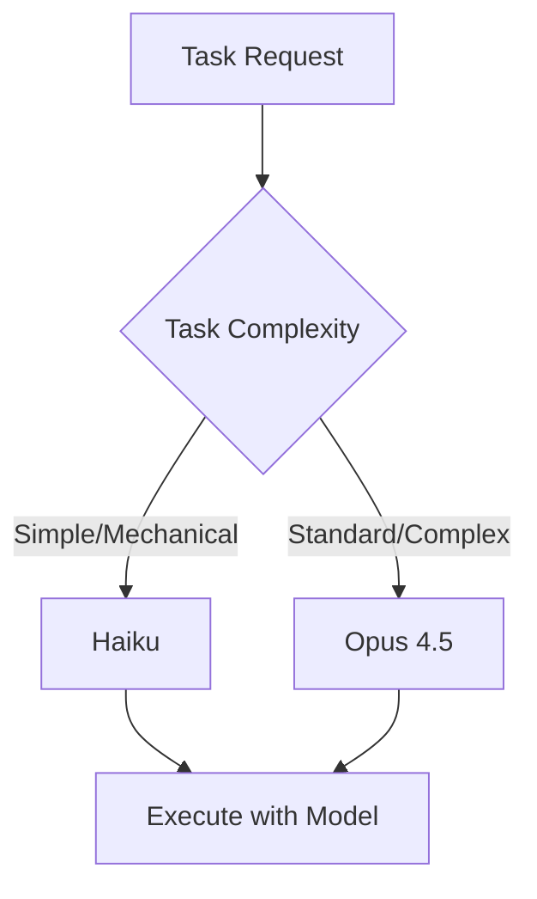

# Intelligent Model Selection

**Intelligent Model Selection** is SpecWeave's automatic system for choosing the right AI model. With Opus 4.5 as the default for maximum quality, SpecWeave uses Haiku for simple mechanical tasks to optimize costs while maintaining quality.

---

## How It Works



---

## Model Tiers

| Model | Cost | Best For | Use Cases |
|-------|------|----------|-----------|
| **Haiku** | $ | Mechanical tasks | Simple file generation, log parsing, test data |
| **Opus 4.5** | $$$ | All complex work (default) | Planning, architecture, implementation, code review |

---

## Phase Detection

SpecWeave detects the current phase to select the appropriate model:

| Phase | Typical Model | Why |
|-------|---------------|-----|
| **Exploration** | Haiku | Fast file search, codebase navigation |
| **Research** | Opus | Reading docs, understanding context |
| **Planning** | Opus | Generating specs, breaking down work |
| **Architecture** | Opus | Design decisions, ADRs |
| **Implementation** | Opus | Writing code, tests |
| **Review** | Opus | Code review, validation |
| **Debugging** | Opus | Complex problem solving |

---

## Cost Impact

Intelligent model selection can reduce AI costs by 40-60%:

```
Without intelligent selection:
  10 tasks × Opus = 10 × $15 = $150

With intelligent selection:
  3 research tasks × Haiku = 3 × $0.25 = $0.75
  5 standard tasks × Sonnet = 5 × $3 = $15
  2 complex tasks × Opus = 2 × $15 = $30
  Total: $45.75 (70% savings)
```

---

## Configuration

Model selection is automatic but can be influenced:

```json
// .specweave/config.json
{
  "ai": {
    "default_model": "opus",
    "use_intelligent_selection": true,
    "prefer_cost_optimization": true
  }
}
```

---

## Override Model Selection

Force a specific model when needed:

```bash
# Force Opus for complex task
/sw:do --model opus

# Use Haiku for simple search
Task agent with model: haiku
```

---

## Related Terms

- [Cost Tracking](/docs/reference/cost-tracking)
- [Phase Detection](/docs/glossary/terms/skills-vs-agents)
- [Hooks](/docs/glossary/terms/hooks)
