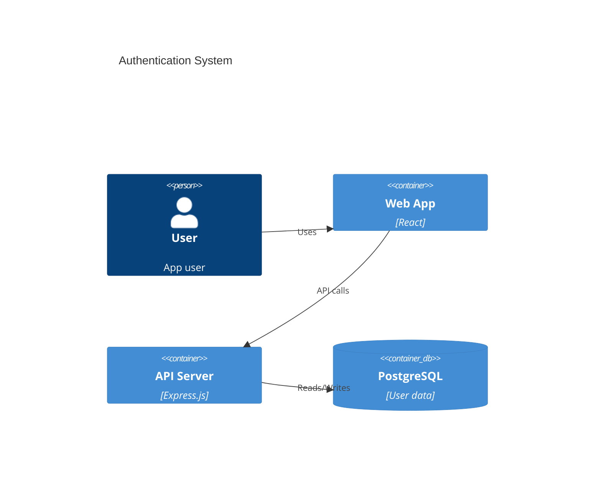
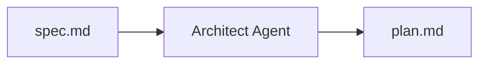

# plan.md (Implementation Plan)

The **plan.md** file contains the technical architecture and implementation strategy for a SpecWeave [increment](/docs/glossary/terms/increments).

## Purpose

**plan.md answers: "HOW?"**

- How will we build this?
- What architecture decisions?
- What technology choices?
- What test strategy?

## Location

```
.specweave/increments/0001-user-authentication/
├── spec.md         ← Requirements (WHAT/WHY)
├── plan.md         ← Architecture (HOW) ←
├── tasks.md        ← Implementation checklist
└── metadata.json
```

## Structure

```markdown
# Implementation Plan: User Authentication

## Architecture

### Components
1. **AuthService** - Core authentication logic
2. **JWTManager** - Token generation and validation
3. **OAuthProvider** - Google OAuth integration

### Technology Stack
- **Framework**: Express.js + TypeScript
- **Auth**: JWT (RS256 algorithm)
- **Database**: PostgreSQL with Prisma ORM
- **Password Hashing**: bcrypt (cost factor: 12)

### Data Model
```typescript
interface User {
  id: string;
  email: string;
  passwordHash: string;
  oauthProvider?: string;
  createdAt: Date;
}
```

## C4 Diagrams

### Container Diagram


## Test Strategy

### Coverage Targets
- **Unit Tests**: 90% (AuthService, JWTManager)
- **Integration Tests**: 85% (API endpoints)
- **E2E Tests**: 100% critical paths

### Test Approach
- TDD for core logic
- BDD format (Given/When/Then)
- AC-ID traceability

## Architecture Decision Records

See: `.specweave/docs/internal/architecture/adr/`
- ADR-001: JWT vs Sessions
- ADR-002: OAuth Provider Selection
```

## Key Sections

### Components
List all services, modules, and their responsibilities.

### Technology Stack
Document framework, libraries, and tool choices with rationale.

### Data Models
Define TypeScript interfaces or database schemas.

### C4 Diagrams
Visual architecture using Mermaid C4 syntax:
- **Context** - System boundaries
- **Container** - Applications and services
- **Component** - Internal structure

### Test Strategy
Define coverage targets and testing approach.

## Who Creates It

The [Architect Agent](/docs/glossary/terms/architect-agent) generates plan.md based on the [spec.md](/docs/glossary/terms/spec-md):



## Relationship to Other Files

| File | Purpose | Link |
|------|---------|------|
| spec.md | WHAT we're building | [spec.md](/docs/glossary/terms/spec-md) |
| **plan.md** | HOW we're building it | (this file) |
| tasks.md | Checklist of work | tasks.md |

## Related

- [Increments](/docs/glossary/terms/increments) - Contains plan.md
- [ADR](/docs/glossary/terms/adr) - Architecture decisions
- [Architect Agent](/docs/glossary/terms/architect-agent) - Creates plan.md
- [spec.md](/docs/glossary/terms/spec-md) - Input requirements
