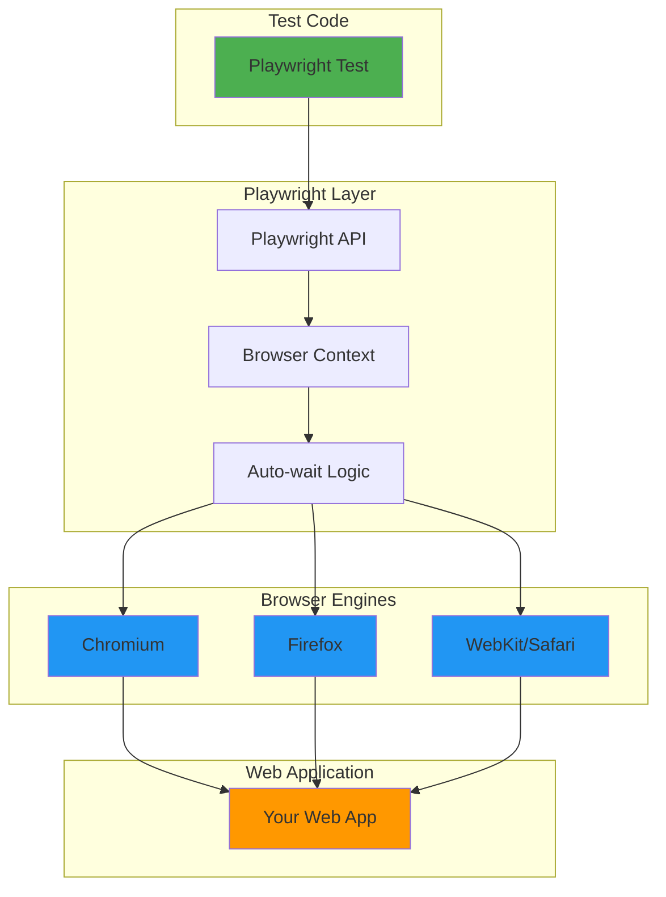

# Playwright

**Playwright** is a modern end-to-end (E2E) testing framework for web applications that enables reliable testing across all modern browsers (Chromium, Firefox, WebKit). Created by Microsoft, Playwright provides a powerful API for browser automation, testing, and web scraping.

---

## What is Playwright?

Playwright automates browser interactions to test web applications from a **user's perspective**:

- **Cross-browser**: Test on Chrome, Firefox, Safari (WebKit)
- **Fast**: Parallel execution, auto-waiting, smart retries
- **Reliable**: No flaky tests due to auto-waiting and stable selectors
- **Powerful**: Network interception, mobile emulation, screenshots, video recording

### Example Playwright Test

```typescript
// tests/e2e/login.spec.ts
import { test, expect } from '@playwright/test';

test('user can log in with valid credentials', async ({ page }) => {
  // Navigate to login page
  await page.goto('https://example.com/login');

  // Fill form
  await page.fill('[name="email"]', 'user@example.com');
  await page.fill('[name="password"]', 'SecurePass123');

  // Submit
  await page.click('button[type="submit"]');

  // Verify redirect to dashboard
  await expect(page).toHaveURL('https://example.com/dashboard');
  await expect(page.locator('h1')).toHaveText('Welcome, User');
});
```

---

## Playwright Architecture



---

## Key Features

### 1. Auto-Waiting

Playwright **automatically waits** for elements to be ready:

```typescript
// ❌ Other frameworks: Manual waits
await page.click('#submit');
await page.waitForSelector('#success-message'); // Manual wait
expect(await page.textContent('#success-message')).toBe('Success');

// ✅ Playwright: Auto-waits
await page.click('#submit');
await expect(page.locator('#success-message')).toHaveText('Success');
// Playwright automatically waits for element to appear
```

**What Playwright waits for**:
- Element exists in DOM
- Element is visible
- Element is enabled (not disabled)
- Element is stable (not animating)

### 2. Cross-Browser Testing

Run same test on multiple browsers:

```typescript
// playwright.config.ts
import { defineConfig, devices } from '@playwright/test';

export default defineConfig({
  projects: [
    {
      name: 'chromium',
      use: { ...devices['Desktop Chrome'] }
    },
    {
      name: 'firefox',
      use: { ...devices['Desktop Firefox'] }
    },
    {
      name: 'webkit',
      use: { ...devices['Desktop Safari'] }
    },
    {
      name: 'mobile-chrome',
      use: { ...devices['Pixel 5'] }
    }
  ]
});
```

**Run tests**:
```bash
# All browsers
npx playwright test

# Specific browser
npx playwright test --project=chromium
npx playwright test --project=firefox
```

### 3. Parallel Execution

Playwright runs tests in parallel by default:

```bash
# Run tests in parallel (default: workers = CPU cores)
npx playwright test

# 1000 tests complete in ~2 minutes (with 8 workers)
Running 1000 tests using 8 workers

  ✓ login.spec.ts:3:1 › user can log in (1.2s)
  ✓ login.spec.ts:12:1 › user sees error for invalid password (0.8s)
  ...
  1000 passed (2m 15s)
```

### 4. Network Interception

Mock API responses for testing:

```typescript
test('should handle API error gracefully', async ({ page }) => {
  // Intercept API call and return error
  await page.route('**/api/users/me', route => {
    route.fulfill({
      status: 500,
      body: JSON.stringify({ error: 'Internal Server Error' })
    });
  });

  await page.goto('/dashboard');

  // Verify error handling
  await expect(page.locator('.error-message')).toHaveText(
    'Failed to load user data'
  );
});
```

### 5. Screenshots and Videos

Capture failures automatically:

```typescript
// playwright.config.ts
export default defineConfig({
  use: {
    // Screenshot on failure
    screenshot: 'only-on-failure',

    // Video on failure
    video: 'retain-on-failure',

    // Trace for debugging
    trace: 'on-first-retry'
  }
});
```

**Result**:
```
test-results/
├── login-chromium/
│   ├── video.webm          # Video of test execution
│   ├── screenshot.png      # Screenshot at failure point
│   └── trace.zip           # Full trace for debugging
```

---

## Playwright vs Other Frameworks

| Feature | Playwright | Cypress | Selenium |
|---------|-----------|---------|----------|
| **Cross-browser** | ✅ Chrome, Firefox, Safari | 🟡 Chrome, Firefox, Edge | ✅ All browsers |
| **Speed** | ⚡ Fast (parallel) | 🟡 Medium (sequential) | 🐢 Slow |
| **Auto-wait** | ✅ Built-in | ✅ Built-in | ❌ Manual |
| **Network stubbing** | ✅ Yes | ✅ Yes | ❌ No |
| **Mobile testing** | ✅ Yes | 🟡 Limited | ✅ Yes |
| **Multiple tabs** | ✅ Yes | ❌ No | ✅ Yes |
| **iframes** | ✅ Easy | 🟡 Complex | 🟡 Complex |
| **Language** | TypeScript, JavaScript, Python, Java, .NET | JavaScript only | Many |
| **Debugging** | ✅ Excellent (trace viewer) | ✅ Good (time travel) | 🟡 Basic |
| **Flakiness** | ✅ Very stable | ✅ Stable | 🟡 Often flaky |
| **API testing** | ✅ Built-in | ✅ Built-in | ❌ No |

---

## Playwright in SpecWeave

SpecWeave uses Playwright for **E2E testing** with mandatory truth-telling:

### Example Task with Playwright

```markdown
## T-003: Implement Login UI

**AC**: AC-US1-03 (User can log in via web interface)

**Test Plan** (BDD format):
- **Given** user on login page → **When** enters valid credentials and submits → **Then** redirects to dashboard
- **Given** user on login page → **When** enters invalid password → **Then** shows error message
- **Given** user locked out → **When** attempts login → **Then** shows "Account locked" message

**Test Cases**:
- Unit (`LoginForm.test.tsx`): Form validation, error display → 90% coverage
- Integration (`login-api.test.ts`): POST /api/auth/login endpoint → 85% coverage
- **E2E (Playwright)** (`login.spec.ts`):
  - completeLoginFlow: Full login flow from page load to dashboard → 100% critical path
  - invalidPassword: Error message display and form reset → 100%
  - accountLockout: Lockout message and disabled form → 100%

**Implementation**: LoginForm.tsx, form validation, error handling

**Overall Coverage**: 88%
```

### CLI vs MCP Mode Selection

SpecWeave provides dual-mode browser automation for optimal AI token usage:

| Mode | Package | Token Cost | Best For |
|------|---------|------------|----------|
| **CLI** | `@playwright/cli` | ~250 chars/action | Test execution, automation scripts, CI/CD |
| **MCP** | `playwright@claude-plugins-official` | ~5K+ chars/action | Interactive inspection, self-healing tests |

The CLI (v0.1.0+, Feb 2026) keeps browser state external and returns file references instead of dumping full accessibility trees into context. This scales dramatically better for complex pages — the CLI output stays at ~250 chars regardless of page complexity, while MCP output grows linearly with the number of elements.

**Install CLI**: `npm install -g @playwright/cli@latest`

**Configure**: Set `testing.playwright.preferCli: true` in `.specweave/config.json`

The Skill Fabric (`sw-testing`) routes automatically: CLI for automation tasks (80%), MCP for inspection tasks (20%). Falls back to MCP if CLI is not installed.

### SpecWeave E2E Test Requirements

**MANDATORY when UI exists**:
- ✅ Tests in `tests/e2e/`
- ✅ Use Playwright framework
- ✅ **MUST tell the truth** (no false positives)
- ✅ Close the loop with validation reports

**Truth-Telling Requirement**:
- If test passes, feature MUST actually work
- If test fails, report EXACTLY what failed
- No masking failures
- Real verification, not assumptions

---

## Common Playwright Patterns

### Page Object Model (POM)

Organize tests with reusable page objects:

```typescript
// tests/e2e/pages/LoginPage.ts
export class LoginPage {
  constructor(private page: Page) {}

  async goto() {
    await this.page.goto('/login');
  }

  async login(email: string, password: string) {
    await this.page.fill('[name="email"]', email);
    await this.page.fill('[name="password"]', password);
    await this.page.click('button[type="submit"]');
  }

  async getErrorMessage() {
    return this.page.locator('.error-message').textContent();
  }
}

// tests/e2e/login.spec.ts
import { LoginPage } from './pages/LoginPage';

test('user can log in', async ({ page }) => {
  const loginPage = new LoginPage(page);

  await loginPage.goto();
  await loginPage.login('user@example.com', 'SecurePass123');

  await expect(page).toHaveURL('/dashboard');
});
```

### Fixtures (Reusable Setup)

Create custom fixtures for common scenarios:

```typescript
// tests/e2e/fixtures.ts
import { test as base } from '@playwright/test';
import { LoginPage } from './pages/LoginPage';

export const test = base.extend<{ loginPage: LoginPage }>({
  loginPage: async ({ page }, use) => {
    const loginPage = new LoginPage(page);
    await use(loginPage);
  }
});

// tests/e2e/dashboard.spec.ts
import { test } from './fixtures';

test('logged in user sees dashboard', async ({ page, loginPage }) => {
  await loginPage.goto();
  await loginPage.login('user@example.com', 'SecurePass123');

  await expect(page.locator('h1')).toHaveText('Dashboard');
});
```

### API State Setup

Setup test state via API (faster than UI):

```typescript
test('user can view order history', async ({ page, request }) => {
  // Setup: Create test data via API (fast)
  const user = await request.post('/api/users', {
    data: { email: 'user@example.com', password: 'SecurePass123' }
  });

  const token = (await user.json()).token;

  await request.post('/api/orders', {
    headers: { Authorization: `Bearer ${token}` },
    data: {
      items: [{ productId: 'prod_1', quantity: 2 }]
    }
  });

  // Test: UI interaction only
  await page.goto('/login');
  await page.fill('[name="email"]', 'user@example.com');
  await page.fill('[name="password"]', 'SecurePass123');
  await page.click('button[type="submit"]');

  // Navigate to order history
  await page.click('a[href="/orders"]');

  // Verify order appears
  await expect(page.locator('.order-item')).toHaveCount(1);
});
```

### Debugging with Trace Viewer

Playwright records full execution trace:

```bash
# Run test with trace
npx playwright test --trace on

# Open trace viewer
npx playwright show-trace trace.zip
```

**Trace viewer shows**:
- Every action (click, type, navigate)
- Network requests/responses
- Console logs
- Screenshots at each step
- DOM snapshots

---

## Best Practices

### 1. Use Data-Testid for Stable Selectors

```typescript
// ❌ Bad: Fragile CSS selector
await page.click('.btn.btn-primary.submit-button');

// ✅ Good: Stable data-testid
await page.click('[data-testid="submit-button"]');

// In component:
<button data-testid="submit-button">Submit</button>
```

### 2. Test User Flows, Not Pages

```typescript
// ❌ Bad: Testing individual page elements
test('login button exists', async ({ page }) => {
  await page.goto('/login');
  expect(await page.locator('button[type="submit"]').isVisible()).toBe(true);
});

// ✅ Good: Testing complete user flow
test('user can complete checkout', async ({ page }) => {
  await page.goto('/products');
  await page.click('[data-product="laptop"]');
  await page.click('[data-testid="add-to-cart"]');
  await page.click('[data-testid="checkout"]');
  await page.fill('[name="cardNumber"]', '4242424242424242');
  await page.click('[data-testid="pay"]');

  await expect(page.locator('[data-testid="success-message"]')).toHaveText(
    'Order confirmed'
  );
});
```

### 3. Minimize E2E Tests (Test Pyramid)

```typescript
// ✅ E2E: Critical user flows only
test('user can complete purchase', async ({ page }) => { /* ... */ });
test('admin can manage products', async ({ page }) => { /* ... */ });

// ❌ Not E2E: Test via unit/integration
// Validation logic → Unit test
// API endpoint → Integration test
// Complex business logic → Unit test
```

### 4. Isolate Tests

```typescript
// Each test should be independent
test('user can add item to cart', async ({ page }) => {
  // Setup: Fresh state for this test
  await page.goto('/products');
  await page.click('[data-product="laptop"]');
  await page.click('[data-testid="add-to-cart"]');

  await expect(page.locator('[data-testid="cart-count"]')).toHaveText('1');
});

test('user can remove item from cart', async ({ page }) => {
  // Setup: Independent state (not relying on previous test)
  await page.goto('/products');
  await page.click('[data-product="laptop"]');
  await page.click('[data-testid="add-to-cart"]');

  // Test remove functionality
  await page.click('[data-testid="remove-item"]');
  await expect(page.locator('[data-testid="cart-count"]')).toHaveText('0');
});
```

---

## Playwright Configuration

### Basic Config

```typescript
// playwright.config.ts
import { defineConfig } from '@playwright/test';

export default defineConfig({
  testDir: './tests/e2e',

  // Run tests in parallel
  fullyParallel: true,

  // Fail build on CI if you accidentally leave test.only
  forbidOnly: !!process.env.CI,

  // Retry failed tests
  retries: process.env.CI ? 2 : 0,

  // Workers (parallel execution)
  workers: process.env.CI ? 1 : undefined,

  // Reporter
  reporter: 'html',

  use: {
    // Base URL
    baseURL: 'http://localhost:3000',

    // Collect trace on first retry
    trace: 'on-first-retry',

    // Screenshot on failure
    screenshot: 'only-on-failure',

    // Video on failure
    video: 'retain-on-failure'
  },

  // Web server
  webServer: {
    command: 'npm run start',
    url: 'http://localhost:3000',
    reuseExistingServer: !process.env.CI
  }
});
```

---

## Playwright CLI Commands

```bash
# Run all tests
npx playwright test

# Run specific test file
npx playwright test login.spec.ts

# Run tests matching pattern
npx playwright test --grep "login"

# Run in headed mode (see browser)
npx playwright test --headed

# Run in debug mode
npx playwright test --debug

# Run specific browser
npx playwright test --project=chromium

# Generate code (record actions)
npx playwright codegen https://example.com

# Show test report
npx playwright show-report

# Update snapshots
npx playwright test --update-snapshots
```

---

## Debugging Techniques

### 1. Headed Mode

See browser while test runs:

```bash
npx playwright test --headed --workers=1
```

### 2. Debug Mode

Step through test with Playwright Inspector:

```bash
npx playwright test --debug
```

### 3. Pause Execution

```typescript
test('debug test', async ({ page }) => {
  await page.goto('/login');

  // Pause here (opens inspector)
  await page.pause();

  await page.fill('[name="email"]', 'user@example.com');
});
```

### 4. Console Logs

```typescript
test('see console logs', async ({ page }) => {
  page.on('console', msg => console.log('BROWSER:', msg.text()));

  await page.goto('/dashboard');
  // All browser console logs printed to terminal
});
```

---

## Related Terms

- E2E Testing - End-to-end testing methodology
- [Integration Testing](/docs/glossary/terms/integration-testing) - Component interaction testing
- [Test Pyramid](/docs/glossary/terms/test-pyramid) - Testing strategy distribution
- [BDD](/docs/glossary/terms/bdd) - Behavior-driven development with Given-When-Then

---

## Summary

**Playwright is a modern E2E testing framework**:
- **Cross-browser**: Chrome, Firefox, Safari
- **Fast**: Parallel execution, auto-waiting
- **Reliable**: No flaky tests, stable selectors
- **Powerful**: Network mocking, screenshots, trace viewer

**SpecWeave uses Playwright**:
- Mandatory for UI features (test critical user flows)
- Truth-telling requirement (tests must verify real behavior)
- Part of Test Pyramid (10% of total tests)
- Embedded in tasks.md with 100% coverage for critical paths

**Key insight**: Playwright tests **simulate real user behavior**. If Playwright passes, users should be able to complete the flow successfully.
