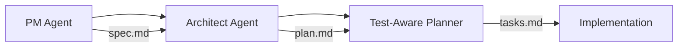

# PM Agent (Product Manager Agent)

The **PM Agent** is SpecWeave's AI-powered Product Manager that handles requirements gathering, user story creation, and specification planning.

## What It Does

The PM Agent is the first agent activated when you create a new [increment](/docs/glossary/terms/increments):

```bash
/sw:increment "Add user authentication"
```

**Key responsibilities:**
- 📋 **Requirements gathering** - Asks clarifying questions about scope
- 📝 **User story creation** - Generates structured [user stories](/docs/glossary/terms/user-stories) with [acceptance criteria](/docs/glossary/terms/acceptance-criteria)
- 🎯 **Scope definition** - Defines what's in/out of scope
- 📊 **Priority assignment** - Labels features as P1 (must-have) or P2 (nice-to-have)
- 🔗 **AC-ID generation** - Creates traceable [AC-IDs](/docs/glossary/terms/ac-id) for each criterion

## Example Interaction

```
PM Agent: "I need to clarify a few things about user authentication:

1. Authentication method? (email/password, OAuth, both)
2. Password requirements? (length, complexity)
3. Session management? (JWT, cookies)
4. Two-factor authentication? (yes/no)

Please provide brief answers so I can create accurate specifications."

You: "1. Both email/password and OAuth (Google)
      2. Min 8 chars, 1 uppercase, 1 number
      3. JWT with 15-min expiry
      4. Optional 2FA for admins"

PM Agent: "Perfect! Creating spec.md now..."
```

## Output: spec.md

The PM Agent generates a `spec.md` file in the increment folder:

```markdown
# Increment 0001: User Authentication

## User Stories

### US-001: User Login
**As a** user
**I want to** log in with email/password or Google OAuth
**So that** I can access my account securely

**Acceptance Criteria**:
- [ ] **AC-US1-01**: Valid email + password → dashboard redirect (P1)
- [ ] **AC-US1-02**: Invalid credentials → error message (P1)
- [ ] **AC-US1-03**: Google OAuth login works (P1)

### US-002: Password Requirements
...
```

## Integration with Other Agents

The PM Agent works with other agents in a pipeline:



## When It Activates

- `/sw:increment "feature"` - Creates new increment
- `/sw:done` - PM validates completion (quality gate)
- `/sw:update-scope` - Reviews scope changes

## Related

- [Increments](/docs/glossary/terms/increments) - What PM Agent creates
- [User Stories](/docs/glossary/terms/user-stories) - Output format
- [Acceptance Criteria](/docs/glossary/terms/acceptance-criteria) - Validation criteria
- [AC-ID](/docs/glossary/terms/ac-id) - Traceability identifiers
