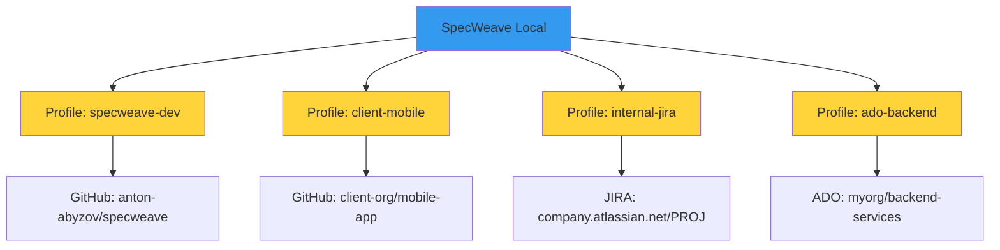
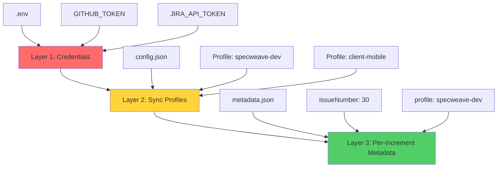
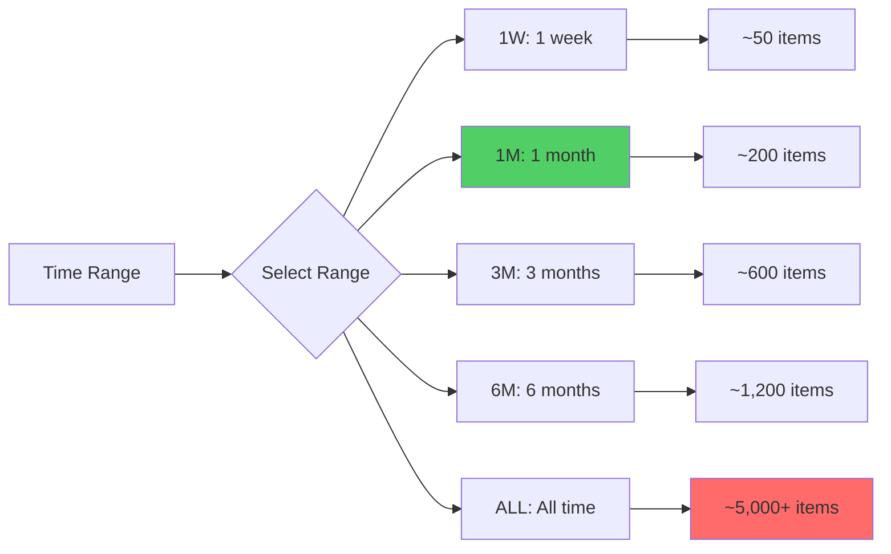
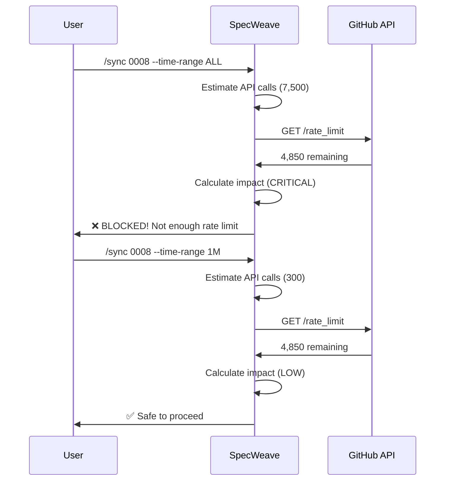

# Profile-Based Sync

**Profile-Based Sync** is SpecWeave's architecture for syncing increments to unlimited external repositories (GitHub, JIRA, Azure DevOps) with intelligent rate limiting, time range filtering, and project-specific configuration. Each sync profile defines how to connect to an external system, with support for multiple profiles per provider.

---

## The Problem with Single-Project Sync

Traditional sync systems assume **one project = one external repository**:


**This breaks down with**:
- ❌ Multi-client work (Client A, Client B, Client C repos)
- ❌ Multi-repo architecture (Frontend, Backend, Mobile repos)
- ❌ Team-based organization (Team 1 repo, Team 2 repo)
- ❌ Microservices (20+ service repos)
- ❌ Cross-cutting features (spans multiple repos)

---

## Profile-Based Sync: The Solution

**Support unlimited repositories** through sync profiles:



**Key Benefits**:
- ✅ Unlimited profiles per provider (3+, 5+, 10+ repos)
- ✅ Different increments sync to different repos
- ✅ Team-based organization (Frontend → repo-A, Backend → repo-B)
- ✅ Multi-client support (Client-A, Client-B, Client-C)

---

## 3-Layer Architecture

Profile-based sync uses a **three-layer architecture** for clean separation of concerns:



### Layer 1: Credentials (.env)

**Purpose**: Store sensitive API tokens

**Location**: `.env` (gitignored)

```bash
# .env
GITHUB_TOKEN=ghp_xxxxxxxxxxxx
JIRA_API_TOKEN=ATATTxxxxxx
AZURE_DEVOPS_PAT=xxxxxxxxxxxx
```

**Rules**:
- ✅ One token per provider type
- ✅ Never committed to git
- ✅ Shared across all profiles of same provider

### Layer 2: Sync Profiles (config.json)

**Purpose**: Define connection details per repository

**Location**: `.specweave/config.json`

```json
{
  "sync": {
    "profiles": {
      "specweave-dev": {
        "provider": "github",
        "displayName": "SpecWeave Development",
        "config": {
          "owner": "anton-abyzov",
          "repo": "specweave"
        },
        "timeRange": {
          "default": "1M",
          "max": "6M"
        },
        "rateLimits": {
          "maxItemsPerSync": 500,
          "warnThreshold": 100
        }
      },
      "client-mobile": {
        "provider": "github",
        "displayName": "Client Mobile App",
        "config": {
          "owner": "client-org",
          "repo": "mobile-app"
        },
        "timeRange": {
          "default": "1M",
          "max": "3M"
        }
      },
      "internal-jira": {
        "provider": "jira",
        "displayName": "Internal JIRA",
        "config": {
          "domain": "company.atlassian.net",
          "project": "PROJ"
        }
      }
    }
  }
}
```

**Benefits**:
- ✅ Reusable (multiple increments → one profile)
- ✅ Version controlled (committed to git)
- ✅ No secrets (tokens in .env, not config)
- ✅ Team-shareable (everyone uses same profiles)

### Layer 3: Per-Increment Metadata (metadata.json)

**Purpose**: Track which profile + issue for each increment

**Location**: `.specweave/increments/0008-user-authentication/metadata.json`

```json
{
  "increment": "0008-user-authentication",
  "status": "implementation",
  "created": "2025-11-01T10:00:00Z",
  "updated": "2025-11-10T15:30:00Z",
  "sync": {
    "profile": "specweave-dev",
    "issueNumber": 30,
    "issueUrl": "https://github.com/anton-abyzov/specweave/issues/30",
    "lastSync": "2025-11-10T15:30:00Z"
  }
}
```

**Benefits**:
- ✅ Increment-specific (each increment can use different profile)
- ✅ Persistent (survives profile changes)
- ✅ Auditable (when was last sync?)

---

## Creating Sync Profiles

### Interactive Creation

```bash
/sw:sync-profile create

# Prompts:
# 1. Provider? (github/jira/ado)
# 2. Profile ID? (e.g., "client-mobile")
# 3. Display name? (e.g., "Client Mobile App")
# 4. Owner? (e.g., "client-org")
# 5. Repo? (e.g., "mobile-app")
# 6. Default time range? (1W/1M/3M/6M/ALL)

# Output:
# ✅ Profile created: client-mobile
# 📝 Saved to: .specweave/config.json
```

### Manual Creation

**Edit `.specweave/config.json`**:

```json
{
  "sync": {
    "profiles": {
      "my-new-profile": {
        "provider": "github",
        "displayName": "My New Repository",
        "config": {
          "owner": "my-org",
          "repo": "my-repo"
        },
        "timeRange": {
          "default": "1M",
          "max": "6M"
        },
        "rateLimits": {
          "maxItemsPerSync": 500,
          "warnThreshold": 100
        }
      }
    }
  }
}
```

### Profile Configuration Fields

| Field | Required | Description | Example |
|-------|----------|-------------|---------|
| **provider** | ✅ Yes | Provider type | `"github"`, `"jira"`, `"ado"` |
| **displayName** | ✅ Yes | Human-readable name | `"SpecWeave Development"` |
| **config** | ✅ Yes | Provider-specific config | `{"owner": "...", "repo": "..."}` |
| **timeRange.default** | ⚠️  Optional | Default time range | `"1M"` |
| **timeRange.max** | ⚠️  Optional | Maximum allowed | `"6M"` |
| **rateLimits.maxItemsPerSync** | ⚠️  Optional | Max items per sync | `500` |
| **rateLimits.warnThreshold** | ⚠️  Optional | Warn if over | `100` |

**Provider-Specific Config**:

```json
// GitHub
"config": {
  "owner": "anton-abyzov",
  "repo": "specweave"
}

// JIRA
"config": {
  "domain": "company.atlassian.net",
  "project": "PROJ"
}

// Azure DevOps
"config": {
  "organization": "myorg",
  "project": "backend-services"
}
```

---

## Time Range Filtering

**Problem**: Syncing ALL data takes 25+ minutes and hits rate limits.

**Solution**: Time range presets filter data by creation date:



### Time Range Performance

| Preset | Duration | Items | API Calls | Duration | Impact |
|--------|----------|-------|-----------|----------|--------|
| **1W** | 1 week | ~50 | 75 | 30 sec | Low ✅ |
| **1M** | 1 month | ~200 | 300 | 2 min | Medium ✅ |
| **3M** | 3 months | ~600 | 900 | 5 min | Medium ⚠️ |
| **6M** | 6 months | ~1,200 | 1,800 | 10 min | High ⚠️ |
| **ALL** | All time | ~5,000+ | 7,500+ | 30+ min | Critical ❌ |

**Recommendation**: Default to **1M (1 month)** for optimal balance (200 items, 2 min, safe).

### Using Time Ranges

**Interactive**:
```bash
/sw-github:sync 0008

# Prompt:
# ⏰ Select time range:
# 1️⃣  1 week (~50 items, 30 sec) - Quick
# 2️⃣  1 month (~200 items, 2 min) - Recommended ✅
# 3️⃣  3 months (~600 items, 5 min) - Comprehensive
# 4️⃣  6 months (~1,200 items, 10 min) - Large
# 5️⃣  All time (~5,000+ items, 30+ min) - Critical ⚠️
#
# Choice? [2]:
```

**Command-Line**:
```bash
# Use default (from profile)
/sw-github:sync 0008

# Override with specific range
/sw-github:sync 0008 --time-range 1M
/sw-github:sync 0008 --time-range 3M

# Use all time (dangerous!)
/sw-github:sync 0008 --time-range ALL
```

**Dry Run**:
```bash
# Preview sync without executing
/sw-github:sync 0008 --dry-run

# Output:
# 📊 Sync Preview (DRY RUN)
# Profile: specweave-dev
# Time Range: 1M (1 month)
# Estimated:
#   - Items: ~200
#   - API Calls: ~300
#   - Duration: ~2 minutes
#   - Impact: MEDIUM
#
# ✅ Safe to proceed
```

---

## Rate Limiting Protection

SpecWeave protects against API rate limit exhaustion with **pre-flight validation**:



### Rate Limit Impact Levels

| Impact | API Calls | Status | Action |
|--------|-----------|--------|--------|
| **LOW** | &lt;250 | ✅ Safe | Proceed |
| **MEDIUM** | 250-1,000 | ⚠️  Warning | Confirm |
| **HIGH** | 1,000-2,500 | ⚠️  Risky | Strong warning |
| **CRITICAL** | 2,500+ | ❌ Block | Reduce time range |

### Example: Critical Impact Blocked

```bash
/sw-github:sync 0008 --time-range ALL

# Output:
❌ This sync may FAIL due to:

Blockers:
   • CRITICAL rate limit impact: 7,500 API calls exceeds safe threshold
   • Not enough rate limit remaining (need 7,500, only 4,850 remaining)

Recommendations:
   1. Reduce time range to 1 month (~300 API calls, SAFE)
   2. Wait for rate limit reset (25 minutes)
   3. Split sync across multiple time periods

# Blocked (must use smaller time range)
```

### Provider Rate Limits

| Provider | Limit | Reset | Notes |
|----------|-------|-------|-------|
| **GitHub** | 5,000/hour | Hourly | Authenticated API |
| **JIRA** | 100/min | Per minute | Cloud API |
| **Azure DevOps** | 200/5min | Per 5 minutes | REST API |

---

## Multi-Project Organization

Profiles work seamlessly with **project contexts** for team-based organization:

```json
{
  "sync": {
    "projects": {
      "backend-api": {
        "id": "backend-api",
        "name": "Backend API",
        "description": "Core backend services",
        "keywords": ["api", "backend", "services"],
        "team": "Backend Team",
        "defaultSyncProfile": "backend-dev",
        "specsFolder": ".specweave/docs/internal/specs/backend-api"
      },
      "mobile-app": {
        "id": "mobile-app",
        "name": "Mobile Application",
        "description": "React Native mobile app",
        "keywords": ["mobile", "react-native", "ios", "android"],
        "team": "Mobile Team",
        "defaultSyncProfile": "client-mobile",
        "specsFolder": ".specweave/docs/internal/specs/mobile-app"
      }
    }
  }
}
```

**Smart Project Detection**:

```
Increment: "Add React Native dark mode for mobile app"
↓
Detects project "mobile-app" (keywords: mobile, react-native)
↓
Uses profile "client-mobile" automatically
↓
Syncs to client-org/mobile-app repo
```

**Detection Scoring**:
- Project name match: +10 points
- Team name match: +5 points
- Keyword match: +3 points per keyword
- Auto-select if confidence > 0.7

---

## Sync Workflow

### Complete Workflow Example

```bash
# 1. Create profile (once)
/sw:sync-profile create
# → Profile: client-mobile created

# 2. Create increment
/sw:increment "Add dark mode toggle"
# → Increment 0009-dark-mode created

# 3. Link increment to profile (optional - can auto-detect)
# Edit: .specweave/increments/0009-dark-mode/metadata.json
# Set: "sync": {"profile": "client-mobile"}

# 4. Sync increment
/sw-github:sync 0009
# → Prompt: Select profile (auto-detected: client-mobile)
# → Prompt: Select time range (default: 1M)
# → Pre-flight validation (300 API calls, LOW impact)
# → Execute sync
# → Create GitHub issue #45
# → Update metadata.json

# 5. Complete tasks (auto-sync via hooks)
# [x] T-001: Implement dark mode toggle
# → Hook fires: post-task-completion.sh
# → Sync to GitHub issue #45
# → Update checkbox: [x] T-001

# 6. Close increment
/sw:done 0009
# → Hook fires: post-increment-done
# → Close GitHub issue #45
# → Final living docs sync
```

---

## Profile Management Commands

### List Profiles

```bash
/sw:sync-profile list

# Output:
📋 Sync Profiles (3 total)

✅ specweave-dev (GitHub)
   Repository: anton-abyzov/specweave
   Time Range: 1M (default), 6M (max)
   Rate Limit: 500 items/sync

✅ client-mobile (GitHub)
   Repository: client-org/mobile-app
   Time Range: 1M (default), 3M (max)
   Rate Limit: 300 items/sync

✅ internal-jira (JIRA)
   Domain: company.atlassian.net
   Project: PROJ
```

### Get Profile Details

```bash
/sw:sync-profile get specweave-dev

# Output:
📋 Profile: specweave-dev

Provider: GitHub
Display Name: SpecWeave Development
Owner: anton-abyzov
Repository: specweave

Time Range:
   Default: 1M (1 month)
   Maximum: 6M (6 months)

Rate Limits:
   Max Items/Sync: 500
   Warn Threshold: 100

Status: ✅ Active
Last Used: 2025-11-10 15:30:00
```

### Update Profile

```bash
/sw:sync-profile update specweave-dev

# Prompts:
# 1. Change display name? (SpecWeave Development)
# 2. Change time range? (1M)
# 3. Change rate limits? (500)

# Output:
# ✅ Profile updated: specweave-dev
```

### Delete Profile

```bash
/sw:sync-profile delete internal-jira

# Prompt:
# ⚠️  This will delete profile "internal-jira"
# ⚠️  3 increments currently use this profile:
#    - 0005-backend-api
#    - 0007-authentication
#    - 0010-payment-gateway
#
# ❓ Continue? (y/N)

# If confirmed:
# ✅ Profile deleted: internal-jira
# ⚠️  3 increments now have no sync profile
```

---

## Migration from V1 (Single Project)

SpecWeave provides **automatic migration** from old single-project config to profile-based:

```bash
specweave migrate-to-profiles

# Output:
🔄 Migrating to Profile-Based Sync...

✅ Found existing GitHub config:
   Repository: anton-abyzov/specweave

✅ Created GitHub profile: default-github
   Repository: anton-abyzov/specweave

✅ Created default project context
   Name: specweave
   Default profile: default-github

📊 Migration Summary:
   Profiles created: 1
   Projects created: 1
   Increments migrated: 8

✅ Migration complete!
```

**Before (V1)**:
```json
{
  "sync": {
    "enabled": true,
    "provider": "github",
    "owner": "anton-abyzov",
    "repo": "specweave"
  }
}
```

**After (V2 - Profile-Based)**:
```json
{
  "sync": {
    "enabled": true,
    "activeProfile": "default-github",
    "profiles": {
      "default-github": {
        "provider": "github",
        "displayName": "SpecWeave Repository",
        "config": {
          "owner": "anton-abyzov",
          "repo": "specweave"
        },
        "timeRange": {
          "default": "1M",
          "max": "6M"
        }
      }
    }
  }
}
```

---

## Anti-Patterns

### 1. Hardcoding Credentials in Profiles

```json
// ❌ Bad: Credentials in config.json
{
  "sync": {
    "profiles": {
      "bad-profile": {
        "provider": "github",
        "config": {
          "owner": "anton-abyzov",
          "repo": "specweave",
          "token": "ghp_xxxxxxxxxxx"  // ❌ NEVER DO THIS!
        }
      }
    }
  }
}

// ✅ Good: Credentials in .env
// .env (gitignored)
GITHUB_TOKEN=ghp_xxxxxxxxxxx

// config.json (version controlled)
{
  "sync": {
    "profiles": {
      "good-profile": {
        "provider": "github",
        "config": {
          "owner": "anton-abyzov",
          "repo": "specweave"
          // No token here!
        }
      }
    }
  }
}
```

### 2. Using ALL Time Range by Default

```bash
# ❌ Bad: Always sync all time
/sw-github:sync 0008 --time-range ALL
# Result: 30+ minutes, 7,500 API calls, high rate limit risk

# ✅ Good: Use 1M (1 month) by default
/sw-github:sync 0008 --time-range 1M
# Result: 2 minutes, 300 API calls, safe
```

### 3. Creating Too Many Profiles

```json
// ❌ Bad: One profile per increment
{
  "sync": {
    "profiles": {
      "increment-0001": {...},
      "increment-0002": {...},
      "increment-0003": {...},
      // 50+ profiles for same repo!
    }
  }
}

// ✅ Good: One profile per repository
{
  "sync": {
    "profiles": {
      "specweave-dev": {...}  // Used by ALL increments for this repo
    }
  }
}
```

---

## Related Terms

- [Split-Source Sync](/docs/glossary/terms/split-source-sync) - Content out, status in
- [GitHub Actions](/docs/glossary/terms/github-actions) - CI/CD automation
- [Intelligent Living Docs Sync](/docs/glossary/terms/intelligent-living-docs-sync) - Content classification
- [Source of Truth](/docs/glossary/terms/source-of-truth) - Single source of truth
- [Increments](/docs/glossary/terms/increments) - Increment structure

---

## Summary

**Profile-Based Sync** enables unlimited external repositories through:

**3-Layer Architecture**:
1. **Credentials** (.env) - API tokens (gitignored)
2. **Profiles** (config.json) - Connection details (version controlled)
3. **Metadata** (metadata.json) - Per-increment tracking

**Time Range Filtering**:
- **1M (1 month)** - Recommended default (~200 items, 2 min)
- **3M/6M** - Larger ranges (5-10 min)
- **ALL** - Use sparingly (30+ min, rate limit risk)

**Rate Limiting Protection**:
- Pre-flight validation (LOW/MEDIUM/HIGH/CRITICAL)
- Automatic blocking for CRITICAL impact
- Provider-specific limits (GitHub: 5K/hour, JIRA: 100/min, ADO: 200/5min)

**Key Commands**:
- `/sw:sync-profile create` - Create new profile
- `/sw:sync-profile list` - List all profiles
- `/sw-github:sync 0008` - Sync increment to GitHub

**Result**: Work with unlimited repositories while maintaining safety and performance.
