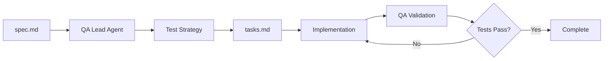

# QA Lead Agent (Deprecated)

:::note
The `qa-lead` skill has been removed from the core plugin. Use `sw-testing:qa-engineer` instead, which provides the same QA strategy and test coverage capabilities.
:::

The **QA Engineer Agent** (`sw-testing:qa-engineer`) is SpecWeave's AI-powered Quality Assurance specialist that handles test strategy, test case generation, and coverage validation.

## What It Does

**Key responsibilities:**
- 🧪 **Test strategy** - Defines testing approach and coverage targets
- 📝 **Test case generation** - Creates comprehensive test cases
- 📊 **Coverage validation** - Ensures coverage targets are met
- ✅ **Quality gates** - Validates work meets quality standards
- 🔍 **Edge case identification** - Finds boundary conditions

## Test Generation

The QA Lead Agent creates tests in [BDD](/docs/glossary/terms/bdd) format:

```markdown
## Test Cases for AuthService

### TC-001: Valid Login
**Given** a registered user with valid credentials
**When** they submit the login form
**Then** they receive a JWT token and are redirected to dashboard

### TC-002: Invalid Password
**Given** a registered user with invalid password
**When** they submit the login form
**Then** they see an error message "Invalid credentials"

### TC-003: Rate Limiting
**Given** a user who has failed login 5 times
**When** they try to login again
**Then** they see "Too many attempts, try again in 1 minute"
```

## Coverage Targets

Default coverage targets by test type:

| Test Type | Target | Purpose |
|-----------|--------|---------|
| **Unit Tests** | 90% | Business logic |
| **Integration Tests** | 85% | Component interaction |
| **[E2E](/docs/glossary/terms/e2e) Tests** | 100% critical paths | User flows |

## Commands

### Check Test Coverage

```bash
/sw:check-tests 0001
```

**Output**:
```
📊 Test Coverage Report: 0001-user-authentication

Per-Task Coverage:
  T-001: AuthService      ✅ 95% (target: 90%)
  T-002: JWTManager       ✅ 92% (target: 90%)
  T-003: PasswordHasher   ⚠️ 85% (target: 90%)

AC-ID Coverage:
  AC-US1-01 ✅ Covered (auth.test.ts:42)
  AC-US1-02 ✅ Covered (auth.test.ts:78)
  AC-US1-03 ⚠️ Missing tests

Overall: 89% (target: 88%) ✅

Recommendations:
- Add tests for AC-US1-03 (remember me checkbox)
- Increase PasswordHasher coverage (+5%)
```

### Validate Quality

```bash
/sw:qa 0001 --gate
```

## Test Pyramid Enforcement

The QA Lead Agent enforces the [test pyramid](/docs/glossary/terms/test-pyramid):

```
        /\
       /  \     E2E Tests (few, slow, expensive)
      /----\
     /      \   Integration Tests (some)
    /--------\
   /          \  Unit Tests (many, fast, cheap)
  --------------
```

**Guidance**:
- Write many fast unit tests
- Write some integration tests
- Write few E2E tests (critical paths only)

## Integration with Workflow



## Related

- [TDD](/docs/glossary/terms/tdd) - Test-driven development
- [BDD](/docs/glossary/terms/bdd) - Behavior-driven development
- [E2E](/docs/glossary/terms/e2e) - End-to-end testing
- [Test Coverage](/docs/glossary/terms/test-coverage) - Coverage metrics
- [Test Pyramid](/docs/glossary/terms/test-pyramid) - Testing strategy
- [Quality Gate](/docs/glossary/terms/quality-gate) - Validation checkpoints
