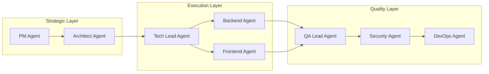

# Role Orchestrator

**Role Orchestrator** is SpecWeave's multi-agent coordination system that sequences specialized AI agents (PM, Architect, Tech Lead, QA, DevOps) to work together on complex tasks.

---

## Architecture



---

## Agent Roles

### Strategic Layer

| Agent | Purpose | When Used |
|-------|---------|-----------|
| **PM Agent** | Product strategy, user stories, prioritization | New products/features |
| **Architect Agent** | System design, ADRs, technology stack | Major features, architecture |

### Execution Layer

| Agent | Purpose | When Used |
|-------|---------|-----------|
| **Tech Lead Agent** | Technical planning, code review | Complex decisions |
| **Backend Agents** | Node.js, Python, .NET implementation | Server-side code |
| **Frontend Agent** | React/Next.js, UI/UX | User interfaces |

### Quality Layer

| Agent | Purpose | When Used |
|-------|---------|-----------|
| **QA Lead Agent** | Test strategy, quality assurance | Testing approach |
| **Security Agent** | Security architecture, threat modeling | Security features |
| **DevOps Agent** | Infrastructure, CI/CD, deployment | Operations |

---

## Orchestration Patterns

### Sequential (Default)

```
PM → Architect → Tech Lead → Backend → Frontend → QA → DevOps
```

Used when each phase depends on the previous.

### Parallel

```
PM + Architect (parallel)
    ↓
Backend + Frontend (parallel)
    ↓
QA + DevOps (parallel)
```

Used for independent work streams.

### Adaptive

```
PM → Architect → [Discover need] → Security → Tech Lead → ...
```

Agents inject dynamically based on discovered requirements.

---

## Quality Gates

The orchestrator enforces quality gates between phases:

### Gate 1: After PM
- [ ] User stories defined with AC-IDs
- [ ] Success criteria measurable
- [ ] Dependencies identified

### Gate 2: After Architect
- [ ] System design documented
- [ ] ADRs created (minimum 3)
- [ ] Technology stack chosen

### Gate 3: After Implementation
- [ ] All P1 tasks completed
- [ ] Tests passing (80%+ coverage)
- [ ] Code reviewed

### Gate 4: Before Deployment
- [ ] Security review passed
- [ ] Performance acceptable
- [ ] Monitoring configured

---

## Example Workflow

**User request**: "Build a SaaS for event management"

**Orchestrator creates**:
1. Increment structure: `.specweave/increments/0001-event-management/`
2. 8-phase workflow plan
3. Quality gates between phases

**User executes**:
```
Phase 1: "Complete spec for increment 0001"
Phase 2: "Design architecture for increment 0001"
Phase 3: "Create technical plan for increment 0001"
...continues through all phases
```

---

## Safety Rules

The orchestrator follows critical safety patterns:

**DO**:
- Create increment structure first
- Guide user through sequential workflow
- Enforce quality gates
- Track progress

**DON'T**:
- Spawn all agents at once (context explosion)
- Skip quality gates
- Proceed without user confirmation

---

## Related Terms

- [Increments](/docs/glossary/terms/increments)
- PM Validation
- Quality Gates
