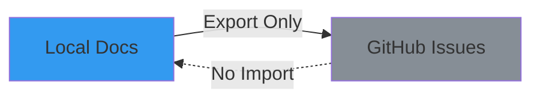
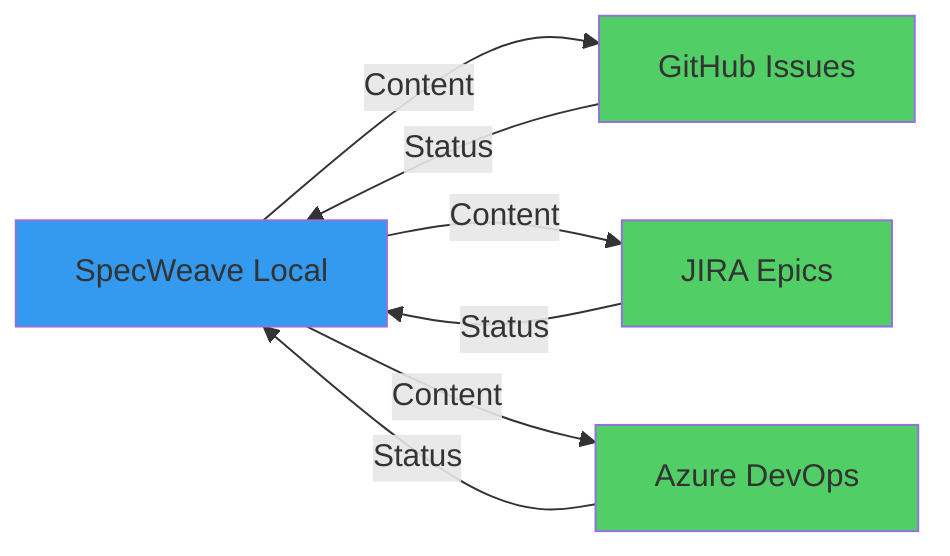
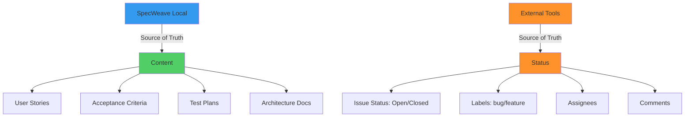
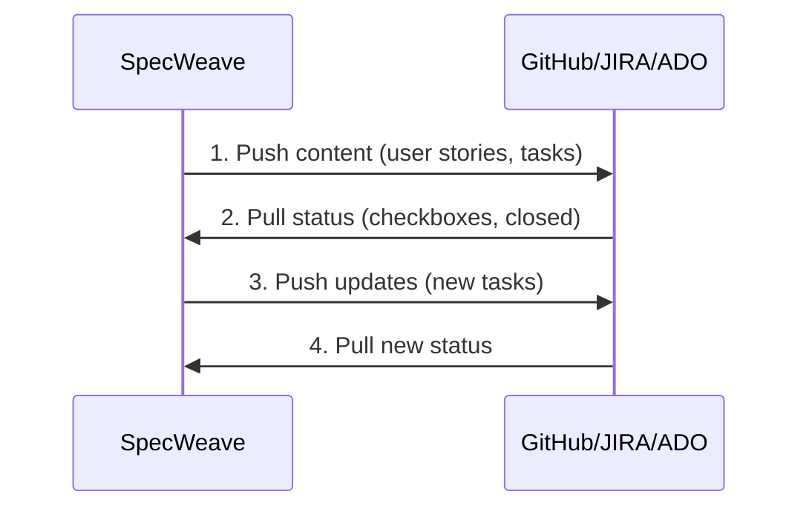
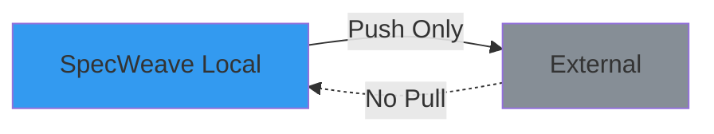
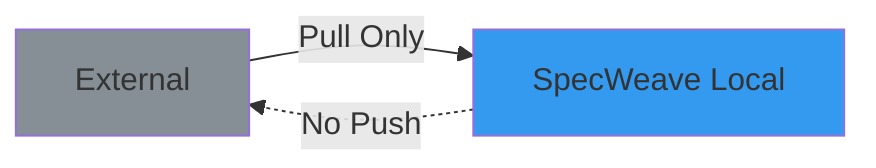
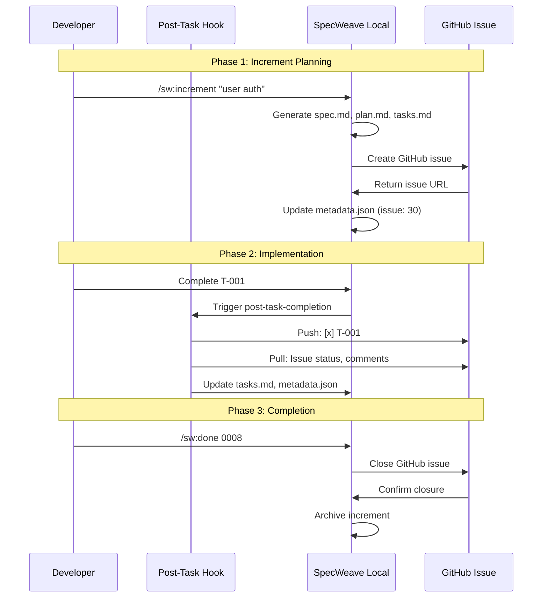
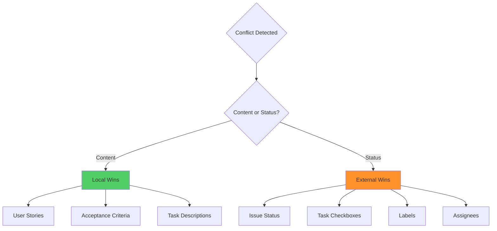

# External Tool Sync

> **Note**: This was previously called "Bidirectional Sync" but has been renamed to avoid confusion. SpecWeave does NOT support true bidirectional sync where the same data can be edited in either system. Instead, different data types flow in different directions.

**External Tool Sync** is SpecWeave's synchronization pattern with external tools (GitHub, JIRA, Azure DevOps). It uses a **split source of truth** architecture where:
- **Content** (specs, user stories, tasks) flows **one-way from SpecWeave → External**
- **Status** (open/closed, progress) flows **one-way from External → SpecWeave**

This is NOT true bidirectional sync—you cannot edit specs in GitHub and have them sync back to SpecWeave.

---

## The Problem with One-Way Sync

Traditional workflows use **one-way sync**, which creates fragmentation:



**Problems**:
- ❌ **Status updates** in GitHub don't flow back to local
- ❌ **External changes** (issue closed, labels added) lost
- ❌ **Team collaboration** happens in GitHub, but local is outdated
- ❌ **Manual reconciliation** required (error-prone)
- ❌ **Conflicting sources of truth** (which is correct?)

---

## Split-Source Sync: The Solution

**Split-source synchronization** keeps both systems in sync (different data flows each way):



**Benefits**:
- ✅ **Automatic updates** (local → external, external → local)
- ✅ **Zero manual work** (hooks handle sync)
- ✅ **Single workflow** (work in either system)
- ✅ **Clear source of truth** (SpecWeave = content, External = status)
- ✅ **Team collaboration** (changes flow both ways)

---

## Source of Truth Architecture

**CRITICAL**: SpecWeave uses **split source of truth** architecture:



### What Flows in Each Direction

**Local → External (Content Sync)**:
- ✅ User stories (US-001, US-002)
- ✅ Acceptance criteria (AC-IDs)
- ✅ Task checklist (T-001, T-002)
- ✅ Test plans (unit/integration/E2E)
- ✅ Implementation details

**External → Local (Status Sync)**:
- ✅ Issue status (open → closed)
- ✅ Task completion (checkboxes)
- ✅ Labels (bug, feature, P1)
- ✅ Assignees (who's working on it)
- ✅ Comments (team discussions)

**Why Split Source of Truth?**
- SpecWeave excels at **structured content** (specs, plans, tests)
- External tools excel at **workflow management** (status, assignments, collaboration)
- Each system does what it's best at

---

## Sync Directions

SpecWeave supports **three sync directions**:

### 1. Split-Source (Default)

**Content and status flow different directions**: Local ↔ External



**Use When**:
- ✅ Team collaboration (multiple people working)
- ✅ External tool as primary interface (team uses GitHub daily)
- ✅ Status tracking matters (need to know what's closed)

**Example**:
```bash
# Task completed locally
- [x] T-001: Implement password hashing

# Hook fires automatically:
# → Push to GitHub: [x] T-001
# → Pull from GitHub: Issue status, comments, labels
# → Update local metadata.json with latest status
```

### 2. Export Only

**One way**: Local → External



**Use When**:
- ⚠️  Solo development (no team collaboration)
- ⚠️  External tool is read-only view (stakeholders only)
- ⚠️  Status doesn't matter (don't care about external changes)

**Example**:
```bash
# Task completed locally
- [x] T-001: Implement password hashing

# Hook fires automatically:
# → Push to GitHub: [x] T-001
# → NO pull from GitHub (ignored)
```

### 3. Import Only

**One way**: External → Local



**Use When**:
- ⚠️  Legacy import (migrating from external tool)
- ⚠️  External is authoritative (JIRA as source of truth)
- ⚠️  Read-only mode (observe external changes only)

**Example**:
```bash
# Manual sync command
/sw-github:sync-from 0008

# Result:
# → Pull from GitHub: Issue status, task checkboxes, comments
# → NO push to GitHub (local changes not exported)
```

---

## Configuration

**Enable Bidirectional Sync** (`.specweave/config.json`):

```json
{
  "sync": {
    "enabled": true,
    "settings": {
      "syncDirection": "bidirectional",  // or "export" or "import"
      "autoCreateIssue": true,           // Auto-create on /increment
      "conflictResolution": "external-wins"  // Status: external wins, Content: local wins
    },
    "activeProfile": "specweave-dev",
    "profiles": {
      "specweave-dev": {
        "provider": "github",
        "config": {
          "owner": "anton-abyzov",
          "repo": "specweave"
        }
      }
    }
  },
  "hooks": {
    "post_task_completion": {
      "sync_living_docs": true,
      "external_tracker_sync": true      // ✅ Enable external sync
    }
  }
}
```

**Sync Direction Options**:
- `"bidirectional"` - Both ways (default, recommended)
- `"export"` - Local → External only
- `"import"` - External → Local only

---

## Sync Flow (Split-Source)

### Complete Lifecycle



### Step-by-Step Example

**1. Create Increment** (`/sw:increment`):

```bash
/sw:increment "Add user authentication"

# SpecWeave:
# 1. Generate spec.md (user stories, AC)
# 2. Generate plan.md (architecture)
# 3. Generate tasks.md (task checklist)
#
# Hook fires (post-increment-planning):
# 4. Create GitHub issue #30
# 5. Update metadata.json:
#    "sync": {
#      "profile": "specweave-dev",
#      "issueNumber": 30,
#      "issueUrl": "https://github.com/..."
#    }
```

**2. Complete Task** (Local):

```bash
# Edit tasks.md:
- [x] T-001: Implement password hashing

# Hook fires automatically (post-task-completion):
#
# PUSH (Local → External):
# 1. Update GitHub issue #30:
#    - [x] T-001: Implement password hashing
#    Progress: 1/5 tasks (20%)
#
# PULL (External → Local):
# 2. Fetch GitHub issue status: open
# 3. Fetch labels: ["authentication", "P1"]
# 4. Fetch comments: 2 new comments
# 5. Update metadata.json:
#    "sync": {
#      "lastSync": "2025-11-10T15:30:00Z",
#      "externalStatus": "open"
#    }
```

**3. External Change** (GitHub):

```bash
# Team member closes GitHub issue #30

# Next task completion fires hook:
#
# PUSH (Local → External):
# 1. Update GitHub issue (no-op, already closed)
#
# PULL (External → Local):
# 2. Fetch GitHub issue status: closed ✅
# 3. Update metadata.json:
#    "sync": {
#      "externalStatus": "closed"
#    }
# 4. Update tasks.md frontmatter:
#    status: done
```

**4. Close Increment** (`/sw:done`):

```bash
/sw:done 0008

# SpecWeave:
# 1. Validate all tasks complete
# 2. Finalize completion report
# 3. Sync living docs
#
# Hook fires (post-increment-done):
# 4. Close GitHub issue #30 (if not already closed)
# 5. Add completion comment:
#    "✅ Increment complete!
#     - All 5 tasks done
#     - Test coverage: 90%
#     - Living docs synced"
# 6. Archive increment
```

---

## Conflict Resolution

**What happens when both systems change the same data?**

### Conflict Resolution Strategy



**Rules**:
1. **Content changes** (user stories, AC, task descriptions) → **Local wins**
2. **Status changes** (checkboxes, issue status, labels) → **External wins**
3. **Timestamps** used to detect conflicts (lastSync vs updated)
4. **Manual resolution** for edge cases (prompt user)

### Example: Content Conflict

```bash
# Local: T-001 description updated
"T-001: Implement password hashing with bcrypt"

# External: T-001 description updated (different change)
"T-001: Implement password hashing with argon2"

# Conflict resolution:
# → Local wins (SpecWeave is source of truth for content)
# → Push local description to GitHub
# → Overwrite external change
# → Log conflict in sync report
```

### Example: Status Conflict

```bash
# Local: T-001 marked incomplete
- [ ] T-001: Implement password hashing

# External: T-001 marked complete (GitHub checkbox)
- [x] T-001: Implement password hashing

# Conflict resolution:
# → External wins (GitHub is source of truth for status)
# → Pull external status to local
# → Update local tasks.md: [x] T-001
# → Log conflict in sync report
```

---

## Automatic Sync (Hook-Based)

Split-source sync happens **automatically** via hooks:

### Post-Task-Completion Hook

**When**: After every task completion

**Location**: `plugins/specweave/hooks/post-task-completion.sh`

**What It Does**:
1. Sync living docs (increment → specs)
2. **Sync to external tracker** (bidirectional)
3. Update status line cache
4. Play completion sound (smart session detection)

**Example**:
```bash
# Complete task in tasks.md
- [x] T-001: Implement password hashing

# Hook fires automatically:
# ✅ Living docs synced
# ✅ GitHub issue #30 updated:
#    - [x] T-001: Implement password hashing
#    Progress: 1/5 tasks (20%)
# ✅ Status line cache updated
# 🔔 Completion sound played
```

### Post-Increment-Done Hook

**When**: After `/sw:done` completes

**Location**: `plugins/specweave/hooks/post-increment-done.sh`

**What It Does**:
1. Final living docs sync
2. **Close external issue** (if still open)
3. Add completion comment
4. Archive increment

**Example**:
```bash
/sw:done 0008

# Hook fires automatically:
# ✅ Living docs final sync
# ✅ GitHub issue #30 closed
# ✅ Completion comment added:
#    "✅ All 5 tasks complete
#     🎯 Test coverage: 90%
#     📚 Living docs synced"
# ✅ Increment archived
```

---

## Manual Sync Commands

For advanced scenarios, manual sync commands are available:

### Create Issue

```bash
# Create GitHub issue for increment
/sw-github:create-issue 0008

# Output:
# 🚀 Creating GitHub issue for 0008-user-authentication...
# 📝 Issue #30 created
# 🔗 https://github.com/anton-abyzov/specweave/issues/30
# ✅ metadata.json updated
```

### Sync (Split-Source)

```bash
# Sync increment to external tracker (content out, status in)
/sw-github:sync 0008

# Prompts:
# 1. Select profile (default: specweave-dev)
# 2. Select time range (default: 1M)
#
# Output:
# 🔄 Syncing 0008-user-authentication...
# 📤 PUSH: Updated GitHub issue #30
# 📥 PULL: Fetched status, comments, labels
# ✅ Sync complete (2.3 seconds)
```

### Sync From (Import Only)

```bash
# Pull changes from external tracker (no push)
/sw-github:sync-from 0008

# Output:
# 📥 Pulling from GitHub issue #30...
# ✅ Status: closed
# ✅ Task checkboxes: 5/5 complete
# ✅ Comments: 3 new comments
# ✅ Labels: ["authentication", "P1", "done"]
# ✅ Local updated (import only, no push)
```

### Close Issue

```bash
# Close external issue
/sw-github:close-issue 0008

# Output:
# 🔒 Closing GitHub issue #30...
# 💬 Adding completion comment...
# ✅ Issue closed
```

### Check Status

```bash
# Check sync status for increment
/sw-github:status 0008

# Output:
# 📊 Sync Status: 0008-user-authentication
#
# Profile: specweave-dev
# Issue: #30
# URL: https://github.com/anton-abyzov/specweave/issues/30
#
# Last Sync: 2025-11-10 15:30:00 (2 hours ago)
# External Status: closed
# Sync Direction: bidirectional
#
# Local:
#   Total Tasks: 5
#   Completed: 5
#   Progress: 100%
#
# External:
#   Issue Status: closed
#   Labels: authentication, P1, done
#   Comments: 3
#   Assignee: @anton-abyzov
```

---

## Provider-Specific Sync

### GitHub

**What Syncs**:
- ✅ Issue title (increment title)
- ✅ Issue body (spec summary + task checklist)
- ✅ Task checkboxes (T-001, T-002, etc.)
- ✅ Labels (specweave, increment, P1, etc.)
- ✅ Milestone (increment number)
- ✅ Assignee (from metadata)
- ✅ Comments (progress updates)

**Example GitHub Issue**:
```markdown
# [INC-0008] User Authentication

**Status**: Implementation → Done
**Priority**: P1
**Increment**: 0008-user-authentication

## Summary

Implement basic authentication with email/password, session management, and rate limiting.

## Tasks

Progress: 5/5 tasks (100%)

- [x] T-001: Implement Authentication Service
- [x] T-002: Create Session Manager
- [x] T-003: Create Login API Endpoint
- [x] T-004: Update Documentation
- [x] T-005: Security Audit

## Links

- **Spec**: `spec.md`
- **Plan**: `plan.md`
- **Tasks**: `tasks.md`

---

🤖 Auto-created by SpecWeave | Updates automatically on task completion
```

### JIRA

**What Syncs**:
- ✅ Epic name (increment title)
- ✅ Epic description (spec summary)
- ✅ User stories (US-001, US-002, etc.)
- ✅ Acceptance criteria (AC-IDs)
- ✅ Status (To Do, In Progress, Done)
- ✅ Labels (specweave, increment)
- ✅ Links (to SpecWeave local docs)

**Example JIRA Epic**:
```
Epic: User Authentication (INC-0008)

Description:
Implement basic authentication with email/password, session management, and rate limiting.

Status: Done
Labels: specweave, increment, authentication, P1

Stories:
- US-001: Basic Login Flow (Done)
- US-002: Session Management (Done)
- US-003: Rate Limiting (Done)

Links:
- SpecWeave Increment: file:///.specweave/increments/0008-user-authentication
```

### Azure DevOps

**What Syncs**:
- ✅ Feature name (increment title)
- ✅ Feature description (spec summary)
- ✅ Work items (tasks)
- ✅ Acceptance criteria (AC-IDs)
- ✅ State (New, Active, Closed)
- ✅ Tags (specweave, increment)
- ✅ Area path (project)
- ✅ Iteration (sprint)

---

## Benefits of Split-Source Sync

### 1. Zero Manual Work

```bash
# Traditional (manual sync):
1. Complete task locally
2. Copy task description
3. Open GitHub issue
4. Update checkbox
5. Update status
6. Close browser
7. Context switch back to code
8. Forget to update (docs stale)

# Bidirectional sync (automatic):
1. Complete task locally
   → Hook syncs automatically ✅
   → Zero manual work!
```

### 2. Team Collaboration

```bash
# Team member A (works locally):
- [x] T-001: Implement password hashing
# → Hook pushes to GitHub

# Team member B (works in GitHub):
# → Closes GitHub issue #30
# → Adds comment: "Ready for review"

# Team member A (next task):
- [x] T-002: Create session manager
# → Hook pulls from GitHub
# → Sees issue closed ✅
# → Sees comment: "Ready for review"
```

### 3. Single Source of Truth

```bash
# Content changes:
# → Edit spec.md locally
# → Hook pushes to GitHub
# → GitHub issue updated automatically

# Status changes:
# → Close GitHub issue
# → Hook pulls to local
# → metadata.json updated automatically

# Result: Always in sync, zero conflicts
```

### 4. Audit Trail

```bash
# All sync events logged:
.specweave/logs/sync.log

# Example log:
2025-11-10 15:30:00 | PUSH | 0008 → GitHub #30 | T-001 complete
2025-11-10 15:32:15 | PULL | 0008 ← GitHub #30 | Status: open
2025-11-10 16:00:00 | PUSH | 0008 → GitHub #30 | T-002 complete
2025-11-10 16:02:30 | PULL | 0008 ← GitHub #30 | Comment added
2025-11-10 17:00:00 | PUSH | 0008 → GitHub #30 | Close issue
```

---

## Anti-Patterns

### 1. Manual Updates to External Tracker

```bash
# ❌ Bad: Manual updates break sync
# 1. Edit GitHub issue description manually
# 2. Hook pulls external description
# 3. Overwrites local spec.md (content should come from local!)
# Result: Local changes lost

# ✅ Good: Update local, let sync handle it
# 1. Edit spec.md locally
# 2. Hook pushes to GitHub
# 3. GitHub issue updated automatically
# Result: Content flows from local (source of truth)
```

### 2. Export-Only When Team Collaboration Needed

```bash
# ❌ Bad: Export-only with team collaboration
"syncDirection": "export"  // No pull from external
# Team closes GitHub issue → Local never knows
# Team adds comments → Local never sees them
# Result: Out of sync, confusion

# ✅ Good: Split-source sync with team collaboration
"syncDirection": "bidirectional"  // Config value kept for compatibility
# Team changes flow back to local automatically
# Result: Always in sync
```

### 3. Ignoring Conflict Warnings

```bash
# ❌ Bad: Ignore conflict warnings
⚠️  Conflict detected: T-001 status changed in both systems
    Local: [ ] incomplete
    External: [x] complete
# User: "Ignore it, I'll fix later"
# Result: Permanent inconsistency

# ✅ Good: Resolve conflicts immediately
⚠️  Conflict detected: T-001 status changed in both systems
# Hook: "External wins (status), updating local..."
# → Local updated to [x] complete
# Result: Consistent, no manual intervention needed
```

---

## Related Terms

- [Profile-Based Sync](/docs/glossary/terms/profile-based-sync) - Multi-repo sync configuration
- [Living Docs](/docs/glossary/terms/living-docs) - Auto-synced documentation
- [Source of Truth](/docs/glossary/terms/source-of-truth) - Single source of truth principle
- [Increments](/docs/glossary/terms/increments) - Increment structure
- [GitHub Actions](/docs/glossary/terms/github-actions) - CI/CD automation

---

## Summary

**Split-Source Sync** keeps SpecWeave and external tools synchronized automatically:

**Source of Truth Architecture**:
- **Content** (user stories, AC, tasks) → SpecWeave wins (flows OUT)
- **Status** (checkboxes, labels, issue state) → External wins (flows IN)

**Sync Directions**:
- **Split-Source** (default) - Content out, status in, automatic
- **Export** - Local → External only
- **Import** - External → Local only

**Automatic Sync**:
- Hook-based (post-task-completion, post-increment-done)
- Zero manual work
- Conflict resolution built-in

**Manual Commands**:
- `/sw-github:sync` - Split-source sync (content out, status in)
- `/sw-github:sync-from` - Import only
- `/sw-github:status` - Check sync status

**Result**: Content authored in SpecWeave, status tracked in external tool, always in sync.
