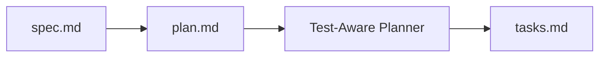

# tasks.md (Task Checklist)

The **tasks.md** file is the implementation checklist for a SpecWeave [increment](/docs/glossary/terms/increments), containing tasks with embedded test plans.

## Purpose

**tasks.md answers: "WHAT to implement and HOW to test?"**

- What tasks need to be completed?
- What tests validate each task?
- What are the dependencies?
- What's the progress?

## Location

```
.specweave/increments/0001-user-authentication/
├── spec.md         ← Requirements (WHAT/WHY)
├── plan.md         ← Architecture (HOW)
├── tasks.md        ← Implementation checklist ←
└── metadata.json
```

## Structure

```markdown
---
increment: 0001-user-authentication
total_tasks: 8
test_mode: TDD
coverage_target: 88%
---

# Tasks for Increment 0001: User Authentication

## T-001: Implement AuthService

**User Story**: US-001
**Satisfies ACs**: AC-US1-01, AC-US1-02
**Status**: [x] completed

**Test Plan** (BDD format):
- **Given** valid email and password
- **When** login() is called
- **Then** JWT token is returned within 200ms

**Test Cases**:
- Unit (`auth.test.ts`):
  - `loginWithValidCredentials()` - returns token
  - `loginWithInvalidPassword()` - throws AuthError
  - **Coverage**: 95%

**Implementation**:
- Create `src/services/auth/AuthService.ts`
- Implement login(), logout(), refresh() methods
- Use bcrypt for password hashing

**Dependencies**: None (can start immediately)

---

## T-002: Implement JWTManager

**User Story**: US-001
**Satisfies ACs**: AC-US1-01
**Status**: [ ] pending

**Test Plan**:
- **Given** user payload
- **When** generate() is called
- **Then** valid JWT is created with correct claims

**Test Cases**:
- Unit (`jwt.test.ts`):
  - `generateToken()` - creates valid JWT
  - `verifyToken()` - validates signature
  - `decodeToken()` - extracts payload
  - **Coverage**: 92%

**Implementation**:
- Create `src/utils/jwt.ts`
- RS256 signing algorithm
- 15-minute expiry

**Dependencies**: T-001 (needs AuthService interface)

---

## Summary

**Total Coverage**: 88% (target achieved)
- Unit: 92%
- Integration: 86%
- E2E: 100% critical paths

**Test Count**: ~45 automated tests
**AC-ID Coverage**: All 9 AC-IDs mapped to tests
```

## Key Elements

### YAML Frontmatter
```yaml
---
increment: 0001-user-authentication
total_tasks: 8
test_mode: TDD          # or "standard"
coverage_target: 88%
---
```

### Task Format
```markdown
## T-XXX: Task Title

**User Story**: US-XXX           ← Links to spec.md
**Satisfies ACs**: AC-USXX-XX    ← Traceability
**Status**: [ ] pending / [x] completed

**Test Plan** (BDD format):
- Given...
- When...
- Then...

**Test Cases**:
- Unit/Integration tests with coverage

**Implementation**:
- Files to create/modify

**Dependencies**: T-XXX (what must complete first)
```

### Status Tracking
- `[ ] pending` - Not started
- `[x] completed` - Done and tested

## Embedded Tests

Tasks include **embedded test plans** using [BDD](/docs/glossary/terms/bdd) format:

```markdown
**Test Plan**:
- **Given** user is on login page
- **When** they enter valid credentials
- **Then** they are redirected to dashboard
```

**Test cases** map to actual test files:
```markdown
**Test Cases**:
- Unit (`auth.test.ts`):
  - `loginWithValidCredentials()` - tests happy path
  - `loginWithInvalidPassword()` - tests error case
```

## Who Creates It

The **Test-Aware Planner** generates tasks.md based on [spec.md](/docs/glossary/terms/spec-md) and [plan.md](/docs/glossary/terms/plan-md):



## Progress Tracking

```bash
/sw:progress

📊 Increment 0001: User Authentication
Progress: 6/8 tasks (75%)

✅ Completed:
  - T-001: AuthService ✅
  - T-002: JWTManager ✅
  - T-003: PasswordHasher ✅
  ...

🔄 Current:
  - T-007: E2E Tests [in_progress]

⏳ Pending:
  - T-008: Documentation
```

## Related

- [Increments](/docs/glossary/terms/increments) - Contains tasks.md
- [spec.md](/docs/glossary/terms/spec-md) - User stories and ACs
- [plan.md](/docs/glossary/terms/plan-md) - Architecture
- [BDD](/docs/glossary/terms/bdd) - Test format
- [TDD](/docs/glossary/terms/tdd) - Test-first approach
- [AC-ID](/docs/glossary/terms/ac-id) - Traceability
