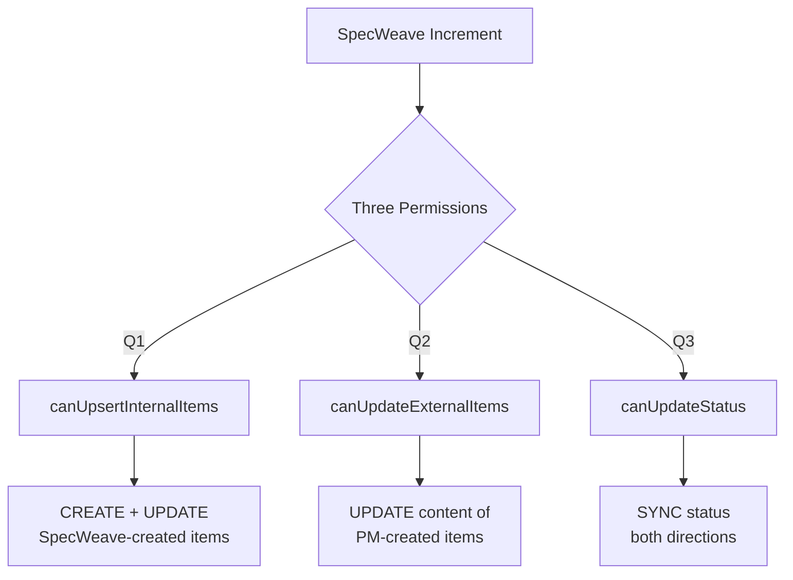

# Three-Permission Architecture

**Three-Permission Architecture** replaces the old "bidirectional sync" binary flag with granular control over three distinct sync operations.

---

## The Three Permissions



---

## Permission Details

### Q1: canUpsertInternalItems

**Controls**: Creating and updating work items that SpecWeave creates.

**Flow**: `/sw:increment` → CREATE GitHub issue → UPDATE as tasks complete

**When true**:
- GitHub issue auto-created on `/sw:increment`
- Issue updated with task progress
- Issue closed on `/sw:done`

**When false**:
- No automatic issue creation
- Local-only workflow

---

### Q2: canUpdateExternalItems

**Controls**: Updating work items created externally (by PM, in JIRA, etc.).

**Flow**: External issue exists → SpecWeave UPDATE with implementation progress

**When true**:
- Updates PM-created GitHub issues
- Adds implementation details
- Updates task checklists

**When false**:
- SpecWeave ignores external items
- No content updates to PM-created issues

---

### Q3: canUpdateStatus

**Controls**: Syncing status in both directions.

**Flow**: GitHub → Status sync → SpecWeave metadata

**When true**:
- Issue closure in GitHub reflects in SpecWeave
- Label changes sync back
- Status updates flow both ways

**When false**:
- Status managed manually
- No automatic status sync

---

## Configuration

```json
{
  "sync": {
    "settings": {
      "canUpsertInternalItems": true,
      "canUpdateExternalItems": true,
      "canUpdateStatus": true
    }
  }
}
```

---

## Common Scenarios

### Solo Developer

```json
{
  "canUpsertInternalItems": true,
  "canUpdateExternalItems": false,
  "canUpdateStatus": false
}
```

Create my own issues, don't care about external updates.

### Team Collaboration

```json
{
  "canUpsertInternalItems": true,
  "canUpdateExternalItems": true,
  "canUpdateStatus": true
}
```

Full sync - create, update, and track everything.

### Read-Only Observer

```json
{
  "canUpsertInternalItems": false,
  "canUpdateExternalItems": false,
  "canUpdateStatus": true
}
```

Only pull status updates, never push content.

---

## Migration from v0.23

Old config:
```json
{ "syncDirection": "bidirectional" }
```

New config:
```json
{
  "canUpsertInternalItems": true,
  "canUpdateExternalItems": true,
  "canUpdateStatus": true
}
```

Migration happens automatically on upgrade.

---

## Related Terms

- [Split-Source Sync](/docs/glossary/terms/split-source-sync)
- [Profile-Based Sync](/docs/glossary/terms/profile-based-sync)
- [Hooks](/docs/glossary/terms/hooks)
