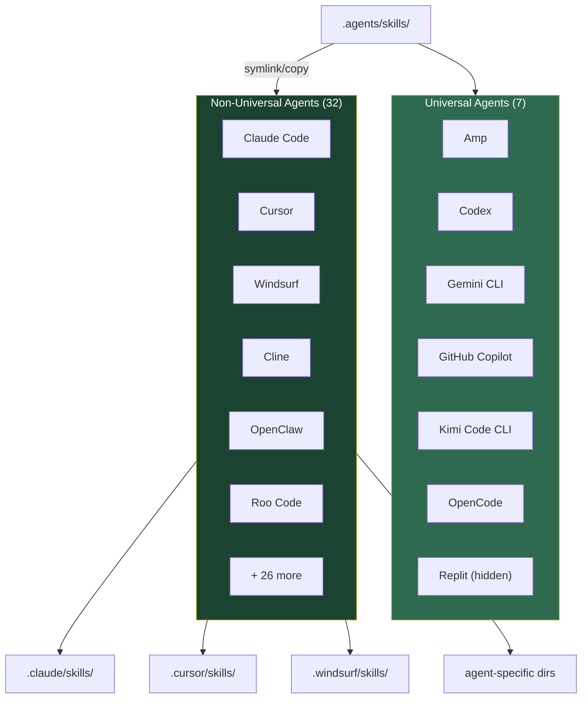
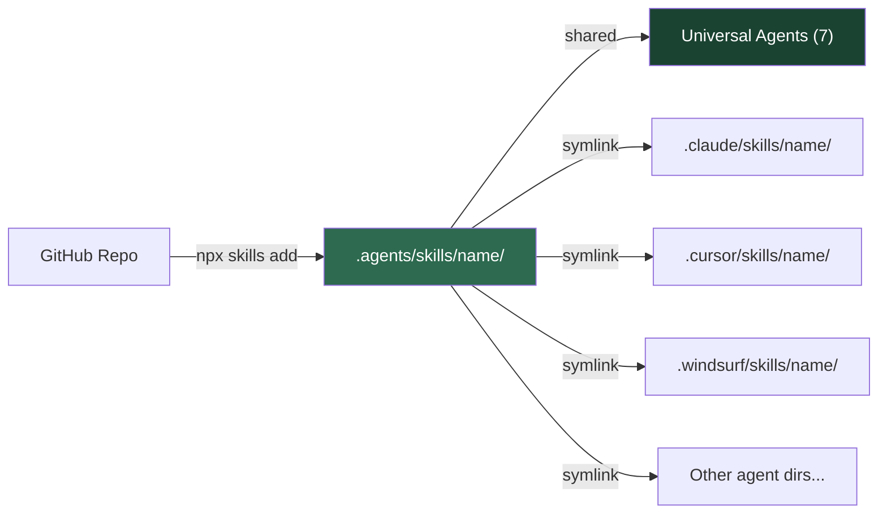

# Agent Skills Extensibility Analysis

The Agent Skills format (SKILL.md) has been adopted by 39 AI coding agents. But "adopted" doesn't mean "identical." This analysis maps exactly what works universally, what varies across platforms, and how to write skills that work everywhere.

**Source data**: `skills@1.3.9` npm package (vercel-labs/skills), Agent Skills specification (agentskills.io), and primary source analysis of agent configuration registries.

## The 39-Agent Ecosystem

As of `skills@1.3.9`, the Agent Skills format is supported by 39 AI coding agents. These split into two categories based on how they discover and load skills.



### Universal Agents (7)

Universal agents share the `.agents/skills` directory. A skill installed once is available to all of them without symlinks or copies.

| Agent | Display Name | Global Skills Dir | Detection Method |
|-------|-------------|-------------------|-----------------|
| amp | Amp | `$XDG_CONFIG_HOME/agents/skills` | `$XDG_CONFIG_HOME/amp` exists |
| codex | Codex | `$CODEX_HOME/skills` (default: `~/.codex/skills`) | `~/.codex` or `/etc/codex` exists |
| gemini-cli | Gemini CLI | `~/.gemini/skills` | `~/.gemini` exists |
| github-copilot | GitHub Copilot | `~/.copilot/skills` | `.github` dir or `~/.copilot` exists |
| kimi-cli | Kimi Code CLI | `~/.config/agents/skills` | `~/.kimi` exists |
| opencode | OpenCode | `$XDG_CONFIG_HOME/opencode/skills` | `$XDG_CONFIG_HOME/opencode` or `~/.claude/skills` exists |
| replit | Replit | `$XDG_CONFIG_HOME/agents/skills` | `.agents` dir in cwd exists |

Replit uses `.agents/skills` but has `showInUniversalList: false`, making it a "hidden universal" agent. The `getUniversalAgents()` function returns 6 visible agents.

### Non-Universal Agents (32)

Each non-universal agent has its own skills directory. The `skills` CLI creates symlinks from the canonical `.agents/skills/<name>/` to each agent-specific path.

| Agent | Local Skills Dir | Global Skills Dir | Notable |
|-------|-----------------|-------------------|---------|
| claude-code | `.claude/skills` | `$CLAUDE_CONFIG_DIR/skills` | Only agent with `context: fork` |
| cursor | `.cursor/skills` | `~/.cursor/skills` | |
| windsurf | `.windsurf/skills` | `~/.codeium/windsurf/skills` | Under Codeium parent dir |
| cline | `.cline/skills` | `~/.cline/skills` | One of two agents with hooks |
| openclaw | `skills` | `~/.openclaw/skills` | No dot-prefix; 3 legacy paths |
| roo | `.roo/skills` | `~/.roo/skills` | |
| antigravity | `.agent/skills` | `~/.gemini/antigravity/skills` | Singular `.agent` (not `.agents`) |
| augment | `.augment/skills` | `~/.augment/skills` | |
| codebuddy | `.codebuddy/skills` | `~/.codebuddy/skills` | |
| command-code | `.commandcode/skills` | `~/.commandcode/skills` | |
| continue | `.continue/skills` | `~/.continue/skills` | |
| crush | `.crush/skills` | `~/.config/crush/skills` | Charmbracelet; XDG paths |
| droid | `.factory/skills` | `~/.factory/skills` | Factory AI branding |
| goose | `.goose/skills` | `$XDG_CONFIG_HOME/goose/skills` | XDG-compliant |
| iflow-cli | `.iflow/skills` | `~/.iflow/skills` | |
| junie | `.junie/skills` | `~/.junie/skills` | |
| kilo | `.kilocode/skills` | `~/.kilocode/skills` | |
| kiro-cli | `.kiro/skills` | `~/.kiro/skills` | Requires manual agent.json registration |
| kode | `.kode/skills` | `~/.kode/skills` | |
| mcpjam | `.mcpjam/skills` | `~/.mcpjam/skills` | |
| mistral-vibe | `.vibe/skills` | `~/.vibe/skills` | |
| mux | `.mux/skills` | `~/.mux/skills` | |
| neovate | `.neovate/skills` | `~/.neovate/skills` | |
| openhands | `.openhands/skills` | `~/.openhands/skills` | |
| pi | `.pi/skills` | `~/.pi/agent/skills` | Extra `agent/` segment |
| pochi | `.pochi/skills` | `~/.pochi/skills` | |
| qoder | `.qoder/skills` | `~/.qoder/skills` | |
| qwen-code | `.qwen/skills` | `~/.qwen/skills` | |
| trae | `.trae/skills` | `~/.trae/skills` | Shares local dir with Trae CN |
| trae-cn | `.trae/skills` | `~/.trae-cn/skills` | China variant |
| adal | `.adal/skills` | `~/.adal/skills` | |
| zencoder | `.zencoder/skills` | `~/.zencoder/skills` | No `allowed-tools` support |

---

## Feature Compatibility Matrix

All 39 agents support the base SKILL.md format. Advanced features have varying support:

| Feature | Support | Supported By | Not Supported |
|---------|---------|-------------|---------------|
| **Basic skills** (name, description, markdown) | All 39 agents | Universal | None |
| **`allowed-tools`** (pre-approved tool list) | 37 agents | All except Kiro CLI, Zencoder | Kiro CLI, Zencoder |
| **`context: fork`** (skill context forking) | 1 agent | Claude Code only | All other 38 agents |
| **Hooks** (pre/post execution) | 2 agents | Claude Code, Cline | All other 37 agents |

### Feature Details

#### Basic Skills (Universal)

Every agent supports the core SKILL.md format:

```yaml
---
name: my-skill
description: "What this skill does and when to activate it"
---
# Skill Instructions

Markdown body with instructions for the agent.
```

Optional frontmatter: `license`, `compatibility`, `metadata`. Optional directories: `scripts/`, `references/`, `assets/`.

#### `allowed-tools` (Near-Universal)

Pre-approves specific tools for the skill:

```yaml
allowed-tools: Bash(git:*) Bash(jq:*) Read
```

**Not supported** by Kiro CLI and Zencoder. For maximum portability, treat `allowed-tools` as optional and ensure your skill works without it.

#### `context: fork` (Claude Code Exclusive)

Creates an isolated execution environment for the skill. This is a Claude Code-specific extension not part of the base specification. **Do not rely on this for portable skills.**

#### Hooks (Claude Code + Cline Only)

Pre/post execution hooks triggered around skill activation. Only 2 of 39 agents support this. **Treat hooks as platform-specific enhancements, not core skill functionality.**

---

## Portability Tiers

Skills can be classified by their portability reach:

### Tier 1: Universal (39/39 Agents)

Uses only the portable core: `name`, `description`, markdown body, optional subdirectories. No `allowed-tools`, no hooks, no `context: fork`.

```yaml
---
name: my-universal-skill
description: >-
  Works on every Agent Skills-compatible coding assistant.
---
```

**Best for**: Style guides, coding standards, documentation templates, project conventions.

### Tier 2: Near-Universal (37/39 Agents)

Adds `allowed-tools` frontmatter. Excludes Kiro CLI and Zencoder.

```yaml
---
name: my-tooling-skill
description: >-
  Manages project structure with file system tools.
allowed-tools: Read Write Bash
---
```

**Best for**: Skills that need to read/write files, run commands, or interact with the agent's tool system.

### Tier 3: Platform-Enhanced (2-3 Agents)

Uses hooks, `context: fork`, or other platform-exclusive features. Include graceful degradation for other agents.

**Best for**: Security enforcement, CI/CD integration, complex automation workflows.

---

## Format Variation Analysis

### Directory Naming Conventions

Three patterns emerge across the 39 agents:

| Pattern | Example | Count | Agents |
|---------|---------|-------|--------|
| Standard dot-prefix | `.claude/skills` | 28 | Most agents |
| XDG-compliant | `$XDG_CONFIG_HOME/agent/skills` | 4 | Amp, Crush, Goose, OpenCode |
| Non-standard | `skills/` (no dot), `.agent/` (singular) | 2 | OpenClaw, Antigravity |

### Agent Detection Methods

Agents use filesystem detection (`existsSync`) to discover if they're installed:

| Strategy | Count | Description |
|----------|-------|-------------|
| Home directory check | 28 | `existsSync(~/.agent)` |
| XDG config check | 4 | `existsSync($XDG_CONFIG_HOME/agent)` |
| Multi-path check | 7 | Multiple locations (cwd + home, env vars, legacy paths) |

### Environment Variable Support

| Agent | Variable | Default |
|-------|----------|---------|
| Claude Code | `CLAUDE_CONFIG_DIR` | `~/.claude` |
| Codex | `CODEX_HOME` | `~/.codex` |
| Amp, Crush, Goose, OpenCode, Kimi CLI, Replit | `XDG_CONFIG_HOME` | `~/.config` |

### Platform-Specific Quirks

**Kiro CLI** requires manual registration after installation:
```json
{ "resources": ["skill://.kiro/skills/**/SKILL.md"] }
```
This is the only agent needing a separate configuration step after skill installation.

**OpenCode** cross-detects Claude Code's skills directory (`~/.claude/skills`), suggesting it can discover skills installed for Claude Code.

**Codex** is the only agent checking a system-wide path (`/etc/codex`) in addition to user directories.

**Trae and Trae CN** share the same local directory (`.trae/skills`) but use different global paths, meaning project-level skills are shared between them but global skills are separate.

**OpenClaw** uses bare `skills/` as its local directory (no dot-prefix) and supports three legacy global directory names: `~/.openclaw/`, `~/.clawdbot/`, `~/.moltbot/`.

---

## Portability Guidelines for Skill Authors

### Write for the Universal Baseline

1. **Use only base SKILL.md features**: `name`, `description` in frontmatter, markdown body. These work on all 39 agents.

2. **Treat `allowed-tools` as optional**: Include it for better UX on supporting agents, but ensure your skill's instructions work without it. Kiro CLI and Zencoder will ignore this field.

3. **Never depend on `context: fork`**: This is Claude Code exclusive. If your skill needs isolation, document it as a recommendation rather than a requirement.

4. **Never depend on hooks**: Only 2 agents support them. Use hooks as progressive enhancement, not core functionality.

### Avoid Platform Assumptions

5. **Don't hardcode paths**: Skills referencing `.claude/skills/` or `~/.cursor/` will break on other agents. Use relative paths from the skill's own directory.

6. **Don't assume a specific package manager**: Use generic descriptions like "install dependencies" rather than `npm install` or `bun add`. Let the agent choose based on the project context.

7. **Don't assume specific agent capabilities**: Not all agents can run bash commands, create files, or access the network. Write instructions that degrade gracefully.

### Graceful Degradation Pattern

When you need platform-exclusive features, provide fallbacks:

```markdown
## Security Enforcement

### If your agent supports hooks (Claude Code, Cline):
Set up a PreToolUse hook to block writes to protected files.

### For all other agents:
Before modifying any file in `config/`, ask the user for explicit confirmation.
```

### Test Across Platforms

8. **Minimum viable testing**: Verify your skill loads and activates correctly on at least Claude Code + Codex + one other agent.

9. **Document compatibility**: Include a compatibility note in your SKILL.md description if the skill relies on features not available everywhere.

10. **Use the `skills` CLI for installation**: `npx skills add <owner/repo>` handles symlink creation across all 39 agents automatically.

### Portability Checklist

- [ ] SKILL.md has `name` and `description` frontmatter
- [ ] No `context: fork` dependency
- [ ] No hooks dependency
- [ ] `allowed-tools` is optional (skill works without it)
- [ ] No hardcoded agent-specific paths
- [ ] No hardcoded package manager commands
- [ ] Instructions use relative paths from skill directory
- [ ] Tested on 2+ different agents
- [ ] Compatibility documented in description or README

---

## Installation Architecture

The `skills` CLI uses a canonical directory pattern for cross-agent installation:



1. Skills are copied to `.agents/skills/<name>/` (canonical location)
2. Universal agents read directly from this location
3. Non-universal agents get symlinks from canonical to their specific directory
4. On Windows without developer mode, symlinks fall back to file copying
5. On Windows, `junction` type symlinks are used

### Security Measures

The installer includes path safety protections:
- **Name sanitization**: Converts to lowercase kebab-case, strips path traversal characters
- **Path containment**: Ensures targets don't escape expected base directories
- **File exclusion**: `README.md`, `metadata.json`, `_*` prefixed files, and `.git/` are excluded

---

## The `agentSkillsCompat` Extension

SpecWeave's Fabric Registry tracks per-skill compatibility metadata through the `agentSkillsCompat` field:

**Portability scoring (0-5)**:
- **5**: Tested on 10+ agents, no known issues, portable core only
- **4**: Tested on 5-9 agents, no breaking issues
- **3**: Tested on 3-4 agents, uses `allowed-tools` (37/39 reach)
- **2**: Tested on 1-2 agents, uses platform-specific features with fallbacks
- **1**: Single-agent skill with no portability effort
- **0**: Uses features exclusive to one agent with no fallback

This integrates with the Fabric Registry's quality scoring rubric, where portability is one of six dimensions contributing to a skill's overall trust score.

---

## Further Reading

- [Skill Discovery & Evaluation Guide](/docs/guides/skill-discovery-evaluation) — Finding and scoring quality skills
- [Skill Contradiction Resolution](/docs/guides/skill-contradiction-resolution) — Handling conflicting instructions
- [Agent Security Best Practices](/docs/guides/agent-security-best-practices) — Operational security guidelines
- [Agent Skills Specification](https://agentskills.io/home) — The open format specification
- [Skills CLI Documentation](https://github.com/vercel-labs/skills) — Installation tooling
