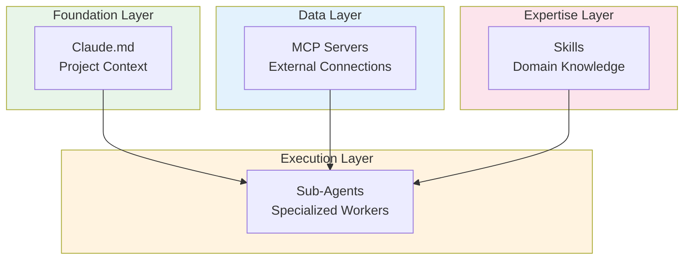

# Claude Skills Deep Dive

**Understanding Skills and How They Fit in the Claude Ecosystem**

This guide explains how Claude Code Skills work, their architecture, and how they integrate with other Claude features like Claude.md, MCP servers, and sub-agents.

---

## What Are Skills?

**Skills are organized folders that package expertise that Claude can automatically invoke when relevant to the task at hand.**

Think of skills as domain experts that Claude can consult. Unlike general knowledge, skills provide specialized expertise for specific domains, frameworks, or workflows.

### Key Characteristics

- **Portable**: Work across Claude Code, the API, and claude.ai
- **Auto-activating**: Load automatically when user prompts match skill descriptions
- **Lightweight**: Only consume 30-50 tokens at startup per skill
- **Progressive**: Full content loads only when needed

---

## How Skills Work (Progressive Disclosure)

Skills use a **three-stage loading pattern** that keeps your context window lean:

```
┌─────────────────────────────────────────────────────────────┐
│ STAGE 1: Startup (Always Loaded)                           │
│                                                             │
│ Only name + description loaded for every installed skill   │
│ Cost: ~30-50 tokens per skill                              │
│                                                             │
│ Example:                                                    │
│ - name: "database-query"                                   │
│ - description: "Query optimization patterns..."            │
└─────────────────────────────────────────────────────────────┘
                           │
                           ▼ (User prompt matches description)
┌─────────────────────────────────────────────────────────────┐
│ STAGE 2: Skill Activation                                  │
│                                                             │
│ Full SKILL.md content loaded into context                  │
│ Contains templates, patterns, examples, guidance           │
└─────────────────────────────────────────────────────────────┘
                           │
                           ▼ (If skill references other files)
┌─────────────────────────────────────────────────────────────┐
│ STAGE 3: Progressive Loading                               │
│                                                             │
│ Referenced files, scripts, templates loaded as needed      │
│ Only what's required for the specific task                 │
└─────────────────────────────────────────────────────────────┘
```

### Why This Matters

**Without progressive disclosure:**
```
100 skills × 5,000 tokens average = 500,000 tokens
→ Impossible to fit in context
→ Massive cost per request
```

**With progressive disclosure:**
```
100 skills × 40 tokens (name/description) = 4,000 tokens
+ 1 activated skill = 5,000 tokens
= 9,000 tokens total (98% reduction!)
```

---

## Skills vs Other Claude Features

Understanding how skills differ from and complement other Claude capabilities:

### Comparison Matrix

| Feature | Purpose | Scope | Location |
|---------|---------|-------|----------|
| **Skills** | Portable expertise | Any project | `~/.claude/skills/` or `.claude/skills/` |
| **Claude.md** | Project context | Single project | Repository root |
| **MCP Servers** | Data connections | External systems | Configured endpoints |
| **Sub-agents** | Specialized workers | Task execution | System-defined |

### Claude.md Files

**Purpose**: Tell Claude about your specific project.

Claude.md files live alongside your code and contain:
- Tech stack (e.g., "We use Next.js and Tailwind")
- Coding conventions
- Repository structure
- Project-specific patterns

**Example Claude.md:**
```markdown
# Project Context

## Tech Stack
- Next.js 14 with App Router
- Tailwind CSS for styling
- Prisma with PostgreSQL
- Jest for testing

## Conventions
- Use TypeScript strict mode
- Components in `src/components/`
- API routes in `src/app/api/`
```

### Skills

**Purpose**: Portable expertise that works across ANY project.

Skills contain domain knowledge independent of any specific codebase:
- Typography standards
- Animation patterns
- Query optimization techniques
- Security best practices

**Example Skill (Front-End Design):**
```markdown
---
description: Typography standards, animation patterns, and layout
             conventions. Activates for UI components, styling,
             design system, typography, animations.
---

# Frontend Design Patterns

## Typography Scale
- Headings: 2.5rem, 2rem, 1.5rem, 1.25rem
- Body: 1rem (16px base)
- Small: 0.875rem

## Animation Patterns
- Transitions: 200ms ease-out
- Hover states: scale(1.02)
- Loading: skeleton with pulse

## Layout Conventions
- Max content width: 1280px
- Grid: 12-column with 24px gaps
- Spacing scale: 4, 8, 16, 24, 32, 48, 64px
```

### MCP Servers

**Purpose**: Universal integration protocol connecting Claude to external data.

MCP servers provide:
- GitHub repository access
- Database connections
- Linear/JIRA integration
- Custom API integrations

**Key insight**: MCP connects to **data**. Skills teach Claude **what to do with it**.

**Example**:
- MCP server gives Claude access to your PostgreSQL database
- Database query skill teaches Claude your team's query optimization patterns

### Sub-Agents

**Purpose**: Specialized AI assistants with fixed roles.

Each sub-agent has:
- Own context window (isolated from main conversation)
- Custom prompt defining its role
- Specific tool permissions

**Example sub-agents**:
- Frontend developer agent
- UI reviewer agent
- QA engineer agent

**Key insight**: Skills provide portable expertise that ANY agent can use.

```
┌─────────────────────────────────────────────────────────────┐
│ Frontend Developer Agent                                    │
│ └── Uses: component-patterns skill                         │
│                                                             │
│ UI Reviewer Agent                                          │
│ └── Uses: design-system skill                              │
│                                                             │
│ Both Agents                                                 │
│ └── Can use: accessibility-standards skill                 │
└─────────────────────────────────────────────────────────────┘
```

---

## How Everything Works Together

The Claude ecosystem is designed for **synergy**:



### Real-World Example

**Scenario**: Adding OAuth to your Next.js app

1. **Claude.md sets foundation**
   - "This is a Next.js 14 project with Prisma"
   - "We use TypeScript strict mode"
   - "Auth routes are in `src/app/api/auth/`"

2. **MCP servers connect data**
   - GitHub MCP reads your current auth implementation
   - Database MCP inspects your User model

3. **Sub-agents specialize**
   - Backend agent handles API routes
   - Frontend agent creates login UI
   - Security agent reviews implementation

4. **Skills bring expertise**
   - OAuth best practices skill provides token handling patterns
   - Security skill ensures PKCE flow implementation
   - Frontend skill provides accessible form patterns

**Result**: Each piece makes every other piece smarter and more capable.

---

## Practical Use Cases

### 1. Onboarding New Team Members

**Skill**: `team-coding-standards`

```markdown
---
description: Company coding standards and conventions.
             Activates for new code, PR review, coding style,
             best practices, how we code.
---

# Team Coding Standards

## Naming Conventions
- Components: PascalCase (`UserProfile.tsx`)
- Hooks: camelCase with `use` prefix (`useAuthState`)
- Utils: camelCase (`formatDate`)

## File Organization
- One component per file
- Co-locate tests: `Component.test.tsx`
- Shared types in `types/`

## Code Review Checklist
- [ ] TypeScript strict compliance
- [ ] Unit tests for new functions
- [ ] No `any` types without justification
```

**Usage**:
```
User: "I'm new to the team. How should I structure my React components?"
→ team-coding-standards skill activates
→ Claude responds with team-specific guidance
```

### 2. Security PR Reviews

**Skill**: `security-checklist`

```markdown
---
description: Security best practices for code review.
             Activates for PR review, security check,
             vulnerability scan, OWASP, security patterns.
---

# Security Review Checklist

## Input Validation
- [ ] All user inputs sanitized
- [ ] SQL queries use parameterized statements
- [ ] File uploads validated (type, size, content)

## Authentication
- [ ] Passwords hashed with bcrypt (cost 12+)
- [ ] JWT tokens expire appropriately
- [ ] Refresh tokens stored securely

## Authorization
- [ ] Route guards implemented
- [ ] Resource ownership verified
- [ ] Admin routes protected

## Data Exposure
- [ ] No secrets in client code
- [ ] API responses filtered
- [ ] Error messages generic
```

**Usage**:
```
User: "Review this PR for security issues"
→ security-checklist skill activates
→ Claude systematically checks each security concern
```

### 3. Data Analysis Methodology

**Skill**: `data-analysis-patterns`

```markdown
---
description: Team data analysis methodology and patterns.
             Activates for data analysis, SQL queries,
             analytics, reports, dashboards, metrics.
---

# Data Analysis Patterns

## Query Patterns
- Always include date range filters
- Use CTEs for readability
- Materialize expensive subqueries

## Metric Definitions
- DAU: Unique users with session > 30s
- Retention: D1, D7, D30 cohort-based
- Conversion: Checkout started → Completed

## Report Structure
1. Executive summary (3 bullets)
2. Key metrics with trends
3. Deep dive analysis
4. Recommendations
```

---

## Creating Your Own Skills

### Skill File Structure

```
~/.claude/skills/
└── my-skill/              # Subdirectory required!
    └── SKILL.md           # Must be named exactly SKILL.md
```

### SKILL.md Format

```yaml
---
description: |             # max 1024 chars, MUST include
  What this skill does.    # activation keywords!
  Activates for: keyword1, keyword2, keyword3.
---

# Skill Title

## When to Use
[Scenarios where this skill helps...]

## Templates
[Reusable patterns...]

## Examples
[Real-world examples...]
```

### Best Practices

**DO:**
- Include clear activation keywords in description
- Provide concrete examples and templates
- Keep skills focused on one domain
- Use consistent formatting

**DON'T:**
- Use `name:` in frontmatter for plugin-based skills (strips the plugin namespace prefix!)
- Make skills too generic ("general programming")
- Include project-specific details (use Claude.md for that)
- Forget the YAML frontmatter
- Put SKILL.md directly in `~/.claude/skills/` (needs subdirectory!)

### Testing Your Skill

1. Install: `cp -r my-skill ~/.claude/skills/`
2. **Restart Claude Code** (required!)
3. Test: Ask a question matching your activation keywords
4. Verify: Skill should auto-activate and inform your response

---

## Restricting Tool Access (Optional)

Limit what tools a skill can use:

```yaml
---
description: Documentation lookup skill. Read-only.
allowed-tools: Read, Grep, Glob
---
```

This prevents the skill from using Write, Edit, Bash, etc.

---

## Summary

| Concept | What It Does | When to Use |
|---------|--------------|-------------|
| **Skills** | Portable expertise | Domain knowledge across projects |
| **Claude.md** | Project context | Tech stack, conventions, structure |
| **MCP Servers** | Data connections | External systems integration |
| **Sub-agents** | Specialized workers | Complex task execution |

**The Power of Synergy**:
- Claude.md sets the foundation
- MCP servers connect the data
- Sub-agents specialize in their roles
- Skills bring the expertise

**Making every piece smarter and more capable.**

---

## Related Resources

- [Skills vs Agents](/docs/glossary/terms/skills-vs-agents) - Detailed comparison
- [Cost Optimization](/docs/guides/cost-optimization) - Context efficiency tips
- [Getting Started](/docs/guides/getting-started/quickstart) - Quick start guide

---

*Based on official Claude Code documentation and Anthropic's skill architecture.*
