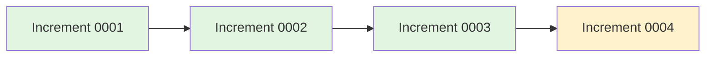
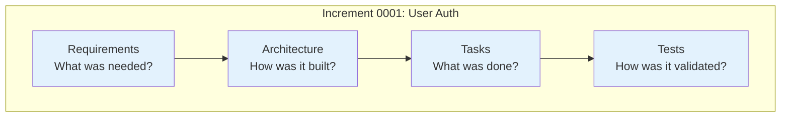
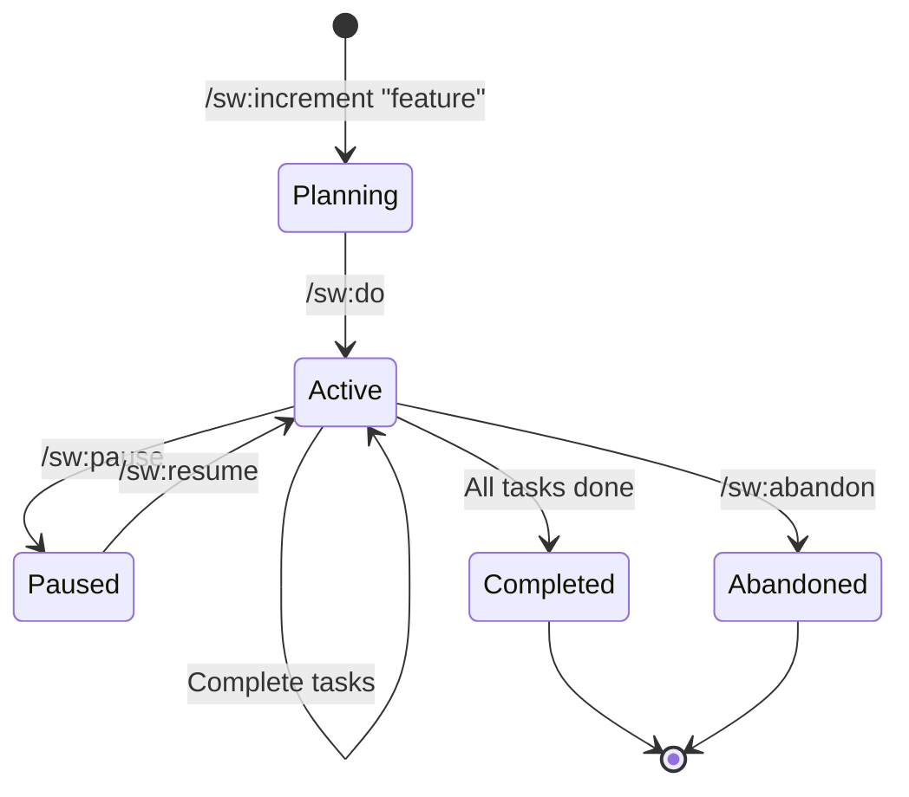

# What is an Increment?

An **increment** is SpecWeave's fundamental unit of work—a complete, self-contained feature with specifications, architecture, implementation plan, and tests.

## Think of Increments as "Git Commits for Features"

Just like Git commits capture code changes with messages and history, **increments capture feature development** with complete context:



**Each increment contains:**
- 📋 **spec.md** - What and Why (requirements, user stories, acceptance criteria)
- 🏗️ **plan.md** - How (architecture, test strategy, implementation approach)
- ✅ **tasks.md** - Checklist with embedded tests
- 📊 **logs/** - Execution history
- 📝 **reports/** - Completion summaries, scope changes

## Anatomy of an Increment

```
.specweave/increments/0001-user-authentication/
├── spec.md              # WHAT: Requirements, user stories, AC-IDs
│                        # - US-001: Basic login flow
│                        # - US-002: Password reset
│                        # - AC-US1-01: Valid credentials → dashboard
│
├── plan.md              # HOW: Architecture + test strategy
│                        # - JWT authentication design
│                        # - Database schema
│                        # - Test coverage targets (85% unit, 80% integration)
│
├── tasks.md             # Checklist + embedded tests
│                        # - T-001: AuthService [in_progress]
│                        # - T-002: Login endpoint [pending]
│                        # - Each task has BDD test plan
│
├── logs/                # Execution logs
│   └── session-2025-11-04.log
│
└── reports/             # Completion reports, scope changes
    └── COMPLETION-REPORT.md
```

## Why Increments?

### 1. Complete Context

Every increment is a **snapshot in time** with all context preserved:



**6 months later**, you can answer:
- ✅ "Why did we choose JWT over sessions?" → Read spec.md
- ✅ "How does password reset work?" → Read plan.md
- ✅ "What tests cover this?" → Read tasks.md (embedded tests)

### 2. Traceability

Clear path from requirements → implementation → tests:

```
AC-US1-01 (spec)
   ↓
T-001: AuthService (tasks)
   ↓
validLogin() test (tests/unit/auth.test.ts)
```

**For compliance** ([HIPAA](/docs/glossary/terms/hipaa), [SOC 2](/docs/glossary/terms/soc2), [FDA](/docs/glossary/terms/fda)):
- Complete audit trail
- Requirement-to-code traceability
- Test coverage proof

### 3. Focused Work

**ONE increment at a time** prevents context switching:

| Without Increments | With Increments |
|-------------------|-----------------|
| Multiple features in progress | **Focus on ONE thing** |
| Unclear what's done | **Clear completion criteria** |
| Documentation scattered | **Everything in one place** |
| Hard to rollback | **Self-contained units** |

## Increment Types

SpecWeave supports different work types:

| Type | Use When | Can Interrupt? | Example |
|------|----------|----------------|---------|
| **feature** | New functionality | No | User authentication, payments |
| **hotfix** | Critical production bug | ✅ Yes | Security patch, crash fix |
| **bug** | Production bugs needing investigation | ✅ Yes | Memory leak, performance issue |
| **change-request** | Stakeholder request | No | UI redesign, API changes |
| **refactor** | Code improvement | No | Extract service layer, TypeScript migration |
| **experiment** | POC/spike work | No | Evaluate libraries, architecture spike |

**Note**: All types use the same structure (spec.md, plan.md, tasks). The type is just a label for tracking.

## Increment Lifecycle



**States explained:**
- **Planning**: PM agent creates spec.md, plan.md, tasks.md
- **Active**: Implementation in progress
- **Paused**: Temporarily on hold (with reason)
- **Completed**: All tasks done, tests passing
- **Abandoned**: Work canceled (with reason)

## Increment Sizing: Keep It Small

:::tip Golden Rule
**5-15 tasks, 1-3 user stories, completable in 1-3 days.**
:::

| Metric | Target | Why |
|--------|--------|-----|
| **Tasks** | 5-15 | Trackable, achievable in reasonable time |
| **User Stories** | 1-3 | Focused scope, clear goals |
| **Duration** | 1-3 days | Fast feedback, quick wins |

### Why Small Increments?

**For Humans:**
- ✅ "12 of 15 tasks done" feels achievable
- ✅ Ship something every few days
- ✅ Always know exactly what to do next

**For AI Tools:**
- ✅ Better context retention (smaller specs fit in context windows)
- ✅ Higher accuracy per task
- ✅ Easier to validate acceptance criteria

### Anti-Pattern: The Mega-Increment

```
❌ BAD: 50-task increment running for 3 weeks
   - You lose mental context after week 1
   - AI tools struggle with sprawling specs
   - Progress feels slow ("10% done after 3 days?")
   - Higher risk of incomplete delivery
```

**If your increment has 15+ tasks → split it into smaller increments!**

---

## Best Practices

### ✅ DO

1. **Keep increments small** - 5-15 tasks, 1-3 user stories
2. **Keep increments focused** - One feature or fix per increment
3. **Complete before starting new** - Finish 0001 before 0002
4. **Use descriptive names** - `0001-user-authentication` not `0001`
5. **Document scope changes** - Use `/sw:update-scope`
6. **Close properly** - Validate tests, update docs, create completion report

### ❌ DON'T

1. **Don't create mega-increments** - Split 20+ task increments
2. **Don't start multiple increments** - Causes context switching
3. **Don't skip specs** - Leads to unclear requirements
4. **Don't modify completed increments** - They're immutable snapshots
5. **Don't work without a plan** - Create plan.md before implementation
6. **Don't forget tests** - Every task needs test validation

## Real-World Examples

### Example 1: Simple Feature

```
Increment: 0005-dark-mode
Duration: 2 days
Tasks: 4
Type: feature

Structure:
├── spec.md (1 user story, 3 AC-IDs)
├── plan.md (CSS variables, theme switching)
├── tasks.md (4 tasks, embedded tests, 85% coverage)
└── reports/COMPLETION-REPORT.md
```

### Example 2: Payment Feature (Split into Multiple Increments)

:::caution Better Approach
Instead of one 18-task, 3-week increment, **split into focused increments**:
:::

```
# Instead of ONE mega-increment, split into THREE focused ones:

Increment: 0012-stripe-checkout
Duration: 3 days
Tasks: 8
Type: feature
├── spec.md (2 user stories: basic checkout, payment confirmation)
├── plan.md (Stripe Checkout integration)
└── tasks.md (8 tasks, embedded tests, 85% coverage)

Increment: 0013-stripe-webhooks
Duration: 2 days
Tasks: 6
Type: feature
├── spec.md (2 user stories: webhook handling, event processing)
├── plan.md (Webhook endpoints, event verification)
└── tasks.md (6 tasks, embedded tests, 90% coverage)

Increment: 0014-stripe-refunds
Duration: 2 days
Tasks: 5
Type: feature
├── spec.md (1 user story: refund processing)
├── plan.md (Refund API, admin UI)
└── tasks.md (5 tasks, embedded tests, 85% coverage)
```

**Result**: Same total scope, but with 3 shippable milestones instead of 1 risky mega-increment!

### Example 3: Emergency Hotfix

```
Increment: 0008-sql-injection-fix
Duration: 4 hours
Tasks: 3
Type: hotfix

Structure:
├── spec.md (Security vulnerability, CVE reference)
├── plan.md (Parameterized queries, input validation)
├── tasks.md (3 tasks, security tests, 100% coverage)
└── reports/COMPLETION-REPORT.md (impact analysis)
```

## Increments vs Living Documentation

**Increments** (immutable snapshots):
- Historical record
- "What was done and why"
- Never modified after completion
- Complete audit trail

**Living Docs** (always current):
- Current system state
- "What exists now"
- Auto-updated by hooks
- Single source of truth

**Both are essential:**
```
Question: "Why did we build it this way?"
Answer: Read increment snapshot

Question: "What's the current implementation?"
Answer: Read living docs
```

## Summary

- **Increment = complete feature unit** (spec, plan, tasks, tests)
- **Keep it small**: 5-15 tasks, 1-3 user stories, 1-3 days
- **Immutable snapshots** preserved forever
- **Clear lifecycle** (planning → active → completed)
- **Focus on ONE** increment at a time
- **Complete context** for future reference
- **Traceability** from requirements to code

## Next Steps

- [Creating Your First Increment](/docs/workflows/planning)
- [The /sw:do Workflow](/docs/workflows/implementation)
- [Living Documentation](/docs/guides/core-concepts/living-documentation)

---

**Learn More:**
- [Increment Planning Workflow](/docs/workflows/planning)
- [Increment Discipline (WIP Limits)](/docs/academy/specweave-essentials/13-increment-lifecycle)
- Test-Aware Planning
