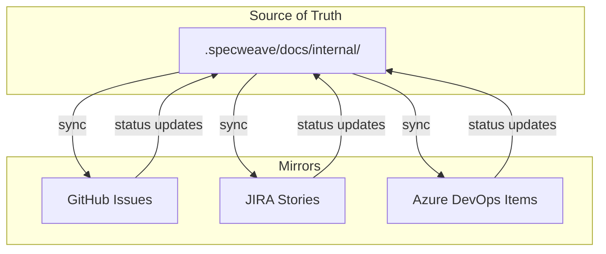

# Who Benefits from Living Documentation?

Living documentation provides different levels of value to different stakeholders. This page provides an **honest assessment** of who benefits and how.

## Value Matrix

| Stakeholder | Benefit Level | Primary Value | Mechanism |
|-------------|---------------|---------------|-----------|
| **Human Developers** | 🟢 HIGH | Onboarding, knowledge preservation | Read docs directly |
| **Human Auditors** | 🟢 HIGH | Compliance, traceability | Git history + structure |
| **External Tool Sync** | 🟢 HIGH | Source of truth for GitHub/JIRA/ADO | Bidirectional sync |
| **LLM during Planning** | 🟢 HIGH | Context injection via `/sw:increment` | Auto-injected context |
| **LLM during Execution** | 🟡 MEDIUM | Context available via `/sw:docs` | On-demand retrieval |
| **LLM during General Chat** | 🔴 LOW | Must explicitly reference docs | Manual file reads |

---

## Human Benefits (Fully Realized)

### 1. Developer Onboarding

**Value**: 🟢 HIGH

New developers can understand the entire project by reading living docs:

```
.specweave/docs/internal/
├── strategy/           → WHY was this built?
├── specs/              → WHAT was built?
├── architecture/       → HOW was it designed?
│   └── adr/            → WHY those design decisions?
├── operations/         → HOW to run it?
└── governance/         → WHAT are the rules?
```

**Metrics**:
- Traditional onboarding: 2-4 weeks
- With living docs: 1-3 days
- **Improvement**: 80-90% faster onboarding

### 2. Knowledge Preservation

**Value**: 🟢 HIGH

When developers leave, knowledge stays in living docs:

- **ADRs**: Capture WHY decisions were made
- **Specs**: Document WHAT was built and requirements
- **Implementation history**: Track WHEN and HOW features evolved

**Without living docs**: Tribal knowledge, "ask Steve" syndrome
**With living docs**: Self-documenting codebase

### 3. Compliance & Auditing

**Value**: 🟢 HIGH

Living docs provide complete audit trails:

- **SOC 2**: Requirement traceability (spec → code → test)
- **HIPAA**: Change documentation with timestamps
- **FDA**: Complete decision rationale (ADRs)
- **FedRAMP**: Policy documentation

**Auditor question**: "Show me why you chose JWT over sessions"
**Answer**: `cat .specweave/docs/internal/architecture/adr/0001-jwt-vs-sessions.md`

---

## External Tool Sync (Fully Realized)

### Source of Truth Architecture

**Value**: 🟢 HIGH

Living docs are the canonical source for external tool sync:



**Mapping**:
| SpecWeave | GitHub | JIRA | Azure DevOps |
|-----------|--------|------|--------------|
| Feature (FS-XXX) | Milestone | Epic | Feature |
| User Story (US-XXX) | Issue | Story | User Story |
| Task (T-XXX) | Checkbox | Subtask | Task |

---

## LLM/Agent Benefits

### Planning Phase (HIGH Value)

**Value**: 🟢 HIGH

When you run `/sw:increment`, living docs are automatically injected:

```bash
/sw:increment "Add user authentication"

# What happens behind the scenes:
# 1. System reads .specweave/docs/internal/specs/
#    to understand existing features
# 2. System reads .specweave/docs/internal/architecture/
#    to understand current design patterns
# 3. System reads existing ADRs to avoid contradicting decisions
# 4. All this context is injected into the planning prompt
```

**Result**: The PM agent has full project context when planning new features.

### Execution Phase (MEDIUM Value)

**Value**: 🟡 MEDIUM

During `/sw:do`, agents work primarily from increment files (spec.md, tasks.md), but can access living docs via:

```bash
# Explicit context loading
/sw:docs auth

# Loads relevant living docs:
# - .specweave/docs/internal/specs/*auth*
# - .specweave/docs/internal/architecture/*auth*
# - Related ADRs
```

**Why MEDIUM**:
- Context must be explicitly requested
- Not automatically injected during every task
- Keeps agent focused on current work (intentional design)

### General Chat (LOW Value)

**Value**: 🔴 LOW

During general conversation, Claude doesn't automatically know about living docs unless:
1. You reference them explicitly
2. CLAUDE.md mentions them
3. A skill/command reads them

**Why LOW**:
- No RAG (Retrieval Augmented Generation) system
- No vector database for semantic search
- No automatic context injection

---

## How to Maximize LLM Value

### 1. Use the Context Command

```bash
# Before working on a feature, load its context
/sw:docs authentication

# Output: Relevant living docs content injected into conversation
```

### 2. Reference Living Docs in Prompts

```
"Based on ADR-0023 in .specweave/docs/internal/architecture/adr/,
implement the caching strategy for user sessions"
```

### 3. Use Planning Commands

```bash
# Planning commands automatically inject living docs context
/sw:increment "Add OAuth support"
/sw:plan 0050
```

### 4. CLAUDE.md Integration

Your CLAUDE.md automatically references living docs structure:

```markdown
## Structure
.specweave/docs/internal/  # Living documentation
```

This teaches Claude where to look for context.

---

## Why RAG is Overkill (And What Works Better)

### The Question: Should We Add RAG?

**RAG (Retrieval Augmented Generation)** would add:
- Vector database for embeddings
- Semantic search over all docs
- Automatic retrieval per query

### Why RAG is Overkill for Living Docs

| Feature | RAG Approach | Progressive Disclosure |
|---------|-------------|----------------------|
| **Complexity** | High (vector DB, embeddings, API) | Zero (native Claude) |
| **Cost** | Ongoing (storage, compute, API calls) | Free |
| **Accuracy** | Can miss semantic nuance | Exact (reads actual files) |
| **Maintenance** | Index updates required on every change | Automatic (filesystem) |
| **Integration** | Custom code, infrastructure | Works out of the box |
| **Context control** | Automated (may retrieve irrelevant) | Developer chooses |

**Verdict**: Progressive disclosure via Claude's native file reading is **simpler, cheaper, and more accurate** than RAG.

### How Progressive Disclosure Works

Claude already has this built-in:

```
1. SKILL.md metadata loads (~75 tokens per skill)
2. Claude reads full SKILL.md only when relevant
3. SKILL.md points to additional files
4. Claude reads those files on-demand
5. Result: Load exactly what's needed
```

### The Living Docs Navigator Skill

SpecWeave includes a `living-docs-navigator` skill that provides:

```yaml
---
name: living-docs-navigator
description: Navigate and load project living documentation for context.
             Use when implementing features or making design decisions.
---
```

When activated, Claude sees:
- Where specs are: `.specweave/docs/internal/specs/`
- Where ADRs are: `.specweave/docs/internal/architecture/adr/`
- How to search: `grep -ril "keyword" .specweave/docs/internal/`

Then Claude reads **exactly** the files it needs - no more, no less.

### Practical Reality

**What Happens in Practice**:

```
User: "How does authentication work?"

Claude: *living-docs-navigator skill activates*
        *reads: grep -ril "auth" .specweave/docs/internal/*
        *finds 3 relevant files*
        *reads each file*
        *synthesizes answer with exact content*
```

**This is BETTER than RAG** because:
1. No embedding approximation - reads actual content
2. No index staleness - always current files
3. No infrastructure - just filesystem

---

## The `/sw:docs` Command

To bridge the gap, use the context loading command:

```bash
# Load context for a topic
/sw:docs <topic>

# Examples:
/sw:docs authentication    # Load auth-related docs
/sw:docs database          # Load DB-related docs
/sw:docs api               # Load API-related docs
```

**What it does**:
1. Searches living docs for keyword matches
2. Reads relevant files
3. Summarizes key information
4. Injects into current conversation context

---

## Summary: Value by Stakeholder

### Fully Realized (HIGH Value)

| Stakeholder | Benefit |
|-------------|---------|
| Human developers | Onboarding, knowledge access |
| Human auditors | Compliance documentation |
| External tools | Sync source of truth |
| LLM planning | Auto-injected context |

### Partially Realized (MEDIUM Value)

| Stakeholder | Benefit | Gap |
|-------------|---------|-----|
| LLM execution | On-demand context | Must be explicitly requested |

### Aspirational (LOW Value - Future Work)

| Feature | Current State | Ideal State |
|---------|---------------|-------------|
| RAG search | None | Semantic search over all docs |
| Auto-context | Manual | Proactive injection per task |
| Vector DB | None | Embeddings for similarity |

---

## Recommendations

### For Maximum Value Today

1. **Use `/sw:increment`** for planning (auto-context)
2. **Use `/sw:docs`** before implementation work
3. **Reference living docs paths** in prompts
4. **Keep CLAUDE.md updated** with docs references

### For Teams

1. **Train developers** to read living docs on onboarding
2. **Use ADRs** for all architecture decisions
3. **Enable hooks** for automatic sync
4. **Review living docs** in PRs (part of DoD)

---

## Practical Tips for Maximizing LLM Value

### Tip 1: Use Descriptive Keywords in Prompts

```
❌ "Implement the login feature"

✅ "Implement the login feature. Check .specweave/docs/internal/
    for existing auth patterns and ADRs before starting."
```

Claude will search and read relevant docs.

### Tip 2: Reference Living Docs Explicitly

```
"Based on ADR-0023 in .specweave/docs/internal/architecture/adr/,
implement the caching strategy for user sessions."
```

Direct references ensure context is loaded.

### Tip 3: Ask Claude to Check Before Implementing

```
"Before implementing OAuth, check if there are any existing
authentication specs or ADRs in .specweave/docs/internal/"
```

Claude will search and avoid contradicting existing decisions.

### Tip 4: Use /sw:docs for Explicit Loading

```bash
/sw:docs authentication
```

Loads all auth-related living docs into conversation.

### Tip 5: Structure ADRs for Discoverability

```markdown
# ADR-0023: JWT vs Session Authentication

Keywords: auth, authentication, JWT, session, token, login
```

Keywords in ADRs make grep searches more effective.

### Tip 6: Cross-Link Related Documents

In your living docs:

```markdown
## Related
- See [ADR-0023](../architecture/adr/0023-jwt-auth.md) for auth decisions
- See [US-001](./us-001-login.md) for login requirements
```

Claude follows links when exploring context.

---

## Summary: The Practical Value Chain

| Mechanism | How It Works | When It Activates |
|-----------|--------------|-------------------|
| **CLAUDE.md** | References living docs structure | Always visible |
| **living-docs-navigator skill** | Progressive disclosure | When context needed |
| **/sw:docs command** | Explicit search + load | User invokes |
| **/sw:increment planning** | Auto-injects existing specs | During planning |
| **/sw:do workflow** | Loads relevant ADRs | During execution |

**The key insight**: No RAG needed. Progressive disclosure + explicit references + grep searches = full context when you need it.

---

## Related

- [Living Documentation Overview](/docs/guides/core-concepts/living-documentation)
- [Context Loading Command](/docs/commands/overview)
- [Planning with /sw:increment](/docs/workflows/planning)
- [CLAUDE.md Integration](/docs/overview/introduction)
